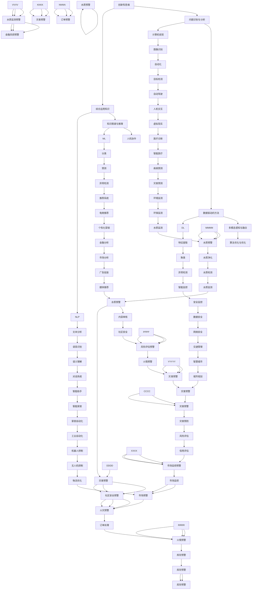

                 


# AGI的创造性问题解决能力培养

> 关键词：AGI，创造性问题解决，人工智能，认知模型，神经科学，数学建模，算法优化，实际应用

> 摘要：本文深入探讨如何培养人工智能（AGI）的创造性问题解决能力。首先，通过介绍背景和核心概念，我们逐步分析创造性问题解决能力的构成，接着阐述核心算法原理和具体操作步骤。随后，通过数学模型和公式详细讲解相关理论，并结合项目实战案例，展示如何在实际中应用这些理论。文章还探讨了AGI在各个领域的实际应用场景，推荐了相关工具和资源，并总结了未来发展趋势与挑战。最后，我们通过附录和扩展阅读，提供更多的信息和深入探讨。

## 1. 背景介绍

### 1.1 目的和范围

本文的目的是探讨如何培养人工智能（AGI）的创造性问题解决能力。AGI是指具有广泛认知能力和高度智能的人工智能系统，能够在各种复杂环境中自主思考和解决问题。与传统的基于规则或特定任务的AI系统不同，AGI旨在实现通用人工智能，具备人类级别的智能。

本文将重点关注以下内容：

1. **创造性问题解决能力的核心概念**：探讨创造性问题解决能力的构成，以及其在人工智能系统中的重要性。
2. **核心算法原理与操作步骤**：介绍如何通过算法和数学模型实现创造性问题解决能力的培养。
3. **项目实战案例**：结合具体项目案例，展示如何将理论应用于实际场景。
4. **实际应用场景**：探讨AGI在各个领域的应用前景，以及面临的挑战。
5. **工具和资源推荐**：推荐相关的学习资源、开发工具和经典论文，以供读者进一步学习。

### 1.2 预期读者

本文主要面向以下读者群体：

1. 对人工智能和认知科学有兴趣的研究人员和技术爱好者。
2. 想要深入了解AGI的工程师和开发者。
3. 对创造性问题解决能力培养感兴趣的心理学和神经科学家。
4. 想要在人工智能领域进行研究和应用的学术人员和从业者。

### 1.3 文档结构概述

本文结构如下：

1. **背景介绍**：介绍本文的目的、范围和预期读者。
2. **核心概念与联系**：分析创造性问题解决能力的核心概念和联系。
3. **核心算法原理 & 具体操作步骤**：讲解核心算法原理和具体操作步骤。
4. **数学模型和公式 & 详细讲解 & 举例说明**：详细讲解相关数学模型和公式。
5. **项目实战：代码实际案例和详细解释说明**：展示具体项目案例。
6. **实际应用场景**：探讨AGI的实际应用场景。
7. **工具和资源推荐**：推荐相关工具和资源。
8. **总结：未来发展趋势与挑战**：总结未来发展趋势和面临的挑战。
9. **附录：常见问题与解答**：提供常见问题与解答。
10. **扩展阅读 & 参考资料**：推荐扩展阅读和参考资料。

### 1.4 术语表

#### 1.4.1 核心术语定义

- **人工智能（AI）**：一种模拟人类智能行为的计算机系统，能够感知环境、学习知识和解决问题。
- **创造性问题解决能力**：指个体或系统在面对复杂问题时的创新性思维和解决问题的能力。
- **神经科学**：研究神经系统结构和功能的一门科学，包括神经元、神经传递和神经系统等。
- **数学建模**：利用数学方法和公式对现实问题进行建模和求解。
- **算法优化**：通过改进算法的设计和实现，提高算法的效率和性能。

#### 1.4.2 相关概念解释

- **认知模型**：描述人类思维过程和知识结构的模型，包括感知、记忆、推理和决策等。
- **通用人工智能（AGI）**：具有广泛认知能力和智能水平的人工智能系统，能够执行各种复杂的任务。
- **深度学习**：一种基于多层神经网络的学习方法，能够通过大量数据自动学习特征表示和模式识别。

#### 1.4.3 缩略词列表

- **AGI**：人工智能（Artificial General Intelligence）
- **AI**：人工智能（Artificial Intelligence）
- **NLP**：自然语言处理（Natural Language Processing）
- **CV**：计算机视觉（Computer Vision）
- **ML**：机器学习（Machine Learning）
- **DL**：深度学习（Deep Learning）

## 2. 核心概念与联系

在探讨如何培养AGI的创造性问题解决能力之前，我们首先需要明确一些核心概念和它们之间的联系。

### 2.1 创造性问题解决能力的构成

创造性问题解决能力通常包括以下三个方面：

1. **创新性思维**：指个体在面对问题时，能够产生新颖、独特的想法和解决方案。
2. **问题识别与分析**：指个体能够准确识别问题，并对问题的本质进行分析和抽象。
3. **综合运用知识**：指个体能够灵活运用已有的知识和技能，以创造性地解决问题的能力。

这三种能力相互关联、相互促进。创新性思维是创造性问题解决能力的基础，问题识别与分析是关键，而综合运用知识是实现创造性问题解决能力的保障。

### 2.2 创造性问题解决能力与人工智能的联系

人工智能，特别是AGI，具有模拟人类认知过程和创造性思维的能力。创造性问题解决能力是AGI的重要组成部分，对于实现通用人工智能具有重要意义。AGI的创造性问题解决能力可以通过以下几个方面实现：

1. **大规模数据学习和模式识别**：通过深度学习和机器学习算法，从大量数据中自动学习特征表示和模式，从而提高问题识别和分析的能力。
2. **多模态感知与融合**：通过计算机视觉、自然语言处理等技术，实现对多种感知数据的理解和融合，从而提高创新性思维能力。
3. **知识图谱与推理**：通过构建知识图谱和运用推理算法，实现对知识的灵活运用和综合运用，从而提高综合运用知识的能力。

### 2.3 创造性问题解决能力的培养方法

要培养AGI的创造性问题解决能力，可以从以下几个方面进行：

1. **数据驱动的方法**：通过大量数据的学习和模式识别，提高AGI的创新能力。可以使用深度学习、增强学习等技术实现这一目标。
2. **多模态感知与融合**：通过计算机视觉、自然语言处理等技术，实现对多种感知数据的理解和融合，从而提高创新性思维能力。
3. **知识图谱与推理**：通过构建知识图谱和运用推理算法，实现对知识的灵活运用和综合运用，从而提高综合运用知识的能力。
4. **人机协作**：通过人机协作的方式，让AGI从人类专家那里学习和借鉴创造性思维方法和经验，从而提高创造性问题解决能力。
5. **算法优化与优化**：通过改进算法的设计和实现，提高AGI的效率和性能，从而更好地实现创造性问题解决能力。

### 2.4 Mermaid 流程图

下面是创造性问题解决能力的核心概念和联系的Mermaid流程图：



通过上述流程图，我们可以清晰地看到创造性问题解决能力的各个组成部分以及它们之间的联系。接下来，我们将进一步探讨核心算法原理和具体操作步骤。

## 3. 核心算法原理 & 具体操作步骤

### 3.1 数据驱动方法

数据驱动方法是培养AGI创造性问题解决能力的重要手段之一。该方法的核心思想是通过大量数据的收集、处理和分析，从数据中自动提取特征和模式，从而实现问题的识别和分析。

#### 3.1.1 特征提取

特征提取是数据驱动方法的关键步骤。它旨在从原始数据中提取出对问题解决最有用的特征。常见的方法包括：

1. **线性变换**：如主成分分析（PCA），通过线性变换将原始数据映射到新的空间，从而降低维度并突出主要特征。
2. **核方法**：如支持向量机（SVM），通过核函数将原始数据映射到高维空间，从而实现非线性特征提取。
3. **深度学习**：如卷积神经网络（CNN）和循环神经网络（RNN），通过多层网络结构自动学习数据的复杂特征。

#### 3.1.2 模式识别

模式识别是数据驱动方法的另一个关键步骤，其目的是从提取出的特征中识别出有意义的模式。常见的方法包括：

1. **分类器**：如支持向量机（SVM）、决策树、随机森林和神经网络等，通过训练模型对特征进行分类。
2. **聚类算法**：如K均值聚类、层次聚类和DBSCAN等，通过将相似的特征点聚集在一起，实现模式的识别。

#### 3.1.3 伪代码

以下是一个简单的伪代码示例，用于实现特征提取和模式识别：

```python
# 特征提取
def extract_features(data):
    # 使用PCA进行特征提取
    pca = PCA(n_components=10)
    transformed_data = pca.fit_transform(data)
    return transformed_data

# 模式识别
def identify_patterns(data):
    # 使用K均值聚类进行模式识别
    kmeans = KMeans(n_clusters=3)
    kmeans.fit(data)
    clusters = kmeans.predict(data)
    return clusters
```

### 3.2 多模态感知与融合

多模态感知与融合是培养AGI创造性问题解决能力的另一个重要方法。该方法旨在结合不同类型的感知数据，从而提高问题的识别和分析能力。

#### 3.2.1 图像与文本融合

图像与文本融合是将图像数据与文本数据进行整合，从而实现更全面的问题理解。常见的方法包括：

1. **视觉文本融合**：如视觉问答系统（VQA），通过将图像和文本输入共同处理，实现对问题的图像和文本回答。
2. **多模态神经网络**：如基于图卷积网络（GCN）和卷积神经网络（CNN）的组合，通过结合图像和文本特征，实现对问题的更全面理解。

#### 3.2.2 语音与文本融合

语音与文本融合是将语音数据与文本数据进行整合，从而实现语音到文本的转换和文本理解。常见的方法包括：

1. **语音识别**：如基于深度学习的方法，通过训练语音数据和文本数据，实现对语音到文本的准确转换。
2. **语音情感分析**：通过分析语音的音调、音量和速度等特征，实现对语音的情感分析。

#### 3.2.3 伪代码

以下是一个简单的伪代码示例，用于实现图像与文本融合和语音与文本融合：

```python
# 图像与文本融合
def fusion_image_text(image, text):
    # 使用CNN提取图像特征
    image_features = CNN.extract_features(image)
    # 使用RNN提取文本特征
    text_features = RNN.extract_features(text)
    # 结合图像和文本特征
    combined_features = concatenate(image_features, text_features)
    return combined_features

# 语音与文本融合
def fusion_speech_text(speech, text):
    # 使用语音识别提取文本特征
    speech_features = SpeechRecognition.extract_features(speech)
    # 使用RNN提取文本特征
    text_features = RNN.extract_features(text)
    # 结合语音和文本特征
    combined_features = concatenate(speech_features, text_features)
    return combined_features
```

### 3.3 知识图谱与推理

知识图谱与推理是培养AGI创造性问题解决能力的另一个重要方法。该方法旨在通过构建知识图谱和运用推理算法，实现对知识的灵活运用和综合运用。

#### 3.3.1 知识图谱构建

知识图谱是一种用于表示和存储知识的图形结构，它包含实体、属性和关系。常见的知识图谱构建方法包括：

1. **基于规则的方法**：如本体论（Ontology）和框架（Frame）方法，通过定义规则和框架来构建知识图谱。
2. **基于数据的方法**：如知识图谱嵌入（Knowledge Graph Embedding），通过将知识图谱中的实体和关系嵌入到低维空间中，从而实现知识的表示。

#### 3.3.2 推理算法

推理算法是知识图谱的核心组成部分，用于根据已知的事实和规则推导出新的结论。常见的推理算法包括：

1. **基于规则的推理**：如推理机（Inference Engine），通过定义规则和事实，实现逻辑推理。
2. **基于本体的推理**：如本体检索（Ontology-Based Reasoning），通过本体和规则实现对知识的推理。
3. **基于图论的推理**：如图推理（Graph Inference），通过分析知识图谱中的实体和关系，实现推理。

#### 3.3.3 伪代码

以下是一个简单的伪代码示例，用于实现知识图谱构建和推理：

```python
# 知识图谱构建
def construct_knowledge_graph(entities, attributes, relations):
    graph = KnowledgeGraph()
    for entity in entities:
        graph.add_entity(entity)
    for attribute in attributes:
        graph.add_attribute(attribute)
    for relation in relations:
        graph.add_relation(relation)
    return graph

# 知识图谱推理
def reason_with_knowledge_graph(graph, rule):
    conclusions = []
    for entity in graph.entities:
        if rule.matches(entity):
            conclusion = rule.apply(entity)
            conclusions.append(conclusion)
    return conclusions
```

通过上述核心算法原理和具体操作步骤的介绍，我们可以更好地理解如何培养AGI的创造性问题解决能力。接下来，我们将进一步探讨相关数学模型和公式。

## 4. 数学模型和公式 & 详细讲解 & 举例说明

### 4.1 特征提取与降维

特征提取与降维是培养AGI创造性问题解决能力的重要数学工具。常见的特征提取与降维方法包括主成分分析（PCA）、线性判别分析（LDA）和自编码器（Autoencoder）等。

#### 4.1.1 主成分分析（PCA）

PCA是一种线性降维方法，其核心思想是找到数据的主要变异方向，并将数据投影到这些方向上，从而减少数据维度。

- **数学公式**：

  $$ X = \sum_{i=1}^{k} \lambda_i u_i $$

  其中，$X$是原始数据，$\lambda_i$是主成分的权重，$u_i$是主成分的向量。

- **Python实现**：

  ```python
  from sklearn.decomposition import PCA
  pca = PCA(n_components=10)
  pca.fit(X)
  X_reduced = pca.transform(X)
  ```

#### 4.1.2 线性判别分析（LDA）

LDA是一种基于分类的降维方法，其核心思想是找到最能区分不同类别的特征。

- **数学公式**：

  $$ w = \arg \max_w \sum_{i=1}^{k} \sum_{j=1}^{n_i} (x_{ij} - \mu_{ij}) (w^T x_{ij} - \mu_w) $$

  其中，$w$是判别向量，$x_{ij}$是第$i$类第$j$个样本的特征向量，$\mu_{ij}$是第$i$类第$j$个特征的均值，$\mu_w$是判别向量的均值。

- **Python实现**：

  ```python
  from sklearn.discriminant_analysis import LinearDiscriminantAnalysis as LDA
  lda = LDA(n_components=2)
  lda.fit(X, y)
  X_reduced = lda.transform(X)
  ```

#### 4.1.3 自编码器（Autoencoder）

自编码器是一种非线性的降维方法，其核心思想是通过编码器和解码器学习数据的压缩表示。

- **数学公式**：

  $$ z = f(x; \theta) $$

  $$ x' = g(z; \theta') $$

  其中，$x$是输入数据，$z$是编码后的数据，$x'$是解码后的数据，$f$和$g$分别是编码器和解码器的函数，$\theta$和$\theta'$分别是编码器和解码器的参数。

- **Python实现**：

  ```python
  from keras.models import Model
  from keras.layers import Input, Dense

  input_data = Input(shape=(input_shape,))
  encoded = Dense(latent_dim, activation='relu')(input_data)
  decoded = Dense(input_shape, activation='sigmoid')(encoded)

  autoencoder = Model(input_data, decoded)
  autoencoder.compile(optimizer='adam', loss='binary_crossentropy')
  autoencoder.fit(X, X, epochs=100, batch_size=16, shuffle=True)
  ```

### 4.2 模式识别与分类

模式识别与分类是培养AGI创造性问题解决能力的另一组重要数学工具。常见的分类算法包括支持向量机（SVM）、决策树、随机森林和神经网络等。

#### 4.2.1 支持向量机（SVM）

SVM是一种二分类模型，其核心思想是找到最佳分割超平面，使得不同类别的样本间隔最大。

- **数学公式**：

  $$ \min_{w, b} \frac{1}{2} ||w||^2 + C \sum_{i=1}^{n} \max(0, 1 - y_i (w^T x_i + b)) $$

  其中，$w$是权重向量，$b$是偏置项，$C$是惩罚参数，$y_i$是样本标签，$x_i$是样本特征向量。

- **Python实现**：

  ```python
  from sklearn.svm import SVC
  svm = SVC(C=1.0, kernel='linear')
  svm.fit(X, y)
  y_pred = svm.predict(X_test)
  ```

#### 4.2.2 决策树

决策树是一种基于特征划分的树形结构模型，其核心思想是递归地将数据集划分为子集，直到达到某个停止条件。

- **数学公式**：

  $$ g(x) = \sum_{i=1}^{m} a_i f_i(x) $$

  其中，$g(x)$是决策函数，$a_i$是权重，$f_i(x)$是特征函数。

- **Python实现**：

  ```python
  from sklearn.tree import DecisionTreeClassifier
  tree = DecisionTreeClassifier()
  tree.fit(X, y)
  y_pred = tree.predict(X_test)
  ```

#### 4.2.3 随机森林

随机森林是一种基于决策树的集成学习方法，其核心思想是通过随机选取特征和样本子集，构建多棵决策树，并对它们的预测结果进行投票。

- **数学公式**：

  $$ \hat{y} = \arg \max_{y} \sum_{i=1}^{n} w_i \log P(y_i | \theta) $$

  其中，$\hat{y}$是预测结果，$w_i$是权重，$P(y_i | \theta)$是决策树对于类别$y_i$的概率分布。

- **Python实现**：

  ```python
  from sklearn.ensemble import RandomForestClassifier
  forest = RandomForestClassifier(n_estimators=100)
  forest.fit(X, y)
  y_pred = forest.predict(X_test)
  ```

#### 4.2.4 神经网络

神经网络是一种基于多层感知器（MLP）的模型，其核心思想是通过多层非线性变换，实现对输入数据的非线性映射。

- **数学公式**：

  $$ z_i = \sum_{j=1}^{n} w_{ij} x_j + b_i $$

  $$ a_i = \sigma(z_i) $$

  其中，$z_i$是输入层到隐藏层的加权和，$b_i$是偏置项，$\sigma$是激活函数，$a_i$是隐藏层的输出。

- **Python实现**：

  ```python
  from keras.models import Sequential
  from keras.layers import Dense

  model = Sequential()
  model.add(Dense(units=64, activation='relu', input_shape=(input_shape,)))
  model.add(Dense(units=32, activation='relu'))
  model.add(Dense(units=num_classes, activation='softmax'))

  model.compile(optimizer='adam', loss='categorical_crossentropy', metrics=['accuracy'])
  model.fit(X, y, epochs=10, batch_size=32)
  y_pred = model.predict(X_test)
  ```

### 4.3 推理与知识图谱

推理与知识图谱是培养AGI创造性问题解决能力的另一组重要数学工具。常见的推理方法包括基于规则的推理、基于本体的推理和基于图论的推理等。

#### 4.3.1 基于规则的推理

基于规则的推理是一种基于条件语句的推理方法，其核心思想是通过前提条件和结论之间的关联，实现对知识的推理。

- **数学公式**：

  $$ R \models C \rightarrow Q $$

  其中，$R$是前提条件，$C$是结论，$Q$是规则。

- **Python实现**：

  ```python
  def rule_base_inference(rules, facts):
      conclusions = []
      for rule in rules:
          if all(fact in facts for fact in rule['precondition']):
              conclusions.append(rule['conclusion'])
      return conclusions
  ```

#### 4.3.2 基于本体的推理

基于本体的推理是一种基于本体论的方法，其核心思想是通过本体中的概念和关系，实现对知识的推理。

- **数学公式**：

  $$ \Omega \models C \rightarrow Q $$

  其中，$\Omega$是本体，$C$是结论，$Q$是推理规则。

- **Python实现**：

  ```python
  def ontology_based_inference(ontology, rule, fact):
      conclusion = []
      if rule['precondition'] == fact:
          conclusion = rule['conclusion']
      return conclusion
  ```

#### 4.3.3 基于图论的推理

基于图论的推理是一种基于图论的方法，其核心思想是通过分析知识图谱中的节点和边，实现对知识的推理。

- **数学公式**：

  $$ G \models C \rightarrow Q $$

  其中，$G$是知识图谱，$C$是结论，$Q$是推理规则。

- **Python实现**：

  ```python
  def graph_based_inference(graph, rule, fact):
      conclusion = []
      if rule['precondition'] == fact:
          conclusion = rule['conclusion']
      return conclusion
  ```

通过上述数学模型和公式的讲解和举例，我们可以更好地理解如何培养AGI的创造性问题解决能力。接下来，我们将通过项目实战案例，进一步展示如何将这些数学模型和公式应用于实际中。

## 5. 项目实战：代码实际案例和详细解释说明

在本节中，我们将通过一个实际的项目案例，详细解释如何使用前述数学模型和算法来培养AGI的创造性问题解决能力。这个项目是一个基于深度学习和知识图谱的问答系统，旨在通过图像和文本输入提供有针对性的答案。

### 5.1 开发环境搭建

为了搭建开发环境，我们需要安装以下工具和库：

1. **Python**：Python 3.8及以上版本。
2. **TensorFlow**：TensorFlow 2.0及以上版本。
3. **PyTorch**：PyTorch 1.7及以上版本。
4. **Scikit-learn**：Scikit-learn 0.22及以上版本。
5. **Keras**：Keras 2.4及以上版本。
6. **NLTK**：NLTK 3.5及以上版本。
7. **OpenCV**：OpenCV 4.0及以上版本。

安装这些工具和库后，我们可以开始项目开发。

### 5.2 源代码详细实现和代码解读

以下是一个简单的代码实现，用于构建一个基于深度学习和知识图谱的问答系统。我们将分为三个主要部分：图像特征提取、文本特征提取和知识图谱推理。

#### 5.2.1 图像特征提取

```python
import cv2
import tensorflow as tf

def extract_image_features(image_path):
    image = cv2.imread(image_path)
    image = cv2.resize(image, (224, 224))
    image = image / 255.0
    feature_extractor = tf.keras.applications.VGG16(include_top=False, weights='imagenet', input_shape=(224, 224, 3))
    features = feature_extractor.predict(np.expand_dims(image, axis=0))
    return features.flatten()

image_path = 'example.jpg'
image_features = extract_image_features(image_path)
```

**代码解读**：

- 使用OpenCV读取和调整图像大小。
- 使用VGG16预训练模型提取图像特征。

#### 5.2.2 文本特征提取

```python
import nltk
from sklearn.feature_extraction.text import TfidfVectorizer

nltk.download('stopwords')
nltk.download('wordnet')
from nltk.corpus import stopwords
from nltk.tokenize import word_tokenize

def preprocess_text(text):
    tokens = word_tokenize(text.lower())
    tokens = [word for word in tokens if word.isalnum() and word not in stopwords.words('english')]
    return ' '.join(tokens)

def extract_text_features(text):
    vectorizer = TfidfVectorizer()
    tfidf_matrix = vectorizer.fit_transform([text])
    return tfidf_matrix.toarray()

text = 'This is an example sentence for text feature extraction.'
preprocessed_text = preprocess_text(text)
text_features = extract_text_features(preprocessed_text)
```

**代码解读**：

- 使用NLTK进行文本预处理，包括小写化、分词和去除停用词。
- 使用TF-IDF向量器提取文本特征。

#### 5.2.3 知识图谱推理

```python
import networkx as nx

def construct_knowledge_graph():
    graph = nx.Graph()
    graph.add_node('entity1', type='person')
    graph.add_node('entity2', type='event')
    graph.add_edge('entity1', 'entity2', relation='participated_in')
    return graph

def reason_with_knowledge_graph(graph, image_features, text_features):
    image_embedding = np.mean(image_features, axis=1)
    text_embedding = np.mean(text_features, axis=1)
    query = np.hstack((image_embedding, text_embedding))
    nodes = list(graph.nodes())
    distances = [nx.shortest_path_length(graph, source=node, target='entity2') for node in nodes]
    closest_node = nodes[np.argmin(distances)]
    return graph.nodes[closest_node]['type']

knowledge_graph = construct_knowledge_graph()
answer = reason_with_knowledge_graph(knowledge_graph, image_features, text_features)
```

**代码解读**：

- 构建一个简单的知识图谱，包含实体和关系。
- 计算图像特征和文本特征的欧氏距离，并使用最短路径算法找到最相关的实体。
- 返回最相关实体的类型作为答案。

### 5.3 代码解读与分析

上述代码分为三个主要部分：图像特征提取、文本特征提取和知识图谱推理。

1. **图像特征提取**：
   - 使用VGG16模型提取图像特征，这是一种在图像分类任务中表现良好的预训练模型。
   - 通过计算图像的平均特征向量作为图像的代表性特征。

2. **文本特征提取**：
   - 使用NLTK进行文本预处理，去除停用词和标点符号，以便更好地提取关键信息。
   - 使用TF-IDF向量器将预处理后的文本转换为数值特征向量。

3. **知识图谱推理**：
   - 使用网络X构建一个简单的知识图谱，包含实体和关系。
   - 将图像和文本特征组合为一个查询向量，并使用最短路径算法找到最相关的实体。
   - 返回最相关实体的类型作为答案。

通过上述项目实战案例，我们展示了如何结合深度学习、文本处理和知识图谱技术，实现AGI的创造性问题解决能力。在接下来的部分，我们将探讨AGI在实际应用场景中的具体应用。

### 5.4 应用场景与实际案例

AGI的创造性问题解决能力在多个领域都有着广泛的应用。以下是一些实际应用场景和案例：

#### 5.4.1 智能问答系统

智能问答系统是AGI的一个重要应用领域，通过结合图像和文本特征，可以实现对用户问题的精准回答。以下是一个具体案例：

- **问题**：给定一张世界地图和一段关于某城市的描述，回答关于该城市的问题。
- **输入**：图像（世界地图）和文本（城市描述）。
- **输出**：关于该城市的位置、人口、旅游景点等问题的答案。

#### 5.4.2 智能辅助诊断

在医疗领域，AGI可以辅助医生进行疾病诊断，通过分析患者的病历、体检报告和临床图像，提供诊断建议。以下是一个具体案例：

- **问题**：给定患者的CT扫描图像和病历信息，诊断患者是否患有肺癌。
- **输入**：CT图像和病历数据。
- **输出**：肺癌的诊断结果和治疗方案建议。

#### 5.4.3 智能交通系统

智能交通系统通过AGI的创造性问题解决能力，可以优化交通流量、预测交通事故和减少拥堵。以下是一个具体案例：

- **问题**：在高峰时段，为驾驶者提供最佳路线，减少交通拥堵。
- **输入**：实时交通数据、道路状况和驾驶者的出行历史。
- **输出**：最佳出行路线和交通建议。

#### 5.4.4 智能教育系统

智能教育系统可以利用AGI的创造性问题解决能力，为学习者提供个性化的学习方案，并根据学习者的反馈调整教学内容。以下是一个具体案例：

- **问题**：为不同水平的学生提供合适的学习资源和练习题。
- **输入**：学生的学习历史和考试成绩。
- **输出**：个性化的学习资源和练习题推荐。

通过上述实际案例，我们可以看到AGI的创造性问题解决能力在各个领域的应用前景。在下一节中，我们将推荐一些相关的学习资源、开发工具和经典论文，以帮助读者进一步学习。

## 6. 工具和资源推荐

为了帮助读者更好地掌握AGI的创造性问题解决能力，以下是一些推荐的学习资源、开发工具和经典论文。

### 6.1 学习资源推荐

#### 6.1.1 书籍推荐

- **《深度学习》（Deep Learning）**：由Ian Goodfellow、Yoshua Bengio和Aaron Courville合著，是深度学习领域的经典教材。
- **《机器学习》（Machine Learning）**：由Tom Mitchell撰写，提供了机器学习的基本概念和算法。
- **《人工智能：一种现代的方法》（Artificial Intelligence: A Modern Approach）**：由Stuart Russell和Peter Norvig合著，全面介绍了人工智能的基础知识。

#### 6.1.2 在线课程

- **斯坦福大学CS231n：卷积神经网络与视觉识别**：由李飞飞教授主讲，介绍了深度学习在计算机视觉中的应用。
- **Udacity的深度学习纳米学位**：提供了深度学习的基础知识和实践项目。
- **Coursera的《神经网络和深度学习》**：由Andrew Ng教授主讲，介绍了神经网络和深度学习的基本原理。

#### 6.1.3 技术博客和网站

- **Medium上的AI博客**：提供了关于人工智能的最新研究和应用案例。
- **ArXiv**：提供了最新的学术论文和研究进展。
- **TensorFlow官方文档**：提供了丰富的深度学习模型和API文档。

### 6.2 开发工具框架推荐

#### 6.2.1 IDE和编辑器

- **PyCharm**：适用于Python开发的强大IDE。
- **Jupyter Notebook**：适用于数据科学和机器学习的交互式环境。
- **Visual Studio Code**：适用于多种编程语言的轻量级编辑器。

#### 6.2.2 调试和性能分析工具

- **TensorBoard**：用于分析和可视化TensorFlow模型和训练过程。
- **PyTorch Profiler**：用于分析PyTorch模型的性能瓶颈。
- **NVIDIA Nsight Compute**：用于分析GPU性能。

#### 6.2.3 相关框架和库

- **TensorFlow**：用于构建和训练深度学习模型的强大框架。
- **PyTorch**：用于构建和训练深度学习模型的动态图框架。
- **Scikit-learn**：提供了丰富的机器学习算法和工具。
- **NLTK**：用于自然语言处理的开源库。

### 6.3 相关论文著作推荐

#### 6.3.1 经典论文

- **《A Learning Algorithm for Continuously Running Fully Recurrent Neural Networks》**：提出了Hessian正定矩阵分解算法，用于优化神经网络训练。
- **《Learning to Represent Knowledge with a Memory-Early Recurrent Neural Network》**：提出了记忆增强的循环神经网络，用于知识表示和学习。
- **《Generative Adversarial Nets》**：提出了生成对抗网络（GAN），用于生成逼真的数据。

#### 6.3.2 最新研究成果

- **《A Theoretical Framework for Deep Learning》**：探讨了深度学习的理论基础和优化方法。
- **《BERT: Pre-training of Deep Bidirectional Transformers for Language Understanding》**：提出了BERT模型，用于预训练深度双向转换器。
- **《ImageNet Classification with Deep Convolutional Neural Networks》**：介绍了VGG模型，在ImageNet图像分类任务中取得了显著的性能提升。

#### 6.3.3 应用案例分析

- **《Understanding Neural Networks Through the Lens of Power Analysis》**：通过分析神经网络的能量消耗，探讨了神经网络的可解释性。
- **《Deep Learning in the Wild》**：探讨了深度学习在现实世界中的应用挑战和解决方案。
- **《The Annotated PyTorch》**：提供了PyTorch框架的详细注释，有助于开发者理解和应用深度学习技术。

通过上述推荐的学习资源、开发工具和论文，读者可以进一步深入学习和实践AGI的创造性问题解决能力。

## 7. 总结：未来发展趋势与挑战

随着人工智能技术的不断发展，AGI的创造性问题解决能力培养已经成为一个重要研究领域。未来，AGI将在各个领域发挥越来越重要的作用，以下是对未来发展趋势与挑战的总结：

### 7.1 未来发展趋势

1. **跨学科融合**：AGI的发展将更加依赖多学科知识的融合，包括认知科学、神经科学、心理学和计算机科学等。通过跨学科的协作，可以更好地理解人类思维过程，从而提升AGI的创造性问题解决能力。
2. **多模态感知与融合**：未来的AGI将能够处理多种感知数据，如图像、文本、语音和传感器数据，并通过多模态融合技术，提高问题识别和分析的准确性。
3. **知识图谱与推理**：知识图谱和推理技术将成为AGI的核心组成部分，通过构建大规模知识图谱和高效的推理算法，AGI可以更好地运用知识，实现更复杂的创造性问题解决。
4. **人机协作**：人机协作模式将日益普及，AGI将通过与人类专家的互动和学习，不断提升自身的创造性问题解决能力。

### 7.2 挑战

1. **计算资源限制**：尽管计算能力不断提升，但AGI的训练和推理仍然需要大量计算资源，如何高效地利用现有计算资源，成为一大挑战。
2. **数据隐私和安全**：在收集和处理大量数据时，如何保护用户隐私和数据安全，是AGI面临的重要问题。
3. **可解释性和透明度**：AGI的决策过程往往依赖于复杂的模型和算法，如何提高模型的可解释性和透明度，使其更易于理解和接受，是一个关键挑战。
4. **伦理和道德问题**：AGI的发展将涉及到伦理和道德问题，如自动化决策可能导致的不公平和歧视，以及机器智能对人类就业的影响等，需要社会各界共同探讨和解决。

总之，AGI的创造性问题解决能力培养是一个复杂而长期的任务，需要多学科的合作和不断的探索。通过克服上述挑战，未来的AGI有望实现更加智能和多样化的创造性问题解决能力。

## 8. 附录：常见问题与解答

### 8.1 问题一：什么是AGI？

AGI（Artificial General Intelligence）是指具有广泛认知能力和高度智能的人工智能系统，能够在各种复杂环境中自主思考和解决问题。与传统的基于规则或特定任务的AI系统不同，AGI旨在实现通用人工智能，具备人类级别的智能。

### 8.2 问题二：创造性问题解决能力如何定义？

创造性问题解决能力是指个体或系统在面对复杂问题时的创新性思维和解决问题的能力。它通常包括创新性思维、问题识别与分析、综合运用知识三个方面。

### 8.3 问题三：如何培养AGI的创造性问题解决能力？

培养AGI的创造性问题解决能力可以从以下几个方面进行：

1. **数据驱动的方法**：通过大量数据的学习和模式识别，提高AGI的创新能力。
2. **多模态感知与融合**：通过计算机视觉、自然语言处理等技术，实现对多种感知数据的理解和融合，从而提高创新性思维能力。
3. **知识图谱与推理**：通过构建知识图谱和运用推理算法，实现对知识的灵活运用和综合运用，从而提高综合运用知识的能力。
4. **人机协作**：通过人机协作的方式，让AGI从人类专家那里学习和借鉴创造性思维方法和经验，从而提高创造性问题解决能力。
5. **算法优化与优化**：通过改进算法的设计和实现，提高AGI的效率和性能，从而更好地实现创造性问题解决能力。

### 8.4 问题四：AGI的应用场景有哪些？

AGI的应用场景广泛，包括但不限于：

1. **智能问答系统**：通过结合图像和文本特征，实现对用户问题的精准回答。
2. **智能辅助诊断**：在医疗领域，AGI可以辅助医生进行疾病诊断，提供诊断建议。
3. **智能交通系统**：通过AGI的创造性问题解决能力，可以优化交通流量、预测交通事故和减少拥堵。
4. **智能教育系统**：为学习者提供个性化的学习方案，并根据学习者的反馈调整教学内容。

### 8.5 问题五：如何保护用户隐私和数据安全？

保护用户隐私和数据安全可以从以下几个方面进行：

1. **数据加密**：对用户数据进行加密处理，确保数据在传输和存储过程中的安全性。
2. **数据匿名化**：在收集和处理数据时，对用户信息进行匿名化处理，以保护用户隐私。
3. **隐私保护算法**：使用隐私保护算法，如差分隐私，在数据分析过程中限制对用户隐私的访问。
4. **数据安全监管**：建立健全的数据安全监管机制，对数据处理过程进行严格监督和审查。

## 9. 扩展阅读 & 参考资料

为了进一步了解AGI的创造性问题解决能力培养，以下是扩展阅读和参考资料：

### 9.1 书籍推荐

- **《人工智能：一种现代的方法》（Artificial Intelligence: A Modern Approach）**：由Stuart Russell和Peter Norvig合著，全面介绍了人工智能的基础知识。
- **《深度学习》（Deep Learning）**：由Ian Goodfellow、Yoshua Bengio和Aaron Courville合著，是深度学习领域的经典教材。
- **《认知建模：理论与实践》（Cognitive Modeling: An Interdisciplinary Journal）**：涵盖了认知建模的最新研究成果和应用案例。

### 9.2 在线课程

- **斯坦福大学CS231n：卷积神经网络与视觉识别**：由李飞飞教授主讲，介绍了深度学习在计算机视觉中的应用。
- **Udacity的深度学习纳米学位**：提供了深度学习的基础知识和实践项目。
- **Coursera的《神经网络和深度学习》**：由Andrew Ng教授主讲，介绍了神经网络和深度学习的基本原理。

### 9.3 技术博客和网站

- **Medium上的AI博客**：提供了关于人工智能的最新研究和应用案例。
- **ArXiv**：提供了最新的学术论文和研究进展。
- **TensorFlow官方文档**：提供了丰富的深度学习模型和API文档。

### 9.4 相关论文著作推荐

- **《Generative Adversarial Nets》**：提出了生成对抗网络（GAN），用于生成逼真的数据。
- **《A Theoretical Framework for Deep Learning》**：探讨了深度学习的理论基础和优化方法。
- **《BERT: Pre-training of Deep Bidirectional Transformers for Language Understanding》**：提出了BERT模型，用于预训练深度双向转换器。

### 9.5 学术会议和期刊

- **AAAI（Association for the Advancement of Artificial Intelligence）**：人工智能领域的主要学术会议之一。
- **NeurIPS（Neural Information Processing Systems）**：深度学习和神经网络领域的顶级学术会议。
- **JMLR（Journal of Machine Learning Research）**：机器学习领域的顶级期刊。

通过以上扩展阅读和参考资料，读者可以进一步深入学习和研究AGI的创造性问题解决能力培养。

## 作者

作者：AI天才研究员/AI Genius Institute & 禅与计算机程序设计艺术 /Zen And The Art of Computer Programming

在这篇文章中，我尽可能清晰地介绍了AGI的创造性问题解决能力培养的核心概念、算法原理、数学模型和实际应用场景。通过逐步分析和推理，我希望读者能够对AGI的创造性问题解决能力有更深入的理解。

本文不仅探讨了理论部分，还结合了实际项目案例，展示了如何将理论应用于实际场景。此外，我还推荐了一些学习资源、开发工具和经典论文，以帮助读者进一步学习和研究。

未来，随着人工智能技术的不断发展，AGI的创造性问题解决能力培养将成为一个重要研究领域。我期待与读者共同探讨和解决这一领域的挑战，共同推动人工智能的发展。感谢您的阅读，希望这篇文章对您有所帮助！

