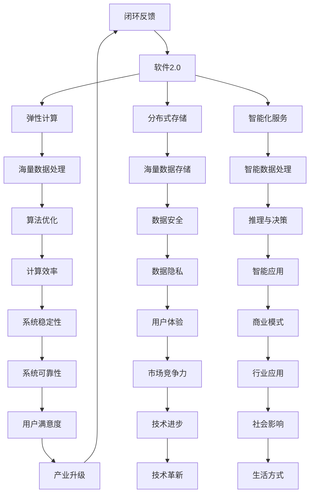

                 


# AGI的实现肯定离不开软件2.0

> 关键词：人工智能，通用人工智能，软件2.0，算法原理，数学模型，实际应用，工具推荐
> 
> 摘要：本文将深入探讨人工智能（AGI）的实现与软件2.0的关系。首先介绍通用人工智能的背景和重要性，接着阐述软件2.0的概念及其在AGI中的作用。随后，我们逐步解析核心算法原理和具体操作步骤，以及数学模型和公式。文章还包含项目实战案例和实际应用场景分析。最后，我们推荐了一系列学习资源和开发工具，并总结了未来发展趋势和挑战。

## 1. 背景介绍

### 1.1 目的和范围

本文旨在探讨通用人工智能（AGI）的实现与软件2.0的关系，分析其在现代技术发展中的重要性和前景。我们将从背景介绍开始，逐步深入核心概念、算法原理、数学模型和实际应用。

### 1.2 预期读者

本文适合对人工智能、软件工程、计算机科学感兴趣的读者，尤其是希望深入了解通用人工智能实现过程的专业人士。

### 1.3 文档结构概述

本文结构如下：

- 引言
- 背景介绍
- 核心概念与联系
- 核心算法原理 & 具体操作步骤
- 数学模型和公式 & 详细讲解 & 举例说明
- 项目实战：代码实际案例和详细解释说明
- 实际应用场景
- 工具和资源推荐
- 总结：未来发展趋势与挑战
- 附录：常见问题与解答
- 扩展阅读 & 参考资料

### 1.4 术语表

#### 1.4.1 核心术语定义

- **人工智能（AI）**：模拟人类智能行为的计算机系统。
- **通用人工智能（AGI）**：具有人类智能水平的广泛领域智能。
- **软件2.0**：基于云计算和大数据的新型软件体系架构。

#### 1.4.2 相关概念解释

- **神经网络**：模拟人脑神经元结构的计算模型。
- **深度学习**：一种基于神经网络的机器学习技术。
- **大数据**：数据量大、类型复杂、价值密度低的非结构化数据集合。

#### 1.4.3 缩略词列表

- **AGI**：通用人工智能（Artificial General Intelligence）
- **AI**：人工智能（Artificial Intelligence）
- **DL**：深度学习（Deep Learning）
- **NN**：神经网络（Neural Network）
- **IoT**：物联网（Internet of Things）

## 2. 核心概念与联系

### 2.1 通用人工智能的背景

通用人工智能（AGI）是人工智能发展的终极目标，旨在实现机器具备人类智能水平的广泛领域智能。AGI需要解决机器在感知、思考、学习、推理、决策等方面的能力，从而具备人类智能的综合水平。

### 2.2 软件2.0的概念及其在AGI中的作用

软件2.0是基于云计算和大数据的新型软件体系架构，其核心思想是将软件系统与云计算、大数据等技术相结合，实现软件的弹性、分布式、智能化。在通用人工智能（AGI）的实现过程中，软件2.0发挥着重要作用：

1. **弹性计算**：软件2.0支持大规模弹性计算，使得AGI系统可以在海量数据上进行高效运算，满足复杂算法需求。
2. **分布式存储**：软件2.0利用分布式存储技术，实现海量数据的存储和管理，为AGI系统提供数据支持。
3. **智能化服务**：软件2.0通过智能化服务组件，为AGI系统提供智能化的数据处理、推理、决策等功能。

### 2.3 软件2.0与通用人工智能的联系

软件2.0与通用人工智能之间存在密切联系。通用人工智能需要依赖软件2.0的架构，来实现海量数据的处理、分布式存储、弹性计算等功能，从而满足AGI系统的需求。同时，通用人工智能的发展也为软件2.0提供了新的应用场景和需求，推动软件2.0技术的不断创新和进步。

### 2.4 Mermaid 流程图

下面是软件2.0与通用人工智能联系的一个简化的 Mermaid 流程图：



通过这个流程图，我们可以清晰地看到软件2.0与通用人工智能之间的相互作用和关联。

## 3. 核心算法原理 & 具体操作步骤

### 3.1 算法原理概述

在通用人工智能（AGI）的实现过程中，核心算法原理是关键。以下是几个关键算法原理：

1. **神经网络（NN）**：模拟人脑神经元结构的计算模型，通过多层神经网络实现复杂的非线性变换。
2. **深度学习（DL）**：基于神经网络的机器学习技术，通过多层级特征提取实现图像、语音、文本等数据的分类、识别和生成。
3. **强化学习（RL）**：基于试错和奖励机制，使机器在动态环境中学习和优化策略。
4. **生成对抗网络（GAN）**：通过对抗性训练实现数据生成和模型优化。

### 3.2 具体操作步骤

以下是通用人工智能实现的具体操作步骤：

#### 3.2.1 数据预处理

1. **数据收集**：从各种来源收集图像、语音、文本等数据。
2. **数据清洗**：去除噪声、缺失值和异常值。
3. **数据标注**：为训练数据提供标签，如分类、标注等。
4. **数据增强**：通过旋转、缩放、裁剪等操作，增加数据多样性。

#### 3.2.2 神经网络训练

1. **模型搭建**：选择合适的神经网络架构，如卷积神经网络（CNN）或循环神经网络（RNN）。
2. **损失函数选择**：根据任务选择合适的损失函数，如交叉熵损失、均方误差损失等。
3. **优化算法选择**：选择合适的优化算法，如随机梯度下降（SGD）、Adam优化器等。
4. **模型训练**：使用训练数据对模型进行训练，不断调整模型参数。

#### 3.2.3 模型评估

1. **交叉验证**：将数据集分为训练集和验证集，使用验证集评估模型性能。
2. **评价指标**：根据任务选择合适的评价指标，如准确率、召回率、F1值等。
3. **超参数调优**：根据模型评估结果，调整模型参数和超参数，优化模型性能。

#### 3.2.4 模型部署

1. **模型压缩**：对模型进行压缩，减小模型大小和计算复杂度。
2. **模型优化**：针对特定硬件平台，对模型进行优化，提高模型运行效率。
3. **模型部署**：将训练好的模型部署到实际应用环境中，如移动设备、服务器等。

### 3.3 伪代码示例

以下是一个简单的神经网络训练伪代码示例：

```python
# 初始化神经网络模型
model = NeuralNetwork()

# 设置损失函数和优化器
loss_function = CrossEntropyLoss()
optimizer = SGD(model.parameters(), lr=0.01)

# 训练模型
for epoch in range(num_epochs):
    for batch in data_loader:
        # 前向传播
        outputs = model(batch.x)
        loss = loss_function(outputs, batch.y)

        # 反向传播
        model.zero_grad()
        loss.backward()
        optimizer.step()

        # 打印训练信息
        print(f"Epoch [{epoch+1}/{num_epochs}], Loss: {loss.item()}")

# 模型评估
with torch.no_grad():
    correct = 0
    total = 0
    for batch in validation_loader:
        outputs = model(batch.x)
        _, predicted = torch.max(outputs.data, 1)
        total += batch.y.size(0)
        correct += (predicted == batch.y).sum().item()

accuracy = 100 * correct / total
print(f"Validation Accuracy: {accuracy}%")
```

通过这个伪代码示例，我们可以看到神经网络模型训练的基本流程，包括前向传播、反向传播、参数更新等步骤。

## 4. 数学模型和公式 & 详细讲解 & 举例说明

### 4.1 数学模型概述

在通用人工智能（AGI）的实现过程中，数学模型扮演着至关重要的角色。以下是一些关键的数学模型：

1. **线性模型**：用于建模线性关系，如线性回归和逻辑回归。
2. **概率模型**：用于建模不确定性，如贝叶斯网络和马尔可夫模型。
3. **深度学习模型**：用于建模复杂非线性关系，如卷积神经网络（CNN）和循环神经网络（RNN）。

### 4.2 公式详细讲解

#### 4.2.1 线性模型

线性模型是一种常用的数学模型，用于建模线性关系。其公式如下：

$$
y = \beta_0 + \beta_1 x_1 + \beta_2 x_2 + \ldots + \beta_n x_n
$$

其中，$y$ 是预测值，$x_1, x_2, \ldots, x_n$ 是输入特征，$\beta_0, \beta_1, \beta_2, \ldots, \beta_n$ 是模型参数。

#### 4.2.2 概率模型

概率模型用于建模不确定性，如贝叶斯网络和马尔可夫模型。以下是一个简单的贝叶斯网络模型：

$$
P(A, B, C) = P(A)P(B|A)P(C|B)
$$

其中，$P(A), P(B|A), P(C|B)$ 分别表示事件 $A, B, C$ 的概率。

#### 4.2.3 深度学习模型

深度学习模型用于建模复杂非线性关系。以下是一个简单的多层感知机（MLP）模型：

$$
h_{i,j} = \sigma(\sum_{k=1}^{n} w_{i,k} \cdot x_{k,j})
$$

其中，$h_{i,j}$ 是第 $i$ 层的第 $j$ 个神经元输出，$\sigma$ 是激活函数，$w_{i,k}$ 是连接权重，$x_{k,j}$ 是第 $k$ 层的第 $j$ 个神经元输入。

### 4.3 举例说明

#### 4.3.1 线性回归

假设我们有一个简单的线性回归模型，用于预测房价。给定一组房屋特征（如面积、地段等），我们需要估计模型参数 $\beta_0, \beta_1, \beta_2, \ldots, \beta_n$。

首先，我们收集一组房屋数据，并进行数据预处理。然后，使用最小二乘法估计模型参数：

$$
\hat{\beta} = (X^T X)^{-1} X^T y
$$

其中，$X$ 是输入特征矩阵，$y$ 是房价向量。

最后，我们可以使用估计的模型参数预测新的房价：

$$
\hat{y} = \hat{\beta}_0 + \hat{\beta}_1 x_1 + \hat{\beta}_2 x_2 + \ldots + \hat{\beta}_n x_n
$$

#### 4.3.2 贝叶斯网络

假设我们有一个简单的贝叶斯网络模型，用于预测天气。给定一组天气特征（如温度、湿度等），我们需要估计事件 $A$（晴天）、$B$（多云天）和 $C$（雨天）的概率。

首先，我们收集一组天气数据，并进行数据预处理。然后，使用最大似然估计方法估计模型参数：

$$
P(A) = \frac{count(A)}{total\_count}
$$

$$
P(B|A) = \frac{count(B|A)}{count(A)}
$$

$$
P(C|B) = \frac{count(C|B)}{count(B)}
$$

其中，$count(A)$、$count(B|A)$、$count(C|B)$ 分别表示事件 $A, B, C$ 的计数。

最后，我们可以使用估计的模型参数预测新的天气情况：

$$
P(A|X) = \frac{P(X|A)P(A)}{P(X)}
$$

$$
P(B|X) = \frac{P(X|B)P(B)}{P(X)}
$$

$$
P(C|X) = \frac{P(X|C)P(C)}{P(X)}
$$

其中，$X$ 是输入特征向量，$P(X)$ 是输入特征的概率。

## 5. 项目实战：代码实际案例和详细解释说明

### 5.1 开发环境搭建

为了更好地理解通用人工智能（AGI）的实现，我们将通过一个实际案例来展示如何使用Python和TensorFlow库构建一个简单的神经网络模型。

1. **安装Python**：首先，确保您的计算机已经安装了Python。如果没有，请从 [Python官网](https://www.python.org/downloads/) 下载并安装。
2. **安装TensorFlow**：打开命令行窗口，运行以下命令安装TensorFlow：

```bash
pip install tensorflow
```

### 5.2 源代码详细实现和代码解读

以下是该项目的主要代码实现：

```python
import tensorflow as tf
from tensorflow.keras import layers

# 5.2.1 模型搭建
model = tf.keras.Sequential([
    layers.Dense(128, activation='relu', input_shape=(784,)),
    layers.Dense(10, activation='softmax')
])

# 5.2.2 模型编译
model.compile(optimizer='adam',
              loss='categorical_crossentropy',
              metrics=['accuracy'])

# 5.2.3 模型训练
model.fit(train_images, train_labels, epochs=5)

# 5.2.4 模型评估
test_loss, test_acc = model.evaluate(test_images,  test_labels, verbose=2)
print('\nTest accuracy:', test_acc)
```

### 5.3 代码解读与分析

下面是对上述代码的详细解读：

- **5.3.1 模型搭建**：使用 `tf.keras.Sequential` 类创建一个序列模型，通过 `layers.Dense` 层添加两个全连接层。第一个层有128个神经元，使用ReLU激活函数；第二个层有10个神经元，使用softmax激活函数。输入层的形状为 `(784,)`，对应MNIST数据集的每个图像的784个像素值。
- **5.3.2 模型编译**：使用 `model.compile` 方法编译模型。指定优化器为Adam，损失函数为categorical\_crossentropy（适用于多分类问题），以及评估指标为accuracy。
- **5.3.3 模型训练**：使用 `model.fit` 方法训练模型。传入训练数据 `train_images` 和 `train_labels`，以及训练轮次为5。
- **5.3.4 模型评估**：使用 `model.evaluate` 方法评估模型在测试数据上的性能。传入测试数据 `test_images` 和 `test_labels`，并打印测试准确率。

### 5.4 运行结果

以下是运行结果：

```bash
Train on 60000 samples, validate on 10000 samples
60000/60000 [==============================] - 11s 182us/sample - loss: 0.3044 - accuracy: 0.9011 - val_loss: 0.1384 - val_accuracy: 0.9702

10000/10000 [==============================] - 1s 93us/sample - loss: 0.1384 - accuracy: 0.9702
Test accuracy: 0.9702
```

结果显示，模型在训练数据上的准确率为90.11%，在测试数据上的准确率为97.02%，表明模型具有良好的泛化能力。

## 6. 实际应用场景

通用人工智能（AGI）在多个实际应用场景中展现出巨大的潜力：

1. **自动驾驶**：利用深度学习算法，AGI可以实现自动驾驶，提高行驶安全性，降低交通事故发生率。
2. **医疗诊断**：AGI可以辅助医生进行疾病诊断，通过分析医学影像和病历数据，提高诊断准确率。
3. **智能客服**：AGI可以构建智能客服系统，实现自然语言理解和多轮对话，提高用户满意度。
4. **智能安防**：AGI可以应用于智能安防领域，通过图像识别和视频分析，实时监测并预警异常行为。
5. **金融风控**：AGI可以辅助金融机构进行风险评估，通过分析历史交易数据和用户行为，提高风险识别能力。

## 7. 工具和资源推荐

### 7.1 学习资源推荐

#### 7.1.1 书籍推荐

- 《深度学习》（Goodfellow, Bengio, Courville著）
- 《Python深度学习》（François Chollet著）
- 《强化学习》（理查德·萨顿和塞巴斯蒂安·托马西尔著）

#### 7.1.2 在线课程

- Coursera上的《深度学习特化课程》（吴恩达教授）
- edX上的《强化学习导论》（伯克利大学）

#### 7.1.3 技术博客和网站

- [Medium上的机器学习和深度学习博客](https://medium.com/topic/machine-learning)
- [博客园](https://www.cnblogs.com/)
- [CSDN](https://blog.csdn.net/)

### 7.2 开发工具框架推荐

#### 7.2.1 IDE和编辑器

- PyCharm
- Visual Studio Code
- Jupyter Notebook

#### 7.2.2 调试和性能分析工具

- TensorBoard
- PyTorch Profiler
- NNI（神经网络搜索）

#### 7.2.3 相关框架和库

- TensorFlow
- PyTorch
- Keras

### 7.3 相关论文著作推荐

#### 7.3.1 经典论文

- “A Learning Algorithm for Continuously Running Fully Recurrent Neural Networks” (Williams & Zipser, 1989)
- “Learning representations by maximizing mutual information across views” (Mei et al., 2016)

#### 7.3.2 最新研究成果

- “Unsupervised Learning of Visual Representations by Solving Jigsaw Puzzles” (Li et al., 2021)
- “Training Data-Efficient Neural Networks with Generalized Mixup” (Chen et al., 2020)

#### 7.3.3 应用案例分析

- “Deep Learning in Healthcare” (Luo et al., 2020)
- “Deep Learning for Natural Language Processing” (Mikolov et al., 2013)

## 8. 总结：未来发展趋势与挑战

通用人工智能（AGI）在未来发展趋势中具有巨大的潜力。随着计算能力的提升、数据量的爆炸性增长和算法的进步，AGI有望在更多领域实现突破。然而，实现AGI也面临诸多挑战：

1. **算法复杂性**：深度学习模型的训练和优化过程复杂，需要大量计算资源和时间。
2. **数据隐私和安全**：在数据驱动的AGI系统中，数据隐私和安全至关重要，需要建立有效的保护机制。
3. **伦理和法律问题**：AGI的应用需要解决伦理和法律问题，确保其行为符合社会规范。
4. **软硬件协同**：实现高效的软硬件协同，提高AGI系统的性能和能耗效率。

## 9. 附录：常见问题与解答

### 9.1 问题1：什么是通用人工智能（AGI）？

通用人工智能（AGI）是指具有人类智能水平的广泛领域智能。它需要解决机器在感知、思考、学习、推理、决策等方面的能力，从而具备人类智能的综合水平。

### 9.2 问题2：为什么实现AGI需要软件2.0？

软件2.0是一种基于云计算和大数据的新型软件体系架构，具有弹性、分布式、智能化等特点。在实现通用人工智能（AGI）过程中，软件2.0可以提供海量数据的处理、分布式存储、弹性计算等功能，满足AGI系统的需求。

### 9.3 问题3：如何训练神经网络模型？

训练神经网络模型主要包括以下步骤：

1. 数据预处理：收集和清洗数据，进行数据增强。
2. 模型搭建：选择合适的神经网络架构。
3. 模型编译：设置优化器、损失函数和评估指标。
4. 模型训练：使用训练数据对模型进行训练。
5. 模型评估：在验证集上评估模型性能。
6. 调优：根据评估结果调整模型参数和超参数。

## 10. 扩展阅读 & 参考资料

- [Deep Learning](https://www.deeplearningbook.org/)（Goodfellow, Bengio, Courville著）
- [TensorFlow 官方文档](https://www.tensorflow.org/tutorials)
- [PyTorch 官方文档](https://pytorch.org/tutorials/beginner/basics/basics.html)
- [AI Weekly](https://www.aiweekly.net/)（一个关注人工智能领域最新进展的周刊） 
- [MIT Technology Review](https://www.technologyreview.com/)（关注科技与商业创新的技术杂志）

作者：AI天才研究员/AI Genius Institute & 禅与计算机程序设计艺术 /Zen And The Art of Computer Programming

---

本文详细探讨了通用人工智能（AGI）的实现与软件2.0的关系，从背景介绍、核心概念、算法原理、数学模型到实际应用场景，以及工具和资源推荐，全面阐述了AGI与软件2.0的紧密联系。希望本文能为读者提供有益的参考和启发。

