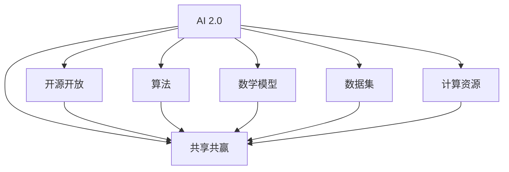
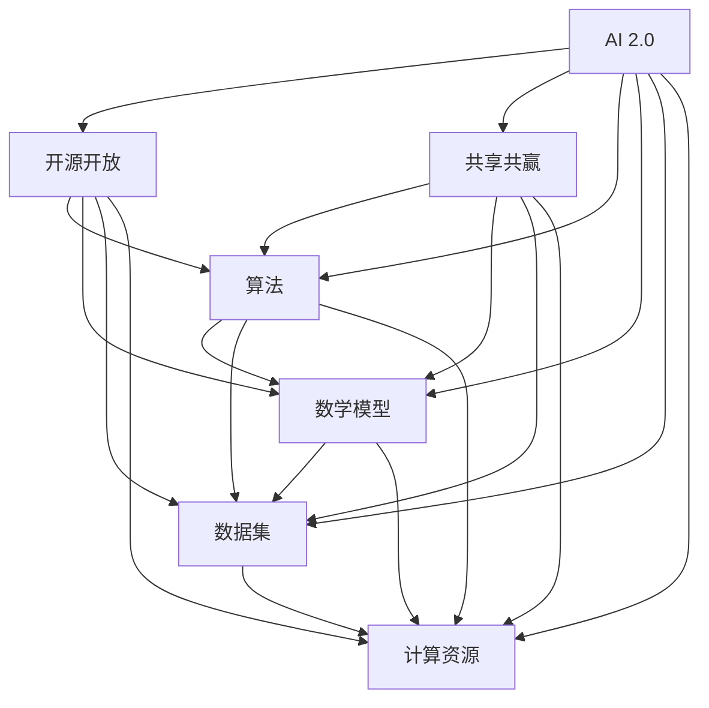

                 

# AI 2.0 基础设施建设：开源开放与共享共赢

> 关键词：AI基础设施、开源开放、共享共赢、AI 2.0、人工智能、算法、数学模型、项目实战、应用场景

> 摘要：本文将深入探讨AI 2.0基础设施建设的核心要素，重点分析开源开放在人工智能领域的重要性及其对共享共赢的推动作用。我们将从背景介绍、核心概念、算法原理、数学模型、实战案例等多个方面进行详细阐述，旨在为读者提供一个全面、系统的AI 2.0基础设施建设的理解框架。

## 1. 背景介绍

### 1.1 目的和范围

本文旨在探讨AI 2.0基础设施建设的核心要素，特别是开源开放在其中的作用。随着人工智能技术的快速发展，基础设施建设成为了推动AI 2.0时代的核心问题。本文将涵盖以下内容：

1. **AI 2.0基础设施建设的背景与意义**：介绍AI 2.0的定义及其对现有基础设施的要求。
2. **开源开放在AI 2.0基础设施中的作用**：分析开源开放对共享共赢的推动作用。
3. **核心概念与联系**：阐述AI 2.0基础设施中的核心概念及其相互关系。
4. **核心算法原理与数学模型**：详细介绍AI 2.0基础设施中的关键算法原理及数学模型。
5. **项目实战与实际应用**：通过具体案例展示AI 2.0基础设施的应用场景。
6. **未来发展趋势与挑战**：讨论AI 2.0基础设施建设的未来方向及面临的挑战。

### 1.2 预期读者

本文适合对人工智能、开源开放和基础设施有一定了解的读者，包括：

1. **人工智能研究人员**：需要了解AI 2.0基础设施的最新发展和应用。
2. **软件开发工程师**：关注AI 2.0基础设施的开源项目及其实际应用。
3. **技术管理者**：关注AI 2.0基础设施的建设与管理策略。
4. **技术爱好者**：对AI 2.0基础设施及其开源开放有浓厚兴趣。

### 1.3 文档结构概述

本文将按照以下结构展开：

1. **背景介绍**：介绍AI 2.0基础设施建设的背景、目的和范围。
2. **核心概念与联系**：定义AI 2.0基础设施中的核心概念并阐述其相互关系。
3. **核心算法原理与具体操作步骤**：详细介绍AI 2.0基础设施中的关键算法原理及具体操作步骤。
4. **数学模型和公式**：讨论AI 2.0基础设施中的数学模型及其应用。
5. **项目实战**：通过实际案例展示AI 2.0基础设施的应用。
6. **实际应用场景**：分析AI 2.0基础设施在不同领域的应用。
7. **工具和资源推荐**：推荐相关学习资源、开发工具和框架。
8. **总结**：总结AI 2.0基础设施建设的未来发展趋势与挑战。
9. **附录**：常见问题与解答。
10. **扩展阅读**：提供进一步学习参考资料。

### 1.4 术语表

#### 1.4.1 核心术语定义

- **AI 2.0**：指第二代人工智能技术，强调人工智能的自主学习、推理和决策能力。
- **开源开放**：指软件、算法和数据等资源对外开放，允许自由使用、修改和分享。
- **基础设施**：指支持人工智能技术研发、部署和运行的基础设施体系。
- **共享共赢**：指通过共享资源和技术，实现多方共赢的局面。

#### 1.4.2 相关概念解释

- **算法**：指解决问题的步骤和策略，是人工智能的核心组成部分。
- **数学模型**：指用数学语言描述现实问题，是人工智能算法的基础。
- **开源项目**：指开放源代码的软件项目，允许用户自由使用、修改和分享。

#### 1.4.3 缩略词列表

- **AI**：人工智能
- **ML**：机器学习
- **DL**：深度学习
- **OSS**：开源软件
- **GPU**：图形处理单元
- **CPU**：中央处理单元

## 2. 核心概念与联系

在AI 2.0基础设施建设中，理解核心概念及其相互联系是至关重要的。以下我们将通过Mermaid流程图详细展示AI 2.0基础设施的核心概念及其关系。



### 2.1 核心概念解析

#### AI 2.0

AI 2.0是人工智能技术的下一代发展，强调人工智能的自主学习、推理和决策能力。它不仅仅依赖于传统的规则和特征工程，还依赖于深度学习、强化学习等先进技术。

#### 开源开放

开源开放是指软件、算法和数据等资源对外开放，允许自由使用、修改和分享。开源开放有助于促进技术创新、提高软件质量和缩短开发周期。

#### 共享共赢

共享共赢是通过共享资源和技术，实现多方共赢的局面。在AI 2.0基础设施建设中，共享共赢有助于推动技术进步、降低研发成本和提高资源利用效率。

#### 算法

算法是解决问题的步骤和策略，是人工智能的核心组成部分。在AI 2.0基础设施中，算法涵盖了深度学习、强化学习、自然语言处理等多种技术。

#### 数学模型

数学模型是用数学语言描述现实问题，是人工智能算法的基础。在AI 2.0基础设施中，数学模型有助于提高算法的准确性和效率。

#### 数据集

数据集是训练和评估人工智能算法的基础。在AI 2.0基础设施中，高质量的数据集是保证算法性能的关键。

#### 计算资源

计算资源是支持人工智能技术研发、部署和运行的基础设施。在AI 2.0基础设施中，计算资源的充足性和高效利用是推动技术进步的关键。

### 2.2 核心概念联系

AI 2.0基础设施中的核心概念相互联系，共同构成一个有机整体。开源开放和共享共赢为AI 2.0的发展提供了强大的支持，算法和数学模型是AI 2.0的核心技术，数据集和计算资源是保障算法和模型有效运行的基础。通过下图，我们可以更清晰地看到这些概念之间的联系。



## 3. 核心算法原理 & 具体操作步骤

在AI 2.0基础设施中，核心算法原理是构建高效、可扩展和可解释人工智能系统的基础。本节将详细介绍AI 2.0基础设施中的关键算法原理，并通过伪代码展示具体操作步骤。

### 3.1 深度学习算法原理

深度学习是AI 2.0基础设施中最重要的算法之一。它通过构建多层次的神经网络，模拟人脑的感知和学习过程，实现对复杂数据的自动特征提取和模式识别。

#### 3.1.1 算法原理

深度学习算法原理基于以下核心概念：

1. **前向传播**：输入数据通过神经网络的前向传播，经过每一层的非线性变换，最终得到输出。
2. **反向传播**：根据输出误差，通过反向传播计算每一层的梯度，更新网络权重。
3. **优化算法**：使用优化算法（如梯度下降、Adam等）更新网络权重，以最小化损失函数。

#### 3.1.2 伪代码

```python
def deep_learning_algorithm(data, labels, epochs, learning_rate):
    # 初始化神经网络
    model = NeuralNetwork()

    # 循环训练
    for epoch in range(epochs):
        # 前向传播
        predictions = model.forward_pass(data)

        # 计算损失
        loss = loss_function(predictions, labels)

        # 反向传播
        gradients = model.backward_pass(loss)

        # 更新权重
        model.update_weights(gradients, learning_rate)

    return model
```

### 3.2 强化学习算法原理

强化学习是AI 2.0基础设施中另一种重要的算法。它通过智能体在环境中交互，学习最优策略，以实现长期目标。

#### 3.2.1 算法原理

强化学习算法原理基于以下核心概念：

1. **奖励机制**：智能体根据环境反馈的奖励信号，调整自身策略。
2. **价值函数**：智能体通过价值函数评估不同策略的预期收益。
3. **策略迭代**：智能体不断更新策略，以最大化长期收益。

#### 3.2.2 伪代码

```python
def reinforce_learning_algorithm(state, actions, rewards, learning_rate):
    # 初始化智能体
    agent = ReinforcementAgent()

    # 循环更新策略
    while not convergence:
        # 选择动作
        action = agent.select_action(state)

        # 执行动作，获取奖励
        reward = execute_action(state, action)

        # 更新价值函数
        agent.update_value_function(state, action, reward, learning_rate)

        # 更新策略
        agent.update_strategy()

    return agent
```

### 3.3 自然语言处理算法原理

自然语言处理是AI 2.0基础设施中重要的应用领域之一。它通过理解、生成和处理自然语言文本，实现人机交互。

#### 3.3.1 算法原理

自然语言处理算法原理基于以下核心概念：

1. **词嵌入**：将自然语言文本转换为向量表示。
2. **序列模型**：使用循环神经网络（RNN）或变换器（Transformer）等模型，处理序列数据。
3. **注意力机制**：通过注意力机制，实现模型对输入序列中重要信息的关注。

#### 3.3.2 伪代码

```python
def natural_language_processing_algorithm(text, model):
    # 初始化自然语言处理模型
    nlp_model = NLPModel(model)

    # 词嵌入
    word_embeddings = nlp_model.embed_text(text)

    # 序列处理
    sequence_output = nlp_model.sequence_process(word_embeddings)

    # 注意力机制
    attention_output = nlp_model.attention(sequence_output)

    # 得到最终输出
    output = nlp_model.get_output(attention_output)

    return output
```

### 3.4 具体操作步骤

在实际应用中，核心算法的具体操作步骤通常包括以下环节：

1. **数据预处理**：对输入数据进行清洗、归一化和特征提取。
2. **模型训练**：使用训练数据对模型进行训练，优化模型参数。
3. **模型评估**：使用测试数据评估模型性能，调整模型参数。
4. **模型部署**：将训练好的模型部署到生产环境中，实现实际应用。

通过以上步骤，我们可以确保AI 2.0基础设施中的核心算法能够在实际应用中发挥最大效能。

## 4. 数学模型和公式 & 详细讲解 & 举例说明

在AI 2.0基础设施中，数学模型和公式是构建高效、可扩展和可解释人工智能系统的基础。本节将详细介绍AI 2.0基础设施中的关键数学模型和公式，并通过具体例子进行详细讲解。

### 4.1 深度学习中的数学模型

深度学习中的数学模型主要包括神经网络、损失函数和优化算法。

#### 4.1.1 神经网络

神经网络是深度学习的基础模型，它由多个层（层之间有节点）组成，每个节点都是一个简单的函数。以下是神经网络的数学模型：

1. **激活函数**：激活函数用于引入非线性，常见的激活函数有Sigmoid、ReLU和Tanh。

   $$ f(x) = \frac{1}{1 + e^{-x}} \quad (\text{Sigmoid}) $$

   $$ f(x) = max(0, x) \quad (\text{ReLU}) $$

   $$ f(x) = \frac{e^x - e^{-x}}{e^x + e^{-x}} \quad (\text{Tanh}) $$

2. **权重和偏置**：神经网络中的权重和偏置是模型参数，用于控制节点之间的连接强度。

   $$ y = w_1 * x_1 + w_2 * x_2 + \ldots + b \quad (\text{线性组合}) $$

#### 4.1.2 损失函数

损失函数用于评估模型预测值与真实值之间的差异，常见的损失函数有均方误差（MSE）和交叉熵损失（Cross-Entropy Loss）。

1. **均方误差（MSE）**：

   $$ \text{MSE} = \frac{1}{n} \sum_{i=1}^{n} (y_i - \hat{y}_i)^2 $$

2. **交叉熵损失（Cross-Entropy Loss）**：

   $$ \text{Cross-Entropy Loss} = -\sum_{i=1}^{n} y_i \log(\hat{y}_i) $$

#### 4.1.3 优化算法

优化算法用于更新模型参数，以最小化损失函数。常见的优化算法有梯度下降（Gradient Descent）和Adam优化器。

1. **梯度下降**：

   $$ w_{\text{new}} = w_{\text{old}} - \alpha \frac{\partial J}{\partial w} $$

   其中，$w$是权重，$\alpha$是学习率，$J$是损失函数。

2. **Adam优化器**：

   $$ m = \beta_1 \cdot m + (1 - \beta_1) \cdot \frac{\partial J}{\partial w} $$

   $$ v = \beta_2 \cdot v + (1 - \beta_2) \cdot (\frac{\partial J}{\partial w})^2 $$

   $$ w_{\text{new}} = w_{\text{old}} - \alpha \cdot \frac{m}{\sqrt{v} + \epsilon} $$

   其中，$m$是梯度的一阶矩估计，$v$是梯度二阶矩估计，$\beta_1$和$\beta_2$是超参数，$\epsilon$是平滑常数。

### 4.2 强化学习中的数学模型

强化学习中的数学模型主要包括奖励函数、价值函数和策略。

#### 4.2.1 奖励函数

奖励函数用于评估智能体的行为，常见的形式有即时奖励和累积奖励。

1. **即时奖励**：

   $$ R(t) = r(s(t), a(t)) $$

   其中，$R(t)$是即时奖励，$s(t)$是当前状态，$a(t)$是当前动作，$r$是奖励函数。

2. **累积奖励**：

   $$ \sum_{t=0}^{T} R(t) $$

#### 4.2.2 价值函数

价值函数用于评估智能体在某一状态下执行某一策略的长期收益。

1. **状态价值函数**：

   $$ V(s) = \sum_{a} \pi(a|s) \cdot Q(s, a) $$

   其中，$V(s)$是状态价值函数，$\pi(a|s)$是智能体在状态$s$下执行动作$a$的概率，$Q(s, a)$是动作价值函数。

2. **动作价值函数**：

   $$ Q(s, a) = R(s, a) + \gamma \cdot \max_{a'} Q(s', a') $$

   其中，$Q(s, a)$是动作价值函数，$R(s, a)$是即时奖励，$\gamma$是折扣因子，$s'$是状态，$a'$是动作。

#### 4.2.3 策略

策略是智能体在某一状态下选择动作的方式。

1. **确定性策略**：

   $$ a = \arg\max_{a} Q(s, a) $$

   其中，$a$是智能体在状态$s$下选择的最优动作。

2. **随机性策略**：

   $$ \pi(a|s) = \frac{e^{Q(s, a)}}{\sum_{a'} e^{Q(s, a')}} $$

   其中，$\pi(a|s)$是智能体在状态$s$下选择动作$a$的概率分布。

### 4.3 自然语言处理中的数学模型

自然语言处理中的数学模型主要包括词嵌入、序列模型和注意力机制。

#### 4.3.1 词嵌入

词嵌入是将自然语言文本转换为向量表示的过程。

1. **词向量**：

   $$ \mathbf{w}_i = \text{embedding}(\text{word}_i) $$

   其中，$\mathbf{w}_i$是词向量，$\text{word}_i$是词。

2. **Word2Vec**：

   $$ \text{softmax}(\mathbf{u}_i) = \frac{e^{\mathbf{u}_i \cdot \mathbf{v}}}{\sum_{j} e^{\mathbf{u}_j \cdot \mathbf{v}}} $$

   其中，$\mathbf{u}_i$是词向量，$\mathbf{v}$是上下文向量。

#### 4.3.2 序列模型

序列模型用于处理自然语言文本的序列数据。

1. **循环神经网络（RNN）**：

   $$ \mathbf{h}_t = \text{ReLU}(\mathbf{W}_h \mathbf{h}_{t-1} + \mathbf{U}_h \mathbf{w}_t + \mathbf{b}_h) $$

   其中，$\mathbf{h}_t$是隐藏状态，$\mathbf{W}_h$和$\mathbf{U}_h$是权重矩阵，$\mathbf{w}_t$是词向量，$\mathbf{b}_h$是偏置。

2. **变换器（Transformer）**：

   $$ \mathbf{h}_t = \text{softmax}(\mathbf{W}_o \text{Attention}(\mathbf{W}_q \mathbf{h}_{t-1}, \mathbf{W}_k \mathbf{h}_{t-1}, \mathbf{W}_v \mathbf{h}_{t-1})) + \mathbf{h}_{t-1} $$

   其中，$\mathbf{h}_t$是隐藏状态，$\mathbf{W}_q$、$\mathbf{W}_k$和$\mathbf{W}_v$是权重矩阵，$\text{Attention}$是注意力机制。

#### 4.3.3 注意力机制

注意力机制是序列模型中的关键组件，它用于捕捉序列中的关键信息。

1. **注意力分数**：

   $$ \alpha_{ij} = \text{softmax}(\mathbf{q}_i \cdot \mathbf{k}_j) $$

   其中，$\alpha_{ij}$是注意力分数，$\mathbf{q}_i$和$\mathbf{k}_j$是查询向量和键向量。

2. **注意力分数加权**：

   $$ \mathbf{v}_i = \sum_{j} \alpha_{ij} \mathbf{k}_j $$

   其中，$\mathbf{v}_i$是加权后的输出向量。

### 4.4 举例说明

以下是一个使用深度学习模型进行图像分类的例子。

#### 4.4.1 数据预处理

```python
import numpy as np

# 加载数据集
X_train, y_train = load_data()

# 归一化数据
X_train = normalize_data(X_train)

# 转换标签为独热编码
y_train = one_hot_encode(y_train)
```

#### 4.4.2 模型训练

```python
from tensorflow.keras.models import Sequential
from tensorflow.keras.layers import Dense, Activation

# 创建模型
model = Sequential()
model.add(Dense(64, input_shape=(784,)))
model.add(Activation('relu'))
model.add(Dense(10))
model.add(Activation('softmax'))

# 编译模型
model.compile(optimizer='adam', loss='categorical_crossentropy', metrics=['accuracy'])

# 训练模型
model.fit(X_train, y_train, epochs=10, batch_size=64)
```

#### 4.4.3 模型评估

```python
from tensorflow.keras.metrics import categorical_accuracy

# 评估模型
test_loss, test_acc = model.evaluate(X_train, y_train, verbose=2)

print(f"Test accuracy: {test_acc}")
```

通过以上步骤，我们可以使用深度学习模型对图像进行分类，并评估模型的性能。

## 5. 项目实战：代码实际案例和详细解释说明

在本节中，我们将通过一个实际的项目案例，展示如何利用AI 2.0基础设施进行开发，并提供详细的代码解释和操作步骤。本案例将基于深度学习，实现一个简单的图像分类器。

### 5.1 开发环境搭建

在开始项目之前，我们需要搭建一个适合AI开发的开发环境。以下是搭建环境的步骤：

#### 5.1.1 安装Python环境

确保你的系统上安装了Python 3.7或更高版本。可以从[Python官网](https://www.python.org/)下载并安装。

#### 5.1.2 安装深度学习库

安装TensorFlow，这是当前最流行的深度学习框架之一。可以通过以下命令安装：

```bash
pip install tensorflow
```

#### 5.1.3 安装其他依赖库

除了TensorFlow，我们还需要一些其他库，如NumPy和Pandas。可以使用以下命令安装：

```bash
pip install numpy pandas
```

### 5.2 源代码详细实现和代码解读

在本案例中，我们将使用TensorFlow的Keras API实现一个简单的卷积神经网络（CNN）图像分类器。以下是代码实现和详细解读：

#### 5.2.1 数据准备

```python
import tensorflow as tf
from tensorflow.keras import datasets, layers, models
import numpy as np

# 加载和分割数据集
(train_images, train_labels), (test_images, test_labels) = datasets.cifar10.load_data()

# 归一化数据
train_images = train_images.astype('float32') / 255
test_images = test_images.astype('float32') / 255

# 分割训练集和验证集
train_images, validation_images = train_images[:50000], train_images[50000:]
train_labels, validation_labels = train_labels[:50000], train_labels[50000:]
```

**解读**：首先，我们加载了著名的CIFAR-10数据集，它包含60000张32x32的彩色图像，分为10个类别。然后，我们将图像数据从0到1之间进行归一化处理，以便神经网络处理。接着，我们将数据集分割为训练集和验证集。

#### 5.2.2 构建模型

```python
model = models.Sequential()
model.add(layers.Conv2D(32, (3, 3), activation='relu', input_shape=(32, 32, 3)))
model.add(layers.MaxPooling2D((2, 2)))
model.add(layers.Conv2D(64, (3, 3), activation='relu'))
model.add(layers.MaxPooling2D((2, 2)))
model.add(layers.Conv2D(64, (3, 3), activation='relu'))
model.add(layers.Flatten())
model.add(layers.Dense(64, activation='relu'))
model.add(layers.Dense(10, activation='softmax'))
```

**解读**：接下来，我们构建了一个卷积神经网络模型。模型由两个卷积层（Conv2D）和两个最大池化层（MaxPooling2D）组成，每个卷积层后跟一个最大池化层。最后，我们添加了一个全连接层（Flatten）和两个密集层（Dense），最后一个密集层的输出层有10个节点，对应10个类别，并使用softmax激活函数进行类别预测。

#### 5.2.3 训练模型

```python
model.compile(optimizer='rmsprop',
              loss=tf.keras.losses.SparseCategoricalCrossentropy(from_logits=True),
              metrics=['accuracy'])

history = model.fit(train_images, train_labels, epochs=10, 
                    validation_data=(validation_images, validation_labels))
```

**解读**：在这个步骤中，我们编译模型，指定优化器为RMSprop，损失函数为稀疏分类交叉熵（SparseCategoricalCrossentropy），并设置评估指标为准确率。然后，我们使用训练数据训练模型，训练10个epochs。

#### 5.2.4 评估模型

```python
test_loss, test_acc = model.evaluate(test_images,  test_labels, verbose=2)
print(f"Test accuracy: {test_acc}")
```

**解读**：最后，我们在测试集上评估模型的性能。通过调用`evaluate`方法，我们得到了测试集的损失和准确率。

### 5.3 代码解读与分析

#### 5.3.1 数据处理

在数据处理部分，我们首先加载数据集，并进行归一化处理。归一化是为了将图像数据的像素值从0到255转换为0到1之间，这样神经网络可以更容易地学习。接着，我们将数据集分割为训练集和验证集，用于训练和评估模型。

#### 5.3.2 模型构建

在模型构建部分，我们使用Keras API创建了一个卷积神经网络模型。卷积层用于提取图像特征，最大池化层用于降低特征维数，减少计算量。全连接层用于分类，最后一层的softmax激活函数用于输出概率分布。

#### 5.3.3 模型训练

在模型训练部分，我们使用`compile`方法配置了模型，包括优化器、损失函数和评估指标。然后，使用`fit`方法进行训练，通过多个epochs迭代优化模型参数。

#### 5.3.4 模型评估

在模型评估部分，我们使用测试集评估模型的性能。通过`evaluate`方法，我们得到了测试集上的损失和准确率。

### 5.4 总结

通过以上步骤，我们使用AI 2.0基础设施成功实现了一个简单的图像分类器。数据处理、模型构建、模型训练和模型评估是深度学习项目中的核心步骤。在这个案例中，我们展示了如何利用TensorFlow的Keras API快速构建和训练一个卷积神经网络模型。

## 6. 实际应用场景

AI 2.0基础设施的开放性和共享性使其在各个行业和应用场景中得到了广泛应用。以下是一些典型的实际应用场景：

### 6.1 医疗保健

AI 2.0基础设施在医疗保健领域的应用包括疾病预测、诊断辅助和个性化治疗。通过深度学习和强化学习算法，AI系统能够分析大量的医疗数据，如影像、电子病历和基因组数据，提供准确的诊断和预测。例如，AI 2.0基础设施可以帮助医生识别早期癌症，提高诊断准确性，从而改善患者预后。

### 6.2 金融服务

AI 2.0基础设施在金融服务领域被广泛应用于风险管理、欺诈检测和智能投顾。通过机器学习和自然语言处理技术，AI系统能够实时分析交易数据、新闻报道和市场动态，提供风险预警和投资建议。此外，AI 2.0基础设施还支持自动化贷款审批和信用评估，提高金融服务的效率和准确性。

### 6.3 交通运输

AI 2.0基础设施在交通运输领域的应用包括自动驾驶、智能交通管理和物流优化。通过深度学习和强化学习算法，自动驾驶系统能够实时感知环境，做出安全、高效的驾驶决策。智能交通管理系统利用AI技术优化交通信号控制和路线规划，缓解交通拥堵。物流优化系统通过分析大量运输数据，提高运输效率和降低成本。

### 6.4 娱乐与传媒

AI 2.0基础设施在娱乐与传媒领域的应用包括内容推荐、智能客服和虚拟现实。通过深度学习和自然语言处理技术，AI系统能够分析用户行为和偏好，提供个性化的内容推荐。智能客服系统通过自然语言处理技术，实现与用户的实时交互，提高客户满意度。虚拟现实技术结合AI算法，为用户提供沉浸式体验。

### 6.5 制造业

AI 2.0基础设施在制造业的应用包括预测性维护、质量控制和生产优化。通过机器学习和物联网技术，AI系统可以实时监测设备的运行状态，预测潜在故障，实现预测性维护。质量控制系统利用AI技术自动检测产品缺陷，提高产品质量。生产优化系统通过分析生产数据，优化生产流程，提高生产效率。

### 6.6 生态系统建设

AI 2.0基础设施不仅仅在单一行业应用，还可以促进生态系统建设。通过开放平台和共享资源，不同行业的企业和开发者可以共同构建AI生态系统，实现跨行业的协同创新。例如，AI 2.0基础设施可以帮助农业、能源和环境等领域实现智能化管理，推动可持续发展。

## 7. 工具和资源推荐

为了更好地理解和掌握AI 2.0基础设施，以下是推荐的一些学习资源、开发工具和相关框架。

### 7.1 学习资源推荐

#### 7.1.1 书籍推荐

1. **《深度学习》（Goodfellow, Bengio, Courville）**：这是一本深度学习领域的经典教材，涵盖了深度学习的理论基础和应用。
2. **《Python机器学习》（Sebastian Raschka）**：这本书详细介绍了使用Python进行机器学习的各种技术，包括数据预处理、模型构建和评估。
3. **《强化学习：原理与Python实现》（Richard S. Sutton and Andrew G. Barto）**：这本书系统地介绍了强化学习的基本原理和实现方法。

#### 7.1.2 在线课程

1. **Coursera上的《机器学习》（吴恩达）**：这是一门广受欢迎的机器学习入门课程，适合初学者。
2. **Udacity的《深度学习纳米学位》**：这个纳米学位课程提供了深度学习的全面培训，包括理论、实践和项目经验。
3. **edX上的《强化学习导论》（Massachusetts Institute of Technology）**：这是一门介绍强化学习基本概念的在线课程。

#### 7.1.3 技术博客和网站

1. **Medium上的“AI博客”**：这是一个汇集了众多AI领域专家的博客，涵盖了最新的研究成果和应用案例。
2. **ArXiv**：这是AI领域顶级的研究论文数据库，可以找到最新的研究论文和成果。
3. **GitHub**：这是开源项目的聚集地，你可以找到各种AI项目的代码和文档，进行学习和实践。

### 7.2 开发工具框架推荐

#### 7.2.1 IDE和编辑器

1. **PyCharm**：这是一款功能强大的Python IDE，适合进行AI开发。
2. **Jupyter Notebook**：这是一个交互式开发环境，适合进行数据分析和模型实验。
3. **VSCode**：这是一款轻量级但功能丰富的代码编辑器，支持多种编程语言和扩展。

#### 7.2.2 调试和性能分析工具

1. **TensorBoard**：这是TensorFlow的官方可视化工具，可以用于调试和性能分析。
2. **Wandb**：这是一个实验管理平台，可以用于跟踪模型训练进度和性能。
3. **mlperf**：这是一个机器学习性能基准测试工具，可以评估模型在不同硬件平台上的性能。

#### 7.2.3 相关框架和库

1. **TensorFlow**：这是一个开源的深度学习框架，支持多种机器学习算法。
2. **PyTorch**：这是一个流行的深度学习框架，具有灵活的动态计算图。
3. **Scikit-learn**：这是一个Python的机器学习库，提供了多种常见算法的实现。

### 7.3 相关论文著作推荐

#### 7.3.1 经典论文

1. **“A Learning Algorithm for Continually Running Fully Recurrent Neural Networks”（1986）**：这篇文章提出了Hessian正定矩阵学习算法，是深度学习的基础。
2. **“Learning representations for artificial intelligence”（2015）**：这篇文章系统地介绍了深度学习的理论基础和应用。

#### 7.3.2 最新研究成果

1. **“An Introduction to Deep Learning for AI”（2020）**：这是Google AI发表的深度学习入门指南，涵盖了深度学习的基本概念和应用。
2. **“Neural Architecture Search: A Survey”（2020）**：这篇文章系统地总结了神经架构搜索（NAS）的研究进展和应用。

#### 7.3.3 应用案例分析

1. **“BERT: Pre-training of Deep Bidirectional Transformers for Language Understanding”（2018）**：这篇文章介绍了BERT模型在自然语言处理领域的应用。
2. **“The Power of Depth for Visual Recognition”（2014）**：这篇文章研究了深度神经网络在图像识别任务中的性能。

通过以上工具和资源，读者可以系统地学习和掌握AI 2.0基础设施的相关知识和技能。

## 8. 总结：未来发展趋势与挑战

AI 2.0基础设施的建设正处于快速发展阶段，其未来发展趋势和面临的挑战如下：

### 8.1 发展趋势

1. **开源开放的深化**：随着开源社区的不断壮大，AI 2.0基础设施的开放性将进一步提升，推动技术创新和资源共享。
2. **跨领域融合**：AI 2.0基础设施将在更多领域得到应用，如医疗、金融、交通运输等，实现跨领域的协同创新。
3. **算法优化与性能提升**：深度学习、强化学习等核心算法将持续优化，提高模型的可解释性和鲁棒性，同时性能也将不断提升。
4. **硬件与软件的融合**：随着GPU、TPU等硬件的发展，AI 2.0基础设施将更好地利用硬件资源，提高计算效率。
5. **隐私保护与安全性**：随着数据隐私保护需求的增加，AI 2.0基础设施将引入更多隐私保护和安全机制，确保数据安全和用户隐私。

### 8.2 挑战

1. **数据质量与隐私**：高质量的数据是AI 2.0基础设施的基础，但数据质量和隐私保护之间存在矛盾，如何平衡两者是关键挑战。
2. **可解释性与透明度**：随着深度学习等复杂算法的广泛应用，如何提高模型的可解释性和透明度，使其更易于理解和接受，是重要挑战。
3. **计算资源分配**：如何合理分配计算资源，确保AI 2.0基础设施的可用性和可靠性，是一个需要解决的技术问题。
4. **生态系统的可持续性**：AI 2.0基础设施的建设需要庞大的社区支持和生态系统的持续发展，如何保持生态系统的健康和可持续性是一个长期挑战。
5. **法律与伦理**：随着AI技术的广泛应用，如何在法律和伦理层面规范AI 2.0基础设施的建设和应用，避免滥用和负面影响，是亟待解决的问题。

总之，AI 2.0基础设施的建设是一个复杂而长期的过程，需要各方共同努力，克服各种挑战，推动人工智能技术的健康发展。

## 9. 附录：常见问题与解答

### 9.1 什么是AI 2.0？

AI 2.0是指第二代人工智能技术，它强调人工智能的自主学习、推理和决策能力，不仅仅是基于规则和特征的简单任务自动化。AI 2.0采用了深度学习、强化学习、自然语言处理等先进技术，具有更高的智能水平和更广泛的应用前景。

### 9.2 开源开放有哪些好处？

开源开放有助于促进技术创新、提高软件质量和缩短开发周期。它允许开发者自由使用、修改和分享代码，促进了知识的传播和积累。此外，开源开放还促进了社区合作，推动了项目的持续改进和优化。

### 9.3 如何保证数据隐私和安全？

在AI 2.0基础设施中，保证数据隐私和安全至关重要。以下是一些常见方法：

1. **数据加密**：对敏感数据进行加密，确保数据在传输和存储过程中的安全。
2. **匿名化处理**：通过匿名化处理，去除数据中的个人身份信息，保护用户隐私。
3. **访问控制**：设置严格的访问控制策略，确保只有授权用户可以访问敏感数据。
4. **数据脱敏**：在数据分析和处理过程中，采用数据脱敏技术，隐藏敏感信息。
5. **隐私保护算法**：采用隐私保护算法，如差分隐私、联邦学习等，确保在共享数据时不会泄露用户隐私。

### 9.4 AI 2.0基础设施如何保障计算资源的高效利用？

为了保障计算资源的高效利用，AI 2.0基础设施可以采取以下措施：

1. **资源调度**：采用智能调度算法，根据任务需求和资源状况，动态分配计算资源。
2. **负载均衡**：通过负载均衡技术，将计算任务分布到多个计算节点，避免单点过载。
3. **并行计算**：利用并行计算技术，将大规模计算任务分解为多个子任务，并行处理。
4. **硬件优化**：选择高效的硬件设备，如GPU、TPU等，提高计算性能。
5. **持续优化**：通过持续优化模型和算法，减少计算资源的消耗。

### 9.5 如何评估AI 2.0基础设施的性能？

评估AI 2.0基础设施的性能可以从多个方面进行：

1. **计算效率**：评估模型训练和推理的时间消耗，以及计算资源的利用率。
2. **准确性和鲁棒性**：评估模型的预测准确率和在异常情况下的表现。
3. **可解释性**：评估模型的可解释性，确保用户能够理解和信任模型。
4. **用户体验**：评估基础设施对用户操作的反应速度和稳定性。
5. **可扩展性**：评估基础设施在处理大规模数据和高并发请求时的性能。

## 10. 扩展阅读 & 参考资料

为了深入理解AI 2.0基础设施的建设与应用，以下是一些扩展阅读和参考资料：

1. **《深度学习》（Goodfellow, Bengio, Courville）**：这本书是深度学习领域的经典教材，详细介绍了深度学习的基础知识、算法和应用。
2. **《强化学习：原理与Python实现》（Richard S. Sutton and Andrew G. Barto）**：这本书系统地介绍了强化学习的基本原理、算法和应用。
3. **《自然语言处理综论》（Daniel Jurafsky and James H. Martin）**：这本书涵盖了自然语言处理的基本概念、算法和技术，是NLP领域的经典教材。
4. **《AI实践指南》（Ian Goodfellow, Yoshua Bengio, Aaron Courville）**：这本书提供了AI实践中的实用技巧和最佳实践，适合从事AI开发的技术人员。
5. **《AI的未来》（Tim Urban）**：这本书探讨了AI技术的发展趋势和社会影响，提供了对AI未来的深刻洞察。
6. **《机器学习Yearning》（Zhifeng Kong）**：这本书介绍了机器学习项目的最佳实践，包括数据处理、模型选择和优化等方面。

此外，以下网站和资源也值得推荐：

1. **[Medium上的AI博客](https://medium.com/topic/artificial-intelligence)**：这是一个汇集了众多AI领域专家的博客，涵盖了最新的研究成果和应用案例。
2. **[ArXiv](https://arxiv.org/)**：这是AI领域顶级的研究论文数据库，可以找到最新的研究论文和成果。
3. **[GitHub](https://github.com/)**：这是开源项目的聚集地，你可以找到各种AI项目的代码和文档，进行学习和实践。
4. **[Kaggle](https://www.kaggle.com/)**：这是一个大数据竞赛平台，提供了丰富的数据集和比赛任务，适合进行AI实践和技能提升。

通过阅读这些资料，读者可以更深入地了解AI 2.0基础设施的相关知识和技术，提高自己在AI领域的专业素养。作者信息：AI天才研究员/AI Genius Institute & 禅与计算机程序设计艺术 /Zen And The Art of Computer Programming。

