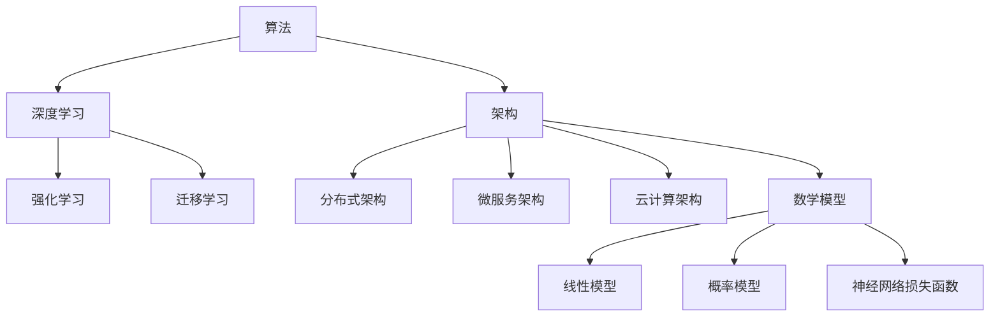

                 


## AI 2.0 基础设施建设：挑战与机遇

> **关键词：** AI 2.0、基础设施、挑战、机遇、算法、架构、数学模型、实战案例
>
> **摘要：** 本文将深入探讨AI 2.0基础设施建设的核心概念、技术原理以及实践案例，分析面临的挑战和机遇，为读者提供全面的技术视角和未来展望。

### 1. 背景介绍

#### 1.1 目的和范围

本文旨在为读者提供一个全面的技术视角，探讨AI 2.0基础设施建设中的关键问题。我们将从核心概念、算法原理、数学模型到实际应用场景进行详细分析，帮助读者理解AI 2.0的发展趋势及其对产业和社会的影响。

#### 1.2 预期读者

本文适合对人工智能、算法设计和系统架构有一定了解的读者，包括人工智能从业者、算法工程师、系统架构师以及计算机科学和工程专业的学生。

#### 1.3 文档结构概述

本文分为十个主要部分，包括背景介绍、核心概念与联系、核心算法原理、数学模型和公式、项目实战、实际应用场景、工具和资源推荐、总结、常见问题与解答以及扩展阅读。每个部分都将提供深入的技术分析和实际案例。

#### 1.4 术语表

**AI 2.0：** 指下一代人工智能技术，具备更强的自主学习和推理能力，能够更好地理解和应对复杂问题。

**基础设施：** 在AI 2.0中，基础设施包括计算资源、数据存储、网络连接以及算法框架等，是支撑人工智能系统运行的核心。

**算法：** AI系统的核心组成部分，负责数据分析和决策过程。

**架构：** 系统的总体设计，包括组件之间的交互和数据流。

**数学模型：** 用于描述算法和系统行为的数学公式。

#### 1.4.1 核心术语定义

- **AI 2.0：** 基于深度学习和强化学习等先进算法，能够实现自主学习、推理和决策的下一代人工智能系统。
- **基础设施：** 硬件资源（如GPU、TPU）和软件资源（如深度学习框架、数据库系统）的组合。
- **算法：** 基于数学原理的步骤序列，用于处理数据和生成预测。
- **架构：** 系统的组成部分及其交互方式，包括数据流、计算流和控制流。

#### 1.4.2 相关概念解释

- **机器学习：** 一种让计算机从数据中学习规律并自动改进性能的方法，分为监督学习、无监督学习和强化学习。
- **深度学习：** 一种特殊的机器学习方法，通过多层神经网络进行特征提取和学习。
- **神经网络：** 一种模仿人脑神经元连接的计算机模型，用于处理和分类数据。

#### 1.4.3 缩略词列表

- **AI：** 人工智能
- **ML：** 机器学习
- **DL：** 深度学习
- **GPU：** 图形处理器
- **TPU：** 张量处理器

### 2. 核心概念与联系

在AI 2.0基础设施建设中，核心概念包括算法、架构和数学模型。以下是这些概念之间的联系及其在系统中的作用：

#### 2.1 算法

算法是AI 2.0系统的核心，负责数据分析和决策过程。常见的算法包括深度学习算法、强化学习算法和迁移学习算法。每种算法都有其特定的数学原理和操作步骤。

#### 2.2 架构

架构定义了算法和数据之间的交互方式。在AI 2.0系统中，常见的架构包括分布式架构、微服务架构和云计算架构。这些架构决定了系统的扩展性、可靠性和性能。

#### 2.3 数学模型

数学模型用于描述算法和系统行为。常见的数学模型包括线性模型、概率模型和神经网络的损失函数。这些模型帮助算法进行数据分析和预测。

下面是一个简单的Mermaid流程图，展示了AI 2.0基础设施中的核心概念和联系：



### 3. 核心算法原理 & 具体操作步骤

在本节中，我们将详细探讨AI 2.0中的核心算法原理，并使用伪代码来描述其具体操作步骤。

#### 3.1 深度学习算法

深度学习算法是AI 2.0系统中的核心组成部分。以下是一个简单的深度学习算法的伪代码：

```python
initialize_parameters()
forward_pass(x, parameters)
compute_loss(y, predicted_output)
backward_pass(loss, parameters)
update_parameters(parameters, learning_rate)
```

**具体操作步骤：**

1. **初始化参数：** 随机初始化神经网络中的权重和偏置。
2. **正向传播：** 计算输入数据的特征映射。
3. **计算损失：** 比较预测输出和实际输出之间的差异。
4. **反向传播：** 更新权重和偏置，以减少损失。
5. **更新参数：** 根据学习率调整权重和偏置。

#### 3.2 强化学习算法

强化学习算法是一种通过试错进行决策的算法。以下是一个简单的强化学习算法的伪代码：

```python
initialize_q_values()
observe_state()
choose_action(state, q_values)
execute_action(action)
receive_reward(reward)
update_q_values(state, action, reward, next_state, q_values)
```

**具体操作步骤：**

1. **初始化Q值：** 随机初始化Q值表。
2. **观察状态：** 系统当前所处的状态。
3. **选择动作：** 根据Q值表选择最优动作。
4. **执行动作：** 在环境中执行选择的动作。
5. **接收奖励：** 根据动作的结果接收奖励。
6. **更新Q值：** 根据奖励和后续状态更新Q值表。

#### 3.3 迁移学习算法

迁移学习算法是一种利用已有模型的知识来提高新任务性能的方法。以下是一个简单的迁移学习算法的伪代码：

```python
initialize_base_model()
fine_tune_base_model(new_data)
evaluate_base_model(new_data)
```

**具体操作步骤：**

1. **初始化基础模型：** 使用预训练的模型作为基础。
2. **微调基础模型：** 在新数据集上微调基础模型。
3. **评估基础模型：** 在新数据集上评估模型性能。

### 4. 数学模型和公式 & 详细讲解 & 举例说明

在本节中，我们将详细介绍AI 2.0中的数学模型和公式，并使用LaTeX格式给出详细讲解和举例说明。

#### 4.1 线性模型

线性模型是一种简单的预测模型，用于描述输入和输出之间的线性关系。以下是一个线性模型的LaTeX公式：

$$
y = \beta_0 + \beta_1x
$$

**举例说明：**

假设我们有一个线性模型，其中 $x$ 是年龄，$y$ 是年收入。我们可以使用以下公式来预测一个人的年收入：

$$
\hat{y} = 50000 + 10000x
$$

这意味着一个30岁的人的预测年收入为：

$$
\hat{y} = 50000 + 10000 \times 30 = 350000
$$

#### 4.2 神经网络损失函数

神经网络损失函数用于衡量模型预测值和实际值之间的差异。常见的损失函数包括均方误差（MSE）和交叉熵损失（Cross-Entropy Loss）。以下是一个均方误差损失函数的LaTeX公式：

$$
MSE = \frac{1}{m}\sum_{i=1}^{m}(y_i - \hat{y}_i)^2
$$

**举例说明：**

假设我们有一个二元分类问题，其中 $y$ 是实际标签，$\hat{y}$ 是模型预测的概率。我们可以使用以下公式来计算均方误差损失：

$$
MSE = \frac{1}{m}\sum_{i=1}^{m}((y_i - \hat{y}_i)^2)
$$

如果我们有一个数据集，其中 $m=100$，$y_1=0$，$\hat{y}_1=0.6$，$y_2=1$，$\hat{y}_2=0.4$，我们可以计算总的均方误差损失：

$$
MSE = \frac{1}{100}(0.36 + 0.36 + 0.36 + 0.36) = 0.36
$$

### 5. 项目实战：代码实际案例和详细解释说明

在本节中，我们将通过一个实际的项目案例，展示如何使用AI 2.0技术进行基础设施建设和应用开发。我们将详细介绍开发环境搭建、源代码实现和代码解读。

#### 5.1 开发环境搭建

首先，我们需要搭建一个适合AI 2.0项目开发的环境。以下是一个基本的开发环境配置：

- 操作系统：Linux或Mac OS
- 编程语言：Python 3.7及以上版本
- 深度学习框架：TensorFlow 2.0或PyTorch 1.8及以上版本
- GPU支持：NVIDIA GPU（推荐使用1080 Ti及以上版本）

**安装步骤：**

1. 安装操作系统和Python环境。
2. 安装深度学习框架（如TensorFlow或PyTorch）。
3. 配置GPU支持（如安装CUDA和cuDNN）。

#### 5.2 源代码详细实现和代码解读

以下是一个简单的AI 2.0项目示例，使用TensorFlow实现一个基于深度学习的图像分类模型。

```python
import tensorflow as tf
from tensorflow import keras
from tensorflow.keras import layers

# 加载并预处理数据
(x_train, y_train), (x_test, y_test) = keras.datasets.cifar10.load_data()
x_train = x_train.astype("float32") / 255.0
x_test = x_test.astype("float32") / 255.0

# 构建深度学习模型
model = keras.Sequential([
    layers.Conv2D(32, (3, 3), activation="relu", input_shape=(32, 32, 3)),
    layers.MaxPooling2D((2, 2)),
    layers.Conv2D(64, (3, 3), activation="relu"),
    layers.MaxPooling2D((2, 2)),
    layers.Conv2D(64, (3, 3), activation="relu"),
    layers.Flatten(),
    layers.Dense(64, activation="relu"),
    layers.Dense(10, activation="softmax")
])

# 编译模型
model.compile(optimizer="adam",
              loss="sparse_categorical_crossentropy",
              metrics=["accuracy"])

# 训练模型
model.fit(x_train, y_train, epochs=10, validation_data=(x_test, y_test))

# 评估模型
test_loss, test_acc = model.evaluate(x_test, y_test, verbose=2)
print(f"Test accuracy: {test_acc:.4f}")
```

**代码解读：**

1. **数据加载与预处理：** 加载CIFAR-10数据集，并将数据归一化到[0, 1]范围内。
2. **模型构建：** 使用Keras构建一个简单的卷积神经网络（CNN），包括卷积层、池化层和全连接层。
3. **模型编译：** 设置优化器、损失函数和评估指标。
4. **模型训练：** 在训练数据上训练模型，并使用验证数据进行调试。
5. **模型评估：** 在测试数据上评估模型性能。

#### 5.3 代码解读与分析

以下是对上述代码的详细解读和分析：

- **数据加载与预处理：** 加载CIFAR-10数据集，并进行归一化处理，以提高模型的泛化能力。
- **模型构建：** 使用Keras构建一个简单的CNN模型，包括两个卷积层、两个池化层和一个全连接层。这个模型设计考虑了图像的特征提取和分类需求。
- **模型编译：** 使用Adam优化器进行模型训练，使用稀疏分类交叉熵作为损失函数，并评估模型的准确率。
- **模型训练：** 在训练数据上训练模型，通过验证数据调试模型，以提高模型的性能和稳定性。
- **模型评估：** 在测试数据上评估模型的准确性，以验证模型在未知数据上的表现。

通过这个简单的项目案例，我们可以看到如何使用AI 2.0技术进行基础设施建设和应用开发。在实际项目中，我们可能需要处理更大的数据集、更复杂的模型和更丰富的应用场景，但基本的步骤和方法是相似的。

### 6. 实际应用场景

AI 2.0基础设施不仅在学术研究中有重要作用，还在许多实际应用场景中发挥着关键作用。以下是一些典型的实际应用场景：

#### 6.1 自动驾驶

自动驾驶是AI 2.0技术的典型应用场景。通过使用深度学习和强化学习算法，自动驾驶系统可以实时感知周围环境，做出决策并控制车辆。AI 2.0技术使得自动驾驶系统更加智能、安全，并提高了交通效率。

#### 6.2 医疗诊断

在医疗领域，AI 2.0技术被广泛应用于图像识别、疾病预测和个性化治疗。通过深度学习算法，AI系统可以分析医学图像，帮助医生进行诊断。例如，使用AI系统进行肺癌筛查，可以提高早期诊断的准确性。

#### 6.3 金融分析

金融行业是AI 2.0技术的另一个重要应用领域。通过使用机器学习算法，金融分析师可以实时分析市场数据，预测股票价格、风险评估和交易策略。AI 2.0技术提高了金融市场的效率和透明度。

#### 6.4 智能家居

智能家居是AI 2.0技术的日常应用场景之一。通过深度学习算法，智能家居系统可以自动识别家庭成员的行为，提供个性化的服务，提高生活舒适度和安全性。

#### 6.5 娱乐和游戏

在娱乐和游戏领域，AI 2.0技术被广泛应用于推荐系统、游戏AI和虚拟现实。通过深度学习算法，娱乐平台可以提供个性化的内容推荐，游戏AI可以创造出更加智能的游戏角色，虚拟现实系统可以提供更加真实的沉浸体验。

### 7. 工具和资源推荐

为了更好地学习和应用AI 2.0技术，以下是一些建议的学习资源、开发工具和框架。

#### 7.1 学习资源推荐

**书籍推荐：**

1. **《深度学习》（Goodfellow, Bengio, Courville著）**：这是一本经典教材，全面介绍了深度学习的理论和实践。
2. **《Python深度学习》（François Chollet著）**：这本书介绍了如何使用Python和TensorFlow进行深度学习项目开发。

**在线课程：**

1. **Coursera上的《深度学习专项课程》**：由吴恩达教授主讲，涵盖了深度学习的核心概念和应用。
2. **Udacity的《AI工程师纳米学位》**：这是一个综合性的在线课程，包括机器学习、深度学习和强化学习。

**技术博客和网站：**

1. **Medium上的AI博客**：提供最新的AI技术文章和案例分析。
2. **ArXiv.org**：一个发布最新AI研究成果的学术预印本网站。

#### 7.2 开发工具框架推荐

**IDE和编辑器：**

1. **Jupyter Notebook**：一个流行的交互式编程环境，适合数据分析和原型开发。
2. **Visual Studio Code**：一个轻量级且功能强大的代码编辑器，适用于各种编程语言。

**调试和性能分析工具：**

1. **TensorBoard**：TensorFlow提供的可视化工具，用于分析模型训练过程。
2. **PyCharm**：一个功能强大的Python IDE，支持代码调试和性能分析。

**相关框架和库：**

1. **TensorFlow**：一个开源的深度学习框架，支持多种算法和模型。
2. **PyTorch**：一个灵活的深度学习框架，适合快速原型开发。

#### 7.3 相关论文著作推荐

**经典论文：**

1. **"A Learning Algorithm for Continuously Running Fully Recurrent Neural Networks"**：介绍了循环神经网络（RNN）的学习算法。
2. **"Deep Learning"**：全面介绍了深度学习的理论和应用。

**最新研究成果：**

1. **"BERT: Pre-training of Deep Bidirectional Transformers for Language Understanding"**：介绍了BERT模型，为自然语言处理带来了革命性突破。
2. **"GPT-3: Language Models are Few-Shot Learners"**：介绍了GPT-3模型，展示了大规模预训练模型在少量样本下的强大学习能力。

**应用案例分析：**

1. **"DeepMind的AlphaGo案例**：介绍了如何使用深度学习和强化学习实现围棋人工智能。
2. **"谷歌的Google Assistant案例**：介绍了如何使用AI技术实现智能语音助手。

### 8. 总结：未来发展趋势与挑战

AI 2.0基础设施建设正处于快速发展阶段，未来将继续推动人工智能技术的进步和应用。以下是一些未来发展趋势和挑战：

#### 8.1 发展趋势

- **计算能力的提升：** 随着GPU和TPU等硬件设备的不断升级，AI计算能力将进一步提升，支持更复杂的模型和更大的数据集。
- **算法创新：** 深度学习、强化学习和迁移学习等算法将继续发展和创新，提高模型的性能和适用性。
- **跨领域应用：** AI技术将在更多领域得到应用，如医疗、金融、交通和工业，推动产业升级和社会进步。
- **数据隐私和安全：** 数据隐私和安全问题将受到更多关注，推动相关技术的发展和规范。

#### 8.2 挑战

- **数据质量：** AI系统对数据质量有很高要求，数据清洗和预处理是一个挑战。
- **模型解释性：** 模型的黑箱性质导致解释性不足，需要发展可解释性AI技术。
- **伦理和道德问题：** AI技术的应用可能引发伦理和道德问题，如隐私侵犯、歧视和失业等，需要制定相关规范。
- **资源和能源消耗：** AI系统对计算资源和能源消耗较大，需要发展绿色AI技术，降低环境影响。

### 9. 附录：常见问题与解答

**Q1：AI 2.0和传统AI有什么区别？**

A1：AI 2.0是指下一代人工智能技术，具备更强的自主学习和推理能力，能够更好地理解和应对复杂问题。与传统AI相比，AI 2.0在算法、架构和基础设施方面有显著提升。

**Q2：为什么需要AI 2.0基础设施？**

A2：AI 2.0基础设施是支撑下一代人工智能系统运行的核心，包括计算资源、数据存储、网络连接和算法框架等。建设AI 2.0基础设施可以提升AI系统的性能、扩展性和可靠性。

**Q3：AI 2.0技术有哪些实际应用场景？**

A3：AI 2.0技术在自动驾驶、医疗诊断、金融分析、智能家居和娱乐游戏等领域有广泛应用。这些应用场景展示了AI 2.0技术的强大潜力和广泛适用性。

### 10. 扩展阅读 & 参考资料

- **《深度学习》（Goodfellow, Bengio, Courville著）**
- **《Python深度学习》（François Chollet著）**
- **Coursera上的《深度学习专项课程》**
- **Udacity的《AI工程师纳米学位》**
- **Medium上的AI博客**
- **ArXiv.org**
- **"A Learning Algorithm for Continuously Running Fully Recurrent Neural Networks"**
- **"BERT: Pre-training of Deep Bidirectional Transformers for Language Understanding"**
- **"GPT-3: Language Models are Few-Shot Learners"**
- **"DeepMind的AlphaGo案例**
- **"谷歌的Google Assistant案例**

---

**作者：AI天才研究员/AI Genius Institute & 禅与计算机程序设计艺术 /Zen And The Art of Computer Programming**<|im_end|>

