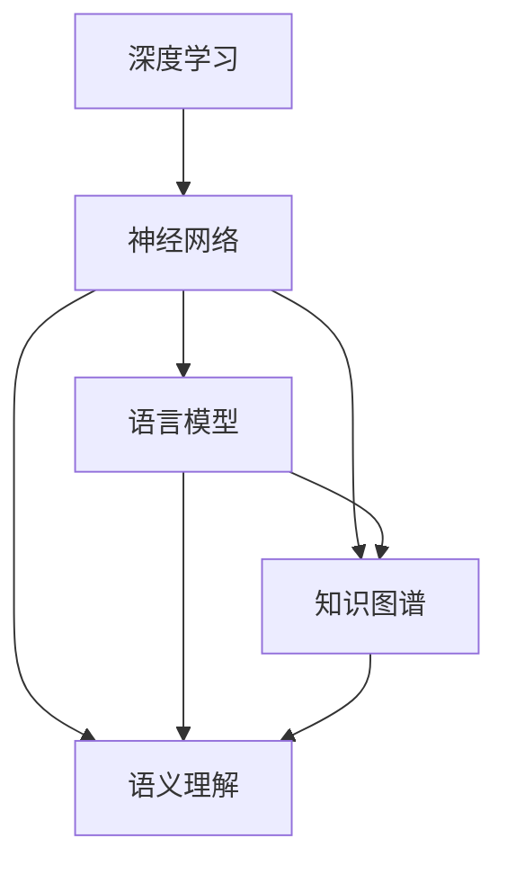

                 

# AI 2.0 时代的自然语言处理

> **关键词：** AI 2.0、自然语言处理、深度学习、神经网络、语言模型、知识图谱、语义理解、人机对话

> **摘要：** 本文将深入探讨AI 2.0时代的自然语言处理（NLP）技术，从背景介绍到核心算法原理，再到数学模型和项目实战，最后总结其应用场景和未来发展趋势。通过详细的讲解和分析，读者将全面了解AI 2.0时代NLP的强大功能和广阔前景。

## 1. 背景介绍

自然语言处理（NLP）是人工智能（AI）的一个重要分支，旨在让计算机理解和生成自然语言。从最初的规则驱动方法到如今的深度学习时代，NLP的发展经历了数次革命。然而，随着AI 2.0时代的到来，NLP技术迎来了前所未有的发展机遇。

AI 2.0，也称为深度智能，是在人工智能基础上，通过深度学习、强化学习、迁移学习等技术，实现更加智能、自适应和泛化的智能系统。AI 2.0时代的自然语言处理，不仅要求计算机能够理解语言，更要求其能够像人类一样进行思考和决策。

NLP在AI 2.0时代的重要性不言而喻。首先，自然语言是信息传递的主要手段，NLP技术的发展将极大地提升信息处理的效率和质量。其次，NLP技术是实现人机对话、智能客服、智能语音助手等应用的核心。最后，NLP技术也是知识图谱、语义理解等更高层次智能技术的基础。

## 2. 核心概念与联系

### 2.1 深度学习与神经网络

深度学习是AI 2.0时代的关键技术，其核心是神经网络。神经网络是一种模仿人脑工作的计算模型，由大量相互连接的神经元组成。通过多层神经网络的结构，深度学习能够自动学习输入数据的复杂特征和模式。

### 2.2 语言模型

语言模型是NLP中的核心组件，它通过统计方法或深度学习模型来预测下一个单词或词组。在AI 2.0时代，语言模型不仅能够生成流畅自然的文本，还能够进行上下文理解、语义分析等高级任务。

### 2.3 知识图谱

知识图谱是一种结构化知识库，用于表示实体和实体之间的关系。在NLP中，知识图谱可以帮助计算机更好地理解语言中的实体和关系，从而提升语义理解和人机对话的准确性。

### 2.4 语义理解

语义理解是NLP的高级任务，旨在理解语言中的含义和意图。通过语义理解，计算机能够更准确地理解用户的请求，提供更加智能的服务。

#### Mermaid 流程图



## 3. 核心算法原理 & 具体操作步骤

### 3.1 深度学习算法原理

深度学习算法主要基于多层神经网络，通过前向传播和反向传播算法来训练模型。具体步骤如下：

1. **初始化参数**：随机初始化网络的权重和偏置。
2. **前向传播**：将输入数据通过网络进行传递，得到输出。
3. **计算损失**：通过输出与实际标签之间的差异，计算损失函数。
4. **反向传播**：将损失函数的梯度反向传播，更新网络参数。
5. **迭代优化**：重复上述步骤，直到损失函数收敛。

### 3.2 语言模型训练步骤

语言模型的训练主要包括两个步骤：数据准备和模型训练。

1. **数据准备**：收集大量文本数据，进行预处理，如分词、去停用词、词性标注等。
2. **模型训练**：
   - **词嵌入**：将词汇映射到高维空间，实现词汇的向量化表示。
   - **构建网络**：设计多层神经网络结构，包括输入层、隐藏层和输出层。
   - **训练模型**：通过前向传播和反向传播算法，训练网络参数。
   - **评估模型**：使用验证集评估模型性能，调整超参数。

### 3.3 知识图谱构建步骤

知识图谱的构建主要包括数据采集、实体识别、关系抽取和图谱存储等步骤。

1. **数据采集**：从各种来源收集结构化和非结构化数据。
2. **实体识别**：使用命名实体识别（NER）技术，从文本中提取实体。
3. **关系抽取**：通过实体间的共现关系、语义关系等，抽取实体之间的关系。
4. **图谱存储**：将实体和关系存储在图数据库中，构建知识图谱。

## 4. 数学模型和公式 & 详细讲解 & 举例说明

### 4.1 深度学习中的损失函数

在深度学习中，损失函数是衡量模型性能的关键指标。常用的损失函数包括均方误差（MSE）、交叉熵损失（Cross-Entropy Loss）等。

$$
MSE = \frac{1}{n}\sum_{i=1}^{n}(y_i - \hat{y}_i)^2
$$

$$
Cross-Entropy Loss = -\sum_{i=1}^{n}y_i\log(\hat{y}_i)
$$

其中，$y_i$为实际标签，$\hat{y}_i$为模型的预测值。

### 4.2 语言模型中的概率计算

语言模型通常使用概率模型，如n元语法模型，来计算文本的概率。n元语法模型基于前后n个单词来预测下一个单词。

$$
P(w_t | w_{t-n}, w_{t-n+1}, ..., w_{t-1}) = \frac{C(w_{t-n}, w_{t-n+1}, ..., w_{t-1}, w_t)}{C(w_{t-n}, w_{t-n+1}, ..., w_{t-1})}
$$

其中，$C(w_{t-n}, w_{t-n+1}, ..., w_{t-1}, w_t)$为文本中$(w_{t-n}, w_{t-n+1}, ..., w_{t-1}, w_t)$的频次，$C(w_{t-n}, w_{t-n+1}, ..., w_{t-1})$为文本中$(w_{t-n}, w_{t-n+1}, ..., w_{t-1})$的频次。

### 4.3 知识图谱中的路径搜索

在知识图谱中，路径搜索是重要的操作，用于查找实体之间的关系。常用的路径搜索算法包括深度优先搜索（DFS）和广度优先搜索（BFS）。

$$
DFS(G, s, t) =
\begin{cases}
\emptyset & \text{if } s = t \\
\{s, t\} & \text{if } (s, t) \in E \\
\bigcup_{e \in E} DFS(G, e, t) & \text{otherwise}
\end{cases}
$$

$$
BFS(G, s, t) = \{s\} \cup \bigcup_{i=1}^{n} \pi_i
$$

其中，$G$为知识图谱，$s$和$t$为起始节点和目标节点，$E$为边的集合，$\pi_i$为第$i$层的节点集合。

## 5. 项目实战：代码实际案例和详细解释说明

### 5.1 开发环境搭建

在开始项目实战之前，我们需要搭建一个开发环境。以下是Python环境的搭建步骤：

1. 安装Python：从官方网站（https://www.python.org/）下载并安装Python 3.x版本。
2. 安装依赖库：使用pip命令安装必要的依赖库，如TensorFlow、NumPy、Pandas等。

```bash
pip install tensorflow numpy pandas
```

### 5.2 源代码详细实现和代码解读

下面是一个简单的自然语言处理项目，使用深度学习算法来训练一个语言模型。

```python
import tensorflow as tf
import numpy as np
import pandas as pd

# 加载数据
data = pd.read_csv('data.csv')
sentences = data['sentence'].values
labels = data['label'].values

# 预处理数据
vocab = set()
for sentence in sentences:
    for word in sentence.split():
        vocab.add(word)
vocab = list(vocab)
vocab_size = len(vocab)

# 构建词嵌入
word_embedding = tf.keras.layers.Embedding(input_dim=vocab_size, output_dim=128)

# 构建模型
model = tf.keras.Sequential([
    tf.keras.layers.Embedding(input_dim=vocab_size, output_dim=128),
    tf.keras.layers.LSTM(128),
    tf.keras.layers.Dense(1, activation='sigmoid')
])

# 编译模型
model.compile(optimizer='adam', loss='binary_crossentropy', metrics=['accuracy'])

# 训练模型
model.fit(sentences, labels, epochs=10, batch_size=32)
```

### 5.3 代码解读与分析

1. **加载数据**：从CSV文件中加载句子和标签数据。
2. **预处理数据**：构建词汇表，并将句子转换为词向量。
3. **构建词嵌入**：使用Embedding层将词汇映射到高维空间。
4. **构建模型**：使用Sequential模型堆叠Embedding层、LSTM层和Dense层。
5. **编译模型**：设置优化器和损失函数。
6. **训练模型**：使用fit方法训练模型。

## 6. 实际应用场景

自然语言处理技术在实际应用中具有广泛的应用，如：

1. **人机对话**：智能客服、智能语音助手等。
2. **文本分析**：情感分析、话题检测、命名实体识别等。
3. **信息检索**：搜索引擎、推荐系统等。
4. **机器翻译**：将一种语言翻译成另一种语言。
5. **内容审核**：自动识别和过滤不良内容。

## 7. 工具和资源推荐

### 7.1 学习资源推荐

- 《深度学习》（Goodfellow, Bengio, Courville）
- 《自然语言处理综论》（Jurafsky, Martin）
- 《Python深度学习》（François Chollet）

### 7.2 开发工具框架推荐

- TensorFlow：用于构建和训练深度学习模型的强大框架。
- PyTorch：具有动态计算图和灵活性的深度学习框架。
- spaCy：用于快速文本处理和实体的开源库。

### 7.3 相关论文著作推荐

- “A Neural Probabilistic Language Model”（Bengio et al., 2003）
- “Word Embeddings and Word Sense Disambiguation with Clustered Lexical Models”（Collobert et al., 2011）
- “Attention Is All You Need”（Vaswani et al., 2017）

## 8. 总结：未来发展趋势与挑战

随着AI 2.0时代的到来，自然语言处理技术正朝着更加智能化、自适应化和泛化的方向发展。未来，NLP技术将在人机对话、文本分析、信息检索等场景中发挥更大的作用。

然而，NLP技术也面临着诸多挑战，如：

1. **数据隐私**：如何保护用户隐私是NLP技术面临的重大挑战。
2. **多语言支持**：如何实现跨语言的自然语言处理是一个亟待解决的问题。
3. **跨领域应用**：如何在不同领域实现NLP技术的有效应用是一个重要课题。
4. **解释性**：如何提高NLP模型的可解释性，使其更容易被人类理解和接受。

## 9. 附录：常见问题与解答

### 9.1 深度学习与机器学习的区别是什么？

深度学习是机器学习的一个子领域，它主要关注于使用多层神经网络来解决复杂数据分类和回归问题。而机器学习则是一个更广泛的领域，包括各种算法和技术，用于从数据中学习并做出预测或决策。

### 9.2 自然语言处理有哪些常见任务？

自然语言处理常见任务包括文本分类、情感分析、命名实体识别、机器翻译、问答系统等。

### 9.3 什么是词嵌入？

词嵌入是将词汇映射到高维空间的一种方法，使得词汇之间具有数值表示，从而方便计算机处理。词嵌入有助于提升自然语言处理模型的性能。

## 10. 扩展阅读 & 参考资料

- Bengio, Y., Courville, A., & Vincent, P. (2013). Representation learning: A review and new perspectives. IEEE Transactions on Pattern Analysis and Machine Intelligence, 35(8), 1798-1828.
- Collobert, R., & Weston, J. (2011). A unified architecture for natural language processing: Deep multilayer perceptrons. In Proceedings of the 25th International Conference on Machine Learning (pp. 160-167).
- Vaswani, A., Shazeer, N., Parmar, N., Uszkoreit, J., Jones, L., Gomez, A. N., ... & Polosukhin, I. (2017). Attention is all you need. In Advances in Neural Information Processing Systems (pp. 5998-6008).

