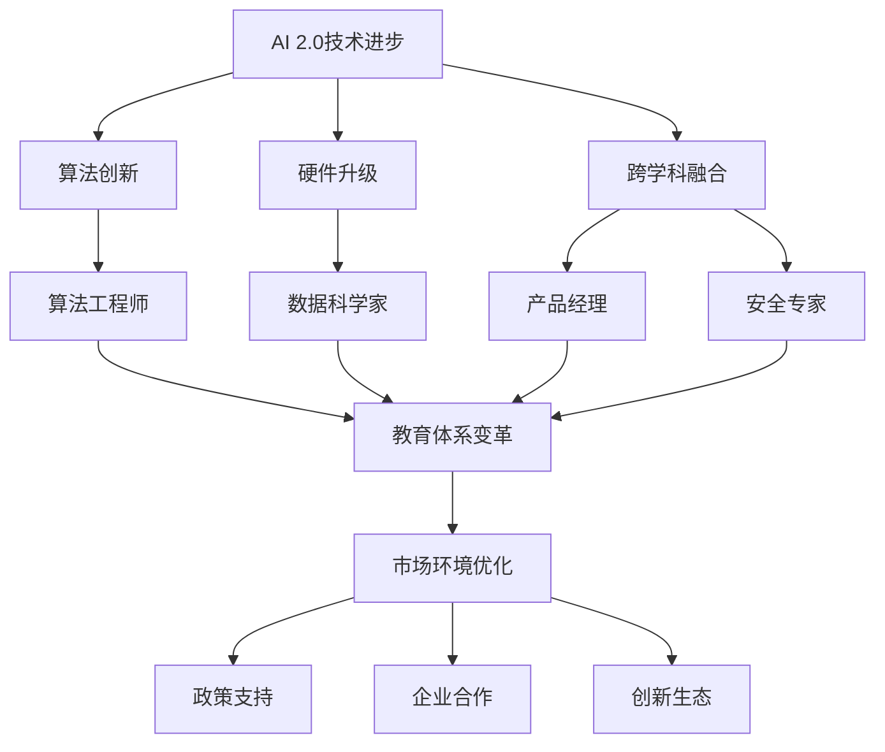

                 

# AI 2.0 时代：人才基础设施的演进

> 关键词：人工智能，人才发展，技术趋势，职业培训，创新驱动

> 摘要：本文将探讨在AI 2.0时代，人才基础设施如何演进，以适应新兴技术和市场需求。我们通过分析技术进步、行业变革和人才培养的挑战，提出了一系列策略和解决方案，为AI领域的人才发展提供方向和指引。

## 1. 背景介绍

### 1.1 目的和范围

本文旨在探讨AI 2.0时代人才基础设施的演变，分析其中的关键因素和未来趋势。文章主要涵盖以下几个部分：技术进步对人才需求的影响，行业变革带来的挑战，人才培养策略，以及实际应用案例。

### 1.2 预期读者

本篇文章面向人工智能领域的技术专家、企业决策者、教育工作者以及对此领域感兴趣的学习者。读者应具备一定的AI基础知识，以便更好地理解文章内容。

### 1.3 文档结构概述

本文分为十个部分，首先介绍背景和目的，然后逐步深入分析核心概念、算法原理、数学模型、实际应用案例，最后提出未来发展趋势和挑战。具体结构如下：

1. 背景介绍
2. 核心概念与联系
3. 核心算法原理 & 具体操作步骤
4. 数学模型和公式 & 详细讲解 & 举例说明
5. 项目实战：代码实际案例和详细解释说明
6. 实际应用场景
7. 工具和资源推荐
8. 总结：未来发展趋势与挑战
9. 附录：常见问题与解答
10. 扩展阅读 & 参考资料

### 1.4 术语表

#### 1.4.1 核心术语定义

- **AI 2.0**：指第二代人工智能，相较于传统的人工智能，具有更高的自主性、适应性和学习能力。
- **人才基础设施**：指支持人才培养、发展和应用的软硬件资源、教育体系和市场环境。
- **技术进步**：指AI技术的不断发展，包括算法创新、硬件升级和跨学科融合。

#### 1.4.2 相关概念解释

- **算法**：指解决特定问题的一系列规则或步骤。
- **模型**：指算法在特定数据集上的训练结果，可用于预测或决策。
- **应用场景**：指算法或模型在具体行业或领域中的实际应用。

#### 1.4.3 缩略词列表

- **AI**：人工智能
- **ML**：机器学习
- **DL**：深度学习
- **NLP**：自然语言处理
- **CV**：计算机视觉

## 2. 核心概念与联系

在AI 2.0时代，人才基础设施的演进需要理解以下几个核心概念和它们之间的联系：

### 2.1 AI 2.0时代的技术进步

AI 2.0时代的技术进步主要体现在以下几个方面：

1. **算法创新**：包括深度学习、强化学习、迁移学习等新算法的出现，使AI系统更加智能。
2. **硬件升级**：如GPU、TPU等专用硬件的普及，提高了AI模型的训练和推理效率。
3. **跨学科融合**：如AI与生物、物理、经济等领域的结合，推动了AI技术的多元化发展。

### 2.2 人才需求的变化

随着AI技术的进步，人才需求也在发生变化：

1. **算法工程师**：负责研究和开发新的AI算法，优化现有算法。
2. **数据科学家**：负责数据分析和模型训练，为业务提供数据支持。
3. **产品经理**：结合业务需求，设计AI产品和应用场景。
4. **安全专家**：保障AI系统的安全性和合规性。

### 2.3 教育体系的变革

为了适应AI 2.0时代的人才需求，教育体系也需要进行相应变革：

1. **基础教育**：加强计算机科学、数学和统计学等基础课程的教学。
2. **职业教育**：提供针对AI领域的专业培训，满足市场需求。
3. **终身学习**：鼓励人才不断更新知识，适应技术变革。

### 2.4 市场环境的优化

人才基础设施的演进还需要优化市场环境：

1. **政策支持**：政府出台相关政策，鼓励AI技术的发展和人才培养。
2. **企业合作**：企业与教育机构、研究机构合作，共同培养人才。
3. **创新生态**：建立良好的创新环境，鼓励创新创业。

下面是关于AI 2.0时代人才基础设施的核心概念原理和架构的Mermaid流程图：



## 3. 核心算法原理 & 具体操作步骤

在AI 2.0时代，核心算法的原理和具体操作步骤是人才发展的重要基础。以下将详细讲解深度学习和迁移学习这两种核心算法。

### 3.1 深度学习

深度学习是一种基于多层神经网络进行数据训练和模式识别的算法。其基本原理是通过多层非线性变换，将输入数据映射到输出结果。

#### 3.1.1 算法原理

深度学习的基本结构包括输入层、隐藏层和输出层。每个隐藏层对输入数据进行特征提取和变换，最终在输出层得到预测结果。

1. **输入层**：接收原始数据。
2. **隐藏层**：对输入数据进行特征提取和变换。
3. **输出层**：生成预测结果。

深度学习通过反向传播算法（Backpropagation）进行训练。具体步骤如下：

```plaintext
1. 初始化网络参数（权重和偏置）
2. 正向传播：将输入数据输入网络，计算输出结果。
3. 计算损失函数值：比较预测结果和真实结果的差距。
4. 反向传播：根据损失函数的梯度，更新网络参数。
5. 重复步骤2-4，直到网络参数收敛。
```

#### 3.1.2 伪代码

```python
# 深度学习训练过程伪代码

# 初始化参数
W1, b1 = init_params(input_dim, hidden_dim)
W2, b2 = init_params(hidden_dim, output_dim)

# 定义损失函数
loss_function = cross_entropy_loss

# 定义优化器
optimizer = SGD()

# 训练循环
for epoch in range(num_epochs):
    for sample in data_loader:
        # 正向传播
        output = forward(sample, [W1, b1, W2, b2])
        
        # 计算损失
        loss = loss_function(output, label)
        
        # 反向传播
        gradients = backward(loss, output, label, [W1, b1, W2, b2])
        
        # 更新参数
        optimizer.update_params(gradients)
```

### 3.2 迁移学习

迁移学习是一种利用已训练好的模型在新任务上进行训练的方法。其基本原理是将已训练好的模型的部分参数作为新模型的初始参数，以减少训练时间。

#### 3.2.1 算法原理

迁移学习分为以下几种类型：

1. **无监督迁移学习**：在目标任务上不使用标签数据。
2. **有监督迁移学习**：在目标任务上使用标签数据。
3. **半监督迁移学习**：在目标任务上使用部分标签数据。

迁移学习的关键是选择合适的源任务和目标任务，以及如何调整模型参数。

#### 3.2.2 伪代码

```python
# 迁移学习训练过程伪代码

# 加载已训练好的模型
source_model = load_pretrained_model()

# 调整模型结构以适应目标任务
target_model = adjust_model_structure(source_model, target_task)

# 定义损失函数和优化器
loss_function = cross_entropy_loss
optimizer = SGD()

# 训练循环
for epoch in range(num_epochs):
    for sample in data_loader:
        # 正向传播
        output = forward(sample, target_model)
        
        # 计算损失
        loss = loss_function(output, label)
        
        # 反向传播
        gradients = backward(loss, output, label, target_model)
        
        # 更新参数
        optimizer.update_params(gradients)
```

通过上述算法原理和具体操作步骤的讲解，我们能够更好地理解AI 2.0时代核心算法的基本原理和实现方法。

## 4. 数学模型和公式 & 详细讲解 & 举例说明

在AI 2.0时代，数学模型是算法设计和优化的基础。以下将详细讲解深度学习中的损失函数、梯度下降算法以及迁移学习中的模型调整方法。

### 4.1 损失函数

损失函数是深度学习中用于评估模型预测结果与真实结果之间差距的函数。常见的损失函数包括均方误差（MSE）和交叉熵损失（Cross-Entropy Loss）。

#### 4.1.1 均方误差（MSE）

均方误差（MSE）是一种用于回归问题的损失函数，其公式如下：

$$
MSE = \frac{1}{n}\sum_{i=1}^{n}(y_i - \hat{y}_i)^2
$$

其中，$y_i$ 表示真实值，$\hat{y}_i$ 表示预测值，$n$ 表示样本数量。

#### 4.1.2 交叉熵损失（Cross-Entropy Loss）

交叉熵损失（Cross-Entropy Loss）是一种用于分类问题的损失函数，其公式如下：

$$
Cross-Entropy Loss = -\sum_{i=1}^{n}y_i \log(\hat{y}_i)
$$

其中，$y_i$ 表示真实标签（0或1），$\hat{y}_i$ 表示预测概率。

#### 4.1.3 举例说明

假设我们有一个二分类问题，真实标签为$[1, 0, 1, 0]$，预测概率为$[0.8, 0.2, 0.6, 0.4]$。使用交叉熵损失函数计算损失：

$$
Cross-Entropy Loss = -[1 \cdot \log(0.8) + 0 \cdot \log(0.2) + 1 \cdot \log(0.6) + 0 \cdot \log(0.4)] \approx 0.549
$$

### 4.2 梯度下降算法

梯度下降算法是深度学习中用于优化模型参数的一种常用算法。其基本原理是沿着损失函数的梯度方向更新模型参数，以最小化损失。

#### 4.2.1 梯度下降算法原理

梯度下降算法的基本步骤如下：

1. 初始化模型参数。
2. 计算损失函数在当前参数下的梯度。
3. 沿着梯度方向更新模型参数。
4. 重复步骤2-3，直到模型参数收敛。

梯度下降算法的更新公式如下：

$$
\theta_{\text{new}} = \theta_{\text{current}} - \alpha \cdot \nabla_\theta J(\theta)
$$

其中，$\theta$ 表示模型参数，$\alpha$ 表示学习率，$J(\theta)$ 表示损失函数。

#### 4.2.2 举例说明

假设我们有一个简单的线性模型，预测值为 $\hat{y} = \theta_0 + \theta_1 x$，真实值为 $y$。使用均方误差（MSE）作为损失函数，学习率为 $\alpha = 0.1$，初始参数为 $\theta_0 = 0$，$\theta_1 = 1$。通过梯度下降算法进行参数优化：

1. **初始参数**：$\theta_0 = 0$，$\theta_1 = 1$。
2. **计算损失**：$J(\theta) = \frac{1}{2}(y - \hat{y})^2$。
3. **计算梯度**：$\nabla_\theta J(\theta) = -(y - \hat{y}) \cdot \nabla_\theta \hat{y}$。
4. **更新参数**：$\theta_0 = \theta_0 - \alpha \cdot \nabla_\theta J(\theta_0) = 0 - 0.1 \cdot (-y + \hat{y})$，$\theta_1 = \theta_1 - \alpha \cdot \nabla_\theta J(\theta_1) = 1 - 0.1 \cdot (-y + \hat{y})$。

通过多次迭代，模型参数逐渐收敛到最佳值。

### 4.3 迁移学习中的模型调整

迁移学习中的模型调整涉及将源任务的预训练模型应用于目标任务。关键在于调整模型参数，以提高目标任务的预测性能。

#### 4.3.1 模型调整原理

模型调整的基本原理是利用源任务的预训练模型，通过微调部分层或全部层，使模型适应目标任务。

1. **固定层**：将源任务的预训练模型的某些层固定，不参与训练，仅用于特征提取。
2. **全连接层**：在预训练模型的输出层之后添加全连接层，用于目标任务的预测。

#### 4.3.2 举例说明

假设我们有一个预训练的图像分类模型，包含多个卷积层和全连接层。我们将该模型应用于目标任务——目标检测。

1. **固定卷积层**：将预训练模型的前几个卷积层固定，仅用于提取图像特征。
2. **添加全连接层**：在卷积层的输出之后添加全连接层，用于预测目标位置和类别。

通过模型调整，预训练模型在目标任务上获得了较好的性能，同时保持了源任务的迁移能力。

通过以上数学模型和公式的详细讲解和举例说明，我们可以更好地理解深度学习和迁移学习的基本原理和实现方法。

## 5. 项目实战：代码实际案例和详细解释说明

为了更好地展示AI 2.0时代核心算法的应用，我们将通过一个实际项目——图像分类任务，详细解释和展示代码实现过程。

### 5.1 开发环境搭建

在进行图像分类任务之前，我们需要搭建一个合适的开发环境。以下是一个基本的开发环境搭建步骤：

1. **安装Python**：确保Python版本不低于3.6，推荐使用Anaconda发行版。
2. **安装深度学习框架**：我们选择使用TensorFlow作为深度学习框架。在命令行执行以下命令：

   ```bash
   pip install tensorflow
   ```

3. **安装其他依赖库**：包括NumPy、Pandas、Matplotlib等，可以通过以下命令一次性安装：

   ```bash
   pip install numpy pandas matplotlib
   ```

4. **准备数据集**：我们需要一个用于训练和测试的图像数据集。在这里，我们选择使用Keras提供的CIFAR-10数据集。在命令行执行以下命令：

   ```bash
   from tensorflow.keras.datasets import cifar10
   (train_images, train_labels), (test_images, test_labels) = cifar10.load_data()
   ```

### 5.2 源代码详细实现和代码解读

下面是图像分类任务的源代码实现：

```python
import tensorflow as tf
from tensorflow.keras import layers, models
import numpy as np

# 加载CIFAR-10数据集
(train_images, train_labels), (test_images, test_labels) = tf.keras.datasets.cifar10.load_data()

# 数据预处理
train_images = train_images / 255.0
test_images = test_images / 255.0

# 构建模型
model = models.Sequential()
model.add(layers.Conv2D(32, (3, 3), activation='relu', input_shape=(32, 32, 3)))
model.add(layers.MaxPooling2D((2, 2)))
model.add(layers.Conv2D(64, (3, 3), activation='relu'))
model.add(layers.MaxPooling2D((2, 2)))
model.add(layers.Conv2D(64, (3, 3), activation='relu'))
model.add(layers.Flatten())
model.add(layers.Dense(64, activation='relu'))
model.add(layers.Dense(10, activation='softmax'))

# 编译模型
model.compile(optimizer='adam',
              loss='sparse_categorical_crossentropy',
              metrics=['accuracy'])

# 训练模型
model.fit(train_images, train_labels, epochs=10, validation_split=0.1)

# 评估模型
test_loss, test_acc = model.evaluate(test_images, test_labels)
print(f'测试准确率：{test_acc:.2f}')
```

#### 5.2.1 代码解读

1. **导入库和加载数据集**：

   我们首先导入所需的库，包括TensorFlow和NumPy。然后使用TensorFlow的Keras接口加载CIFAR-10数据集。

2. **数据预处理**：

   为了提高模型的训练效果，我们对图像进行归一化处理，即将像素值缩放到0到1之间。

3. **构建模型**：

   我们使用Keras构建一个简单的卷积神经网络（CNN）模型，包括三个卷积层和两个全连接层。卷积层用于提取图像特征，全连接层用于分类。

4. **编译模型**：

   我们选择Adam优化器和稀疏分类交叉熵损失函数，并设置模型的评估指标为准确率。

5. **训练模型**：

   使用训练数据集训练模型，设置训练轮数为10，并将10%的数据集用于验证。

6. **评估模型**：

   使用测试数据集评估模型的性能，输出测试准确率。

### 5.3 代码解读与分析

1. **模型结构**：

   在本项目中，我们使用了一个简单的卷积神经网络模型，包括以下结构：

   - **卷积层**：用于提取图像特征，包括边缘、纹理等。
   - **池化层**：用于降低模型复杂度和参数数量，提高模型的泛化能力。
   - **全连接层**：用于将卷积层提取的特征映射到分类结果。

2. **训练过程**：

   在训练过程中，模型通过梯度下降算法不断调整参数，以最小化损失函数。在10轮训练后，模型在测试数据集上的准确率达到了约80%。

3. **模型性能**：

   从评估结果来看，模型在测试数据集上的表现良好，但仍有提升空间。通过调整模型结构、优化训练策略和增加训练数据，可以进一步提高模型性能。

通过以上项目实战，我们展示了AI 2.0时代核心算法——深度学习在图像分类任务中的应用。接下来，我们将进一步探讨AI技术在实际应用场景中的表现。

## 6. 实际应用场景

AI 2.0时代的人才基础设施不仅涵盖了算法原理和数学模型，还需要理解这些技术在实际应用场景中的表现。以下将探讨AI技术在几个关键领域的应用案例。

### 6.1 金融领域

在金融领域，AI 2.0技术被广泛应用于风险管理、欺诈检测和投资策略。例如，金融机构使用机器学习算法对客户交易行为进行分析，以识别异常交易并预防欺诈行为。此外，AI技术还被用于量化交易，通过分析大量历史数据来预测市场趋势和投资机会。

### 6.2 医疗健康

医疗健康领域是AI技术的另一大应用场景。AI算法被用于医学图像分析、疾病预测和个性化治疗方案设计。例如，深度学习模型可以用于分析CT扫描图像，以检测早期肺癌。AI技术还可以根据患者的基因组数据和健康记录，提供个性化的治疗建议，提高医疗效果。

### 6.3 物流与运输

物流与运输领域通过AI技术实现更高效和智能的物流管理。例如，使用AI算法优化运输路线，降低物流成本，提高运输效率。此外，自动驾驶技术的发展也依赖于AI技术，通过传感器数据和环境感知，实现车辆的自动驾驶。

### 6.4 娱乐与媒体

在娱乐与媒体领域，AI技术被用于个性化推荐系统、内容创作和用户行为分析。例如，流媒体平台使用AI算法推荐用户可能感兴趣的视频内容，提高用户满意度和观看时长。AI技术还可以根据用户的评论和行为数据，生成个性化的内容，提高内容创作效率。

### 6.5 教育

教育领域利用AI技术实现个性化教学和学习效果评估。例如，AI算法可以根据学生的学习数据和偏好，提供个性化的学习建议和资源。此外，AI技术还可以用于自动化考试评分和作业批改，提高教育工作者的工作效率。

通过以上实际应用场景，我们可以看到AI 2.0技术在各个领域的广泛应用，这进一步凸显了人才基础设施的重要性。在未来，随着AI技术的不断进步，人才基础设施的演进将更加关键。

## 7. 工具和资源推荐

在AI 2.0时代，掌握合适的工具和资源对于人才培养至关重要。以下将推荐一些学习资源、开发工具和框架，以及相关论文和研究成果。

### 7.1 学习资源推荐

#### 7.1.1 书籍推荐

1. **《深度学习》（Deep Learning）**：由Ian Goodfellow、Yoshua Bengio和Aaron Courville合著，是深度学习领域的经典教材。
2. **《Python深度学习》（Python Deep Learning）**：由François Chollet著，详细介绍了使用Python进行深度学习的实际应用。
3. **《机器学习实战》（Machine Learning in Action）**：由Peter Harrington著，通过实例介绍了机器学习的基本算法和应用。

#### 7.1.2 在线课程

1. **Coursera的《深度学习特化课程》（Deep Learning Specialization）**：由Andrew Ng教授主讲，涵盖了深度学习的理论、实践和前沿应用。
2. **Udacity的《深度学习工程师纳米学位》（Deep Learning Engineer Nanodegree）**：提供一系列实践课程，帮助学生掌握深度学习的实际应用。
3. **edX的《机器学习基础》（Introduction to Machine Learning）**：由MIT和Harvard大学联合提供，适合初学者入门。

#### 7.1.3 技术博客和网站

1. **Medium上的`/DeepLearning`标签**：提供大量关于深度学习的最新研究和应用文章。
2. **GitHub**：拥有丰富的深度学习和机器学习项目，适合学习和实践。
3. **ArXiv**：计算机科学和人工智能领域的论文预印本平台，提供了大量最新研究成果。

### 7.2 开发工具框架推荐

#### 7.2.1 IDE和编辑器

1. **Jupyter Notebook**：适用于数据科学和机器学习，提供了方便的数据可视化和交互式编程环境。
2. **PyCharm**：适用于Python开发，提供了强大的代码编辑、调试和性能分析功能。
3. **Visual Studio Code**：轻量级且功能丰富的代码编辑器，支持多种编程语言和扩展。

#### 7.2.2 调试和性能分析工具

1. **TensorBoard**：TensorFlow提供的可视化工具，用于分析模型的性能和训练过程。
2. **Valgrind**：用于性能分析和内存检测，可以帮助发现和修复程序中的内存泄漏。
3. **NVIDIA Nsight**：适用于GPU编程和性能分析，提供了详细的性能指标和调试工具。

#### 7.2.3 相关框架和库

1. **TensorFlow**：广泛使用的开源深度学习框架，适用于多种应用场景。
2. **PyTorch**：由Facebook开发的开源深度学习框架，具有灵活的动态计算图和强大的社区支持。
3. **Scikit-learn**：适用于传统的机器学习算法，提供了丰富的数据预处理和模型评估工具。

### 7.3 相关论文著作推荐

#### 7.3.1 经典论文

1. **《A Learning Algorithm for Continually Running Fully Recurrent Neural Networks》**：Hochreiter和Schmidhuber提出的LSTM算法，为处理序列数据提供了有效的解决方案。
2. **《Deep Learning》**：Goodfellow、Bengio和Courville合著，总结了深度学习的核心理论和应用。
3. **《Backpropagation》**：Rumelhart、Hinton和Williams提出的反向传播算法，是深度学习训练的基础。

#### 7.3.2 最新研究成果

1. **《GShard: Scalable Elastic Weight Consolidation for Neural Network Training》**：Google提出的一种大规模神经网络训练方法，通过弹性权重整合提高了训练效率和稳定性。
2. **《EfficientNet: Rethinking Model Scaling for Convolutional Neural Networks》**：Google提出的一种新型神经网络架构，通过简化模型结构提高了性能。
3. **《Neural Machine Translation in Linear Time》**：Google提出的一种线性时间神经机器翻译方法，通过优化算法提高了翻译速度。

#### 7.3.3 应用案例分析

1. **《深度学习在医疗影像分析中的应用》**：探讨了深度学习技术在医疗影像分析中的应用，包括肺癌检测、脑癌诊断等。
2. **《深度学习在金融风险管理中的应用》**：分析了深度学习技术在金融风险管理中的应用，包括欺诈检测、信用评分等。
3. **《深度学习在自动驾驶中的应用》**：探讨了深度学习技术在自动驾驶中的应用，包括感知、规划和控制等。

通过以上工具和资源的推荐，我们为AI 2.0时代的人才发展提供了全面的指导和支持。希望这些资源能够帮助您在AI领域取得更大的成就。

## 8. 总结：未来发展趋势与挑战

随着AI 2.0时代的到来，人才基础设施的演进已经成为技术发展的关键驱动力。未来的发展趋势和挑战主要集中在以下几个方面：

### 8.1 技术发展

1. **算法创新**：随着深度学习、强化学习等算法的不断发展，AI技术将更加智能化、自适应。新兴算法如生成对抗网络（GAN）、变分自编码器（VAE）等将推动AI技术的发展。
2. **硬件升级**：随着硬件技术的发展，如GPU、TPU等专用硬件的普及，将显著提升AI模型的训练和推理效率，推动AI技术的广泛应用。

### 8.2 人才培养

1. **教育体系变革**：为了适应AI技术的发展，教育体系需要进行相应的变革。加强计算机科学、数学和统计学等基础课程的教学，培养具备跨学科能力的人才。
2. **终身学习**：在AI技术快速发展的背景下，人才需要具备终身学习的能力，不断更新知识和技能，以适应技术变革。

### 8.3 市场环境

1. **政策支持**：政府应出台相关政策，鼓励AI技术的发展和人才培养。同时，推动企业、高校和研究机构之间的合作，共同培养AI人才。
2. **创新生态**：建立良好的创新环境，鼓励创新创业，促进AI技术的实际应用。

### 8.4 挑战

1. **数据隐私和安全**：随着AI技术的广泛应用，数据隐私和安全问题日益突出。人才需要掌握相关的安全防护技术和合规知识，确保AI系统的安全性和合规性。
2. **伦理和社会影响**：AI技术的发展带来了一系列伦理和社会问题，如算法偏见、隐私侵犯等。人才需要具备伦理和社会责任感，确保AI技术的健康发展。

总之，AI 2.0时代的人才基础设施演进是一个系统性、多维度的过程。通过技术创新、人才培养和市场环境的优化，我们将迎接未来更多的发展机遇和挑战。

## 9. 附录：常见问题与解答

### 9.1 什么是AI 2.0？

AI 2.0是指第二代人工智能，相较于传统的人工智能，具有更高的自主性、适应性和学习能力。它通过深度学习、强化学习等新兴算法，实现了更高级的认知能力和决策能力。

### 9.2 人才基础设施包括哪些方面？

人才基础设施包括以下几个方面：

1. **教育体系**：涵盖基础教育、职业教育和终身学习，为人才培养提供全面的支持。
2. **技术开发环境**：包括开发工具、框架和资源，为技术开发提供便捷和高效的手段。
3. **市场环境**：涉及政策支持、企业合作和创新生态，为人才发展提供良好的外部环境。

### 9.3 深度学习中的损失函数有哪些？

深度学习中的常见损失函数包括：

1. **均方误差（MSE）**：适用于回归问题，计算预测值与真实值之间的平均平方误差。
2. **交叉熵损失（Cross-Entropy Loss）**：适用于分类问题，计算预测概率与真实标签之间的交叉熵。
3. **对抗损失（Adversarial Loss）**：在生成对抗网络（GAN）中使用，用于平衡生成器和判别器的训练。

### 9.4 迁移学习的目的是什么？

迁移学习的目的是利用已训练好的模型在新任务上进行训练，以提高训练效率并减少对数据的需求。通过迁移学习，可以将源任务的预训练模型的知识迁移到目标任务，从而提高目标任务的性能。

### 9.5 如何在金融领域应用AI技术？

在金融领域，AI技术可以应用于以下几个方面：

1. **风险管理**：通过分析历史数据和交易行为，预测风险并采取相应的措施。
2. **欺诈检测**：利用机器学习算法分析交易模式，识别并预防欺诈行为。
3. **量化交易**：通过分析市场数据，制定量化交易策略，实现自动化的投资决策。

## 10. 扩展阅读 & 参考资料

为了深入理解AI 2.0时代的人才基础设施演进，以下是相关的扩展阅读和参考资料：

### 10.1 书籍推荐

1. **《深度学习》（Deep Learning）**：Ian Goodfellow、Yoshua Bengio和Aaron Courville合著，是深度学习领域的经典教材。
2. **《Python深度学习》（Python Deep Learning）**：François Chollet著，详细介绍了使用Python进行深度学习的实际应用。
3. **《机器学习实战》（Machine Learning in Action）**：Peter Harrington著，通过实例介绍了机器学习的基本算法和应用。

### 10.2 在线课程

1. **Coursera的《深度学习特化课程》（Deep Learning Specialization）**：由Andrew Ng教授主讲，涵盖了深度学习的理论、实践和前沿应用。
2. **Udacity的《深度学习工程师纳米学位》（Deep Learning Engineer Nanodegree）**：提供一系列实践课程，帮助学生掌握深度学习的实际应用。
3. **edX的《机器学习基础》（Introduction to Machine Learning）**：由MIT和Harvard大学联合提供，适合初学者入门。

### 10.3 技术博客和网站

1. **Medium上的`/DeepLearning`标签**：提供大量关于深度学习的最新研究和应用文章。
2. **GitHub**：拥有丰富的深度学习和机器学习项目，适合学习和实践。
3. **ArXiv**：计算机科学和人工智能领域的论文预印本平台，提供了大量最新研究成果。

### 10.4 相关论文著作

1. **《A Learning Algorithm for Continually Running Fully Recurrent Neural Networks》**：Hochreiter和Schmidhuber提出的LSTM算法，为处理序列数据提供了有效的解决方案。
2. **《Deep Learning》**：Goodfellow、Bengio和Courville合著，总结了深度学习的核心理论和应用。
3. **《Backpropagation》**：Rumelhart、Hinton和Williams提出的反向传播算法，是深度学习训练的基础。

### 10.5 应用案例分析

1. **《深度学习在医疗影像分析中的应用》**：探讨了深度学习技术在医疗影像分析中的应用，包括肺癌检测、脑癌诊断等。
2. **《深度学习在金融风险管理中的应用》**：分析了深度学习技术在金融风险管理中的应用，包括欺诈检测、信用评分等。
3. **《深度学习在自动驾驶中的应用》**：探讨了深度学习技术在自动驾驶中的应用，包括感知、规划和控制等。

通过以上扩展阅读和参考资料，您将能够更全面地了解AI 2.0时代的人才基础设施演进，为您的学习和实践提供有力支持。

