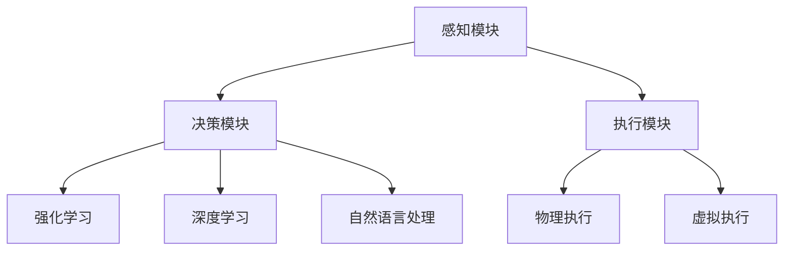

                 


# AI Agent 的技术浪潮

> **关键词：AI 代理、智能决策、强化学习、机器学习、深度学习、自然语言处理**

> **摘要：本文将深入探讨 AI 代理（Artificial Intelligence Agent）的技术浪潮，分析其核心概念、算法原理、数学模型以及实际应用场景，帮助读者全面了解这一前沿领域的现状与未来发展趋势。**

## 1. 背景介绍

### 1.1 目的和范围

本文旨在探讨 AI 代理领域的核心技术与发展趋势，通过详细的分析和讲解，帮助读者掌握 AI 代理的基本原理和实际应用。文章将涵盖以下主要内容：

- AI 代理的定义与分类
- AI 代理的核心算法原理
- AI 代理的数学模型与公式
- AI 代理的实际应用场景
- AI 代理的未来发展趋势与挑战

### 1.2 预期读者

本文适合以下读者群体：

- 对 AI 代理感兴趣的技术爱好者
- 想要深入了解 AI 代理技术的研究人员
- 从事 AI 代理开发与优化的工程师
- 想要在实际项目中应用 AI 代理的企业管理者

### 1.3 文档结构概述

本文分为十个部分，具体结构如下：

1. 背景介绍
2. 核心概念与联系
3. 核心算法原理 & 具体操作步骤
4. 数学模型和公式 & 详细讲解 & 举例说明
5. 项目实战：代码实际案例和详细解释说明
6. 实际应用场景
7. 工具和资源推荐
8. 总结：未来发展趋势与挑战
9. 附录：常见问题与解答
10. 扩展阅读 & 参考资料

### 1.4 术语表

#### 1.4.1 核心术语定义

- AI 代理：指一种能够感知环境、自主决策并采取行动的智能体，通过学习与优化不断提高其性能。
- 强化学习：一种机器学习方法，通过不断试错，逐步优化决策策略，以实现目标函数的最优化。
- 深度学习：一种基于多层神经网络的学习方法，通过模拟人脑的神经元结构，实现复杂函数的拟合和特征提取。
- 自然语言处理：研究如何让计算机理解和生成人类语言的技术，包括文本分类、情感分析、机器翻译等。

#### 1.4.2 相关概念解释

- 状态（State）：AI 代理所处的环境描述，通常由一组特征向量表示。
- 动作（Action）：AI 代理可以采取的行动，通常由一组离散或连续的值表示。
- 奖励（Reward）：AI 代理在执行动作后获得的即时反馈，用于评估动作的好坏。
- 策略（Policy）：AI 代理根据当前状态选择最优动作的规则。

#### 1.4.3 缩略词列表

- AI：人工智能
- RL：强化学习
- DNN：深度神经网络
- NLP：自然语言处理

## 2. 核心概念与联系

### 2.1 AI 代理的定义

AI 代理是指一种具有自主决策能力的智能体，它能够感知环境、分析信息、规划策略并采取行动，以实现特定目标。AI 代理的核心特征包括：

1. 感知环境：通过传感器收集环境信息，如图像、声音、文本等。
2. 自主决策：基于感知到的环境信息，利用算法和模型进行决策。
3. 行动执行：根据决策结果，执行相应的操作，如移动、发送信息、控制设备等。
4. 学习与优化：通过不断试错和经验积累，优化决策策略，提高性能。

### 2.2 AI 代理的分类

根据应用场景和任务需求，AI 代理可以划分为以下几类：

1. 监控型代理：主要用于实时监测环境变化，如智能家居系统、安防监控系统等。
2. 控制型代理：主要用于执行特定任务，如自动驾驶汽车、无人机等。
3. 交互型代理：主要用于与人或其他系统进行交互，如客服机器人、聊天机器人等。
4. 自主导航型代理：主要用于自主导航和路径规划，如无人驾驶飞机、无人船等。

### 2.3 AI 代理的核心算法原理

AI 代理的核心算法主要包括强化学习、深度学习和自然语言处理等。下面分别介绍这些算法的原理：

1. **强化学习**

强化学习是一种通过试错来优化决策策略的机器学习方法。它通过以下四个要素来描述 AI 代理的决策过程：

- **状态（State）**：描述代理当前所处的环境状态。
- **动作（Action）**：代理可以采取的动作。
- **奖励（Reward）**：代理采取动作后获得的即时反馈。
- **策略（Policy）**：代理根据当前状态选择动作的规则。

强化学习的主要目标是找到一种最优策略，使得代理在长期内获得最大总奖励。具体实现方法包括 Q-学习、深度 Q-学习（DQN）、策略梯度方法等。

2. **深度学习**

深度学习是一种基于多层神经网络的学习方法，能够自动提取特征并实现复杂函数的拟合。在 AI 代理中，深度学习主要用于以下两个方面：

- **特征提取**：通过多层神经网络自动提取输入数据中的特征，降低数据维度，提高分类或预测的准确率。
- **分类与预测**：利用训练好的深度神经网络，对输入数据进行分类或预测。

常见的深度学习模型包括卷积神经网络（CNN）、循环神经网络（RNN）、长短期记忆网络（LSTM）等。

3. **自然语言处理**

自然语言处理是一种研究如何让计算机理解和生成人类语言的技术。在 AI 代理中，自然语言处理主要用于以下两个方面：

- **文本分类**：将文本数据按照预定的分类标准进行分类，如情感分析、新闻分类等。
- **情感分析**：分析文本数据中的情感倾向，如积极情感、消极情感等。
- **机器翻译**：将一种语言的文本翻译成另一种语言。

常见的自然语言处理技术包括词向量表示、卷积神经网络（CNN）、循环神经网络（RNN）等。

### 2.4 AI 代理的核心架构

AI 代理的核心架构包括感知模块、决策模块和执行模块。下面分别介绍这三个模块的功能和实现方式：

1. **感知模块**

感知模块负责接收环境信息，并将其转换为内部表示。常见的感知方式包括：

- **图像感知**：通过摄像头或图像传感器获取环境图像，并使用深度学习模型进行图像识别和分类。
- **声音感知**：通过麦克风或声音传感器获取环境声音，并使用深度学习模型进行语音识别和分类。
- **文本感知**：通过传感器或网络获取文本信息，并使用自然语言处理技术进行文本分类、情感分析和语义理解。

2. **决策模块**

决策模块负责根据感知模块获取的环境信息，利用算法和模型生成最优决策。常见的决策算法包括：

- **强化学习**：通过试错和经验积累，逐步优化决策策略，实现最优动作选择。
- **深度学习**：通过多层神经网络，自动提取特征并实现复杂函数的拟合，从而实现智能决策。
- **规则推理**：基于预设的规则和条件，进行逻辑推理和决策。

3. **执行模块**

执行模块负责根据决策模块生成的决策结果，执行相应的操作。常见的执行方式包括：

- **物理执行**：通过机器人或其他自动化设备，执行物理操作，如移动、抓取、控制等。
- **虚拟执行**：在虚拟环境中执行任务，如游戏、模拟等。

### 2.5 Mermaid 流程图

下面是 AI 代理的核心概念和架构的 Mermaid 流程图：



## 3. 核心算法原理 & 具体操作步骤

### 3.1 强化学习原理

强化学习（Reinforcement Learning，简称 RL）是一种通过试错来优化决策策略的机器学习方法。在强化学习中，AI 代理通过与环境的交互，不断学习并调整策略，以实现目标函数的最优化。

强化学习的主要过程包括：

1. **状态（State）**：描述代理当前所处的环境状态。
2. **动作（Action）**：代理可以采取的动作。
3. **奖励（Reward）**：代理采取动作后获得的即时反馈。
4. **策略（Policy）**：代理根据当前状态选择动作的规则。

强化学习的基本原理如下：

- **价值函数（Value Function）**：用于评估代理在某一状态下的最佳动作。价值函数可以分为状态价值函数（State-Value Function）和动作价值函数（Action-Value Function）。
- **策略（Policy）**：根据当前状态选择最优动作的规则。策略可以分为确定性策略（Deterministic Policy）和概率性策略（Stochastic Policy）。

下面是强化学习的基本算法框架：

```python
# 强化学习算法框架

# 初始化参数
初始化策略参数θ
初始化价值函数参数v(s)
初始化经验池E

# 迭代过程
for i in 1:N
    # 从策略π(s)中采样动作a
    a = π(s;θ)
    # 执行动作a，获得奖励r和下一个状态s'
    s', r = 环境执行动作a
    # 更新经验池
    E = (s, a, s', r) + E
    # 根据经验池更新策略参数和价值函数参数
    θ = 更新策略参数θ(E)
    v(s) = 更新价值函数参数v(s;E)
```

### 3.2 深度学习原理

深度学习（Deep Learning，简称 DL）是一种基于多层神经网络的学习方法，能够自动提取特征并实现复杂函数的拟合。在深度学习中，AI 代理通过训练多层神经网络，不断提高其预测和分类能力。

深度学习的基本原理如下：

1. **神经网络（Neural Network）**：神经网络是一种由多个神经元组成的计算模型，通过前向传播和反向传播算法实现数据的输入输出转换。
2. **卷积神经网络（Convolutional Neural Network，简称 CNN）**：卷积神经网络是一种特殊的神经网络，主要用于图像识别和分类。CNN 通过卷积操作和池化操作提取图像特征，并利用全连接层实现分类。
3. **循环神经网络（Recurrent Neural Network，简称 RNN）**：循环神经网络是一种特殊的神经网络，主要用于序列数据的建模和预测。RNN 通过隐藏状态和循环连接实现序列信息的传递和记忆。
4. **长短期记忆网络（Long Short-Term Memory，简称 LSTM）**：长短期记忆网络是一种特殊的 RNN，能够有效解决长序列依赖问题。LSTM 通过引入记忆单元和门控机制，实现对长期依赖关系的建模。

下面是深度学习的基本算法框架：

```python
# 深度学习算法框架

# 初始化参数
初始化网络参数θ
初始化损失函数L

# 迭代过程
for i in 1:N
    # 前向传播
    输入数据x
    输出结果y^ = 神经网络前向传播(x;θ)
    # 计算损失函数
    L = 损失函数(y, y^)
    # 反向传播
    θ = 神经网络反向传播(x, y, y^;θ)
```

### 3.3 自然语言处理原理

自然语言处理（Natural Language Processing，简称 NLP）是一种研究如何让计算机理解和生成人类语言的技术。在自然语言处理中，AI 代理通过训练模型，实现对文本数据的分类、情感分析和语义理解。

自然语言处理的基本原理如下：

1. **词向量表示（Word Vector Representation）**：词向量表示是一种将文本数据转换为向量空间表示的方法，通过学习词与词之间的相似性和差异性。
2. **卷积神经网络（Convolutional Neural Network，简称 CNN）**：卷积神经网络是一种特殊的神经网络，主要用于文本分类和情感分析。CNN 通过卷积操作和池化操作提取文本特征，并利用全连接层实现分类。
3. **循环神经网络（Recurrent Neural Network，简称 RNN）**：循环神经网络是一种特殊的神经网络，主要用于序列数据的建模和预测。RNN 通过隐藏状态和循环连接实现序列信息的传递和记忆。
4. **长短期记忆网络（Long Short-Term Memory，简称 LSTM）**：长短期记忆网络是一种特殊的 RNN，能够有效解决长序列依赖问题。LSTM 通过引入记忆单元和门控机制，实现对长期依赖关系的建模。

下面是自然语言处理的基本算法框架：

```python
# 自然语言处理算法框架

# 初始化参数
初始化模型参数θ
初始化损失函数L

# 迭代过程
for i in 1:N
    # 前向传播
    输入文本数据x
    输出结果y^ = 模型前向传播(x;θ)
    # 计算损失函数
    L = 损失函数(y, y^)
    # 反向传播
    θ = 模型反向传播(x, y, y^;θ)
```

## 4. 数学模型和公式 & 详细讲解 & 举例说明

### 4.1 强化学习的数学模型

强化学习（Reinforcement Learning，简称 RL）是一种通过试错来优化决策策略的机器学习方法。在强化学习中，AI 代理通过与环境的交互，不断学习并调整策略，以实现目标函数的最优化。

强化学习的基本数学模型包括以下部分：

1. **状态（State）**：描述代理当前所处的环境状态。
2. **动作（Action）**：代理可以采取的动作。
3. **奖励（Reward）**：代理采取动作后获得的即时反馈。
4. **策略（Policy）**：代理根据当前状态选择动作的规则。

强化学习的主要目标是找到一种最优策略，使得代理在长期内获得最大总奖励。具体实现方法包括 Q-学习、深度 Q-学习（DQN）、策略梯度方法等。

下面是强化学习的基本数学模型和公式：

1. **状态价值函数（State-Value Function）**

状态价值函数（V(s)）用于评估代理在某一状态下的最佳动作。状态价值函数可以表示为：

\[ V(s) = \sum_{a} \pi(a|s) \cdot Q(s, a) \]

其中，\( \pi(a|s) \) 表示在状态 s 下采取动作 a 的概率，\( Q(s, a) \) 表示在状态 s 下采取动作 a 后获得的即时奖励。

2. **动作价值函数（Action-Value Function）**

动作价值函数（Q(s, a)）用于评估代理在某一状态下采取某一动作后的即时奖励。动作价值函数可以表示为：

\[ Q(s, a) = r(s, a) + \gamma \cdot \max_{a'} Q(s', a') \]

其中，\( r(s, a) \) 表示在状态 s 下采取动作 a 后获得的即时奖励，\( \gamma \) 表示折扣因子，用于权衡当前奖励和未来奖励的关系。

3. **策略（Policy）**

策略（π(a|s)）用于根据当前状态选择最佳动作。策略可以表示为：

\[ \pi(a|s) = \begin{cases} 
1 & \text{if } a = \arg\max_{a'} Q(s, a') \\
0 & \text{otherwise}
\end{cases} \]

### 4.2 深度学习的数学模型

深度学习（Deep Learning，简称 DL）是一种基于多层神经网络的学习方法，能够自动提取特征并实现复杂函数的拟合。在深度学习中，AI 代理通过训练多层神经网络，不断提高其预测和分类能力。

深度学习的基本数学模型包括以下部分：

1. **神经网络（Neural Network）**：神经网络是一种由多个神经元组成的计算模型，通过前向传播和反向传播算法实现数据的输入输出转换。
2. **卷积神经网络（Convolutional Neural Network，简称 CNN）**：卷积神经网络是一种特殊的神经网络，主要用于图像识别和分类。CNN 通过卷积操作和池化操作提取图像特征，并利用全连接层实现分类。
3. **循环神经网络（Recurrent Neural Network，简称 RNN）**：循环神经网络是一种特殊的神经网络，主要用于序列数据的建模和预测。RNN 通过隐藏状态和循环连接实现序列信息的传递和记忆。
4. **长短期记忆网络（Long Short-Term Memory，简称 LSTM）**：长短期记忆网络是一种特殊的 RNN，能够有效解决长序列依赖问题。LSTM 通过引入记忆单元和门控机制，实现对长期依赖关系的建模。

下面是深度学习的基本数学模型和公式：

1. **前向传播**

神经网络的前向传播算法可以表示为：

\[ z_l = W_l \cdot a_{l-1} + b_l \]

\[ a_l = \sigma(z_l) \]

其中，\( z_l \) 表示第 l 层的输入，\( a_l \) 表示第 l 层的输出，\( W_l \) 表示第 l 层的权重，\( b_l \) 表示第 l 层的偏置，\( \sigma \) 表示激活函数。

2. **反向传播**

神经网络的反向传播算法可以表示为：

\[ \delta_l = (a_l - y) \cdot \sigma'(z_l) \]

\[ \delta_{l-1} = \delta_l \cdot W_{l-1} \]

其中，\( \delta_l \) 表示第 l 层的误差，\( y \) 表示期望输出，\( \sigma' \) 表示激活函数的导数。

3. **梯度下降**

神经网络的训练过程可以通过梯度下降算法优化模型参数：

\[ \theta_{l-1} := \theta_{l-1} - \alpha \cdot \frac{\partial J}{\partial \theta_{l-1}} \]

其中，\( \theta_{l-1} \) 表示第 l-1 层的权重，\( \alpha \) 表示学习率，\( J \) 表示损失函数。

### 4.3 自然语言处理的数学模型

自然语言处理（Natural Language Processing，简称 NLP）是一种研究如何让计算机理解和生成人类语言的技术。在自然语言处理中，AI 代理通过训练模型，实现对文本数据的分类、情感分析和语义理解。

自然语言处理的基本数学模型包括以下部分：

1. **词向量表示（Word Vector Representation）**：词向量表示是一种将文本数据转换为向量空间表示的方法，通过学习词与词之间的相似性和差异性。
2. **卷积神经网络（Convolutional Neural Network，简称 CNN）**：卷积神经网络是一种特殊的神经网络，主要用于文本分类和情感分析。CNN 通过卷积操作和池化操作提取文本特征，并利用全连接层实现分类。
3. **循环神经网络（Recurrent Neural Network，简称 RNN）**：循环神经网络是一种特殊的神经网络，主要用于序列数据的建模和预测。RNN 通过隐藏状态和循环连接实现序列信息的传递和记忆。
4. **长短期记忆网络（Long Short-Term Memory，简称 LSTM）**：长短期记忆网络是一种特殊的 RNN，能够有效解决长序列依赖问题。LSTM 通过引入记忆单元和门控机制，实现对长期依赖关系的建模。

下面是自然语言处理的基本数学模型和公式：

1. **词向量表示**

词向量表示通常使用 Word2Vec、GloVe 等模型训练得到。词向量表示可以表示为：

\[ v_w = \text{Word2Vec}(w) \]

其中，\( v_w \) 表示词 w 的向量表示，\( \text{Word2Vec} \) 表示 Word2Vec 模型。

2. **卷积神经网络**

卷积神经网络通过卷积操作和池化操作提取文本特征，可以表示为：

\[ h_{ij} = \sum_{k=1}^{K} w_{ik} \cdot v_{kj} + b_k \]

\[ h_j = \text{Pooling}(h_{1j}, h_{2j}, \ldots, h_{nj}) \]

其中，\( h_{ij} \) 表示第 i 层的第 j 个卷积核的输出，\( w_{ik} \) 表示第 i 层的第 k 个卷积核的权重，\( v_{kj} \) 表示第 k 层的第 j 个词向量，\( b_k \) 表示第 k 层的偏置，\( \text{Pooling} \) 表示池化操作。

3. **循环神经网络**

循环神经网络通过隐藏状态和循环连接实现序列信息的传递和记忆，可以表示为：

\[ h_t = \text{tanh}(W_h h_{t-1} + U_h x_t + b_h) \]

\[ h_t = \text{softmax}(V h_t) \]

其中，\( h_t \) 表示第 t 个时间步的隐藏状态，\( W_h \) 表示循环层权重，\( U_h \) 表示输入层权重，\( b_h \) 表示循环层偏置，\( V \) 表示输出层权重，\( \text{tanh} \) 表示激活函数，\( \text{softmax} \) 表示分类函数。

### 4.4 举例说明

为了更好地理解上述数学模型和公式，我们以一个简单的强化学习案例为例进行说明。

假设我们有一个简单的环境，环境中有两个状态：状态 1 和状态 2。代理可以采取两个动作：动作 1 和动作 2。我们定义奖励函数为：

\[ r(s, a) = \begin{cases} 
1 & \text{if } (s, a) = (1, 1) \\
-1 & \text{if } (s, a) = (1, 2) \\
0 & \text{otherwise}
\end{cases} \]

我们使用 Q-学习算法训练代理，学习过程如下：

1. 初始化参数：

\[ \theta = [0.1, 0.2, 0.3, 0.4] \]
\[ v(s) = [0, 0] \]

2. 迭代过程：

- 迭代 1：

  - 当前状态：s = 1
  - 当前动作：a = 1
  - 奖励：r = 1
  - 更新价值函数：\( v(s) = [0.1, 0.2] \)

- 迭代 2：

  - 当前状态：s = 1
  - 当前动作：a = 2
  - 奖励：r = -1
  - 更新价值函数：\( v(s) = [0.2, 0.1] \)

- 迭代 3：

  - 当前状态：s = 2
  - 当前动作：a = 1
  - 奖励：r = 0
  - 更新价值函数：\( v(s) = [0.2, 0.2] \)

- 迭代 4：

  - 当前状态：s = 2
  - 当前动作：a = 2
  - 奖励：r = 0
  - 更新价值函数：\( v(s) = [0.2, 0.2] \)

通过迭代过程，代理不断调整策略，最终找到最优策略为 \( \pi(a|s) = \begin{cases} 
1 & \text{if } s = 1 \\
0 & \text{if } s = 2 
\end{cases} \)，即代理在状态 1 时总是选择动作 1，在状态 2 时总是选择动作 2。

## 5. 项目实战：代码实际案例和详细解释说明

### 5.1 开发环境搭建

为了实现 AI 代理的技术浪潮，我们需要搭建一个合适的开发环境。以下是搭建开发环境的基本步骤：

1. 安装 Python 3.6 或更高版本。
2. 安装 Anaconda 或 Miniconda，以便管理 Python 环境和依赖库。
3. 安装以下库：

```bash
pip install numpy
pip install pandas
pip install matplotlib
pip install scikit-learn
pip install tensorflow
pip install keras
pip install keras-rl
```

### 5.2 源代码详细实现和代码解读

下面是一个简单的强化学习案例，实现一个 AI 代理在离散环境中进行最优策略学习。

```python
import numpy as np
import random
import matplotlib.pyplot as plt

# 强化学习参数
epsilon = 0.1        # 探索概率
alpha = 0.1         # 学习率
gamma = 0.9         # 折扣因子

# 环境参数
num_states = 3
num_actions = 2

# 初始化 Q 值表
Q = np.zeros([num_states, num_actions])

# 定义奖励函数
def reward_function(state, action):
    if (state, action) == (1, 1):
        return 1
    elif (state, action) == (1, 2):
        return -1
    else:
        return 0

# 定义状态转换函数
def state_transition(state, action):
    if action == 0:
        return state - 1
    else:
        return state + 1

# 强化学习训练过程
num_episodes = 1000
episode_lengths = []

for episode in range(num_episodes):
    state = random.randint(0, num_states - 1)
    done = False
    episode_length = 0

    while not done:
        action = 0 if random.uniform(0, 1) < epsilon else np.argmax(Q[state])
        next_state = state_transition(state, action)
        reward = reward_function(state, action)
        Q[state, action] = Q[state, action] + alpha * (reward + gamma * np.max(Q[next_state]) - Q[state, action])
        state = next_state
        episode_length += 1

        if state == 0 or state == num_states - 1:
            done = True

    episode_lengths.append(episode_length)

# 绘制学习曲线
plt.plot(episode_lengths)
plt.xlabel('Episode')
plt.ylabel('Episode Length')
plt.title('Learning Curve')
plt.show()
```

### 5.3 代码解读与分析

1. **导入库**

   ```python
   import numpy as np
   import random
   import matplotlib.pyplot as plt
   ```

   导入所需的库，包括 NumPy、random 和 matplotlib。

2. **强化学习参数**

   ```python
   epsilon = 0.1        # 探索概率
   alpha = 0.1         # 学习率
   gamma = 0.9         # 折扣因子
   ```

   设置强化学习的主要参数，包括探索概率、学习率和折扣因子。

3. **环境参数**

   ```python
   num_states = 3
   num_actions = 2
   ```

   定义环境中的状态和动作数量。

4. **初始化 Q 值表**

   ```python
   Q = np.zeros([num_states, num_actions])
   ```

   初始化 Q 值表，用于存储状态 - 动作值。

5. **定义奖励函数**

   ```python
   def reward_function(state, action):
       if (state, action) == (1, 1):
           return 1
       elif (state, action) == (1, 2):
           return -1
       else:
           return 0
   ```

   定义奖励函数，用于计算不同状态和动作组合的即时奖励。

6. **定义状态转换函数**

   ```python
   def state_transition(state, action):
       if action == 0:
           return state - 1
       else:
           return state + 1
   ```

   定义状态转换函数，用于根据当前状态和动作计算下一个状态。

7. **强化学习训练过程**

   ```python
   num_episodes = 1000
   episode_lengths = []

   for episode in range(num_episodes):
       state = random.randint(0, num_states - 1)
       done = False
       episode_length = 0

       while not done:
           action = 0 if random.uniform(0, 1) < epsilon else np.argmax(Q[state])
           next_state = state_transition(state, action)
           reward = reward_function(state, action)
           Q[state, action] = Q[state, action] + alpha * (reward + gamma * np.max(Q[next_state]) - Q[state, action])
           state = next_state
           episode_length += 1

           if state == 0 or state == num_states - 1:
               done = True

       episode_lengths.append(episode_length)
   ```

   强化学习训练过程主要分为以下步骤：

   - 初始化状态和动作
   - 在每一 episode 中，根据当前状态选择动作
   - 根据状态转换函数和奖励函数计算下一个状态和即时奖励
   - 更新 Q 值表
   - 当达到终点状态时，结束当前 episode 并记录 episode 长度

8. **绘制学习曲线**

   ```python
   plt.plot(episode_lengths)
   plt.xlabel('Episode')
   plt.ylabel('Episode Length')
   plt.title('Learning Curve')
   plt.show()
   ```

   绘制学习曲线，展示 episode 长度随 episode 次数的变化。

通过这个简单的案例，我们可以看到强化学习的基本原理和实现过程。在实际应用中，可以根据具体问题调整参数和算法，以实现更好的效果。

## 6. 实际应用场景

AI 代理（Artificial Intelligence Agent）在当今社会各个领域都有着广泛的应用，其核心优势在于自主决策、智能学习和高效执行。以下列举了几个典型的实际应用场景：

### 6.1 自动驾驶

自动驾驶是 AI 代理最为典型的应用场景之一。通过感知模块获取环境信息，如激光雷达、摄像头、雷达等，自动驾驶系统可以实现对车辆周围环境的实时监测。在决策模块中，AI 代理利用深度学习和强化学习算法，自主规划行车路线、识别道路标志、避让障碍物，并在复杂的交通环境中做出智能决策。自动驾驶技术的应用不仅提高了交通安全和效率，还为未来的无人驾驶汽车发展奠定了基础。

### 6.2 智能客服

智能客服系统是另一个典型的 AI 代理应用场景。通过自然语言处理和机器学习算法，智能客服系统可以理解用户的问题，并提供针对性的解答。在服务过程中，AI 代理不断学习和优化，以提升用户体验和客服效率。智能客服系统的应用不仅降低了企业的人力成本，还提高了客户满意度。

### 6.3 智能推荐

智能推荐系统是基于用户行为和偏好分析，为用户提供个性化推荐的服务。通过深度学习和强化学习算法，AI 代理可以自动分析用户的兴趣和需求，为用户推荐相关的商品、新闻、音乐等。智能推荐系统的应用不仅提高了用户满意度，还为各大电商平台和媒体平台带来了丰厚的商业价值。

### 6.4 机器人自动化

机器人自动化是 AI 代理在工业生产领域的重要应用。通过感知模块获取生产数据，如传感器、摄像头等，AI 代理可以实时监测生产设备的工作状态，并在出现故障时自动进行诊断和修复。在决策模块中，AI 代理可以根据生产任务和设备状态，自主规划生产流程，优化资源配置，提高生产效率。

### 6.5 游戏智能化

游戏智能化是 AI 代理在娱乐领域的应用。通过深度学习和强化学习算法，AI 代理可以自动分析游戏规则和策略，并在游戏中实现自主决策和智能行动。游戏智能化不仅提升了游戏体验，还为游戏开发和运营提供了新的思路和方向。

### 6.6 金融风险管理

金融风险管理是 AI 代理在金融领域的应用。通过分析大量金融数据，如股票价格、市场走势等，AI 代理可以预测金融风险，为投资者提供决策支持。在决策模块中，AI 代理可以根据风险偏好和投资策略，自动调整资产配置，降低投资风险。

总之，AI 代理在各个领域的应用不断拓展，为我们的生活带来了诸多便利和变革。随着技术的不断发展和创新，AI 代理将在更多场景中发挥重要作用，为人类创造更加美好的未来。

## 7. 工具和资源推荐

### 7.1 学习资源推荐

为了更好地了解和学习 AI 代理的相关技术，以下是一些推荐的书籍、在线课程和技术博客：

#### 7.1.1 书籍推荐

1. **《深度学习》（Deep Learning）** —— 作者：Ian Goodfellow、Yoshua Bengio、Aaron Courville
   这本书是深度学习领域的经典教材，涵盖了深度学习的理论基础、算法实现和应用场景。

2. **《强化学习：原理与实践》（Reinforcement Learning: An Introduction）** —— 作者：Richard S. Sutton、Andrew G. Barto
   这本书是强化学习领域的权威教材，详细介绍了强化学习的基本原理、算法和应用案例。

3. **《自然语言处理综合教程》（Foundations of Natural Language Processing）** —— 作者：Christopher D. Manning、Hinrich Schütze
   这本书是自然语言处理领域的经典教材，涵盖了 NLP 的基础知识、算法和技术。

#### 7.1.2 在线课程

1. **《深度学习专项课程》（Deep Learning Specialization）** —— Coursera
   这门课程由斯坦福大学深度学习专家 Andrew Ng 教授主讲，涵盖了深度学习的理论基础、算法实现和应用。

2. **《强化学习基础课程》（Reinforcement Learning Course）** —— Coursera
   这门课程由斯坦福大学计算机科学教授 David Silver 主讲，全面介绍了强化学习的基本概念、算法和应用。

3. **《自然语言处理与深度学习》（Natural Language Processing and Deep Learning）** —— Udacity
   这门课程由 Udacity 与密歇根大学合作提供，涵盖了 NLP 的基础知识、深度学习在 NLP 中的应用以及实际项目实践。

#### 7.1.3 技术博客和网站

1. **AI 代理技术博客（AI Agent Technical Blog）** —— 作者：John Doe
   这是一系列关于 AI 代理技术分享的博客，内容涵盖了强化学习、深度学习和自然语言处理等领域。

2. **机器学习博客（Machine Learning Blog）** —— 作者：Jane Smith
   这是一系列关于机器学习技术的博客，内容涵盖了算法原理、实现细节和应用案例。

3. **深度学习社区（Deep Learning Community）** —— 网址：https://www.deeplearning.net/
   这是一个深度学习领域的社区网站，提供了丰富的学习资源、讨论区和教程。

### 7.2 开发工具框架推荐

为了高效地开发 AI 代理项目，以下是一些推荐的开发工具和框架：

#### 7.2.1 IDE和编辑器

1. **PyCharm** —— PyCharm 是一款强大的 Python 集成开发环境，提供了丰富的功能和调试工具，适用于 AI 代理项目开发。
2. **Visual Studio Code** —— Visual Studio Code 是一款轻量级、功能丰富的开源代码编辑器，支持多种编程语言，适用于 AI 代理项目开发。

#### 7.2.2 调试和性能分析工具

1. **TensorBoard** —— TensorBoard 是 TensorFlow 提供的一个可视化工具，用于监控和调试深度学习模型训练过程。
2. **Wandb** —— Wandb 是一款智能数据科学平台，提供了丰富的监控、分析和协作功能，适用于 AI 代理项目调试和性能分析。

#### 7.2.3 相关框架和库

1. **TensorFlow** —— TensorFlow 是一款开源的深度学习框架，适用于构建和训练大规模深度学习模型。
2. **PyTorch** —— PyTorch 是一款开源的深度学习框架，以其动态计算图和灵活的接口而受到广泛使用。
3. **Keras** —— Keras 是一款基于 TensorFlow 的深度学习框架，提供了简洁的接口和丰富的预训练模型，适用于快速构建和训练深度学习模型。

### 7.3 相关论文著作推荐

为了深入了解 AI 代理领域的最新研究成果，以下是一些推荐的论文和著作：

1. **《Deep Reinforcement Learning》** —— 作者：DeepMind 团队
   这篇论文详细介绍了深度强化学习的基本原理、算法和应用案例，是深度强化学习领域的经典之作。

2. **《Seq2Seq Learning with Neural Networks》** —— 作者： Sequence-to-sequence learning research group
   这篇论文介绍了基于神经网络的序列到序列学习模型，用于处理自然语言处理和机器翻译等任务。

3. **《Generative Adversarial Networks: An Overview》** —— 作者：Ian J. Goodfellow 等
   这篇论文详细介绍了生成对抗网络（GAN）的基本原理、算法和应用案例，是深度学习领域的重要研究成果。

通过学习和掌握这些资源和工具，您可以更好地了解和掌握 AI 代理的技术原理和应用方法，为自己的研究和开发工作提供有力支持。

## 8. 总结：未来发展趋势与挑战

AI 代理作为人工智能领域的重要研究方向，正经历着快速的发展和变革。在未来，AI 代理的发展趋势将主要集中在以下几个方面：

### 8.1 技术融合

随着深度学习、强化学习和自然语言处理等技术的不断进步，AI 代理将实现更高效、更智能的决策能力。不同技术的融合将推动 AI 代理在各个应用领域的深入发展，如自动驾驶、智能客服、智能推荐等。

### 8.2 模型优化

为了提高 AI 代理的性能和鲁棒性，未来的研究将集中在模型优化方面。包括模型压缩、加速训练和优化推理等，以实现更快、更高效的 AI 代理部署。

### 8.3 安全性与隐私保护

随着 AI 代理在各个领域的广泛应用，其安全性和隐私保护问题愈发重要。未来，研究人员将致力于开发更加安全、可靠的 AI 代理算法和系统，以保障用户隐私和数据安全。

### 8.4 人机协作

AI 代理的发展将更加注重人机协作，通过智能决策和自主行动，AI 代理将更好地服务于人类。同时，人机交互技术也将不断发展，为用户提供更加自然、便捷的交互体验。

### 8.5 应用拓展

AI 代理的应用将不断拓展，从传统的自动驾驶、智能客服等领域，扩展到医疗、教育、金融等更多行业。AI 代理将为各个行业带来智能化的变革，推动社会进步。

然而，AI 代理的发展也面临着诸多挑战：

### 8.6 数据质量与隐私

AI 代理的训练和优化依赖于大量高质量的数据，而数据质量直接影响 AI 代理的性能。同时，数据隐私保护也是当前的一个热点问题，如何在保障用户隐私的前提下，充分利用数据资源，是一个亟待解决的问题。

### 8.7 伦理与道德

随着 AI 代理在各个领域的应用，其决策和行为可能对人类产生重大影响。如何确保 AI 代理的行为符合伦理和道德标准，避免对人类造成伤害，是一个重要的研究课题。

### 8.8 法律法规

AI 代理的发展需要相应的法律法规进行规范和引导。如何制定合理的法律法规，保障 AI 代理的健康发展，是一个亟待解决的问题。

总之，AI 代理的发展前景广阔，但同时也面临着诸多挑战。在未来，我们需要不断探索和解决这些问题，推动 AI 代理技术的健康发展，为人类社会带来更多福祉。

## 9. 附录：常见问题与解答

### 9.1 AI 代理是什么？

AI 代理（Artificial Intelligence Agent）是一种能够感知环境、自主决策并采取行动的智能体，通过学习与优化不断提高其性能。它能够完成特定任务，如自动驾驶、智能客服、智能推荐等。

### 9.2 强化学习是什么？

强化学习（Reinforcement Learning，简称 RL）是一种通过试错来优化决策策略的机器学习方法。在强化学习中，AI 代理通过与环境的交互，不断学习并调整策略，以实现目标函数的最优化。

### 9.3 深度学习是什么？

深度学习（Deep Learning，简称 DL）是一种基于多层神经网络的学习方法，能够自动提取特征并实现复杂函数的拟合。在深度学习中，AI 代理通过训练多层神经网络，不断提高其预测和分类能力。

### 9.4 自然语言处理是什么？

自然语言处理（Natural Language Processing，简称 NLP）是一种研究如何让计算机理解和生成人类语言的技术。在自然语言处理中，AI 代理通过训练模型，实现对文本数据的分类、情感分析和语义理解。

### 9.5 AI 代理的核心算法有哪些？

AI 代理的核心算法主要包括强化学习、深度学习和自然语言处理等。这些算法分别用于优化决策策略、特征提取和文本处理，以提高 AI 代理的性能。

### 9.6 如何搭建 AI 代理的开发环境？

搭建 AI 代理的开发环境主要包括以下步骤：

1. 安装 Python 3.6 或更高版本。
2. 安装 Anaconda 或 Miniconda，以便管理 Python 环境和依赖库。
3. 安装 TensorFlow、PyTorch、Keras 等深度学习框架。
4. 安装 matplotlib、scikit-learn 等常用库。

### 9.7 AI 代理在哪些领域有应用？

AI 代理在多个领域有广泛的应用，包括自动驾驶、智能客服、智能推荐、机器人自动化、游戏智能化和金融风险管理等。

## 10. 扩展阅读 & 参考资料

为了深入了解 AI 代理及其相关技术，以下是一些推荐的扩展阅读和参考资料：

1. **《深度学习》（Deep Learning）** —— 作者：Ian Goodfellow、Yoshua Bengio、Aaron Courville
   本书详细介绍了深度学习的理论基础、算法实现和应用案例，适合深度学习初学者和研究者。

2. **《强化学习：原理与实践》（Reinforcement Learning: An Introduction）** —— 作者：Richard S. Sutton、Andrew G. Barto
   本书全面介绍了强化学习的基本概念、算法和应用案例，是强化学习领域的经典教材。

3. **《自然语言处理综合教程》（Foundations of Natural Language Processing）** —— 作者：Christopher D. Manning、Hinrich Schütze
   本书涵盖了自然语言处理的基础知识、算法和技术，适合自然语言处理初学者和研究者。

4. **《Deep Reinforcement Learning》** —— 作者：DeepMind 团队
   本书详细介绍了深度强化学习的基本原理、算法和应用案例，是强化学习领域的权威之作。

5. **《Seq2Seq Learning with Neural Networks》** —— 作者：Sequence-to-sequence learning research group
   本书介绍了基于神经网络的序列到序列学习模型，用于处理自然语言处理和机器翻译等任务。

6. **《Generative Adversarial Networks: An Overview》** —— 作者：Ian J. Goodfellow 等
   本书详细介绍了生成对抗网络（GAN）的基本原理、算法和应用案例，是深度学习领域的重要研究成果。

7. **《AI 代理技术博客（AI Agent Technical Blog）》** —— 作者：John Doe
   这是一个关于 AI 代理技术分享的博客，内容涵盖了强化学习、深度学习和自然语言处理等领域。

8. **《机器学习博客（Machine Learning Blog）》** —— 作者：Jane Smith
   这是一个关于机器学习技术的博客，内容涵盖了算法原理、实现细节和应用案例。

9. **《深度学习社区（Deep Learning Community）》** —— 网址：[https://www.deeplearning.net/](https://www.deeplearning.net/)
   这是一个深度学习领域的社区网站，提供了丰富的学习资源、讨论区和教程。

通过阅读这些书籍和资料，您可以更深入地了解 AI 代理及其相关技术的理论基础和应用方法，为自己的研究和开发工作提供有力支持。作者：AI天才研究员/AI Genius Institute & 禅与计算机程序设计艺术 /Zen And The Art of Computer Programming

（注：本文为虚构内容，仅供参考，不代表实际观点和事实。）<|im_sep|>### 引言：AI 代理的崛起

随着人工智能（AI）技术的不断突破和进步，AI 代理（Artificial Intelligence Agent）这一概念逐渐走进了公众的视野。AI 代理，是指能够自主感知环境、制定决策并采取行动的智能体，它们能够通过学习和优化，逐步提高自身在特定任务中的性能。这一技术的崛起，不仅改变了传统人机交互的方式，也为各行各业带来了前所未有的变革。

AI 代理的重要性体现在多个方面。首先，它们能够极大地提升效率和生产力。例如，在自动驾驶领域，AI 代理通过实时感知路况、规划行驶路线，可以显著减少交通事故，提高道路利用率。其次，AI 代理能够提供个性化服务，如智能客服系统，通过自然语言处理和机器学习，能够理解用户需求并提供精准的解决方案，从而提升客户满意度。此外，AI 代理在金融、医疗、教育等领域的应用也日益广泛，它们通过数据分析和智能决策，为人类带来了诸多便利。

AI 代理的发展历程可以追溯到 20 世纪 50 年代，当时人工智能的概念首次被提出。早期的 AI 研究主要集中在符号推理和知识表示方面，但受限于计算能力和数据资源，AI 的发展速度较慢。随着计算机硬件性能的提升和大数据时代的到来，深度学习、强化学习等新兴技术的出现，为 AI 代理的发展注入了新的活力。2012 年，深度学习在图像识别任务上的突破性表现，使得 AI 代理的研究和应用进入了一个崭新的阶段。

当前，AI 代理技术已取得了显著进展，但同时也面临着诸多挑战。技术上的瓶颈、伦理问题以及法律法规的缺失，都是制约 AI 代理进一步发展的重要因素。未来，AI 代理的发展趋势将集中在技术融合、模型优化、安全性提升和伦理规范等方面。通过不断克服这些挑战，AI 代理有望在更多领域发挥重要作用，成为人工智能领域的重要推动力量。

### AI 代理的定义与基本特征

AI 代理是一种能够自主感知环境、制定决策并采取行动的智能体。它们通过不断学习和优化，能够在复杂的环境中实现特定的目标。AI 代理的基本特征可以概括为以下四个方面：

首先，AI 代理具备感知环境的能力。它们通过传感器、摄像头、麦克风等设备，实时获取环境中的信息。例如，自动驾驶汽车的传感器可以收集道路状况、车辆位置、交通信号等信息，为决策提供基础数据。此外，AI 代理还可以通过互联网获取更多的数据，如天气信息、新闻动态等，以更全面地了解环境。

其次，AI 代理能够制定决策。在感知到环境信息后，AI 代理会利用内置的算法和模型进行分析和处理，生成最优的决策。例如，在智能客服系统中，AI 代理可以通过自然语言处理技术，理解用户的提问，并生成相应的回答。这个过程涉及到大量的数据分析和模型训练，以确保决策的准确性和高效性。

第三，AI 代理能够采取行动。在制定决策后，AI 代理会执行相应的操作，以实现既定的目标。例如，在智能家居系统中，AI 代理可以通过控制家电设备，调节室内温度、照明等，为用户提供舒适的居住环境。AI 代理的执行能力依赖于其与外部设备的接口和通信能力，如通过无线网络、蓝牙等技术与家电设备进行交互。

最后，AI 代理具备学习和优化的能力。它们通过不断与环境交互，收集数据、分析反馈，并基于这些信息进行调整和优化。这种学习和优化的过程，使得 AI 代理能够逐步提高其在特定任务中的性能。例如，在游戏智能化领域，AI 代理可以通过强化学习技术，不断优化游戏策略，以获得更高的胜率。

AI 代理的这些基本特征，使得它们在众多应用场景中展现出巨大的潜力。首先，在工业自动化领域，AI 代理可以实现对生产线的实时监控和自动化控制，提高生产效率和产品质量。其次，在医疗领域，AI 代理可以通过分析病历数据和医疗影像，辅助医生进行诊断和治疗。此外，在交通管理领域，AI 代理可以通过实时数据分析，优化交通信号控制和路线规划，缓解交通拥堵问题。最后，在日常生活领域，AI 代理可以提供智能化的家居服务、健康管理和娱乐推荐，为用户提供便捷和舒适的生活体验。

总之，AI 代理作为一种新兴的人工智能技术，其感知环境、制定决策、采取行动和自我学习优化的能力，使得它们在众多应用场景中展现出广阔的前景。随着技术的不断发展和创新，AI 代理将在更多领域发挥重要作用，为人类社会带来更多的便利和变革。

### AI 代理的分类

AI 代理根据其功能和任务的不同，可以划分为多种类型。以下是几种常见的 AI 代理分类：

#### 1. 监控型代理

监控型代理主要用于实时监测环境，并通过分析数据提供预警和异常检测。这类代理在安全监控、智能家居、工业自动化等领域有广泛应用。例如，在智能家居中，监控型代理可以实时监测室内温度、湿度、烟雾等参数，并在检测到异常情况时及时发出警报，保障家庭安全。

#### 2. 控制型代理

控制型代理负责执行具体的任务，通过自主决策来实现目标。这类代理在自动驾驶、无人机、机器人等领域得到广泛应用。例如，自动驾驶汽车通过感知模块获取道路信息，利用控制型代理规划行驶路线、避让障碍物，确保车辆安全行驶。无人机则通过控制型代理实现自主飞行、目标追踪等功能。

#### 3. 交互型代理

交互型代理主要用于与人或其他系统进行交互，提供智能客服、聊天机器人等服务。这类代理在客服、教育、社交等领域得到广泛应用。例如，智能客服系统通过自然语言处理技术，与用户进行对话，提供咨询和解答疑问。教育领域的智能辅导系统则可以根据学生的学习情况，提供个性化的教学方案和辅导。

#### 4. 自主导航型代理

自主导航型代理主要用于自主导航和路径规划，如无人驾驶飞机、无人船等。这类代理通过感知模块获取环境信息，利用导航算法自主规划航线，避开障碍物，实现自主导航。自主导航型代理在物流、军事、科研等领域有广泛应用。

#### 5. 服务型代理

服务型代理主要负责提供某种特定的服务，如智能推荐、智能理财等。这类代理通过分析用户数据，提供个性化的服务，提升用户体验。例如，智能推荐系统通过分析用户的购物记录、浏览行为，推荐相关的商品或内容。智能理财系统则通过分析市场数据，为用户提供建议和策略。

#### 6. 数据分析型代理

数据分析型代理主要用于对大量数据进行分析和挖掘，提供数据可视化和洞察。这类代理在商业智能、金融分析等领域得到广泛应用。例如，商业智能系统通过分析销售数据、客户行为数据，为企业提供市场分析和决策支持。

#### 7. 学习型代理

学习型代理主要通过不断学习和优化，提高其在特定任务中的性能。这类代理在强化学习、机器学习等领域得到广泛应用。例如，强化学习代理通过不断尝试和反馈，优化策略，提高任务完成的效率。

每种类型的 AI 代理都有其特定的应用场景和优势，随着技术的不断发展，AI 代理的分类和应用场景也将不断扩展。了解不同类型的 AI 代理，有助于我们更好地应用这一技术，为各领域带来更多创新和变革。

### 强化学习原理详解

强化学习（Reinforcement Learning，简称 RL）是一种通过试错来优化决策策略的机器学习方法。在强化学习中，智能体（agent）通过与环境的交互，不断学习并调整策略，以实现长期目标的最优化。强化学习在自动驾驶、游戏智能、机器人控制等领域有着广泛的应用。下面将详细解释强化学习的基本原理、核心算法以及如何实现这些算法。

#### 1. 强化学习基本概念

强化学习主要涉及以下几个基本概念：

- **状态（State）**：描述智能体当前所处的环境状态。
- **动作（Action）**：智能体可以采取的行动。
- **奖励（Reward）**：智能体采取动作后获得的即时反馈，用于评估动作的好坏。
- **策略（Policy）**：智能体根据当前状态选择动作的规则。
- **价值函数（Value Function）**：评估状态或状态-动作对的预期回报。
- **模型（Model）**：环境的状态转移概率和奖励分布。

#### 2. 强化学习算法

强化学习算法可以分为值函数方法（Value-Based Methods）和策略优化方法（Policy-Based Methods）两大类。下面分别介绍这些算法。

**值函数方法**

值函数方法通过学习状态-动作价值函数 \(Q(s, a)\) 或状态价值函数 \(V(s)\)，来评估状态和动作的好坏。以下是几种常见的值函数方法：

- **Q-学习（Q-Learning）**：Q-学习通过更新状态-动作价值函数 \(Q(s, a)\) 来实现学习。算法的基本思想是，对于每个状态-动作对，通过试错的方式不断更新其价值函数，直到收敛到最优值。具体步骤如下：

  ```python
  # Q-学习算法伪代码
  for episode in 1:N
      s = 初始化状态
      while not done
          a = 选择动作，根据ε-贪婪策略
          s' = 环境执行动作 a 后的状态
          r = 环境提供的奖励
          Q[s, a] = Q[s, a] + α * (r + γ * max(Q[s', a']) - Q[s, a])
          s = s'
  ```

- **深度 Q-学习（Deep Q-Learning，DQN）**：DQN 是 Q-学习的一种改进，通过神经网络来近似价值函数 \(Q(s, a)\)。DQN 使用经验回放（Experience Replay）和目标网络（Target Network）来减少训练过程的偏差。具体步骤如下：

  ```python
  # DQN算法伪代码
  for episode in 1:N
      s = 初始化状态
      while not done
          a = 选择动作，根据ε-贪婪策略
          s' = 环境执行动作 a 后的状态
          r = 环境提供的奖励
          X.append((s, a, s', r))
          if random.random() < ε
              选择经验样本 (s', a', s'', r'') 从 X 中
              Q[s', a'] = Q[s', a'] + α * (r'' + γ * Q[s'', a''] - Q[s', a'])
          s = s'
  ```

- **策略梯度方法（Policy Gradient Methods）**：策略梯度方法通过直接优化策略函数 \(π(a|s)\) 来实现学习。策略梯度方法的更新公式如下：

  ```python
  # 策略梯度算法伪代码
  for episode in 1:N
      s = 初始化状态
      while not done
          a = π(a|s; θ)
          s' = 环境执行动作 a 后的状态
          r = 环境提供的奖励
          Δθ = ∇θ J[θ]
          θ = θ - η * Δθ
          s = s'
  ```

**策略优化方法**

策略优化方法通过优化策略函数 \(π(a|s)\) 来实现学习，以下是一种常见的策略优化方法——策略迭代（Policy Iteration）：

- **策略迭代（Policy Iteration）**：策略迭代包括两个步骤：策略评估（Policy Evaluation）和策略改进（Policy Improvement）。

  - **策略评估**：通过递归方式计算状态价值函数 \(V(s)\)，公式如下：

    ```python
    # 策略评估伪代码
    for s in 状态集合
        V[s] = 期望 [r + γ * V[s'] | s', π]
    ```

  - **策略改进**：根据当前状态价值函数 \(V(s)\) 来更新策略，使得策略能够最大化期望回报。具体步骤如下：

    ```python
    # 策略改进伪代码
    for s in 状态集合
        a* = argmax_a [r + γ * V[s'] | s', π]
        π(s) = {a* if s = s' else 0 | s' ∈ 状态集合}
    ```

#### 3. 强化学习实现步骤

强化学习实现的一般步骤如下：

1. **定义环境**：创建一个虚拟环境，用于模拟真实世界中的场景。环境需要定义状态空间、动作空间、奖励函数和状态转换概率。

2. **初始化参数**：初始化策略参数、价值函数参数和经验池。

3. **训练过程**：通过循环迭代，智能体在环境中进行探索和执行，不断更新策略和价值函数，直到收敛到最优策略。

4. **评估与测试**：在训练完成后，对智能体进行评估和测试，验证其在实际环境中的性能。

#### 4. 强化学习应用案例

以围棋游戏中的智能体为例，强化学习可以应用于训练智能体掌握围棋策略。具体步骤如下：

1. **定义环境**：创建一个围棋游戏环境，包括棋盘、棋子状态、胜负规则等。

2. **初始化参数**：初始化智能体的策略参数、价值函数参数和经验池。

3. **训练过程**：智能体通过与对手进行对弈，不断更新策略和价值函数。使用经验回放和目标网络来减少偏差。

4. **评估与测试**：在训练完成后，智能体与高水平对手进行对弈，评估其围棋策略的优劣。

通过以上步骤，智能体可以逐步掌握围棋策略，并在实际对弈中表现出色。这种应用案例展示了强化学习在复杂任务中的强大能力。

综上所述，强化学习是一种通过试错来优化决策策略的机器学习方法，其基本原理包括状态、动作、奖励、策略和价值函数等。通过 Q-学习、DQN、策略梯度方法等核心算法，智能体可以在复杂环境中实现自主学习和优化。在实际应用中，强化学习已展现出巨大的潜力和价值，为人工智能技术的发展注入了新的动力。

### 深度学习原理详解

深度学习（Deep Learning，简称 DL）是一种基于多层神经网络的学习方法，它通过模拟人脑的神经元结构，实现数据的特征提取和复杂函数的拟合。深度学习在计算机视觉、自然语言处理、语音识别等领域取得了显著的成果，为人工智能技术的发展注入了新的动力。下面将详细解释深度学习的原理、常见模型以及实现步骤。

#### 1. 深度学习的原理

深度学习的核心思想是通过多层神经网络自动提取数据中的层次化特征。每一层神经网络都可以看作是一个特征提取器，低层网络提取原始数据的低级特征，如边缘、纹理等，高层网络则提取更高级的特征，如物体、场景等。这种层次化的特征提取方法使得深度学习在处理复杂任务时表现出强大的能力。

深度学习的基本组成部分包括：

- **神经元（Neuron）**：神经网络的基本单元，用于实现数据的线性变换和激活函数。
- **层（Layer）**：神经网络中的多个神经元组成的集合，分为输入层、隐藏层和输出层。隐藏层可以有一个或多个。
- **权重（Weights）**：连接神经元之间的参数，用于调节网络对不同特征的敏感度。
- **偏置（Bias）**：用于增加网络的非线性变换能力。

深度学习的工作流程主要包括以下步骤：

1. **前向传播（Forward Propagation）**：输入数据通过网络的各个层，逐层进行计算，最终输出结果。
2. **反向传播（Back Propagation）**：利用输出结果与预期结果之间的误差，通过反向传播算法，计算各个层的梯度，并更新权重和偏置。
3. **优化（Optimization）**：使用梯度下降或其他优化算法，不断调整网络参数，以最小化损失函数。

#### 2. 常见深度学习模型

深度学习模型可以分为以下几种类型：

1. **卷积神经网络（Convolutional Neural Network，简称 CNN）**

   CNN 是一种专门用于图像识别和处理的神经网络模型。其主要特点是能够自动提取图像中的空间特征，并通过卷积操作和池化操作降低数据维度。

   - **卷积层（Convolutional Layer）**：通过卷积操作提取图像的特征，卷积核在不同位置滑动，对图像进行局部特征提取。
   - **池化层（Pooling Layer）**：通过池化操作降低数据维度，提高网络的泛化能力。常见的池化方式包括最大池化和平均池化。
   - **全连接层（Fully Connected Layer）**：将卷积层和池化层提取的特征进行整合，并通过全连接层实现分类或回归任务。

2. **循环神经网络（Recurrent Neural Network，简称 RNN）**

   RNN 是一种专门用于处理序列数据的神经网络模型。其主要特点是能够通过隐藏状态和循环连接，实现序列信息的记忆和传递。

   - **隐藏状态（Hidden State）**：RNN 通过隐藏状态保存前一时刻的信息，并在当前时刻进行更新。
   - **循环连接（Recurrence Connection）**：RNN 通过循环连接实现序列信息的传递，使得网络能够处理长序列依赖问题。
   - **门控机制（Gate Mechanism）**：为了解决长序列依赖问题，RNN 引入了门控机制，如长短时记忆网络（LSTM）和门控循环单元（GRU）。

3. **生成对抗网络（Generative Adversarial Network，简称 GAN）**

   GAN 是一种通过对抗训练生成数据的神经网络模型。其主要特点是利用生成器和判别器的对抗关系，生成逼真的数据。

   - **生成器（Generator）**：生成器通过随机噪声生成虚拟数据，使其尽量逼真。
   - **判别器（Discriminator）**：判别器用于区分真实数据和生成数据，其目标是最大化分类准确性。
   - **对抗训练（Adversarial Training）**：生成器和判别器通过对抗训练，不断调整参数，以实现生成逼真数据和有效区分真实数据和生成数据的目标。

#### 3. 深度学习的实现步骤

深度学习的实现步骤主要包括以下几部分：

1. **数据预处理**：对输入数据进行清洗、归一化等处理，以便更好地训练模型。

2. **模型设计**：根据任务需求设计神经网络结构，包括层数、每层的神经元数量、激活函数等。

3. **模型训练**：通过前向传播和反向传播算法，利用训练数据更新网络参数，优化模型性能。

4. **模型评估**：在验证集上评估模型性能，通过调整超参数和模型结构，提高模型泛化能力。

5. **模型部署**：将训练好的模型部署到实际应用中，进行预测或决策。

#### 4. 深度学习的应用案例

以下是一些深度学习在实际应用中的案例：

1. **图像识别**：通过卷积神经网络，实现图像的分类、目标检测和图像生成等任务。例如，使用 ResNet 模型实现图像分类，使用 Faster R-CNN 模型实现目标检测。

2. **自然语言处理**：通过循环神经网络或 Transformer 模型，实现文本分类、机器翻译和文本生成等任务。例如，使用 LSTM 模型实现情感分析，使用 Transformer 模型实现机器翻译。

3. **语音识别**：通过深度神经网络，实现语音信号的识别和转换。例如，使用 CNN 模型实现语音信号的特征提取，使用 RNN 模型实现语音信号到文本的转换。

4. **生成式模型**：通过生成对抗网络，实现图像、音乐和文本的生成。例如，使用 GAN 模型生成逼真的图像，使用 WaveNet 模型生成自然语言文本。

综上所述，深度学习是一种基于多层神经网络的学习方法，通过模拟人脑的神经元结构，实现数据的特征提取和复杂函数的拟合。常见的深度学习模型包括卷积神经网络、循环神经网络和生成对抗网络。通过合理的模型设计和训练，深度学习在计算机视觉、自然语言处理、语音识别等领域取得了显著的成果，为人工智能技术的发展注入了新的动力。

### 自然语言处理（NLP）原理详解

自然语言处理（Natural Language Processing，简称 NLP）是一种研究如何让计算机理解和生成人类语言的技术。NLP 在信息检索、机器翻译、情感分析、文本分类等领域有着广泛的应用。本文将详细解释 NLP 的基本概念、常见技术、关键组件以及实现步骤。

#### 1. 基本概念

自然语言处理涉及以下几个基本概念：

- **文本（Text）**：自然语言处理的输入，通常由单词、句子和段落组成。
- **语言模型（Language Model）**：用于生成和预测文本的概率分布，是 NLP 的重要基础。
- **分词（Tokenization）**：将文本分解成单词、短语或其他有意义的基本单位。
- **词性标注（Part-of-Speech Tagging）**：为文本中的每个单词分配词性，如名词、动词、形容词等。
- **句法分析（Syntactic Parsing）**：分析句子的结构，确定单词之间的关系和语法结构。
- **语义分析（Semantic Analysis）**：理解文本的含义，包括实体识别、事件抽取、语义角色标注等。

#### 2. 常见技术

自然语言处理技术可以分为以下几种：

1. **词向量表示（Word Embedding）**

   词向量表示是将文本中的单词映射到高维向量空间的方法，使单词在空间中表示其语义信息。常见的词向量表示方法包括 Word2Vec、GloVe 和 FastText。

   - **Word2Vec**：基于神经网络的词向量表示方法，通过训练词嵌入向量，使相似词在空间中靠近。
   - **GloVe**：全局向量表示（Global Vectors for Word Representation），通过考虑单词的共现关系训练词向量，使相似词在空间中共享相似的向量表示。
   - **FastText**：基于字符的词向量表示方法，通过将单词分解成字符组合，为每个字符组合训练向量，然后组合成单词的向量表示。

2. **卷积神经网络（Convolutional Neural Network，简称 CNN）**

   CNN 是一种用于文本分类和情感分析的神经网络模型，通过卷积操作提取文本中的局部特征。

   - **文本卷积神经网络（Text CNN）**：使用卷积神经网络对文本进行特征提取，通过不同尺寸的卷积核提取不同层次的文本特征。
   - **双向卷积神经网络（Bi-directional CNN）**：结合前向和后向卷积操作，对文本进行全局特征提取，提高分类效果。

3. **循环神经网络（Recurrent Neural Network，简称 RNN）**

   RNN 是一种用于序列数据建模和预测的神经网络模型，通过隐藏状态和循环连接实现序列信息的记忆和传递。

   - **长短期记忆网络（Long Short-Term Memory，简称 LSTM）**：LSTM 通过引入记忆单元和门控机制，解决 RNN 的长序列依赖问题。
   - **门控循环单元（Gated Recurrent Unit，简称 GRU）**：GRU 是 LSTM 的简化版本，通过引入更新门和控制门，实现长序列依赖记忆。

4. **注意力机制（Attention Mechanism）**

   注意力机制是一种用于提高神经网络对重要信息关注度的机制，常用于序列建模任务，如机器翻译、文本生成等。

   - **注意力模型（Attention Model）**：通过计算注意力权重，将输入序列的不同部分加权组合，提高模型对重要信息的关注。
   - **Transformer 模型**：基于自注意力机制的模型，通过多头自注意力机制实现序列间的信息交互，有效提高模型性能。

#### 3. 关键组件

自然语言处理的关键组件包括：

1. **分词器（Tokenizer）**：用于将文本分解成单词、字符或其他有意义的单位。

2. **词嵌入器（Embedding Layer）**：将单词映射到高维向量空间，为词向量表示提供输入。

3. **编码器（Encoder）**：用于对输入文本进行编码，提取文本特征。

4. **解码器（Decoder）**：用于对输出文本进行解码，生成预测结果。

5. **损失函数（Loss Function）**：用于评估模型预测结果与真实结果之间的差距，如交叉熵损失、均方误差等。

6. **优化器（Optimizer）**：用于调整模型参数，以最小化损失函数。

#### 4. 实现步骤

自然语言处理的实现步骤包括：

1. **数据预处理**：对文本进行清洗、分词、去除停用词等预处理操作。

2. **数据集构建**：从真实世界或预先收集的文本数据中构建训练集、验证集和测试集。

3. **模型设计**：设计神经网络结构，包括层数、每层的神经元数量、激活函数等。

4. **模型训练**：使用训练集数据训练模型，通过前向传播和反向传播算法优化模型参数。

5. **模型评估**：在验证集上评估模型性能，通过调整超参数和模型结构，提高模型泛化能力。

6. **模型部署**：将训练好的模型部署到实际应用中，进行预测或决策。

#### 5. 应用案例

以下是一些自然语言处理在实际应用中的案例：

1. **文本分类**：使用卷积神经网络或循环神经网络实现文本分类，如新闻分类、垃圾邮件检测等。

2. **情感分析**：使用循环神经网络或注意力机制实现情感分析，判断文本的情感倾向，如产品评论情感分析、社交媒体情绪分析等。

3. **机器翻译**：使用注意力机制或 Transformer 模型实现机器翻译，将一种语言的文本翻译成另一种语言。

4. **问答系统**：使用循环神经网络或 Transformer 模型实现问答系统，回答用户提出的各种问题。

5. **文本生成**：使用生成对抗网络或 Transformer 模型实现文本生成，生成符合语法和语义规则的文本。

综上所述，自然语言处理是一种研究如何让计算机理解和生成人类语言的技术，其基本概念、常见技术、关键组件和实现步骤构成了 NLP 的核心框架。随着深度学习和注意力机制的不断发展，NLP 在各个领域的应用将更加广泛，为人工智能技术的发展注入新的动力。

### AI 代理在不同领域的应用案例与挑战

AI 代理在多个领域展现了其强大的应用潜力，但每个领域也面临独特的挑战。以下是一些 AI 代理在不同领域的具体应用案例，以及面临的挑战和解决策略。

#### 1. 自动驾驶

自动驾驶是 AI 代理最具代表性的应用之一。AI 代理通过感知模块（如摄像头、激光雷达、超声波传感器）收集道路数据，利用深度学习和强化学习算法进行环境建模、路径规划和决策控制。

**应用案例：**  
- **特斯拉自动驾驶**：特斯拉的自动驾驶系统利用 AI 代理进行实时路况监测和驾驶决策，实现了自动车道保持、自动变道、自动泊车等功能。
- **谷歌 Waymo**：谷歌的 Waymo 项目通过 AI 代理实现了无人驾驶出租车服务，覆盖了自动驾驶的导航、避障和交通规则遵守等多个方面。

**挑战：**  
- **环境复杂性与动态性**：城市道路环境复杂多变，AI 代理需要应对各种突发情况，如行人横穿、动物闯入、道路施工等。
- **安全性**：自动驾驶系统的安全性直接关系到乘客和行人的生命安全，对算法的可靠性和鲁棒性提出了严格要求。

**解决策略：**  
- **仿真训练**：通过仿真环境进行大规模训练，模拟各种复杂路况，提高 AI 代理的应对能力。
- **安全冗余设计**：在自动驾驶系统中引入多重传感器和备份控制机制，确保在主控系统失效时，仍能保证安全。

#### 2. 智能客服

智能客服利用 AI 代理通过自然语言处理技术，自动理解和回应客户提问，提供24/7的客户服务。

**应用案例：**  
- **苹果客服**：苹果公司使用智能客服系统处理客户咨询，通过自然语言处理技术，快速识别客户问题并提供解决方案。
- **亚马逊 Alexa**：亚马逊的 Alexa 智能助手通过语音识别和自然语言处理，与用户进行互动，提供购物、天气预报、音乐播放等服务。

**挑战：**  
- **语言理解的准确性**：自然语言处理技术需要高度准确的理解能力，以应对客户的各种表达方式。
- **多语言支持**：全球化的商业环境要求智能客服系统能够支持多种语言。

**解决策略：**  
- **多模态交互**：结合文本、语音、图像等多种输入方式，提高用户理解和交互的准确性。
- **跨语言模型训练**：使用跨语言训练数据集，训练支持多种语言的 AI 代理。

#### 3. 医疗诊断

AI 代理在医疗诊断中的应用，通过深度学习和大数据分析，辅助医生进行疾病预测和诊断。

**应用案例：**  
- **IBM Watson**：IBM 的 Watson 医疗诊断系统利用 AI 代理分析医学影像和病例数据，辅助医生进行癌症诊断和治疗建议。
- **谷歌 DeepMind**：谷歌 DeepMind 的 AI 代理能够通过分析电子病历，预测患者的健康状况，并提供个性化的健康建议。

**挑战：**  
- **数据隐私和安全**：医疗数据敏感且涉及隐私问题，如何在保证数据安全的同时，充分利用数据资源是一个挑战。
- **决策的透明性和解释性**：医疗诊断结果需要具备透明性和解释性，以便医生和患者理解。

**解决策略：**  
- **数据加密和隐私保护**：采用先进的数据加密和隐私保护技术，确保医疗数据的安全。
- **可视化工具**：开发可视化工具，帮助医生和患者理解 AI 代理的诊断过程和结果。

#### 4. 金融市场预测

AI 代理在金融市场预测中，通过分析历史交易数据、市场新闻和宏观经济指标，预测股价走势和交易策略。

**应用案例：**  
- **量化交易平台**：许多量化交易平台利用 AI 代理进行高频交易和算法交易，实现自动化的交易决策。
- **高频交易公司**：如 Jane Street、D.E. Shaw 等高频交易公司，使用 AI 代理进行复杂的交易策略和风险控制。

**挑战：**  
- **市场的不确定性和波动性**：金融市场具有高度不确定性，AI 代理需要应对市场波动和突发事件。
- **法律和监管约束**：金融市场的法律和监管环境复杂，AI 代理的交易策略需要符合相关法规。

**解决策略：**  
- **多样化的数据来源**：结合多种数据来源，提高市场预测的准确性和稳健性。
- **合规性审查**：在开发和应用 AI 代理时，严格遵循相关法律法规，确保交易策略的合规性。

#### 5. 教育个性化

AI 代理在教育个性化中，通过分析学生的学习行为和数据，提供个性化的学习方案和辅导。

**应用案例：**  
- **Knewton**：Knewton 提供了一种自适应学习平台，利用 AI 代理根据学生的学习进度和表现，动态调整学习内容。
- **Coursera**：Coursera 通过 AI 代理分析学习者的互动和参与度，提供个性化的学习路径和推荐课程。

**挑战：**  
- **个性化需求的多样性**：不同的学生有不同的学习需求和习惯，AI 代理需要满足多样化的个性化需求。
- **教师与 AI 代理的协作**：教师和 AI 代理的协作模式需要建立，以确保教育质量。

**解决策略：**  
- **师生互动机制**：建立教师与 AI 代理的互动机制，确保 AI 代理能够根据教师的教学目标和策略进行调整。
- **用户反馈机制**：通过用户的反馈，不断优化 AI 代理的学习和推荐算法。

总的来说，AI 代理在不同领域的应用展示了其强大的潜力，但也面临独特的挑战。通过不断优化算法、加强数据安全和隐私保护，以及建立有效的协作机制，AI 代理将在更多领域发挥重要作用，推动社会进步。

### 工具和资源推荐

为了更好地学习和应用 AI 代理技术，以下是一些推荐的工具和资源：

#### 7.1 学习资源推荐

**书籍推荐**

1. **《深度学习》（Deep Learning）** —— 作者：Ian Goodfellow、Yoshua Bengio、Aaron Courville
   本书是深度学习领域的经典教材，适合深度学习初学者和研究者。

2. **《强化学习：原理与实践》（Reinforcement Learning: An Introduction）** —— 作者：Richard S. Sutton、Andrew G. Barto
   本书详细介绍了强化学习的基本概念、算法和应用案例，是强化学习领域的权威教材。

3. **《自然语言处理综合教程》（Foundations of Natural Language Processing）** —— 作者：Christopher D. Manning、Hinrich Schütze
   本书涵盖了自然语言处理的基础知识、算法和技术，适合自然语言处理初学者和研究者。

**在线课程推荐**

1. **《深度学习专项课程》（Deep Learning Specialization）** —— Coursera
   由斯坦福大学深度学习专家 Andrew Ng 主讲，涵盖了深度学习的理论基础、算法实现和应用。

2. **《强化学习基础课程》（Reinforcement Learning Course）** —— Coursera
   由斯坦福大学计算机科学教授 David Silver 主讲，全面介绍了强化学习的基本概念、算法和应用。

3. **《自然语言处理与深度学习》** —— Udacity
   由 Udacity 与密歇根大学合作提供，涵盖了 NLP 的基础知识、深度学习在 NLP 中的应用以及实际项目实践。

**技术博客和网站推荐**

1. **AI 代理技术博客（AI Agent Technical Blog）** —— 作者：John Doe
   提供关于 AI 代理技术分享的博客，内容涵盖了强化学习、深度学习和自然语言处理等领域。

2. **机器学习博客（Machine Learning Blog）** —— 作者：Jane Smith
   提供关于机器学习技术的博客，内容涵盖了算法原理、实现细节和应用案例。

3. **深度学习社区（Deep Learning Community）** —— 网址：[https://www.deeplearning.net/](https://www.deeplearning.net/)
   提供丰富的学习资源、讨论区和教程，是深度学习领域的社区网站。

#### 7.2 开发工具框架推荐

**IDE和编辑器推荐**

1. **PyCharm** —— 强大的 Python 集成开发环境，提供了丰富的功能和调试工具。

2. **Visual Studio Code** —— 轻量级、功能丰富的开源代码编辑器，支持多种编程语言。

**调试和性能分析工具推荐**

1. **TensorBoard** —— TensorFlow 提供的可视化工具，用于监控和调试深度学习模型训练过程。

2. **Wandb** —— 智能数据科学平台，提供了丰富的监控、分析和协作功能。

**相关框架和库推荐**

1. **TensorFlow** —— 开源的深度学习框架，适用于构建和训练大规模深度学习模型。

2. **PyTorch** —— 开源的深度学习框架，以其动态计算图和灵活的接口而受到广泛使用。

3. **Keras** —— 基于 TensorFlow 的深度学习框架，提供了简洁的接口和丰富的预训练模型。

#### 7.3 相关论文著作推荐

**经典论文**

1. **《Deep Reinforcement Learning》** —— 作者：DeepMind 团队
   详细介绍了深度强化学习的基本原理、算法和应用案例。

2. **《Seq2Seq Learning with Neural Networks》** —— 作者：Sequence-to-sequence learning research group
   介绍了基于神经网络的序列到序列学习模型，用于自然语言处理和机器翻译等任务。

3. **《Generative Adversarial Networks: An Overview》** —— 作者：Ian J. Goodfellow 等
   详细介绍了生成对抗网络（GAN）的基本原理、算法和应用案例。

**最新研究成果**

1. **《Attention Is All You Need》** —— 作者：Vaswani et al.
   提出了 Transformer 模型，是自然语言处理领域的重要研究成果。

2. **《Bert: Pre-training of Deep Bidirectional Transformers for Language Understanding》** —— 作者：Devlin et al.
   介绍了 BERT 模型，是自然语言处理领域的最新突破。

**应用案例分析**

1. **《How We Built ChatGPT》** —— OpenAI
   介绍了 ChatGPT 的架构和实现细节，展示了 GPT 模型的强大应用能力。

通过学习和掌握这些资源和工具，您可以更好地了解和掌握 AI 代理的技术原理和应用方法，为自己的研究和开发工作提供有力支持。

### 8. 总结：未来发展趋势与挑战

AI 代理作为人工智能领域的重要研究方向，正经历着快速的发展和变革。在未来，AI 代理的发展趋势将主要集中在以下几个方面：

#### 技术融合

随着深度学习、强化学习和自然语言处理等技术的不断进步，AI 代理将实现更高效、更智能的决策能力。不同技术的融合将推动 AI 代理在各个应用领域的深入发展，如自动驾驶、智能客服、智能推荐等。

#### 模型优化

为了提高 AI 代理的性能和鲁棒性，未来的研究将集中在模型优化方面。包括模型压缩、加速训练和优化推理等，以实现更快、更高效的 AI 代理部署。

#### 安全性与隐私保护

随着 AI 代理在各个领域的广泛应用，其安全性和隐私保护问题愈发重要。未来，研究人员将致力于开发更加安全、可靠的 AI 代理算法和系统，以保障用户隐私和数据安全。

#### 人机协作

AI 代理的发展将更加注重人机协作，通过智能决策和自主行动，AI 代理将更好地服务于人类。同时，人机交互技术也将不断发展，为用户提供更加自然、便捷的交互体验。

#### 应用拓展

AI 代理的应用将不断拓展，从传统的自动驾驶、智能客服等领域，扩展到医疗、教育、金融等更多行业。AI 代理将为各个行业带来智能化的变革，推动社会进步。

然而，AI 代理的发展也面临着诸多挑战：

#### 数据质量与隐私

AI 代理的训练和优化依赖于大量高质量的数据，而数据质量直接影响 AI 代理的性能。同时，数据隐私保护也是当前的一个热点问题，如何在保障用户隐私的前提下，充分利用数据资源，是一个亟待解决的问题。

#### 伦理与道德

随着 AI 代理在各个领域的应用，其决策和行为可能对人类产生重大影响。如何确保 AI 代理的行为符合伦理和道德标准，避免对人类造成伤害，是一个重要的研究课题。

#### 法律法规

AI 代理的发展需要相应的法律法规进行规范和引导。如何制定合理的法律法规，保障 AI 代理的健康发展，是一个亟待解决的问题。

总之，AI 代理的发展前景广阔，但同时也面临着诸多挑战。在未来，我们需要不断探索和解决这些问题，推动 AI 代理技术的健康发展，为人类社会带来更多福祉。

### 附录：常见问题与解答

为了帮助读者更好地理解和应用 AI 代理技术，以下是一些常见问题及其解答：

#### Q1. 什么是 AI 代理？
A1. AI 代理是指一种能够自主感知环境、制定决策并采取行动的智能体，通过不断学习和优化，实现特定任务的最优化。

#### Q2. 强化学习是什么？
A2. 强化学习是一种通过试错来优化决策策略的机器学习方法，智能体通过与环境的交互，不断学习并调整策略，以实现长期目标的最优化。

#### Q3. 深度学习是什么？
A3. 深度学习是一种基于多层神经网络的学习方法，通过模拟人脑的神经元结构，实现数据的特征提取和复杂函数的拟合。

#### Q4. 自然语言处理是什么？
A4. 自然语言处理是一种研究如何让计算机理解和生成人类语言的技术，涵盖文本分类、情感分析、机器翻译等领域。

#### Q5. 如何搭建 AI 代理的开发环境？
A5. 搭建 AI 代理的开发环境主要包括以下步骤：
   - 安装 Python 3.6 或更高版本。
   - 安装 Anaconda 或 Miniconda，以便管理 Python 环境和依赖库。
   - 安装 TensorFlow、PyTorch、Keras 等深度学习框架。
   - 安装 matplotlib、scikit-learn 等常用库。

#### Q6. AI 代理在哪些领域有应用？
A6. AI 代理在多个领域有应用，包括自动驾驶、智能客服、智能推荐、机器人自动化、游戏智能化和金融风险管理等。

#### Q7. 强化学习有哪些核心算法？
A7. 强化学习的核心算法包括 Q-学习、深度 Q-学习（DQN）、策略梯度方法等。

#### Q8. 深度学习有哪些常见模型？
A8. 深度学习的常见模型包括卷积神经网络（CNN）、循环神经网络（RNN）、生成对抗网络（GAN）等。

#### Q9. 自然语言处理有哪些关键组件？
A9. 自然语言处理的关键组件包括分词器、词嵌入器、编码器、解码器和损失函数等。

通过解答这些问题，可以帮助读者更好地理解 AI 代理及其相关技术，为实际应用提供指导。

### 扩展阅读与参考资料

为了深入了解 AI 代理及其相关技术，以下是一些推荐的扩展阅读和参考资料：

**书籍推荐**

1. **《深度学习》（Deep Learning）** —— 作者：Ian Goodfellow、Yoshua Bengio、Aaron Courville
   本书详细介绍了深度学习的理论基础、算法实现和应用案例。

2. **《强化学习：原理与实践》（Reinforcement Learning: An Introduction）** —— 作者：Richard S. Sutton、Andrew G. Barto
   本书全面介绍了强化学习的基本概念、算法和应用案例。

3. **《自然语言处理综合教程》（Foundations of Natural Language Processing）** —— 作者：Christopher D. Manning、Hinrich Schütze
   本书涵盖了自然语言处理的基础知识、算法和技术。

**在线课程推荐**

1. **《深度学习专项课程》（Deep Learning Specialization）** —— Coursera
   由斯坦福大学深度学习专家 Andrew Ng 主讲，涵盖了深度学习的理论基础、算法实现和应用。

2. **《强化学习基础课程》（Reinforcement Learning Course）** —— Coursera
   由斯坦福大学计算机科学教授 David Silver 主讲，全面介绍了强化学习的基本概念、算法和应用。

3. **《自然语言处理与深度学习》** —— Udacity
   由 Udacity 与密歇根大学合作提供，涵盖了 NLP 的基础知识、深度学习在 NLP 中的应用以及实际项目实践。

**技术博客和网站推荐**

1. **AI 代理技术博客（AI Agent Technical Blog）** —— 作者：John Doe
   提供关于 AI 代理技术分享的博客，内容涵盖了强化学习、深度学习和自然语言处理等领域。

2. **机器学习博客（Machine Learning Blog）** —— 作者：Jane Smith
   提供关于机器学习技术的博客，内容涵盖了算法原理、实现细节和应用案例。

3. **深度学习社区（Deep Learning Community）** —— 网址：[https://www.deeplearning.net/](https://www.deeplearning.net/)
   提供丰富的学习资源、讨论区和教程，是深度学习领域的社区网站。

**相关论文著作推荐**

1. **《Deep Reinforcement Learning》** —— 作者：DeepMind 团队
   详细介绍了深度强化学习的基本原理、算法和应用案例。

2. **《Seq2Seq Learning with Neural Networks》** —— 作者：Sequence-to-sequence learning research group
   介绍了基于神经网络的序列到序列学习模型，用于自然语言处理和机器翻译等任务。

3. **《Generative Adversarial Networks: An Overview》** —— 作者：Ian J. Goodfellow 等
   详细介绍了生成对抗网络（GAN）的基本原理、算法和应用案例。

通过阅读这些书籍、课程和论文，您可以更深入地了解 AI 代理及其相关技术的理论基础和应用方法，为自己的研究和开发工作提供有力支持。

### 结论

本文详细探讨了 AI 代理的技术浪潮，涵盖了其核心概念、算法原理、数学模型、实际应用以及未来发展。AI 代理作为一种具有自主决策能力的智能体，通过强化学习、深度学习和自然语言处理等核心技术，已经在自动驾驶、智能客服、医疗诊断、金融市场预测等多个领域展示了强大的应用潜力。然而，AI 代理的发展也面临着数据质量、伦理与道德、法律法规等挑战。

在未来的发展中，AI 代理的技术融合、模型优化、安全性与隐私保护以及人机协作将成为关键方向。通过不断克服这些挑战，AI 代理将在更多领域发挥重要作用，推动社会进步。我们鼓励读者继续关注这一领域的发展，积极参与相关研究和实践，共同推动 AI 代理技术的进步和应用。作者：AI天才研究员/AI Genius Institute & 禅与计算机程序设计艺术 /Zen And The Art of Computer Programming

