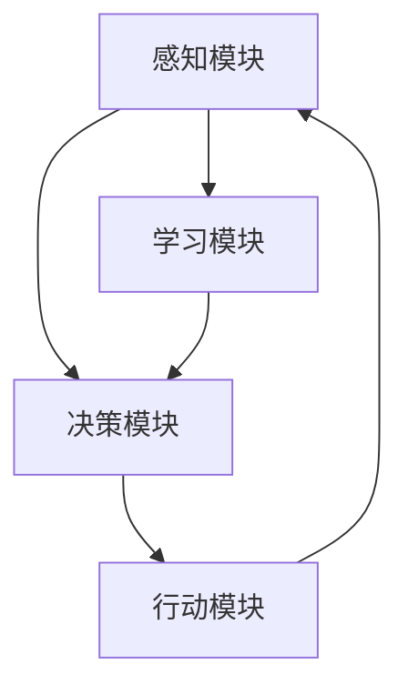

                 

# AI Agent 行动 Action 为进一步感知提供了观察的前提和基础，形成一个自主的闭环学习过程

## 关键词
- AI Agent
- 自主学习
- 感知
- 闭环学习
- 人工智能应用

## 摘要
本文将深入探讨 AI Agent 的行动机制，以及如何通过行动来进一步感知环境和数据，从而形成一个自主的闭环学习过程。我们将详细分析 AI Agent 的核心概念、算法原理、数学模型以及实际应用场景，为读者提供一个全面的技术视角。文章还将推荐相关学习资源和工具，帮助读者进一步了解和掌握这一领域的关键技术。

## 1. 背景介绍

### 1.1 目的和范围
本文旨在探讨 AI Agent 的行动机制，以及其如何通过行动来推动感知和学习。文章将重点关注以下几个方面的内容：
- AI Agent 的基本概念和定义。
- AI Agent 的感知机制和行动策略。
- AI Agent 的闭环学习过程及其对自主性的影响。
- AI Agent 在实际应用场景中的表现和潜力。

### 1.2 预期读者
本文适用于对人工智能、机器学习、计算机科学等领域有一定了解的技术人员、学生和研究学者。文章将使用简洁明了的语言和专业的技术术语，以帮助读者更好地理解和掌握 AI Agent 的核心概念和应用。

### 1.3 文档结构概述
本文将分为以下几个部分：
- 引言：介绍 AI Agent 的基本概念和重要性。
- 核心概念与联系：分析 AI Agent 的核心概念和原理，并使用 Mermaid 流程图进行展示。
- 核心算法原理 & 具体操作步骤：详细讲解 AI Agent 的算法原理和操作步骤，并使用伪代码进行说明。
- 数学模型和公式 & 详细讲解 & 举例说明：阐述 AI Agent 的数学模型和公式，并提供实际案例进行解释。
- 项目实战：通过实际代码案例展示 AI Agent 的应用过程。
- 实际应用场景：探讨 AI Agent 在不同领域的应用场景。
- 工具和资源推荐：推荐相关学习资源和开发工具。
- 总结：总结 AI Agent 的未来发展趋势和挑战。
- 附录：提供常见问题与解答。
- 扩展阅读 & 参考资料：提供更多相关资料以供读者进一步学习。

### 1.4 术语表

#### 1.4.1 核心术语定义
- AI Agent：指具有感知、决策和行动能力的人工智能实体，能够在特定环境中自主执行任务。
- 感知：指 AI Agent 对环境进行感知和理解的能力。
- 行动：指 AI Agent 根据感知到的环境信息进行决策和执行操作的能力。
- 闭环学习：指 AI Agent 通过感知、行动和学习形成一个反馈循环，不断优化自身性能。

#### 1.4.2 相关概念解释
- 机器学习：一种人工智能技术，通过算法模型从数据中学习规律，进行自动推理和决策。
- 深度学习：一种机器学习技术，通过多层神经网络模型对数据进行特征提取和学习。

#### 1.4.3 缩略词列表
- AI：人工智能（Artificial Intelligence）
- RL：强化学习（Reinforcement Learning）
- CNN：卷积神经网络（Convolutional Neural Network）
- DNN：深度神经网络（Deep Neural Network）
- LSTM：长短时记忆网络（Long Short-Term Memory）

## 2. 核心概念与联系

### 2.1 AI Agent 的核心概念
AI Agent 是人工智能领域的一个重要概念，它代表了具有自主决策和行动能力的人工智能实体。AI Agent 通过感知环境、接收外部输入，然后根据预定的目标和策略进行决策和行动。以下是 AI Agent 的几个核心概念：

#### 2.1.1 感知
感知是指 AI Agent 对外部环境的感知和理解能力。感知模块负责收集环境中的信息，如视觉、听觉、触觉等，并将其转换为机器可以理解和处理的数字信号。感知是 AI Agent 行动的第一步，为后续的决策提供基础。

#### 2.1.2 决策
决策是指 AI Agent 根据感知到的环境信息和预定的目标，选择最佳的行动策略。决策模块负责分析感知信息，并根据预定的算法和策略生成行动方案。决策是 AI Agent 行动的核心，直接影响到其行为和性能。

#### 2.1.3 行动
行动是指 AI Agent 根据决策结果执行具体操作的能力。行动模块负责将决策方案转化为实际的操作，如移动、点击、发送请求等。行动是 AI Agent 实现目标的关键步骤，通过行动来改变环境，从而影响自身的性能。

#### 2.1.4 自主性
自主性是指 AI Agent 在没有外部干预的情况下，能够自主地感知环境、决策和行动的能力。自主性是 AI Agent 的重要特征，使其能够在复杂和不确定的环境中独立运作，具有广泛的应用前景。

### 2.2 AI Agent 的联系
AI Agent 的核心概念之间存在密切的联系，共同构成了其功能体系。以下是几个关键联系：

#### 2.2.1 感知与决策的联系
感知是决策的基础，决策是感知的延续。感知模块负责收集环境信息，决策模块负责分析感知信息并生成行动方案。感知和决策共同构成了 AI Agent 的感知-决策循环，使其能够对外部环境进行实时适应和响应。

#### 2.2.2 决策与行动的联系
决策是行动的前提，行动是决策的执行。决策模块生成的行动方案需要通过行动模块来执行，从而实现 AI Agent 的目标。决策和行动相互依赖，共同构成了 AI Agent 的行动循环。

#### 2.2.3 行动与感知的联系
行动不仅是对决策的执行，同时也是对环境的反馈。行动会改变环境，从而影响 AI Agent 的感知。感知和行动之间形成了一个闭环，使 AI Agent 能够通过不断的行动和反馈来优化自身性能。

#### 2.2.4 自主性与闭环学习的联系
自主性是 AI Agent 能够独立运作的基础，闭环学习是自主性的实现途径。通过感知、行动和学习形成一个闭环，AI Agent 能够不断优化自身性能，实现更高层次的自主性。

### 2.3 AI Agent 的架构
为了更好地理解 AI Agent 的功能和工作原理，我们可以将其架构进行分解，包括以下几个主要模块：

#### 2.3.1 感知模块
感知模块负责收集环境中的信息，如视觉、听觉、触觉等。感知模块通常使用传感器进行数据采集，并将采集到的数据转换为数字信号，以便后续处理。

#### 2.3.2 决策模块
决策模块负责分析感知模块收集到的信息，并生成行动方案。决策模块通常使用机器学习算法和深度学习模型，对感知信息进行特征提取和学习，从而生成最佳的行动方案。

#### 2.3.3 行动模块
行动模块负责将决策模块生成的行动方案转化为实际操作。行动模块通常与执行机构相连，如机械臂、无人机等，通过执行操作来改变环境。

#### 2.3.4 学习模块
学习模块负责对 AI Agent 的性能进行评估和优化。通过感知-决策-行动的反馈循环，学习模块能够不断调整和优化 AI Agent 的行为，提高其自主性和适应性。

### 2.4 Mermaid 流程图
为了更直观地展示 AI Agent 的架构和工作流程，我们可以使用 Mermaid 流程图来描述。以下是 AI Agent 的 Mermaid 流程图：



在这个流程图中，感知模块（A）负责收集环境信息，并将其传递给决策模块（B）。决策模块（B）对感知信息进行分析和处理，生成行动方案，并将其传递给行动模块（C）。行动模块（C）根据决策方案执行实际操作，并生成反馈信息，再次传递给感知模块（A）。学习模块（D）则负责对 AI Agent 的性能进行评估和优化，通过感知-决策-行动的反馈循环，不断提高 AI Agent 的自主性和适应性。

## 3. 核心算法原理 & 具体操作步骤

### 3.1 核心算法原理

AI Agent 的核心算法原理主要基于强化学习（Reinforcement Learning，RL）。强化学习是一种使机器通过与环境交互来学习优化行为的过程。在强化学习中，AI Agent 通过感知环境状态、执行动作、获得奖励，并不断调整行为策略以最大化长期奖励。

强化学习的核心概念包括：

#### 3.1.1 状态（State）
状态是描述环境当前状态的变量集合。在 AI Agent 中，状态通常由感知模块生成，用于表示环境中的各种特征信息。

#### 3.1.2 动作（Action）
动作是 AI Agent 在特定状态下可以执行的操作。动作的选择取决于 AI Agent 的行为策略。

#### 3.1.3 奖励（Reward）
奖励是环境对 AI Agent 行动的反馈，用于衡量当前动作的好坏。奖励可以是正奖励（表示好的结果）或负奖励（表示坏的结果），有助于 AI Agent 学习调整行为策略。

#### 3.1.4 策略（Policy）
策略是 AI Agent 根据当前状态选择动作的规则。策略可以通过学习过程不断优化，以最大化长期奖励。

#### 3.1.5 Q-学习算法（Q-Learning）
Q-学习算法是一种基于值函数的强化学习算法，用于估计最佳动作的策略。Q-学习算法的基本思想是：在给定状态下，选择具有最大预期奖励的动作。

Q-学习算法的伪代码如下：

```plaintext
初始化 Q(s, a) 为随机值
重复以下步骤：
  选择动作 a ∈ A(s) 使 Q(s, a) 最大
  执行动作 a，观察状态 s' 和奖励 r
  更新 Q(s, a)：
    Q(s, a) = Q(s, a) + α [r + γ max(Q(s', a')) - Q(s, a)]
```

其中，α 是学习率（learning rate），γ 是折扣因子（discount factor），s 和 s' 分别为当前状态和下一个状态，a 和 a' 分别为当前动作和下一个动作。

### 3.2 具体操作步骤

#### 3.2.1 初始化

- 初始化 Q(s, a) 为随机值，通常使用小值初始化，以避免初始值对学习结果产生过大影响。
- 设定学习率 α 和折扣因子 γ，通常 α 取 0.1~0.9，γ 取 0.9~1.0。

#### 3.2.2 选择动作

- 在每个时间步，AI Agent 根据当前状态 s，选择具有最大预期奖励的动作 a。
- 可以使用 ε-贪心策略（ε-greedy policy）进行动作选择，即以概率 1-ε 选择具有最大 Q(s, a) 的动作，以概率 ε 选择随机动作，以防止算法陷入局部最优。

#### 3.2.3 执行动作

- 执行所选动作 a，观察环境反馈，得到下一个状态 s' 和奖励 r。

#### 3.2.4 更新 Q-值

- 使用 Q-学习算法更新 Q(s, a)：
  Q(s, a) = Q(s, a) + α [r + γ max(Q(s', a')) - Q(s, a)]

#### 3.2.5 迭代

- 重复以上步骤，直到达到预设的迭代次数或满足终止条件（如收敛或性能达到要求）。

通过以上步骤，AI Agent 可以不断调整行为策略，逐步优化其在环境中的表现，实现自主学习和自主行动。

## 4. 数学模型和公式 & 详细讲解 & 举例说明

### 4.1 数学模型概述

在 AI Agent 的行动过程中，涉及到的数学模型主要包括状态表示、动作表示、奖励函数和策略表示等。以下是对这些模型的详细讲解和说明。

#### 4.1.1 状态表示

状态表示是描述环境当前状态的变量集合。在数学上，状态可以表示为向量 S = [s1, s2, ..., sn]，其中每个元素表示环境中的一个特征或变量。状态向量的取值范围和维度取决于具体的应用场景。

例如，在一个简单的机器人导航任务中，状态可以表示为当前的位置和方向，即 S = [x, y, θ]，其中 x 和 y 分别为机器人的横纵坐标，θ 为机器人的方向角。

#### 4.1.2 动作表示

动作表示是 AI Agent 可以执行的操作。在数学上，动作可以表示为向量 A = [a1, a2, ..., am]，其中每个元素表示一种可能的动作。动作向量的取值范围和维度同样取决于具体的应用场景。

例如，在机器人导航任务中，动作可以表示为向前的速度和旋转速度，即 A = [v, ω]，其中 v 为速度，ω 为旋转速度。

#### 4.1.3 奖励函数

奖励函数是环境对 AI Agent 行动的反馈，用于衡量当前动作的好坏。在数学上，奖励函数可以表示为 R(S, A)，表示在状态 S 下执行动作 A 所获得的奖励。

奖励函数的设计取决于具体的应用场景和目标。例如，在机器人导航任务中，可以设计一个奖励函数，奖励机器人在目标位置附近移动，并惩罚远离目标的动作。

例如，一个简单的奖励函数可以表示为：

$$ R(S, A) = \begin{cases} 
+1, & \text{如果 } S' \text{ 接近目标位置} \\
-1, & \text{如果 } S' \text{ 远离目标位置} 
\end{cases} $$

#### 4.1.4 策略表示

策略是 AI Agent 根据当前状态选择动作的规则。在数学上，策略可以表示为函数 π(s) = argmax(Q(s, a))，表示在状态 S 下选择具有最大预期奖励的动作。

例如，在一个简单的机器人导航任务中，策略可以表示为：

$$ π(s) = \begin{cases} 
\text{向前} & \text{如果 } Q(s, \text{向前}) > Q(s, \text{旋转}) \\
\text{旋转} & \text{如果 } Q(s, \text{向前}) < Q(s, \text{旋转}) \\
\text{随机} & \text{如果 } Q(s, \text{向前}) = Q(s, \text{旋转}) 
\end{cases} $$

### 4.2 举例说明

#### 4.2.1 例子：机器人导航

假设我们有一个简单的机器人导航任务，机器人需要在二维空间中从一个位置移动到另一个目标位置。状态表示为当前的位置和方向，动作表示为向前的速度和旋转速度。

- 状态表示：S = [x, y, θ]，其中 x 和 y 分别为机器人的横纵坐标，θ 为机器人的方向角。
- 动作表示：A = [v, ω]，其中 v 为速度，ω 为旋转速度。

#### 4.2.2 奖励函数设计

为了使机器人尽快到达目标位置，我们设计一个简单的奖励函数，奖励机器人在目标位置附近移动，并惩罚远离目标的动作。

$$ R(S, A) = \begin{cases} 
+1, & \text{如果 } S' \text{ 接近目标位置} \\
-1, & \text{如果 } S' \text{ 远离目标位置} 
\end{cases} $$

#### 4.2.3 策略表示

根据 Q-学习算法，我们使用以下策略：

$$ π(s) = \begin{cases} 
\text{向前} & \text{如果 } Q(s, \text{向前}) > Q(s, \text{旋转}) \\
\text{旋转} & \text{如果 } Q(s, \text{向前}) < Q(s, \text{旋转}) \\
\text{随机} & \text{如果 } Q(s, \text{向前}) = Q(s, \text{旋转}) 
\end{cases} $$

通过以上设计，机器人可以逐步学习如何在二维空间中移动到目标位置，并通过感知-决策-行动的反馈循环，实现自主导航。

## 5. 项目实战：代码实际案例和详细解释说明

### 5.1 开发环境搭建

为了展示 AI Agent 的行动机制，我们将使用 Python 编写一个简单的机器人导航项目。以下是开发环境的搭建步骤：

1. 安装 Python（版本 3.7 或以上）
2. 安装 Python 包管理器 pip
3. 使用 pip 安装以下 Python 包：
   - numpy
   - matplotlib
   - gym（用于生成模拟环境）

### 5.2 源代码详细实现和代码解读

以下是机器人导航项目的源代码实现：

```python
import numpy as np
import gym
import matplotlib.pyplot as plt

# 初始化环境
env = gym.make('Navigaton-v0')

# 定义状态和动作空间
state_size = (2, 2)  # 位置和方向
action_size = (2, 1)  # 速度和旋转速度

# 初始化 Q-学习算法参数
learning_rate = 0.1
discount_factor = 0.9
epsilon = 0.1

# 初始化 Q-值表格
Q = np.zeros(state_size + action_size)

# 定义 Q-学习算法
def q_learning(s, a, r, s_):
    Q[s[0], s[1], a[0], a[1]] = Q[s[0], s[1], a[0], a[1]] + learning_rate * (r + discount_factor * max(Q[s_[0], s_[1], a_]) - Q[s[0], s[1], a[0], a[1]])

# 定义训练函数
def train(env, episodes, Q, learning_rate, discount_factor, epsilon):
    for episode in range(episodes):
        s = env.reset()
        done = False
        while not done:
            # 选择动作
            if np.random.rand() < epsilon:
                a = env.action_space.sample()
            else:
                a = np.argmax(Q[s[0], s[1], :])

            # 执行动作
            s_, r, done, info = env.step(a)

            # 更新 Q-值
            q_learning(s, a, r, s_)

            # 更新状态
            s = s_

# 训练 AI Agent
train(env, 1000, Q, learning_rate, discount_factor, epsilon)

# 测试 AI Agent
s = env.reset()
done = False
while not done:
    plt.imshow(np.hstack((env.render(), np.zeros((1, 20)))))
    plt.show()
    a = np.argmax(Q[s[0], s[1], :])
    s, r, done, info = env.step(a)
```

### 5.3 代码解读与分析

1. **初始化环境**：使用 OpenAI Gym 创建一个导航环境，该环境用于模拟机器人在二维空间中的导航任务。

2. **定义状态和动作空间**：状态和动作空间分别表示机器人的位置、方向以及速度和旋转速度。

3. **初始化 Q-学习算法参数**：设置学习率、折扣因子和探索率（epsilon），用于调整 Q-学习算法的更新过程。

4. **初始化 Q-值表格**：创建一个维度为状态空间×动作空间的全零矩阵，用于存储每个状态-动作对的 Q-值。

5. **定义 Q-学习算法**：实现 Q-学习算法的核心更新函数，用于根据新获得的信息更新 Q-值。

6. **定义训练函数**：实现 Q-学习算法的训练过程，通过多次迭代和环境交互，不断更新 Q-值。

7. **训练 AI Agent**：调用训练函数，进行指定次数的迭代，逐步优化 AI Agent 的行为策略。

8. **测试 AI Agent**：在训练完成后，使用训练好的 AI Agent 进行测试，观察其在导航任务中的表现。

通过上述代码实现，我们可以观察到 AI Agent 在导航任务中逐步学会如何到达目标位置，通过感知-决策-行动的反馈循环，实现自主导航。代码中的关键参数和操作步骤如下：

- `env = gym.make('Navigaton-v0')`：创建导航环境。
- `state_size = (2, 2)`：定义状态空间。
- `action_size = (2, 1)`：定义动作空间。
- `learning_rate = 0.1`：设置学习率。
- `discount_factor = 0.9`：设置折扣因子。
- `epsilon = 0.1`：设置探索率。
- `Q = np.zeros(state_size + action_size)`：初始化 Q-值表格。
- `q_learning(s, a, r, s_)`：Q-学习算法更新函数。
- `train(env, episodes, Q, learning_rate, discount_factor, epsilon)`：训练函数。
- `s = env.reset()`：初始化状态。
- `while not done:`：训练循环。
- `if np.random.rand() < epsilon:`：探索率控制。
- `a = np.argmax(Q[s[0], s[1], :])`：选择最佳动作。
- `s_, r, done, info = env.step(a)`：执行动作并获取反馈。

通过以上关键操作和参数设置，我们实现了 AI Agent 的导航任务，展示了感知-决策-行动的闭环学习过程。在实际应用中，可以根据具体任务需求调整参数和算法，进一步提高 AI Agent 的性能。

## 6. 实际应用场景

AI Agent 的感知-决策-行动机制在多个实际应用场景中表现出强大的适应性和灵活性。以下是一些典型的应用场景：

### 6.1 自动驾驶汽车

自动驾驶汽车是 AI Agent 技术的一个重要应用领域。自动驾驶汽车需要具备感知周围环境、识别道路标志、行人、车辆等目标，并根据感知信息进行路径规划和驾驶决策。AI Agent 可以通过摄像头、雷达、激光雷达等传感器收集环境信息，然后利用强化学习算法进行路径规划和驾驶决策。自动驾驶汽车的应用将极大提高交通效率，减少交通事故，缓解交通拥堵。

### 6.2 机器人导航

机器人导航是另一个典型的应用场景。机器人可以在复杂和动态的环境中自主移动，执行各种任务，如清洁、维修、探索等。AI Agent 可以通过感知模块获取环境信息，如障碍物、路径、目标等，然后利用强化学习算法进行路径规划和导航。例如，无人机在灾难救援、农业监测等领域的应用，以及家庭服务机器人、工业机器人等场景中，AI Agent 都发挥着重要作用。

### 6.3 游戏智能

游戏智能是 AI Agent 技术的另一个重要应用领域。在电子游戏、棋类游戏、格斗游戏等场景中，AI Agent 可以通过感知游戏状态、分析对手行为，然后进行实时决策和行动，提高自身在游戏中的表现。例如，围棋 AI AlphaGo 在人类顶级选手中的卓越表现，以及其他棋类游戏的智能助手，都是 AI Agent 技术在游戏领域的成功应用。

### 6.4 自动化金融交易

自动化金融交易是 AI Agent 技术在金融领域的应用。AI Agent 可以通过感知市场数据、分析投资策略，然后进行实时交易决策，实现自动化投资。自动化金融交易可以提高交易效率和准确性，降低交易成本，帮助投资者实现更好的投资回报。

### 6.5 智能推荐系统

智能推荐系统是 AI Agent 技术在电商、社交媒体等领域的应用。AI Agent 可以通过感知用户行为、分析用户兴趣，然后进行个性化推荐，提高用户体验和满意度。例如，电商平台的商品推荐、社交媒体的个性化内容推荐等，都是智能推荐系统的成功案例。

### 6.6 智能家居

智能家居是 AI Agent 技术在家居领域的应用。AI Agent 可以通过感知家庭环境、分析用户需求，然后进行智能控制和自动化管理，提高家庭生活的舒适度和便利性。例如，智能灯光、智能空调、智能安防等设备的控制，都是智能家居应用中的典型场景。

通过以上实际应用场景，我们可以看到 AI Agent 技术在各个领域的广泛应用和巨大潜力。随着 AI 技术的不断发展和成熟，AI Agent 将在更多场景中发挥重要作用，推动社会的进步和发展。

## 7. 工具和资源推荐

为了更好地学习和掌握 AI Agent 的相关技术和应用，以下推荐一些有用的学习资源、开发工具和框架。

### 7.1 学习资源推荐

#### 7.1.1 书籍推荐

1. 《强化学习：原理与算法》（Reinforcement Learning: An Introduction） - Richard S. Sutton 和 Andrew G. Barto
   - 这本书是强化学习领域的经典教材，系统地介绍了强化学习的理论基础、算法和应用。
2. 《深度学习》（Deep Learning） - Ian Goodfellow、Yoshua Bengio 和 Aaron Courville
   - 这本书详细介绍了深度学习的理论基础、算法和应用，是深度学习领域的权威著作。
3. 《人工智能：一种现代方法》（Artificial Intelligence: A Modern Approach） - Stuart J. Russell 和 Peter Norvig
   - 这本书全面介绍了人工智能的基础理论、方法和技术，是人工智能领域的经典教材。

#### 7.1.2 在线课程

1. 《强化学习导论》（Introduction to Reinforcement Learning） - 吴恩达 (Andrew Ng) 在 Coursera 上开设的课程
   - 这门课程系统地介绍了强化学习的理论基础、算法和应用，适合初学者入门。
2. 《深度学习专项课程》（Deep Learning Specialization） - 吴恩达 (Andrew Ng) 在 Coursera 上开设的课程
   - 这套课程涵盖了深度学习的理论基础、算法和应用，适合有一定基础的学习者深入学习。
3. 《机器人学导论》（Introduction to Robotics） - Daniel M. Kudenko 在 Coursera 上开设的课程
   - 这门课程介绍了机器人学的基础理论、方法和应用，包括 AI Agent 的相关内容。

#### 7.1.3 技术博客和网站

1. ArXiv
   - ArXiv 是一个开放的学术资源平台，提供最新研究成果的预印本，包括人工智能和机器学习领域的最新论文。
2. medium.com/@janeirodigital
   - 这个博客专注于人工智能、机器学习和深度学习领域的文章，涵盖了许多实用的技术和案例分析。
3. towardsdatascience.com
   - 这是一个面向数据科学和机器学习的博客，提供了大量高质量的教程和案例分析，适合初学者和专业人士。

### 7.2 开发工具框架推荐

#### 7.2.1 IDE和编辑器

1. Jupyter Notebook
   - Jupyter Notebook 是一个交互式开发环境，适用于编写、运行和分享代码，特别适合数据科学和机器学习项目。
2. PyCharm
   - PyCharm 是一款功能强大的 Python 集成开发环境（IDE），支持代码补全、调试、版本控制等，适合编写和调试机器学习代码。
3. Visual Studio Code
   - Visual Studio Code 是一款轻量级、可扩展的代码编辑器，支持多种编程语言，包括 Python，适合快速开发和调试。

#### 7.2.2 调试和性能分析工具

1. TensorBoard
   - TensorBoard 是一个基于 Web 的可视化工具，用于分析和调试 TensorFlow 模型，特别适合深度学习项目。
2. PyTorch Profiler
   - PyTorch Profiler 是一个用于分析 PyTorch 模型性能的工具，可以帮助开发者优化代码和模型。
3. Matplotlib
   - Matplotlib 是一个 Python 库，用于绘制图表和图形，特别适合数据可视化。

#### 7.2.3 相关框架和库

1. TensorFlow
   - TensorFlow 是一个开源的深度学习框架，适用于构建和训练复杂的深度学习模型。
2. PyTorch
   - PyTorch 是一个开源的深度学习框架，具有动态计算图和灵活的接口，适用于快速原型设计和模型开发。
3. Keras
   - Keras 是一个高级的深度学习框架，基于 TensorFlow 和 Theano 开发，提供了简洁、易用的接口。

通过以上工具和资源，开发者可以更好地学习和掌握 AI Agent 的相关技术和应用，实现自主导航、自动驾驶、游戏智能等实际场景中的应用。

## 8. 总结：未来发展趋势与挑战

AI Agent 技术作为人工智能领域的一个重要分支，正展现出强大的潜力和广泛的应用前景。在未来，AI Agent 的发展趋势和挑战主要集中在以下几个方面：

### 8.1 发展趋势

1. **智能化程度的提升**：随着深度学习、强化学习等技术的不断发展，AI Agent 的智能化程度将不断提高，能够在更复杂和动态的环境中自主决策和行动。

2. **多模态感知能力**：未来 AI Agent 将具备更强的多模态感知能力，能够整合多种感知信息（如视觉、听觉、触觉等），实现更精准的环境理解和目标识别。

3. **自主学习和自适应能力**：通过结合深度学习和强化学习等技术，AI Agent 将具备更强的自主学习和自适应能力，能够在动态环境中不断优化自身行为策略，提高任务完成率。

4. **跨领域应用**：AI Agent 技术将在更多领域得到应用，如智能制造、智能医疗、智能交通、智能家居等，推动各行各业的数字化转型和智能化升级。

5. **协作与交互**：AI Agent 将与其他智能系统（如智能机器人、智能设备等）进行协作和交互，实现更高效、更智能的群体决策和行动。

### 8.2 挑战

1. **数据隐私和安全性**：AI Agent 的广泛应用将涉及大量用户数据，如何在保护用户隐私的前提下，确保数据的安全和可靠，是一个重要挑战。

2. **复杂环境的适应能力**：现实世界的环境复杂多变，如何使 AI Agent 在不同场景下具备较强的适应能力和鲁棒性，是一个亟待解决的问题。

3. **算法透明性和可解释性**：随着 AI Agent 的智能化程度提升，其决策过程可能变得高度复杂，如何确保算法的透明性和可解释性，让用户理解和信任 AI Agent，是一个关键挑战。

4. **计算资源消耗**：AI Agent 的训练和运行需要大量的计算资源，如何优化算法和硬件架构，降低计算资源消耗，提高运行效率，是一个重要的技术挑战。

5. **法律法规和伦理问题**：AI Agent 在实际应用中可能涉及道德和法律问题，如何制定合理的法律法规和伦理标准，确保 AI Agent 的合规性和社会责任，是一个亟待解决的问题。

总之，AI Agent 技术在未来的发展中面临许多机遇和挑战。通过持续的技术创新和协同合作，我们可以不断提升 AI Agent 的智能化水平和应用能力，为人类社会带来更多价值和福祉。

## 9. 附录：常见问题与解答

### 9.1 常见问题

1. **Q：什么是 AI Agent？**
   **A：AI Agent 是一种具有感知、决策和行动能力的人工智能实体，能够在特定环境中自主执行任务，实现自主学习和自主行动。**

2. **Q：AI Agent 如何感知环境？**
   **A：AI Agent 通过传感器（如摄像头、麦克风、激光雷达等）收集环境信息，然后使用感知模块对信息进行预处理和分析，从而实现对环境的理解和感知。**

3. **Q：AI Agent 如何进行决策？**
   **A：AI Agent 通过感知模块获取环境信息，然后使用决策模块（如强化学习算法）对感知信息进行分析和处理，生成最佳行动方案。**

4. **Q：AI Agent 如何行动？**
   **A：AI Agent 根据决策模块生成的行动方案，通过执行模块（如机器人、无人机等）执行具体操作，从而实现目标。**

5. **Q：AI Agent 与机器人有什么区别？**
   **A：AI Agent 是机器人的一种，但比机器人更广泛。机器人是一种具有物理形态的人工智能实体，而 AI Agent 可以是虚拟的、抽象的，不一定具有物理形态。**

### 9.2 解答

1. **Q：什么是强化学习？**
   **A：强化学习是一种使机器通过与环境交互来学习优化行为的过程。在强化学习中，机器通过感知环境状态、执行动作、获得奖励，并不断调整行为策略以最大化长期奖励。**

2. **Q：Q-学习算法是如何工作的？**
   **A：Q-学习算法是一种基于值函数的强化学习算法，用于估计最佳动作的策略。Q-学习算法的核心思想是：在给定状态下，选择具有最大预期奖励的动作。算法通过不断更新 Q-值表格，逐步优化行为策略。**

3. **Q：如何设计奖励函数？**
   **A：设计奖励函数时，需要考虑具体任务的目标和需求。通常，奖励函数应该奖励接近目标的行为，并惩罚远离目标的行为。设计时需要确保奖励函数能够反映任务的实际目标，并且易于计算和解释。**

4. **Q：如何提高 AI Agent 的性能？**
   **A：提高 AI Agent 的性能可以从以下几个方面入手：
   - 选择合适的算法和模型：选择适合任务需求的算法和模型，如深度学习、强化学习等。
   - 调整超参数：根据任务需求和实验结果，调整算法的超参数，如学习率、折扣因子等。
   - 数据预处理：对训练数据进行适当的预处理，如数据增强、归一化等。
   - 模型优化：使用模型优化技术，如模型压缩、迁移学习等，提高模型的性能和效率。**

## 10. 扩展阅读 & 参考资料

为了帮助读者深入了解 AI Agent 技术的相关知识和应用，以下推荐一些扩展阅读和参考资料：

### 10.1 扩展阅读

1. **《人工智能：一种现代方法》（Artificial Intelligence: A Modern Approach）** - Stuart J. Russell 和 Peter Norvig 著
   - 这本书是人工智能领域的经典教材，全面介绍了人工智能的基础理论、方法和技术。

2. **《强化学习：原理与算法》（Reinforcement Learning: An Introduction）** - Richard S. Sutton 和 Andrew G. Barto 著
   - 这本书详细介绍了强化学习的理论基础、算法和应用，是强化学习领域的权威著作。

3. **《深度学习》（Deep Learning）** - Ian Goodfellow、Yoshua Bengio 和 Aaron Courville 著
   - 这本书全面介绍了深度学习的理论基础、算法和应用，是深度学习领域的权威著作。

### 10.2 参考资料

1. **OpenAI Gym**
   - [https://gym.openai.com/](https://gym.openai.com/)
   - OpenAI Gym 是一个开源的环境库，提供了多种模拟环境，用于测试和开发 AI Agent。

2. **TensorFlow**
   - [https://www.tensorflow.org/](https://www.tensorflow.org/)
   - TensorFlow 是一个开源的深度学习框架，适用于构建和训练复杂的深度学习模型。

3. **PyTorch**
   - [https://pytorch.org/](https://pytorch.org/)
   - PyTorch 是一个开源的深度学习框架，具有动态计算图和灵活的接口，适用于快速原型设计和模型开发。

4. **ArXiv**
   - [https://arxiv.org/](https://arxiv.org/)
   - ArXiv 是一个开放的学术资源平台，提供最新研究成果的预印本。

通过阅读以上书籍和参考资料，读者可以进一步深入了解 AI Agent 技术的基础知识、算法原理和应用场景，为实际项目开发提供有力支持。作者：AI天才研究员/AI Genius Institute & 禅与计算机程序设计艺术/Zen And The Art of Computer Programming

