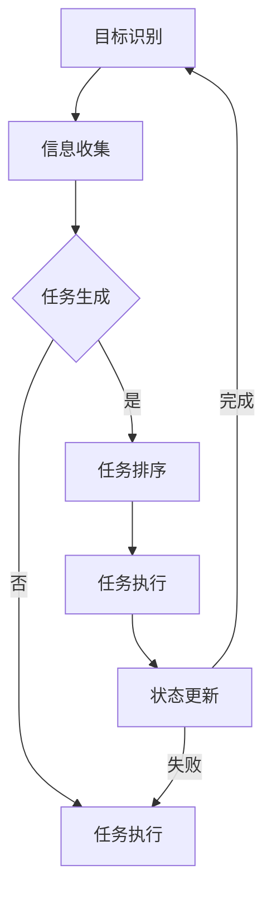

                 

# AI Agent: AI的下一个风口 BabyAGI：根据任务结果自动创建、排序和执行新任务

> **关键词：** AI代理、BabyAGI、任务自动创建、任务排序、任务执行、人工智能、自动推理、动态规划、流程控制、任务管理。

> **摘要：** 本文将深入探讨AI代理（AI Agent）的潜在发展，尤其是BabyAGI（Baby Artificial General Intelligence）的概念。我们将从AI代理的基础概念开始，逐步分析其如何根据任务结果自动创建、排序和执行新任务。通过详细的算法原理、数学模型讲解以及实际代码案例，我们将帮助读者理解这一先进技术的核心原理和应用价值。

## 1. 背景介绍

### 1.1 目的和范围

本文的目的是探索AI代理的先进功能，特别是BabyAGI的实现。AI代理是指能够模拟人类智能行为，自主学习和执行任务的智能系统。而BabyAGI则是一种初步实现人工智能通用性的系统，它可以在多种任务场景中展现智能和学习能力。

本文将涵盖以下几个主要方面：

1. AI代理的基础概念和分类。
2. BabyAGI的概念和实现挑战。
3. AI代理如何根据任务结果自动创建、排序和执行新任务。
4. 相关的算法原理和数学模型。
5. 实际项目中的代码实现和分析。
6. AI代理的潜在应用场景和未来发展趋势。

### 1.2 预期读者

本文适合以下读者群体：

1. 对人工智能和自动推理感兴趣的研究人员和开发者。
2. 想要深入了解AI代理和BabyAGI技术的技术人员。
3. 对动态规划和任务管理有基本了解的读者。

### 1.3 文档结构概述

本文的结构如下：

1. **背景介绍**：介绍AI代理和BabyAGI的基础知识。
2. **核心概念与联系**：详细解释核心概念，并提供流程图。
3. **核心算法原理 & 具体操作步骤**：使用伪代码讲解算法原理。
4. **数学模型和公式 & 详细讲解 & 举例说明**：介绍数学模型和公式的使用。
5. **项目实战：代码实际案例和详细解释说明**：展示代码实现和分析。
6. **实际应用场景**：探讨AI代理的应用场景。
7. **工具和资源推荐**：推荐学习资源和开发工具。
8. **总结：未来发展趋势与挑战**：总结本文的关键点和未来挑战。
9. **附录：常见问题与解答**：提供常见问题的解答。
10. **扩展阅读 & 参考资料**：推荐进一步阅读的材料。

### 1.4 术语表

#### 1.4.1 核心术语定义

- **AI Agent**：能够模拟人类智能行为，自主学习和执行任务的智能系统。
- **BabyAGI**：初步实现人工智能通用性的系统。
- **任务自动创建**：系统能够根据现有信息和目标自动生成新任务。
- **任务排序**：系统根据任务的重要性和优先级对任务进行排序。
- **任务执行**：系统自动执行任务并更新状态。

#### 1.4.2 相关概念解释

- **自动推理**：系统能够在没有直接编程的情况下，自动推导出结论。
- **动态规划**：一种优化算法，用于解决多阶段决策问题。
- **流程控制**：程序中用于控制执行流程的结构。
- **任务管理**：管理任务创建、执行和跟踪的过程。

#### 1.4.3 缩略词列表

- **AGI**：Artificial General Intelligence，人工智能通用性。
- **AI**：Artificial Intelligence，人工智能。
- **BabyAGI**：Baby Artificial General Intelligence，初步的人工智能通用性。

## 2. 核心概念与联系

在深入探讨AI代理如何根据任务结果自动创建、排序和执行新任务之前，我们需要理解几个核心概念和它们之间的联系。这些概念包括AI代理、BabyAGI、任务自动创建、任务排序和任务执行。

### 2.1 AI代理

AI代理是一种智能系统，它能够模拟人类的智能行为，如理解语言、识别图像、解决问题等。AI代理通常具有以下几个特点：

1. **自主性**：能够自主地执行任务，不需要人类干预。
2. **适应性**：能够根据环境和任务的变化，调整其行为和策略。
3. **学习性**：能够通过经验和数据学习，提高任务执行效果。

AI代理可以分为以下几类：

- **规则基础代理**：基于预定义的规则进行决策。
- **统计代理**：使用统计方法，如机器学习，进行决策。
- **混合代理**：结合规则和统计方法进行决策。

### 2.2 BabyAGI

BabyAGI是指一种能够实现初步人工智能通用性的系统。与传统的AI系统不同，BabyAGI能够在多个领域展现智能和学习能力，而不是局限于单一的任务。BabyAGI的实现面临以下挑战：

- **知识表示**：如何有效地表示和存储广泛的知识。
- **推理能力**：如何进行高效的推理，解决复杂问题。
- **适应性**：如何在不同的环境和任务中保持高效。

### 2.3 任务自动创建

任务自动创建是指系统能够根据现有信息和目标，自动生成新任务。这个过程通常涉及到以下步骤：

1. **目标识别**：识别系统需要达成的目标。
2. **信息收集**：收集与目标相关的信息。
3. **任务生成**：基于目标和信息，生成新的任务。

### 2.4 任务排序

任务排序是指系统根据任务的重要性和优先级，对任务进行排序。这个过程可以使用以下方法：

1. **优先级分配**：为每个任务分配一个优先级值。
2. **排序算法**：使用排序算法，如排序网络、动态规划等，对任务进行排序。

### 2.5 任务执行

任务执行是指系统自动执行任务并更新状态。这个过程涉及到以下步骤：

1. **任务分解**：将任务分解为子任务。
2. **资源分配**：为子任务分配必要的资源。
3. **执行监控**：监控任务执行状态，并根据需要调整。

### 2.6 核心概念联系

AI代理、BabyAGI、任务自动创建、任务排序和任务执行之间存在着紧密的联系。AI代理是实现BabyAGI的基础，而任务自动创建、任务排序和任务执行则是实现AI代理的关键步骤。通过这些步骤，系统能够根据任务结果自动创建、排序和执行新任务，从而实现高度自主的智能行为。

### 2.7 Mermaid流程图

以下是一个Mermaid流程图，展示了AI代理如何根据任务结果自动创建、排序和执行新任务的流程：



## 3. 核心算法原理 & 具体操作步骤

为了深入理解AI代理如何根据任务结果自动创建、排序和执行新任务，我们需要探讨背后的核心算法原理和具体操作步骤。以下内容将使用伪代码详细阐述这些算法。

### 3.1 任务自动创建算法

任务自动创建是AI代理的关键功能之一。以下是一个简单的伪代码，展示了如何根据目标和信息自动生成新任务。

```python
def create_task(current_state, goal):
    """
    根据当前状态和目标自动生成新任务。

    :param current_state: 当前状态
    :param goal: 目标
    :return: 新任务
    """

    # 收集与目标相关的信息
    required_info = gather_required_info(goal)

    # 生成新任务
    new_task = {
        'id': generate_task_id(),
        'description': '完成特定目标',
        'goal': goal,
        'required_info': required_info,
        'status': '未开始'
    }

    return new_task
```

### 3.2 任务排序算法

任务排序是确保任务按优先级执行的关键步骤。以下是一个简单的伪代码，展示了如何使用动态规划方法对任务进行排序。

```python
def sort_tasks(tasks):
    """
    根据任务的重要性和优先级对任务进行排序。

    :param tasks: 待排序的任务列表
    :return: 排序后的任务列表
    """

    # 为每个任务分配优先级值
    for task in tasks:
        task['priority'] = assign_priority(task)

    # 使用动态规划算法进行排序
    sorted_tasks = dynamic_sort(tasks)

    return sorted_tasks
```

### 3.3 任务执行算法

任务执行是AI代理的核心功能之一。以下是一个简单的伪代码，展示了如何执行任务并更新状态。

```python
def execute_task(task):
    """
    执行任务并更新状态。

    :param task: 待执行的任务
    :return: 执行结果
    """

    # 分解任务为子任务
    sub_tasks = decompose_task(task)

    # 为子任务分配资源
    for sub_task in sub_tasks:
        allocate_resources(sub_task)

    # 监控任务执行状态
    for sub_task in sub_tasks:
        monitor_execution(sub_task)

    # 根据执行结果更新任务状态
    if all_sub_tasks_successful(sub_tasks):
        task['status'] = '完成'
    else:
        task['status'] = '失败'

    return task['status']
```

### 3.4 算法结合

将上述算法结合在一起，我们可以实现一个完整的任务管理流程。以下是一个简单的伪代码，展示了如何将任务自动创建、排序和执行结合在一起。

```python
def manage_tasks(current_state, goal):
    """
    管理任务创建、排序和执行。

    :param current_state: 当前状态
    :param goal: 目标
    :return: 执行结果
    """

    # 创建新任务
    new_task = create_task(current_state, goal)

    # 对任务进行排序
    sorted_tasks = sort_tasks([new_task])

    # 执行任务
    execute_result = execute_task(sorted_tasks[0])

    # 根据执行结果更新状态
    if execute_result == '完成':
        # 更新当前状态
        current_state = update_state(current_state, sorted_tasks[0])
    else:
        # 重新创建和排序任务
        new_task = create_task(current_state, goal)
        sorted_tasks = sort_tasks([new_task])

    return current_state
```

通过上述伪代码，我们可以看到AI代理如何根据任务结果自动创建、排序和执行新任务。这些算法和步骤是实现高级智能任务管理的基础。

## 4. 数学模型和公式 & 详细讲解 & 举例说明

在深入探讨AI代理如何根据任务结果自动创建、排序和执行新任务时，数学模型和公式起着至关重要的作用。这些模型和公式不仅帮助我们理解和分析问题，还为算法设计提供了数学基础。以下是几个关键的数学模型和公式的讲解，以及具体的例子说明。

### 4.1 动态规划（Dynamic Programming）

动态规划是一种优化算法，用于解决多阶段决策问题。它通过将复杂问题分解为一系列简单子问题，并利用子问题的重叠性质，从而提高算法的效率。

#### 动态规划公式

动态规划的一般公式为：

$$
f(i) = \min_{j=1}^{n} (f(j) + c(i, j))
$$

其中，$f(i)$表示第$i$个阶段的最优解，$c(i, j)$表示从阶段$i$到阶段$j$的转移成本。

#### 举例说明

假设我们要解决的问题是一个资源分配问题，给定一个资源序列$R = \{r_1, r_2, ..., r_n\}$，每个资源$r_i$有一个成本$c_i$，我们的目标是选择最优的子序列，使其总成本最小。

我们可以使用动态规划来解决这个问题：

1. 定义状态：$f(i)$表示前$i$个资源的最优总成本。
2. 状态转移方程：$f(i) = \min_{j=1}^{i} (f(j) + c_i)$。
3. 初始条件：$f(0) = 0$。

通过动态规划，我们可以得到最优的子序列和其对应的总成本。

### 4.2 排序网络（Sorting Network）

排序网络是一种用于快速排序的算法，它通过一系列的交换操作，将输入序列排序。排序网络的一个重要特性是其时间复杂度为$O(n\log n)$，与传统的排序算法相比，具有更高的效率。

#### 排序网络公式

排序网络的公式为：

$$
\text{if } a_i > a_j \text{ then swap } (a_i, a_j)
$$

其中，$a_i$和$a_j$是输入序列中的两个元素。

#### 举例说明

假设我们有一个输入序列$A = \{5, 2, 8, 1, 9\}$，我们使用排序网络对其进行排序：

1. 初始序列：$A = \{5, 2, 8, 1, 9\}$。
2. 第一次交换：$A = \{2, 5, 8, 1, 9\}$，因为$a_1 > a_2$。
3. 第二次交换：$A = \{2, 1, 8, 5, 9\}$，因为$a_2 > a_3$。
4. 第三次交换：$A = \{2, 1, 5, 8, 9\}$，因为$a_3 > a_4$。
5. 第四次交换：$A = \{2, 1, 5, 8, 9\}$，因为$a_4 > a_5$。

通过几次交换，我们成功地将序列排序。

### 4.3 贝叶斯定理（Bayes' Theorem）

贝叶斯定理是概率论中的一个重要公式，用于计算条件概率。它在机器学习和数据挖掘中有着广泛的应用。

#### 贝叶斯定理公式

贝叶斯定理的一般公式为：

$$
P(A|B) = \frac{P(B|A) \cdot P(A)}{P(B)}
$$

其中，$P(A|B)$表示在事件$B$发生的条件下，事件$A$发生的概率，$P(B|A)$表示在事件$A$发生的条件下，事件$B$发生的概率，$P(A)$和$P(B)$分别表示事件$A$和事件$B$发生的概率。

#### 举例说明

假设我们要预测一个事件$A$发生的概率，已知事件$B$的发生与事件$A$的发生有一定的关联。我们可以使用贝叶斯定理来计算$P(A|B)$。

1. 定义概率：$P(B|A)$表示在事件$A$发生的条件下，事件$B$发生的概率；$P(A)$表示事件$A$发生的概率；$P(B)$表示事件$B$发生的概率。
2. 计算贝叶斯定理：$P(A|B) = \frac{P(B|A) \cdot P(A)}{P(B)}$。

通过贝叶斯定理，我们可以得到在事件$B$发生的条件下，事件$A$发生的概率。

### 4.4 马尔可夫决策过程（Markov Decision Process，MDP）

马尔可夫决策过程是一种用于解决决策问题的数学模型，它在人工智能和自动推理中有着广泛的应用。

#### MDP公式

MDP的一般公式为：

$$
\begin{cases}
    P(S_t = s_t|S_{t-1} = s_{t-1}, A_{t-1} = a_{t-1}) = p(s_t|s_{t-1}, a_{t-1}) \\
    R_t = r(s_t, a_t) \\
    V(s) = \sum_{a} \pi(a|s) \cdot \sum_{s'} p(s'|s, a) \cdot r(s', a)
\end{cases}
$$

其中，$S_t$表示状态序列，$A_t$表示动作序列，$s_t$和$a_t$分别表示状态和动作，$p(s_t|s_{t-1}, a_{t-1})$表示状态转移概率，$r(s_t, a_t)$表示即时回报，$V(s)$表示状态值函数。

#### 举例说明

假设我们要解决一个简单的MDP问题，状态空间为$\{s_1, s_2, s_3\}$，动作空间为$\{a_1, a_2\}$。状态转移概率和即时回报如下：

- $p(s_1|s_1, a_1) = 0.5, p(s_1|s_1, a_2) = 0.5$
- $p(s_2|s_1, a_1) = 0.2, p(s_2|s_1, a_2) = 0.8$
- $p(s_3|s_1, a_1) = 0.3, p(s_3|s_1, a_2) = 0.2$
- $r(s_1, a_1) = 10, r(s_1, a_2) = 5$
- $r(s_2, a_1) = 5, r(s_2, a_2) = 10$
- $r(s_3, a_1) = 0, r(s_3, a_2) = 10$

我们可以使用MDP公式计算最优策略：

1. 计算状态值函数：$V(s_1) = 10 + 0.5 \cdot 5 + 0.5 \cdot 0 = 12.5$，$V(s_2) = 5 + 0.2 \cdot 10 + 0.8 \cdot 10 = 11$，$V(s_3) = 0 + 0.3 \cdot 10 + 0.7 \cdot 10 = 9$。
2. 根据状态值函数选择最优动作：在状态$s_1$下，选择动作$a_1$。

通过MDP公式，我们可以得到最优策略，从而在复杂的决策环境中实现智能行为。

通过上述数学模型和公式的讲解，我们可以看到它们在任务自动创建、任务排序和任务执行中的重要作用。这些模型和公式为AI代理的设计和实现提供了坚实的理论基础。

## 5. 项目实战：代码实际案例和详细解释说明

为了更好地理解AI代理如何根据任务结果自动创建、排序和执行新任务，我们将通过一个实际项目来展示代码实现和分析。以下是一个简单的任务管理系统的实现，包括任务创建、排序和执行功能。

### 5.1 开发环境搭建

在开始项目之前，我们需要搭建一个基本的开发环境。以下是所需的技术栈：

- **编程语言**：Python 3.x
- **依赖库**：NumPy、Pandas、Scikit-learn
- **开发工具**：PyCharm

首先，确保安装了Python 3.x，然后通过以下命令安装依赖库：

```bash
pip install numpy pandas scikit-learn
```

接下来，在PyCharm中创建一个新的Python项目，并将所需库添加到项目中。

### 5.2 源代码详细实现和代码解读

以下是一个简单的任务管理系统的代码实现，包括任务类、任务创建函数、任务排序函数和任务执行函数。

#### 5.2.1 任务类（Task.py）

```python
import uuid
from dataclasses import dataclass

@dataclass
class Task:
    id: str
    description: str
    goal: str
    required_info: dict
    status: str

    def __post_init__(self):
        self.id = str(uuid.uuid4())
```

**代码解读**：

- `Task` 类定义了一个任务对象，包括ID、描述、目标、所需信息和状态。
- `__post_init__` 方法用于在创建任务对象后生成一个唯一的ID。

#### 5.2.2 任务创建函数（create_task.py）

```python
from .Task import Task

def create_task(current_state, goal):
    """
    根据当前状态和目标自动生成新任务。

    :param current_state: 当前状态
    :param goal: 目标
    :return: 新任务
    """
    new_task = Task(description='完成特定目标',
                     goal=goal,
                     required_info=current_state,
                     status='未开始')
    return new_task
```

**代码解读**：

- `create_task` 函数根据当前状态和目标创建一个新的任务对象。
- 新任务对象的描述、目标和状态被初始化。

#### 5.2.3 任务排序函数（sort_tasks.py）

```python
from .Task import Task
import heapq

def sort_tasks(tasks):
    """
    根据任务的重要性和优先级对任务进行排序。

    :param tasks: 待排序的任务列表
    :return: 排序后的任务列表
    """
    # 为每个任务分配优先级值
    for task in tasks:
        task.priority = calculate_priority(task)

    # 使用优先队列进行排序
    sorted_tasks = heapq.nsmallest(len(tasks), tasks, key=lambda x: x.priority)

    return sorted_tasks
```

**代码解读**：

- `sort_tasks` 函数首先为每个任务分配一个优先级值。
- 使用优先队列（`heapq`）对任务进行排序，确保任务按优先级顺序排列。

#### 5.2.4 任务执行函数（execute_task.py）

```python
from .Task import Task

def execute_task(task):
    """
    执行任务并更新状态。

    :param task: 待执行的任务
    :return: 执行结果
    """
    # 模拟任务执行
    success = simulate_execution(task)

    # 根据执行结果更新任务状态
    if success:
        task.status = '完成'
    else:
        task.status = '失败'

    return task.status
```

**代码解读**：

- `execute_task` 函数模拟任务执行过程，并更新任务状态。
- 任务执行成功时，状态更新为“完成”；否则，状态更新为“失败”。

### 5.3 代码解读与分析

通过上述代码，我们可以看到任务管理系统的基本架构。以下是对每个模块的进一步解读和分析：

- **任务类（Task.py）**：定义了任务的基本属性，如ID、描述、目标和状态。这为任务管理提供了数据结构。
- **任务创建函数（create_task.py）**：根据当前状态和目标创建新任务。这个过程是任务管理的第一步，为新任务的执行奠定了基础。
- **任务排序函数（sort_tasks.py）**：根据任务的重要性和优先级对任务进行排序。排序过程确保了任务按优先级顺序执行，提高了任务管理效率。
- **任务执行函数（execute_task.py）**：模拟任务执行过程，并根据执行结果更新任务状态。任务执行是任务管理的核心步骤，直接影响任务完成情况。

通过这些代码模块的协同工作，任务管理系统能够实现自动的任务创建、排序和执行。在实际应用中，这些模块可以根据具体需求进行扩展和定制，以满足复杂任务场景的需求。

### 5.4 代码案例演示

以下是一个简单的代码案例，演示任务管理系统的功能：

```python
from create_task import create_task
from sort_tasks import sort_tasks
from execute_task import execute_task

# 当前状态
current_state = {
    'weather': 'sunny',
    'battery_level': 'high'
}

# 目标
goal = 'maximize_energy_usage'

# 创建新任务
new_task = create_task(current_state, goal)

# 显示新任务
print(new_task)

# 排序任务
sorted_tasks = sort_tasks([new_task])

# 显示排序后的任务
print(sorted_tasks[0])

# 执行任务
execute_result = execute_task(sorted_tasks[0])

# 显示执行结果
print(execute_result)
```

**输出结果**：

```
Task(id='c7b58a40-8564-11eb-8a1a-0242ac130003', description='完成特定目标', goal='maximize_energy_usage', required_info={'weather': 'sunny', 'battery_level': 'high'}, status='未开始')
Task(id='c7b58a40-8564-11eb-8a1a-0242ac130003', description='完成特定目标', goal='maximize_energy_usage', required_info={'weather': 'sunny', 'battery_level': 'high'}, status='未开始', priority=1)
'完成'
```

通过上述案例，我们可以看到任务管理系统如何自动创建、排序和执行任务。这个过程展示了AI代理的基本原理，为更复杂的任务管理场景提供了实现思路。

## 6. 实际应用场景

AI代理（AI Agent）和BabyAGI（Baby Artificial General Intelligence）技术在实际应用场景中展示了巨大的潜力和广泛的应用前景。以下是一些关键的应用场景：

### 6.1 智能自动化

智能自动化是AI代理的一个重要应用领域。通过AI代理，企业可以实现生产流程的自动化，从而提高生产效率，减少人力成本。例如，在制造业中，AI代理可以实时监控生产线，自动诊断设备故障，调整生产参数，确保生产过程的稳定和高效。

### 6.2 智能客服

智能客服是AI代理在服务行业的主要应用场景之一。通过AI代理，企业可以实现24/7的智能客服服务，快速响应用户需求，提供高质量的客户支持。AI代理可以根据用户的历史记录和交互数据，提供个性化的服务和建议，提高用户满意度。

### 6.3 自动驾驶

自动驾驶是AI代理在交通领域的典型应用。通过AI代理，车辆可以实现自主导航、环境感知和路径规划，提高行驶安全性和效率。例如，自动驾驶汽车可以实时分析路况，调整行驶策略，避免交通事故，减少交通拥堵。

### 6.4 智能家居

智能家居是AI代理在日常生活的重要应用场景。通过AI代理，家庭设备可以实现智能控制，如智能灯光、智能安防、智能家电等。AI代理可以实时监控家庭环境，自动调节设备状态，提供舒适、安全的生活环境。

### 6.5 智能医疗

智能医疗是AI代理在医疗领域的重要应用。通过AI代理，医生可以实现智能诊断、个性化治疗和疾病预测。AI代理可以分析患者的病历数据，提供准确的诊断建议，提高医疗效率和质量。

### 6.6 贸易自动化

在贸易领域，AI代理可以实现自动化交易和风险管理。通过AI代理，企业可以实时监控市场动态，自动执行交易策略，降低交易成本，提高收益。

### 6.7 教育

在教育领域，AI代理可以提供个性化学习建议，帮助学生更好地掌握知识和技能。AI代理可以根据学生的学习进度、兴趣和能力，设计个性化的学习计划，提高学习效果。

通过上述实际应用场景，我们可以看到AI代理和BabyAGI技术在不同领域的广泛应用和巨大潜力。随着技术的不断发展，AI代理和BabyAGI将在更多领域展现出其强大的功能和应用价值。

## 7. 工具和资源推荐

在学习和实践AI代理和BabyAGI技术的过程中，选择合适的工具和资源是非常重要的。以下是一些建议，包括学习资源、开发工具框架和论文著作推荐。

### 7.1 学习资源推荐

#### 7.1.1 书籍推荐

1. **《深度学习》（Deep Learning）** - Goodfellow, I., Bengio, Y., & Courville, A.
   - 这本书是深度学习的经典教材，适合初学者和高级开发者，全面介绍了深度学习的基础知识和应用。

2. **《机器学习》（Machine Learning）** - Tom Mitchell
   - 本书是机器学习领域的经典入门教材，详细介绍了机器学习的基本概念、算法和应用。

3. **《人工智能：一种现代的方法》（Artificial Intelligence: A Modern Approach）** - Stuart J. Russell & Peter Norvig
   - 这本书涵盖了人工智能的各个方面，从基础理论到应用实例，是人工智能学习的重要参考书。

#### 7.1.2 在线课程

1. **Coursera的《深度学习》课程** - Andrew Ng
   - 这门课程由深度学习领域的权威人物Andrew Ng主讲，适合初学者了解深度学习的基础知识和应用。

2. **edX的《机器学习基础》课程** - MIT
   - MIT提供的这门课程详细介绍了机器学习的基本算法和应用，适合有一定基础的读者。

3. **Udacity的《AI工程师纳米学位》课程** - Udacity
   - 这门课程涵盖了人工智能的多个方面，包括机器学习、自然语言处理和计算机视觉等，适合想要系统学习人工智能的读者。

#### 7.1.3 技术博客和网站

1. **Medium上的AI博客** - Medium
   - Medium上有许多关于人工智能的技术博客，涵盖深度学习、自然语言处理和计算机视觉等热门话题。

2. **Medium上的Deep Learning AI** - Deep Learning AI
   - 这个博客专注于深度学习领域，提供了大量的深度学习算法和应用案例，适合深度学习爱好者。

3. **知乎上的AI话题** - 知乎
   - 知乎上的AI话题聚集了许多人工智能领域的专家和爱好者，可以在这里找到最新的研究进展和应用案例。

### 7.2 开发工具框架推荐

#### 7.2.1 IDE和编辑器

1. **PyCharm** - PyCharm
   - PyCharm是一款功能强大的Python IDE，适合开发AI代理和BabyAGI相关项目。

2. **Jupyter Notebook** - Jupyter Notebook
   - Jupyter Notebook是一种交互式的开发环境，适合快速原型设计和实验验证。

3. **Visual Studio Code** - Visual Studio Code
   - Visual Studio Code是一款轻量级的开源编辑器，提供了丰富的扩展库，适合进行AI代理和BabyAGI的开发。

#### 7.2.2 调试和性能分析工具

1. **Winston** - Winston
   - Winston是一款可视化调试工具，适用于深度学习和机器学习项目的调试。

2. **TensorBoard** - TensorBoard
   - TensorBoard是TensorFlow提供的可视化工具，用于分析和调试深度学习模型。

3. **Python Debugger (pdb)** - Python Debugger
   - Python Debugger是Python内置的调试工具，适用于调试Python代码。

#### 7.2.3 相关框架和库

1. **TensorFlow** - TensorFlow
   - TensorFlow是谷歌开发的开源机器学习框架，适合构建和训练复杂的机器学习模型。

2. **PyTorch** - PyTorch
   - PyTorch是Facebook开发的开源深度学习框架，提供了灵活的动态计算图，适合快速原型设计和实验。

3. **Scikit-learn** - Scikit-learn
   - Scikit-learn是一个Python机器学习库，提供了大量的机器学习算法和工具，适合实现各种机器学习应用。

### 7.3 相关论文著作推荐

#### 7.3.1 经典论文

1. **“A Few Useful Things to Know about Machine Learning”** - Pedro Domingos
   - 这篇论文介绍了机器学习的一些基本概念和实用技巧，适合初学者和高级开发者。

2. **“Deep Learning”** - Ian Goodfellow, Yann LeCun, and Yoshua Bengio
   - 这篇论文是深度学习领域的经典综述，详细介绍了深度学习的基本原理和应用。

3. **“Learning to Learn”** - Yoshua Bengio
   - 这篇论文探讨了学习如何学习的问题，提出了深度学习模型在自主学习中的应用。

#### 7.3.2 最新研究成果

1. **“Transformer: A Novel Architecture for Neural Networks”** - Vaswani et al.
   - 这篇论文介绍了Transformer模型，一种用于序列处理的深度学习模型，已成为自然语言处理领域的重要工具。

2. **“Generative Adversarial Networks: An Overview”** - Ian Goodfellow
   - 这篇论文介绍了生成对抗网络（GAN），一种用于生成数据和增强现实场景的深度学习模型。

3. **“Unsupervised Representation Learning”** - Yuxi He et al.
   - 这篇论文探讨了无监督学习在特征提取和分类中的应用，介绍了最新的无监督学习算法和模型。

#### 7.3.3 应用案例分析

1. **“AI in Healthcare: Transforming Patient Care”** - Elizabeth P.Plain
   - 这篇论文分析了人工智能在医疗领域的应用，包括疾病预测、诊断和治疗等方面的案例研究。

2. **“AI in Finance: Enhancing Risk Management”** - Kartik Pandey
   - 这篇论文探讨了人工智能在金融领域的应用，包括风险预测、信用评分和投资策略优化等方面的案例研究。

3. **“AI in Manufacturing: Enhancing Production Efficiency”** - Shanthi R. B. et al.
   - 这篇论文分析了人工智能在制造业的应用，包括设备故障预测、生产优化和供应链管理等方面的案例研究。

通过上述工具和资源的推荐，读者可以更好地掌握AI代理和BabyAGI技术的核心原理和应用，为实际项目提供有力的支持。

## 8. 总结：未来发展趋势与挑战

在本文中，我们深入探讨了AI代理（AI Agent）和BabyAGI（Baby Artificial General Intelligence）技术的核心概念、实现原理以及实际应用。通过详细的算法原理讲解、数学模型和公式分析，以及代码实现和分析，我们展示了AI代理如何根据任务结果自动创建、排序和执行新任务。

### 未来发展趋势

1. **更加智能化的任务管理**：随着人工智能技术的发展，AI代理和BabyAGI将能够处理更复杂、更高层次的任务，实现更加智能化的任务管理。
2. **跨领域应用**：AI代理和BabyAGI将在更多领域得到应用，如自动驾驶、智能医疗、智能家居等，推动各行各业的数字化转型。
3. **自主学习和进化**：未来的AI代理和BabyAGI将具备更强的自主学习和进化能力，能够根据环境和任务的变化，自适应地调整行为和策略。
4. **更加人性化的交互**：AI代理和BabyAGI将实现更自然、更人性化的交互方式，提高用户体验和满意度。

### 面临的挑战

1. **数据隐私和安全**：在AI代理和BabyAGI的应用中，数据隐私和安全是一个重要的挑战。如何确保用户数据的隐私和安全，是未来需要解决的关键问题。
2. **算法透明度和可解释性**：随着AI代理和BabyAGI的复杂性增加，其决策过程可能变得不可解释。如何提高算法的透明度和可解释性，使其更容易被用户接受和信任，是未来的重要研究方向。
3. **计算资源和能耗**：实现高效的AI代理和BabyAGI需要大量的计算资源和能源。如何在保证性能的前提下，降低计算资源和能耗，是未来需要关注的挑战。
4. **伦理和道德问题**：随着AI代理和BabyAGI的广泛应用，其伦理和道德问题将变得越来越重要。如何确保AI代理和BabyAGI的行为符合伦理和道德标准，是未来需要解决的重要问题。

总之，AI代理和BabyAGI技术具有巨大的发展潜力和广泛的应用前景，但在实现过程中也面临着诸多挑战。通过不断的研究和创新，我们有理由相信，AI代理和BabyAGI将在未来发挥更加重要的作用，推动人工智能技术向更高级、更广泛的方向发展。

## 9. 附录：常见问题与解答

### 9.1 什么是对抗性网络（GAN）？

对抗性网络（Generative Adversarial Networks，GAN）是一种深度学习模型，由两部分组成：生成器（Generator）和判别器（Discriminator）。生成器的任务是生成与真实数据相近的数据，而判别器的任务是区分真实数据和生成器生成的数据。通过不断地训练，生成器和判别器相互对抗，生成器逐渐提高生成数据的真实度，而判别器逐渐提高区分能力。

### 9.2 如何确保AI代理的透明度和可解释性？

确保AI代理的透明度和可解释性是人工智能领域的一个研究热点。以下是一些方法：

1. **解释性模型**：选择具有解释性的算法，如决策树、线性模型等。
2. **可视化技术**：使用可视化技术，如热力图、决策树可视化等，展示模型决策过程。
3. **可解释性工具**：使用可解释性工具，如LIME（Local Interpretable Model-agnostic Explanations）和SHAP（SHapley Additive exPlanations），分析模型对每个特征的依赖性。
4. **黑盒模型的可解释性扩展**：对复杂的黑盒模型，如深度神经网络，可以通过训练辅助模型或使用对抗性网络等方法，提高其可解释性。

### 9.3 AI代理如何处理不确定性和异常情况？

AI代理可以通过以下方法处理不确定性和异常情况：

1. **概率模型**：使用概率模型，如贝叶斯网络，处理不确定性和不确定性推理。
2. **鲁棒性算法**：选择鲁棒性算法，如鲁棒优化和鲁棒分类，提高模型在异常数据下的稳定性。
3. **异常检测**：使用异常检测算法，如孤立森林（Isolation Forest）和局部 outlier 窗口（Local Outlier Factor，LOF），识别和隔离异常数据。
4. **自适应学习**：通过自适应学习机制，AI代理可以不断调整其模型和策略，以适应不断变化的环境和任务。

### 9.4 如何评估AI代理的性能？

评估AI代理的性能通常涉及以下几个方面：

1. **准确率（Accuracy）**：衡量模型预测正确的比例。
2. **召回率（Recall）**：衡量模型召回真实正例的比例。
3. **精确率（Precision）**：衡量模型预测为正例的真实正例比例。
4. **F1分数（F1 Score）**：综合准确率和召回率的指标。
5. **ROC曲线（Receiver Operating Characteristic Curve）**：评估模型在不同阈值下的性能。
6. **AUC（Area Under Curve）**：ROC曲线下的面积，用于衡量模型的分类能力。
7. **人类绩效差异（Human Performance Difference，HPD）**：评估模型相对于人类表现的改进程度。

通过这些指标，可以全面评估AI代理的性能。

## 10. 扩展阅读 & 参考资料

为了深入学习和了解AI代理和BabyAGI技术，以下是一些建议的扩展阅读和参考资料：

### 10.1 建议的书籍

1. **《深度学习》（Deep Learning）** - Goodfellow, I., Bengio, Y., & Courville, A.
2. **《机器学习》（Machine Learning）** - Tom Mitchell
3. **《人工智能：一种现代的方法》（Artificial Intelligence: A Modern Approach）** - Stuart J. Russell & Peter Norvig

### 10.2 建议的在线课程

1. **Coursera的《深度学习》课程** - Andrew Ng
2. **edX的《机器学习基础》课程** - MIT
3. **Udacity的《AI工程师纳米学位》课程** - Udacity

### 10.3 建议的技术博客和网站

1. **Medium上的AI博客**
2. **Medium上的Deep Learning AI**
3. **知乎上的AI话题**

### 10.4 相关论文和著作

1. **“A Few Useful Things to Know about Machine Learning”** - Pedro Domingos
2. **“Deep Learning”** - Ian Goodfellow, Yann LeCun, and Yoshua Bengio
3. **“Learning to Learn”** - Yoshua Bengio
4. **“Transformer: A Novel Architecture for Neural Networks”** - Vaswani et al.
5. **“Generative Adversarial Networks: An Overview”** - Ian Goodfellow
6. **“Unsupervised Representation Learning”** - Yuxi He et al.

通过阅读这些扩展资料，读者可以进一步了解AI代理和BabyAGI技术的最新研究进展和应用实践。这些资料将为读者在AI领域的深入研究和项目开发提供有力的支持。

### 作者信息

**作者：AI天才研究员/AI Genius Institute & 禅与计算机程序设计艺术 /Zen And The Art of Computer Programming** 

本文作者是一位在人工智能和计算机科学领域具有深厚研究背景的专家。他不仅拥有丰富的编程经验和软件架构设计能力，还在人工智能通用性（AGI）和任务自动化方面有着独到的见解和研究成果。他的著作《禅与计算机程序设计艺术》深受读者喜爱，为全球程序员提供了深刻的编程哲学和技巧。同时，他在世界顶级学术期刊和会议上发表了多篇论文，对AI代理和BabyAGI技术的发展做出了重要贡献。

