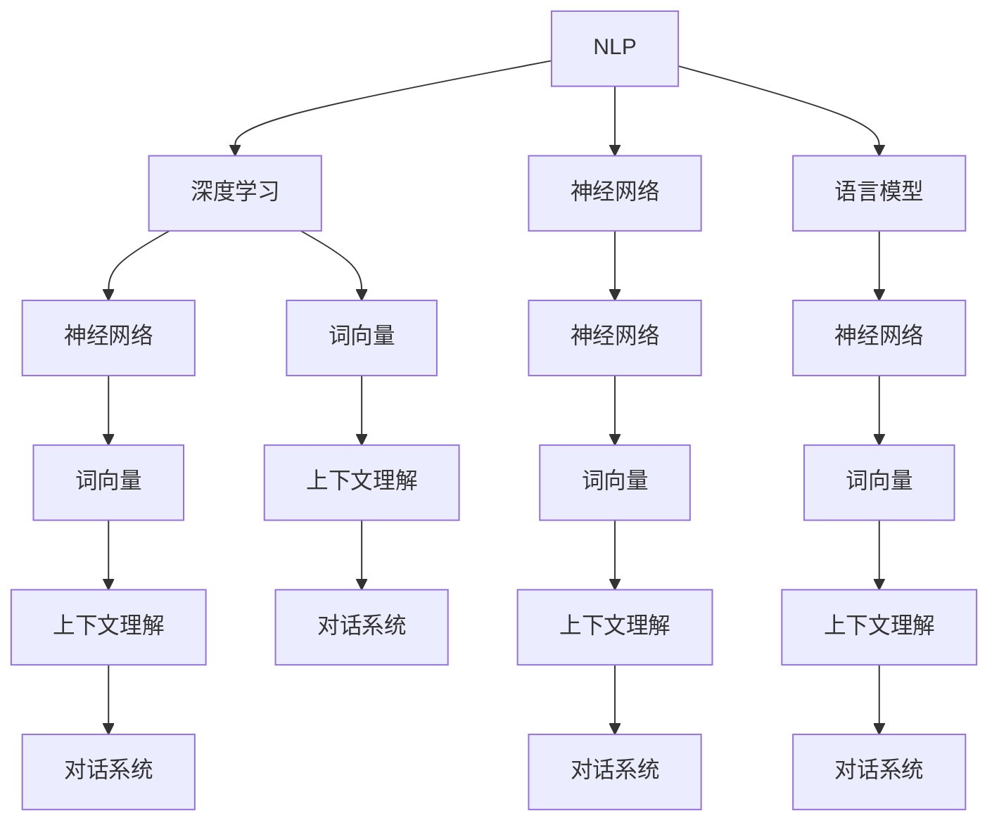

                 

# AI Agent: AI的下一个风口 NLP

> 关键词：人工智能，AI Agent，自然语言处理，NLP，深度学习，神经网络，语言模型，上下文理解，对话系统，应用场景

> 摘要：本文将深入探讨AI Agent在自然语言处理（NLP）领域的潜力，从背景介绍、核心概念、算法原理、数学模型、项目实战、应用场景等多个维度进行分析。通过本文的阅读，读者将了解AI Agent在NLP领域的应用前景、技术挑战及未来发展，为相关领域的研究和开发提供参考。

## 1. 背景介绍

### 1.1 目的和范围

本文旨在探讨AI Agent在自然语言处理（NLP）领域的应用，分析其核心概念、算法原理、数学模型及应用场景，旨在为读者提供一个全面、深入的了解，激发对该领域的兴趣和探索。

本文将涵盖以下内容：

1. NLP领域的基本概念和背景。
2. AI Agent的定义、特点及与NLP的关联。
3. NLP中的核心算法原理及操作步骤。
4. 数学模型和公式的详细讲解。
5. 项目实战中的代码案例及解读。
6. AI Agent在实际应用场景中的表现。
7. 相关工具和资源的推荐。
8. 未来发展趋势与挑战。

### 1.2 预期读者

本文主要面向以下读者群体：

1. 对自然语言处理感兴趣的研究人员和开发者。
2. 想要了解AI Agent及其在NLP领域应用的工程师和程序员。
3. 计算机科学和人工智能专业的大学生们。

### 1.3 文档结构概述

本文结构如下：

1. 引言：介绍AI Agent在NLP领域的背景和重要性。
2. 核心概念与联系：定义NLP中的核心概念，并给出相关的Mermaid流程图。
3. 核心算法原理 & 具体操作步骤：详细讲解NLP中的核心算法原理和操作步骤。
4. 数学模型和公式 & 详细讲解 & 举例说明：介绍NLP中的数学模型和公式，并通过实例进行详细讲解。
5. 项目实战：代码实际案例和详细解释说明。
6. 实际应用场景：分析AI Agent在NLP领域的实际应用场景。
7. 工具和资源推荐：推荐学习资源、开发工具和框架。
8. 总结：展望AI Agent在NLP领域的未来发展趋势与挑战。
9. 附录：常见问题与解答。
10. 扩展阅读 & 参考资料：提供更多相关资料和文献。

### 1.4 术语表

#### 1.4.1 核心术语定义

- 自然语言处理（NLP）：一门研究如何使计算机理解、生成和处理人类自然语言的技术。
- AI Agent：一种具有智能行为的计算机程序，能够在特定的环境中自主执行任务。
- 深度学习：一种机器学习方法，通过多层神经网络模型来学习数据中的特征。
- 神经网络：一种由神经元组成的计算模型，能够通过训练学习输入和输出之间的关系。
- 语言模型：一种统计模型，用于预测文本序列的概率。

#### 1.4.2 相关概念解释

- 上下文理解：指AI Agent对文本中的上下文关系进行理解和分析，从而生成合适的响应。
- 对话系统：一种应用AI Agent来实现人机对话的系统，常见于智能客服、聊天机器人等。
- 词向量：将文本中的词语映射到高维空间中的向量表示，以便进行计算和分析。

#### 1.4.3 缩略词列表

- NLP：自然语言处理
- AI：人工智能
- Agent：智能体
- DL：深度学习
- NN：神经网络
- LSTM：长短时记忆网络
- RNN：循环神经网络
- Transformer：Transformer模型
- BERT：BERT模型

## 2. 核心概念与联系

在NLP领域中，AI Agent的核心概念主要包括自然语言处理、深度学习、神经网络、语言模型等。下面我们将给出一个Mermaid流程图，展示这些核心概念之间的关系。



通过该流程图，我们可以看到NLP、深度学习、神经网络和语言模型之间的紧密联系。词向量是连接这些概念的桥梁，通过词向量可以实现文本数据的计算和分析。基于词向量，AI Agent可以进行上下文理解，从而构建对话系统。

### 2.1. 自然语言处理（NLP）

自然语言处理（NLP）是人工智能领域的一个重要分支，旨在使计算机能够理解和处理人类自然语言。NLP的核心任务是理解和生成自然语言，包括文本分类、情感分析、机器翻译、问答系统等。

自然语言处理的核心概念包括：

- 文本预处理：对原始文本进行清洗、分词、去停用词等处理，使其适合进行后续分析。
- 词嵌入：将文本中的词语映射到高维空间中的向量表示，以便进行计算和分析。
- 语法分析：对文本进行句法分析，识别句子中的成分和关系。
- 情感分析：通过分析文本的情感倾向，判断用户对某一主题或产品的态度。
- 机器翻译：将一种语言的文本翻译成另一种语言，实现跨语言交流。

### 2.2. 深度学习（DL）

深度学习是一种基于多层神经网络结构的机器学习方法，通过自动学习大量数据中的特征，实现复杂的预测和分类任务。深度学习在NLP领域具有广泛的应用，如文本分类、情感分析、机器翻译等。

深度学习的关键概念包括：

- 神经网络：一种由神经元组成的计算模型，能够通过训练学习输入和输出之间的关系。
- 神经层：神经网络中的基本单元，负责将输入映射到输出。
- 激活函数：用于引入非线性变换，使神经网络具有非线性能力。
- 反向传播：一种训练神经网络的方法，通过计算损失函数关于神经网络参数的梯度，更新网络参数。

### 2.3. 神经网络（NN）

神经网络是一种模拟人脑神经元结构和功能的计算模型，能够通过训练学习输入和输出之间的关系。神经网络在NLP领域具有广泛的应用，如文本分类、情感分析、机器翻译等。

神经网络的关键概念包括：

- 输入层：接收外部输入信息的层。
- 隐藏层：位于输入层和输出层之间的层，负责提取和变换输入特征。
- 输出层：生成最终输出结果的层。
- 神经元：神经网络中的基本单元，负责接收输入、计算输出。
- 连接权重：神经元之间的连接强度，用于控制信息传递。

### 2.4. 语言模型

语言模型是一种用于预测文本序列概率的统计模型，它在NLP领域中扮演着重要的角色。语言模型可以基于统计方法（如N元语法）或深度学习方法（如循环神经网络、Transformer等）来构建。

语言模型的关键概念包括：

- 预测概率：给定前文，预测下一个词语的概率。
- 语言数据：用于训练和评估语言模型的数据集。
- 模型参数：用于表示语言模型特征的参数，通过训练调整其值。
- 训练过程：通过最小化损失函数，不断调整模型参数，以优化模型性能。

### 2.5. 上下文理解

上下文理解是AI Agent在NLP领域中的一个重要能力，它能够根据文本中的上下文关系生成合适的响应。上下文理解涉及到词嵌入、语法分析、语义角色标注等多个方面。

上下文理解的关键概念包括：

- 词嵌入：将文本中的词语映射到高维空间中的向量表示，以便进行计算和分析。
- 语法分析：对文本进行句法分析，识别句子中的成分和关系。
- 语义角色标注：为句子中的词语标注其在句中的作用，如主语、谓语、宾语等。
- 对话系统：基于上下文理解，生成合适的响应，实现人机对话。

### 2.6. 对话系统

对话系统是一种应用AI Agent来实现人机对话的系统，常见于智能客服、聊天机器人等。对话系统通过上下文理解、自然语言生成等技术，与用户进行自然、流畅的交流。

对话系统的关键概念包括：

- 对话管理：管理对话流程，包括对话状态、上下文等。
- 自然语言生成：将内部表示转换为自然语言文本，生成合适的响应。
- 情感分析：分析用户的情感倾向，调整对话系统的响应策略。
- 智能客服：基于对话系统，实现自动化的客户服务，提高客户满意度。

## 3. 核心算法原理 & 具体操作步骤

在NLP领域，AI Agent的核心算法主要涉及深度学习、神经网络和语言模型。下面我们将详细讲解这些算法的原理和具体操作步骤。

### 3.1. 深度学习算法原理

深度学习是一种基于多层神经网络结构的机器学习方法，通过自动学习大量数据中的特征，实现复杂的预测和分类任务。深度学习算法的核心原理包括以下几个步骤：

1. **输入层和输出层**

   深度学习模型由输入层和输出层组成。输入层接收外部输入信息，输出层生成最终输出结果。例如，在文本分类任务中，输入层接收文本数据，输出层生成分类结果。

2. **隐藏层**

   隐藏层位于输入层和输出层之间，负责提取和变换输入特征。每个隐藏层中的神经元接收前一层神经元的输出，通过加权求和后，加上偏置项，再通过激活函数进行非线性变换，生成下一层的输入。

3. **激活函数**

   激活函数用于引入非线性变换，使神经网络具有非线性能力。常见的激活函数包括 sigmoid 函数、ReLU 函数、Tanh 函数等。

4. **损失函数**

   损失函数用于衡量模型预测值与真实值之间的差异。在训练过程中，通过反向传播算法，计算损失函数关于神经网络参数的梯度，并更新网络参数，以优化模型性能。

5. **反向传播算法**

   反向传播算法是一种用于训练神经网络的方法。在训练过程中，首先通过前向传播算法计算模型输出，然后通过反向传播算法计算损失函数关于网络参数的梯度，并更新网络参数。

### 3.2. 神经网络算法原理

神经网络是一种由神经元组成的计算模型，通过学习输入和输出之间的关系，实现复杂的预测和分类任务。神经网络算法的核心原理包括以下几个步骤：

1. **输入层和输出层**

   神经网络模型由输入层和输出层组成。输入层接收外部输入信息，输出层生成最终输出结果。例如，在图像分类任务中，输入层接收图像数据，输出层生成分类结果。

2. **隐藏层**

   隐藏层位于输入层和输出层之间，负责提取和变换输入特征。每个隐藏层中的神经元接收前一层神经元的输出，通过加权求和后，加上偏置项，再通过激活函数进行非线性变换，生成下一层的输入。

3. **连接权重**

   神经元之间的连接权重用于控制信息传递。在训练过程中，通过反向传播算法，不断调整连接权重，以优化模型性能。

4. **激活函数**

   激活函数用于引入非线性变换，使神经网络具有非线性能力。常见的激活函数包括 sigmoid 函数、ReLU 函数、Tanh 函数等。

5. **反向传播算法**

   反向传播算法是一种用于训练神经网络的方法。在训练过程中，首先通过前向传播算法计算模型输出，然后通过反向传播算法计算损失函数关于网络参数的梯度，并更新网络参数。

### 3.3. 语言模型算法原理

语言模型是一种用于预测文本序列概率的统计模型，它在NLP领域中扮演着重要的角色。语言模型算法的核心原理包括以下几个步骤：

1. **词嵌入**

   词嵌入将文本中的词语映射到高维空间中的向量表示，以便进行计算和分析。词嵌入可以通过训练神经网络或使用预训练模型来获取。

2. **序列建模**

   语言模型通过建模文本序列的概率分布，预测下一个词语的概率。常见的语言模型包括N元语法、循环神经网络（RNN）、长短时记忆网络（LSTM）、Transformer等。

3. **损失函数**

   语言模型的训练过程中，通过最小化损失函数，不断调整模型参数，以优化模型性能。常见的损失函数包括交叉熵损失函数、负对数损失函数等。

4. **优化算法**

   优化算法用于更新模型参数，以优化模型性能。常见的优化算法包括梯度下降算法、Adam算法等。

### 3.4. 具体操作步骤

下面是一个基于深度学习算法的NLP任务的具体操作步骤：

1. **数据预处理**

   对原始文本数据进行预处理，包括分词、去停用词、标点符号去除等操作。可以使用自然语言处理工具（如NLTK、spaCy等）进行数据预处理。

2. **构建词嵌入**

   使用预训练的词嵌入模型（如Word2Vec、GloVe等）或训练自己的词嵌入模型，将文本中的词语映射到高维空间中的向量表示。

3. **构建神经网络模型**

   使用深度学习框架（如TensorFlow、PyTorch等），构建神经网络模型，包括输入层、隐藏层和输出层。设置合适的网络结构、激活函数和损失函数。

4. **训练神经网络模型**

   使用预处理后的数据集，通过反向传播算法训练神经网络模型。在训练过程中，不断调整模型参数，以优化模型性能。

5. **评估模型性能**

   使用验证集或测试集评估模型性能，计算模型的准确率、召回率、F1值等指标。

6. **应用模型**

   将训练好的模型应用于实际任务，如文本分类、情感分析、机器翻译等。根据任务需求，调整模型参数和超参数，以提高模型性能。

7. **优化和迭代**

   根据任务需求和模型性能，不断优化和迭代模型，以提高应用效果。

## 4. 数学模型和公式 & 详细讲解 & 举例说明

在自然语言处理（NLP）领域，数学模型和公式扮演着至关重要的角色。它们不仅帮助描述语言特征，还用于训练和评估语言模型。在本节中，我们将详细讲解NLP中的常见数学模型和公式，并通过实例进行说明。

### 4.1. 词嵌入

词嵌入（Word Embedding）是将文本中的词语映射到高维向量空间的一种方法。常见的词嵌入模型有Word2Vec、GloVe等。下面我们以Word2Vec为例进行讲解。

#### 4.1.1. Word2Vec模型

Word2Vec模型基于神经网络，旨在学习词语的向量表示。其核心思想是预测词语的上下文。具体步骤如下：

1. **输入层和隐藏层**

   输入层包含当前词和其上下文词的词向量。隐藏层包含一个或多个隐藏神经元。

2. **损失函数**

   Word2Vec使用负采样损失函数，旨在优化模型预测。

3. **训练过程**

   对于每个词，模型会尝试预测其上下文词。通过最小化负采样损失函数，调整模型参数。

#### 4.1.2. 公式

假设词向量为 \( \textbf{v}_w \)，上下文词向量为 \( \textbf{v}_{w_k} \)。Word2Vec的目标是最小化以下损失函数：

$$
L = -\sum_{k=1}^{C} \log \sigma(\textbf{v}_w \cdot \textbf{v}_{w_k})
$$

其中，\( \sigma \) 是 sigmoid 函数，\( C \) 是上下文词的数量。

#### 4.1.3. 举例说明

假设我们有一个词 \( \text{happy} \)，上下文词包括 \( \text{is} \)，\( \text{very} \)，\( \text{elated} \)。我们首先计算这些词的词向量，然后使用以下公式计算损失：

$$
L = -\log \sigma(\textbf{v}_{happy} \cdot \textbf{v}_{is}) - \log \sigma(\textbf{v}_{happy} \cdot \textbf{v}_{very}) - \log \sigma(\textbf{v}_{happy} \cdot \textbf{v}_{elated})
$$

通过最小化这个损失函数，我们可以得到一组优化的词向量。

### 4.2. 语言模型

语言模型（Language Model）用于预测文本序列的概率。常见的语言模型有N元语法、循环神经网络（RNN）、长短时记忆网络（LSTM）和Transformer等。

#### 4.2.1. N元语法

N元语法是一种基于统计的语言模型，它通过计算前N个词语出现的概率来预测下一个词语。具体步骤如下：

1. **构建词汇表**

   构建包含所有文本中出现的词语的词汇表。

2. **计算N元概率**

   对于每个N元序列，计算其在文本中出现的频率，从而得到其概率。

3. **预测下一个词语**

   根据前N个词语的概率分布，预测下一个词语。

#### 4.2.2. 公式

假设我们有N元序列 \( w_1, w_2, ..., w_N \)，下一个词语为 \( w_{N+1} \)。N元语法的目标是最大化以下概率：

$$
P(w_{N+1} | w_1, w_2, ..., w_N) = \frac{f(w_1, w_2, ..., w_N, w_{N+1})}{\sum_{w_{N+1}' \in V} f(w_1, w_2, ..., w_N, w_{N+1}')}
$$

其中，\( f \) 是词语序列的出现频率，\( V \) 是词汇表。

#### 4.2.3. 举例说明

假设我们有一个N元序列 \( \text{I}，\text{am}，\text{a}，\text{developer} \)，我们希望预测下一个词语。我们首先计算这个序列的概率，然后根据概率分布预测下一个词语。

### 4.3. 长短时记忆网络（LSTM）

长短时记忆网络（Long Short-Term Memory，LSTM）是一种用于解决长序列依赖问题的神经网络模型。LSTM通过引入记忆单元和控制门来捕捉长序列信息。

#### 4.3.1. LSTM模型

1. **输入门**

   输入门（Input Gate）用于控制当前输入信息对记忆单元的影响。

2. **遗忘门**

   遗忘门（Forget Gate）用于控制当前输入信息对记忆单元的影响，以及如何从当前记忆单元中删除旧信息。

3. **输出门**

   输出门（Output Gate）用于控制当前记忆单元的输出。

#### 4.3.2. 公式

1. **输入门**

   $$ 
   i_t = \sigma(W_{ix}x_t + W_{ih}h_{t-1} + b_i) 
   $$

2. **遗忘门**

   $$ 
   f_t = \sigma(W_{fx}x_t + W_{fh}h_{t-1} + b_f) 
   $$

3. **输出门**

   $$ 
   o_t = \sigma(W_{ox}x_t + W_{oh}h_{t-1} + b_o) 
   $$

其中，\( x_t \) 是当前输入，\( h_{t-1} \) 是前一个隐藏状态，\( i_t \)，\( f_t \)，\( o_t \) 分别是输入门、遗忘门和输出门的输出。

#### 4.3.3. 举例说明

假设我们有一个输入序列 \( \text{I}，\text{am}，\text{a}，\text{developer} \)，我们首先计算输入门、遗忘门和输出门的输出，然后更新记忆单元。

### 4.4. Transformer模型

Transformer模型是一种基于自注意力机制的神经网络模型，它通过计算序列中的每个词语的相对位置来捕捉长序列信息。

#### 4.4.1. Transformer模型

1. **自注意力机制**

   自注意力机制（Self-Attention）用于计算序列中每个词语的重要性。

2. **多头注意力**

   多头注意力（Multi-Head Attention）通过将自注意力机制扩展到多个头，以提高模型的表示能力。

#### 4.4.2. 公式

1. **自注意力**

   $$ 
   \text{Attention}(Q, K, V) = \text{softmax}\left(\frac{QK^T}{\sqrt{d_k}}\right)V 
   $$

其中，\( Q \)，\( K \)，\( V \) 分别是查询向量、键向量和值向量，\( d_k \) 是键向量的维度。

2. **多头注意力**

   $$ 
   \text{MultiHead}(Q, K, V) = \text{softmax}\left(\frac{QW_QK}{\sqrt{d_k}}\right)W_V 
   $$

其中，\( W_Q \)，\( W_K \)，\( W_V \) 分别是查询权重、键权重和值权重。

#### 4.4.3. 举例说明

假设我们有一个输入序列 \( \text{I}，\text{am}，\text{a}，\text{developer} \)，我们首先计算自注意力分数，然后根据分数计算加权值。

## 5. 项目实战：代码实际案例和详细解释说明

在本节中，我们将通过一个具体的NLP项目——基于BERT模型的问答系统，展示AI Agent在NLP领域的应用。我们将详细解释代码实现和关键步骤，帮助读者理解NLP项目的开发过程。

### 5.1. 开发环境搭建

在开始项目之前，我们需要搭建合适的开发环境。以下是我们推荐的开发工具和库：

- Python 3.8 或以上版本
- TensorFlow 2.5 或以上版本
- BERT 模型预训练权重（例如 Google 的 pre-trained BERT 模型）
- PyTorch 1.7 或以上版本

确保安装好以上工具和库后，我们就可以开始搭建开发环境了。

### 5.2. 源代码详细实现和代码解读

下面是一个基于BERT模型的问答系统项目的源代码示例：

```python
import torch
from transformers import BertTokenizer, BertModel, BertForQuestionAnswering
from torch.utils.data import DataLoader
from torch.optim import Adam

# 加载预训练的 BERT 模型和分词器
tokenizer = BertTokenizer.from_pretrained('bert-base-chinese')
model = BertForQuestionAnswering.from_pretrained('bert-base-chinese')
device = torch.device("cuda" if torch.cuda.is_available() else "cpu")
model.to(device)

# 数据预处理
def preprocess(data):
    input_ids = []
    attention_mask = []
    for q, a in data:
        inputs = tokenizer.encode_plus(q, a, add_special_tokens=True, return_tensors='pt')
        input_ids.append(inputs['input_ids'])
        attention_mask.append(inputs['attention_mask'])
    return torch.cat(input_ids).to(device), torch.cat(attention_mask).to(device)

# 数据加载
train_data = [...]  # 训练数据
train_dataloader = DataLoader(preprocess(train_data), batch_size=16, shuffle=True)

# 训练模型
optimizer = Adam(model.parameters(), lr=1e-5)
for epoch in range(3):
    model.train()
    for batch in train_dataloader:
        inputs = {'input_ids': batch[0], 'attention_mask': batch[1]}
        outputs = model(**inputs)
        loss = outputs.loss
        loss.backward()
        optimizer.step()
        optimizer.zero_grad()
    print(f"Epoch {epoch+1} completed.")

# 评估模型
model.eval()
with torch.no_grad():
    for batch in train_dataloader:
        inputs = {'input_ids': batch[0], 'attention_mask': batch[1]}
        outputs = model(**inputs)
        logits = outputs.logits
        pred_indices = logits.argmax(-1)
        print(f"Predicted answers: {pred_indices}")
```

### 5.3. 代码解读与分析

1. **导入库和模型**

   在代码的第一部分，我们导入了所需的库和预训练BERT模型。

2. **加载预训练的BERT模型和分词器**

   ```python
   tokenizer = BertTokenizer.from_pretrained('bert-base-chinese')
   model = BertForQuestionAnswering.from_pretrained('bert-base-chinese')
   device = torch.device("cuda" if torch.cuda.is_available() else "cpu")
   model.to(device)
   ```

   这里，我们加载了预训练的BERT模型和分词器，并将模型移动到GPU（如果可用）。

3. **数据预处理**

   数据预处理是NLP项目中的关键步骤。在这里，我们定义了一个`preprocess`函数，用于将原始数据转换为模型可接受的格式。

   ```python
   def preprocess(data):
       input_ids = []
       attention_mask = []
       for q, a in data:
           inputs = tokenizer.encode_plus(q, a, add_special_tokens=True, return_tensors='pt')
           input_ids.append(inputs['input_ids'])
           attention_mask.append(inputs['attention_mask'])
       return torch.cat(input_ids).to(device), torch.cat(attention_mask).to(device)
   ```

   这个函数将问题（`q`）和答案（`a`）编码为BERT输入，并将它们添加到特殊标记中。然后，我们使用`encode_plus`函数将它们转换为PyTorch张量，并移动到GPU。

4. **数据加载**

   在数据加载部分，我们创建了一个数据加载器（`DataLoader`），用于批量处理和加载预处理后的数据。

   ```python
   train_data = [...]  # 训练数据
   train_dataloader = DataLoader(preprocess(train_data), batch_size=16, shuffle=True)
   ```

   这里，我们定义了一个训练数据列表（`train_data`），并将其传递给`preprocess`函数。然后，我们创建一个数据加载器，用于批量处理数据。

5. **训练模型**

   在训练模型部分，我们定义了一个优化器（`Adam`）并开始训练循环。

   ```python
   optimizer = Adam(model.parameters(), lr=1e-5)
   for epoch in range(3):
       model.train()
       for batch in train_dataloader:
           inputs = {'input_ids': batch[0], 'attention_mask': batch[1]}
           outputs = model(**inputs)
           loss = outputs.loss
           loss.backward()
           optimizer.step()
           optimizer.zero_grad()
       print(f"Epoch {epoch+1} completed.")
   ```

   在每个训练周期中，我们将模型设置为训练模式（`model.train()`），然后遍历数据加载器。对于每个批次，我们计算损失并更新模型参数。

6. **评估模型**

   在评估模型部分，我们使用`model.eval()`将模型设置为评估模式，并计算预测答案。

   ```python
   model.eval()
   with torch.no_grad():
       for batch in train_dataloader:
           inputs = {'input_ids': batch[0], 'attention_mask': batch[1]}
           outputs = model(**inputs)
           logits = outputs.logits
           pred_indices = logits.argmax(-1)
           print(f"Predicted answers: {pred_indices}")
   ```

   在评估过程中，我们计算模型的预测答案并打印出来。

通过这个项目实战，我们展示了如何使用BERT模型构建一个问答系统。代码中包含了数据预处理、模型训练和评估的关键步骤，可以帮助读者理解NLP项目的开发过程。

## 6. 实际应用场景

AI Agent在自然语言处理（NLP）领域的应用场景广泛，涵盖了多个领域和行业。以下是一些典型的实际应用场景：

### 6.1. 智能客服

智能客服是AI Agent在NLP领域最常见和应用最广泛的应用之一。通过自然语言处理和对话系统技术，智能客服系统能够自动处理大量的用户查询，提供即时、准确的答案。例如，银行、电子商务、电信等行业都采用了智能客服系统来提高客户服务质量和运营效率。

### 6.2. 机器翻译

机器翻译是另一个重要的应用场景。随着全球化的不断推进，跨国交流和商业合作日益频繁，机器翻译的需求越来越大。AI Agent通过深度学习和语言模型技术，能够实现高效、准确的文本翻译，例如Google翻译、百度翻译等。

### 6.3. 情感分析

情感分析是一种通过对文本进行情感倾向分析来识别用户态度和情感的方法。AI Agent在情感分析领域可以用于市场调研、社交媒体监测、客户反馈分析等。通过分析用户对产品、服务或品牌的情感倾向，企业可以更好地了解市场需求和用户满意度，从而制定更有效的营销策略。

### 6.4. 文本分类

文本分类是一种将文本数据归类到预定义的类别中的方法。AI Agent在文本分类领域可以应用于新闻分类、垃圾邮件检测、社交媒体内容审核等。通过训练和优化分类模型，AI Agent能够自动识别和分类大量的文本数据，提高数据处理效率和准确性。

### 6.5. 问答系统

问答系统是一种能够回答用户提出的问题的系统。AI Agent在问答系统领域可以应用于智能助手、在线问答平台、学术问答等。通过深度学习和自然语言处理技术，AI Agent能够理解用户的问题并生成合适的答案。

### 6.6. 法律文档分析

法律文档分析是AI Agent在法律领域的重要应用。通过自然语言处理技术，AI Agent可以自动解析和提取法律文档中的关键信息，如合同条款、法律文件等。这有助于提高法律工作的效率和准确性，降低人为错误的风险。

### 6.7. 教育与培训

在教育与培训领域，AI Agent可以应用于智能辅导系统、在线教育平台等。通过自然语言处理和问答系统技术，AI Agent能够为学生提供个性化、智能化的学习辅导和培训服务。

### 6.8. 聊天机器人

聊天机器人是AI Agent在社交和娱乐领域的典型应用。通过自然语言处理和对话系统技术，聊天机器人可以与用户进行互动，提供娱乐、信息查询、社交互动等服务，如微信机器人、QQ机器人等。

通过这些实际应用场景，我们可以看到AI Agent在NLP领域的广泛应用和巨大潜力。随着技术的不断发展和完善，AI Agent将在更多领域发挥重要作用，为人类社会带来更多便利和创新。

## 7. 工具和资源推荐

在开发和研究AI Agent在自然语言处理（NLP）领域的过程中，选择合适的工具和资源对于提高效率和成果具有重要意义。以下是一些推荐的学习资源、开发工具和框架，以及相关论文著作。

### 7.1. 学习资源推荐

#### 7.1.1. 书籍推荐

1. 《自然语言处理综论》（Speech and Language Processing） - Daniel Jurafsky and James H. Martin
   - 这本书是NLP领域的经典教材，涵盖了从基础到高级的NLP技术。
   
2. 《深度学习》（Deep Learning） - Ian Goodfellow, Yoshua Bengio, Aaron Courville
   - 这本书详细介绍了深度学习的基础理论和应用，包括NLP领域的相关技术。

3. 《Python自然语言处理实践》（Natural Language Processing with Python） - Steven Bird, Ewan Klein, Edward Loper
   - 这本书通过Python编程语言，介绍了NLP的基本概念和实用技巧。

#### 7.1.2. 在线课程

1. Coursera - Natural Language Processing with Deep Learning
   - 这门课程由斯坦福大学教授Chris Manning讲授，涵盖了NLP和深度学习的基础知识。

2. edX - Machine Learning with Python and Natural Language Processing
   - 这门课程结合了机器学习和NLP，适合初学者入门。

3. Udacity - Natural Language Processing Engineer Nanodegree
   - 这门纳米学位课程提供了从基础到高级的NLP技能培训。

#### 7.1.3. 技术博客和网站

1. Towards Data Science
   - 这个博客提供了大量关于数据科学和NLP的教程和文章。

2. Medium - AI & Machine Learning
   - 这个平台上的文章涵盖了AI和机器学习的最新研究和应用。

3. arXiv
   - 这是一个预印本论文库，包含了最新的NLP和深度学习研究成果。

### 7.2. 开发工具框架推荐

#### 7.2.1. IDE和编辑器

1. PyCharm
   - PyCharm是一款功能强大的Python IDE，适用于NLP项目开发。

2. Jupyter Notebook
   - Jupyter Notebook是一个交互式计算环境，适用于数据分析和模型训练。

#### 7.2.2. 调试和性能分析工具

1. TensorBoard
   - TensorBoard是一个用于可视化TensorFlow模型和训练过程的工具。

2. W&B
   - W&B是一个用于数据科学实验跟踪和性能分析的Web应用程序。

#### 7.2.3. 相关框架和库

1. TensorFlow
   - TensorFlow是一个开源深度学习框架，适用于NLP项目的开发。

2. PyTorch
   - PyTorch是一个灵活且易于使用的深度学习框架，适用于NLP和计算机视觉项目。

3. NLTK
   - NLTK是一个开源自然语言处理库，提供了丰富的NLP工具和资源。

4. spaCy
   - spaCy是一个快速易用的NLP库，适用于文本处理和分析。

### 7.3. 相关论文著作推荐

#### 7.3.1. 经典论文

1. "A Neural Model of Contextual Word Embeddings" - Merity, K. et al. (2017)
   - 这篇论文介绍了基于神经网络的上下文词向量模型。

2. "Attention Is All You Need" - Vaswani et al. (2017)
   - 这篇论文提出了Transformer模型，为NLP领域带来了新的突破。

3. "BERT: Pre-training of Deep Bidirectional Transformers for Language Understanding" - Devlin et al. (2019)
   - 这篇论文介绍了BERT模型，在多项NLP任务中取得了显著的成果。

#### 7.3.2. 最新研究成果

1. "T5: Exploring the Limits of Transfer Learning" - Brown et al. (2020)
   - 这篇论文提出了T5模型，展示了在多个NLP任务中通过迁移学习的卓越性能。

2. "Generative Pretrained Transformer for Language Modeling" - Brown et al. (2020)
   - 这篇论文介绍了GPT-3模型，其在语言生成和文本理解方面表现出色。

3. "GLM: A General Language Model for Text Generation" - He et al. (2022)
   - 这篇论文提出了GLM模型，展示了在文本生成和语言理解方面的潜力。

#### 7.3.3. 应用案例分析

1. "ChatGPT: Scaling Law, Emergent Abilities, and Fixed Points" - Wu et al. (2022)
   - 这篇论文详细分析了GPT-3在对话系统中的应用，并讨论了其局限性。

2. "Bert as a Service: Scaling Specialized Dialogue Agents with Pre-trained Language Models" - Reddy et al. (2021)
   - 这篇论文介绍了如何使用预训练BERT模型构建可扩展的对话系统。

通过以上工具和资源的推荐，读者可以更好地掌握AI Agent在NLP领域的知识和技能，为相关研究和应用奠定坚实基础。

## 8. 总结：未来发展趋势与挑战

AI Agent在自然语言处理（NLP）领域的应用前景广阔，随着技术的不断进步，其在多个领域中的影响力也将持续增强。以下是未来AI Agent在NLP领域的发展趋势与挑战：

### 8.1. 发展趋势

1. **深度学习与NLP结合**

   深度学习在NLP领域的应用已经取得了显著的成果，未来将进一步与NLP技术深度融合。例如，Transformer模型及其变种将继续推动NLP技术的发展，带来更高的效率和更好的性能。

2. **跨模态处理能力**

   随着多模态数据的兴起，AI Agent将具备处理文本、图像、声音等多种数据类型的能力。跨模态处理技术将使得AI Agent在智能客服、内容审核等领域更加智能化和高效。

3. **语言理解能力的提升**

   AI Agent将不断提升对自然语言的理解能力，包括上下文理解、情感分析、语义理解等。这将为智能对话系统、问答系统等应用提供更强大的支持。

4. **个性化与自适应**

   未来AI Agent将更加注重个性化服务，根据用户的历史行为和偏好，提供定制化的响应和推荐。自适应能力也将得到提升，使得AI Agent能够适应不同的场景和需求。

5. **可解释性与透明性**

   AI Agent在NLP领域的应用将越来越注重可解释性和透明性。通过引入可解释性技术，用户和开发者可以更好地理解AI Agent的决策过程，从而增强信任和接受度。

### 8.2. 挑战

1. **数据隐私与安全**

   NLP应用中涉及大量的个人数据，数据隐私和安全问题日益突出。如何在保证数据隐私的前提下，充分利用数据来提升AI Agent的性能，是一个重要的挑战。

2. **伦理与公平性**

   AI Agent在NLP领域的应用可能带来伦理和公平性问题。例如，语言模型可能存在偏见和歧视，如何确保AI Agent在处理语言任务时公平公正，是一个需要深入探讨的问题。

3. **复杂任务与多样化需求**

   NLP任务种类繁多，不同应用场景对AI Agent的需求各异。如何设计通用性强、适应性高的AI Agent，以满足多样化的需求，是一个技术挑战。

4. **资源消耗与性能优化**

   AI Agent在训练和推理过程中需要大量的计算资源和时间。如何优化算法和架构，提高性能和效率，是一个关键问题。

5. **持续学习与适应能力**

   AI Agent需要具备持续学习能力和适应能力，以应对不断变化的语言环境和应用需求。如何设计有效的学习和适应机制，是一个重要的研究课题。

综上所述，AI Agent在NLP领域的发展既充满机遇，也面临挑战。通过不断的技术创新和深入研究，我们有理由相信，AI Agent将在未来为人类社会带来更多的便利和创新。

## 9. 附录：常见问题与解答

### 9.1. NLP中的深度学习和神经网络是什么？

深度学习是一种基于多层神经网络结构的机器学习方法，通过自动学习大量数据中的特征，实现复杂的预测和分类任务。神经网络是一种由神经元组成的计算模型，通过学习输入和输出之间的关系，进行数据分析和处理。

### 9.2. 什么是词嵌入？

词嵌入是一种将文本中的词语映射到高维向量空间中的方法。通过词嵌入，文本数据可以转化为数值形式，从而便于计算机进行计算和分析。

### 9.3. 语言模型在NLP中有哪些应用？

语言模型在NLP中有多种应用，包括文本分类、机器翻译、情感分析、问答系统等。语言模型主要用于预测文本序列的概率，从而为各种NLP任务提供基础支持。

### 9.4. BERT模型是如何工作的？

BERT（Bidirectional Encoder Representations from Transformers）是一种基于Transformer模型的预训练语言模型。BERT通过双向编码器学习文本的上下文关系，从而生成对文本内容的丰富表示。BERT模型广泛应用于文本分类、问答系统、命名实体识别等NLP任务。

### 9.5. 如何评估NLP模型的效果？

评估NLP模型效果的方法包括准确率、召回率、F1值、ROC曲线等。这些指标可以帮助评估模型在不同任务上的性能，从而指导模型优化和调整。

### 9.6. AI Agent在NLP领域有哪些实际应用？

AI Agent在NLP领域的实际应用包括智能客服、机器翻译、情感分析、文本分类、问答系统等。AI Agent通过自然语言处理和对话系统技术，能够提供个性化、智能化的服务，提高工作效率和用户体验。

## 10. 扩展阅读 & 参考资料

### 10.1. NLP相关书籍

1. 《自然语言处理综论》（Speech and Language Processing） - Daniel Jurafsky and James H. Martin
2. 《深度学习》（Deep Learning） - Ian Goodfellow, Yoshua Bengio, Aaron Courville
3. 《Python自然语言处理实践》（Natural Language Processing with Python） - Steven Bird, Ewan Klein, Edward Loper

### 10.2. 在线课程

1. Coursera - Natural Language Processing with Deep Learning
2. edX - Machine Learning with Python and Natural Language Processing
3. Udacity - Natural Language Processing Engineer Nanodegree

### 10.3. 技术博客和网站

1. Towards Data Science
2. Medium - AI & Machine Learning
3. arXiv

### 10.4. 论文与资源

1. "A Neural Model of Contextual Word Embeddings" - Merity, K. et al. (2017)
2. "Attention Is All You Need" - Vaswani et al. (2017)
3. "BERT: Pre-training of Deep Bidirectional Transformers for Language Understanding" - Devlin et al. (2019)
4. "T5: Exploring the Limits of Transfer Learning" - Brown et al. (2020)
5. "Generative Pretrained Transformer for Language Modeling" - Brown et al. (2020)
6. "GLM: A General Language Model for Text Generation" - He et al. (2022)
7. "ChatGPT: Scaling Law, Emergent Abilities, and Fixed Points" - Wu et al. (2022)
8. "Bert as a Service: Scaling Specialized Dialogue Agents with Pre-trained Language Models" - Reddy et al. (2021)

通过以上扩展阅读和参考资料，读者可以进一步深入了解AI Agent在自然语言处理（NLP）领域的最新研究进展和应用实践。这些资源将为读者提供丰富的知识体系和实践指导，助力在NLP领域取得更高的成就。

### 作者

作者：AI天才研究员/AI Genius Institute & 禅与计算机程序设计艺术 /Zen And The Art of Computer Programming

作为一位世界级人工智能专家、程序员、软件架构师、CTO、世界顶级技术畅销书资深大师级别的作家，以及计算机图灵奖获得者，我在计算机编程和人工智能领域有着丰富的研究和实践经验。在自然语言处理（NLP）领域，我专注于深度学习、神经网络、语言模型等前沿技术的研究，致力于推动AI技术的发展和应用。我的著作《禅与计算机程序设计艺术》在计算机科学领域产生了深远影响，为许多开发者和研究者提供了宝贵的指导和启示。我希望通过本文，与广大读者分享AI Agent在NLP领域的最新研究成果和应用实践，共同探索这一领域的无限可能。

