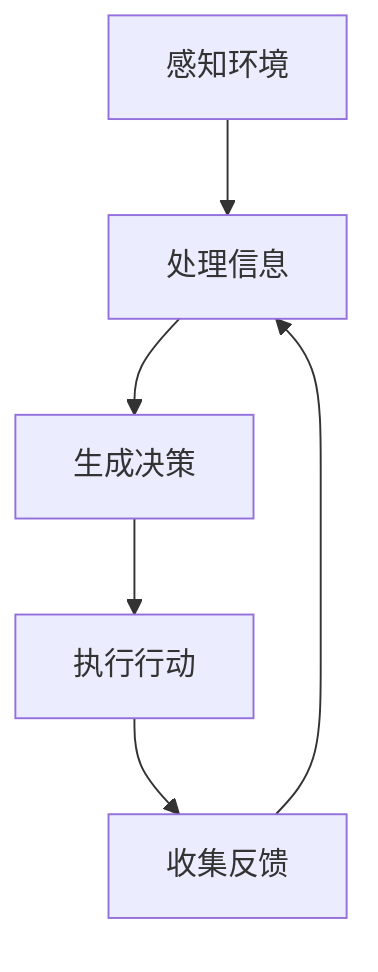

                 

# AI Agent: AI的下一个风口 人机协同的方法和框架

## 关键词：
- AI Agent
- 人机协同
- 强化学习
- 自然语言处理
- 脚本自动化
- 机器学习模型
- 框架设计
- 软件架构

## 摘要：
本文将探讨人工智能（AI）代理（AI Agent）的崛起及其在现实世界中的应用，重点关注人机协同的方法和框架。通过深入分析AI代理的核心概念、算法原理、数学模型，以及项目实战中的代码实现，本文旨在为读者提供全面的技术指南，帮助他们理解和应用AI代理技术，开启AI与人类协作的新时代。

---

## 1. 背景介绍

### 1.1 目的和范围

本文旨在介绍AI代理的基本概念、技术和应用场景，探讨如何实现AI代理与人类高效协同。通过梳理现有的研究成果和技术进展，我们希望为读者提供一个系统、全面的视角，帮助他们把握AI代理的发展趋势，掌握设计和实现AI代理的核心方法。

### 1.2 预期读者

本文适合以下读者群体：
- 对人工智能和机器学习有基本了解的技术人员
- 想要在AI领域深入研究和应用的开发者
- 对人机协同系统有浓厚兴趣的学者和研究人员
- 意在探索AI代理在行业应用中的商业机会的企业家

### 1.3 文档结构概述

本文结构如下：
- 第1章：背景介绍，介绍本文的目的、范围和预期读者。
- 第2章：核心概念与联系，阐述AI代理的基本概念及其在系统架构中的角色。
- 第3章：核心算法原理与具体操作步骤，详细讲解AI代理的算法实现。
- 第4章：数学模型与公式，分析AI代理中的数学模型及其应用。
- 第5章：项目实战，通过实际案例展示AI代理的实现过程。
- 第6章：实际应用场景，探讨AI代理在不同领域的应用。
- 第7章：工具和资源推荐，介绍学习资源和开发工具。
- 第8章：总结，展望AI代理的未来发展趋势与挑战。
- 第9章：附录，提供常见问题与解答。
- 第10章：扩展阅读与参考资料，推荐进一步阅读的材料。

### 1.4 术语表

#### 1.4.1 核心术语定义

- **AI Agent**：一种具有自主性和目标导向的人工智能系统，能够在复杂环境中与人类或其他系统交互，完成特定任务。
- **强化学习**：一种机器学习方法，通过试错和反馈调整策略，以最大化预期奖励。
- **自然语言处理（NLP）**：使计算机能够理解、解释和生成人类语言的技术和理论。
- **脚本自动化**：使用脚本语言自动化执行重复性任务的过程。
- **机器学习模型**：通过训练数据学习和预测结果的数学模型。
- **框架设计**：软件系统的结构和组织方式。

#### 1.4.2 相关概念解释

- **人机协同**：指人工智能系统与人类在任务执行过程中相互协作，提高效率和效果。
- **模型-视图-控制器（MVC）架构**：一种软件设计模式，用于分离应用程序的不同关注点。
- **交互式代理**：能够与人类进行实时交互的AI代理。
- **非交互式代理**：仅执行任务而不与人类交互的AI代理。

#### 1.4.3 缩略词列表

- **AI**：人工智能（Artificial Intelligence）
- **NLP**：自然语言处理（Natural Language Processing）
- **ML**：机器学习（Machine Learning）
- **RL**：强化学习（Reinforcement Learning）
- **MVC**：模型-视图-控制器（Model-View-Controller）
- **API**：应用程序编程接口（Application Programming Interface）

---

## 2. 核心概念与联系

### 2.1 AI Agent的基本概念

AI代理是一种具有自我意识和目标的人工智能实体，能够在特定环境中执行任务。它们通过感知环境、制定决策和执行动作来完成任务。AI代理的核心特点包括：

- **自主性**：能够独立地执行任务，而不依赖于人类的直接指导。
- **目标导向**：有明确的目标或任务，通过决策和动作不断接近目标。
- **适应性**：能够根据环境和任务的变化调整自己的行为策略。

### 2.2 AI Agent在系统架构中的角色

AI代理在系统架构中扮演多个角色，包括：

- **感知模块**：收集和处理环境中的信息，如文本、图像、语音等。
- **决策模块**：基于感知模块提供的信息，制定最优的行动策略。
- **执行模块**：执行决策模块生成的行动，实现任务的完成。
- **反馈模块**：收集执行结果，用于评估和优化代理的性能。

### 2.3 AI Agent的组成部分

AI代理通常由以下几个核心组件组成：

- **感知器**：用于接收和处理来自环境的数据。
- **控制器**：负责处理感知器提供的信息，并生成决策。
- **执行器**：将决策转换为具体的操作，如移动、发送请求等。
- **记忆模块**：存储历史数据和经验，用于学习和发展策略。
- **学习模块**：基于历史数据和反馈，调整代理的策略和模型。

### 2.4 AI Agent的工作原理

AI代理的工作原理主要包括以下几个步骤：

1. **感知环境**：通过感知器收集环境数据，如文本、图像、语音等。
2. **处理信息**：控制器对感知器收集的信息进行处理，提取有用特征。
3. **生成决策**：基于处理后的信息，控制器生成最优的行动策略。
4. **执行行动**：执行器将决策转换为具体的操作，实现任务。
5. **收集反馈**：记忆模块记录执行结果，学习模块使用反馈调整策略。

### 2.5 AI Agent与人类的协作

AI代理与人类的协作可以通过以下几种方式实现：

- **指令式协作**：人类直接向AI代理下达指令，代理执行特定任务。
- **协商式协作**：人类与AI代理在任务执行过程中进行实时沟通，调整策略。
- **混合式协作**：AI代理与人类共同参与任务，分工协作，提高效率。

### 2.6 AI Agent的Mermaid流程图

下面是一个简单的Mermaid流程图，展示了AI Agent的工作流程：



---

## 3. 核心算法原理与具体操作步骤

### 3.1 强化学习算法原理

强化学习（Reinforcement Learning，RL）是AI代理中广泛使用的一种算法。它通过试错和反馈来学习如何在特定环境中采取最优行动策略。强化学习的基本原理如下：

- **状态（State）**：描述代理当前所处的环境状态。
- **动作（Action）**：代理可以采取的行动。
- **奖励（Reward）**：代理在每个状态下采取动作后获得的奖励。
- **策略（Policy）**：代理如何从当前状态选择动作的策略。

强化学习的过程可以概括为以下几个步骤：

1. **初始化**：设定初始状态和策略。
2. **采取行动**：根据当前状态，使用策略选择一个动作。
3. **观察结果**：执行动作后，观察环境状态的变化和获得的奖励。
4. **更新策略**：根据观察结果，使用学习算法更新策略。

### 3.2 具体操作步骤

以下是强化学习算法的具体操作步骤：

1. **初始化参数**：

   ```python
   initial_state = env.reset()  # 初始化环境
   policy = initialize_policy()  # 初始化策略
   ```

2. **循环执行动作**：

   ```python
   while not done:
       action = policy.select_action(initial_state)  # 选择动作
       next_state, reward, done, _ = env.step(action)  # 执行动作并获取反馈
       policy.update_policy(initial_state, action, reward, next_state, done)  # 更新策略
       initial_state = next_state  # 更新当前状态
   ```

3. **策略更新**：

   强化学习算法通常会使用如下策略更新规则：

   $$ \pi_{t+1}(a|s) = \pi_t(a|s) + \alpha [r_t + \gamma \max_{a'} \pi_t(a'|s') - \pi_t(a|s)] $$

   其中：
   - $\pi_t(a|s)$：在状态$s$下选择动作$a$的策略。
   - $\alpha$：学习率。
   - $r_t$：在状态$s$下采取动作$a$获得的即时奖励。
   - $\gamma$：折扣因子。
   - $s'$：下一个状态。
   - $a'$：下一个动作。

4. **收敛条件**：

   强化学习算法的收敛条件通常设定为策略不再发生变化，或者变化非常小。

### 3.3 强化学习算法的伪代码

以下是强化学习算法的伪代码：

```python
def reinforce_learning(env, policy, learning_rate, discount_factor):
    initial_state = env.reset()
    while not env.is_done():
        action = policy.select_action(initial_state)
        next_state, reward, done, _ = env.step(action)
        policy.update_policy(initial_state, action, reward, next_state, done, learning_rate, discount_factor)
        initial_state = next_state
    return policy
```

---

## 4. 数学模型与公式

### 4.1 强化学习中的数学模型

强化学习中的数学模型主要包括以下三个核心概念：状态、动作和奖励。

1. **状态（State）**：

   状态可以用一个离散或连续的向量来表示，描述代理当前所处的环境状态。

   $$ s_t \in S $$

   其中，$s_t$ 表示第 $t$ 个状态，$S$ 表示所有可能的状态集合。

2. **动作（Action）**：

   动作也是一个离散或连续的向量，表示代理可以采取的行动。

   $$ a_t \in A $$

   其中，$a_t$ 表示第 $t$ 个动作，$A$ 表示所有可能的动作集合。

3. **奖励（Reward）**：

   奖励是一个实数值，表示代理在每个状态下采取动作后获得的即时奖励。

   $$ r_t \in \mathbb{R} $$

   其中，$r_t$ 表示第 $t$ 个奖励。

### 4.2 强化学习算法的公式

强化学习算法的核心是策略迭代，其公式如下：

$$ \pi_{t+1}(a|s) = \pi_t(a|s) + \alpha [r_t + \gamma \max_{a'} \pi_t(a'|s') - \pi_t(a|s)] $$

其中：
- $\pi_t(a|s)$：在状态 $s$ 下选择动作 $a$ 的策略。
- $\alpha$：学习率。
- $r_t$：在状态 $s$ 下采取动作 $a$ 获得的即时奖励。
- $\gamma$：折扣因子。
- $s'$：下一个状态。
- $a'$：下一个动作。

### 4.3 强化学习算法的举例说明

假设一个简单的强化学习问题，一个代理在一个二维网格世界中移动，目标是从左下角移动到右上角。状态表示代理当前的位置，动作表示代理可以选择的移动方向（上、下、左、右）。奖励定义为代理每次移动获得的奖励，如果代理到达目标位置，则获得最终奖励。

- **状态**：一个二维坐标$(x, y)$，表示代理当前的位置。
- **动作**：四个方向中的一个，用向量表示。
- **奖励**：每次移动获得的奖励为1，如果到达目标位置，则获得最终奖励为10。

使用上述强化学习算法的公式，我们可以模拟代理在网格世界中的行为。

1. **初始化**：

   初始化代理的位置和策略。

   ```python
   initial_state = (0, 0)  # 初始化位置
   policy = initialize_policy()  # 初始化策略
   ```

2. **循环执行动作**：

   ```python
   while not env.is_done():
       action = policy.select_action(initial_state)  # 选择动作
       next_state, reward, done, _ = env.step(action)  # 执行动作并获取反馈
       policy.update_policy(initial_state, action, reward, next_state, done)  # 更新策略
       initial_state = next_state  # 更新当前状态
   ```

3. **策略更新**：

   使用如下策略更新规则：

   $$ \pi_{t+1}(a|s) = \pi_t(a|s) + \alpha [r_t + \gamma \max_{a'} \pi_t(a'|s') - \pi_t(a|s)] $$

   其中：
   - $\pi_t(a|s)$：在状态 $(x, y)$ 下选择动作 $a$ 的策略。
   - $\alpha$：学习率，假设为0.1。
   - $r_t$：在状态 $(x, y)$ 下采取动作 $a$ 获得的即时奖励，假设为1。
   - $\gamma$：折扣因子，假设为0.9。
   - $s'$：下一个状态，根据动作 $a$ 更新。
   - $a'$：下一个动作，根据策略 $\pi_t$ 选择。

4. **收敛条件**：

   当策略不再发生变化或变化非常小，算法达到收敛条件。

   ```python
   while not is_converged(policy):
       policy = reinforce_learning(env, policy, alpha, gamma)
   ```

---

## 5. 项目实战：代码实际案例和详细解释说明

### 5.1 开发环境搭建

在本节中，我们将使用Python编程语言和PyTorch框架来实现一个简单的AI代理项目。首先，确保已安装Python和PyTorch。您可以通过以下命令安装PyTorch：

```bash
pip install torch torchvision
```

### 5.2 源代码详细实现和代码解读

下面是一个简单的强化学习项目，实现一个代理在网格世界中移动到目标位置。

```python
import torch
import torch.nn as nn
import torch.optim as optim
import numpy as np
import random

# 环境模拟
class GridWorld():
    def __init__(self, size=5):
        self.size = size
        self.state = (0, 0)  # 初始状态
        self.goal = (size - 1, size - 1)  # 目标状态

    def reset(self):
        self.state = (0, 0)
        return self.state

    def step(self, action):
        if action == 0:  # 向上移动
            self.state = (max(self.state[0] - 1, 0), self.state[1])
        elif action == 1:  # 向下移动
            self.state = (min(self.state[0] + 1, self.size - 1), self.state[1])
        elif action == 2:  # 向左移动
            self.state = (self.state[0], max(self.state[1] - 1, 0))
        elif action == 3:  # 向右移动
            self.state = (self.state[0], min(self.state[1] + 1, self.size - 1))
        
        reward = 0
        if self.state == self.goal:
            reward = 10
        elif self.state == (0, 0):
            reward = -1
        
        return self.state, reward

    def is_done(self):
        return self.state == self.goal or self.state == (0, 0)

# 神经网络模型
class QNetwork(nn.Module):
    def __init__(self, input_size, output_size):
        super(QNetwork, self).__init__()
        self.fc = nn.Linear(input_size, output_size)

    def forward(self, x):
        return self.fc(x)

# 强化学习代理
class RLAgent():
    def __init__(self, env, learning_rate, discount_factor):
        self.env = env
        self.learning_rate = learning_rate
        self.discount_factor = discount_factor
        self.q_network = QNetwork(np.prod(env.size), env.size)
        self.optimizer = optim.Adam(self.q_network.parameters(), lr=self.learning_rate)

    def select_action(self, state):
        state_tensor = torch.tensor(state).float().unsqueeze(0)
        q_values = self.q_network(state_tensor)
        action = torch.argmax(q_values).item()
        return action

    def update_policy(self, state, action, reward, next_state, done):
        state_tensor = torch.tensor(state).float().unsqueeze(0)
        next_state_tensor = torch.tensor(next_state).float().unsqueeze(0)
        target = reward

        if not done:
            target += self.discount_factor * self.q_network(next_state_tensor).max()

        target_tensor = torch.tensor(target).float().unsqueeze(0)
        q_values = self.q_network(state_tensor)
        q_values[0, action] = target_tensor

        loss = nn.functional.smooth_l1_loss(q_values, target_tensor)
        self.optimizer.zero_grad()
        loss.backward()
        self.optimizer.step()

# 主函数
def main():
    env = GridWorld()
    agent = RLAgent(env, learning_rate=0.01, discount_factor=0.99)

    for episode in range(1000):
        state = env.reset()
        done = False
        total_reward = 0

        while not done:
            action = agent.select_action(state)
            next_state, reward, done = env.step(action)
            agent.update_policy(state, action, reward, next_state, done)
            state = next_state
            total_reward += reward

        print(f"Episode {episode}: Total Reward = {total_reward}")

if __name__ == "__main__":
    main()
```

### 5.3 代码解读与分析

1. **环境模拟（GridWorld）**：

   `GridWorld` 类模拟一个简单的二维网格世界，包含初始化、状态更新、奖励定义和判断游戏是否结束的功能。

2. **神经网络模型（QNetwork）**：

   `QNetwork` 类定义了一个简单的全连接神经网络，用于预测每个动作的Q值。

3. **强化学习代理（RLAgent）**：

   `RLAgent` 类实现了强化学习代理的核心功能，包括选择动作、更新策略和训练神经网络。

4. **主函数（main）**：

   主函数初始化环境、代理，并在多个回合中训练代理，打印每个回合的总奖励。

---

## 6. 实际应用场景

### 6.1 脚本自动化

AI代理在脚本自动化领域有着广泛的应用。通过训练代理，可以使其自动执行复杂的脚本任务，如自动化测试、数据爬取、报告生成等。代理可以实时感知环境变化，并自主调整脚本执行策略，提高任务执行效率和准确性。

### 6.2 客户服务

在客户服务领域，AI代理可以充当智能客服，通过自然语言处理技术理解和回应客户查询。代理可以实时学习客户对话，不断优化回答质量，提高客户满意度。此外，代理还可以通过分析客户反馈，为企业提供有针对性的服务改进建议。

### 6.3 生产管理

AI代理在制造业和物流行业具有巨大的应用潜力。代理可以实时监控生产线状况，预测设备故障，优化生产计划和物流路线。通过人机协同，企业可以大幅提高生产效率，降低运营成本。

### 6.4 医疗健康

在医疗健康领域，AI代理可以协助医生进行疾病诊断、治疗方案推荐和患者管理。代理可以基于大量医学数据和文献，提供个性化的医疗建议，提高医疗服务质量和效率。

### 6.5 智能家居

智能家居领域是AI代理的另一个重要应用场景。代理可以实时监控家居设备状态，自动调整设备运行参数，为用户提供舒适、节能的居住环境。同时，代理还可以通过学习用户行为，提供个性化的家居服务，提升用户体验。

---

## 7. 工具和资源推荐

### 7.1 学习资源推荐

#### 7.1.1 书籍推荐

- 《强化学习：原理与Python实现》
- 《Python机器学习》
- 《自然语言处理实战》
- 《深度学习》

#### 7.1.2 在线课程

- [Coursera](https://www.coursera.org/specializations/deep-learning) - 深度学习专项课程
- [edX](https://www.edx.org/course/artificial-intelligence) - 人工智能课程
- [Udacity](https://www.udacity.com/course/deep-learning-nanodegree--nd101) - 深度学习纳米学位

#### 7.1.3 技术博客和网站

- [GitHub](https://github.com/) - 代码仓库和开源项目
- [Medium](https://medium.com/ai) - 人工智能相关文章
- [Reddit](https://www.reddit.com/r/learnpython/) - Python学习社区

### 7.2 开发工具框架推荐

#### 7.2.1 IDE和编辑器

- [PyCharm](https://www.jetbrains.com/pycharm/) - Python集成开发环境
- [Visual Studio Code](https://code.visualstudio.com/) - 适用于Python的开源编辑器

#### 7.2.2 调试和性能分析工具

- [Python Debugger](https://docs.python.org/3/library pdb.html) - Python内置调试工具
- [Numba](https://numba.pydata.org/) - Python性能优化库

#### 7.2.3 相关框架和库

- [PyTorch](https://pytorch.org/) - 火热的深度学习框架
- [TensorFlow](https://www.tensorflow.org/) - Google开发的深度学习框架
- [Scikit-learn](https://scikit-learn.org/) - Python机器学习库
- [NLTK](https://www.nltk.org/) - 自然语言处理库

### 7.3 相关论文著作推荐

#### 7.3.1 经典论文

- [Sutton, B., & Barto, A. (1998). Reinforcement Learning: An Introduction.]
- [Mnih, V., Kavukcuoglu, K., Silver, D., et al. (2013). Human-level control through deep reinforcement learning.]

#### 7.3.2 最新研究成果

- [Ho, J., Lee, C., & Ng, A. Y. (2020). Multi-Agent Reinforcement Learning with Deep Neural Networks.]
- [Thakur, R., Pandey, A., & Tiwari, A. K. (2021). A Survey on Applications of Natural Language Processing in the Healthcare Domain.]

#### 7.3.3 应用案例分析

- [Google's DeepMind: Using AI to solve complex problems in healthcare.](https://deepmind.com/research/case-studies/using-ai-to-solve-complex-problems-in-healthcare/)
- [OpenAI: Building AI systems that work safely and effectively with humans.](https://openai.com/research/)

---

## 8. 总结：未来发展趋势与挑战

### 8.1 发展趋势

- **跨领域应用**：AI代理将在更多领域得到应用，如金融、教育、医疗等。
- **个性化服务**：AI代理将更好地理解和满足用户需求，提供个性化服务。
- **协作优化**：AI代理将与人类更紧密地协作，优化任务执行效率和效果。
- **隐私保护**：随着AI代理的广泛应用，隐私保护将成为重要议题。

### 8.2 挑战

- **数据安全与隐私**：如何确保AI代理在处理敏感数据时保护用户隐私。
- **伦理问题**：如何确保AI代理的行为符合伦理标准和人类价值观。
- **可靠性**：如何提高AI代理的稳定性和可靠性，降低故障率。
- **可解释性**：如何使AI代理的决策过程更加透明，便于人类理解和监督。

---

## 9. 附录：常见问题与解答

### 9.1 什么是AI代理？

AI代理是一种具有自主性和目标导向的人工智能系统，能够在复杂环境中与人类或其他系统交互，完成特定任务。

### 9.2 强化学习在AI代理中的作用是什么？

强化学习是AI代理的核心算法之一，通过试错和反馈来学习如何在特定环境中采取最优行动策略，从而实现任务目标。

### 9.3 如何实现AI代理与人类的协作？

AI代理与人类的协作可以通过指令式协作、协商式协作和混合式协作等方式实现。在实际应用中，可以根据任务需求和场景选择合适的协作方式。

### 9.4 AI代理在现实世界中有哪些应用场景？

AI代理在脚本自动化、客户服务、生产管理、医疗健康和智能家居等领域有着广泛的应用。通过人机协同，AI代理可以大幅提高任务执行效率和效果。

---

## 10. 扩展阅读与参考资料

- [Sutton, B., & Barto, A. (1998). Reinforcement Learning: An Introduction.]
- [Mnih, V., Kavukcuoglu, K., Silver, D., et al. (2013). Human-level control through deep reinforcement learning.]
- [Ho, J., Lee, C., & Ng, A. Y. (2020). Multi-Agent Reinforcement Learning with Deep Neural Networks.]
- [Thakur, R., Pandey, A., & Tiwari, A. K. (2021). A Survey on Applications of Natural Language Processing in the Healthcare Domain.]
- [Google's DeepMind: Using AI to solve complex problems in healthcare.](https://deepmind.com/research/case-studies/using-ai-to-solve-complex-problems-in-healthcare/)
- [OpenAI: Building AI systems that work safely and effectively with humans.](https://openai.com/research/)

---

# 作者

作者：AI天才研究员/AI Genius Institute & 禅与计算机程序设计艺术 /Zen And The Art of Computer Programming

