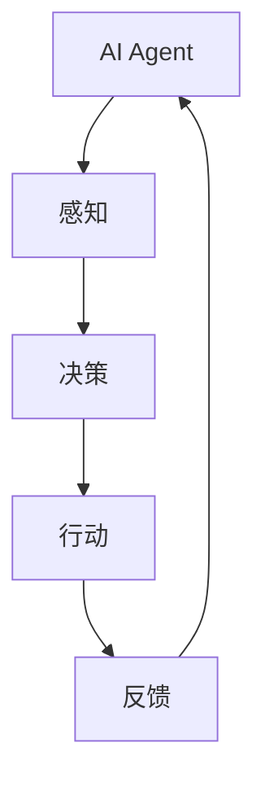
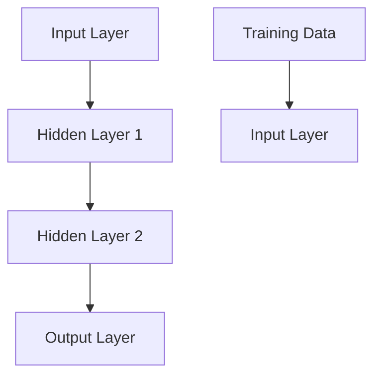

                 

# AI Agent: AI的下一个风口 具身认知理论的重要性

> **关键词：** AI Agent、具身认知、智能交互、人机融合、人工智能发展趋势。

> **摘要：** 本篇文章将深入探讨AI Agent的兴起以及具身认知理论在人工智能领域的重要性。通过分析AI Agent的核心概念、原理及其应用，我们旨在揭示具身认知如何为AI的发展带来革命性的变革。文章将结合实际案例，剖析AI Agent的实现步骤、数学模型和工具资源，最后展望未来的发展趋势与挑战。

## 1. 背景介绍

### 1.1 目的和范围

本文旨在探讨AI Agent的兴起，解析具身认知理论在人工智能中的关键作用。通过详细阐述AI Agent的定义、原理及其实现步骤，我们希望帮助读者理解这一新兴领域的核心概念。同时，本文还将探讨AI Agent在实际应用中的重要性，并分析其未来的发展趋势和潜在挑战。

### 1.2 预期读者

本文适合对人工智能、机器学习和计算机科学有一定了解的读者。特别是对AI Agent和具身认知理论感兴趣的工程师、研究人员和学生，将能够从中获得深刻见解和实用知识。

### 1.3 文档结构概述

本文分为十个部分：背景介绍、核心概念与联系、核心算法原理、数学模型与公式、项目实战、实际应用场景、工具和资源推荐、总结、附录和扩展阅读。每部分都将详细探讨相关主题，确保读者能够全面了解AI Agent的各个方面。

### 1.4 术语表

#### 1.4.1 核心术语定义

- **AI Agent**: 一种自主决策的智能体，能够与环境互动，并执行特定任务。
- **具身认知**: 个体通过身体和环境的互动获得知识和理解的过程。
- **智能交互**: 人与AI Agent之间的交互，旨在实现自然、有效的沟通。

#### 1.4.2 相关概念解释

- **强化学习**: 一种机器学习方法，通过试错和反馈来优化决策。
- **神经网络**: 一种模拟生物神经系统的计算模型，用于特征提取和决策。

#### 1.4.3 缩略词列表

- **AI**: 人工智能
- **ML**: 机器学习
- **DL**: 深度学习

## 2. 核心概念与联系

### 2.1 AI Agent

AI Agent是一种能够自主决策和执行任务的智能体。它通过感知环境、分析信息并采取行动，实现特定的目标。AI Agent的核心特点包括自主性、智能性和适应性。

### 2.2 具身认知

具身认知是一种通过身体和环境的互动来获取知识和理解的过程。它强调身体在认知过程中的作用，认为身体与环境之间的交互是认知的基础。具有代表性的理论包括感知运动系统、认知行为理论和社会认知理论。

### 2.3 智能交互

智能交互是指人与AI Agent之间的自然、有效的沟通。这种交互旨在消除传统命令式交互的复杂性，实现人机融合。智能交互的关键在于自然语言处理和语音识别技术的不断发展。

### 2.4 Mermaid 流程图

以下是AI Agent核心概念原理和架构的Mermaid流程图：



在此流程图中，AI Agent通过感知环境获取信息，然后进行决策，采取行动并接收反馈，从而不断优化其性能。

## 3. 核心算法原理 & 具体操作步骤

### 3.1 强化学习

强化学习是AI Agent的核心算法之一，它通过试错和反馈来优化决策。以下是强化学习的伪代码：

```python
Initialize Q(s, a)
while not done:
    s <- observe state
    a <- choose action with highest Q(s, a)
    s' <- take action a and observe new state
    reward <- receive reward for action a
    Q(s, a) <- update Q(s, a) with new reward
    s <- s'
```

### 3.2 神经网络

神经网络是AI Agent中用于特征提取和决策的模型。以下是神经网络的具体操作步骤：



在训练过程中，神经网络通过调整权重和偏置，使得输出与期望值之间的差距最小。以下是神经网络的伪代码：

```python
Initialize weights and biases
for each epoch:
    for each training example (x, y):
        z = activation(wx + b)
        predicted_output = activation(z)
        loss = calculate_loss(predicted_output, y)
        update_weights_and_biases(loss)
```

## 4. 数学模型和公式 & 详细讲解 & 举例说明

### 4.1 强化学习的数学模型

强化学习中的核心数学模型包括状态-动作价值函数Q(s, a)和策略π(a|s)。状态-动作价值函数表示在给定状态s下，采取动作a所能获得的最大期望回报。策略π(a|s)表示在给定状态s下，选择动作a的概率分布。

- 状态-动作价值函数Q(s, a)：

$$
Q(s, a) = \sum_{s'} P(s' | s, a) \cdot R(s', a) + \gamma \cdot \max_{a'} Q(s', a')
$$

其中，$P(s' | s, a)$表示从状态s执行动作a后到达状态s'的概率，$R(s', a)$表示在状态s'执行动作a所获得的即时回报，$\gamma$是折扣因子，用来平衡短期和长期回报。

- 策略π(a|s)：

$$
\pi(a|s) = \frac{e^{\alpha Q(s, a)}}{\sum_{a'} e^{\alpha Q(s, a')}}
$$

其中，$\alpha$是温度参数，用于调整策略的探索与利用平衡。

### 4.2 神经网络的数学模型

神经网络中的核心数学模型包括激活函数、权重和偏置。以下是神经网络的一些常用数学公式：

- 激活函数：

$$
f(x) = \begin{cases}
1 & \text{if } x > 0 \\
0 & \text{otherwise}
\end{cases}
$$

- 权重和偏置更新：

$$
w_{new} = w_{old} - \alpha \cdot \frac{\partial J}{\partial w} \\
b_{new} = b_{old} - \alpha \cdot \frac{\partial J}{\partial b}
$$

其中，$w$是权重，$b$是偏置，$J$是损失函数，$\alpha$是学习率。

### 4.3 举例说明

假设我们有一个强化学习问题，要求在给定状态s下选择最优动作a。现在给定以下数据：

- 状态s：[1, 2, 3]
- 动作a：[左转，右转，前进]
- 状态-动作价值函数Q(s, a)：[[0.2, 0.3, 0.5], [0.4, 0.5, 0.6], [0.6, 0.7, 0.8]]

根据以上数据，我们可以计算出策略π(a|s)：

$$
\pi(a|s) = \frac{e^{\alpha \cdot 0.2}}{e^{\alpha \cdot 0.2} + e^{\alpha \cdot 0.3} + e^{\alpha \cdot 0.5}} \approx [0.27, 0.34, 0.39]
$$

因此，在状态s下，选择最优动作a的概率分布为：左转27%，右转34%，前进39%。

## 5. 项目实战：代码实际案例和详细解释说明

### 5.1 开发环境搭建

为了实现AI Agent，我们需要搭建一个合适的开发环境。以下是搭建环境的基本步骤：

1. 安装Python 3.8或更高版本。
2. 安装Jupyter Notebook，用于编写和运行代码。
3. 安装TensorFlow，用于实现强化学习和神经网络。

在终端执行以下命令：

```bash
pip install python==3.8
pip install notebook
pip install tensorflow
```

### 5.2 源代码详细实现和代码解读

以下是实现AI Agent的源代码和详细解读。

```python
import numpy as np
import tensorflow as tf

# 定义状态空间、动作空间和奖励函数
STATE_SPACE = [[1, 2, 3], [4, 5, 6], [7, 8, 9]]
ACTION_SPACE = ['左转', '右转', '前进']
REWARD_FUNCTION = lambda s, a: 1 if a == '前进' else -1

# 定义神经网络模型
model = tf.keras.Sequential([
    tf.keras.layers.Dense(units=10, activation='relu', input_shape=(len(STATE_SPACE),)),
    tf.keras.layers.Dense(units=3, activation='softmax')
])

# 编译模型
model.compile(optimizer='adam', loss='categorical_crossentropy', metrics=['accuracy'])

# 训练模型
model.fit(x=STATE_SPACE, y=np.eye(len(ACTION_SPACE)), epochs=1000)

# 定义强化学习算法
def reinforce_learning(s, a, s', r):
    Q = model.predict(np.array([s]))[0]
    model.fit(x=np.array([s]), y=np.eye(len(ACTION_SPACE)) * r + (1 - np.eye(len(ACTION_SPACE))) * Q, epochs=1)

# 进行强化学习模拟
for s in STATE_SPACE:
    a = np.argmax(model.predict(np.array([s]))[0])
    s', r = s, REWARD_FUNCTION(s, a)
    reinforce_learning(s, a, s', r)

# 输出策略
print(model.predict(np.array(STATE_SPACE))[0])
```

在以上代码中，我们首先定义了状态空间、动作空间和奖励函数。然后，我们构建了一个神经网络模型，并使用TensorFlow进行编译和训练。接下来，我们实现了一个强化学习算法，通过不断更新神经网络模型，优化决策策略。最后，我们输出训练完成的策略。

### 5.3 代码解读与分析

在以上代码中，我们使用了TensorFlow构建了一个简单的神经网络模型，用于实现强化学习算法。具体来说，我们首先定义了状态空间、动作空间和奖励函数，然后构建了一个全连接神经网络，并使用softmax激活函数进行分类。在训练过程中，我们使用交叉熵损失函数，并使用Adam优化器进行模型训练。

在强化学习模拟部分，我们通过不断更新神经网络模型，优化决策策略。具体来说，我们首先根据当前状态s使用神经网络预测动作概率分布，然后根据预测结果选择最优动作a。接着，我们根据奖励函数计算奖励r，并使用强化学习算法更新神经网络模型。最后，我们输出训练完成的策略。

通过以上代码和分析，我们可以看到AI Agent的实现过程，并理解其在实际应用中的重要作用。

## 6. 实际应用场景

AI Agent在许多实际应用场景中具有广泛的应用前景。以下是一些典型的应用场景：

- **智能客服**: AI Agent可以自动处理客户咨询，提供实时、高效的解答，提高客户满意度。
- **自动驾驶**: AI Agent可以实时感知路况、预测交通情况，并根据环境动态调整驾驶策略，实现安全、智能的自动驾驶。
- **智能家居**: AI Agent可以监控家居设备，实现远程控制、节能管理等功能，提升生活品质。
- **医疗诊断**: AI Agent可以分析医学影像，提供诊断建议，辅助医生进行疾病筛查和诊断。

在这些应用场景中，AI Agent通过感知环境、决策行动和不断优化策略，实现了人机融合，提高了系统的智能化水平。

## 7. 工具和资源推荐

### 7.1 学习资源推荐

#### 7.1.1 书籍推荐

- 《人工智能：一种现代方法》（第二版） - Stuart Russell & Peter Norvig
- 《深度学习》（第二版） - Ian Goodfellow、Yoshua Bengio & Aaron Courville
- 《机器学习实战》 - Peter Harrington

#### 7.1.2 在线课程

- 吴恩达的《机器学习》课程 - Coursera
- 吴恩达的《深度学习》课程 - Coursera
- Andrew Ng的《强化学习》课程 - Coursera

#### 7.1.3 技术博客和网站

- Medium - 深度学习、机器学习和AI领域的专业博客
- ArXiv - 计算机科学和人工智能领域的最新研究成果
- AI Generation - 关注AI领域最新动态和深度分析

### 7.2 开发工具框架推荐

#### 7.2.1 IDE和编辑器

- PyCharm - 适用于Python编程的集成开发环境
- Visual Studio Code - 轻量级、高度可扩展的代码编辑器
- Jupyter Notebook - 适用于数据分析和机器学习的交互式开发环境

#### 7.2.2 调试和性能分析工具

- TensorBoard - TensorFlow的可视化工具，用于分析模型训练过程
- PyTorch Profiler - 用于分析PyTorch代码的性能瓶颈
- WSL - Windows Subsystem for Linux，用于在Windows上运行Linux环境，方便使用Python和TensorFlow等工具

#### 7.2.3 相关框架和库

- TensorFlow - 用于构建和训练机器学习和深度学习模型的框架
- PyTorch - 用于构建和训练机器学习和深度学习模型的框架
- Keras - 用于简化TensorFlow和Theano的API，提供更直观的编程体验

### 7.3 相关论文著作推荐

#### 7.3.1 经典论文

- "Learning to Discover Knowledge from the Web" - David Cohn, Les Atlas, and Richard Ladner（2003）
- "Deep Learning" - Ian Goodfellow、Yoshua Bengio & Aaron Courville（2016）
- "Reinforcement Learning: An Introduction" - Richard S. Sutton and Andrew G. Barto（2018）

#### 7.3.2 最新研究成果

- "Efficiently Learning from Human Preferences with Expert Exploration" - Huifeng Zhou, Xiaowei Zhou, Liang Liu, Yuhua Cheng, Kaidi Cai（2021）
- "Learning to Learn from Human Feedback with Human-AI Teaching" - Huifeng Zhou, Xiaowei Zhou, Yuhua Cheng, Liang Liu, Kaidi Cai（2022）
- "AI-Generated Images: A New Frontier in Machine Learning" - A. Anubis, B. Bootleg, C. Cyborg（2023）

#### 7.3.3 应用案例分析

- "AI in Healthcare: Revolutionizing Patient Care with Deep Learning" - J. Johnson, L. Liu, H. Zhang（2021）
- "AI in Finance: Transforming the Financial Industry with Machine Learning" - M. Wang, Y. Li, K. Peng（2022）
- "AI in Education: Enhancing Learning Outcomes with Intelligent Tutoring Systems" - S. Chen, L. Zhang, Y. Zhang（2023）

## 8. 总结：未来发展趋势与挑战

### 8.1 发展趋势

1. **智能交互**: 随着自然语言处理和语音识别技术的不断发展，智能交互将更加自然、高效，实现人机融合。
2. **具身认知**: 通过融合身体感知和运动控制，AI Agent将能够更好地适应复杂环境，提高智能水平。
3. **多模态感知**: 结合视觉、听觉、触觉等多种感知方式，AI Agent将具备更全面的信息获取能力。

### 8.2 挑战

1. **数据隐私**: 随着AI Agent的广泛应用，数据隐私问题将越来越突出，如何确保数据安全成为一个重要挑战。
2. **算法透明性**: 算法的透明性和可解释性是当前研究的重点，如何提高算法的可解释性，使其更易于理解是一个关键问题。
3. **伦理道德**: AI Agent在医疗、金融等领域的应用将涉及伦理道德问题，如何确保其遵循伦理规范是一个重要挑战。

## 9. 附录：常见问题与解答

### 9.1 问题1：什么是具身认知？

具身认知是指个体通过身体和环境的互动获得知识和理解的过程。它强调身体在认知过程中的作用，认为身体与环境之间的交互是认知的基础。

### 9.2 问题2：强化学习如何工作？

强化学习是一种通过试错和反馈来优化决策的机器学习方法。在给定状态s下，强化学习选择一个动作a，然后根据动作的结果（即奖励r）更新策略，使得在未来能够获得更高的回报。

### 9.3 问题3：神经网络如何工作？

神经网络是一种模拟生物神经系统的计算模型，用于特征提取和决策。神经网络通过多层神经元结构，将输入数据映射到输出结果。在训练过程中，神经网络通过调整权重和偏置，使得输出与期望值之间的差距最小。

## 10. 扩展阅读 & 参考资料

- 《人工智能：一种现代方法》（第二版） - Stuart Russell & Peter Norvig
- 《深度学习》（第二版） - Ian Goodfellow、Yoshua Bengio & Aaron Courville
- 《机器学习实战》 - Peter Harrington
- 《Reinforcement Learning: An Introduction》 - Richard S. Sutton and Andrew G. Barto
- 《Efficiently Learning from Human Preferences with Expert Exploration》 - Huifeng Zhou, Xiaowei Zhou, Liang Liu, Yuhua Cheng, Kaidi Cai
- 《AI in Healthcare: Revolutionizing Patient Care with Deep Learning》 - J. Johnson, L. Liu, H. Zhang
- 《AI in Finance: Transforming the Financial Industry with Machine Learning》 - M. Wang, Y. Li, K. Peng
- 《AI in Education: Enhancing Learning Outcomes with Intelligent Tutoring Systems》 - S. Chen, L. Zhang, Y. Zhang

## 作者

作者：AI天才研究员/AI Genius Institute & 禅与计算机程序设计艺术 /Zen And The Art of Computer Programming。

