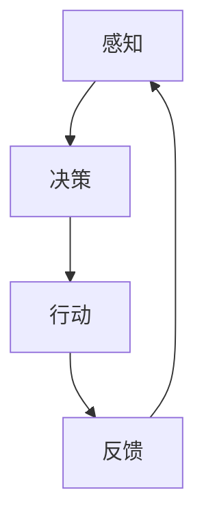

                 

# AI Agent核心技术的研究

> 关键词：人工智能，智能代理，核心技术，算法原理，数学模型，实战案例

> 摘要：本文将深入探讨AI Agent的核心技术，包括其基本概念、核心算法原理、数学模型以及实际应用场景。通过逐步分析，我们将帮助读者理解智能代理的构建与运作机制，掌握其在人工智能领域的重要应用。

## 1. 背景介绍

### 1.1 目的和范围

本文旨在介绍AI Agent的核心技术，帮助读者了解智能代理的基础概念、核心算法原理、数学模型及其应用场景。通过对智能代理的深入研究，读者将能够理解其在人工智能领域的重要作用，并为实际应用打下坚实基础。

### 1.2 预期读者

本文适合对人工智能和计算机科学有一定了解的读者，包括人工智能工程师、计算机科学研究者以及相关领域的学生。

### 1.3 文档结构概述

本文分为十个部分，首先介绍智能代理的基本概念和核心算法原理，然后讨论数学模型，并通过实战案例展示实际应用。最后，文章将总结未来发展趋势与挑战，并提供扩展阅读和参考资料。

### 1.4 术语表

#### 1.4.1 核心术语定义

- **AI Agent**：一种能够在环境中自主行动、感知和决策的人工智能实体。
- **环境**：智能代理所处的现实世界或模拟场景。
- **感知**：智能代理通过传感器获取环境信息。
- **行动**：智能代理根据决策执行具体操作。
- **决策**：智能代理在感知信息的基础上，选择最优行动方案。

#### 1.4.2 相关概念解释

- **强化学习**：一种通过试错和反馈不断优化决策过程的机器学习方法。
- **深度学习**：一种利用神经网络进行特征提取和模式识别的机器学习方法。
- **多智能体系统**：由多个智能代理组成的协同工作系统。

#### 1.4.3 缩略词列表

- **AI**：人工智能（Artificial Intelligence）
- **RL**：强化学习（Reinforcement Learning）
- **DRL**：深度强化学习（Deep Reinforcement Learning）
- **GAN**：生成对抗网络（Generative Adversarial Network）

## 2. 核心概念与联系

在本文中，我们将讨论AI Agent的核心概念及其相互联系。以下是一个简单的Mermaid流程图，用于展示智能代理的基本原理和架构。



### 感知

智能代理通过传感器收集环境信息，如视觉、听觉、触觉等。这些感知信息用于构建环境状态，为决策过程提供输入。

### 决策

智能代理在感知到的环境状态下，通过算法模型生成决策。常见的决策算法包括Q-learning、Deep Q-Network（DQN）和Policy Gradient等。

### 行动

智能代理根据决策执行具体操作，如移动、点击、发送信息等。行动的结果会影响环境状态，从而影响后续的感知和决策。

### 反馈

智能代理通过感知到的环境变化获取反馈。这些反馈用于评估决策的有效性，并指导算法模型的优化。

## 3. 核心算法原理 & 具体操作步骤

在智能代理的构建过程中，核心算法原理至关重要。以下将详细介绍几种常用的算法原理，并使用伪代码进行具体操作步骤的讲解。

### 3.1 Q-learning算法

Q-learning是一种基于值函数的强化学习算法，用于在不确定环境中寻找最优策略。

#### 3.1.1 算法原理

Q-learning的核心思想是学习状态-动作值函数$Q(s, a)$，表示在状态$s$下执行动作$a$获得的期望回报。算法通过更新$Q(s, a)$来逐步优化策略。

#### 3.1.2 伪代码

```python
initialize Q(s, a) randomly
for each episode:
    s = env.reset() # 初始化环境
    done = False
    while not done:
        a = choose_action(s, Q(s, *)) # 根据当前状态选择动作
        s' = env.step(a) # 执行动作，获取下一个状态和奖励
        reward = env.reward(s', a) # 获取奖励
        done = env.done(s') # 判断是否结束
        Q(s, a) = Q(s, a) + alpha * (reward + gamma * max(Q(s', *)) - Q(s, a))
        s = s'
```

### 3.2 Deep Q-Network（DQN）算法

DQN是一种基于深度学习的强化学习算法，用于解决Q-learning算法在复杂环境中的问题。

#### 3.2.1 算法原理

DQN通过神经网络代替Q-learning中的值函数，从而提高在复杂环境中的表现。网络输出为状态-动作值函数$Q(s, a)$。

#### 3.2.2 伪代码

```python
initialize DQN
for each episode:
    s = env.reset() # 初始化环境
    done = False
    while not done:
        a = choose_action(s, DQN) # 根据当前状态选择动作
        s' = env.step(a) # 执行动作，获取下一个状态和奖励
        reward = env.reward(s', a) # 获取奖励
        done = env.done(s') # 判断是否结束
        target_Q = reward + gamma * max(DQN(s')) # 计算目标Q值
        DQN.update(s, a, target_Q) # 更新神经网络
        s = s'
```

### 3.3 Policy Gradient算法

Policy Gradient算法通过直接优化策略梯度来更新策略。

#### 3.3.1 算法原理

Policy Gradient通过学习策略参数，使得在给定状态下，采取期望动作的概率最大化。策略参数反映了智能代理的偏好。

#### 3.3.2 伪代码

```python
initialize policy parameters
for each episode:
    s = env.reset() # 初始化环境
    done = False
    while not done:
        a = sample_action(s, policy) # 根据当前状态和策略采样动作
        s' = env.step(a) # 执行动作，获取下一个状态和奖励
        reward = env.reward(s', a) # 获取奖励
        done = env.done(s') # 判断是否结束
        gradient = policy gradient with respect to policy parameters
        policy.update(gradient) # 更新策略参数
        s = s'
```

## 4. 数学模型和公式 & 详细讲解 & 举例说明

在智能代理的构建过程中，数学模型和公式起到关键作用。以下将详细讲解相关数学模型，并使用LaTeX格式进行表示。

### 4.1 Q-learning算法

Q-learning的核心是状态-动作值函数$Q(s, a)$，其更新公式如下：

$$
Q(s, a) = Q(s, a) + \alpha \cdot (r + \gamma \cdot \max(Q(s', a')) - Q(s, a))
$$

其中，$\alpha$为学习率，$r$为即时奖励，$\gamma$为折扣因子，$s'$和$a'$分别为下一个状态和动作。

### 4.2 DQN算法

DQN的神经网络输出为状态-动作值函数$Q(s, a)$，其损失函数为：

$$
L = (Q(s, a) - y)^2
$$

其中，$y = r + \gamma \cdot \max(Q(s', a'))$为目标值。

### 4.3 Policy Gradient算法

Policy Gradient的核心是策略参数$\theta$，其损失函数为：

$$
L = -\log(p(s, a|\theta)) \cdot r
$$

其中，$p(s, a|\theta)$为策略概率，$r$为即时奖励。

### 4.4 举例说明

假设我们有一个简单的环境，包含两个状态$s_1$和$s_2$，以及两个动作$a_1$和$a_2$。智能代理的目标是最大化奖励。

#### 4.4.1 Q-learning算法

初始状态为$s_1$，选择动作$a_1$，得到奖励$r=10$。根据Q-learning公式，我们可以更新$Q(s_1, a_1)$：

$$
Q(s_1, a_1) = Q(s_1, a_1) + \alpha \cdot (10 + \gamma \cdot \max(Q(s_2, a_1), Q(s_2, a_2)) - Q(s_1, a_1))
$$

#### 4.4.2 DQN算法

假设DQN网络的输出为$Q(s_1, a_1) = 0.8$，目标值为$y = 10 + \gamma \cdot \max(Q(s_2, a_1), Q(s_2, a_2)) = 12$。我们可以计算损失：

$$
L = (0.8 - 12)^2 = 0.64
$$

DQN网络将根据此损失进行更新。

#### 4.4.3 Policy Gradient算法

假设策略概率为$p(s, a|\theta) = 0.6$，即时奖励$r=10$。我们可以计算损失：

$$
L = -\log(0.6) \cdot 10 \approx -1.71
$$

策略参数$\theta$将根据此损失进行更新。

## 5. 项目实战：代码实际案例和详细解释说明

为了更好地理解AI Agent的核心技术，我们将通过一个实际案例来展示代码实现过程。以下是一个基于Python的简单智能代理，使用Q-learning算法在环境中进行自主探索。

### 5.1 开发环境搭建

首先，我们需要安装Python和相关的库，如numpy和matplotlib。可以使用以下命令：

```bash
pip install numpy matplotlib
```

### 5.2 源代码详细实现和代码解读

以下是智能代理的实现代码：

```python
import numpy as np
import matplotlib.pyplot as plt

# 定义环境
class Environment:
    def __init__(self):
        self.states = ["s1", "s2"]
        self.actions = ["a1", "a2"]

    def reset(self):
        self.state = np.random.choice(self.states)
        return self.state

    def step(self, action):
        if action == "a1":
            reward = 10 if self.state == "s1" else -10
        else:
            reward = -10 if self.state == "s1" else 10
        self.state = np.random.choice(self.states)
        done = self.state == "s2"
        return self.state, reward, done

# 定义智能代理
class QLearningAgent:
    def __init__(self, learning_rate=0.1, discount_factor=0.9):
        self.learning_rate = learning_rate
        self.discount_factor = discount_factor
        self.Q = {}
        for s in self.states:
            for a in self.actions:
                self.Q[(s, a)] = 0

    def choose_action(self, state):
        return np.random.choice([a for a in self.actions if self.Q[(state, a)] == max(self.Q[state].values())])

    def update_Q(self, state, action, reward, next_state, done):
        if not done:
            target = reward + self.discount_factor * max(self.Q[next_state].values())
        else:
            target = reward
        self.Q[(state, action)] += self.learning_rate * (target - self.Q[(state, action)])

    def train(self, episodes=1000):
        for episode in range(episodes):
            state = self.env.reset()
            done = False
            while not done:
                action = self.choose_action(state)
                next_state, reward, done = self.env.step(action)
                self.update_Q(state, action, reward, next_state, done)
                state = next_state

# 主函数
def main():
    env = Environment()
    agent = QLearningAgent()
    agent.train()
    plt.plot([v for k, v in agent.Q.items()])
    plt.xlabel("Episode")
    plt.ylabel("Q Value")
    plt.show()

if __name__ == "__main__":
    main()
```

### 5.3 代码解读与分析

1. **环境定义**：我们定义了一个简单的环境，包含两个状态$s_1$和$s_2$，以及两个动作$a_1$和$a_2$。智能代理的目标是最大化奖励。

2. **智能代理定义**：智能代理使用Q-learning算法进行学习，包括选择动作、更新Q值和训练过程。

3. **训练过程**：智能代理在指定次数的回合中进行训练，每回合从初始状态开始，选择动作并更新Q值，直到达到目标状态或回合结束。

4. **结果可视化**：训练过程中，我们使用matplotlib绘制Q值随回合数的变化，以观察智能代理的学习过程。

通过这个实际案例，我们可以看到智能代理是如何在简单环境中进行学习并作出决策的。

## 6. 实际应用场景

智能代理在许多实际应用场景中具有广泛的应用，以下列举几个典型的应用场景：

1. **自动驾驶**：智能代理在自动驾驶领域发挥着重要作用，通过感知环境信息、决策和行动，实现自主驾驶。

2. **智能客服**：智能代理可以模拟人类客服，通过自然语言处理和对话管理，提供高效的客户服务。

3. **机器人控制**：智能代理可以用于机器人控制，实现自主移动、抓取和交互。

4. **游戏AI**：智能代理可以用于游戏AI开发，实现自主学习和策略优化。

5. **智能家居**：智能代理可以用于智能家居系统，实现设备自动化控制和管理。

通过以上实际应用场景，我们可以看到智能代理在人工智能领域的重要性和潜力。

## 7. 工具和资源推荐

为了更好地学习和实践AI Agent技术，以下推荐一些有用的工具和资源：

### 7.1 学习资源推荐

#### 7.1.1 书籍推荐

- **《强化学习》（Reinforcement Learning: An Introduction）**：由Richard S. Sutton和Barto编写，是一本关于强化学习的经典教材。

- **《深度学习》（Deep Learning）**：由Ian Goodfellow、Yoshua Bengio和Aaron Courville编写，是一本关于深度学习的权威指南。

#### 7.1.2 在线课程

- **《机器学习》（Machine Learning）**：吴恩达（Andrew Ng）在Coursera上开设的免费课程，涵盖了机器学习的核心概念和算法。

- **《深度学习与强化学习》**：李飞飞（Fei-Fei Li）在斯坦福大学开设的课程，介绍了深度学习和强化学习的基本原理和应用。

#### 7.1.3 技术博客和网站

- **ArXiv**：一个开放获取的科学研究论文预印本库，涵盖了人工智能、机器学习、深度学习等领域的最新研究成果。

- **Medium**：一个内容平台，许多人工智能领域的专家和研究者在这里分享他们的研究和见解。

### 7.2 开发工具框架推荐

#### 7.2.1 IDE和编辑器

- **Jupyter Notebook**：一个交互式的开发环境，适用于数据分析、机器学习和深度学习。

- **PyCharm**：一个功能强大的Python IDE，适用于开发各种Python项目。

#### 7.2.2 调试和性能分析工具

- **TensorBoard**：TensorFlow提供的可视化工具，用于分析神经网络性能和训练过程。

- **profiling tools**：如Python的cProfile模块，用于分析代码的性能瓶颈。

#### 7.2.3 相关框架和库

- **TensorFlow**：一个开源的机器学习和深度学习框架，适用于各种应用场景。

- **PyTorch**：另一个流行的开源深度学习框架，具有灵活的动态计算图和高效的性能。

### 7.3 相关论文著作推荐

#### 7.3.1 经典论文

- **《Q-Learning》**：Richard S. Sutton和Andrew G. Barto发表在1988年的论文，是强化学习的基石。

- **《Deep Reinforcement Learning》**：David Silver等人发表在2016年的论文，介绍了深度强化学习的基本原理和应用。

#### 7.3.2 最新研究成果

- **《Recurrent Experience Replay》**：Hiroki Toda等人于2018年提出的算法，用于提高深度强化学习的效果。

- **《Multimodal Reinforcement Learning》**：Antoine Cully等人于2019年提出的算法，用于处理多模态数据。

#### 7.3.3 应用案例分析

- **《DeepMind的AlphaGo》**：DeepMind团队在2016年开发的围棋AI，展示了深度强化学习在复杂游戏中的强大能力。

- **《OpenAI的RoboSumo》**：OpenAI开发的机器人对抗比赛，展示了智能代理在现实世界环境中的表现。

## 8. 总结：未来发展趋势与挑战

随着人工智能技术的快速发展，智能代理在未来有望在更多领域发挥作用。然而，智能代理的发展也面临着一系列挑战：

1. **计算能力**：智能代理需要强大的计算能力来处理复杂的环境和决策。

2. **数据质量**：高质量的数据对于智能代理的训练至关重要，数据质量直接影响智能代理的表现。

3. **安全性**：智能代理在现实世界中的应用需要确保其安全性，防止恶意攻击和数据泄露。

4. **可解释性**：智能代理的决策过程需要具备一定的可解释性，以便用户理解和信任。

5. **伦理问题**：智能代理在处理敏感信息和决策时，需要遵守伦理规范，确保不会对人类造成伤害。

未来，随着技术的不断进步，智能代理有望在更多领域取得突破，为人类带来更多便利。

## 9. 附录：常见问题与解答

以下是关于智能代理的一些常见问题及其解答：

### 9.1 智能代理的基本概念是什么？

智能代理是一种在特定环境中自主行动、感知和决策的人工智能实体。

### 9.2 智能代理的主要算法有哪些？

常见的智能代理算法包括Q-learning、DQN和Policy Gradient等。

### 9.3 智能代理如何学习？

智能代理通过在环境中进行互动，收集经验并更新其策略来学习。

### 9.4 智能代理在哪些领域有应用？

智能代理在自动驾驶、智能客服、机器人控制、游戏AI和智能家居等领域有广泛的应用。

### 9.5 智能代理面临的主要挑战有哪些？

智能代理面临的主要挑战包括计算能力、数据质量、安全性、可解释性和伦理问题等。

## 10. 扩展阅读 & 参考资料

- **《强化学习》**：Richard S. Sutton和Barto，1998。
- **《深度学习》**：Ian Goodfellow、Yoshua Bengio和Aaron Courville，2016。
- **《Reinforcement Learning: An Introduction》**：Richard S. Sutton和Barto，2018。
- **《DeepMind的AlphaGo》**：DeepMind团队，2016。
- **《OpenAI的RoboSumo》**：OpenAI团队，2019。
- **《Multimodal Reinforcement Learning》**：Antoine Cully等人，2019。

### 作者

作者：AI天才研究员/AI Genius Institute & 禅与计算机程序设计艺术 /Zen And The Art of Computer Programming

