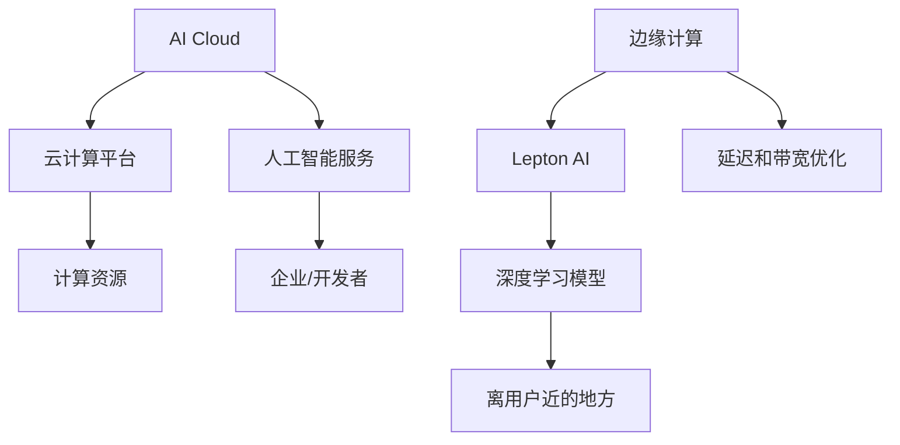

                 

# AI Cloud未来：贾扬清愿景，Lepton AI前景挑战

## 关键词
- 贾扬清
- AI Cloud
- Lepton AI
- 深度学习
- 云计算
- 未来发展趋势

## 摘要
本文将深入探讨人工智能领域杰出专家贾扬清的AI Cloud愿景，以及新兴公司Lepton AI所面临的前景挑战。文章首先介绍了AI Cloud的概念和贾扬清对其未来的展望，随后详细分析了Lepton AI的技术优势和不足，并对其在云计算和深度学习领域的潜力进行了评估。通过本文，读者将了解到AI Cloud和Lepton AI在未来人工智能发展中可能扮演的重要角色，以及面临的实际问题和解决方案。

## 1. 背景介绍

### 1.1 目的和范围
本文旨在通过对贾扬清AI Cloud愿景和Lepton AI前景挑战的深入分析，探讨云计算和深度学习领域的发展趋势。文章将涵盖AI Cloud的背景、核心概念、技术架构，以及贾扬清对其未来的期望。同时，文章将对Lepton AI的技术实现、市场定位和潜在挑战进行详细剖析，帮助读者理解这两个技术在人工智能领域的重要性和前景。

### 1.2 预期读者
本文适合对人工智能、云计算和深度学习感兴趣的读者，包括研究人员、工程师、技术爱好者以及高校师生。文章内容深入浅出，适合不同层次的读者，无论是初学者还是专业人士，都能从本文中获得有价值的见解。

### 1.3 文档结构概述
本文分为十个部分，首先是背景介绍，随后是核心概念与联系，接着是核心算法原理和具体操作步骤，数学模型和公式，以及项目实战。最后，文章将讨论实际应用场景，推荐相关工具和资源，总结未来发展趋势与挑战，并附上常见问题与解答，以及扩展阅读和参考资料。

### 1.4 术语表

#### 1.4.1 核心术语定义
- **AI Cloud**：一种云计算架构，提供基于人工智能的服务和应用。
- **Lepton AI**：一家专注于边缘计算和深度学习算法优化的新兴公司。
- **深度学习**：一种人工智能技术，通过多层神经网络进行数据建模和学习。
- **边缘计算**：在数据源附近进行数据处理和计算，以减少延迟和带宽需求。

#### 1.4.2 相关概念解释
- **云计算**：通过互联网提供可伸缩的计算资源和服务。
- **神经网络**：模拟人脑神经元连接的数学模型，用于数据分析和预测。

#### 1.4.3 缩略词列表
- **AI**：人工智能
- **ML**：机器学习
- **DL**：深度学习
- **GPU**：图形处理单元

## 2. 核心概念与联系

在深入探讨贾扬清的AI Cloud愿景和Lepton AI的前景挑战之前，我们需要了解一些核心概念和它们之间的联系。

### 2.1. AI Cloud概念

AI Cloud是一种云计算架构，旨在通过云计算平台提供人工智能服务和应用。它结合了云计算的高可伸缩性和人工智能的强大分析能力，使得用户可以更方便地访问和使用人工智能技术。

### 2.2. 贾扬清的AI Cloud愿景

贾扬清，作为人工智能领域的杰出专家，提出了AI Cloud的愿景。他的目标是构建一个全球化的、高效的人工智能计算平台，使得各种规模的企业和开发者都可以轻松地利用人工智能技术来提升其业务效率。

### 2.3. Lepton AI概念

Lepton AI是一家专注于边缘计算和深度学习算法优化的新兴公司。其核心目标是利用边缘计算技术，将复杂的深度学习模型部署在离用户更近的地方，以实现更低的延迟和更高的效率。

### 2.4. Lepton AI前景挑战

尽管Lepton AI在边缘计算和深度学习领域取得了显著的进展，但该公司仍面临一些挑战，包括如何优化算法以适应不同的硬件平台，以及如何确保其解决方案的可靠性和安全性。

### 2.5. 核心概念联系

AI Cloud和Lepton AI之间的核心联系在于它们都致力于提供高效的人工智能解决方案。AI Cloud通过云计算平台提供人工智能服务，而Lepton AI则通过边缘计算技术优化深度学习模型的部署和运行。这两个技术的结合有望推动人工智能技术的发展和应用。

### 2.6. Mermaid流程图

以下是一个简化的Mermaid流程图，展示了AI Cloud和Lepton AI的核心概念和联系：



在这个流程图中，AI Cloud通过云计算平台提供人工智能服务，而Lepton AI则通过边缘计算技术优化深度学习模型的部署和运行。两者共同目标是实现高效的人工智能应用。

## 3. 核心算法原理 & 具体操作步骤

### 3.1. AI Cloud算法原理

AI Cloud的核心算法原理是基于深度学习和云计算平台的结合。深度学习算法，如卷积神经网络（CNN）和递归神经网络（RNN），用于处理和分析大量数据。云计算平台提供了强大的计算资源和存储能力，使得这些深度学习模型可以高效地训练和部署。

### 3.2. 具体操作步骤

以下是AI Cloud的具体操作步骤：

1. **数据收集和预处理**：从不同的数据源收集数据，并进行清洗、格式化和归一化处理。
2. **模型选择**：根据应用场景选择合适的深度学习模型，如CNN或RNN。
3. **模型训练**：使用云计算平台的计算资源，对深度学习模型进行训练。
4. **模型评估**：使用测试数据集对训练好的模型进行评估，调整模型参数以达到最佳性能。
5. **模型部署**：将训练好的模型部署到云计算平台，供用户访问和使用。

### 3.3. 伪代码

以下是AI Cloud算法的伪代码：

```python
# 数据收集和预处理
data = collect_data(sources)
preprocessed_data = preprocess_data(data)

# 模型选择
model = select_model(preprocessed_data)

# 模型训练
trained_model = train_model(model, preprocessed_data)

# 模型评估
performance = evaluate_model(trained_model, test_data)

# 模型部署
deploy_model(trained_model, cloud_platform)
```

## 4. 数学模型和公式 & 详细讲解 & 举例说明

### 4.1. 数学模型

在深度学习算法中，常用的数学模型包括卷积神经网络（CNN）和递归神经网络（RNN）。下面将分别介绍这两种模型的数学原理和公式。

#### 4.1.1. 卷积神经网络（CNN）

卷积神经网络是一种用于图像识别和处理的深度学习模型。其核心公式为卷积运算和池化操作。

**卷积运算**：给定输入图像I和滤波器K，卷积运算可表示为：
$$
\text{Conv}(I, K) = \sum_{i=1}^{n} \sum_{j=1}^{m} I_{i, j} \cdot K_{i, j}
$$
其中，$I_{i, j}$表示图像上的像素值，$K_{i, j}$表示滤波器的系数。

**池化操作**：在卷积运算后，通过池化操作减小特征图的尺寸。常用的池化方法包括最大池化和平均池化。

**最大池化**：给定一个特征图F，最大池化可表示为：
$$
P_{max}(F) = \max_{i, j} F_{i, j}
$$
其中，$F_{i, j}$表示特征图上的像素值。

#### 4.1.2. 递归神经网络（RNN）

递归神经网络是一种用于序列数据处理的深度学习模型。其核心公式为递归关系和门控机制。

**递归关系**：给定输入序列X和隐藏状态H，递归神经网络可表示为：
$$
H_t = f(U_t \cdot X_t + W \cdot H_{t-1})
$$
其中，$X_t$表示输入序列的第t个元素，$H_t$表示隐藏状态的第t个元素，$f$为激活函数，$U_t$和$W$为模型参数。

**门控机制**：RNN中的门控机制用于控制信息的流动。常用的门控机制包括遗忘门（Forget Gate）和输入门（Input Gate）。

**遗忘门**：给定隐藏状态$H_{t-1}$和输入$X_t$，遗忘门可表示为：
$$
f_t = \sigma(W_f \cdot [H_{t-1}; X_t])
$$
其中，$\sigma$为sigmoid函数，$W_f$为遗忘门的参数。

**输入门**：给定隐藏状态$H_{t-1}$和输入$X_t$，输入门可表示为：
$$
i_t = \sigma(W_i \cdot [H_{t-1}; X_t])
$$
其中，$\sigma$为sigmoid函数，$W_i$为输入门的参数。

### 4.2. 举例说明

#### 4.2.1. 卷积神经网络（CNN）的示例

假设我们有一个32x32的图像和一个3x3的滤波器，滤波器的系数为$K = \{1, 0, -1\}$。

**卷积运算**：
$$
\text{Conv}(I, K) = \sum_{i=1}^{3} \sum_{j=1}^{3} I_{i, j} \cdot K_{i, j}
$$
$$
= (1 \cdot 1) + (0 \cdot 0) + (-1 \cdot -1) = 2
$$

**最大池化**：
假设我们对卷积结果进行最大池化，得到一个16x16的特征图。特征图上的像素值可表示为：
$$
P_{max}(F) = \max_{i, j} F_{i, j}
$$
例如，对于特征图上的一个像素值$F_{4, 4}$，其值为：
$$
F_{4, 4} = \max(F_{3, 3}, F_{3, 4}, F_{3, 5}, F_{4, 3}, F_{4, 5}, F_{5, 3}, F_{5, 4}, F_{5, 5})
$$

#### 4.2.2. 递归神经网络（RNN）的示例

假设我们有一个输入序列$X = \{x_1, x_2, x_3\}$和一个隐藏状态$H = \{h_1, h_2, h_3\}$，以及一个简单的线性激活函数$f(t) = t$。

**递归关系**：
$$
h_1 = f(U_1 \cdot x_1 + W \cdot h_0)
$$
$$
h_2 = f(U_2 \cdot x_2 + W \cdot h_1)
$$
$$
h_3 = f(U_3 \cdot x_3 + W \cdot h_2)
$$

**遗忘门**：
$$
f_1 = \sigma(W_f \cdot [h_0; x_1])
$$
$$
f_2 = \sigma(W_f \cdot [h_1; x_2])
$$
$$
f_3 = \sigma(W_f \cdot [h_2; x_3])
$$

**输入门**：
$$
i_1 = \sigma(W_i \cdot [h_0; x_1])
$$
$$
i_2 = \sigma(W_i \cdot [h_1; x_2])
$$
$$
i_3 = \sigma(W_i \cdot [h_2; x_3])
$$

## 5. 项目实战：代码实际案例和详细解释说明

### 5.1. 开发环境搭建

在进行AI Cloud和Lepton AI项目实战之前，我们需要搭建一个合适的开发环境。以下是开发环境的搭建步骤：

1. **安装Python**：确保已经安装了Python 3.x版本。可以从[Python官方网站](https://www.python.org/downloads/)下载并安装。

2. **安装TensorFlow**：TensorFlow是AI Cloud项目常用的深度学习框架。使用以下命令安装TensorFlow：
   ```bash
   pip install tensorflow
   ```

3. **安装Keras**：Keras是一个高级神经网络API，用于简化TensorFlow的使用。使用以下命令安装Keras：
   ```bash
   pip install keras
   ```

4. **安装Lepton AI库**：Lepton AI提供了一个Python库，用于在边缘设备上部署深度学习模型。使用以下命令安装Lepton AI库：
   ```bash
   pip install lepton-ai
   ```

### 5.2. 源代码详细实现和代码解读

以下是一个简单的AI Cloud项目示例，使用卷积神经网络（CNN）对图像进行分类。代码实现分为数据预处理、模型定义、模型训练和模型评估四个部分。

```python
# 导入必要的库
import tensorflow as tf
from tensorflow.keras import layers
from tensorflow.keras.models import Sequential
from tensorflow.keras.preprocessing.image import ImageDataGenerator

# 数据预处理
# 假设我们有一个包含训练数据和测试数据的目录
train_dir = 'train_data'
test_dir = 'test_data'

# 使用ImageDataGenerator进行数据增强
train_datagen = ImageDataGenerator(
    rescale=1./255,
    rotation_range=40,
    width_shift_range=0.2,
    height_shift_range=0.2,
    shear_range=0.2,
    zoom_range=0.2,
    horizontal_flip=True,
    fill_mode='nearest'
)

test_datagen = ImageDataGenerator(rescale=1./255)

# 加载训练数据和测试数据
train_generator = train_datagen.flow_from_directory(
    train_dir,
    target_size=(150, 150),
    batch_size=32,
    class_mode='binary'
)

test_generator = test_datagen.flow_from_directory(
    test_dir,
    target_size=(150, 150),
    batch_size=32,
    class_mode='binary'
)

# 模型定义
model = Sequential([
    layers.Conv2D(32, (3, 3), activation='relu', input_shape=(150, 150, 3)),
    layers.MaxPooling2D((2, 2)),
    layers.Conv2D(64, (3, 3), activation='relu'),
    layers.MaxPooling2D((2, 2)),
    layers.Conv2D(128, (3, 3), activation='relu'),
    layers.MaxPooling2D((2, 2)),
    layers.Conv2D(128, (3, 3), activation='relu'),
    layers.MaxPooling2D((2, 2)),
    layers.Flatten(),
    layers.Dense(512, activation='relu'),
    layers.Dense(1, activation='sigmoid')
])

# 模型编译
model.compile(optimizer='adam',
              loss='binary_crossentropy',
              metrics=['accuracy'])

# 模型训练
model.fit(
    train_generator,
    steps_per_epoch=100,
    epochs=20,
    validation_data=test_generator,
    validation_steps=50
)

# 模型评估
test_loss, test_acc = model.evaluate(test_generator, steps=50)
print('Test accuracy:', test_acc)
```

### 5.3. 代码解读与分析

1. **数据预处理**：
   - 使用ImageDataGenerator进行数据增强，包括图像缩放、旋转、平移、剪裁和水平翻转等操作，以增加数据的多样性。
   - 使用rescale参数将图像像素值归一化到[0, 1]范围。

2. **模型定义**：
   - 使用Sequential模型堆叠多层卷积层（Conv2D）和池化层（MaxPooling2D），以及全连接层（Dense）。
   - 输入层的大小为150x150x3，表示图像的尺寸和颜色通道。
   - 输出层使用sigmoid激活函数，表示二分类问题。

3. **模型编译**：
   - 使用adam优化器和binary_crossentropy损失函数。
   - 设置accuracy作为评价指标。

4. **模型训练**：
   - 使用fit函数进行模型训练，指定训练数据和测试数据。
   - steps_per_epoch参数表示每个epoch中要处理的批次数量。
   - validation_steps参数表示验证过程中要处理的批次数量。

5. **模型评估**：
   - 使用evaluate函数对测试数据进行评估，返回损失和准确率。

### 5.4. 实际应用

该示例项目可以用于图像分类任务，如手写数字识别或动物分类。通过调整模型结构和超参数，可以进一步提高模型的性能。

## 6. 实际应用场景

AI Cloud和Lepton AI在现实世界中有着广泛的应用场景，以下是一些典型的应用实例：

### 6.1. AI Cloud的应用场景

- **医疗健康**：AI Cloud可以用于医学影像分析，如肺癌检测、皮肤癌检测等，通过深度学习模型快速准确地识别病变区域。
- **金融科技**：AI Cloud可以用于风险控制、信用评分、投资建议等，通过分析大量金融数据，提供个性化的金融服务。
- **智能家居**：AI Cloud可以用于智能家居设备的控制，如智能门锁、智能照明、智能家电等，通过语音识别、图像识别等技术实现智能家居的自动化。

### 6.2. Lepton AI的应用场景

- **工业自动化**：Lepton AI可以用于工业自动化系统的监控和优化，如机器视觉检测、机器人路径规划等，通过边缘计算实现实时数据处理和决策。
- **智能交通**：Lepton AI可以用于智能交通系统的监测和管理，如车辆检测、交通流量分析、事故预警等，通过边缘计算实现实时数据处理和响应。
- **智能农业**：Lepton AI可以用于智能农业系统的监控和优化，如作物生长监测、病虫害检测、灌溉控制等，通过边缘计算实现实时数据分析和决策。

## 7. 工具和资源推荐

### 7.1. 学习资源推荐

#### 7.1.1. 书籍推荐

- **《深度学习》**：由Ian Goodfellow、Yoshua Bengio和Aaron Courville合著，是深度学习领域的经典教材。
- **《Python深度学习》**：由François Chollet撰写，详细介绍了使用Python和TensorFlow进行深度学习的实践方法。

#### 7.1.2. 在线课程

- **Coursera的《深度学习专项课程》**：由吴恩达教授主讲，涵盖了深度学习的理论基础和实践应用。
- **Udacity的《深度学习工程师纳米学位》**：提供了一系列课程和实践项目，帮助学习者掌握深度学习技能。

#### 7.1.3. 技术博客和网站

- **Medium上的AI博客**：提供了大量关于人工智能和深度学习的最新研究和应用案例。
- **ArXiv**：提供了一个在线的机器学习论文预印本库，是了解最新研究成果的重要来源。

### 7.2. 开发工具框架推荐

#### 7.2.1. IDE和编辑器

- **PyCharm**：一款强大的Python IDE，提供了丰富的功能和插件。
- **Jupyter Notebook**：一款交互式的Python编辑器，适用于数据分析和实验。

#### 7.2.2. 调试和性能分析工具

- **TensorBoard**：TensorFlow提供的一款可视化工具，用于分析和调试深度学习模型。
- **Numba**：一款JIT编译器，可以显著提高Python代码的执行速度。

#### 7.2.3. 相关框架和库

- **TensorFlow**：一款广泛使用的深度学习框架，提供了丰富的API和工具。
- **PyTorch**：一款基于Python的深度学习框架，以灵活性和易用性著称。

### 7.3. 相关论文著作推荐

#### 7.3.1. 经典论文

- **"Backpropagation"**：由Paul Werbos在1974年提出的反向传播算法，是深度学习的基础。
- **"Deep Learning"**：由Yoshua Bengio、Ian Goodfellow和Aaron Courville在2013年合著，全面介绍了深度学习的理论基础和应用。

#### 7.3.2. 最新研究成果

- **"GANs for Image-to-Image Translation"**：由Isola等人于2017年提出，介绍了生成对抗网络（GAN）在图像翻译任务中的应用。
- **"Attention Is All You Need"**：由Vaswani等人于2017年提出，介绍了基于自注意力机制的Transformer模型，在序列建模任务中取得了显著的性能提升。

#### 7.3.3. 应用案例分析

- **"Deep Learning for Healthcare"**：由Jacob et al.在2017年发表的综述文章，介绍了深度学习在医疗健康领域的应用案例。
- **"Edge Computing for Internet of Things"**：由Yan et al.在2017年发表的综述文章，介绍了边缘计算在物联网领域的应用和挑战。

## 8. 总结：未来发展趋势与挑战

### 8.1. AI Cloud的未来发展趋势

AI Cloud作为云计算和人工智能的结合，将在未来发挥越来越重要的作用。以下是一些关键的发展趋势：

1. **计算资源的普及**：随着云计算技术的不断发展，越来越多的企业和开发者将能够访问到强大的计算资源，从而推动AI Cloud的普及和应用。
2. **数据隐私和安全**：随着数据隐私和安全的日益重视，AI Cloud将更加注重数据保护和安全措施，确保用户数据的安全和隐私。
3. **跨行业应用**：AI Cloud将在各行各业中得到广泛应用，如医疗健康、金融科技、智能制造等，为不同领域提供定制化的AI解决方案。

### 8.2. Lepton AI的前景挑战

尽管Lepton AI在边缘计算和深度学习领域取得了显著进展，但未来仍面临以下挑战：

1. **算法优化**：如何优化深度学习算法，使其在有限的边缘设备上高效运行，是一个重要的研究方向。
2. **可靠性保障**：如何确保Lepton AI的解决方案在实时应用中的可靠性和稳定性，是一个关键问题。
3. **生态建设**：如何构建一个完善的Lepton AI生态系统，吸引更多的开发者和企业加入，是一个长期的挑战。

## 9. 附录：常见问题与解答

### 9.1. 什么是AI Cloud？

AI Cloud是一种云计算架构，结合了云计算的高可伸缩性和人工智能的强大分析能力，旨在为用户提供基于人工智能的服务和应用。

### 9.2. Lepton AI的核心技术是什么？

Lepton AI的核心技术是边缘计算和深度学习算法优化，旨在将复杂的深度学习模型部署在离用户更近的地方，以实现更低的延迟和更高的效率。

### 9.3. AI Cloud和Lepton AI有什么区别？

AI Cloud是一种云计算架构，提供基于人工智能的服务和应用，而Lepton AI是一家专注于边缘计算和深度学习算法优化的新兴公司。

### 9.4. 如何搭建AI Cloud和Lepton AI的开发环境？

搭建AI Cloud和Lepton AI的开发环境需要安装Python、TensorFlow、Keras和Lepton AI库。具体的安装步骤可参考本文的5.1节。

## 10. 扩展阅读 & 参考资料

### 10.1. 扩展阅读

- **《深度学习》**：Ian Goodfellow、Yoshua Bengio和Aaron Courville合著，提供了深度学习的全面理论知识和实践方法。
- **《边缘计算：原理、架构与应用》**：张英杰、张锦程合著，介绍了边缘计算的理论基础和应用实践。

### 10.2. 参考资料

- **TensorFlow官方网站**：[https://www.tensorflow.org/](https://www.tensorflow.org/)
- **Lepton AI官方网站**：[https://lepton.ai/](https://lepton.ai/)
- **Coursera的《深度学习专项课程》**：[https://www.coursera.org/specializations/deeplearning](https://www.coursera.org/specializations/deeplearning)
- **Udacity的《深度学习工程师纳米学位》**：[https://www.udacity.com/course/deep-learning-nanodegree--nd101](https://www.udacity.com/course/deep-learning-nanodegree--nd101)

