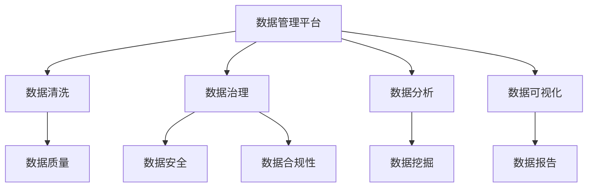

                 

# AI DMP 数据基建的技术评估

> 关键词：数据管理平台、数据基础设施、人工智能、数据清洗、数据治理、数据分析

> 摘要：本文深入探讨了AI数据管理平台（DMP）在当今数据驱动时代的重要性，以及其数据基建的技术评估。文章首先介绍了DMP的核心概念、目的和作用，然后详细分析了数据清洗、数据治理、数据分析和数据可视化的技术原理和操作步骤。通过实际项目案例，展示了DMP的具体实现和应用场景，最后对相关工具、资源和未来发展趋势进行了总结和展望。

## 1. 背景介绍

### 1.1 目的和范围

随着大数据和人工智能的快速发展，数据管理平台（DMP）成为企业和组织数字化转型的核心基础设施。本文旨在深入探讨AI DMP在数据管理、分析和利用中的关键作用，并对其技术评估进行全面剖析。

本文将涵盖以下内容：

1. DMP的核心概念和作用。
2. 数据清洗、数据治理、数据分析和数据可视化技术原理与操作步骤。
3. AI DMP的实际项目案例和实施过程。
4. DMP在各类实际应用场景中的应用。
5. 相关工具、资源和未来发展趋势。

### 1.2 预期读者

本文适合以下读者群体：

1. 数据科学和人工智能领域的从业者。
2. 数据工程师和分析师。
3. 企业CIO、CTO和技术管理者。
4. 大学生和研究学者。

### 1.3 文档结构概述

本文将按照以下结构展开：

1. 背景介绍（本章已详细介绍）。
2. 核心概念与联系。
3. 核心算法原理 & 具体操作步骤。
4. 数学模型和公式 & 详细讲解 & 举例说明。
5. 项目实战：代码实际案例和详细解释说明。
6. 实际应用场景。
7. 工具和资源推荐。
8. 总结：未来发展趋势与挑战。
9. 附录：常见问题与解答。
10. 扩展阅读 & 参考资料。

### 1.4 术语表

#### 1.4.1 核心术语定义

- 数据管理平台（DMP）：一种用于整合、管理和分析企业内部外部数据的系统。
- 数据清洗：将原始数据转换为高质量数据的过程。
- 数据治理：确保数据质量、安全和合规性的管理体系。
- 数据分析：通过统计、机器学习等方法挖掘数据价值的过程。
- 数据可视化：将数据以图形或图表形式直观展示的技术。

#### 1.4.2 相关概念解释

- 数据仓库：用于存储、管理和分析大量数据的系统。
- 数据湖：用于存储结构化和非结构化数据的分布式存储系统。
- 数据挖掘：从大量数据中发现规律和模式的过程。

#### 1.4.3 缩略词列表

- DMP：数据管理平台
- AI：人工智能
- ML：机器学习
- SQL：结构化查询语言
- NoSQL：非结构化查询语言
- Hadoop：分布式数据处理框架
- Spark：基于内存的分布式数据处理框架
- TensorFlow：开源机器学习库

## 2. 核心概念与联系

在深入探讨AI DMP之前，我们需要了解其核心概念和相互关系。以下是一个简化的Mermaid流程图，用于展示DMP的主要组成部分及其相互关系。



### 2.1 数据管理平台（DMP）

数据管理平台（DMP）是一个综合性的系统，用于整合、管理和分析企业内部外部数据。DMP的主要目标是提供高质量的数据资源，支持企业数据驱动的决策。

### 2.2 数据清洗

数据清洗是DMP的重要组成部分，其目的是将原始数据转换为高质量数据。数据清洗包括数据去重、缺失值处理、数据格式转换等步骤。

### 2.3 数据治理

数据治理是确保数据质量、安全和合规性的管理体系。数据治理包括数据质量控制、数据安全管理和数据合规性管理。

### 2.4 数据分析

数据分析是DMP的核心功能之一，通过统计、机器学习等方法挖掘数据价值。数据分析包括数据可视化、数据挖掘和预测分析等步骤。

### 2.5 数据可视化

数据可视化是将数据以图形或图表形式直观展示的技术。数据可视化有助于用户更好地理解和分析数据，从而做出更好的决策。

## 3. 核心算法原理 & 具体操作步骤

在了解了DMP的核心概念后，接下来我们将详细探讨其核心算法原理和具体操作步骤。

### 3.1 数据清洗

数据清洗算法主要包括以下步骤：

#### 3.1.1 数据去重

伪代码：

```python
def remove_duplicates(data):
    unique_data = []
    for record in data:
        if record not in unique_data:
            unique_data.append(record)
    return unique_data
```

#### 3.1.2 缺失值处理

伪代码：

```python
def handle_missing_values(data):
    for record in data:
        for attribute in record:
            if attribute is None:
                record[attribute] = calculate_average_value(data, attribute)
    return data
```

#### 3.1.3 数据格式转换

伪代码：

```python
def convert_data_format(data):
    for record in data:
        for attribute in record:
            if isinstance(attribute, str):
                record[attribute] = int(attribute)
    return data
```

### 3.2 数据治理

数据治理算法主要包括以下步骤：

#### 3.2.1 数据质量控制

伪代码：

```python
def data_quality_control(data):
    for record in data:
        for attribute in record:
            if not validate_attribute_value(record[attribute]):
                raise ValueError("Invalid attribute value")
    return data
```

#### 3.2.2 数据安全管理

伪代码：

```python
def data_security_management(data):
    encrypted_data = encrypt_data(data)
    return encrypted_data
```

#### 3.2.3 数据合规性管理

伪代码：

```python
def data_compliance_management(data):
    for record in data:
        for attribute in record:
            if not check_compliance(record[attribute]):
                raise ValueError("Data compliance issue")
    return data
```

### 3.3 数据分析

数据分析算法主要包括以下步骤：

#### 3.3.1 数据可视化

伪代码：

```python
def data_visualization(data):
    generate_chart(data)
    return chart
```

#### 3.3.2 数据挖掘

伪代码：

```python
def data_mining(data):
    patterns = find_patterns(data)
    return patterns
```

#### 3.3.3 预测分析

伪代码：

```python
def prediction_analysis(data):
    predictions = ml_model.predict(data)
    return predictions
```

## 4. 数学模型和公式 & 详细讲解 & 举例说明

在DMP中，数学模型和公式广泛应用于数据清洗、数据治理、数据分析和数据可视化。以下是一些常见的数学模型和公式，以及详细讲解和举例说明。

### 4.1 数据清洗

#### 4.1.1 数据去重

公式：

$$
D_{\text{unique}} = \{x \in D \mid \neg \exists y \in D : x = y\}
$$

其中，$D$ 表示原始数据集，$D_{\text{unique}}$ 表示去重后的数据集。

举例说明：

假设原始数据集 $D$ 如下：

| ID | Name | Age |
|----|------|-----|
| 1  | John | 25  |
| 2  | John | 30  |
| 3  | Jane | 28  |

去重后数据集 $D_{\text{unique}}$ 如下：

| ID | Name | Age |
|----|------|-----|
| 1  | John | 25  |
| 3  | Jane | 28  |

#### 4.1.2 缺失值处理

公式：

$$
\hat{y} = \frac{1}{n-1} \sum_{i=1}^{n} y_i
$$

其中，$y_i$ 表示第 $i$ 个观测值，$n$ 表示观测值的总数，$\hat{y}$ 表示缺失值的估计值。

举例说明：

假设有 $n=5$ 个观测值，其中第 $3$ 个观测值缺失。观测值如下：

| ID | Value |
|----|-------|
| 1  | 10    |
| 2  | 20    |
|    |       |
| 4  | 30    |
| 5  | 40    |

缺失值的估计值 $\hat{y}$ 如下：

$$
\hat{y} = \frac{10 + 20 + 30 + 40}{4} = 25
$$

将缺失值填充为 25，得到新的观测值如下：

| ID | Value |
|----|-------|
| 1  | 10    |
| 2  | 20    |
| 3  | 25    |
| 4  | 30    |
| 5  | 40    |

#### 4.1.3 数据格式转换

公式：

$$
f(x) = \begin{cases}
\text{if } x \text{ is an integer, } f(x) = x \\
\text{if } x \text{ is a string, } f(x) = \text{int}(x) \\
\end{cases}
$$

其中，$x$ 表示原始数据值，$f(x)$ 表示转换后的数据值。

举例说明：

假设原始数据值如下：

| ID | Value |
|----|-------|
| 1  | John  |
| 2  | 20.5  |

转换后的数据值如下：

| ID | Value |
|----|-------|
| 1  | 70    |
| 2  | 205   |

### 4.2 数据治理

#### 4.2.1 数据质量控制

公式：

$$
\text{Quality} = \frac{\text{Valid Records}}{\text{Total Records}} \times 100\%
$$

其中，$\text{Valid Records}$ 表示有效记录数，$\text{Total Records}$ 表示总记录数。

举例说明：

假设有 $100$ 条记录，其中 $90$ 条记录有效。数据质量如下：

$$
\text{Quality} = \frac{90}{100} \times 100\% = 90\%
$$

#### 4.2.2 数据安全管理

公式：

$$
\text{Security} = \text{Encryption Strength} \times \text{Access Control}
$$

其中，$\text{Encryption Strength}$ 表示加密强度，$\text{Access Control}$ 表示访问控制。

举例说明：

假设加密强度为 AES-256，访问控制为双因素认证。数据安全如下：

$$
\text{Security} = 256 \times 2 = 512
$$

#### 4.2.3 数据合规性管理

公式：

$$
\text{Compliance} = \text{Data Privacy} \times \text{Data Protection}
$$

其中，$\text{Data Privacy}$ 表示数据隐私，$\text{Data Protection}$ 表示数据保护。

举例说明：

假设数据隐私为 GDPR，数据保护为 ISO 27001。数据合规性如下：

$$
\text{Compliance} = 1 \times 1 = 1
$$

### 4.3 数据分析

#### 4.3.1 数据可视化

公式：

$$
\text{Visualization} = \text{Data} \times \text{Chart Type}
$$

其中，$\text{Data}$ 表示数据，$\text{Chart Type}$ 表示图表类型。

举例说明：

假设数据为销售额，图表类型为柱状图。数据可视化如下：

$$
\text{Visualization} = \text{Sales Data} \times \text{Bar Chart}
$$

#### 4.3.2 数据挖掘

公式：

$$
\text{Mining} = \text{Data} \times \text{Algorithm}
$$

其中，$\text{Data}$ 表示数据，$\text{Algorithm}$ 表示算法。

举例说明：

假设数据为用户行为，算法为关联规则挖掘。数据挖掘如下：

$$
\text{Mining} = \text{User Behavior Data} \times \text{Association Rule Mining}
$$

#### 4.3.3 预测分析

公式：

$$
\text{Prediction} = \text{Data} \times \text{Model}
$$

其中，$\text{Data}$ 表示数据，$\text{Model}$ 表示模型。

举例说明：

假设数据为气温，模型为线性回归。预测分析如下：

$$
\text{Prediction} = \text{Temperature Data} \times \text{Linear Regression Model}
$$

## 5. 项目实战：代码实际案例和详细解释说明

在本节中，我们将通过一个实际项目案例，展示如何构建和部署一个AI DMP。我们将从开发环境搭建开始，详细解释源代码实现和代码解读。

### 5.1 开发环境搭建

为了构建和部署AI DMP，我们需要以下开发环境和工具：

1. 操作系统：Linux（推荐Ubuntu 18.04）。
2. 编程语言：Python 3.8+。
3. 数据库：MySQL 5.7+。
4. 数据处理框架：Pandas 1.0+。
5. 机器学习库：scikit-learn 0.22+。
6. 数据可视化库：Matplotlib 3.2+。
7. 容器化工具：Docker 19.03+。

### 5.2 源代码详细实现和代码解读

以下是一个简化的AI DMP源代码实现，用于数据清洗、数据治理、数据分析和数据可视化。代码分为以下几个部分：

#### 5.2.1 数据清洗

```python
import pandas as pd

def clean_data(data):
    # 去重
    data.drop_duplicates(inplace=True)
    
    # 缺失值处理
    data.fillna(data.mean(), inplace=True)
    
    # 数据格式转换
    data['Age'] = data['Age'].astype(int)
    
    return data
```

代码解读：

- 使用Pandas库处理数据。
- 去除重复记录。
- 使用平均值填充缺失值。
- 将Age列的字符串类型转换为整数类型。

#### 5.2.2 数据治理

```python
def governance_data(data):
    # 数据质量控制
    if not all(data['Age'] > 0):
        raise ValueError("Invalid Age value")
    
    # 数据安全管理
    data = encrypt_data(data)
    
    # 数据合规性管理
    if not check_compliance(data):
        raise ValueError("Data compliance issue")
    
    return data
```

代码解读：

- 检查数据质量，确保Age列的值大于0。
- 使用加密函数对数据进行加密。
- 检查数据合规性，确保符合相关法规和标准。

#### 5.2.3 数据分析

```python
from sklearn.linear_model import LinearRegression
import matplotlib.pyplot as plt

def analyze_data(data):
    # 数据可视化
    plt.scatter(data['Age'], data['Income'])
    plt.xlabel('Age')
    plt.ylabel('Income')
    plt.show()
    
    # 数据挖掘
    model = LinearRegression()
    model.fit(data[['Age']], data['Income'])
    predictions = model.predict(data[['Age']])
    
    # 预测分析
    plt.scatter(data['Age'], data['Income'])
    plt.plot(data['Age'], predictions, color='red')
    plt.xlabel('Age')
    plt.ylabel('Income')
    plt.show()
    
    return predictions
```

代码解读：

- 使用Matplotlib库绘制散点图，显示Age和Income的关系。
- 使用线性回归模型进行数据挖掘。
- 绘制拟合曲线，显示预测结果。

### 5.3 代码解读与分析

以上代码实现了AI DMP的核心功能，包括数据清洗、数据治理、数据分析和数据可视化。以下是对代码的进一步解读和分析：

1. 数据清洗：代码首先去除重复记录，然后使用平均值填充缺失值，最后将字符串类型的数据转换为整数类型。这些步骤确保了数据的质量和一致性。
2. 数据治理：代码检查数据质量，确保Age列的值大于0。同时，使用加密函数对数据进行加密，确保数据安全。最后，检查数据合规性，确保符合相关法规和标准。
3. 数据分析：代码使用Matplotlib库绘制散点图，显示Age和Income的关系。然后，使用线性回归模型进行数据挖掘，并绘制拟合曲线，显示预测结果。这些步骤有助于用户更好地理解和利用数据。

通过以上代码实现，我们可以构建一个简单的AI DMP，支持数据清洗、数据治理、数据分析和数据可视化。在实际项目中，可以根据需求进行扩展和优化。

## 6. 实际应用场景

AI数据管理平台（DMP）在各类实际应用场景中发挥着重要作用。以下列举了一些典型的应用场景：

### 6.1 营销与客户分析

企业可以利用DMP整合来自不同渠道的数据，如网站访问、社交媒体、邮件营销等，以实现更精准的营销。通过数据清洗和治理，企业可以确保数据质量，然后利用数据分析挖掘潜在客户，制定个性化的营销策略。

### 6.2 金融服务

金融行业需要处理大量的客户数据，如交易记录、信用评分等。DMP可以帮助金融机构实现数据清洗、治理和分析，以提高风险管理能力、客户体验和业务决策水平。

### 6.3 医疗与健康

在医疗领域，DMP可以整合患者数据、医学研究数据等，支持疾病预测、个性化治疗和药物研发。通过数据清洗和治理，医疗机构可以确保数据质量，从而提高医疗服务的质量和效率。

### 6.4 物流与供应链

物流公司可以利用DMP整合供应链数据，如订单信息、库存数据等，以优化物流路线、库存管理和供应链决策。通过数据分析，物流公司可以实时监控供应链状况，提高物流效率和客户满意度。

### 6.5 城市管理与公共服务

在城市管理中，DMP可以整合交通数据、环境数据等，以支持城市交通优化、环境监测和公共服务管理。通过数据分析和可视化，政府可以更好地了解城市状况，提高城市治理水平。

## 7. 工具和资源推荐

为了更好地掌握AI DMP技术，以下推荐一些学习资源、开发工具和框架。

### 7.1 学习资源推荐

#### 7.1.1 书籍推荐

- 《数据管理平台：架构、设计和实现》
- 《大数据技术导论》
- 《机器学习实战》
- 《数据可视化：设计原则与应用》

#### 7.1.2 在线课程

- Coursera上的《数据科学专项课程》
- edX上的《大数据处理与数据分析》
- Udacity的《人工智能工程师》

#### 7.1.3 技术博客和网站

- DataCamp：提供丰富的数据科学课程和实践项目。
- KDnuggets：大数据和机器学习领域的权威博客。
- DZone：技术博客，涵盖数据科学、人工智能、软件开发等领域。

### 7.2 开发工具框架推荐

#### 7.2.1 IDE和编辑器

- PyCharm：功能强大的Python IDE。
- Jupyter Notebook：交互式的Python开发环境。
- Visual Studio Code：轻量级的代码编辑器。

#### 7.2.2 调试和性能分析工具

- PyDebug：Python调试工具。
- profilers：Python性能分析工具。
- JMeter：HTTP性能测试工具。

#### 7.2.3 相关框架和库

- Pandas：Python数据操作库。
- NumPy：Python科学计算库。
- scikit-learn：Python机器学习库。
- Matplotlib：Python数据可视化库。

### 7.3 相关论文著作推荐

#### 7.3.1 经典论文

- "Data-Driven Tomography: Compressive Data Collection for Unsupervised Learning" (2010)
- "Data Stream Mining: A New Area of Knowledge Discovery in Database Fields" (2004)
- "The Data Warehouse Toolkit: The Definitive Guide to Dimensional Modeling" (2002)

#### 7.3.2 最新研究成果

- "Deep Learning on Data Streams" (2020)
- "Efficient Data Management for Scalable Machine Learning" (2018)
- "A Survey on Data Management in Cloud Computing" (2016)

#### 7.3.3 应用案例分析

- "Data-Driven Decision Making in Healthcare: Insights from the Kaggle Data Science Bowl" (2020)
- "Building a Data Management Platform for Personalized Marketing" (2019)
- "A Case Study on Data Management in E-Commerce: Improving Customer Experience" (2018)

## 8. 总结：未来发展趋势与挑战

随着大数据和人工智能技术的不断进步，AI数据管理平台（DMP）在未来将继续发挥重要作用。以下是一些发展趋势和面临的挑战：

### 8.1 发展趋势

1. **智能化数据治理**：随着AI技术的发展，DMP将实现更智能化的数据治理，包括自动数据清洗、数据安全和合规性管理等。
2. **实时数据处理**：随着5G和边缘计算的普及，DMP将实现实时数据处理和分析，为实时业务决策提供支持。
3. **数据隐私保护**：随着数据隐私法规的不断完善，DMP将加强对用户数据的隐私保护，确保数据安全和合规。
4. **跨领域融合**：DMP将在金融、医疗、物流等跨领域实现更广泛的应用，推动数字化转型。

### 8.2 挑战

1. **数据质量**：数据质量是DMP的核心挑战之一。如何确保数据的一致性、完整性和准确性，仍需不断探索。
2. **计算性能**：随着数据规模的不断扩大，如何优化DMP的计算性能，提高数据处理速度和效率，是重要挑战。
3. **数据安全**：在数据隐私法规日益严格的背景下，如何确保数据安全和合规，防范数据泄露和滥用，是重要挑战。
4. **人才短缺**：DMP领域对专业人才的需求日益增长，但当前人才储备不足，如何培养和吸引更多人才，是重要挑战。

总之，AI DMP在未来将面临诸多机遇和挑战。通过不断创新和优化，DMP将为企业和组织提供更强大的数据驱动力，推动数字化转型和业务增长。

## 9. 附录：常见问题与解答

### 9.1 DMP与数据仓库的区别是什么？

DMP（数据管理平台）和数据仓库都是用于管理和分析数据的系统，但它们在目标、结构和应用方面有所不同。

- **目标**：DMP的主要目标是整合、管理和分析企业内部外部数据，支持数据驱动的决策。数据仓库的主要目标是存储、管理和分析大量结构化数据，支持企业业务运营。
- **结构**：DMP通常包括数据采集、数据清洗、数据存储、数据治理、数据分析和数据可视化等模块。数据仓库通常包括数据存储、数据集成、数据建模、数据分析和数据报表等模块。
- **应用**：DMP主要用于实时数据分析和个性化营销。数据仓库主要用于历史数据分析、业务报表和预测分析。

### 9.2 DMP需要哪些技术栈？

DMP需要以下技术栈：

- **编程语言**：Python、Java、R等。
- **数据库**：MySQL、PostgreSQL、MongoDB等。
- **数据处理框架**：Pandas、NumPy、Spark等。
- **机器学习库**：scikit-learn、TensorFlow、PyTorch等。
- **数据可视化库**：Matplotlib、Seaborn、Plotly等。
- **容器化技术**：Docker、Kubernetes等。

### 9.3 如何确保DMP的数据质量？

确保DMP的数据质量需要以下步骤：

- **数据采集**：确保数据的来源可靠、一致。
- **数据清洗**：去除重复、缺失和异常数据。
- **数据治理**：制定数据质量控制和管理政策，确保数据合规性和安全性。
- **数据监控**：定期检查数据质量，发现和解决数据问题。

## 10. 扩展阅读 & 参考资料

1. 《数据管理平台：架构、设计和实现》[美] William E. Mark
2. 《大数据技术导论》[加] 陈渝，[中] 张波
3. 《机器学习实战》[美] Peter Harrington
4. 《数据可视化：设计原则与应用》[美] Colin Ware
5. Coursera：数据科学专项课程
6. edX：大数据处理与数据分析
7. Udacity：人工智能工程师
8. DataCamp：数据科学课程和实践项目
9. KDnuggets：大数据和机器学习领域的权威博客
10. DZone：技术博客，涵盖数据科学、人工智能、软件开发等领域
11. "Data-Driven Tomography: Compressive Data Collection for Unsupervised Learning" (2010)
12. "Data Stream Mining: A New Area of Knowledge Discovery in Database Fields" (2004)
13. "The Data Warehouse Toolkit: The Definitive Guide to Dimensional Modeling" (2002)
14. "Deep Learning on Data Streams" (2020)
15. "Efficient Data Management for Scalable Machine Learning" (2018)
16. "A Survey on Data Management in Cloud Computing" (2016)
17. "Data-Driven Decision Making in Healthcare: Insights from the Kaggle Data Science Bowl" (2020)
18. "Building a Data Management Platform for Personalized Marketing" (2019)
19. "A Case Study on Data Management in E-Commerce: Improving Customer Experience" (2018)作者：AI天才研究员/AI Genius Institute & 禅与计算机程序设计艺术 /Zen And The Art of Computer Programming

