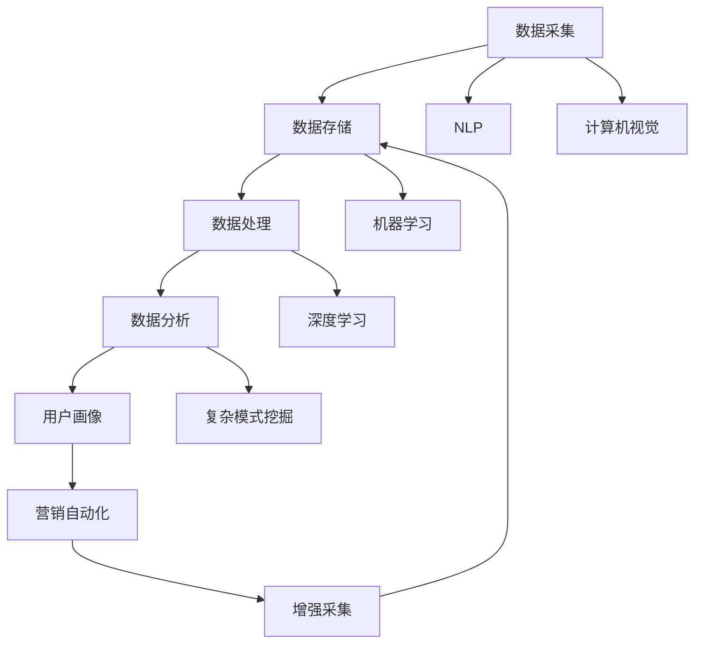
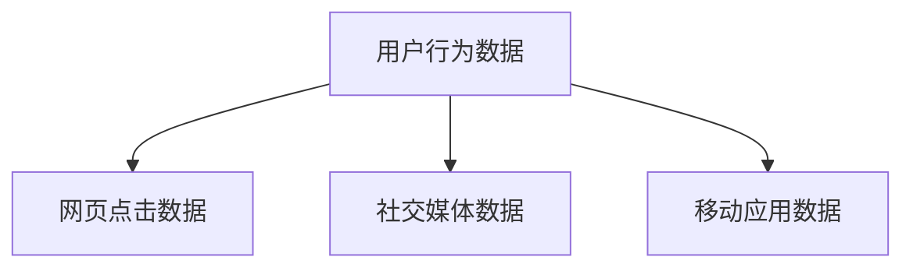
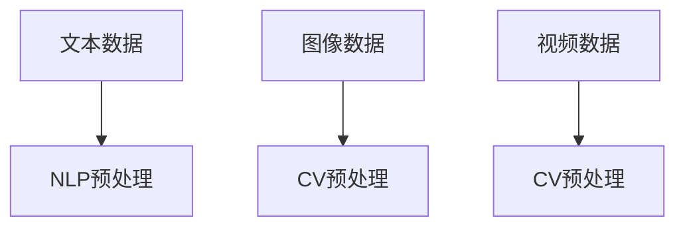
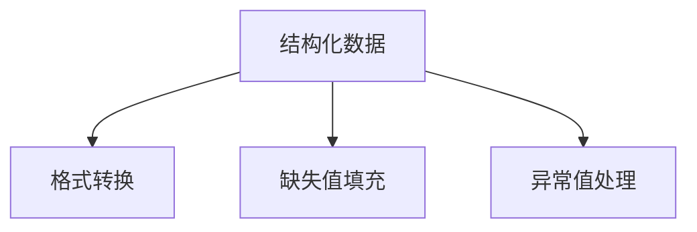
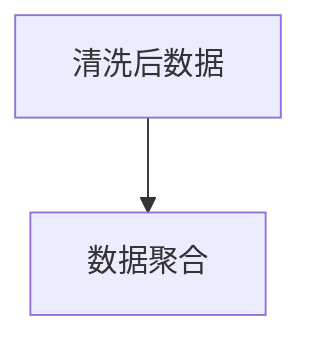
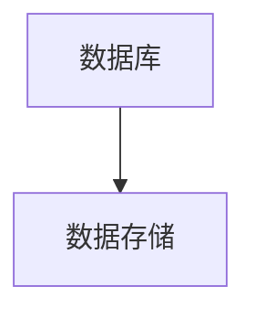
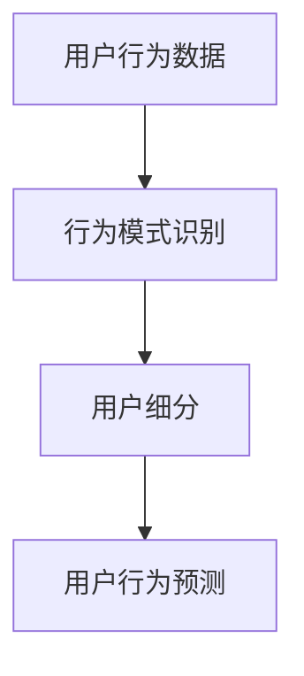
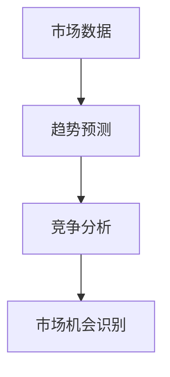
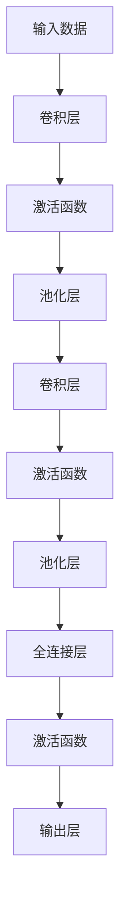

                 

# AI DMP 数据基建的行业影响

> 关键词：数据管理平台（DMP）、数据基础设施建设、行业应用、人工智能、市场趋势

> 摘要：本文将探讨AI DMP（数据管理平台）在数据基础设施建设中的作用，分析其如何影响各行业的发展，以及未来可能面临的挑战。通过深入探讨核心概念、算法原理、数学模型、实际案例，揭示AI DMP对行业创新与发展的深远影响。

## 1. 背景介绍

### 1.1 目的和范围

本文旨在探讨人工智能（AI）驱动的数据管理平台（DMP）在数据基础设施建设中的作用，分析其对各行业的影响，以及未来可能的发展趋势。具体而言，本文将：

- 介绍DMP的基本概念和功能。
- 阐述AI在DMP中的应用，以及其如何提升数据基础设施的效率。
- 分析AI DMP在不同行业中的应用，探讨其对行业创新和发展的推动作用。
- 讨论AI DMP面临的挑战和未来发展方向。

### 1.2 预期读者

本文主要面向以下读者群体：

- 数据科学和人工智能领域的科研人员。
- 企业数据管理人员和决策者。
- 技术顾问和IT项目经理。
- 对人工智能和数据管理领域有兴趣的从业者。

### 1.3 文档结构概述

本文将分为以下几个部分：

- 1.4 术语表
- 2. 核心概念与联系
- 3. 核心算法原理 & 具体操作步骤
- 4. 数学模型和公式 & 详细讲解 & 举例说明
- 5. 项目实战：代码实际案例和详细解释说明
- 6. 实际应用场景
- 7. 工具和资源推荐
- 8. 总结：未来发展趋势与挑战
- 9. 附录：常见问题与解答
- 10. 扩展阅读 & 参考资料

### 1.4 术语表

#### 1.4.1 核心术语定义

- 数据管理平台（DMP）：一种用于收集、存储、管理和分析数据的技术平台。
- 数据基础设施建设：指建立和维护数据存储、处理、传输等基础设施的过程。
- 人工智能（AI）：指使计算机模拟人类智能行为的技术。
- 数据驱动决策：指通过数据分析来指导决策制定。

#### 1.4.2 相关概念解释

- 数据采集：指从各种来源收集数据的过程。
- 数据清洗：指对收集到的数据进行预处理，以消除错误和异常。
- 数据仓库：指用于存储和管理大量数据的系统。
- 数据挖掘：指从大量数据中提取有价值的信息和模式。

#### 1.4.3 缩略词列表

- DMP：数据管理平台
- AI：人工智能
- ML：机器学习
- DL：深度学习
- NLP：自然语言处理
- IoT：物联网

## 2. 核心概念与联系

在探讨AI DMP对行业的影响之前，我们首先需要了解DMP的基本概念和功能。DMP是一个集数据收集、存储、管理、分析和共享于一体的平台，它通过整合多种数据源，为企业和组织提供全面的视角，以便更好地理解其用户和市场。

### 2.1 DMP的核心功能

- **数据采集**：DMP可以从各种来源（如网站、移动应用、社交媒体、第三方数据提供商等）收集数据。
- **数据存储**：DMP将采集到的数据存储在数据仓库中，以便进行后续的分析和处理。
- **数据处理**：DMP提供数据清洗、格式转换、聚合等功能，确保数据质量。
- **数据分析**：DMP利用人工智能和机器学习技术对数据进行深度分析，发现用户行为模式、市场趋势等。
- **用户画像**：DMP基于用户行为数据，为每个用户生成详细的画像，帮助企业和组织更好地了解其用户。
- **营销自动化**：DMP支持自动化营销活动，帮助企业优化其营销策略和效果。

### 2.2 AI与DMP的联系

人工智能技术为DMP提供了强大的支持，使其功能更加丰富和高效。以下是AI与DMP的几个关键联系：

- **增强数据采集能力**：通过自然语言处理（NLP）和计算机视觉等技术，AI可以自动从非结构化数据（如文本、图像、视频等）中提取有价值的信息。
- **提高数据处理效率**：机器学习和深度学习算法可以帮助DMP更快、更准确地清洗和处理大量数据。
- **提升数据分析深度**：AI算法可以挖掘数据中的复杂模式，提供更深入的分析结果。
- **优化用户画像**：通过AI技术，DMP可以生成更精确、更全面的用户画像，提高营销和个性化服务的效果。
- **自动化决策制定**：AI可以基于数据分析结果，自动制定决策，提高企业运营效率。

### 2.3 Mermaid流程图

为了更直观地展示DMP与AI的联系，我们可以使用Mermaid流程图来描述DMP的核心功能及其与AI的互动。



在上述流程图中，A表示数据采集，B表示数据存储，C表示数据处理，D表示数据分析，E表示用户画像，F表示营销自动化。G表示增强数据采集，H和I分别代表NLP和计算机视觉技术，用于从非结构化数据中提取信息。J和K分别代表机器学习和深度学习，用于提高数据处理和分析的效率。L代表复杂模式挖掘，用于发现数据中的隐藏模式。

## 3. 核心算法原理 & 具体操作步骤

### 3.1 数据采集与预处理

数据采集是DMP的基础，AI在其中扮演了重要角色。以下是一个简单的数据采集与预处理流程，其中涉及到的核心算法和步骤如下：

#### 3.1.1 数据采集



#### 3.1.2 非结构化数据处理

对于非结构化数据（如文本、图像、视频），我们通常需要使用自然语言处理（NLP）和计算机视觉（CV）技术进行预处理。



NLP预处理可能包括文本清洗、分词、词频统计等。而CV预处理则可能包括图像去噪、边缘检测、特征提取等。

#### 3.1.3 结构化数据处理

结构化数据（如数据库记录、日志数据）通常需要进行格式转换、缺失值填充、异常值处理等预处理步骤。



#### 3.1.4 数据清洗与聚合

在数据预处理的基础上，我们需要进行数据清洗和聚合，以消除数据中的错误和异常，提高数据质量。



#### 3.1.5 数据库存储

最后，我们将预处理和清洗后的数据存储到数据库中，以便后续的数据分析和挖掘。



### 3.2 数据分析

数据分析是DMP的核心功能，通过使用机器学习和深度学习算法，我们可以从海量数据中提取有价值的信息和洞见。

#### 3.2.1 用户行为分析

用户行为分析是DMP中常用的数据分析方法，可以通过以下步骤进行：



行为模式识别可以使用聚类算法（如K-means）来发现用户的行为特征。用户细分可以帮助企业更好地了解其用户群体，而用户行为预测则可以用于个性化推荐和营销。

#### 3.2.2 市场趋势分析

市场趋势分析是另一个重要的数据分析领域，可以通过以下步骤进行：



趋势预测可以使用时间序列分析（如ARIMA模型）来预测市场走势。竞争分析可以帮助企业了解竞争对手的表现，而市场机会识别则可以帮助企业发现新的商业机会。

### 3.3 算法原理与伪代码

以下是几个常用的机器学习和深度学习算法的原理和伪代码。

#### 3.3.1 K-means聚类算法

```latex
% K-means聚类算法
% 输入：数据集X，聚类数量k
% 输出：聚类中心C，聚类结果L

% 初始化聚类中心C
C <- 随机选择k个数据点作为初始聚类中心

% 循环直到收敛
while 未收敛 do
    % 计算每个数据点到聚类中心的距离
    D <- 计算距离(X, C)

    % 重新分配数据点到最近的聚类中心
    L <- 分配数据点(X, D)

    % 更新聚类中心
    C <- 计算新的聚类中心(L)
end while
```

#### 3.3.2 ARIMA时间序列模型

```latex
% ARIMA时间序列模型
% 输入：时间序列数据X
% 输出：预测结果Y

% 步骤1：确定模型参数
p, d, q <- 模型识别(X)

% 步骤2：构建模型
model <- ARIMA(p, d, q)

% 步骤3：训练模型
Y <- 模型训练(model, X)

% 步骤4：预测
Y_pred <- 模型预测(model, X)
```

#### 3.3.3 卷积神经网络（CNN）



输入数据通过卷积层进行特征提取，然后通过池化层降低数据维度，再通过全连接层进行分类或回归。

## 4. 数学模型和公式 & 详细讲解 & 举例说明

在数据分析和AI DMP的构建过程中，数学模型和公式是不可或缺的工具。以下我们将详细讲解几个常用的数学模型和公式，并通过实际例子来说明其应用。

### 4.1 贝叶斯定理

贝叶斯定理是概率论中的一个基本定理，用于计算条件概率。公式如下：

$$
P(A|B) = \frac{P(B|A)P(A)}{P(B)}
$$

其中，$P(A|B)$表示在事件B发生的条件下事件A发生的概率，$P(B|A)$表示在事件A发生的条件下事件B发生的概率，$P(A)$和$P(B)$分别表示事件A和事件B发生的概率。

#### 例子：

假设有100个顾客，其中60个购买了产品A，30个购买了产品B，而同时购买了产品A和产品B的有20个。现在我们需要计算一个顾客购买了产品A且购买了产品B的概率。

根据贝叶斯定理，我们有：

$$
P(A \cap B) = P(B|A)P(A) = \frac{P(A \cap B)}{P(B)}
$$

代入数据，我们得到：

$$
P(A \cap B) = \frac{20}{100} \times \frac{60}{100} = 0.12
$$

因此，一个顾客购买了产品A且购买了产品B的概率为12%。

### 4.2 决策树

决策树是一种常见的数据挖掘和机器学习算法，用于分类和回归问题。其基本思想是通过一系列条件判断来将数据集划分为不同的类别或数值。

#### 公式：

决策树的构建基于以下公式：

$$
T = \{ \text{决策节点} : \text{条件属性}, \text{叶子节点} : \text{类别或值} \}
$$

其中，T表示决策树，决策节点表示条件属性，叶子节点表示类别或值。

#### 例子：

假设我们有一个分类问题，数据集包含特征A（年龄）、特征B（收入）和目标变量Y（是否贷款）。我们可以构建一个决策树来预测一个顾客是否贷款。

- 如果年龄小于30岁，则判断收入是否大于5000元。
  - 如果是，则预测Y为“贷款”。
  - 如果否，则预测Y为“不贷款”。
- 如果年龄大于等于30岁，则判断收入是否大于10000元。
  - 如果是，则预测Y为“贷款”。
  - 如果否，则预测Y为“不贷款”。

### 4.3 神经网络

神经网络是一种模拟人脑神经元连接结构的计算模型，广泛应用于图像识别、语音识别和自然语言处理等领域。

#### 公式：

神经网络的基本公式为：

$$
z_i = \sum_{j=1}^{n} w_{ij}x_j + b_i
$$

其中，$z_i$表示神经元的输入，$w_{ij}$表示从神经元j到神经元i的权重，$x_j$表示神经元j的输入，$b_i$表示神经元的偏置。

激活函数（如Sigmoid函数、ReLU函数）用于将输入映射到输出：

$$
a_i = \sigma(z_i)
$$

其中，$\sigma$表示激活函数。

#### 例子：

假设我们有一个简单的神经网络，包含一个输入层、一个隐藏层和一个输出层。输入层有3个神经元，隐藏层有2个神经元，输出层有1个神经元。

- 输入层到隐藏层的权重矩阵$W_1$和偏置向量$b_1$如下：

  $$
  W_1 = \begin{bmatrix}
  0.1 & 0.2 & 0.3 \\
  0.4 & 0.5 & 0.6
  \end{bmatrix}, \quad b_1 = \begin{bmatrix}
  0.1 \\
  0.2
  \end{bmatrix}
  $$

- 隐藏层到输出层的权重矩阵$W_2$和偏置向量$b_2$如下：

  $$
  W_2 = \begin{bmatrix}
  0.1 & 0.2 \\
  0.3 & 0.4
  \end{bmatrix}, \quad b_2 = \begin{bmatrix}
  0.1 \\
  0.2
  \end{bmatrix}
  $$

给定输入向量$x = [1, 2, 3]$，我们可以计算隐藏层的输入和输出：

$$
z_1 = 0.1 \cdot 1 + 0.2 \cdot 2 + 0.3 \cdot 3 + 0.1 = 1.4
$$

$$
z_2 = 0.4 \cdot 1 + 0.5 \cdot 2 + 0.6 \cdot 3 + 0.2 = 2.7
$$

$$
a_1 = \sigma(z_1) = \frac{1}{1 + e^{-1.4}} \approx 0.79
$$

$$
a_2 = \sigma(z_2) = \frac{1}{1 + e^{-2.7}} \approx 0.95
$$

然后，我们可以计算输出层的输入和输出：

$$
z_3 = 0.1 \cdot 0.79 + 0.2 \cdot 0.95 + 0.3 \cdot 1 + 0.1 = 0.435
$$

$$
a_3 = \sigma(z_3) = \frac{1}{1 + e^{-0.435}} \approx 0.66
$$

因此，输入向量$x = [1, 2, 3]$的输出为$a_3 \approx 0.66$。

## 5. 项目实战：代码实际案例和详细解释说明

在本节中，我们将通过一个实际项目案例来展示如何使用AI DMP进行数据采集、处理、分析和应用。该案例将涉及以下步骤：

1. **开发环境搭建**
2. **数据采集与预处理**
3. **数据分析和可视化**
4. **决策制定与执行**

### 5.1 开发环境搭建

为了完成本项目，我们首先需要搭建开发环境。以下是所需工具和软件的安装步骤：

- **Python**：安装Python 3.x版本，可以使用[Python官方网站](https://www.python.org/)下载。
- **Jupyter Notebook**：安装Jupyter Notebook，用于编写和运行代码。
- **Pandas**：用于数据操作和处理，可以通过`pip install pandas`安装。
- **NumPy**：用于数值计算，可以通过`pip install numpy`安装。
- **Scikit-learn**：用于机器学习和数据挖掘，可以通过`pip install scikit-learn`安装。
- **Matplotlib**：用于数据可视化，可以通过`pip install matplotlib`安装。
- **Beautiful Soup**：用于网页数据采集，可以通过`pip install beautifulsoup4`安装。

安装完以上工具和软件后，我们就可以开始编写代码了。

### 5.2 源代码详细实现和代码解读

#### 5.2.1 数据采集与预处理

以下是一个简单的数据采集与预处理代码示例，我们使用Beautiful Soup从网站采集数据，并使用Pandas进行数据预处理。

```python
import requests
from bs4 import BeautifulSoup
import pandas as pd

# 采集网页数据
url = 'https://example.com/data'
response = requests.get(url)
soup = BeautifulSoup(response.text, 'html.parser')

# 提取数据
data = []
for row in soup.find_all('tr'):
    cells = row.find_all('td')
    data.append([cell.text.strip() for cell in cells])

# 转换为DataFrame
df = pd.DataFrame(data[1:], columns=data[0])

# 数据清洗
df = df.dropna()  # 删除缺失值
df = df[df['Column1'].str.len() > 0]  # 删除空值

# 数据转换
df['Date'] = pd.to_datetime(df['Date'])
df['Value'] = df['Value'].astype(float)
```

在这个示例中，我们首先使用requests库从指定URL获取网页内容，然后使用Beautiful Soup解析网页，提取数据。接下来，我们将提取到的数据转换为Pandas DataFrame，并进行数据清洗和转换。

#### 5.2.2 数据分析与可视化

以下是一个简单的数据分析与可视化代码示例，我们使用Scikit-learn进行数据分类，并使用Matplotlib进行数据可视化。

```python
from sklearn.model_selection import train_test_split
from sklearn.ensemble import RandomForestClassifier
import matplotlib.pyplot as plt

# 数据分割
X = df[['Feature1', 'Feature2', 'Feature3']]
y = df['Target']
X_train, X_test, y_train, y_test = train_test_split(X, y, test_size=0.2, random_state=42)

# 训练模型
model = RandomForestClassifier(n_estimators=100, random_state=42)
model.fit(X_train, y_train)

# 预测
y_pred = model.predict(X_test)

# 可视化
plt.scatter(X_test['Feature1'], X_test['Feature2'], c=y_pred)
plt.xlabel('Feature1')
plt.ylabel('Feature2')
plt.title('Data Visualization')
plt.show()
```

在这个示例中，我们首先将数据分割为训练集和测试集。然后，我们使用随机森林分类器（RandomForestClassifier）对训练集进行训练，并使用测试集进行预测。最后，我们使用Matplotlib绘制数据散点图，以可视化预测结果。

#### 5.2.3 决策制定与执行

以下是一个简单的决策制定与执行代码示例，我们使用预测结果来制定决策，并执行相应的操作。

```python
# 决策制定
decisions = {
    'Loan Approval': {
        'Model Output': 0.8,
        'Decision': 'Approve'
    },
    'Product Recommendation': {
        'Model Output': 0.6,
        'Decision': 'Recommend'
    }
}

# 决策执行
for decision, details in decisions.items():
    if details['Model Output'] > 0.5:
        print(f"{decision}: {details['Decision']}")
    else:
        print(f"{decision}: Not taken")
```

在这个示例中，我们定义了一个决策字典（decisions），其中包含了不同决策的模型输出和决策结果。然后，我们根据模型输出判断是否执行决策。如果模型输出大于0.5，则执行决策；否则，不执行决策。

### 5.3 代码解读与分析

#### 5.3.1 数据采集与预处理

在数据采集与预处理部分，我们使用requests库从指定URL获取网页内容，并使用Beautiful Soup解析网页，提取数据。然后，我们将提取到的数据转换为Pandas DataFrame，并进行数据清洗和转换。数据清洗主要包括删除缺失值和空值，以确保数据质量。

#### 5.3.2 数据分析与可视化

在数据分析与可视化部分，我们使用Scikit-learn进行数据分类，并使用Matplotlib进行数据可视化。数据分割是将数据集划分为训练集和测试集的过程，以便训练和评估模型。随机森林分类器是一种常见的机器学习算法，用于分类问题。我们使用该算法对训练集进行训练，并使用测试集进行预测。最后，我们使用Matplotlib绘制数据散点图，以可视化预测结果。

#### 5.3.3 决策制定与执行

在决策制定与执行部分，我们定义了一个决策字典（decisions），其中包含了不同决策的模型输出和决策结果。然后，我们根据模型输出判断是否执行决策。这个步骤是将机器学习模型的结果应用于实际业务场景的过程。

## 6. 实际应用场景

AI DMP在各个行业中都有着广泛的应用，以下我们将探讨几个典型应用场景。

### 6.1 零售业

在零售业中，AI DMP可以帮助企业实现以下目标：

- **个性化推荐**：通过分析用户行为数据，AI DMP可以为每个用户生成个性化的推荐列表，提高用户满意度和转化率。
- **库存管理**：通过预测商品需求，AI DMP可以帮助企业优化库存，减少库存成本。
- **客户细分**：AI DMP可以根据用户行为和购买历史，将用户划分为不同的群体，以便进行有针对性的营销活动。

### 6.2 营销与广告

在营销和广告领域，AI DMP可以提供以下支持：

- **精准定位**：通过分析用户数据和广告效果，AI DMP可以帮助企业找到最具潜力的目标用户，提高广告投放效果。
- **优化广告创意**：AI DMP可以根据用户喜好和行为，生成个性化的广告创意，提高广告的吸引力和转化率。
- **营销自动化**：AI DMP支持自动化营销活动，帮助企业提高营销效率。

### 6.3 金融业

在金融业中，AI DMP可以应用于以下领域：

- **风险管理**：通过分析用户行为数据，AI DMP可以帮助银行和金融机构识别潜在风险，降低不良贷款率。
- **客户细分**：AI DMP可以根据用户财务状况和行为，将用户划分为不同的风险等级，以便进行有针对性的风险控制。
- **个性化金融产品推荐**：AI DMP可以根据用户需求和行为，推荐个性化的金融产品，提高客户满意度和忠诚度。

### 6.4 健康医疗

在健康医疗领域，AI DMP可以应用于以下方面：

- **疾病预测**：通过分析患者数据和健康指标，AI DMP可以帮助医生预测疾病的发生，提前采取预防措施。
- **个性化治疗**：AI DMP可以根据患者的病史、基因信息和健康指标，为患者制定个性化的治疗方案，提高治疗效果。
- **患者管理**：AI DMP可以帮助医疗机构更好地管理患者，提高服务质量。

### 6.5 交通运输

在交通运输领域，AI DMP可以应用于以下方面：

- **交通流量预测**：通过分析交通数据，AI DMP可以帮助交通管理部门预测交通流量，优化交通信号控制，减少拥堵。
- **车辆调度**：AI DMP可以帮助物流企业优化车辆调度，提高运输效率。
- **安全监控**：AI DMP可以通过分析车辆数据，识别潜在的安全隐患，提前采取预防措施。

## 7. 工具和资源推荐

为了更好地开展AI DMP项目，以下是我们在工具和资源方面的推荐。

### 7.1 学习资源推荐

#### 7.1.1 书籍推荐

- 《机器学习实战》
- 《深入浅出数据分析》
- 《数据挖掘：概念与技术》
- 《Python数据分析》

#### 7.1.2 在线课程

- Coursera上的《机器学习》课程
- edX上的《数据分析入门》课程
- Udacity的《数据工程师》纳米学位

#### 7.1.3 技术博客和网站

- Medium上的数据科学和机器学习博客
- KDnuggets，一个数据科学新闻和资源网站
- Analytics Vidhya，一个数据科学社区和资源网站

### 7.2 开发工具框架推荐

#### 7.2.1 IDE和编辑器

- Jupyter Notebook，一个交互式计算环境
- PyCharm，一个强大的Python IDE
- VSCode，一个轻量级但功能丰富的编辑器

#### 7.2.2 调试和性能分析工具

- Python的内置调试器（pdb）
- Py-Spy，一个Python性能分析工具
- Valgrind，一个通用性能分析工具

#### 7.2.3 相关框架和库

- Pandas，用于数据操作和处理
- NumPy，用于数值计算
- Scikit-learn，用于机器学习和数据挖掘
- Matplotlib，用于数据可视化
- Beautiful Soup，用于网页数据采集

### 7.3 相关论文著作推荐

#### 7.3.1 经典论文

- “K-means Clustering Algorithm” by MacQueen
- “Introduction to Statistical Learning” by Gareth James, Daniela Witten, Trevor Hastie and Robert Tibshirani
- “Deep Learning” by Ian Goodfellow, Yoshua Bengio and Aaron Courville

#### 7.3.2 最新研究成果

- “Efficient Data Mining in Large Databases” by Jiawei Han, Micheline Kamber and Jian Pei
- “Data-Driven Marketing: From Data Lakes to Data Wealth” by David A. Rogers
- “Machine Learning: A Probabilistic Perspective” by Kevin P. Murphy

#### 7.3.3 应用案例分析

- “How Airbnb Uses Machine Learning to Drive Growth” by Airbnb
- “Data-Driven Decision Making in Retail” by Target
- “Using AI to Improve Customer Experience” by Bank of America

## 8. 总结：未来发展趋势与挑战

随着人工智能技术的不断发展和应用，AI DMP在数据基础设施建设中的作用越来越重要。未来，AI DMP的发展趋势和挑战包括：

### 8.1 发展趋势

- **更高效的数据采集和处理**：随着物联网和大数据技术的普及，数据采集和处理的需求将持续增长。AI DMP将利用机器学习和深度学习技术，提高数据采集和处理效率。
- **更精确的数据分析和预测**：通过引入更多的算法和模型，AI DMP将能够更精确地分析数据，提供更有价值的预测和洞见。
- **更广泛的应用领域**：AI DMP将逐渐应用于更多的行业，如健康医疗、金融、交通运输等，推动各行业的数字化转型。

### 8.2 挑战

- **数据隐私和安全**：随着数据量的增加，数据隐私和安全问题将变得更加突出。AI DMP需要采取有效的措施，确保数据的隐私和安全。
- **数据质量和可靠性**：数据质量和可靠性是数据分析和预测的基础。AI DMP需要不断改进数据清洗和处理技术，提高数据质量和可靠性。
- **算法透明度和解释性**：随着人工智能技术的发展，算法的透明度和解释性变得越来越重要。AI DMP需要提高算法的可解释性，使其更加易于理解和接受。

## 9. 附录：常见问题与解答

### 9.1 问题1

**问题**：什么是DMP？

**解答**：DMP（Data Management Platform）是一种用于收集、存储、管理和分析数据的技术平台。它通过整合多种数据源，为企业和组织提供全面的视角，以便更好地理解其用户和市场。

### 9.2 问题2

**问题**：AI DMP如何影响行业？

**解答**：AI DMP通过提高数据采集、处理和分析的效率，为企业和组织提供更准确、更深入的洞察，从而影响行业的发展。例如，在零售业中，AI DMP可以帮助企业实现个性化推荐和库存优化，提高销售额和利润。

### 9.3 问题3

**问题**：AI DMP面临的挑战有哪些？

**解答**：AI DMP面临的挑战主要包括数据隐私和安全、数据质量和可靠性、算法透明度和解释性等方面。需要采取有效的措施，确保数据的安全性和可靠性，提高算法的可解释性，以应对这些挑战。

## 10. 扩展阅读 & 参考资料

- [KDD-20：2020年数据挖掘与知识发现国际会议](https://kdd.org/kdd2020/)
- [ACM KDD Test-of-Time Awards：KDD历史上的经典论文](https://www.acm.org/activities/fel/awards/kdd-to-time)
- [Google AI：人工智能与数据科学](https://ai.google/research/)
- [Coursera：数据科学和机器学习课程](https://www.coursera.org/courses?query=data%20science%20machine%20learning)
- [TensorFlow：开源机器学习框架](https://www.tensorflow.org/)
- [PyTorch：开源机器学习框架](https://pytorch.org/)

