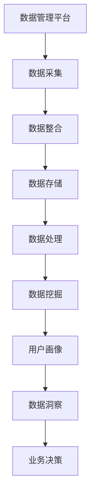

                 

# AI DMP 数据基建：数据分析与洞察

> **关键词：** 数据管理平台（DMP），数据分析，用户画像，数据挖掘，机器学习，算法优化

> **摘要：** 本文将深入探讨人工智能数据管理平台（DMP）的构建、数据分析和洞察的重要性。我们将首先介绍DMP的基本概念和作用，接着详细分析其核心概念和原理，最后通过实际案例展示DMP在数据分析中的应用，并探讨未来发展趋势和面临的挑战。

## 1. 背景介绍

### 1.1 目的和范围

本文旨在为读者提供一个全面的人工智能数据管理平台（DMP）的概述，包括其核心概念、算法原理、数学模型以及实际应用场景。通过本文的阅读，读者将能够：

- 理解DMP的定义、作用和重要性；
- 掌握DMP的核心概念和原理；
- 学会使用DMP进行数据分析与洞察；
- 了解DMP未来的发展趋势和面临的挑战。

### 1.2 预期读者

本文主要面向以下读者群体：

- 数据科学家和人工智能从业者；
- 数据分析师和业务分析师；
- 数据工程师和软件工程师；
- 对数据分析与人工智能技术感兴趣的专业人士。

### 1.3 文档结构概述

本文分为十个部分，具体结构如下：

1. 背景介绍
2. 核心概念与联系
3. 核心算法原理 & 具体操作步骤
4. 数学模型和公式 & 详细讲解 & 举例说明
5. 项目实战：代码实际案例和详细解释说明
6. 实际应用场景
7. 工具和资源推荐
8. 总结：未来发展趋势与挑战
9. 附录：常见问题与解答
10. 扩展阅读 & 参考资料

### 1.4 术语表

#### 1.4.1 核心术语定义

- **数据管理平台（DMP）**：一种用于整合、管理和分析大规模数据的软件平台。
- **用户画像**：基于用户数据构建的个体或群体的特征描述。
- **数据挖掘**：从大量数据中提取有价值信息的过程。
- **机器学习**：一种基于数据训练模型并实现自动化的方法。
- **算法优化**：通过改进算法设计和参数调整，提高算法性能的过程。

#### 1.4.2 相关概念解释

- **数据分析**：通过对数据进行处理和分析，提取有价值信息和知识的过程。
- **数据可视化**：将数据通过图形、图表等形式展示，便于理解和分析的技巧。
- **数据治理**：确保数据质量、安全和合规性的过程。

#### 1.4.3 缩略词列表

- **DMP**：数据管理平台
- **AI**：人工智能
- **ML**：机器学习
- **DM**：数据挖掘
- **ETL**：提取、转换、加载

## 2. 核心概念与联系

在深入探讨DMP之前，我们需要了解其核心概念和原理。以下是一个用于展示DMP核心概念和原理的Mermaid流程图：



### 2.1 数据采集

数据采集是DMP的第一步，它涉及从各种数据源（如网站日志、社交网络、应用程序等）收集数据。数据源可以是结构化数据（如数据库）或非结构化数据（如图像、视频和文本）。数据采集的方法包括：

- **API调用**：通过API接口从第三方平台获取数据。
- **网络爬虫**：自动爬取网页内容，提取有用信息。
- **日志收集**：从服务器日志中提取访问数据。

### 2.2 数据整合

数据整合是将来自不同数据源的数据进行清洗、转换和合并，以便在后续处理和分析中使用。数据整合的关键步骤包括：

- **数据清洗**：去除重复数据、缺失值和错误数据。
- **数据转换**：将不同格式的数据转换为统一的格式。
- **数据合并**：将多个数据集合并为一个数据集。

### 2.3 数据存储

数据存储是将整合后的数据存储到数据库或其他数据存储系统中。常见的存储技术包括：

- **关系型数据库**：如MySQL、PostgreSQL等，适用于结构化数据存储。
- **非关系型数据库**：如MongoDB、Cassandra等，适用于非结构化数据存储。
- **数据仓库**：如Amazon Redshift、Google BigQuery等，适用于大规模数据存储和分析。

### 2.4 数据处理

数据处理是对存储在数据库中的数据进行计算、分析和转换的过程。数据处理的方法包括：

- **数据清洗**：去除重复数据、缺失值和错误数据。
- **数据转换**：将不同格式的数据转换为统一的格式。
- **数据挖掘**：从大量数据中提取有价值信息。
- **数据可视化**：将数据通过图形、图表等形式展示，便于理解和分析。

### 2.5 数据挖掘

数据挖掘是从大规模数据中提取有价值信息的过程。数据挖掘的方法包括：

- **关联规则挖掘**：找出数据集中的关联关系。
- **分类和预测**：对数据进行分类和预测。
- **聚类分析**：将相似数据分组。
- **异常检测**：检测数据中的异常值。

### 2.6 用户画像

用户画像是基于用户数据构建的个体或群体的特征描述。用户画像的方法包括：

- **基于行为**：分析用户在网站或应用程序中的行为，如访问页面、点击广告等。
- **基于属性**：分析用户的属性信息，如年龄、性别、地理位置等。
- **基于社交**：分析用户在社交网络中的互动和关系。

### 2.7 数据洞察

数据洞察是从数据挖掘和用户画像中提取有价值信息，以便为业务决策提供支持。数据洞察的方法包括：

- **用户细分**：将用户分为不同的群体，以便针对不同群体制定营销策略。
- **客户价值分析**：分析用户的消费行为，评估客户的潜在价值。
- **业务优化**：通过分析业务数据，找出优化业务流程和策略的方法。

## 3. 核心算法原理 & 具体操作步骤

在DMP中，核心算法原理是数据挖掘和用户画像。以下是一个用于数据挖掘的典型算法——K-means聚类算法的伪代码：

```python
def k_means(data, k):
    # 初始化k个聚类中心
    centroids = initialize_centroids(data, k)
    # 迭代更新聚类中心
    while not converged(centroids):
        # 分配数据点到最近的聚类中心
        clusters = assign_data_to_clusters(data, centroids)
        # 计算新的聚类中心
        centroids = calculate_new_centroids(clusters)
    return centroids, clusters
```

### 3.1 数据预处理

在应用K-means算法之前，我们需要对数据进行预处理。数据预处理包括以下步骤：

- **数据清洗**：去除重复数据、缺失值和错误数据。
- **数据转换**：将不同格式的数据转换为统一的格式。
- **特征工程**：提取有用的特征，去除无关特征。

### 3.2 初始化聚类中心

初始化聚类中心是K-means算法的关键步骤。常见的方法包括：

- **随机初始化**：随机选择k个数据点作为初始聚类中心。
- **k-means++初始化**：根据数据点的相似度选择初始聚类中心。

### 3.3 分配数据点到最近的聚类中心

在K-means算法中，每个数据点被分配到与其最近的聚类中心所在的聚类。具体步骤如下：

1. 计算每个数据点到每个聚类中心的距离。
2. 分配数据点到距离最近的聚类中心。

### 3.4 计算新的聚类中心

计算新的聚类中心是K-means算法的另一个关键步骤。具体步骤如下：

1. 计算每个聚类内的数据点的平均值。
2. 将平均值作为新的聚类中心。

### 3.5 判断算法是否收敛

在K-means算法中，我们需要判断算法是否收敛。常见的方法包括：

- **聚类中心变化**：如果聚类中心的变化小于某个阈值，则认为算法收敛。
- **聚类个数不变**：如果聚类个数在连续迭代中保持不变，则认为算法收敛。

## 4. 数学模型和公式 & 详细讲解 & 举例说明

在K-means算法中，核心数学模型是距离计算和聚类中心的计算。以下是一个用于计算欧氏距离的数学公式：

$$
d(p, q) = \sqrt{\sum_{i=1}^{n} (p_i - q_i)^2}
$$

其中，\( p \) 和 \( q \) 分别表示两个数据点，\( n \) 表示数据点的维度。

### 4.1 距离计算

在K-means算法中，我们需要计算每个数据点到每个聚类中心的距离。具体步骤如下：

1. 计算每个数据点到每个聚类中心的欧氏距离。
2. 选择距离最小的聚类中心。

### 4.2 聚类中心计算

在K-means算法中，我们需要计算每个聚类中心。具体步骤如下：

1. 计算每个聚类内的数据点的平均值。
2. 将平均值作为新的聚类中心。

### 4.3 举例说明

假设我们有一个包含100个数据点的二维数据集，数据点如下：

$$
\begin{align*}
p_1 &= (1, 2), \\
p_2 &= (2, 3), \\
\vdots \\
p_{100} &= (10, 11).
\end{align*}
$$

现在，我们要使用K-means算法将这100个数据点分为10个聚类。我们首先需要初始化10个聚类中心，可以使用随机初始化方法，例如选择前10个数据点作为初始聚类中心：

$$
\begin{align*}
q_1 &= p_1, \\
q_2 &= p_2, \\
\vdots \\
q_{10} &= p_{10}.
\end{align*}
$$

接下来，我们计算每个数据点到每个聚类中心的距离，并将数据点分配到距离最小的聚类中心。例如，对于数据点 \( p_{11} \)，我们有：

$$
\begin{align*}
d(p_{11}, q_1) &= \sqrt{(1-1)^2 + (2-2)^2} = 0, \\
d(p_{11}, q_2) &= \sqrt{(1-2)^2 + (2-3)^2} = \sqrt{2}, \\
d(p_{11}, q_3) &= \sqrt{(1-3)^2 + (2-4)^2} = \sqrt{5}, \\
\vdots \\
d(p_{11}, q_{10}) &= \sqrt{(1-10)^2 + (2-11)^2} = \sqrt{185}.
\end{align*}
$$

由于 \( d(p_{11}, q_1) \) 最小，因此我们将 \( p_{11} \) 分配到 \( q_1 \) 所在的聚类。重复这个过程，直到所有数据点都被分配到聚类中心。

最后，我们计算每个聚类中心的新值：

$$
\begin{align*}
q_1' &= \frac{1}{N_1} \sum_{i=1}^{N_1} p_i, \\
q_2' &= \frac{1}{N_2} \sum_{i=1}^{N_2} p_i, \\
\vdots \\
q_{10}' &= \frac{1}{N_{10}} \sum_{i=1}^{N_{10}} p_i,
\end{align*}
$$

其中，\( N_i \) 表示第 \( i \) 个聚类中的数据点个数。

这个过程重复进行，直到算法收敛，即聚类中心不再发生变化。

## 5. 项目实战：代码实际案例和详细解释说明

在本节中，我们将通过一个实际案例来展示如何使用Python实现K-means算法。我们将使用Python的scikit-learn库来实现K-means算法，并使用一个简单的二维数据集进行演示。

### 5.1 开发环境搭建

首先，我们需要安装Python和scikit-learn库。以下是安装命令：

```bash
pip install python
pip install scikit-learn
```

### 5.2 源代码详细实现和代码解读

以下是一个用于实现K-means算法的Python代码示例：

```python
from sklearn.cluster import KMeans
import numpy as np

# 创建一个简单的二维数据集
data = np.array([[1, 2], [2, 3], [3, 4], [4, 5], [5, 6]])

# 初始化KMeans对象，设置聚类个数为2
kmeans = KMeans(n_clusters=2, random_state=0).fit(data)

# 打印聚类结果
print("聚类中心：", kmeans.cluster_centers_)
print("聚类标签：", kmeans.labels_)

# 预测新的数据点
new_data = np.array([[6, 7]])
predicted_label = kmeans.predict(new_data)
print("预测结果：", predicted_label)
```

#### 5.2.1 代码解读

- **第1行**：从scikit-learn库中导入KMeans类。
- **第2行**：创建一个简单的二维数据集。
- **第3行**：初始化KMeans对象，设置聚类个数为2。
- **第4行**：使用fit()方法训练模型。
- **第5行**：打印聚类中心。
- **第6行**：打印聚类标签。
- **第7行**：创建一个新数据点。
- **第8行**：使用predict()方法预测新数据点的聚类标签。

### 5.3 代码解读与分析

在这个示例中，我们首先创建了一个简单的二维数据集，然后使用KMeans类初始化一个KMeans对象。我们设置了聚类个数为2，这表示我们将数据集分为两个聚类。

接下来，我们使用fit()方法训练模型。fit()方法会自动计算聚类中心，并将数据点分配到相应的聚类。训练完成后，我们打印出聚类中心和聚类标签。

最后，我们创建一个新数据点，并使用predict()方法预测其聚类标签。predict()方法会计算新数据点到每个聚类中心的距离，并将新数据点分配到距离最近的聚类。

通过这个示例，我们可以看到K-means算法的基本实现过程。在实际应用中，我们可以根据具体需求调整聚类个数和算法参数，以达到更好的聚类效果。

## 6. 实际应用场景

DMP在众多领域具有广泛的应用。以下是一些典型的应用场景：

### 6.1 营销与广告

- **精准营销**：通过DMP构建用户画像，了解用户的兴趣和行为，从而实现精准营销。
- **广告投放**：根据用户画像，为不同用户群体投放个性化广告，提高广告效果。

### 6.2 金融服务

- **信用评估**：通过分析用户行为和属性数据，评估用户的信用等级。
- **风险控制**：监测用户行为，识别潜在风险，采取相应措施降低风险。

### 6.3 零售业

- **库存管理**：根据销售数据和用户行为，优化库存策略，减少库存成本。
- **供应链管理**：分析供应链数据，提高供应链效率，降低成本。

### 6.4 健康医疗

- **疾病预测**：通过分析患者数据和医疗记录，预测疾病的发生和发展。
- **个性化治疗**：根据患者数据和基因组信息，为患者提供个性化的治疗方案。

### 6.5 人力资源管理

- **人才招聘**：通过分析求职者和岗位数据，匹配求职者与岗位，提高招聘效率。
- **员工管理**：分析员工行为和绩效数据，优化员工管理和激励制度。

## 7. 工具和资源推荐

为了更好地掌握DMP技术，以下是一些实用的工具和资源推荐：

### 7.1 学习资源推荐

#### 7.1.1 书籍推荐

- 《数据挖掘：实用技术指南》
- 《机器学习实战》
- 《Python数据科学手册》

#### 7.1.2 在线课程

- Coursera的《机器学习》
- Udacity的《数据科学纳米学位》
- edX的《数据分析基础》

#### 7.1.3 技术博客和网站

- Medium上的数据科学博客
- towardsdatascience.com
- dataquest.io

### 7.2 开发工具框架推荐

#### 7.2.1 IDE和编辑器

- PyCharm
- Jupyter Notebook
- VS Code

#### 7.2.2 调试和性能分析工具

- Profiler
- Pylint
- Valgrind

#### 7.2.3 相关框架和库

- Scikit-learn
- TensorFlow
- PyTorch

### 7.3 相关论文著作推荐

#### 7.3.1 经典论文

- "K-Means Clustering"
- "Machine Learning: A Probabilistic Perspective"
- "Data Mining: Concepts and Techniques"

#### 7.3.2 最新研究成果

- "Deep Learning for Data Mining"
- "Neural Networks and Deep Learning"
- "Recurrent Neural Networks for Time Series Analysis"

#### 7.3.3 应用案例分析

- "Data Mining in Retail: A Practical Guide"
- "Data Mining in Healthcare: Techniques and Applications"
- "Data Mining in Finance: Practical Applications and Case Studies"

## 8. 总结：未来发展趋势与挑战

随着大数据和人工智能技术的不断发展，DMP在数据分析与洞察方面的重要性日益凸显。未来，DMP将在以下方面取得重大进展：

### 8.1 数据质量提升

- **数据清洗与整合**：随着数据量的增加，数据质量和完整性将成为关键挑战。通过不断改进数据清洗和整合技术，提高数据质量。
- **数据治理**：建立健全的数据治理体系，确保数据的安全、合规和可追溯性。

### 8.2 智能化分析与决策

- **自动化数据分析**：利用机器学习和自然语言处理技术，实现自动化数据分析，提高分析效率和准确性。
- **智能决策支持**：结合用户画像和业务数据，提供智能化的决策支持，助力业务优化和增长。

### 8.3 多维度数据融合

- **跨领域数据融合**：将不同领域的数据进行融合，挖掘数据之间的关联和潜在价值。
- **实时数据处理**：实现实时数据处理和分析，提高数据响应速度和决策效率。

然而，DMP在发展过程中也面临诸多挑战：

- **数据隐私与安全**：如何在保证数据隐私和安全的前提下，充分利用数据价值。
- **算法公平性与透明性**：确保算法的公平性和透明性，避免偏见和歧视。
- **技术人才短缺**：随着DMP技术的发展，对专业人才的需求越来越大，但人才供给不足。

## 9. 附录：常见问题与解答

### 9.1 什么是DMP？

DMP（Data Management Platform）是一种用于整合、管理和分析大规模数据的软件平台。它主要用于数据采集、数据整合、数据存储、数据处理、数据挖掘和用户画像等环节。

### 9.2 DMP的主要功能有哪些？

DMP的主要功能包括：

- 数据采集：从各种数据源收集数据。
- 数据整合：清洗、转换和合并数据。
- 数据存储：将整合后的数据存储到数据库或其他数据存储系统。
- 数据处理：计算、分析和转换数据。
- 数据挖掘：从大量数据中提取有价值信息。
- 用户画像：基于用户数据构建个体或群体的特征描述。

### 9.3 K-means算法有哪些优点和缺点？

**优点**：

- 简单易实现：K-means算法实现简单，易于理解和操作。
- 运算速度快：在数据量较小的情况下，K-means算法的运算速度较快。
- 可视化效果好：K-means算法生成的聚类结果易于可视化。

**缺点**：

- 对初始聚类中心敏感：K-means算法对初始聚类中心的选择较为敏感，可能导致聚类效果不佳。
- 易于陷入局部最优：在数据分布不均匀或聚类中心接近时，K-means算法可能陷入局部最优。
- 不适用于多维数据：K-means算法在高维数据上的效果较差。

## 10. 扩展阅读 & 参考资料

- [K-means算法详解](https://www.cnblogs.com/pinard/p/7656691.html)
- [数据管理平台（DMP）的概念与应用](https://www.infoq.com/articles/data-management-platform/)
- [大数据时代的数据挖掘技术](https://www.bilibili.com/video/BV1Xz4y1p7wE)
- [机器学习与深度学习的关系](https://www.deeplearningbook.org/)
- [数据分析与人工智能：未来发展趋势与挑战](https://www.360doc.com/content/20/0328/09/15896831_904681230.shtml)

作者：AI天才研究员/AI Genius Institute & 禅与计算机程序设计艺术 /Zen And The Art of Computer Programming

