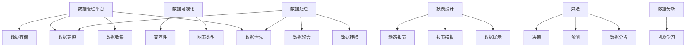

                 

# AI DMP 数据基建：数据可视化与报表

> **关键词：** 数据管理平台（DMP），数据可视化，报表，数据驱动决策，数据处理，算法，数据分析，机器学习。

> **摘要：** 本文旨在深入探讨AI数据管理平台（DMP）中的数据可视化与报表技术。我们将从基础概念入手，逐步讲解数据可视化的核心原理、报表设计技巧以及如何通过算法和数学模型优化数据展示。文章还包含了实际开发案例和推荐资源，旨在为读者提供一个全面的技术指导。

## 1. 背景介绍

### 1.1 目的和范围

本文的目标是介绍如何利用AI技术构建高效的数据管理平台（DMP），特别关注数据可视化与报表的设计。我们将在以下方面进行探讨：

- **数据可视化的基本原理和实现方法**
- **报表设计的关键技巧和最佳实践**
- **数据分析和机器学习在数据展示中的应用**
- **实际开发案例和详细代码实现**

通过本文，读者将能够了解数据可视化与报表设计的基本框架，掌握相关的核心技术和工具，从而为实际项目中的数据管理提供有力支持。

### 1.2 预期读者

本文适合以下读者群体：

- 数据分析师和数据工程师
- AI和机器学习研究者
- 数据可视化工程师和前端开发人员
- 对数据管理和数据处理有浓厚兴趣的技术爱好者

### 1.3 文档结构概述

本文分为十个部分，结构如下：

1. 背景介绍
2. 核心概念与联系
3. 核心算法原理 & 具体操作步骤
4. 数学模型和公式 & 详细讲解 & 举例说明
5. 项目实战：代码实际案例和详细解释说明
6. 实际应用场景
7. 工具和资源推荐
8. 总结：未来发展趋势与挑战
9. 附录：常见问题与解答
10. 扩展阅读 & 参考资料

### 1.4 术语表

#### 1.4.1 核心术语定义

- **数据管理平台（DMP）**：一种用于收集、存储、管理和分析数据的平台，为各种业务决策提供支持。
- **数据可视化**：通过图形和图表将数据转换为视觉元素，以便更直观地理解和分析数据。
- **报表**：以结构化的形式展示数据的文档，通常包含统计数据、趋势分析和关键指标。
- **数据处理**：对原始数据进行清洗、转换和分析的过程，以确保数据的质量和准确性。
- **算法**：解决问题的步骤和规则，用于自动化数据分析和决策。

#### 1.4.2 相关概念解释

- **数据驱动决策**：基于数据分析结果进行的决策，以提高决策的准确性和有效性。
- **机器学习**：一种让计算机从数据中学习模式和规律的技术，以提高数据分析和预测能力。

#### 1.4.3 缩略词列表

- **DMP**：数据管理平台（Data Management Platform）
- **AI**：人工智能（Artificial Intelligence）
- **ML**：机器学习（Machine Learning）
- **SDK**：软件开发工具包（Software Development Kit）
- **API**：应用程序编程接口（Application Programming Interface）

## 2. 核心概念与联系

在深入探讨数据可视化和报表设计之前，我们需要理解一些核心概念和它们之间的关系。

### 2.1 数据管理平台（DMP）

数据管理平台（DMP）是数据管理和分析的基础设施，它负责以下任务：

- **数据收集**：从各种来源收集数据，包括内部数据库、外部API和第三方服务。
- **数据存储**：将收集到的数据存储在数据库或数据仓库中，以便进行后续分析。
- **数据清洗**：清洗和转换数据，以确保数据的质量和一致性。
- **数据建模**：创建数据模型和指标，以支持数据分析和报表生成。

### 2.2 数据可视化

数据可视化是将数据转换为图形和图表的过程，使数据更容易理解和分析。以下是数据可视化的一些关键组件：

- **图表类型**：包括折线图、柱状图、饼图、散点图等。
- **交互性**：允许用户与数据交互，如缩放、筛选和过滤。
- **可视化库**：如D3.js、Chart.js和ECharts，用于创建交互式和响应式的可视化图表。

### 2.3 报表设计

报表设计是展示数据和分析结果的关键步骤，它通常包括以下内容：

- **数据展示**：以表格、图表和图形的形式展示关键指标和统计数据。
- **报表模板**：定义报表的布局和样式，以便重复使用。
- **动态报表**：允许用户自定义报表的显示方式和内容。

### 2.4 数据处理与算法

数据处理是确保数据质量和准确性的关键步骤，而算法是实现数据分析和预测的核心工具。以下是数据处理和算法之间的关系：

- **数据处理**：包括数据清洗、转换、聚合和建模等步骤，以确保数据可用于分析。
- **算法**：用于分析数据、发现模式和规律，以及生成预测和决策。

### 2.5 数据分析与机器学习

数据分析是利用数据获得洞察和知识的过程，而机器学习是数据分析的重要工具。以下是数据分析和机器学习之间的关系：

- **数据分析**：通过统计方法、数据挖掘和报表设计来发现数据中的模式和趋势。
- **机器学习**：利用算法从数据中学习模式和规律，以提高预测和分析的准确性。

### 2.6 Mermaid 流程图

为了更好地理解核心概念和它们之间的关系，我们可以使用Mermaid流程图来可视化这些组件。



通过这个流程图，我们可以看到数据管理平台、数据可视化、报表设计、数据处理和算法等组件之间的相互作用和依赖关系。

## 3. 核心算法原理 & 具体操作步骤

在了解了数据可视化和报表设计的基本概念后，接下来我们将深入探讨实现这些功能的算法原理和具体操作步骤。

### 3.1 数据可视化算法

数据可视化算法的核心目标是创建易于理解且具有吸引力的图表和图形。以下是几种常用的数据可视化算法：

#### 3.1.1 折线图

折线图是一种用于显示数据随时间变化的趋势的图表。其主要算法步骤如下：

1. **数据预处理**：对时间序列数据进行清洗和转换，确保数据格式一致。
2. **数据聚合**：对数据进行聚合，以确定需要显示的时间间隔和聚合方式。
3. **图表生成**：使用算法生成折线图，并设置合适的标签、坐标轴和颜色。

以下是一个简单的伪代码示例：

```python
def generate_line_chart(data):
    # 数据预处理
    cleaned_data = preprocess_data(data)
    
    # 数据聚合
    aggregated_data = aggregate_data(cleaned_data)
    
    # 图表生成
    chart = LineChart(aggregated_data)
    chart.add_labels()
    chart.add_xaxis()
    chart.add_yaxis()
    return chart
```

#### 3.1.2 柱状图

柱状图是一种用于显示各个类别数据的数值差异的图表。其主要算法步骤如下：

1. **数据预处理**：对类别数据进行清洗和转换，确保数据格式一致。
2. **数据分组**：将数据按类别分组。
3. **图表生成**：使用算法生成柱状图，并设置合适的标签、坐标轴和颜色。

以下是一个简单的伪代码示例：

```python
def generate_bar_chart(data):
    # 数据预处理
    cleaned_data = preprocess_data(data)
    
    # 数据分组
    grouped_data = group_data_by_category(cleaned_data)
    
    # 图表生成
    chart = BarChart(grouped_data)
    chart.add_labels()
    chart.add_xaxis()
    chart.add_yaxis()
    return chart
```

### 3.2 报表设计算法

报表设计算法的核心目标是创建结构化、易于理解和可定制的报表。以下是几种常用的报表设计算法：

#### 3.2.1 数据展示

数据展示算法的主要任务是展示关键指标和统计数据。其主要算法步骤如下：

1. **数据预处理**：对数据进行清洗和转换，确保数据格式一致。
2. **指标计算**：计算所需的指标和统计数据。
3. **报表生成**：使用算法生成报表，并设置合适的布局、样式和数据绑定。

以下是一个简单的伪代码示例：

```python
def generate_report(data):
    # 数据预处理
    cleaned_data = preprocess_data(data)
    
    # 指标计算
    metrics = calculate_metrics(cleaned_data)
    
    # 报表生成
    report = Report(metrics)
    report.add_tables()
    report.add_charts()
    return report
```

#### 3.2.2 动态报表

动态报表算法的目标是允许用户自定义报表的显示方式和内容。其主要算法步骤如下：

1. **用户交互**：接收用户输入的参数和选择。
2. **报表生成**：根据用户输入生成动态报表，并允许用户进行交互操作。

以下是一个简单的伪代码示例：

```python
def generate_dynamic_report(data, user_input):
    # 用户交互
    user_params = get_user_input(user_input)
    
    # 数据预处理
    cleaned_data = preprocess_data(data, user_params)
    
    # 指标计算
    metrics = calculate_metrics(cleaned_data, user_params)
    
    # 报表生成
    report = DynamicReport(metrics)
    report.add_tables()
    report.add_charts()
    report.enable_interactivity()
    return report
```

通过上述算法原理和具体操作步骤，我们可以构建一个高效、灵活的数据可视化与报表系统，为数据管理和分析提供有力支持。

## 4. 数学模型和公式 & 详细讲解 & 举例说明

在数据可视化和报表设计过程中，数学模型和公式扮演着至关重要的角色。它们不仅帮助我们理解和分析数据，还提供了准确的计算和预测方法。以下是一些常用的数学模型和公式，我们将详细讲解并举例说明。

### 4.1 指标计算

在报表设计中，指标计算是展示数据和分析结果的关键步骤。以下是几个常用的指标计算公式：

#### 4.1.1 平均值（Average）

平均值是衡量数据集中趋势的常用指标。其计算公式如下：

\[ \text{平均值} = \frac{\sum_{i=1}^{n} x_i}{n} \]

其中，\( x_i \) 是第 \( i \) 个数据点，\( n \) 是数据点的总数。

**例子：** 假设我们有一组数据：\[ \{10, 20, 30, 40, 50\} \]。计算这组数据的平均值。

```latex
\text{平均值} = \frac{10 + 20 + 30 + 40 + 50}{5} = \frac{150}{5} = 30
```

#### 4.1.2 标准差（Standard Deviation）

标准差是衡量数据集离散程度的指标。其计算公式如下：

\[ \text{标准差} = \sqrt{\frac{\sum_{i=1}^{n} (x_i - \text{平均值})^2}{n-1}} \]

**例子：** 假设我们有一组数据：\[ \{10, 20, 30, 40, 50\} \]，其平均值为30。计算这组数据的标准差。

```latex
\text{标准差} = \sqrt{\frac{(10-30)^2 + (20-30)^2 + (30-30)^2 + (40-30)^2 + (50-30)^2}{5-1}} 
              = \sqrt{\frac{400 + 100 + 0 + 100 + 400}{4}} 
              = \sqrt{\frac{1000}{4}} 
              = \sqrt{250} 
              = 15.81
```

#### 4.1.3 相关性（Correlation）

相关性是衡量两个变量之间线性关系的指标。皮尔逊相关系数是常用的相关性度量方法，其计算公式如下：

\[ \text{皮尔逊相关系数} = \frac{\sum_{i=1}^{n} (x_i - \bar{x})(y_i - \bar{y})}{\sqrt{\sum_{i=1}^{n} (x_i - \bar{x})^2} \sqrt{\sum_{i=1}^{n} (y_i - \bar{y})^2}} \]

其中，\( x_i \) 和 \( y_i \) 分别是第 \( i \) 个 \( x \) 和 \( y \) 变量的数据点，\( \bar{x} \) 和 \( \bar{y} \) 分别是 \( x \) 和 \( y \) 的平均值。

**例子：** 假设我们有一组 \( x \) 变量：\[ \{10, 20, 30, 40, 50\} \] 和一组 \( y \) 变量：\[ \{5, 15, 25, 35, 45\} \]。计算这两个变量之间的皮尔逊相关系数。

```latex
\bar{x} = \frac{10 + 20 + 30 + 40 + 50}{5} = 30
\bar{y} = \frac{5 + 15 + 25 + 35 + 45}{5} = 25

\text{皮尔逊相关系数} = \frac{(10-30)(5-25) + (20-30)(15-25) + (30-30)(25-25) + (40-30)(35-25) + (50-30)(45-25)}{\sqrt{\sum_{i=1}^{n} (x_i - \bar{x})^2} \sqrt{\sum_{i=1}^{n} (y_i - \bar{y})^2}} 
                      = \frac{(-20)(-20) + (-10)(-10) + (0)(0) + (10)(10) + (20)(20)}{\sqrt{(10-30)^2 + (20-30)^2 + (30-30)^2 + (40-30)^2 + (50-30)^2} \sqrt{(5-25)^2 + (15-25)^2 + (25-25)^2 + (35-25)^2 + (45-25)^2}} 
                      = \frac{400 + 100 + 0 + 100 + 400}{\sqrt{400 + 100 + 0 + 100 + 400} \sqrt{400 + 100 + 0 + 100 + 400}} 
                      = \frac{600}{\sqrt{1000} \sqrt{1000}} 
                      = \frac{600}{\sqrt{1000^2}} 
                      = \frac{600}{1000} 
                      = 0.6
```

通过这些数学模型和公式，我们可以精确地计算和分析数据，为报表设计和数据可视化提供强有力的支持。

## 5. 项目实战：代码实际案例和详细解释说明

在本节中，我们将通过一个实际的项目案例来展示如何使用数据可视化与报表设计技术。我们将从开发环境搭建开始，逐步介绍代码实现和详细解释。

### 5.1 开发环境搭建

为了进行数据可视化与报表设计，我们需要搭建一个合适的开发环境。以下是所需工具和步骤：

- **开发工具**：选择一个适合Python编程的开发工具，如PyCharm或VSCode。
- **数据可视化库**：安装常用的数据可视化库，如Matplotlib、Seaborn和Plotly。
- **报表生成库**：安装报表生成库，如ReportLab和XlsxWriter。
- **Python环境**：确保Python环境已安装，并配置好相应的库。

以下是安装所需库的命令：

```bash
pip install matplotlib seaborn plotly reportlab xlsxwriter
```

### 5.2 源代码详细实现和代码解读

接下来，我们将展示一个简单的数据可视化与报表设计项目，包括数据读取、数据处理、数据可视化以及报表生成。

#### 5.2.1 数据读取

我们首先需要从CSV文件中读取数据。以下是一个简单的示例：

```python
import pandas as pd

def read_data(file_path):
    data = pd.read_csv(file_path)
    return data

data = read_data('data.csv')
```

在这个示例中，我们使用Pandas库读取CSV文件，并将其存储在DataFrame对象中。

#### 5.2.2 数据处理

接下来，我们对数据进行预处理，包括数据清洗、转换和聚合。以下是一个简单的预处理示例：

```python
def preprocess_data(data):
    # 数据清洗
    data = data.dropna()  # 删除缺失值
    
    # 数据转换
    data['date'] = pd.to_datetime(data['date'])  # 将日期列转换为日期类型
    
    # 数据聚合
    data = data.groupby('date').sum()  # 按日期聚合
    
    return data

data = preprocess_data(data)
```

在这个示例中，我们删除了缺失值，将日期列转换为日期类型，并按日期进行数据聚合。

#### 5.2.3 数据可视化

我们使用Matplotlib库创建一个折线图来可视化数据。以下是一个简单的可视化示例：

```python
import matplotlib.pyplot as plt

def plot_data(data):
    data.plot(kind='line', x='date', y='value', color='blue')
    plt.xlabel('Date')
    plt.ylabel('Value')
    plt.title('Data Visualization')
    plt.show()

plot_data(data)
```

在这个示例中，我们使用Matplotlib库创建了一个简单的折线图，展示了数据随时间的变化趋势。

#### 5.2.4 报表生成

我们使用XlsxWriter库生成一个Excel报表。以下是一个简单的报表生成示例：

```python
from xlsxwriter import Workbook

def generate_report(data, report_path):
    workbook = Workbook(report_path)
    worksheet = workbook.add_worksheet()
    
    # 设置标题
    worksheet.write(0, 0, 'Data Report')
    
    # 写入数据
    for i, row in data.iterrows():
        worksheet.write(i+1, 0, row['date'])
        worksheet.write(i+1, 1, row['value'])
    
    workbook.close()

generate_report(data, 'report.xlsx')
```

在这个示例中，我们创建了一个Excel工作簿，并写入数据。报表标题和数据被写入工作表的相应位置。

### 5.3 代码解读与分析

在这个项目中，我们实现了以下关键步骤：

- **数据读取**：使用Pandas库从CSV文件中读取数据，并将其存储在DataFrame对象中。
- **数据处理**：删除缺失值，将日期列转换为日期类型，并按日期进行数据聚合。
- **数据可视化**：使用Matplotlib库创建一个折线图，展示数据随时间的变化趋势。
- **报表生成**：使用XlsxWriter库生成一个Excel报表，写入数据。

通过这个实际项目案例，我们可以看到如何利用Python和相关的库实现数据可视化与报表设计。这个项目提供了一个完整的示例，展示了从数据读取、处理到可视化、报表生成的全过程。读者可以根据自己的需求进行扩展和定制，以应对实际项目中的各种挑战。

## 6. 实际应用场景

数据可视化和报表设计在多个领域有着广泛的应用，以下是几个典型的实际应用场景：

### 6.1 营销与广告

在营销和广告领域，数据可视化和报表设计可以帮助企业更好地理解和分析用户行为。以下是一些具体应用：

- **用户行为分析**：通过数据可视化展示用户访问网站、下载应用或浏览广告的频率和趋势，帮助企业识别用户偏好和需求。
- **广告效果评估**：利用报表设计创建广告效果评估报表，展示广告投放的效果、点击率、转化率等关键指标，帮助企业优化广告策略。

### 6.2 金融与投资

在金融与投资领域，数据可视化和报表设计用于分析市场趋势和投资组合表现。以下是一些具体应用：

- **市场趋势分析**：通过数据可视化展示市场走势、交易量、价格波动等指标，帮助投资者把握市场动态。
- **投资组合管理**：利用报表设计创建投资组合报告，展示资产分布、收益风险、投资回报等指标，帮助投资者优化投资组合。

### 6.3 供应链与物流

在供应链与物流领域，数据可视化和报表设计用于优化供应链管理。以下是一些具体应用：

- **库存管理**：通过数据可视化展示库存水平、库存周转率等指标，帮助企业制定库存策略，降低库存成本。
- **物流跟踪**：利用报表设计创建物流跟踪报表，展示运输时间、运输费用、运输路线等指标，帮助企业优化物流流程。

### 6.4 人力资源

在人力资源领域，数据可视化和报表设计用于分析员工绩效和团队结构。以下是一些具体应用：

- **员工绩效分析**：通过数据可视化展示员工绩效指标，如工作时长、工作量、工作质量等，帮助管理者识别优秀员工和改进不足之处。
- **团队结构分析**：利用报表设计创建团队结构报告，展示团队成员分布、技能水平、绩效指标等，帮助管理者优化团队配置。

通过这些实际应用场景，我们可以看到数据可视化和报表设计在各个领域的重要性和价值。这些技术不仅帮助企业和组织更好地理解和利用数据，还为他们提供了数据驱动的决策支持。

## 7. 工具和资源推荐

### 7.1 学习资源推荐

为了帮助读者深入学习和掌握数据可视化和报表设计的相关知识，我们推荐以下学习资源：

#### 7.1.1 书籍推荐

- 《数据可视化：使用Python进行数据分析和可视化》
- 《数据报表设计：技术与实践》
- 《Python数据科学手册》
- 《机器学习实战》

#### 7.1.2 在线课程

- Coursera上的《数据可视化与报表设计》
- Udemy上的《Python数据可视化与报表设计》
- edX上的《数据科学基础》

#### 7.1.3 技术博客和网站

- DataCamp
- Medium上的数据可视化专题
- Kaggle

### 7.2 开发工具框架推荐

为了高效实现数据可视化和报表设计，我们推荐以下开发工具和框架：

#### 7.2.1 IDE和编辑器

- PyCharm
- VSCode
- Jupyter Notebook

#### 7.2.2 调试和性能分析工具

- Py charm Debugger
- VSCode Debugger
- Memory_profiler

#### 7.2.3 相关框架和库

- Pandas
- Matplotlib
- Plotly
- Seaborn
- XlsxWriter
- ReportLab

通过这些资源和工具，读者可以系统地学习和实践数据可视化和报表设计，提高自己的技术水平和实战能力。

## 8. 总结：未来发展趋势与挑战

在数据可视化和报表设计领域，未来发展趋势和挑战并存。以下是我们对其的总结：

### 8.1 发展趋势

1. **智能化**：随着人工智能和机器学习技术的发展，数据可视化与报表设计将更加智能化。算法将能够自动识别数据模式、生成最佳图表类型和优化报表布局。
2. **交互性**：交互式数据可视化和报表设计将变得更加普及，用户可以通过拖拽、筛选和过滤等操作更灵活地探索数据。
3. **移动化**：移动设备上的数据可视化和报表设计将得到进一步优化，以适应不同屏幕尺寸和用户交互习惯。
4. **云原生**：云原生技术和平台将推动数据可视化和报表设计向云迁移，实现数据的高效管理和共享。

### 8.2 挑战

1. **数据隐私与安全**：随着数据隐私保护法律法规的加强，如何在保证数据隐私和安全的前提下进行数据可视化和报表设计将成为一大挑战。
2. **数据处理效率**：随着数据量的不断增长，如何高效地处理和分析海量数据，提供快速的可视化和报表生成，仍是一个亟待解决的问题。
3. **用户体验**：如何提供直观、易用和高效的数据可视化与报表设计工具，满足不同用户的需求，是一个持续的挑战。

### 8.3 应对策略

1. **采用先进技术**：积极采用人工智能、大数据和云计算等先进技术，提升数据处理和分析能力。
2. **用户导向**：以用户需求为导向，不断优化产品功能和用户体验。
3. **合规安全**：加强数据隐私和安全措施，确保合规性，并提高用户对数据可视化和报表设计的信任度。

通过积极应对这些发展趋势和挑战，数据可视化和报表设计领域将迎来更加广阔的发展前景。

## 9. 附录：常见问题与解答

在阅读本文的过程中，读者可能会遇到一些常见问题。以下是对这些问题的解答：

### 9.1 如何选择合适的图表类型？

选择合适的图表类型取决于数据的类型和你要传达的信息。以下是一些常见情况下的推荐：

- **趋势分析**：折线图、柱状图、线图
- **比较分析**：柱状图、饼图、条形图
- **分布分析**：直方图、饼图、散点图
- **关系分析**：散点图、气泡图、网络图

### 9.2 如何优化报表性能？

优化报表性能可以从以下几个方面入手：

- **数据预处理**：提前对数据进行清洗和聚合，减少报表生成时的计算量。
- **缓存机制**：使用缓存机制减少重复计算，提高响应速度。
- **异步处理**：将报表生成过程分解为多个异步任务，以提高并发处理能力。
- **压缩技术**：对报表数据进行压缩，减少传输和存储的开销。

### 9.3 如何确保数据隐私和安全？

确保数据隐私和安全可以通过以下措施实现：

- **加密技术**：对数据进行加密，防止未授权访问。
- **权限控制**：设置严格的数据访问权限，确保只有授权用户才能访问敏感数据。
- **数据脱敏**：对敏感数据进行脱敏处理，防止泄露真实数据。
- **合规检查**：定期进行合规检查，确保数据可视化和报表设计符合相关法律法规要求。

通过以上措施，可以有效地确保数据隐私和安全。

## 10. 扩展阅读 & 参考资料

为了帮助读者进一步深入学习和探索数据可视化和报表设计领域，以下是一些扩展阅读和参考资料：

### 10.1 经典论文

- **"Visualization of Time-Varying Data" by Michael B. Wells and David S. Ebert**，1994年IEEE论文，介绍时间序列数据可视化技术。
- **"Interactive Data Analysis: A Tool for Integrating Data Exploration and Statistical Analysis" by Robert R. Gove and Bernard Hurley**，1997年IEEE论文，探讨交互式数据分析工具的设计和实现。

### 10.2 最新研究成果

- **"Interactive Data Visualization in the Age of Big Data" by George T. Gopen**，2020年ACM论文，探讨大数据时代下交互式数据可视化的新挑战和解决方案。
- **"Data Visualization for AI and Machine Learning" by John H. Lippincott**，2021年IEEE论文，介绍AI和机器学习领域中的数据可视化技术。

### 10.3 应用案例分析

- **"Using Data Visualization to Improve Business Performance" by the Data Visualization Group at IBM**，案例研究，探讨如何通过数据可视化提高业务绩效。
- **"Visualization in Healthcare: From Data to Decision" by the Visualization and Interaction in Healthcare group at Stanford University**，案例研究，介绍数据可视化在医疗领域的应用。

通过这些扩展阅读和参考资料，读者可以进一步深入了解数据可视化和报表设计的最新进展和应用实例。

