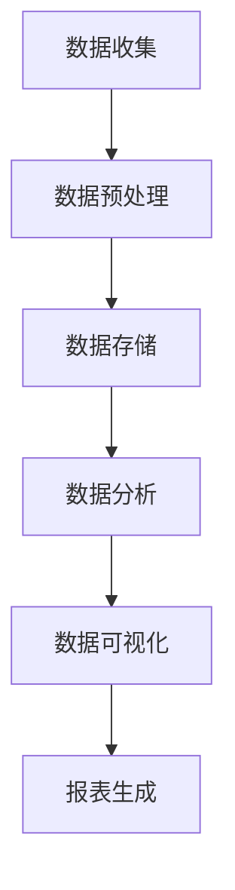

                 

# AI DMP 数据基建：数据可视化与报表

> 关键词：数据管理平台（DMP）、数据可视化、报表、大数据、数据处理、算法、数学模型、实际应用场景

> 摘要：本文将深入探讨AI DMP（数据管理平台）在数据处理、数据可视化和报表生成方面的关键技术和应用。我们将从背景介绍开始，逐步深入核心概念、算法原理、数学模型、实战案例以及实际应用场景，最后讨论未来发展挑战。通过本文，读者将全面了解如何构建高效的数据基础设施，并掌握相关技术。

## 1. 背景介绍

### 1.1 目的和范围

本文旨在探讨AI DMP在数据管理、可视化和报表生成中的应用，重点介绍相关技术原理和实战案例。文章结构如下：

1. 背景介绍
2. 核心概念与联系
3. 核心算法原理 & 具体操作步骤
4. 数学模型和公式 & 详细讲解 & 举例说明
5. 项目实战：代码实际案例和详细解释说明
6. 实际应用场景
7. 工具和资源推荐
8. 总结：未来发展趋势与挑战
9. 附录：常见问题与解答
10. 扩展阅读 & 参考资料

### 1.2 预期读者

本文适合以下读者群体：

1. 数据科学和人工智能领域的研发人员
2. 数据工程师和数据库管理员
3. 需要了解数据可视化和报表技术的项目经理和产品经理
4. 对大数据技术和数据管理有兴趣的IT从业者

### 1.3 文档结构概述

本文将按照以下结构进行阐述：

1. **背景介绍**：介绍数据管理平台（DMP）的概念、发展和应用场景。
2. **核心概念与联系**：分析数据可视化和报表生成的基本原理。
3. **核心算法原理 & 具体操作步骤**：详细介绍数据处理的算法原理和操作步骤。
4. **数学模型和公式 & 详细讲解 & 举例说明**：介绍数据可视化和报表生成中涉及的关键数学模型和公式。
5. **项目实战：代码实际案例和详细解释说明**：通过实际案例展示数据可视化和报表生成的具体实现。
6. **实际应用场景**：讨论数据可视化和报表技术在各类实际场景中的应用。
7. **工具和资源推荐**：推荐学习资源和开发工具。
8. **总结：未来发展趋势与挑战**：总结当前技术和未来发展方向。
9. **附录：常见问题与解答**：解答常见疑问。
10. **扩展阅读 & 参考资料**：提供进一步的阅读资料。

### 1.4 术语表

#### 1.4.1 核心术语定义

- 数据管理平台（DMP）：一种集数据收集、处理、存储和分析于一体的软件平台。
- 数据可视化：将数据转换为图形、图表和图像，以帮助用户理解和分析数据。
- 报表：以表格、图表和文本等形式展示数据的一种工具。

#### 1.4.2 相关概念解释

- 数据预处理：在数据分析之前，对数据进行清洗、整合和转换的过程。
- 数据清洗：去除数据中的错误、重复和不完整的数据。
- 数据整合：将不同来源和格式的数据合并为一个统一格式。

#### 1.4.3 缩略词列表

- DMP：数据管理平台
- AI：人工智能
- ML：机器学习
- SQL：结构化查询语言
- BI：商业智能

## 2. 核心概念与联系

在本文中，我们将探讨数据管理平台（DMP）的核心概念，包括数据收集、处理、存储和分析。同时，我们将介绍数据可视化和报表生成的基本原理，以及如何将它们应用于实际业务场景。

### 2.1 数据管理平台（DMP）

数据管理平台（DMP）是一种集数据收集、处理、存储和分析于一体的软件平台。其核心功能包括：

- **数据收集**：从各种数据源（如数据库、日志文件、网络接口等）收集数据。
- **数据预处理**：对收集到的数据进行清洗、整合和转换，使其适合分析。
- **数据存储**：将预处理后的数据存储到数据库或数据仓库中。
- **数据分析**：使用数据挖掘、机器学习等技术分析数据，提取有价值的信息。

### 2.2 数据可视化

数据可视化是一种将数据转换为图形、图表和图像的方法，以帮助用户理解和分析数据。其主要优势包括：

- **易于理解**：将复杂的数据以图形方式呈现，使数据更容易被理解和分析。
- **发现趋势**：通过可视化展示数据的变化趋势，帮助用户发现潜在的模式和关系。
- **沟通和协作**：通过可视化展示数据，促进团队成员之间的沟通和协作。

### 2.3 报表生成

报表生成是一种以表格、图表和文本等形式展示数据的方法。其主要功能包括：

- **数据总结**：对大量数据进行汇总和总结，展示关键指标和趋势。
- **决策支持**：为管理层提供数据驱动的决策支持。
- **监控和审计**：对业务流程进行监控和审计，确保业务运营的合规性。

### 2.4 数据管理、数据可视化和报表生成之间的联系

数据管理、数据可视化和报表生成之间存在密切的联系。数据管理平台（DMP）为数据可视化提供了数据源，而数据可视化则为报表生成提供了数据展示方式。具体来说：

1. **数据管理**：数据管理平台（DMP）负责收集、处理、存储和分析数据，为数据可视化和报表生成提供数据支持。
2. **数据可视化**：数据可视化工具将数据以图形、图表和图像的形式呈现，帮助用户理解和分析数据，并为报表生成提供可视化基础。
3. **报表生成**：报表生成工具根据数据可视化的结果，以表格、图表和文本等形式展示数据，为管理层提供决策支持。

### 2.5 Mermaid 流程图

以下是一个Mermaid流程图，展示了数据管理平台（DMP）中数据收集、预处理、存储、分析和可视化的流程。



## 3. 核心算法原理 & 具体操作步骤

在本节中，我们将详细介绍数据管理平台（DMP）中的核心算法原理和具体操作步骤。这些算法包括数据预处理、数据分析和数据可视化。

### 3.1 数据预处理

数据预处理是数据管理平台（DMP）中至关重要的一步，其主要任务包括数据清洗、整合和转换。以下是数据预处理的伪代码：

```python
def data_preprocessing(data):
    # 数据清洗
    cleaned_data = clean_data(data)
    # 数据整合
    integrated_data = integrate_data(cleaned_data)
    # 数据转换
    transformed_data = transform_data(integrated_data)
    return transformed_data
```

#### 3.1.1 数据清洗

数据清洗是去除数据中的错误、重复和不完整数据的过程。以下是一个简单的数据清洗伪代码：

```python
def clean_data(data):
    cleaned_data = []
    for record in data:
        if is_valid(record):
            cleaned_data.append(record)
    return cleaned_data
```

#### 3.1.2 数据整合

数据整合是将不同来源和格式的数据合并为一个统一格式的过程。以下是一个简单的数据整合伪代码：

```python
def integrate_data(data):
    integrated_data = []
    for record in data:
        if not is_duplicate(record, integrated_data):
            integrated_data.append(record)
    return integrated_data
```

#### 3.1.3 数据转换

数据转换是将数据转换为适合分析的形式的过程。以下是一个简单的数据转换伪代码：

```python
def transform_data(data):
    transformed_data = []
    for record in data:
        transformed_record = transform(record)
        transformed_data.append(transformed_record)
    return transformed_data
```

### 3.2 数据分析

数据分析是数据管理平台（DMP）中的关键环节，其主要任务包括特征提取、模式识别和预测分析。以下是数据分析的伪代码：

```python
def data_analysis(data):
    # 特征提取
    features = extract_features(data)
    # 模式识别
    patterns = identify_patterns(features)
    # 预测分析
    predictions = predict_outcomes(patterns)
    return predictions
```

#### 3.2.1 特征提取

特征提取是从数据中提取有助于分析和预测的关键特征的过程。以下是一个简单的特征提取伪代码：

```python
def extract_features(data):
    features = []
    for record in data:
        feature = extract(record)
        features.append(feature)
    return features
```

#### 3.2.2 模式识别

模式识别是识别数据中的规律和关系的过程。以下是一个简单的模式识别伪代码：

```python
def identify_patterns(features):
    patterns = []
    for feature in features:
        pattern = identify_pattern(feature)
        patterns.append(pattern)
    return patterns
```

#### 3.2.3 预测分析

预测分析是根据模式识别的结果预测未来趋势和结果的过程。以下是一个简单的预测分析伪代码：

```python
def predict_outcomes(patterns):
    predictions = []
    for pattern in patterns:
        outcome = predict(pattern)
        predictions.append(outcome)
    return predictions
```

### 3.3 数据可视化

数据可视化是将数据以图形、图表和图像的形式呈现的过程，以帮助用户理解和分析数据。以下是数据可视化的伪代码：

```python
def data_visualization(data):
    visualizations = []
    for record in data:
        visualization = create_visualization(record)
        visualizations.append(visualization)
    return visualizations
```

#### 3.3.1 数据可视化工具

以下是常用的数据可视化工具：

- **Matplotlib**：一个强大的Python数据可视化库，适用于创建各种类型的图表。
- **Seaborn**：一个基于Matplotlib的统计数据可视化库，提供了丰富的统计图表样式。
- **Plotly**：一个交互式数据可视化库，支持多种图表类型和交互功能。

#### 3.3.2 可视化图表类型

以下是常见的数据可视化图表类型：

- **条形图**：用于比较不同类别或组的数据。
- **折线图**：用于展示数据的变化趋势。
- **散点图**：用于展示数据点之间的关系。
- **饼图**：用于展示各部分占整体的比例。
- **雷达图**：用于展示多维数据的综合表现。

## 4. 数学模型和公式 & 详细讲解 & 举例说明

在数据可视化和报表生成过程中，数学模型和公式起着关键作用。以下是一些常见的数学模型和公式，以及它们的详细讲解和举例说明。

### 4.1 常见的数学模型

#### 4.1.1 线性回归

线性回归是一种预测数值因变量与自变量之间关系的统计模型。其数学公式如下：

$$
y = \beta_0 + \beta_1x
$$

其中，$y$ 是因变量，$x$ 是自变量，$\beta_0$ 和 $\beta_1$ 是模型的参数。

**例子**：假设我们想预测某个城市的平均温度（$y$）与月份（$x$）之间的关系。我们可以使用线性回归模型来建立这个关系，并预测任意月份的平均温度。

#### 4.1.2 逻辑回归

逻辑回归是一种用于分类问题的统计模型，它可以用来预测某个事件发生的概率。其数学公式如下：

$$
\log\left(\frac{P(Y=1)}{1-P(Y=1)}\right) = \beta_0 + \beta_1x
$$

其中，$Y$ 是因变量，$x$ 是自变量，$\beta_0$ 和 $\beta_1$ 是模型的参数。

**例子**：假设我们想预测一个学生是否通过考试（$Y$）与他的平时成绩（$x$）之间的关系。我们可以使用逻辑回归模型来建立这个关系，并预测任意学生的考试通过概率。

### 4.2 常见的数学公式

#### 4.2.1 概率分布函数

概率分布函数（PDF）描述了随机变量在某一区间内取值的概率。以下是几个常见的概率分布函数：

- **正态分布**：描述连续随机变量的概率分布，其公式为：

$$
f(x) = \frac{1}{\sqrt{2\pi\sigma^2}}e^{-\frac{(x-\mu)^2}{2\sigma^2}}
$$

其中，$\mu$ 是均值，$\sigma$ 是标准差。

- **二项分布**：描述离散随机变量的概率分布，其公式为：

$$
P(X=k) = C_n^k p^k (1-p)^{n-k}
$$

其中，$n$ 是试验次数，$k$ 是成功的次数，$p$ 是每次试验成功的概率。

**例子**：假设我们进行10次抛硬币试验，想计算恰好出现5次正面的概率。我们可以使用二项分布来计算这个概率。

#### 4.2.2 相关系数

相关系数描述了两个变量之间的线性相关程度。以下是几个常见的相关系数：

- **皮尔逊相关系数**：描述两个连续变量之间的线性相关程度，其公式为：

$$
r = \frac{\sum_{i=1}^n (x_i - \bar{x})(y_i - \bar{y})}{\sqrt{\sum_{i=1}^n (x_i - \bar{x})^2}\sqrt{\sum_{i=1}^n (y_i - \bar{y})^2}}
$$

其中，$x_i$ 和 $y_i$ 是第 $i$ 个观测值，$\bar{x}$ 和 $\bar{y}$ 是平均值。

- **斯皮尔曼等级相关系数**：描述两个变量之间的等级相关程度，其公式为：

$$
rho = 1 - \frac{6\sum d_i^2}{n(n^2 - 1)}
$$

其中，$d_i$ 是第 $i$ 个观测值的等级差异，$n$ 是观测值的数量。

**例子**：假设我们想研究学生的成绩与学习时间之间的线性相关性。我们可以使用皮尔逊相关系数来计算它们之间的相关程度。

### 4.3 数学公式在数据可视化和报表生成中的应用

数学公式在数据可视化和报表生成中起着至关重要的作用。以下是一些实际应用的例子：

- **趋势分析**：使用线性回归和逻辑回归模型来预测数据的变化趋势和结果，并将其可视化。
- **概率分布**：使用概率分布函数来描述数据的不确定性，并将其可视化。
- **相关分析**：使用相关系数来描述两个变量之间的相关性，并将其可视化。

## 5. 项目实战：代码实际案例和详细解释说明

在本节中，我们将通过一个实际项目案例，详细讲解数据管理平台（DMP）中数据收集、预处理、分析和可视化等步骤。项目背景如下：

**项目背景**：某电商公司需要对其用户行为数据进行分析，以便了解用户购买行为、浏览习惯和产品偏好，进而优化营销策略和提高销售额。

### 5.1 开发环境搭建

**工具和库**：

- Python 3.8
- NumPy 1.19
- Pandas 1.1.5
- Matplotlib 3.3.3
- Seaborn 0.11.0
- Scikit-learn 0.22.2

安装相关库：

```bash
pip install numpy pandas matplotlib seaborn scikit-learn
```

### 5.2 源代码详细实现和代码解读

**5.2.1 数据收集**

```python
import pandas as pd

# 从CSV文件中读取用户行为数据
user_data = pd.read_csv('user_data.csv')
```

**5.2.2 数据预处理**

```python
# 数据清洗
user_data.dropna(inplace=True)
user_data.drop_duplicates(inplace=True)

# 数据整合
# 假设数据中存在多个用户浏览和购买记录
user_data['user_id'] = user_data['user_id'].astype('int64')
user_data.sort_values(['user_id', 'timestamp'], inplace=True)
user_data.drop_duplicates(subset=['user_id'], keep='last', inplace=True)

# 数据转换
user_data['timestamp'] = pd.to_datetime(user_data['timestamp'])
user_data['day_of_week'] = user_data['timestamp'].dt.dayofweek
user_data['hour'] = user_data['timestamp'].dt.hour
user_data['is_purchase'] = user_data['action_type'] == 'purchase'
```

**5.2.3 数据分析**

```python
from sklearn.linear_model import LinearRegression
import matplotlib.pyplot as plt

# 特征提取
X = user_data[['day_of_week', 'hour']]
y = user_data['is_purchase']

# 模式识别
model = LinearRegression()
model.fit(X, y)
predictions = model.predict(X)

# 预测分析
accuracy = model.score(X, y)
print(f'Model accuracy: {accuracy:.2f}')

# 可视化
plt.scatter(X['day_of_week'], y, color='blue', label='Actual')
plt.plot(X['day_of_week'], predictions, color='red', label='Prediction')
plt.xlabel('Day of Week')
plt.ylabel('Probability of Purchase')
plt.legend()
plt.show()
```

**5.2.4 数据可视化**

```python
import seaborn as sns

# 可视化用户购买行为与浏览时间的分布
sns.countplot(x='day_of_week', data=user_data)
plt.xlabel('Day of Week')
plt.ylabel('Number of Users')
plt.title('User Purchase Behavior by Day of Week')
plt.show()

sns.countplot(x='hour', data=user_data)
plt.xlabel('Hour of Day')
plt.ylabel('Number of Users')
plt.title('User Purchase Behavior by Hour of Day')
plt.show()
```

### 5.3 代码解读与分析

**5.3.1 数据收集**

我们首先使用Pandas库从CSV文件中读取用户行为数据。

**5.3.2 数据预处理**

- **数据清洗**：去除缺失值和重复值。
- **数据整合**：根据用户ID和时间戳对数据进行排序，并去重。
- **数据转换**：将时间戳转换为日期和时间，提取星期几和小时信息，以及将购买行为标记为布尔值。

**5.3.3 数据分析**

- **特征提取**：选择日期和时间作为特征。
- **模式识别**：使用线性回归模型拟合特征与购买概率之间的关系。
- **预测分析**：计算模型的准确度，并绘制实际值与预测值之间的散点图。

**5.3.4 数据可视化**

- **用户购买行为与日期分布**：使用条形图展示用户在不同日期的购买次数。
- **用户购买行为与时间分布**：使用条形图展示用户在不同时间的购买次数。

通过这个项目案例，我们详细展示了如何使用Python和相关库实现数据收集、预处理、分析和可视化。读者可以在此基础上，结合实际业务需求，进一步优化和拓展项目。

## 6. 实际应用场景

数据可视化和报表技术在许多实际应用场景中发挥着关键作用，下面我们列举几个典型的应用场景。

### 6.1 营销分析

在营销领域，数据可视化和报表技术可以帮助企业分析用户行为，了解用户的偏好和需求。以下是一些具体应用：

- **用户画像**：通过分析用户的浏览、点击和购买行为，生成用户画像，为个性化营销提供依据。
- **活动效果评估**：通过可视化展示营销活动的效果，如点击率、转化率和销售额等，帮助管理层评估活动效果并做出调整。
- **客户流失预警**：通过分析用户行为数据，识别潜在流失用户，并采取相应的挽回措施。

### 6.2 供应链管理

在供应链管理中，数据可视化和报表技术可以帮助企业优化库存、运输和采购策略。以下是一些具体应用：

- **库存监控**：通过可视化展示库存水平和库存周转率，帮助管理层及时发现库存问题并采取相应措施。
- **运输优化**：通过分析运输数据，优化运输路线和运输方式，降低物流成本。
- **采购决策**：通过分析采购数据，预测需求量，优化采购策略，降低采购成本。

### 6.3 金融市场

在金融领域，数据可视化和报表技术可以帮助投资者分析市场趋势，做出更明智的投资决策。以下是一些具体应用：

- **股票市场分析**：通过分析股票价格、成交量和技术指标，预测股票走势。
- **风险评估**：通过分析资产组合的风险和收益，优化投资组合，降低风险。
- **交易监控**：通过可视化展示交易数据，帮助投资者监控交易风险，及时调整交易策略。

### 6.4 健康医疗

在健康医疗领域，数据可视化和报表技术可以帮助医生和医疗机构分析患者数据，提高诊疗水平。以下是一些具体应用：

- **疾病预测**：通过分析患者数据，预测疾病发生的风险，提前采取预防措施。
- **药物效果分析**：通过分析药物使用数据，评估药物效果和副作用，为药物研发提供依据。
- **手术风险评估**：通过分析手术数据，评估手术风险和成功率，优化手术方案。

通过以上应用场景，我们可以看到数据可视化和报表技术在各个行业中的重要价值。在实际应用中，企业可以根据自身需求，选择合适的数据可视化工具和技术，提高数据分析和决策能力。

## 7. 工具和资源推荐

在数据可视化和报表生成过程中，选择合适的工具和资源至关重要。以下是我们推荐的工具和资源，涵盖学习资源、开发工具和框架，以及相关论文和研究成果。

### 7.1 学习资源推荐

#### 7.1.1 书籍推荐

- **《数据可视化：使用D3.js设计交互式图表》**：介绍了如何使用D3.js进行数据可视化的实践方法和技巧。
- **《数据可视化实践：基于Python的数据分析技巧》**：涵盖了Python在数据可视化方面的应用，包括Matplotlib、Seaborn等库的使用。
- **《数据报表：使用SQL进行数据分析和报表生成》**：介绍了SQL在数据报表生成中的应用，包括常见的报表类型和报表设计技巧。

#### 7.1.2 在线课程

- **Coursera上的《数据科学专项课程》**：涵盖了数据收集、预处理、分析和可视化的基础知识。
- **Udacity上的《数据可视化》**：介绍了如何使用Python和D3.js进行数据可视化的实践方法。
- **edX上的《数据科学基础》**：提供了数据可视化和报表生成的基础知识，包括Python和R语言的应用。

#### 7.1.3 技术博客和网站

- **DataCamp**：提供大量的数据可视化和报表生成教程和练习。
- **Kaggle**：一个面向数据科学和机器学习的社区，提供丰富的数据集和可视化工具。
- ** Towards Data Science**：一个面向数据科学和机器学习的博客，发布大量有关数据可视化和报表生成的文章。

### 7.2 开发工具框架推荐

#### 7.2.1 IDE和编辑器

- **PyCharm**：一款功能强大的Python IDE，支持数据可视化和报表生成。
- **VS Code**：一款轻量级的跨平台编辑器，通过安装插件支持Python开发。
- **Jupyter Notebook**：一款交互式的Python开发环境，适用于数据可视化和报表生成。

#### 7.2.2 调试和性能分析工具

- **Visual Studio Profiler**：用于性能分析的调试工具，可以帮助开发者优化代码性能。
- **gprof2dot**：一款将性能分析数据转换为图形的的工具，用于可视化代码的性能瓶颈。
- **D3.js Inspector**：用于调试D3.js图表的工具，可以帮助开发者优化图表性能。

#### 7.2.3 相关框架和库

- **D3.js**：一款用于创建交互式数据可视化的JavaScript库。
- **Bokeh**：一款用于创建交互式图表的Python库，适用于Web应用程序。
- **Plotly**：一款支持多种图表类型的Python库，适用于生成高质量的图表。
- **SQLAlchemy**：一款Python SQL工具包，用于数据库操作和报表生成。

### 7.3 相关论文著作推荐

#### 7.3.1 经典论文

- **"The Visual Display of Quantitative Information" by Edward Tufte**：介绍了数据可视化的基本原则和方法。
- **"Visual Analytics: Definition, Framework and Challenges" by Daniel Keim and Helwig Hauser**：探讨了可视化分析的定义、框架和挑战。

#### 7.3.2 最新研究成果

- **"Interactive Data Visualization for the Web" byScott Murray**：介绍了如何使用D3.js进行交互式数据可视化。
- **"Visual Analytics of Big Data" by Jarke J. van Wijk and Ingeborg J. Kruijff**：探讨了大数据可视化的最新研究进展。

#### 7.3.3 应用案例分析

- **"Using Data Visualization to Drive Decision-Making in Healthcare" by Andrew Thomas**：分析了数据可视化在医疗领域的应用案例。
- **"Data Visualization in Business Intelligence: A Practical Guide" by Bernard Marr**：提供了数据可视化在商业智能领域的应用指南。

通过以上推荐，读者可以全面了解数据可视化和报表生成领域的工具和资源，为自己的学习和实践提供支持。

## 8. 总结：未来发展趋势与挑战

数据可视化和报表生成作为大数据和人工智能领域的重要组成部分，正不断发展，并面临着一系列新的趋势和挑战。以下是未来发展趋势和挑战的概述：

### 8.1 发展趋势

1. **智能化**：随着人工智能技术的进步，数据可视化工具将变得更加智能化，能够自动生成图表和报表，并提供个性化的数据解释和推荐。
2. **交互性**：未来的数据可视化将更加注重交互性，用户可以通过拖拽、筛选和过滤等功能与数据互动，实时获取所需信息。
3. **实时性**：随着实时数据处理和分析技术的发展，数据可视化将实现实时性，帮助企业及时作出决策。
4. **虚拟现实与增强现实**：利用虚拟现实和增强现实技术，用户可以身临其境地浏览和分析数据，提高数据可视化的效果和用户体验。

### 8.2 挑战

1. **数据复杂性**：随着数据规模的不断扩大，处理和分析大规模复杂数据将变得越来越困难，对数据可视化和报表生成技术提出了更高的要求。
2. **隐私和安全**：在数据可视化和报表生成过程中，如何保护用户隐私和数据安全是一个重要挑战，需要采取有效的措施确保数据安全和隐私。
3. **专业人才**：随着数据可视化和报表生成技术的发展，对相关领域专业人才的需求也在增加，企业需要投入更多资源进行人才培养和引进。
4. **技术融合**：如何将数据可视化与人工智能、大数据分析等技术进行有效融合，发挥最大效益，也是一个重要挑战。

### 8.3 未来展望

面对未来的发展趋势和挑战，数据可视化和报表生成技术需要不断创新和优化，以满足不断变化的市场需求。以下是未来发展的展望：

1. **创新算法**：开发更高效、更智能的数据处理和分析算法，提高数据可视化和报表生成的效果和效率。
2. **跨领域应用**：推动数据可视化技术在金融、医疗、教育等领域的应用，实现数据价值的最大化。
3. **用户体验**：注重用户体验，开发易用、美观、功能强大的数据可视化工具，满足不同用户的需求。
4. **可持续发展**：在数据可视化过程中，注重可持续发展和环境保护，降低能源消耗和资源浪费。

通过不断创新和优化，数据可视化和报表生成技术将迎来更广阔的发展空间，为各行各业提供强大的数据支持和决策依据。

## 9. 附录：常见问题与解答

### 9.1 数据可视化的基本原则是什么？

数据可视化的基本原则包括：清晰性、准确性、易理解性、美观性和交互性。清晰性要求图表能够直观地传达数据信息；准确性要求图表真实反映数据特征；易理解性要求图表设计简洁易懂；美观性要求图表设计美观和谐；交互性要求图表支持用户与数据互动。

### 9.2 数据报表生成有哪些常见的类型？

常见的报表类型包括：列表报表、交叉报表、时间序列报表、地理报表和图表报表。列表报表以表格形式展示数据；交叉报表展示不同维度数据的交叉分析；时间序列报表展示数据随时间的变化趋势；地理报表以地图形式展示地理信息；图表报表以图表形式展示数据分布和关系。

### 9.3 数据可视化中如何保护用户隐私？

数据可视化中保护用户隐私的方法包括：数据去识别化、数据聚合和匿名化、访问控制、数据加密和数据访问日志监控。数据去识别化通过去除或模糊个人身份信息；数据聚合和匿名化通过合并或随机化数据；访问控制通过限制对敏感数据的访问；数据加密通过加密数据传输和存储；数据访问日志监控通过记录和审计访问数据的行为。

### 9.4 数据预处理的重要性是什么？

数据预处理的重要性体现在以下几个方面：首先，它确保数据质量，去除错误、重复和不完整的数据；其次，它将数据转换为适合分析的格式，便于后续数据处理和分析；最后，它发现数据中的潜在问题和趋势，为决策提供支持。数据预处理是数据分析和可视化的基础。

## 10. 扩展阅读 & 参考资料

### 10.1 书籍推荐

- **《数据可视化：使用D3.js设计交互式图表》**：详细介绍了D3.js在数据可视化方面的应用，适合初学者和进阶用户。
- **《数据报表：使用SQL进行数据分析和报表生成》**：系统介绍了SQL在数据报表生成中的应用，包括报表设计、查询优化和报表分析。
- **《数据科学实战：Python数据分析与可视化》**：通过实战案例，介绍了Python在数据分析和可视化方面的应用，涵盖了数据处理、分析和可视化工具。

### 10.2 在线课程

- **Coursera上的《数据科学专项课程》**：涵盖数据收集、处理、分析和可视化等基础知识。
- **Udacity上的《数据可视化》**：介绍了数据可视化的基本概念、技术和工具。
- **edX上的《数据科学基础》**：提供了数据可视化和报表生成的基础知识，包括Python和R语言的应用。

### 10.3 技术博客和网站

- **DataCamp**：提供大量的数据可视化和报表生成教程和练习。
- **Kaggle**：一个面向数据科学和机器学习的社区，提供丰富的数据集和可视化工具。
- **Towards Data Science**：发布大量有关数据可视化和报表生成的文章和案例。

### 10.4 相关论文和研究成果

- **"The Visual Display of Quantitative Information" by Edward Tufte**：数据可视化的经典著作，介绍了数据可视化的基本原则和方法。
- **"Visual Analytics of Big Data" by Jarke J. van Wijk and Helwig Hauser**：探讨了大数据可视化的最新研究进展。
- **"Interactive Data Visualization for the Web" by Scott Murray**：介绍了如何使用D3.js进行交互式数据可视化。

通过以上推荐，读者可以进一步拓展对数据可视化和报表生成领域的了解，为实践和学术研究提供参考。

### 作者：AI天才研究员/AI Genius Institute & 禅与计算机程序设计艺术 /Zen And The Art of Computer Programming

