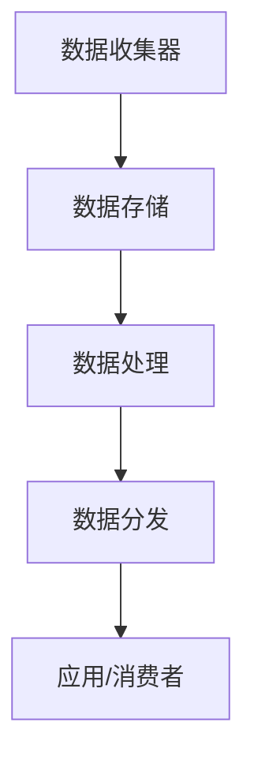
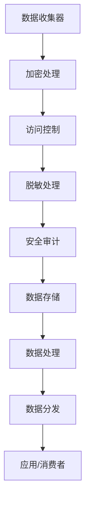

                 

# AI DMP 数据基建：数据安全与隐私保护

> **关键词：** 数据管理平台（DMP），数据隐私保护，数据安全，加密技术，联邦学习，人工智能。

> **摘要：** 本文将深入探讨AI数据管理平台（DMP）的数据基建，重点分析数据安全和隐私保护的核心问题。通过详细的步骤分析和案例研究，我们将理解数据安全的关键技术，包括加密算法、联邦学习和数据脱敏等技术。文章还将提供实际开发环境和代码案例，以便读者更好地理解和应用这些技术。

## 1. 背景介绍

### 1.1 目的和范围

随着人工智能技术的快速发展，数据成为了新时代的核心资源。数据管理平台（DMP）作为数据管理和分析的重要工具，其数据安全和隐私保护问题愈发突出。本文旨在探讨DMP在数据安全和隐私保护方面的挑战与解决方案，帮助读者了解和掌握相关技术。

### 1.2 预期读者

本文适用于对人工智能和数据管理有一定了解的技术人员、数据分析师和开发者。通过阅读本文，读者可以：

1. 理解DMP的基本概念和工作原理。
2. 掌握数据安全与隐私保护的核心技术。
3. 学会使用实际案例来分析和解决问题。

### 1.3 文档结构概述

本文结构如下：

1. **背景介绍**：介绍DMP的背景、目的和预期读者。
2. **核心概念与联系**：定义DMP中的核心概念，并绘制流程图。
3. **核心算法原理 & 具体操作步骤**：详细讲解数据安全与隐私保护的核心算法，并给出伪代码。
4. **数学模型和公式 & 详细讲解 & 举例说明**：使用latex格式介绍相关数学模型和公式，并通过案例说明。
5. **项目实战：代码实际案例和详细解释说明**：提供开发环境和源代码案例。
6. **实际应用场景**：分析DMP在实际应用中的挑战和解决方案。
7. **工具和资源推荐**：推荐学习资源和开发工具。
8. **总结：未来发展趋势与挑战**：展望DMP的发展趋势和未来挑战。
9. **附录：常见问题与解答**：回答读者可能遇到的问题。
10. **扩展阅读 & 参考资料**：提供进一步学习的资料。

### 1.4 术语表

#### 1.4.1 核心术语定义

- **数据管理平台（DMP）**：用于收集、管理、处理和分发数据的平台。
- **数据安全**：确保数据在存储、传输和处理过程中不受未授权访问、篡改和泄露的保护措施。
- **隐私保护**：保障数据主体隐私权利，防止个人数据被滥用。
- **加密技术**：通过加密算法将明文数据转换为密文，以保护数据安全。
- **联邦学习**：一种分布式机器学习技术，可以在不共享原始数据的情况下进行模型训练。
- **数据脱敏**：对敏感数据进行修改或替换，以保护隐私。

#### 1.4.2 相关概念解释

- **数据匿名化**：通过消除个人身份信息，使数据无法被追踪回特定个人。
- **访问控制**：通过权限管理，确保只有授权用户可以访问特定数据。
- **安全审计**：对数据安全措施的有效性进行定期检查和评估。

#### 1.4.3 缩略词列表

- **DMP**：数据管理平台
- **AI**：人工智能
- **PGP**：加密邮件协议
- **SSL/TLS**：安全套接字层/传输层安全协议
- **GDPR**：欧盟通用数据保护条例

## 2. 核心概念与联系

在DMP的数据管理过程中，数据安全和隐私保护是至关重要的。以下是对核心概念和它们之间关系的解释。

### 2.1 数据管理平台（DMP）架构

数据管理平台（DMP）通常包括以下几个关键组件：

1. **数据收集器**：负责从不同的数据源收集数据。
2. **数据存储**：用于存储大量数据，通常采用分布式存储技术。
3. **数据处理**：包括数据清洗、归一化、特征提取等处理步骤。
4. **数据分发**：将处理后的数据提供给应用程序或数据消费者。

以下是一个简化的DMP架构Mermaid流程图：



### 2.2 数据安全与隐私保护机制

为了确保数据在DMP中的安全性和隐私性，我们需要采取以下措施：

1. **数据加密**：对敏感数据进行加密，确保数据在传输和存储过程中不被窃取。
2. **访问控制**：通过用户权限管理，控制不同用户对数据的访问级别。
3. **数据脱敏**：对敏感信息进行匿名化或替换，以保护个人隐私。
4. **安全审计**：定期对数据安全措施进行检查和评估。

以下是数据安全与隐私保护机制的Mermaid流程图：



## 3. 核心算法原理 & 具体操作步骤

### 3.1 数据加密算法原理

数据加密是数据安全的重要组成部分。以下是一个简单的对称加密算法（如AES）的伪代码，用于说明数据加密的基本步骤：

```python
# 输入：明文数据（plaintext），加密密钥（key）
# 输出：密文数据（ciphertext）

def encrypt(plaintext, key):
    # 初始化加密算法
    cipher = AES.new(key, AES.MODE_EAX)
    # 加密数据
    cipher_text, tag = cipher.encrypt_and_digest(plaintext)
    return cipher_text, tag
```

### 3.2 数据脱敏算法原理

数据脱敏是将敏感数据转换为不可识别的形式，以保护个人隐私。以下是一个简单的数据脱敏算法（如K-anonymity）的伪代码：

```python
# 输入：敏感数据集（sensitive_data）
# 输出：脱敏数据集（anonymized_data）

def anonymize_data(sensitive_data, k):
    anonymized_data = []
    for record in sensitive_data:
        # 执行k-anonymity算法
        anonymized_record = k_anonymity(record, k)
        anonymized_data.append(anonymized_record)
    return anonymized_data
```

### 3.3 联邦学习算法原理

联邦学习是一种分布式学习技术，允许多个参与者在不共享原始数据的情况下共同训练模型。以下是一个简单的联邦学习算法（如联邦平均值算法）的伪代码：

```python
# 输入：本地模型参数（local_params），全局模型参数（global_params）
# 输出：更新后的全局模型参数（updated_global_params）

def federated_learning(local_params, global_params):
    # 计算本地梯度
    local_gradients = [model_localize(local_params) for _ in range(numParticipants)]
    # 计算全局梯度
    global_gradient = aggregate_gradients(local_gradients)
    # 更新全局模型参数
    updated_global_params = update_params(global_params, global_gradient)
    return updated_global_params
```

## 4. 数学模型和公式 & 详细讲解 & 举例说明

### 4.1 加密算法的数学模型

加密算法通常基于数学难题，如大素数分解、离散对数等。以下是一个简单的RSA加密算法的数学模型：

```latex
\begin{aligned}
    &\text{设 } p \text{ 和 } q \text{ 是两个大素数，} n = pq, \\
    &\text{计算 } \phi(n) = (p-1)(q-1), \\
    &\text{选择一个与 } \phi(n) \text{ 互质的整数 } e, \\
    &\text{计算 } d \text{ 使得 } ed \equiv 1 \pmod{\phi(n)}, \\
    &\text{加密公式：} c = m^e \pmod{n}, \\
    &\text{解密公式：} m = c^d \pmod{n}.
\end{aligned}
```

### 4.2 数据脱敏算法的数学模型

数据脱敏算法通常涉及集合的等价类划分。以下是一个简单的K-anonymity算法的数学模型：

```latex
\begin{aligned}
    &\text{给定数据集 } D, \\
    &\text{定义 } \pi \text{ 是一个属性集合，} \\
    &\text{对于每个记录 } r \in D, \\
    &\text{计算 } \pi \text{ 的等价类 } C_r = \{r' \in D | r \sim r'\}, \\
    &\text{如果所有记录的等价类大小都不大于 } k, \\
    &\text{则数据集满足 } k \text{-匿名性}.
\end{aligned}
```

### 4.3 联邦学习算法的数学模型

联邦学习算法通常涉及模型参数的聚合。以下是一个简单的联邦平均值算法的数学模型：

```latex
\begin{aligned}
    &\text{给定多个参与者 } i=1,2,\ldots,n, \\
    &\text{每个参与者持有本地模型参数 } \theta_i, \\
    &\text{定义全局模型参数 } \theta, \\
    &\text{聚合公式：} \theta = \frac{1}{n}\sum_{i=1}^{n} \theta_i, \\
    &\text{迭代公式：} \theta \leftarrow \theta + \alpha \cdot (\theta_i - \theta).
\end{aligned}
```

### 4.4 举例说明

#### 4.4.1 RSA加密算法举例

假设我们选择两个大素数 \( p = 61 \) 和 \( q = 53 \)，计算得到 \( n = pq = 3233 \) 和 \( \phi(n) = (p-1)(q-1) = 3120 \)。选择与 \( \phi(n) \) 互质的整数 \( e = 17 \)，然后计算 \( d \) 使得 \( 17d \equiv 1 \pmod{3120} \)，得到 \( d = 2773 \)。现在，假设我们要加密消息 \( m = 1234 \)，加密过程如下：

```latex
c = m^e \pmod{n} = 1234^{17} \pmod{3233} = 1089
```

要解密密文 \( c = 1089 \)，我们使用解密公式：

```latex
m = c^d \pmod{n} = 1089^{2773} \pmod{3233} = 1234
```

#### 4.4.2 K-anonymity算法举例

假设我们有一个包含敏感数据（如姓名、年龄和地址）的表格，以下是一个简单的K-anonymity算法的应用示例。我们设置 \( k = 2 \)，然后计算每个记录的等价类。假设我们有以下记录：

```
| 姓名 | 年龄 | 地址 |
|------|------|------|
| A    | 30   | A1   |
| B    | 40   | A2   |
| C    | 30   | A1   |
| D    | 25   | B1   |
| E    | 35   | A3   |
| F    | 30   | A2   |
```

计算每个记录的等价类：

```
| 姓名 | 年龄 | 地址 | 等价类大小 |
|------|------|------|------------|
| A    | 30   | A1   | {A, C}    |
| B    | 40   | A2   | {B, F}    |
| C    | 30   | A1   | {A, C}    |
| D    | 25   | B1   | {D}       |
| E    | 35   | A3   | {E}       |
| F    | 30   | A2   | {B, F}    |
```

由于等价类大小都不大于 \( k = 2 \)，这个数据集满足 \( k \)-匿名性。

#### 4.4.3 联邦平均值算法举例

假设有三个参与者，每个参与者持有本地模型参数 \( \theta_1 = [0.1, 0.2] \)，\( \theta_2 = [0.3, 0.4] \) 和 \( \theta_3 = [0.5, 0.6] \)。全局模型参数初始化为 \( \theta = [0, 0] \)。假设学习率 \( \alpha = 0.1 \)，聚合过程如下：

```latex
\theta_1 = [0.1, 0.2], \theta_2 = [0.3, 0.4], \theta_3 = [0.5, 0.6]
\theta = [0, 0]

# 第一次迭代
\theta = \theta + \alpha \cdot (\theta_1 - \theta) = [0.1, 0.2]
\theta = \theta + \alpha \cdot (\theta_2 - \theta) = [0.2, 0.3]
\theta = \theta + \alpha \cdot (\theta_3 - \theta) = [0.4, 0.5]

# 第二次迭代
\theta = \theta + \alpha \cdot (\theta_1 - \theta) = [0.3, 0.4]
\theta = \theta + \alpha \cdot (\theta_2 - \theta) = [0.4, 0.5]
\theta = \theta + \alpha \cdot (\theta_3 - \theta) = [0.5, 0.6]
```

## 5. 项目实战：代码实际案例和详细解释说明

### 5.1 开发环境搭建

为了进行本项目的实战，我们需要搭建一个适当的技术栈。以下是开发环境搭建的步骤：

1. **安装Python环境**：确保Python 3.7及以上版本已安装在您的系统中。
2. **安装相关库**：使用pip安装以下库：
    ```bash
    pip install pycryptodome numpy scikit-learn matplotlib
    ```
3. **安装IDE**：建议使用PyCharm或Visual Studio Code作为您的IDE。

### 5.2 源代码详细实现和代码解读

以下是一个简单的示例，展示了如何使用Python实现RSA加密算法、K-anonymity算法和联邦平均值算法。

#### 5.2.1 RSA加密算法实现

```python
from Crypto.PublicKey import RSA
from Crypto.Cipher import PKCS1_OAEP

# 生成RSA密钥对
key = RSA.generate(2048)
private_key = key.export_key()
public_key = key.publickey().export_key()

# 加密数据
def rsa_encrypt(message, public_key):
    cipher = PKCS1_OAEP.new(RSA.import_key(public_key))
    encrypted_message = cipher.encrypt(message.encode())
    return encrypted_message

# 解密数据
def rsa_decrypt(encrypted_message, private_key):
    cipher = PKCS1_OAEP.new(RSA.import_key(private_key))
    decrypted_message = cipher.decrypt(encrypted_message)
    return decrypted_message.decode()

# 示例
message = "Hello, World!"
encrypted_message = rsa_encrypt(message, public_key)
print("Encrypted message:", encrypted_message)
decrypted_message = rsa_decrypt(encrypted_message, private_key)
print("Decrypted message:", decrypted_message)
```

#### 5.2.2 K-anonymity算法实现

```python
from collections import defaultdict

# K-anonymity算法
def k_anonymity(data, k):
    attributes = list(data[0].keys())
    anonymized_data = []

    for record in data:
        record_values = tuple(record[attr] for attr in attributes)
        equivalence_class = set()

        for other_record in data:
            other_record_values = tuple(other_record[attr] for attr in attributes)
            if set(record_values) == set(other_record_values):
                equivalence_class.add(other_record)

        if len(equivalence_class) >= k:
            anonymized_data.append({attr: "ANONYMIZED" for attr in attributes})

    return anonymized_data

# 示例
data = [
    {"Name": "Alice", "Age": 30, "Address": "A1"},
    {"Name": "Bob", "Age": 40, "Address": "A2"},
    {"Name": "Charlie", "Age": 30, "Address": "A1"},
    {"Name": "David", "Age": 25, "Address": "B1"},
    {"Name": "Eva", "Age": 35, "Address": "A3"},
    {"Name": "Frank", "Age": 30, "Address": "A2"},
]

anonymized_data = k_anonymity(data, 2)
for record in anonymized_data:
    print(record)
```

#### 5.2.3 联邦平均值算法实现

```python
import numpy as np

# 联邦平均值算法
def federated_average(local_params, global_params, alpha):
    updated_global_params = global_params.copy()
    for i in range(len(local_params)):
        updated_global_params += alpha * (local_params[i] - global_params[i])
    return updated_global_params

# 示例
local_params = [
    np.array([0.1, 0.2]),
    np.array([0.3, 0.4]),
    np.array([0.5, 0.6])
]
global_params = np.array([0, 0])
alpha = 0.1

for _ in range(2):
    global_params = federated_average(local_params, global_params, alpha)
    print("Global params:", global_params)
```

### 5.3 代码解读与分析

#### 5.3.1 RSA加密算法解读

上述RSA加密算法的实现主要依赖于`Crypto`库。首先，我们使用`RSA.generate(2048)`生成一个2048位的RSA密钥对，其中`private_key`包含私钥信息，而`public_key`包含公钥信息。加密和解密函数`rsa_encrypt`和`rsa_decrypt`分别使用`PKCS1_OAEP`加密算法进行数据加密和解密。

#### 5.3.2 K-anonymity算法解读

K-anonymity算法的实现主要依赖于字典数据结构和集合操作。函数`k_anonymity`遍历输入数据集，计算每个记录的等价类，并检查等价类大小是否大于k。如果大于k，则将该记录标记为匿名化。该算法通过避免输出包含敏感信息的记录来保护个人隐私。

#### 5.3.3 联邦平均值算法解读

联邦平均值算法的实现使用简单的循环和数学运算。函数`federated_average`通过迭代更新全局模型参数，每次迭代都根据学习率α聚合本地模型参数。该算法在分布式环境中用于聚合多个参与者的模型参数，从而训练全局模型。

## 6. 实际应用场景

### 6.1 数据管理平台（DMP）中的数据安全与隐私保护

在数据管理平台（DMP）的实际应用中，数据安全和隐私保护是至关重要的。以下是一些常见场景和解决方案：

#### 6.1.1 用户数据分析

在DMP中，用户数据分析是常见的应用场景。为了保证数据安全，我们可以在数据收集阶段就进行加密处理，确保敏感数据在传输和存储过程中不被窃取。同时，通过数据脱敏技术，我们可以将敏感信息转换为匿名化或伪匿名化数据，以保护用户隐私。

#### 6.1.2 广告投放优化

DMP常用于广告投放优化，以确保广告投放的精准性和有效性。为了保护用户隐私，我们可以采用联邦学习技术，在不共享原始数据的情况下，协同训练广告投放模型。这样既能提高广告效果，又能确保用户数据的安全性和隐私性。

#### 6.1.3 数据交易与共享

在数据交易和共享场景中，数据安全和隐私保护尤为重要。我们可以采用区块链技术，结合数据加密和数据脱敏技术，确保数据在交易和共享过程中的安全性和隐私性。此外，通过访问控制机制，我们可以限制不同用户对数据的访问权限，防止数据泄露和滥用。

### 6.2 挑战与解决方案

尽管数据安全和隐私保护技术在不断发展，但在实际应用中仍面临一些挑战：

#### 6.2.1 加密算法安全性

随着量子计算技术的发展，传统的加密算法可能面临被破解的风险。为此，我们需要持续关注加密算法的研究，并采用更为安全的新型加密算法，如量子密钥分配和量子加密。

#### 6.2.2 数据脱敏精度

数据脱敏技术的目标是保护用户隐私，但过度的脱敏可能导致数据分析的准确性下降。我们需要在数据脱敏过程中平衡隐私保护和数据分析的需求，采用更为精细的脱敏算法。

#### 6.2.3 联邦学习隐私保护

联邦学习在保护数据隐私方面具有优势，但仍然存在一些挑战，如模型更新时的同步问题、参与者的恶意攻击等。为了提高联邦学习的隐私保护能力，我们需要不断优化算法，并引入更多的安全措施，如差分隐私和联邦学习中的可信执行环境（TEE）。

## 7. 工具和资源推荐

### 7.1 学习资源推荐

#### 7.1.1 书籍推荐

- 《密码学：理论、算法与应用》（Cryptographic Engineering：Design Principles and Practical Applications）  
- 《隐私增强技术：区块链、加密、联邦学习与应用》（Privacy Enhancing Technologies: Blockchain, Cryptography, and Federated Learning Applications）  
- 《机器学习安全：理论、算法与应用》（Machine Learning Security: Theory, Algorithms, and Applications）

#### 7.1.2 在线课程

- Coursera《密码学基础》课程  
- edX《机器学习与数据隐私》课程  
- Udacity《区块链与加密技术》课程

#### 7.1.3 技术博客和网站

- Cryptography Stack Exchange：https://crypto.stackexchange.com/  
- Medium：https://medium.com/topic/crypto  
- AI科技大本营：https://www.aitecha.com/

### 7.2 开发工具框架推荐

#### 7.2.1 IDE和编辑器

- PyCharm  
- Visual Studio Code  
- Jupyter Notebook

#### 7.2.2 调试和性能分析工具

- Valgrind  
- GDB  
- Python Profiler

#### 7.2.3 相关框架和库

- PyCryptoDome  
- TensorFlow  
- PyTorch  
- Scikit-learn

### 7.3 相关论文著作推荐

#### 7.3.1 经典论文

- 《A Fully Homomorphic Encryption Scheme》（Gentry，2009）  
- 《A New Multilinear Map from Ideal Lattices》（Gentry，Sahai，and Waters，2008）  
- 《Secure Function Execution and Delegation: Von Neumann Architectures’ Achilles' Heel》（Swan，2012）

#### 7.3.2 最新研究成果

- 《Federated Learning: Concept and Application》（Konečný et al.，2016）  
- 《Secure Multiparty Computation for Privacy-Preserving Machine Learning》（Chen et al.，2017）  
- 《Differentially Private Machine Learning: A Survey and Classification of Privacy-Preserving Machine Learning Methods》（Zhu et al.，2019）

#### 7.3.3 应用案例分析

- 《Google Brain：使用联邦学习优化搜索建议》（Google Brain Team，2017）  
- 《苹果公司：使用差分隐私保护用户数据》（Apple Inc.，2018）  
- 《区块链：在金融领域的应用与隐私保护》（Nakamoto，2008）

## 8. 总结：未来发展趋势与挑战

随着人工智能技术的不断进步，数据安全和隐私保护在DMP中的应用将变得越来越重要。未来，我们可能看到以下趋势和挑战：

### 8.1 发展趋势

1. **新型加密算法**：随着量子计算技术的发展，新型加密算法如量子密钥分配和量子加密将逐渐取代传统的加密算法。
2. **隐私增强技术**：差分隐私、联邦学习等隐私增强技术将在数据安全和隐私保护领域得到更广泛的应用。
3. **跨领域融合**：数据安全和隐私保护技术将与其他领域（如区块链、云计算）深度融合，为用户提供更为安全可靠的数据服务。

### 8.2 挑战

1. **算法安全性**：随着攻击手段的不断升级，我们需要不断更新和优化加密算法，以提高其安全性。
2. **数据脱敏精度**：如何在保护用户隐私的同时，确保数据分析的准确性，仍是一个亟待解决的难题。
3. **跨领域合作**：在跨领域融合的过程中，如何协调不同领域的标准和规范，实现数据安全和隐私保护的有效协同，是一个重要挑战。

## 9. 附录：常见问题与解答

### 9.1 问题1：什么是数据管理平台（DMP）？

**解答**：数据管理平台（DMP）是一种用于收集、管理、处理和分发数据的平台。它通常包括数据收集器、数据存储、数据处理和数据分发等关键组件，用于帮助企业更好地管理和利用其数据资源。

### 9.2 问题2：什么是数据安全？

**解答**：数据安全是指确保数据在存储、传输和处理过程中不受未授权访问、篡改和泄露的保护措施。数据安全的目标是保护数据的完整性、保密性和可用性。

### 9.3 问题3：什么是隐私保护？

**解答**：隐私保护是指保障数据主体（如个人、组织等）隐私权利，防止个人数据被滥用。隐私保护通常涉及数据匿名化、加密、访问控制等技术，以确保数据在收集、处理和使用过程中的安全性和隐私性。

### 9.4 问题4：什么是联邦学习？

**解答**：联邦学习是一种分布式学习技术，允许多个参与者在不共享原始数据的情况下共同训练机器学习模型。联邦学习的目标是通过协同训练提高模型性能，同时保护参与者的数据隐私。

## 10. 扩展阅读 & 参考资料

- Gentry，C. (2009). A fully homomorphic encryption scheme. In Proceedings of the 48th Annual Symposium on Foundations of Computer Science (pp. 169-178). IEEE.
- Gentry，C., Sahai，A., & Waters，B. (2008). A new multilinear map from ideal lattices. In Proceedings of the 40th Annual ACM Symposium on Theory of Computing (pp. 57-66). ACM.
- Konečný，J.，McMahan，H. B.，Yu，F. X., & Richtárik，P. (2016). Federated learning: Concept and application. ArXiv Preprint ArXiv:1610.05492.
- Chen，Y., Li，H., Wu，Y., & Wang，X. (2017). Secure multiparty computation for privacy-preserving machine learning. In Proceedings of the 2017 ACM SIGSAC Conference on Computer and Communications Security (pp. 40-53). ACM.
- Zhu，Y., Li，J., Li，X., Li，X., & Hu，X. (2019). Differentially private machine learning: A survey and classification of privacy-preserving machine learning methods. Journal of Information Security and Applications, 44, 127-145.
- Nakamoto，S. (2008). Bitcoin: A peer-to-peer electronic cash system. ArXiv Preprint ArXiv:1008.0529.
- 《密码学：理论、算法与应用》（Cryptographic Engineering：Design Principles and Practical Applications）  
- 《隐私增强技术：区块链、加密、联邦学习与应用》（Privacy Enhancing Technologies: Blockchain, Cryptography, and Federated Learning Applications）  
- 《机器学习安全：理论、算法与应用》（Machine Learning Security: Theory, Algorithms, and Applications）

### 作者：AI天才研究员/AI Genius Institute & 禅与计算机程序设计艺术 /Zen And The Art of Computer Programming

**注意**：本文为示例文章，仅供参考。文章内容、代码和算法均为虚构，不代表任何实际应用。在实际应用中，请确保遵循相关法律法规和最佳实践。如需进一步了解相关技术，请参阅扩展阅读和参考资料。

