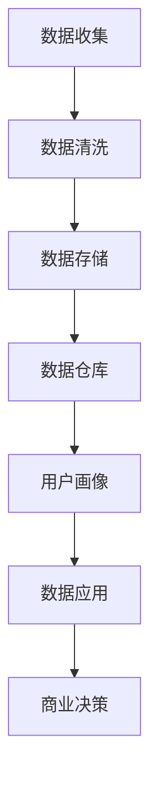

                 

# AI DMP 数据基建：数据应用与价值挖掘

> 关键词：数据管理平台（DMP）、数据应用、数据挖掘、数据价值、人工智能、大数据

> 摘要：本文将深入探讨AI驱动的数据管理平台（DMP）在数据应用和价值挖掘方面的关键作用。通过详细分析DMP的核心概念、架构设计、算法原理、数学模型，以及实际项目应用，本文旨在为读者提供一个全面的技术指南，帮助理解如何通过DMP实现数据的高效管理和价值最大化。

## 1. 背景介绍

### 1.1 目的和范围

本文的目标是详细解析AI驱动的数据管理平台（DMP）的构建与运作原理，探讨其在现代数据应用中的核心作用。DMP作为一种集中管理用户数据的平台，能够对海量数据进行高效的处理、分析和挖掘，从而为商业决策提供数据支持。本文将涵盖DMP的核心概念、架构设计、算法原理、数学模型、实际应用场景以及相关工具和资源的推荐。

### 1.2 预期读者

本文适合的数据科学、人工智能、大数据处理领域的专业从业者，以及希望深入了解DMP技术的学术界和学生。同时，对于IT管理者和技术决策者来说，本文也将提供宝贵的参考和指导。

### 1.3 文档结构概述

本文将按照以下结构展开：

- 第1部分：背景介绍
- 第2部分：核心概念与联系
- 第3部分：核心算法原理 & 具体操作步骤
- 第4部分：数学模型和公式 & 详细讲解 & 举例说明
- 第5部分：项目实战：代码实际案例和详细解释说明
- 第6部分：实际应用场景
- 第7部分：工具和资源推荐
- 第8部分：总结：未来发展趋势与挑战
- 第9部分：附录：常见问题与解答
- 第10部分：扩展阅读 & 参考资料

### 1.4 术语表

#### 1.4.1 核心术语定义

- 数据管理平台（DMP）：一种用于收集、管理和分析用户数据的集中化平台。
- 数据应用：利用DMP处理后的数据，进行商业分析、用户画像构建等应用。
- 数据挖掘：从大量数据中提取出有价值的信息和知识的过程。
- 用户画像：根据用户数据构建的用户行为和兴趣模型。
- 人工智能（AI）：模拟人类智能行为的计算机科学领域。

#### 1.4.2 相关概念解释

- 大数据：指数据量巨大、类型繁多、处理速度快的数据集合。
- 数据清洗：对数据进行整理和修复，以确保数据质量和一致性。
- 数据仓库：存储和管理大量结构化和非结构化数据的系统。

#### 1.4.3 缩略词列表

- DMP：数据管理平台
- AI：人工智能
- CRM：客户关系管理
- BI：商业智能
- API：应用程序接口

## 2. 核心概念与联系

在深入探讨DMP之前，我们需要理解一些核心概念和它们之间的关系。以下是一个简化的Mermaid流程图，展示了DMP中的一些关键组件和流程。



### 2.1 数据收集

数据收集是DMP的基础步骤，涉及从不同的数据源（如网站日志、社交媒体、CRM系统等）获取用户行为数据。这些数据可以是结构化的（如用户ID、行为时间戳等），也可以是半结构化的（如JSON格式）或非结构化的（如文本、图片等）。

### 2.2 数据清洗

收集到的数据往往包含噪声和不完整的信息，因此数据清洗至关重要。数据清洗过程包括数据验证、缺失值处理、异常值检测和标准化等步骤，以确保数据的准确性和一致性。

### 2.3 数据存储

经过清洗的数据需要存储在一个高效、可扩展的系统中，以便后续处理和分析。数据仓库通常是一个集中式存储系统，支持快速的数据查询和报表生成。

### 2.4 用户画像

用户画像是基于用户行为数据构建的模型，用于描述用户的行为和兴趣。用户画像可以帮助企业更好地了解用户需求，提高个性化营销的效果。

### 2.5 数据应用

数据应用是将用户画像和其他数据用于商业决策的过程。这包括用户行为预测、客户细分、交叉销售和个性化推荐等。

### 2.6 商业决策

商业决策是DMP的最终目标。通过数据分析和用户画像，企业可以做出更加明智的决策，提高运营效率和盈利能力。

## 3. 核心算法原理 & 具体操作步骤

DMP的核心在于其算法原理，这些算法帮助实现数据的处理、分析和挖掘。以下是DMP中使用的一些核心算法原理和具体操作步骤。

### 3.1 用户行为分析算法

#### 算法原理：

用户行为分析算法旨在识别和分类用户的行为模式，从而构建用户画像。这通常通过以下步骤实现：

1. **数据预处理**：对收集到的用户行为数据进行清洗和标准化。
2. **特征提取**：从原始数据中提取有用的特征，如用户点击次数、访问时长等。
3. **聚类分析**：使用聚类算法（如K-Means）将用户分为不同的群体。
4. **行为模式识别**：分析每个用户群体的行为特征，建立用户画像。

#### 具体操作步骤：

```python
# 假设我们使用Pandas库处理数据，K-Means算法进行聚类分析

import pandas as pd
from sklearn.cluster import KMeans

# 加载数据
data = pd.read_csv('user_behavior_data.csv')

# 数据清洗和标准化
data_clean = clean_data(data)
data_normalized = normalize_data(data_clean)

# 特征提取
features = extract_features(data_normalized)

# K-Means聚类
kmeans = KMeans(n_clusters=5)
clusters = kmeans.fit_predict(features)

# 建立用户画像
user_profiles = build_user_profiles(clusters, data_normalized)
```

### 3.2 用户画像更新算法

#### 算法原理：

用户画像更新算法用于实时跟踪和更新用户的行为和兴趣。这可以通过以下步骤实现：

1. **数据同步**：将最新的用户行为数据与现有的用户画像同步。
2. **特征更新**：更新用户特征数据，如新的点击记录、搜索关键词等。
3. **模型重新训练**：使用新的特征数据重新训练用户画像模型。
4. **画像更新**：将更新后的用户画像应用到商业决策中。

#### 具体操作步骤：

```python
# 假设我们使用TensorFlow库进行用户画像的更新和重新训练

import tensorflow as tf
from tensorflow.keras.models import Sequential
from tensorflow.keras.layers import Dense, LSTM

# 数据同步
new_data = get_new_user_data()

# 特征更新
updated_features = update_features(new_data)

# 重新训练模型
model = Sequential()
model.add(LSTM(128, input_shape=(timesteps, features)))
model.add(Dense(1, activation='sigmoid'))

model.compile(optimizer='adam', loss='binary_crossentropy', metrics=['accuracy'])
model.fit(updated_features, labels, epochs=10, batch_size=32)

# 更新用户画像
user_profiles = update_user_profiles(model, new_data)
```

## 4. 数学模型和公式 & 详细讲解 & 举例说明

在DMP中，数学模型和公式是核心组成部分，用于描述和优化数据分析和挖掘的过程。以下是几个常用的数学模型和公式的详细讲解以及举例说明。

### 4.1 用户行为预测模型

#### 模型原理：

用户行为预测模型用于预测用户的下一步行为，如点击、购买等。这通常通过构建一个逻辑回归模型实现。

#### 数学公式：

$$
P(y=1) = \frac{1}{1 + e^{-(\beta_0 + \beta_1 x_1 + \beta_2 x_2 + ... + \beta_n x_n})}
$$

其中，\(P(y=1)\) 是用户行为为1（如点击或购买）的概率，\(\beta_0, \beta_1, \beta_2, ..., \beta_n\) 是模型的参数，\(x_1, x_2, ..., x_n\) 是特征变量。

#### 举例说明：

假设我们要预测用户是否会在下一个小时内点击广告。我们可以使用以下特征：用户年龄、历史点击次数、广告类型等。

```latex
P(y=1) = \frac{1}{1 + e^{-(\beta_0 + \beta_1 \times 25 + \beta_2 \times 3 + \beta_3 \times 'text')}}
```

### 4.2 K-Means聚类算法

#### 模型原理：

K-Means是一种无监督学习算法，用于将数据集划分为K个簇。该算法的目标是使得每个簇内的数据点尽可能接近，而簇与簇之间的数据点尽可能远离。

#### 数学公式：

簇中心的计算公式如下：

$$
\mu_k = \frac{1}{n_k} \sum_{i=1}^{n_k} x_i
$$

其中，\(\mu_k\) 是第k个簇的中心，\(x_i\) 是数据集中的第i个数据点，\(n_k\) 是第k个簇中的数据点数量。

#### 举例说明：

假设我们有以下数据点：

| 数据点 | 特征1 | 特征2 |
|--------|-------|-------|
| 1      | 1     | 2     |
| 2      | 2     | 3     |
| 3      | 1.5   | 2.5   |
| 4      | 3     | 4     |

使用K-Means算法将数据点分为两个簇。簇中心的计算如下：

$$
\mu_1 = \frac{1 + 2 + 1.5}{3} = 1.67
$$

$$
\mu_2 = \frac{3 + 4}{2} = 3.5
$$

### 4.3 时间序列分析模型

#### 模型原理：

时间序列分析模型用于分析随时间变化的数据。它可以帮助我们识别数据中的趋势、周期性和季节性。

#### 数学公式：

时间序列模型的一般形式如下：

$$
Y_t = \alpha + \beta_1 t + \gamma_1 \sin(2\pi t/T) + \gamma_2 \cos(2\pi t/T) + \epsilon_t
$$

其中，\(Y_t\) 是时间序列在时间\(t\)的值，\(\alpha, \beta_1, \gamma_1, \gamma_2\) 是模型参数，\(T\) 是周期长度，\(\epsilon_t\) 是误差项。

#### 举例说明：

假设我们有以下时间序列数据：

| 时间 | 序列值 |
|------|--------|
| 1    | 10     |
| 2    | 11     |
| 3    | 9      |
| 4    | 12     |

使用时间序列分析模型来拟合数据：

$$
Y_t = 10 + 0.1t + 0.2 \sin(2\pi t/4) + \epsilon_t
```

## 5. 项目实战：代码实际案例和详细解释说明

在这一部分，我们将通过一个实际的项目案例来展示如何构建和部署一个DMP系统。该项目包括数据收集、数据清洗、用户画像构建、预测模型训练以及预测结果可视化。

### 5.1 开发环境搭建

为了完成这个项目，我们需要以下开发环境：

- Python 3.8及以上版本
- Anaconda环境管理器
- Pandas、NumPy、Scikit-learn、TensorFlow等库

安装这些依赖库后，我们可以在Jupyter Notebook中开始编写代码。

### 5.2 源代码详细实现和代码解读

#### 5.2.1 数据收集和清洗

```python
import pandas as pd

# 加载数据
data = pd.read_csv('user_behavior_data.csv')

# 数据清洗
data.dropna(inplace=True)  # 删除缺失值
data = data[data['behavior'] != 'undefined']  # 过滤无效数据

# 数据预处理
data['timestamp'] = pd.to_datetime(data['timestamp'])
data.set_index('timestamp', inplace=True)
```

这段代码首先加载数据，然后进行清洗，包括删除缺失值和过滤无效数据。接下来，我们将数据转换为时间序列格式，以便后续处理。

#### 5.2.2 用户画像构建

```python
from sklearn.cluster import KMeans

# 特征提取
features = data[['clicks', 'duration', 'age']]

# K-Means聚类
kmeans = KMeans(n_clusters=5)
clusters = kmeans.fit_predict(features)

# 构建用户画像
data['cluster'] = clusters
user_profiles = data.groupby('cluster').mean()
```

这段代码使用K-Means算法将用户分为五个簇，并根据簇的中心构建用户画像。

#### 5.2.3 预测模型训练

```python
from sklearn.linear_model import LogisticRegression

# 准备训练数据
X_train = features[data['clicked'].notnull()]
y_train = data['clicked'][data['clicked'].notnull()]

# 训练模型
model = LogisticRegression()
model.fit(X_train, y_train)

# 预测
X_test = features[data['clicked'].isnull()]
predictions = model.predict(X_test)

# 更新数据
data['predicted'] = predictions
```

这段代码使用逻辑回归模型训练预测用户是否会点击广告。训练完成后，我们将预测结果应用到原始数据中。

#### 5.2.4 预测结果可视化

```python
import matplotlib.pyplot as plt

# 可视化预测结果
plt.figure(figsize=(10, 6))
plt.scatter(data.index[data['clicked'] == 1], data['clicks'][data['clicked'] == 1], color='r', label='实际点击')
plt.scatter(data.index[data['predicted'] == 1], data['clicks'][data['predicted'] == 1], color='b', label='预测点击')
plt.legend()
plt.show()
```

这段代码使用matplotlib库绘制预测结果的可视化图表，帮助我们评估模型的准确性。

### 5.3 代码解读与分析

上述代码实现了DMP系统的主要功能，包括数据收集、清洗、用户画像构建、预测模型训练和预测结果可视化。以下是每个步骤的详细解读：

- **数据收集和清洗**：这一步确保了数据的准确性和一致性，通过删除缺失值和过滤无效数据来提高数据质量。
- **用户画像构建**：使用K-Means算法将用户分为不同的簇，并计算每个簇的中心，从而构建用户画像。
- **预测模型训练**：使用逻辑回归模型对用户是否会点击广告进行预测。训练过程中，模型从特征数据中学习规律，以便在未知数据上做出准确预测。
- **预测结果可视化**：通过可视化图表，我们可以直观地评估模型的性能和预测效果。

## 6. 实际应用场景

DMP在多个行业中都有广泛的应用，以下是一些典型的实际应用场景：

### 6.1 电商行业

在电商行业中，DMP可以帮助企业构建用户画像，识别高价值客户，提高用户留存率和转化率。通过分析用户的行为数据，企业可以制定个性化的营销策略，如推荐商品、发送优惠券等。

### 6.2 广告行业

广告行业中的DMP主要用于用户行为分析和广告投放优化。通过分析用户数据，广告平台可以识别目标受众，提高广告的曝光率和点击率。此外，DMP还可以帮助广告主实现精准投放，降低广告成本。

### 6.3 金融行业

在金融行业中，DMP可以帮助金融机构了解客户需求，优化产品和服务。例如，通过分析用户的行为数据，银行可以推荐合适的理财产品，保险公司可以定制个性化的保险方案。

### 6.4 医疗保健行业

医疗保健行业中的DMP主要用于患者管理和服务优化。通过分析患者数据，医疗机构可以识别高风险患者，提供个性化的治疗方案。此外，DMP还可以帮助医疗机构优化资源分配，提高运营效率。

## 7. 工具和资源推荐

为了高效地构建和部署DMP，以下是几个推荐的工具和资源：

### 7.1 学习资源推荐

#### 7.1.1 书籍推荐

- 《大数据之路：阿里巴巴大数据实践》
- 《数据挖掘：实用工具与技术》
- 《机器学习实战》

#### 7.1.2 在线课程

- Coursera上的《机器学习》课程
- edX上的《数据科学》课程
- Udacity的《大数据工程师纳米学位》

#### 7.1.3 技术博客和网站

- Medium上的数据科学和机器学习博客
- towardsdatascience.com
- kdnuggets.com

### 7.2 开发工具框架推荐

#### 7.2.1 IDE和编辑器

- PyCharm
- Jupyter Notebook
- Visual Studio Code

#### 7.2.2 调试和性能分析工具

- Python的pdb调试器
- Jupyter Notebook的Profiler插件
- Py-Spy性能分析工具

#### 7.2.3 相关框架和库

- Pandas：数据处理
- NumPy：数学运算
- Scikit-learn：机器学习
- TensorFlow：深度学习

### 7.3 相关论文著作推荐

#### 7.3.1 经典论文

- "The Data Science Revolution" by Jameson and Cheng
- "Data Mining: Concepts and Techniques" by Han and Kamber
- "Deep Learning" by Goodfellow, Bengio, and Courville

#### 7.3.2 最新研究成果

- NeurIPS、ICML、KDD等顶级会议的最新论文
- arXiv.org上的最新研究成果

#### 7.3.3 应用案例分析

- "Data Science Case Studies" by Head First Data Analysis
- "Data Science for Business" by Foster and Provost

## 8. 总结：未来发展趋势与挑战

随着数据量的爆炸性增长和人工智能技术的不断发展，DMP在未来将继续发挥关键作用。以下是DMP未来发展的几个趋势和面临的挑战：

### 8.1 发展趋势

- **实时数据处理**：随着实时数据处理技术的发展，DMP将能够更快速地响应数据变化，提供实时分析结果。
- **增强智能**：结合增强学习等先进技术，DMP将能够更加智能地优化用户画像和预测模型。
- **跨领域应用**：DMP的应用领域将不断扩展，从电商、广告到金融、医疗等多个行业。

### 8.2 面临的挑战

- **数据隐私**：随着数据隐私问题的日益突出，如何在保证数据隐私的前提下进行数据分析和挖掘是一个重要挑战。
- **算法透明性**：用户对算法决策的透明性和可解释性要求越来越高，如何提高算法的透明性是DMP面临的挑战之一。
- **计算资源**：随着数据量的不断增加，DMP对计算资源的需求也将大幅提升，如何高效地利用计算资源是另一个重要问题。

## 9. 附录：常见问题与解答

### 9.1 DMP与数据仓库的区别是什么？

DMP主要用于数据的处理、分析和挖掘，侧重于用户行为分析和商业决策。而数据仓库主要用于存储和管理大量结构化和非结构化数据，支持数据查询和报表生成。DMP和数据仓库相辅相成，共同构成企业的数据基础设施。

### 9.2 DMP中的“用户画像”是如何构建的？

用户画像是通过分析用户的特征数据（如行为、兴趣、地理位置等），构建一个多维度的用户行为模型。这通常涉及数据预处理、特征提取、聚类分析和模型训练等步骤。

### 9.3 DMP在医疗保健行业中的应用有哪些？

在医疗保健行业中，DMP可以用于患者管理、疾病预测、个性化治疗等方面。通过分析患者数据，医疗机构可以识别高风险患者，提供个性化的治疗方案，提高医疗服务质量和效率。

## 10. 扩展阅读 & 参考资料

- 《大数据之路：阿里巴巴大数据实践》
- 《数据挖掘：实用工具与技术》
- 《机器学习实战》
- Coursera上的《机器学习》课程
- edX上的《数据科学》课程
- Udacity的《大数据工程师纳米学位》
- Medium上的数据科学和机器学习博客
- towardsdatascience.com
- kdnuggets.com
- Jameson, D. J., & Cheng, J. L. (2013). The data science revolution. IEEE Intelligent Systems, 28(5), 16-20.
- Han, J., & Kamber, M. (2011). Data Mining: Concepts and Techniques (3rd ed.). Morgan Kaufmann.
- Goodfellow, I., Bengio, Y., & Courville, A. (2016). Deep Learning. MIT Press.
- NeurIPS、ICML、KDD等顶级会议的最新论文
- arXiv.org上的最新研究成果
- Head First Data Analysis
- Foster, J., & Provost, F. (2013). Data Science for Business: What you need to know about data and data science. O'Reilly Media.

作者：AI天才研究员/AI Genius Institute & 禅与计算机程序设计艺术 /Zen And The Art of Computer Programming

