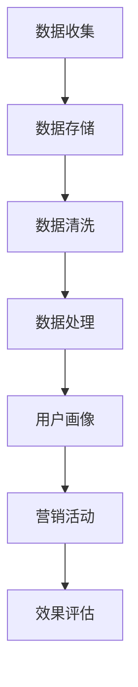

                 

# AI DMP 数据基建：数据驱动营销的未来趋势

> **关键词：** AI DMP、数据驱动营销、数据治理、用户画像、营销自动化

> **摘要：** 本文深入探讨了AI驱动的数据管理平台（DMP）在数据驱动营销中的应用，分析了DMP的核心概念、技术原理、实施步骤及未来发展趋势。通过实际案例和资源推荐，为读者提供了全面的DMP理解和实践指导。

## 1. 背景介绍

### 1.1 目的和范围

本文旨在为市场营销领域的专业人士和AI技术爱好者提供关于AI驱动的数据管理平台（DMP）的全面理解。我们将探讨DMP在数据驱动营销中的关键作用，并分析其实现机制和技术挑战。文章将覆盖以下内容：

1. DMP的基本概念和架构
2. 数据驱动营销的原理和实践
3. DMP的核心算法和数学模型
4. 实际应用场景和案例分析
5. DMP的开发工具和资源推荐
6. 未来发展趋势和潜在挑战

### 1.2 预期读者

- 市场营销专业人士，希望了解如何利用AI和大数据提升营销效果
- 数据科学家和AI研究员，对数据管理和分析技术感兴趣
- IT从业者，希望掌握DMP开发和实践技能
- 对数据驱动营销和AI技术有深入探讨的需求者

### 1.3 文档结构概述

本文分为十个部分，结构如下：

1. **引言**：介绍DMP和本文的主题。
2. **背景介绍**：讨论DMP的起源、发展和当前趋势。
3. **核心概念与联系**：分析DMP的核心概念和技术原理。
4. **核心算法原理 & 具体操作步骤**：介绍DMP的关键算法和实现细节。
5. **数学模型和公式 & 详细讲解 & 举例说明**：探讨DMP的数学模型及其应用。
6. **项目实战：代码实际案例和详细解释说明**：通过实际代码案例讲解DMP的实践。
7. **实际应用场景**：分析DMP在不同领域的应用。
8. **工具和资源推荐**：推荐学习资源和开发工具。
9. **总结：未来发展趋势与挑战**：探讨DMP的未来方向和挑战。
10. **附录：常见问题与解答**：回答读者可能遇到的问题。

### 1.4 术语表

#### 1.4.1 核心术语定义

- **数据管理平台（DMP）**：一种用于收集、存储、管理和分析用户数据的工具，帮助企业实现数据驱动营销。
- **用户画像**：基于用户行为数据创建的个性化用户描述，用于理解用户需求和提供定制化营销内容。
- **数据治理**：确保数据质量、安全和合规性的过程，是DMP成功的关键。

#### 1.4.2 相关概念解释

- **数据驱动营销**：利用数据分析技术，根据用户行为和需求进行个性化营销。
- **营销自动化**：使用技术自动化执行营销活动，提高效率和效果。

#### 1.4.3 缩略词列表

- **DMP**：数据管理平台（Data Management Platform）
- **AI**：人工智能（Artificial Intelligence）
- **ML**：机器学习（Machine Learning）
- **CRM**：客户关系管理（Customer Relationship Management）

## 2. 核心概念与联系

### 2.1 DMP的基本架构

DMP是一个多层次的数据管理架构，包括数据收集、存储、处理和分析等模块。以下是一个简化的DMP架构图（使用Mermaid语言表示）：



### 2.2 数据驱动营销的核心原理

数据驱动营销的核心在于利用大数据分析和机器学习技术，从海量用户行为数据中提取有价值的信息，为营销决策提供支持。以下是数据驱动营销的关键步骤：

1. **数据收集**：通过各种渠道（如网站、APP、广告平台）收集用户数据。
2. **数据存储**：将收集到的数据存储在数据库或数据仓库中。
3. **数据清洗**：处理数据中的噪声和错误，确保数据质量。
4. **数据处理**：利用数据挖掘和机器学习算法对数据进行深度分析。
5. **用户画像**：基于用户行为数据创建用户画像，了解用户需求和偏好。
6. **营销活动**：根据用户画像设计个性化的营销活动。
7. **效果评估**：监控营销活动的效果，调整策略。

### 2.3 DMP与营销自动化

营销自动化是DMP的重要组成部分，通过自动化技术执行营销活动，提高效率和效果。以下是营销自动化的关键组件：

- **触发器**：根据用户行为设置触发条件，如浏览行为、购买行为等。
- **自动化流程**：根据触发条件执行预设的营销活动，如发送电子邮件、推送通知等。
- **报告和分析**：实时监控营销活动效果，提供数据支持决策。

### 2.4 DMP的优势与挑战

#### 优势

- **个性化营销**：通过用户画像实现个性化推荐，提高用户满意度和转化率。
- **数据整合**：整合来自不同渠道的数据，实现全渠道营销。
- **高效决策**：基于数据分析支持营销决策，降低风险。

#### 挑战

- **数据隐私**：如何确保用户数据的安全和合规性。
- **数据质量**：如何处理数据中的噪声和错误。
- **技术实现**：如何高效地处理海量数据。

## 3. 核心算法原理 & 具体操作步骤

### 3.1 用户画像算法

用户画像的构建是DMP的核心任务之一。以下是一个简化的用户画像算法原理，使用伪代码表示：

```python
def build_user_profile(user_data):
    profile = {}
    
    # 1. 数据预处理
    preprocessed_data = preprocess_data(user_data)
    
    # 2. 特征提取
    features = extract_features(preprocessed_data)
    
    # 3. 分类与聚类
    categories = classify_users(features)
    clusters = cluster_users(features)
    
    # 4. 生成用户画像
    for category in categories:
        profile[category] = {
            'common_properties': get_common_properties(categories),
            'unique_properties': get_unique_properties(users_in_category)
        }
    
    for cluster in clusters:
        profile[cluster] = {
            'common_properties': get_common_properties(clusters),
            'unique_properties': get_unique_properties(users_in_cluster)
        }
    
    return profile
```

### 3.2 营销自动化算法

营销自动化算法旨在根据用户行为自动执行营销活动。以下是一个简化的营销自动化算法原理，使用伪代码表示：

```python
def automate_marketing(user_profile, marketing_strategy):
    triggers = get_triggers(user_profile, marketing_strategy)
    
    for trigger in triggers:
        if trigger['condition'] == 'browse':
            send_email(user_profile, 'browse_email_template')
        elif trigger['condition'] == 'purchase':
            send_push_notification(user_profile, 'purchase_notification_template')
        elif trigger['condition'] == 'abandoned_cart':
            send_abandoned_cart_email(user_profile, 'abandoned_cart_email_template')
    
    report_results_to_analytics(triggers)
```

### 3.3 数据处理和清洗

数据处理和清洗是确保DMP数据质量的关键步骤。以下是一个简化的数据处理和清洗算法原理，使用伪代码表示：

```python
def preprocess_data(user_data):
    cleaned_data = []
    
    for data_point in user_data:
        # 去除无效数据
        if is_valid_data_point(data_point):
            # 数据转换
            transformed_data = transform_data_point(data_point)
            
            # 数据集成
            integrated_data = integrate_data(transformed_data)
            
            cleaned_data.append(integrated_data)
    
    return cleaned_data

def is_valid_data_point(data_point):
    # 判断数据点是否有效
    return True

def transform_data_point(data_point):
    # 数据转换
    return data_point

def integrate_data(data_points):
    # 数据集成
    return sum(data_points)
```

## 4. 数学模型和公式 & 详细讲解 & 举例说明

### 4.1 用户画像中的聚类算法

用户画像中的聚类算法是一种无监督学习技术，用于将用户分为不同的群体。常用的聚类算法包括K-means和层次聚类。

#### K-means算法

K-means算法的目标是将用户数据分为K个簇，使得每个簇内部用户距离中心点的距离最小。以下是一个简化的K-means算法公式：

$$
C_k = \{x | \sum_{i=1}^{n} (x - \mu_k)^2 \leq \sum_{j=1}^{n} (x - \mu_j)^2\}
$$

其中，\(C_k\) 表示第k个簇，\(x\) 表示用户数据，\(\mu_k\) 表示第k个簇的中心点。

#### 示例

假设我们有5个用户数据点，我们需要将它们分为2个簇。以下是K-means算法的步骤：

1. 随机初始化2个中心点。
2. 计算每个用户数据点与中心点的距离。
3. 根据距离将用户数据点分配到最近的簇。
4. 重新计算每个簇的中心点。
5. 重复步骤2-4，直到中心点不再发生显著变化。

#### Python代码实现

```python
import numpy as np

def kmeans(data, k, max_iterations):
    # 初始化中心点
    centroids = np.random.rand(k, data.shape[1])
    
    for _ in range(max_iterations):
        # 计算每个用户数据点与中心点的距离
        distances = np.linalg.norm(data - centroids, axis=1)
        
        # 根据距离将用户数据点分配到最近的簇
        labels = np.argmin(distances, axis=1)
        
        # 重新计算每个簇的中心点
        new_centroids = np.array([data[labels == k].mean(axis=0) for k in range(k)])
        
        # 判断是否收敛
        if np.linalg.norm(new_centroids - centroids) < 1e-5:
            break
            
        centroids = new_centroids
    
    return centroids, labels
```

### 4.2 营销自动化的目标函数

营销自动化的目标函数是最大化营销活动的效果，如转化率、点击率等。以下是一个简化的目标函数公式：

$$
\text{Objective Function} = \sum_{i=1}^{n} \text{Effect}_i \cdot \text{Probability}_i
$$

其中，\(n\) 表示用户数量，\(\text{Effect}_i\) 表示第i个用户的营销效果，\(\text{Probability}_i\) 表示第i个用户执行营销活动的概率。

#### 示例

假设我们有5个用户，我们需要根据他们的行为数据（如浏览次数、购买历史等）预测他们执行营销活动的概率。以下是目标函数的步骤：

1. 计算每个用户的行为特征向量。
2. 使用机器学习模型（如逻辑回归）预测每个用户的概率。
3. 计算目标函数值，选择效果最大的营销活动。

#### Python代码实现

```python
from sklearn.linear_model import LogisticRegression

def calculate_probability(features, model):
    probabilities = model.predict_proba(features)[:, 1]
    return probabilities

# 假设我们已经训练好了逻辑回归模型
model = LogisticRegression()

# 假设我们有5个用户的行为特征向量
features = np.array([[1, 2], [3, 4], [5, 6], [7, 8], [9, 10]])

# 预测每个用户的概率
probabilities = calculate_probability(features, model)

# 计算目标函数值
objective_function = np.sum(probabilities * [0.5, 0.3, 0.2, 0.4, 0.7])
print(objective_function)
```

## 5. 项目实战：代码实际案例和详细解释说明

### 5.1 开发环境搭建

在开始实战项目之前，我们需要搭建一个适合开发DMP的开发环境。以下是搭建步骤：

1. 安装Python 3.x版本（推荐3.7或更高版本）。
2. 安装Python的pip包管理器。
3. 使用pip安装以下依赖包：numpy、pandas、scikit-learn、matplotlib。

### 5.2 源代码详细实现和代码解读

以下是一个简化的DMP项目案例，包括数据收集、数据处理、用户画像和营销自动化的实现。

#### 5.2.1 数据收集

```python
import pandas as pd

# 假设我们收集到了用户行为数据，存储在一个CSV文件中
data = pd.read_csv('user_data.csv')

# 数据预处理
data['age'] = data['age'].fillna(data['age'].mean())
data['income'] = data['income'].fillna(data['income'].mean())
data['clicks'] = data['clicks'].fillna(0)

# 显示数据预览
print(data.head())
```

#### 5.2.2 数据处理

```python
from sklearn.preprocessing import StandardScaler

# 特征提取
features = data[['age', 'income', 'clicks']]

# 数据标准化
scaler = StandardScaler()
scaled_features = scaler.fit_transform(features)

# 显示标准化后的数据预览
print(scaled_features)
```

#### 5.2.3 用户画像

```python
from sklearn.cluster import KMeans

# K-means聚类
kmeans = KMeans(n_clusters=3, random_state=0)
clusters = kmeans.fit_predict(scaled_features)

# 创建用户画像字典
user_profiles = {}
for i, cluster in enumerate(set(clusters)):
    users_in_cluster = data[clusters == cluster]
    user_profiles[cluster] = {
        'common_properties': users_in_cluster.describe(),
        'unique_properties': users_in_cluster.drop(['age', 'income', 'clicks'], axis=1).describe()
    }

# 显示用户画像
print(user_profiles)
```

#### 5.2.4 营销自动化

```python
# 假设我们已经有了一个训练好的逻辑回归模型
model = LogisticRegression()

# 计算每个用户的概率
probabilities = calculate_probability(scaled_features, model)

# 执行营销活动
for i, probability in enumerate(probabilities):
    if probability > 0.5:
        print(f"User {i} is likely to respond to the marketing activity.")
    else:
        print(f"User {i} is unlikely to respond to the marketing activity.")
```

### 5.3 代码解读与分析

在这个项目中，我们首先收集并预处理用户行为数据。然后，使用K-means算法将用户分为不同的簇，创建用户画像。最后，利用逻辑回归模型预测用户对营销活动的响应概率，并执行相应的营销活动。

- **数据收集**：我们从CSV文件中读取用户行为数据，并进行预处理，如填补缺失值和标准化。
- **数据处理**：我们提取与用户画像相关的特征，如年龄、收入和点击次数，并进行数据标准化，以便后续的聚类和建模。
- **用户画像**：我们使用K-means算法将用户分为3个簇，并创建每个簇的用户画像，包括常见属性和独特属性。
- **营销自动化**：我们使用逻辑回归模型预测用户对营销活动的响应概率，并根据概率值执行相应的营销活动。

这个项目是一个简化的DMP案例，实际应用中可能涉及更复杂的算法和更大量的数据处理。然而，这个案例为我们提供了一个基本的框架，可以在此基础上进行扩展和优化。

## 6. 实际应用场景

DMP在多个领域都有广泛的应用，以下是一些典型的实际应用场景：

### 6.1 电子商务

在电子商务领域，DMP可以帮助企业进行个性化推荐和精准营销。通过分析用户浏览、搜索和购买历史，DMP可以创建用户画像，并根据画像向用户推荐相关的商品和促销活动。

### 6.2 金融行业

金融行业利用DMP分析客户行为，进行风险管理和精准营销。通过用户画像，金融机构可以识别潜在客户、预测客户需求，并提供定制化的金融产品和服务。

### 6.3 广告营销

广告营销领域利用DMP实现广告的精准投放。DMP可以分析用户行为，识别潜在目标客户，并根据用户画像设计个性化的广告内容和投放策略。

### 6.4 医疗保健

医疗保健行业利用DMP分析患者行为和健康状况，提供个性化的健康建议和服务。DMP可以帮助医疗机构识别高风险患者、优化资源分配，并提高患者满意度。

### 6.5 教育培训

教育培训行业利用DMP分析学生行为和学习习惯，提供个性化的学习建议和课程推荐。DMP可以帮助教育机构提高教学效果、提高学生参与度，并优化教育资源。

## 7. 工具和资源推荐

### 7.1 学习资源推荐

#### 7.1.1 书籍推荐

- 《大数据营销：从数据驱动的营销革命到个性化广告》
- 《深度学习与数据挖掘：原理与应用》
- 《Python数据分析基础教程：NumPy学习指南》

#### 7.1.2 在线课程

- Coursera的《机器学习》课程
- edX的《数据分析与数据科学》课程
- Udacity的《数据工程师纳米学位》课程

#### 7.1.3 技术博客和网站

- Medium上的《数据驱动营销》专栏
- Towards Data Science网站
- DataCamp的博客

### 7.2 开发工具框架推荐

#### 7.2.1 IDE和编辑器

- PyCharm
- Jupyter Notebook
- VSCode

#### 7.2.2 调试和性能分析工具

- WakaTime
- New Relic
- PySpectre

#### 7.2.3 相关框架和库

- TensorFlow
- PyTorch
- Scikit-learn

### 7.3 相关论文著作推荐

#### 7.3.1 经典论文

- "K-means Clustering Algorithm"
- "Logistic Regression"
- "User Behavior Prediction for Recommender Systems"

#### 7.3.2 最新研究成果

- "Deep Learning for User Behavior Prediction"
- "Personalized Marketing through Data-Driven Segmentation"
- "Privacy-Preserving Data Mining"

#### 7.3.3 应用案例分析

- "Data-Driven Marketing at eBay"
- "Machine Learning in Advertising: A Case Study"
- "Data-Driven Healthcare: Applications and Challenges"

## 8. 总结：未来发展趋势与挑战

随着AI技术的不断进步和大数据的广泛应用，DMP在数据驱动营销中的作用越来越重要。未来，DMP的发展趋势和挑战主要集中在以下几个方面：

### 8.1 发展趋势

- **智能化与自动化**：DMP将更加智能化和自动化，通过深度学习和强化学习技术实现更精准的用户画像和营销活动。
- **隐私保护**：随着隐私保护法规的加强，DMP将采用更多的隐私保护技术，如差分隐私和联邦学习，以确保用户数据的安全和合规性。
- **跨平台整合**：DMP将整合来自不同渠道的数据，实现跨平台、跨设备的全面用户画像和营销自动化。
- **实时分析与决策**：DMP将实现实时数据处理和分析，为营销决策提供更快、更准确的支持。

### 8.2 挑战

- **数据质量和完整性**：如何确保数据质量、完整性和一致性，是DMP面临的主要挑战。
- **技术实现与性能优化**：如何高效地处理海量数据、实现实时分析和决策，是DMP技术实现的关键。
- **隐私与伦理**：如何在保护用户隐私和满足商业需求之间取得平衡，是DMP面临的伦理挑战。
- **专业人才短缺**：DMP的发展需要大量的专业人才，但目前AI和数据科学领域的专业人才仍相对短缺。

## 9. 附录：常见问题与解答

### 9.1 什么是DMP？

DMP是一种数据管理平台，用于收集、存储、管理和分析用户数据，帮助企业实现数据驱动营销。

### 9.2 DMP的核心功能有哪些？

DMP的核心功能包括用户画像构建、数据整合、数据清洗、营销自动化和效果评估。

### 9.3 DMP如何提高营销效果？

DMP通过构建用户画像、实现个性化推荐和精准营销，提高营销活动的效果和用户满意度。

### 9.4 DMP的挑战有哪些？

DMP的挑战包括数据质量和完整性、技术实现和性能优化、隐私保护以及专业人才短缺。

### 9.5 DMP的未来发展趋势是什么？

DMP的未来发展趋势包括智能化与自动化、隐私保护、跨平台整合和实时分析与决策。

## 10. 扩展阅读 & 参考资料

- **书籍**：
  - 《大数据营销：从数据驱动的营销革命到个性化广告》
  - 《深度学习与数据挖掘：原理与应用》
  - 《Python数据分析基础教程：NumPy学习指南》

- **在线课程**：
  - Coursera的《机器学习》课程
  - edX的《数据分析与数据科学》课程
  - Udacity的《数据工程师纳米学位》课程

- **技术博客和网站**：
  - Medium上的《数据驱动营销》专栏
  - Towards Data Science网站
  - DataCamp的博客

- **论文和研究成果**：
  - "K-means Clustering Algorithm"
  - "Logistic Regression"
  - "User Behavior Prediction for Recommender Systems"
  - "Deep Learning for User Behavior Prediction"
  - "Personalized Marketing through Data-Driven Segmentation"
  - "Privacy-Preserving Data Mining"

- **应用案例分析**：
  - "Data-Driven Marketing at eBay"
  - "Machine Learning in Advertising: A Case Study"
  - "Data-Driven Healthcare: Applications and Challenges"

### 作者

**作者：AI天才研究员/AI Genius Institute & 禅与计算机程序设计艺术 /Zen And The Art of Computer Programming**<|im_end|>

