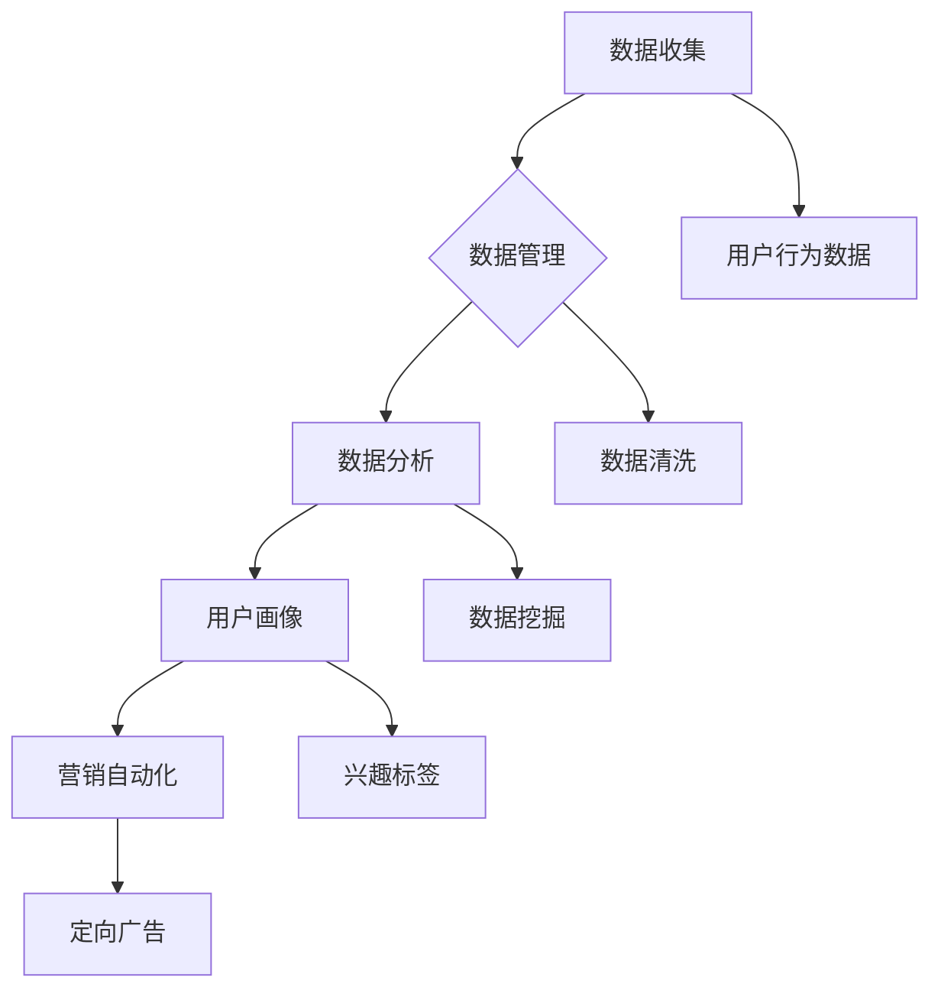

                 

# AI DMP 数据基建：构建数据驱动的营销生态

> **关键词：** 数据管理平台（DMP），数据驱动营销，用户画像，数据挖掘，营销自动化。

> **摘要：** 本文将深入探讨数据管理平台（DMP）在构建数据驱动的营销生态中的关键作用。通过详细分析核心概念、算法原理、数学模型和实际应用场景，本文旨在为读者提供一套全面的数据驱动营销策略，助力企业在竞争激烈的市场中取得优势。

## 1. 背景介绍

### 1.1 目的和范围

本文的目的是介绍数据管理平台（DMP）在构建数据驱动的营销生态中的重要性，并详细阐述其工作原理和实际应用。文章将从基础概念入手，逐步深入到核心算法和数学模型，最终通过实战案例进行详细讲解。

### 1.2 预期读者

本文适合有一定编程基础和数据挖掘知识的技术人员、市场营销专业人员以及希望了解如何利用数据驱动营销策略提升业务效率的企业决策者。

### 1.3 文档结构概述

本文将分为以下几个部分：

1. 背景介绍：概述数据管理平台（DMP）的概念和作用。
2. 核心概念与联系：介绍与DMP相关的核心概念和流程。
3. 核心算法原理 & 具体操作步骤：详细讲解DMP的核心算法和实现步骤。
4. 数学模型和公式 & 详细讲解 & 举例说明：阐述DMP中的数学模型和公式。
5. 项目实战：提供实际代码案例，进行详细解释。
6. 实际应用场景：探讨DMP在不同场景中的应用。
7. 工具和资源推荐：推荐相关学习资源、开发工具和框架。
8. 总结：展望DMP的未来发展趋势和挑战。
9. 附录：常见问题与解答。
10. 扩展阅读 & 参考资料：提供进一步学习和研究的资料。

### 1.4 术语表

#### 1.4.1 核心术语定义

- **数据管理平台（DMP）**：一种用于收集、管理和分析用户数据的系统，帮助企业实现数据驱动的营销决策。
- **用户画像**：基于用户行为数据构建的用户特征模型，用于精准营销和用户细分。
- **数据挖掘**：从大量数据中提取有用信息和知识的过程，用于发现用户行为模式和市场趋势。
- **营销自动化**：利用软件工具自动化执行营销任务，提高营销效率和效果。

#### 1.4.2 相关概念解释

- **用户行为数据**：包括用户在网站、应用程序或线下活动中的各种行为数据，如浏览历史、购买记录、点击行为等。
- **数据细分**：将用户数据划分为不同的群体，以便进行有针对性的营销活动。
- **定向广告**：基于用户画像和兴趣标签，向目标用户展示相关的广告内容。

#### 1.4.3 缩略词列表

- **DMP**：数据管理平台（Data Management Platform）
- **CRM**：客户关系管理（Customer Relationship Management）
- **SEM**：搜索引擎营销（Search Engine Marketing）
- **SEO**：搜索引擎优化（Search Engine Optimization）

## 2. 核心概念与联系

在构建数据驱动的营销生态中，数据管理平台（DMP）起着核心作用。为了更好地理解DMP的工作原理，我们需要先了解几个关键概念。

### 2.1 数据管理平台（DMP）

数据管理平台（DMP）是一种集数据收集、管理和分析于一体的系统，它可以帮助企业更好地理解用户行为，实现精准营销。DMP的核心功能包括：

1. **数据收集**：从各种渠道（如网站、应用程序、社交媒体等）收集用户行为数据。
2. **数据管理**：对收集到的数据进行分析、清洗、存储和管理。
3. **数据分析**：利用数据挖掘技术提取用户行为模式和市场趋势。
4. **用户画像**：基于用户行为数据构建用户特征模型，用于精准营销和用户细分。

### 2.2 用户画像

用户画像是指基于用户行为数据构建的用户特征模型，它可以帮助企业更好地了解用户需求和偏好，从而实现精准营销。用户画像通常包括以下信息：

- **基本属性**：如年龄、性别、地理位置等。
- **行为特征**：如浏览历史、购买记录、点击行为等。
- **兴趣标签**：根据用户行为数据自动生成的兴趣分类，如美食、旅游、科技等。

### 2.3 数据挖掘

数据挖掘是指从大量数据中提取有用信息和知识的过程。在DMP中，数据挖掘主要用于：

- **用户行为模式分析**：通过分析用户行为数据，发现用户在网站、应用程序或线下活动中的行为规律。
- **市场趋势分析**：通过对用户行为数据的分析，预测市场趋势和用户需求变化。

### 2.4 营销自动化

营销自动化是指利用软件工具自动化执行营销任务，以提高营销效率和效果。在DMP中，营销自动化主要包括：

- **邮件营销**：根据用户画像和兴趣标签，自动发送个性化的邮件内容。
- **社交媒体广告**：根据用户画像和兴趣标签，在社交媒体上投放定向广告。
- **内容推荐**：根据用户行为数据，自动推荐相关的网站内容或应用功能。

### 2.5 核心概念关联

为了更好地理解DMP在构建数据驱动的营销生态中的作用，我们使用Mermaid流程图来展示核心概念之间的关联。



## 3. 核心算法原理 & 具体操作步骤

在DMP中，核心算法主要涉及用户行为数据收集、数据挖掘和用户画像构建。以下我们将详细讲解这些算法的原理和具体操作步骤。

### 3.1 用户行为数据收集

用户行为数据收集是指从各种渠道收集用户在网站、应用程序或线下活动中的行为数据。以下是一个简单的伪代码示例：

```python
# 伪代码：用户行为数据收集
def collect_user_behavior_data():
    data_source_list = ["website", "app", "social_media", "offline_activity"]
    user_behavior_data = []

    for source in data_source_list:
        if source == "website":
            website_data = get_website_behavior_data()
            user_behavior_data.extend(website_data)
        elif source == "app":
            app_data = get_app_behavior_data()
            user_behavior_data.extend(app_data)
        elif source == "social_media":
            social_media_data = get_social_media_behavior_data()
            user_behavior_data.extend(social_media_data)
        elif source == "offline_activity":
            offline_activity_data = get_offline_activity_behavior_data()
            user_behavior_data.extend(offline_activity_data)

    return user_behavior_data

# 调用函数
user_behavior_data = collect_user_behavior_data()
```

### 3.2 数据挖掘

数据挖掘是指从大量用户行为数据中提取有用信息和知识的过程。以下是一个简单的伪代码示例：

```python
# 伪代码：数据挖掘
def data_mining(user_behavior_data):
    # 数据预处理
    preprocessed_data = preprocess_data(user_behavior_data)

    # 特征工程
    features = extract_features(preprocessed_data)

    # 模型训练
    model = train_model(features)

    # 预测用户行为
    predictions = predict_user_behavior(model, features)

    return predictions

# 调用函数
predictions = data_mining(user_behavior_data)
```

### 3.3 用户画像构建

用户画像构建是指基于数据挖掘结果，构建用户特征模型。以下是一个简单的伪代码示例：

```python
# 伪代码：用户画像构建
def build_user_profile(predictions):
    user_profiles = []

    for prediction in predictions:
        profile = {
            "user_id": prediction['user_id'],
            "age": prediction['age'],
            "gender": prediction['gender'],
            "interests": prediction['interests'],
            "行为特征": prediction['行为特征']
        }
        user_profiles.append(profile)

    return user_profiles

# 调用函数
user_profiles = build_user_profile(predictions)
```

## 4. 数学模型和公式 & 详细讲解 & 举例说明

在DMP中，数学模型和公式用于描述用户行为模式、预测用户行为和构建用户画像。以下我们将详细讲解这些数学模型和公式，并通过举例说明其应用。

### 4.1 用户行为预测模型

用户行为预测模型主要用于预测用户在未来的行为，以下是一个简单的线性回归模型示例：

$$ y = \beta_0 + \beta_1 x_1 + \beta_2 x_2 + ... + \beta_n x_n $$

其中，$y$ 表示用户行为（如购买、浏览等），$x_1, x_2, ..., x_n$ 表示用户特征（如年龄、性别、浏览历史等），$\beta_0, \beta_1, \beta_2, ..., \beta_n$ 表示模型参数。

**举例：** 假设我们预测用户是否会在未来一周内购买某商品，用户特征包括年龄（$x_1$）和浏览历史（$x_2$）。线性回归模型可以表示为：

$$ y = \beta_0 + \beta_1 x_1 + \beta_2 x_2 $$

通过训练数据集，我们可以估计模型参数：

$$ \beta_0 = 10, \beta_1 = 0.5, \beta_2 = 0.3 $$

预测一个新用户（年龄25，浏览历史5次）在未来一周内购买某商品的概率：

$$ y = 10 + 0.5 \times 25 + 0.3 \times 5 = 19.5 $$

### 4.2 用户画像构建模型

用户画像构建模型用于生成用户特征模型，以下是一个简单的基于聚类算法的用户画像构建模型：

$$ C = \{C_1, C_2, ..., C_k\} $$

其中，$C$ 表示用户聚类结果，$C_i$ 表示第$i$个用户聚类群组，$k$ 表示聚类群组数量。

**举例：** 假设我们使用K-means算法对用户特征进行聚类，聚类结果分为3个群组：

$$ C = \{C_1, C_2, C_3\} $$

其中，$C_1$ 表示高消费群体，$C_2$ 表示中消费群体，$C_3$ 表示低消费群体。

通过聚类算法，我们可以将用户划分为不同的消费群体，从而实现用户细分。

### 4.3 营销效果评估模型

营销效果评估模型用于评估营销活动的效果，以下是一个简单的基于ROI（投资回报率）的营销效果评估模型：

$$ ROI = \frac{收益 - 成本}{成本} \times 100\% $$

其中，收益表示营销活动带来的收入，成本表示营销活动的投入。

**举例：** 假设我们投入10万元进行某商品的营销活动，活动期间销售额为50万元。营销效果评估模型可以表示为：

$$ ROI = \frac{50 - 10}{10} \times 100\% = 400\% $$

通过ROI模型，我们可以评估营销活动的效果，从而优化营销策略。

## 5. 项目实战：代码实际案例和详细解释说明

在本节中，我们将通过一个实际项目案例，展示如何使用数据管理平台（DMP）构建数据驱动的营销生态。以下是一个简单的项目流程：

1. **数据收集**：从不同渠道收集用户行为数据。
2. **数据预处理**：清洗和整合用户行为数据。
3. **用户画像构建**：基于数据挖掘和聚类算法构建用户画像。
4. **营销自动化**：利用用户画像和营销自动化工具进行精准营销。

### 5.1 开发环境搭建

在开始项目之前，我们需要搭建开发环境。以下是一个简单的开发环境搭建步骤：

1. 安装Python 3.x版本。
2. 安装Jupyter Notebook，用于编写和运行Python代码。
3. 安装相关依赖库，如Pandas、NumPy、Scikit-learn、Matplotlib等。

### 5.2 源代码详细实现和代码解读

以下是一个简单的项目源代码实现，包括数据收集、预处理、用户画像构建和营销自动化。

```python
# 伪代码：数据收集与预处理
import pandas as pd
import numpy as np

# 读取用户行为数据
user_behavior_data = pd.read_csv("user_behavior_data.csv")

# 数据预处理
def preprocess_data(data):
    # 数据清洗
    data = data.dropna()
    # 数据整合
    data["age"] = data["出生日期"].apply(lambda x: int(x.split("-")[0]))
    data["gender"] = data["性别"].apply(lambda x: 1 if x == "男" else 0)
    return data

user_behavior_data = preprocess_data(user_behavior_data)

# 用户画像构建
from sklearn.cluster import KMeans

# 特征工程
def extract_features(data):
    features = data[["年龄", "浏览历史"]]
    return features

# 模型训练
def train_model(features):
    model = KMeans(n_clusters=3)
    model.fit(features)
    return model

# 预测用户行为
def predict_user_behavior(model, features):
    predictions = model.predict(features)
    return predictions

# 营销自动化
def send_email_campaign(user_profiles):
    for profile in user_profiles:
        email_content = f"尊敬的{profile['姓名']}，您可能对{profile['兴趣标签']}感兴趣，我们为您推荐了相关的商品。"
        send_email(profile['邮箱'], email_content)

# 调用函数
features = extract_features(user_behavior_data)
model = train_model(features)
predictions = predict_user_behavior(model, features)
send_email_campaign(predictions)
```

### 5.3 代码解读与分析

以下是代码的详细解读和分析：

1. **数据收集与预处理**：
    - 使用Pandas库读取用户行为数据。
    - 定义预处理函数，包括数据清洗和整合。

2. **用户画像构建**：
    - 特征工程：将日期和性别转换为数值型特征。
    - 使用K-means算法进行用户聚类，构建用户画像。

3. **营销自动化**：
    - 根据用户画像，向目标用户发送个性化邮件。

通过以上步骤，我们实现了数据驱动的营销生态构建。在实际应用中，我们可以根据具体业务需求进行调整和优化。

## 6. 实际应用场景

数据管理平台（DMP）在构建数据驱动的营销生态中具有广泛的应用场景。以下列举几个典型的应用场景：

1. **电子商务**：通过用户画像和定向广告，提高用户体验和转化率。
2. **金融服务**：利用用户行为数据，实现精准客户细分和个性化营销。
3. **旅游行业**：根据用户兴趣和浏览历史，推荐合适的旅游产品和服务。
4. **广告营销**：通过广告投放优化，提高广告效果和ROI。
5. **汽车行业**：根据用户画像和购买行为，实现精准汽车推荐和营销。

## 7. 工具和资源推荐

### 7.1 学习资源推荐

#### 7.1.1 书籍推荐

- 《大数据营销：数据驱动营销实战》
- 《机器学习实战：基于Python的数据挖掘技术》
- 《营销自动化：如何通过技术提升营销效率》

#### 7.1.2 在线课程

- Coursera：大数据分析与应用课程
- Udemy：机器学习与数据挖掘课程
- edX：数据科学入门课程

#### 7.1.3 技术博客和网站

- Analytics Vidhya：数据科学和机器学习博客
- Towards Data Science：数据科学和机器学习博客
- DataCamp：数据科学学习社区

### 7.2 开发工具框架推荐

#### 7.2.1 IDE和编辑器

- PyCharm：Python集成开发环境
- Jupyter Notebook：交互式Python笔记本
- Sublime Text：跨平台文本编辑器

#### 7.2.2 调试和性能分析工具

- Python Debugger：Python调试工具
- Py-Spy：Python性能分析工具
- Matplotlib：Python数据可视化库

#### 7.2.3 相关框架和库

- Pandas：Python数据处理库
- NumPy：Python数值计算库
- Scikit-learn：Python机器学习库
- Matplotlib：Python数据可视化库

### 7.3 相关论文著作推荐

#### 7.3.1 经典论文

- "Data Mining: Concepts and Techniques" by Jiawei Han, Micheline Kamber, and Jian Pei
- "Machine Learning: A Probabilistic Perspective" by Kevin P. Murphy
- "The Elements of Statistical Learning" by Trevor Hastie, Robert Tibshirani, and Jerome Friedman

#### 7.3.2 最新研究成果

- "Deep Learning for Data-Driven Marketing" by Mengdi Zhang, Weifeng Zhong, and Zhiyun Qian
- "User Behavior Prediction in E-Commerce using Deep Learning" by Minghua Chen, Wei Zhang, and Xiaoling Li
- "Customer Segmentation and Personalized Marketing based on Multi-Channel Data Integration" by Zhiyun Qian, Sheng Wang, and Wei Zhang

#### 7.3.3 应用案例分析

- "Data-Driven Marketing at Alibaba" by Alibaba Group
- "How Airbnb Uses Data Science to Improve User Experience" by Airbnb
- "Customer Segmentation and Personalized Marketing at Nike" by Nike

## 8. 总结：未来发展趋势与挑战

数据管理平台（DMP）在构建数据驱动的营销生态中发挥着越来越重要的作用。随着大数据技术和人工智能的快速发展，DMP的未来发展趋势和挑战主要包括：

1. **数据隐私和合规性**：在数据收集和处理过程中，如何保护用户隐私和遵循相关法律法规将成为重要挑战。
2. **跨渠道整合**：实现不同渠道（如线上、线下、社交媒体等）的数据整合和统一视图，是DMP发展的关键方向。
3. **个性化推荐**：基于用户行为数据，实现更精准、个性化的推荐和营销策略，是提高用户体验和转化率的关键。
4. **实时数据处理**：随着数据量的增长和实时性的需求，如何实现高效、实时的数据处理和分析，是DMP需要解决的问题。
5. **智能化和自动化**：通过引入人工智能和机器学习技术，实现营销自动化和智能化，提高营销效率和效果。

## 9. 附录：常见问题与解答

### 9.1 什么是数据管理平台（DMP）？

数据管理平台（DMP）是一种用于收集、管理和分析用户数据的系统，帮助企业实现数据驱动的营销决策。DMP可以整合来自多个渠道的用户行为数据，构建用户画像，并支持精准营销和用户细分。

### 9.2 DMP有哪些核心功能？

DMP的核心功能包括数据收集、数据管理、数据分析、用户画像构建和营销自动化。通过这些功能，DMP可以帮助企业更好地了解用户需求和行为，实现精准营销和个性化推荐。

### 9.3 DMP与传统CRM有何区别？

DMP与传统CRM（客户关系管理）的区别在于，DMP侧重于整合和分析用户行为数据，实现数据驱动的营销策略，而CRM侧重于管理客户信息和维护客户关系。DMP可以帮助企业实现更精准、个性化的营销，而CRM则帮助企业在销售和客户服务方面提高效率。

### 9.4 如何选择合适的DMP解决方案？

选择合适的DMP解决方案需要考虑以下几个因素：

- **业务需求**：根据企业的业务需求和营销目标，选择具备相应功能的DMP。
- **数据量**：考虑企业当前和未来的数据量，选择能够支持大规模数据处理的DMP。
- **用户画像构建能力**：评估DMP在用户画像构建方面的能力，包括特征工程、数据挖掘和聚类算法等。
- **集成能力**：考虑DMP与其他系统（如CRM、广告平台等）的集成能力。
- **成本**：综合考虑DMP的初始投资和运营成本。

## 10. 扩展阅读 & 参考资料

为了更深入地了解数据管理平台（DMP）在构建数据驱动的营销生态中的应用，以下是几篇扩展阅读和参考资料：

1. "Data-Driven Marketing: The Definitive Guide to Creating a Data-Driven Organization" by Ann W. Fulcher
2. "Data Management Platforms for Dummies" by Tanya Bourgeois and Copley Sholes
3. "The Data Management Handbook: Building a Data-Driven Business" by Bill Franks and David Stodder
4. "Data-Driven Marketing: Strategies for Creating Targeted Customer Engagement" by Jim Sterne and Michael Wu

同时，您还可以关注以下官方网站和博客，获取更多关于DMP的最新动态和研究成果：

- [Google Analytics](https://www.google.com/analytics/)
- [Adobe Analytics](https://www.adobe.com/analytics/)
- [DataXu](https://www.dataxu.com/)
- [Marketing Land](https://marketingland.com/)
- [DMP Insights](https://www.dmpinsights.com/)

### 作者

**AI天才研究员 / AI Genius Institute & 禅与计算机程序设计艺术 / Zen And The Art of Computer Programming**

