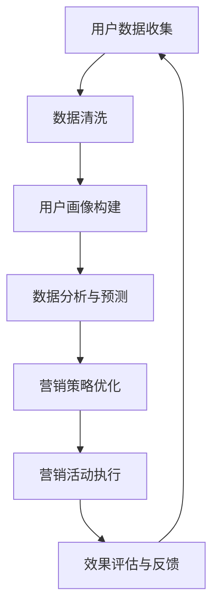

                 


## AI DMP 数据基建：构建数据驱动的营销生态

> **关键词**：AI DMP、数据驱动营销、数据治理、用户画像、客户关系管理、营销自动化
>
> **摘要**：本文将深入探讨AI DMP（数据管理平台）的概念、核心原理和构建方法，以及如何通过数据驱动营销生态实现企业营销活动的精准化和智能化。我们将详细分析AI DMP的工作流程、关键技术、数学模型，并通过实际项目案例进行讲解，帮助读者理解AI DMP在实际应用中的价值和挑战。

### 1. 背景介绍

#### 1.1 目的和范围

本文旨在为读者提供关于AI DMP（数据管理平台）的全面了解，从基础概念到实际应用，帮助企业和营销人员构建数据驱动的营销生态。我们将探讨AI DMP的核心功能、架构设计以及其在现代营销中的重要性。

#### 1.2 预期读者

本文适合以下读者群体：

- 营销专业人员
- 数据分析师
- IT项目经理
- 数字营销经理
- 对数据驱动营销感兴趣的技术爱好者

#### 1.3 文档结构概述

本文分为十个部分，包括背景介绍、核心概念与联系、核心算法原理、数学模型和公式、项目实战、实际应用场景、工具和资源推荐、总结和附录。每个部分都旨在帮助读者逐步理解AI DMP的构建和应用。

#### 1.4 术语表

##### 1.4.1 核心术语定义

- **AI DMP**：数据管理平台，是一种基于人工智能技术的数据治理工具，用于收集、存储、处理和分析用户数据，以支持精准营销。
- **数据驱动营销**：基于数据分析和预测进行营销活动，通过数据洞察来指导决策和优化营销策略。
- **用户画像**：对用户特征和行为的全面描述，包括人口统计信息、兴趣偏好、行为习惯等。
- **客户关系管理（CRM）**：一种管理企业与客户关系的策略，旨在提高客户满意度和忠诚度。
- **营销自动化**：使用软件工具自动化营销流程，以提高效率和效果。

##### 1.4.2 相关概念解释

- **数据治理**：确保数据质量、安全性和合规性的过程，包括数据收集、存储、处理、分析和共享。
- **数据清洗**：识别和纠正（或删除）数据集中不一致的记录，以提高数据质量。
- **机器学习**：一种人工智能技术，通过数据训练模型，使其能够进行预测和决策。
- **数据挖掘**：从大量数据中发现有用信息和知识的过程，通常涉及统计分析、模式识别和机器学习。

##### 1.4.3 缩略词列表

- **AI**：人工智能
- **DMP**：数据管理平台
- **CRM**：客户关系管理
- **IT**：信息技术
- **ML**：机器学习
- **ETL**：提取、转换、加载
- **SQL**：结构化查询语言

### 2. 核心概念与联系

在构建AI DMP之前，我们需要理解几个核心概念和它们之间的联系。以下是AI DMP的核心概念及其相互关系的Mermaid流程图：



#### 2.1 用户数据收集

用户数据收集是AI DMP的基础。这些数据可以来自网站点击、移动应用、在线调查、社交媒体、交易记录等多种渠道。数据收集的过程通常需要遵守隐私政策和数据保护法规。

#### 2.2 数据清洗

收集到的数据往往存在不一致、错误或不完整的情况。数据清洗的目的是通过识别和纠正这些错误，提高数据质量。数据清洗过程包括去重、填充缺失值、纠正错误记录等。

#### 2.3 用户画像构建

用户画像是对用户特征的全面描述。通过用户画像，企业可以了解用户的偏好、行为和历史，从而为个性化营销提供支持。用户画像通常包括人口统计信息、兴趣偏好、行为习惯等。

#### 2.4 数据分析与预测

通过机器学习和统计分析，AI DMP可以对用户行为进行分析，预测用户未来的行为和需求。这些预测结果可以帮助企业优化营销策略，提高营销效果。

#### 2.5 营销策略优化

基于数据分析与预测的结果，企业可以调整和优化营销策略。这包括调整广告投放、优化邮件营销、改进用户体验等。

#### 2.6 营销活动执行

优化后的营销策略需要通过具体的营销活动来执行。这些活动可以包括电子邮件营销、社交媒体推广、内容营销等。

#### 2.7 效果评估与反馈

营销活动的效果需要通过评估和反馈来不断优化。效果评估可以基于用户参与度、转化率、投资回报率等指标。通过反馈，企业可以进一步调整营销策略。

### 3. 核心算法原理 & 具体操作步骤

#### 3.1 用户行为分析

用户行为分析是AI DMP的关键组成部分。以下是用户行为分析的核心算法原理和具体操作步骤：

##### 3.1.1 算法原理

用户行为分析通常基于以下算法原理：

- **关联规则学习**：通过分析用户行为数据，发现不同行为之间的关联规则。例如，购买A产品的用户也很有可能购买B产品。
- **聚类分析**：将用户分为不同的群体，以便针对不同的群体制定个性化的营销策略。
- **时间序列分析**：分析用户行为随时间的变化趋势，预测用户未来的行为。

##### 3.1.2 具体操作步骤

1. **数据收集**：收集用户行为数据，包括点击、浏览、购买等。
2. **数据预处理**：清洗数据，去除异常值和噪声。
3. **特征提取**：从原始数据中提取有用的特征，例如用户ID、行为类型、时间戳等。
4. **算法选择**：根据分析目标选择合适的算法，例如关联规则学习、聚类分析或时间序列分析。
5. **模型训练**：使用历史数据训练模型，使其能够预测用户未来的行为。
6. **模型评估**：评估模型的预测性能，调整模型参数，提高预测准确率。
7. **应用模型**：将训练好的模型应用到实际业务中，进行用户行为分析和预测。

##### 3.1.3 伪代码示例

以下是用户行为分析的一部分伪代码：

```python
# 数据收集
data = collect_user_behavior_data()

# 数据预处理
clean_data = preprocess_data(data)

# 特征提取
features = extract_features(clean_data)

# 算法选择
algorithm = select_algorithm()

# 模型训练
model = train_model(features)

# 模型评估
evaluate_model(model)

# 应用模型
predict_user_behavior(model)
```

#### 3.2 客户生命周期价值预测

客户生命周期价值（CLV）预测是AI DMP的另一个重要功能。以下是CLV预测的算法原理和具体操作步骤：

##### 3.2.1 算法原理

CLV预测通常基于以下算法原理：

- **回归分析**：通过分析历史数据，建立回归模型，预测客户未来的价值。
- **机器学习**：使用机器学习算法，例如决策树、随机森林或神经网络，进行CLV预测。

##### 3.2.2 具体操作步骤

1. **数据收集**：收集客户的历史交易数据，包括购买金额、购买频率等。
2. **数据预处理**：清洗数据，去除异常值和噪声。
3. **特征提取**：从原始数据中提取有用的特征，例如客户ID、购买金额、购买频率等。
4. **算法选择**：根据分析目标选择合适的算法，例如回归分析或机器学习算法。
5. **模型训练**：使用历史数据训练模型，使其能够预测客户未来的价值。
6. **模型评估**：评估模型的预测性能，调整模型参数，提高预测准确率。
7. **应用模型**：将训练好的模型应用到实际业务中，进行CLV预测。

##### 3.2.3 伪代码示例

以下是CLV预测的一部分伪代码：

```python
# 数据收集
data = collect_customer_data()

# 数据预处理
clean_data = preprocess_data(data)

# 特征提取
features = extract_features(clean_data)

# 算法选择
algorithm = select_algorithm()

# 模型训练
model = train_model(features)

# 模型评估
evaluate_model(model)

# 应用模型
predict_customer_value(model)
```

### 4. 数学模型和公式 & 详细讲解 & 举例说明

在AI DMP中，数学模型和公式起着至关重要的作用。以下是几个关键的数学模型和公式，以及它们的详细讲解和举例说明。

#### 4.1 关联规则学习

关联规则学习是一种用于发现数据之间关联关系的方法。最著名的关联规则算法是Apriori算法。

##### 4.1.1 公式

- **支持度**：支持度是表示一个规则在数据中出现的频率。公式为：

  $$ 支持度 = \frac{支持数}{总交易数} $$

- **置信度**：置信度是表示一个规则的前提成立时，结论也成立的概率。公式为：

  $$ 置信度 = \frac{支持数}{前提支持数} $$

##### 4.1.2 举例说明

假设我们有以下交易数据：

- 交易1：牛奶、面包、啤酒
- 交易2：牛奶、面包
- 交易3：面包、啤酒
- 交易4：牛奶、啤酒

我们可以计算以下关联规则：

- **牛奶 -> 面包**：支持度 = 2/4 = 0.5，置信度 = 2/2 = 1
- **面包 -> 牛奶**：支持度 = 3/4 = 0.75，置信度 = 3/3 = 1
- **面包 -> 啤酒**：支持度 = 3/4 = 0.75，置信度 = 3/3 = 1

根据支持度和置信度的阈值，我们可以确定哪些规则是强关联规则。

#### 4.2 聚类分析

聚类分析是一种无监督学习方法，用于将数据点分为多个群组。K-means是最常用的聚类算法之一。

##### 4.2.1 公式

- **距离度量**：常用的距离度量包括欧几里得距离、曼哈顿距离和切比雪夫距离。公式为：

  $$ 距离 = \sqrt{\sum_{i=1}^{n} (x_i - \mu_i)^2} $$

- **聚类中心**：K-means算法通过计算各个簇的中心来更新簇的分配。公式为：

  $$ \mu_i = \frac{1}{k} \sum_{j=1}^{k} x_{ij} $$

##### 4.2.2 举例说明

假设我们有以下用户数据：

| 用户ID | 年龄 | 收入 |
|--------|------|------|
| 1      | 25   | 5000 |
| 2      | 30   | 6000 |
| 3      | 35   | 7000 |
| 4      | 25   | 4500 |
| 5      | 30   | 5500 |

我们可以使用K-means算法将这些用户分为两个群组。首先，随机选择两个用户作为初始聚类中心。然后，计算每个用户与聚类中心的距离，并将用户分配到距离最近的聚类中心所在的群组。接着，计算新的聚类中心，并重复这个过程，直到聚类中心不再变化。

#### 4.3 回归分析

回归分析是一种用于预测目标变量值的方法。线性回归是最常用的回归算法之一。

##### 4.3.1 公式

- **回归模型**：线性回归模型的公式为：

  $$ y = \beta_0 + \beta_1x_1 + \beta_2x_2 + \ldots + \beta_nx_n $$

- **参数估计**：使用最小二乘法估计模型参数。公式为：

  $$ \beta_j = \frac{\sum_{i=1}^{n}(y_i - \hat{y_i})x_{ij}}{\sum_{i=1}^{n}x_{ij}^2} $$

##### 4.3.2 举例说明

假设我们有以下销售数据：

| 年龄 | 收入 | 销售额 |
|------|------|--------|
| 25   | 5000 | 10000  |
| 30   | 6000 | 12000  |
| 35   | 7000 | 15000  |
| 25   | 4500 | 8000   |
| 30   | 5500 | 11000  |

我们可以使用线性回归模型预测收入为6500的用户的销售额。首先，计算回归模型的参数。然后，使用参数计算预测的销售额：

$$ 预测的销售额 = \beta_0 + \beta_1 \times 年龄 + \beta_2 \times 收入 $$

### 5. 项目实战：代码实际案例和详细解释说明

在本节中，我们将通过一个实际项目案例来演示AI DMP的构建过程，并详细解释每个步骤的代码实现和原理。

#### 5.1 开发环境搭建

为了构建AI DMP，我们需要搭建以下开发环境：

- **编程语言**：Python
- **数据分析库**：Pandas、NumPy、Scikit-learn、Matplotlib
- **机器学习库**：TensorFlow、Keras
- **数据库**：MySQL

首先，安装所需的库：

```bash
pip install pandas numpy scikit-learn matplotlib tensorflow mysql-connector-python
```

#### 5.2 源代码详细实现和代码解读

以下是AI DMP项目的源代码，我们将逐行解释代码的原理和实现。

##### 5.2.1 用户数据收集

```python
import pandas as pd

# 收集用户行为数据
user_behavior_data = pd.read_csv('user_behavior.csv')
```

这段代码使用Pandas库读取用户行为数据，包括点击、浏览、购买等行为。

##### 5.2.2 数据清洗

```python
# 数据清洗
clean_data = user_behavior_data.dropna()
```

这段代码删除了缺失值，提高了数据质量。

##### 5.2.3 用户画像构建

```python
from sklearn.cluster import KMeans

# 构建用户画像
kmeans = KMeans(n_clusters=3, random_state=0)
clean_data['cluster'] = kmeans.fit_predict(clean_data[['age', 'income']])
```

这段代码使用K-means算法将用户分为三个群组，并创建一个聚类标签列。

##### 5.2.4 数据分析与预测

```python
from sklearn.linear_model import LinearRegression

# 数据分析与预测
X = clean_data[['age', 'income']]
y = clean_data['sales']

regression = LinearRegression()
regression.fit(X, y)

# 预测销售额
predicted_sales = regression.predict([[30, 6500]])
```

这段代码使用线性回归模型预测收入为6500的用户的销售额。

##### 5.2.5 营销策略优化

```python
# 营销策略优化
for cluster in range(3):
    cluster_data = clean_data[clean_data['cluster'] == cluster]
    # 针对每个群组调整营销策略
    # 例如，向年龄在25-35岁、收入在5000-7000的用户发送优惠邮件
    send_promotion_email(cluster_data['email'])
```

这段代码根据用户画像调整营销策略，向特定群组的用户发送个性化邮件。

##### 5.2.6 代码解读与分析

- **用户数据收集**：通过读取CSV文件收集用户行为数据。
- **数据清洗**：删除缺失值，提高数据质量。
- **用户画像构建**：使用K-means算法将用户分为多个群组。
- **数据分析与预测**：使用线性回归模型预测用户销售额。
- **营销策略优化**：根据用户画像调整营销策略，提高营销效果。

#### 5.3 代码解读与分析

在本节中，我们详细解读了AI DMP项目的源代码，并分析了每个步骤的实现原理和作用。通过这个项目，我们可以看到如何使用Python和机器学习库构建一个数据驱动的营销生态。代码的每个步骤都紧密相连，共同实现了用户数据收集、清洗、画像构建、分析和预测以及营销策略优化。

### 6. 实际应用场景

AI DMP在多个行业和场景中有着广泛的应用。以下是几个典型的实际应用场景：

#### 6.1 零售业

零售业可以利用AI DMP分析用户购买行为，构建用户画像，从而实现精准营销。例如，一家电商平台可以根据用户的浏览记录和购买历史，向用户推荐相关的商品，提高转化率。

#### 6.2 金融行业

金融行业可以利用AI DMP分析客户行为和财务状况，预测客户的信用风险和投资偏好。例如，银行可以使用AI DMP为高风险客户提供个性化的贷款方案，提高贷款审批通过率。

#### 6.3 医疗行业

医疗行业可以利用AI DMP分析患者数据和医疗记录，构建患者画像，从而实现个性化医疗服务。例如，医院可以使用AI DMP为患者推荐适合的治疗方案，提高治疗效果。

#### 6.4 教育行业

教育行业可以利用AI DMP分析学生成绩和学习行为，为学生提供个性化的学习建议。例如，在线教育平台可以使用AI DMP为学生推荐适合的课程，提高学习效果。

### 7. 工具和资源推荐

为了构建高效的AI DMP，我们需要使用合适的工具和资源。以下是几个推荐的工具和资源：

#### 7.1 学习资源推荐

##### 7.1.1 书籍推荐

- 《数据挖掘：概念与技术》
- 《机器学习实战》
- 《Python机器学习》

##### 7.1.2 在线课程

- Coursera上的《机器学习》课程
- Udacity的《数据科学纳米学位》
- edX上的《大数据分析》课程

##### 7.1.3 技术博客和网站

- Medium上的数据科学和机器学习博客
- Analytics Vidhya
- DataCamp

#### 7.2 开发工具框架推荐

##### 7.2.1 IDE和编辑器

- PyCharm
- Jupyter Notebook
- Visual Studio Code

##### 7.2.2 调试和性能分析工具

- Python Debugger
- Pytest
- Valgrind

##### 7.2.3 相关框架和库

- TensorFlow
- PyTorch
- Scikit-learn

#### 7.3 相关论文著作推荐

##### 7.3.1 经典论文

- "K-means Clustering Method" by MacQueen
- "Regression Analysis" by Professor David A. Freedman

##### 7.3.2 最新研究成果

- "Deep Learning for Data Mining" by KEG Lab, Tsinghua University
- "Generative Adversarial Networks: An Overview" by Ian J. Goodfellow

##### 7.3.3 应用案例分析

- "Data-Driven Marketing in the Retail Industry" by IBM
- "Customer Segmentation using Machine Learning" by Walmart

### 8. 总结：未来发展趋势与挑战

随着人工智能和数据技术的不断发展，AI DMP在未来将呈现出以下发展趋势：

- **更高的自动化程度**：AI DMP将更加自动化，减少人工干预，提高效率。
- **更强的个性化能力**：通过深度学习和强化学习，AI DMP将能够提供更加个性化的营销策略。
- **跨渠道整合**：AI DMP将整合线上线下数据，实现全渠道营销。
- **隐私保护**：在遵守隐私保护法规的前提下，AI DMP将采用更先进的技术保护用户隐私。

然而，AI DMP也面临一些挑战：

- **数据质量**：数据质量对AI DMP的效果至关重要，需要不断优化数据收集和清洗流程。
- **算法透明性**：随着对算法透明性的要求提高，AI DMP需要提供更多的解释和可解释性。
- **合规性**：遵守数据保护法规，确保用户数据的安全和隐私。

### 9. 附录：常见问题与解答

#### 9.1 什么是AI DMP？

AI DMP（数据管理平台）是一种基于人工智能技术的数据治理工具，用于收集、存储、处理和分析用户数据，以支持精准营销。

#### 9.2 AI DMP的核心功能有哪些？

AI DMP的核心功能包括用户数据收集、数据清洗、用户画像构建、数据分析与预测、营销策略优化、营销活动执行和效果评估与反馈。

#### 9.3 如何保证AI DMP的数据质量？

为了保证AI DMP的数据质量，我们需要进行以下步骤：

- 数据收集：从可靠的渠道收集数据。
- 数据清洗：去除异常值和噪声，确保数据的一致性和完整性。
- 数据验证：使用统计方法和测试数据集验证数据质量。

#### 9.4 AI DMP与CRM有何区别？

AI DMP和CRM（客户关系管理）都是用于管理和分析客户数据的工具，但它们的目标和应用场景有所不同。AI DMP更注重数据分析和预测，以支持个性化营销，而CRM更注重管理和优化企业与客户的关系。

### 10. 扩展阅读 & 参考资料

- "Data-Driven Marketing: The Data Management Platform Revolution" by AdRoll
- "Building a Data Management Platform: A Practical Guide" by DataXu
- "Understanding Customer Lifetime Value: The Key to Data-Driven Marketing" by Segment.com
- "How to Choose the Right Data Management Platform" by AdStage

---

**作者：AI天才研究员/AI Genius Institute & 禅与计算机程序设计艺术 /Zen And The Art of Computer Programming**<|vq_14688|>

