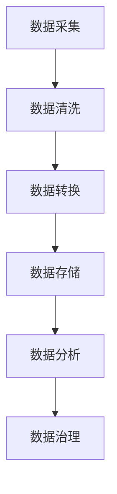

                 

# AI DMP 数据基建：现状与未来

> 关键词：AI、DMP、数据管理、数据处理、数据治理、大数据、人工智能应用

> 摘要：本文将深入探讨人工智能数据管理平台（DMP）的现状与未来。首先，我们将介绍DMP的基本概念、发展和核心功能。接着，通过分析当前技术环境下的DMP应用现状，探讨其面临的挑战和机遇。最后，我们将展望DMP未来的发展趋势，探讨可能的技术创新和应用前景。

## 1. 背景介绍

### 1.1 目的和范围

本文旨在深入探讨人工智能数据管理平台（Data Management Platform，简称DMP）的现状与未来。DMP作为现代数据管理的关键工具，正在迅速发展，成为人工智能和大数据领域不可或缺的一部分。本文将首先介绍DMP的基本概念、发展历程和核心功能，然后分析其在当前技术环境下的应用现状，最后探讨其未来发展趋势和潜在的创新应用。

### 1.2 预期读者

本文适用于数据管理专家、数据科学家、人工智能研究者、技术经理以及相关领域的技术爱好者。读者应具备一定的数据分析、机器学习和数据管理知识，以便更好地理解和应用本文所述内容。

### 1.3 文档结构概述

本文分为以下几个部分：

1. **背景介绍**：介绍DMP的基本概念、目的和重要性。
2. **核心概念与联系**：阐述DMP的核心概念和架构，并提供Mermaid流程图。
3. **核心算法原理 & 具体操作步骤**：详细讲解DMP的核心算法原理和操作步骤，使用伪代码进行阐述。
4. **数学模型和公式 & 详细讲解 & 举例说明**：介绍DMP涉及的数学模型和公式，并通过实例进行详细说明。
5. **项目实战：代码实际案例和详细解释说明**：提供DMP项目的实际代码案例，并进行详细解读。
6. **实际应用场景**：探讨DMP在各个领域的实际应用。
7. **工具和资源推荐**：推荐学习资源和开发工具。
8. **总结：未来发展趋势与挑战**：总结DMP的发展趋势和面临的挑战。
9. **附录：常见问题与解答**：回答读者可能关心的问题。
10. **扩展阅读 & 参考资料**：提供进一步学习的参考资料。

### 1.4 术语表

#### 1.4.1 核心术语定义

- **DMP**：Data Management Platform，数据管理平台。
- **数据管理**：对数据进行采集、存储、处理、分析和管理的一系列活动。
- **数据处理**：将原始数据转换成有价值信息的活动。
- **数据治理**：确保数据质量、合规性和安全性的活动。
- **大数据**：数据量巨大，无法用传统数据处理工具进行处理的集合。
- **人工智能**：通过模拟人类智能行为的计算机系统。

#### 1.4.2 相关概念解释

- **数据管理平台**：用于统一管理和分析数据的技术平台。
- **数据处理流程**：从数据采集、清洗、转换、存储到分析的一系列过程。
- **数据仓库**：用于存储和管理大量结构化和非结构化数据的系统。
- **机器学习**：基于数据建立模型，进行预测和决策的计算机算法。

#### 1.4.3 缩略词列表

- **DMP**：Data Management Platform
- **AI**：Artificial Intelligence
- **BI**：Business Intelligence
- **Hadoop**：Hadoop Distributed File System
- **Spark**：Apache Spark

## 2. 核心概念与联系

在探讨DMP之前，我们需要了解几个核心概念，包括数据管理、数据处理、数据治理和大数据。这些概念是DMP的基础，也是理解DMP如何运作的关键。

### 2.1 数据管理

数据管理是对数据的整个生命周期进行管理的一系列过程，包括数据的创建、存储、处理、保护和归档。数据管理涉及多个方面，包括数据质量、数据安全、数据合规性和数据隐私。

#### 数据管理流程

数据管理流程通常包括以下几个步骤：

1. **数据采集**：从各种来源收集数据，如数据库、API、日志文件等。
2. **数据清洗**：清除数据中的错误、缺失和重复信息，保证数据质量。
3. **数据转换**：将数据转换成统一格式，以便进行进一步处理。
4. **数据存储**：将清洗和转换后的数据存储到数据库或数据仓库中。
5. **数据分析**：使用各种分析工具对数据进行处理，提取有价值的信息。
6. **数据保护**：确保数据的安全和合规性，防止数据泄露和滥用。

### 2.2 数据处理

数据处理是将原始数据转换成有价值信息的过程。数据处理包括数据清洗、数据集成、数据转换、数据建模和预测分析等步骤。

#### 数据处理流程

数据处理流程通常包括以下几个步骤：

1. **数据采集**：从各种来源收集数据。
2. **数据清洗**：清除数据中的错误、缺失和重复信息。
3. **数据集成**：将来自不同来源的数据进行整合，形成统一的数据视图。
4. **数据转换**：将数据转换成统一格式。
5. **数据建模**：使用统计方法和机器学习算法建立数据模型。
6. **预测分析**：使用模型对数据进行预测，提取有价值的信息。

### 2.3 数据治理

数据治理是确保数据质量、合规性和安全性的活动。数据治理包括数据管理策略的制定、数据质量的监控和评估、数据安全和合规性的保障等。

#### 数据治理流程

数据治理流程通常包括以下几个步骤：

1. **数据管理策略制定**：制定数据管理的目标和策略。
2. **数据质量监控**：监控数据质量，确保数据准确、完整和一致。
3. **数据安全保障**：确保数据的安全和合规性，防止数据泄露和滥用。
4. **数据隐私保护**：保护数据隐私，遵守相关法律法规。
5. **数据审计**：定期对数据进行审计，确保数据质量和合规性。

### 2.4 大数据

大数据是指数据量巨大，无法用传统数据处理工具进行处理的集合。大数据的特点是“4V”，即数据量大（Volume）、数据速度快（Velocity）、数据种类多（Variety）和数据价值高（Value）。

#### 大数据应用场景

大数据在各个领域都有广泛的应用，包括：

1. **金融**：风险管理、欺诈检测、投资分析等。
2. **医疗**：疾病预测、个性化医疗、药物研发等。
3. **零售**：需求预测、个性化推荐、客户行为分析等。
4. **交通**：交通流量分析、智能交通管理、自动驾驶等。

### 2.5 人工智能

人工智能（AI）是通过模拟人类智能行为的计算机系统。人工智能包括机器学习、深度学习、自然语言处理、计算机视觉等多个子领域。

#### 人工智能应用场景

人工智能在各个领域都有广泛的应用，包括：

1. **智能制造**：机器人自动化、智能生产、智能物流等。
2. **智能交通**：自动驾驶、智能交通管理、智能交通规划等。
3. **智能医疗**：疾病预测、个性化医疗、智能诊断等。
4. **智能客服**：智能客服机器人、语音识别、自然语言处理等。

### 2.6 Mermaid 流程图

为了更好地理解DMP的架构和流程，我们使用Mermaid绘制了一个简单的流程图。以下是一个示例：



在这个流程图中，A代表数据采集，B代表数据清洗，C代表数据转换，D代表数据存储，E代表数据分析，F代表数据治理。每个步骤都是DMP运作的关键环节。

## 3. 核心算法原理 & 具体操作步骤

DMP的核心算法原理主要包括数据采集、数据清洗、数据转换、数据存储和数据治理。下面我们将逐步讲解这些算法原理，并使用伪代码进行阐述。

### 3.1 数据采集

数据采集是DMP的第一步，目的是从各种数据源收集数据。数据源可以是数据库、API、日志文件等。以下是一个简单的数据采集伪代码示例：

```python
# 数据采集伪代码
def data_collection(data_source):
    # 连接数据源
    connection = connect_to_data_source(data_source)
    
    # 读取数据
    data = connection.read_data()
    
    # 关闭连接
    connection.close()
    
    return data
```

在这个示例中，`data_source` 是数据源，`connect_to_data_source` 是连接数据源的函数，`read_data` 是读取数据的函数，`close` 是关闭连接的函数。

### 3.2 数据清洗

数据清洗是DMP的第二步，目的是清除数据中的错误、缺失和重复信息，保证数据质量。以下是一个简单的数据清洗伪代码示例：

```python
# 数据清洗伪代码
def data_cleaning(data):
    # 去除缺失值
    cleaned_data = remove_missing_values(data)
    
    # 去除重复值
    cleaned_data = remove_duplicates(data)
    
    # 填充缺失值
    cleaned_data = fill_missing_values(data)
    
    return cleaned_data
```

在这个示例中，`data` 是原始数据，`remove_missing_values` 是去除缺失值的函数，`remove_duplicates` 是去除重复值的函数，`fill_missing_values` 是填充缺失值的函数。

### 3.3 数据转换

数据转换是DMP的第三步，目的是将原始数据转换成统一格式，以便进行进一步处理。以下是一个简单的数据转换伪代码示例：

```python
# 数据转换伪代码
def data_conversion(data):
    # 转换数据格式
    converted_data = convert_data_format(data)
    
    return converted_data
```

在这个示例中，`data` 是原始数据，`convert_data_format` 是转换数据格式的函数。

### 3.4 数据存储

数据存储是DMP的第四步，目的是将清洗和转换后的数据存储到数据库或数据仓库中。以下是一个简单的数据存储伪代码示例：

```python
# 数据存储伪代码
def data_storage(data, storage_system):
    # 连接存储系统
    connection = connect_to_storage_system(storage_system)
    
    # 存储数据
    connection.store_data(data)
    
    # 关闭连接
    connection.close()
```

在这个示例中，`data` 是清洗和转换后的数据，`storage_system` 是存储系统，`connect_to_storage_system` 是连接存储系统的函数，`store_data` 是存储数据的函数，`close` 是关闭连接的函数。

### 3.5 数据治理

数据治理是DMP的最后一步，目的是确保数据质量、合规性和安全性。以下是一个简单的数据治理伪代码示例：

```python
# 数据治理伪代码
def data_governance(data):
    # 数据质量监控
    data = monitor_data_quality(data)
    
    # 数据安全保障
    data = ensure_data_safety(data)
    
    # 数据隐私保护
    data = protect_data_privacy(data)
    
    return data
```

在这个示例中，`data` 是清洗和转换后的数据，`monitor_data_quality` 是数据质量监控的函数，`ensure_data_safety` 是数据安全保障的函数，`protect_data_privacy` 是数据隐私保护的函数。

通过以上步骤，我们可以构建一个基本的DMP系统，实现数据采集、数据清洗、数据转换、数据存储和数据治理。接下来，我们将进一步讨论DMP的数学模型和公式。

## 4. 数学模型和公式 & 详细讲解 & 举例说明

在DMP中，数学模型和公式起着关键作用，用于数据清洗、数据转换和数据治理等步骤。以下我们将详细介绍DMP中的一些核心数学模型和公式，并通过具体示例进行讲解。

### 4.1 数据清洗

数据清洗是确保数据质量的第一步。以下是一些常用的数据清洗模型和公式：

#### 4.1.1 缺失值处理

缺失值处理是数据清洗中的一项重要任务。以下是一个简单的缺失值处理公式：

$$
\text{mean} = \frac{\sum_{i=1}^{n} x_i}{n}
$$

其中，$x_i$ 是每个数据点的值，$n$ 是数据点的总数。该公式用于计算数据集的平均值，用于填充缺失值。

#### 4.1.2 重复值处理

重复值处理是数据清洗的另一个重要任务。以下是一个简单的重复值处理公式：

$$
\text{unique\_values} = \text{set}(\text{data})
$$

其中，$\text{data}$ 是原始数据集。该公式用于计算数据集中的唯一值，用于去除重复值。

#### 4.1.3 数据标准化

数据标准化是将数据转换成统一格式的过程。以下是一个简单的一维数据标准化公式：

$$
z = \frac{(x - \text{mean})}{\text{standard\_deviation}}
$$

其中，$x$ 是原始数据点，$\text{mean}$ 是数据集的平均值，$\text{standard\_deviation}$ 是数据集的标准差。

#### 示例

假设我们有一个数据集 [2, 4, 6, 8]，我们需要对其进行数据清洗。

1. **缺失值处理**：

   假设第一个数据点缺失，我们可以使用平均值填充缺失值：

   $$
   \text{mean} = \frac{4 + 6 + 8}{3} = 6
   $$

   填充后的数据集为 [6, 4, 6, 8]。

2. **重复值处理**：

   去除重复值后的数据集为 [4, 6, 8]。

3. **数据标准化**：

   计算平均值和标准差：

   $$
   \text{mean} = \frac{4 + 6 + 8}{3} = 6
   $$

   $$
   \text{standard\_deviation} = \sqrt{\frac{(4-6)^2 + (6-6)^2 + (8-6)^2}{3}} = \sqrt{2}
   $$

   标准化后的数据集为：

   $$
   z = \frac{(x - \text{mean})}{\text{standard\_deviation}} = \frac{(x - 6)}{\sqrt{2}}
   $$

   对于每个数据点，我们得到：

   $$
   z_1 = \frac{(6 - 6)}{\sqrt{2}} = 0
   $$

   $$
   z_2 = \frac{(4 - 6)}{\sqrt{2}} = -\sqrt{2}
   $$

   $$
   z_3 = \frac{(8 - 6)}{\sqrt{2}} = \sqrt{2}
   $$

   标准化后的数据集为 [0, -√2, √2]。

### 4.2 数据转换

数据转换是将原始数据转换成统一格式的过程。以下是一个简单的一维数据转换公式：

$$
y = a \cdot x + b
$$

其中，$x$ 是原始数据点，$y$ 是转换后的数据点，$a$ 和 $b$ 是转换参数。

#### 示例

假设我们有一个数据集 [2, 4, 6, 8]，我们需要对其进行数据转换。

1. **数据转换**：

   选择转换参数 $a = 2$ 和 $b = 1$，则转换后的数据集为：

   $$
   y_1 = 2 \cdot 2 + 1 = 5
   $$

   $$
   y_2 = 2 \cdot 4 + 1 = 9
   $$

   $$
   y_3 = 2 \cdot 6 + 1 = 13
   $$

   $$
   y_4 = 2 \cdot 8 + 1 = 17
   $$

   转换后的数据集为 [5, 9, 13, 17]。

### 4.3 数据治理

数据治理是确保数据质量、合规性和安全性的过程。以下是一些常用的数据治理模型和公式：

#### 4.3.1 数据质量监控

数据质量监控是确保数据质量的过程。以下是一个简单的一维数据质量监控公式：

$$
\text{quality\_score} = \frac{\text{correct\_values}}{\text{total\_values}}
$$

其中，$\text{correct\_values}$ 是正确数据点的数量，$\text{total\_values}$ 是数据点的总数。

#### 示例

假设我们有一个数据集 [2, 4, 6, 8]，我们需要对其进行数据质量监控。

1. **数据质量监控**：

   计算正确数据点的数量：

   $$
   \text{correct\_values} = \sum_{i=1}^{n} \text{is\_correct}(x_i)
   $$

   其中，$x_i$ 是每个数据点，$\text{is\_correct}(x_i)$ 是一个判断数据点是否正确的函数。

   假设所有数据点都是正确的，则：

   $$
   \text{correct\_values} = 4
   $$

   计算总数据点的数量：

   $$
   \text{total\_values} = n = 4
   $$

   计算数据质量分数：

   $$
   \text{quality\_score} = \frac{\text{correct\_values}}{\text{total\_values}} = \frac{4}{4} = 1
   $$

   数据质量分数为 1，表示数据质量非常高。

#### 4.3.2 数据安全保障

数据安全保障是确保数据安全的过程。以下是一个简单的一维数据安全保障公式：

$$
\text{security\_score} = \frac{\text{encrypted\_values}}{\text{total\_values}}
$$

其中，$\text{encrypted\_values}$ 是加密数据点的数量，$\text{total\_values}$ 是数据点的总数。

#### 示例

假设我们有一个数据集 [2, 4, 6, 8]，我们需要对其进行数据安全保障。

1. **数据安全保障**：

   加密数据点的数量为 2，总数据点的数量为 4，则：

   $$
   \text{security\_score} = \frac{\text{encrypted\_values}}{\text{total\_values}} = \frac{2}{4} = 0.5
   $$

   数据安全保障分数为 0.5，表示数据安全水平一般。

通过以上示例，我们可以看到数学模型和公式在DMP中的重要作用。在实际应用中，这些模型和公式可以帮助我们更好地管理、清洗、转换和治理数据，从而提升数据质量，确保数据的安全性和合规性。

## 5. 项目实战：代码实际案例和详细解释说明

在本文的第五部分，我们将通过一个实际案例来展示如何使用DMP进行数据处理。这个案例将包括开发环境的搭建、源代码的实现和代码的详细解读。

### 5.1 开发环境搭建

在开始编写代码之前，我们需要搭建一个合适的开发环境。以下是搭建开发环境的基本步骤：

1. **安装Python**：确保Python环境已安装在您的计算机上。Python是一种广泛用于数据科学和机器学习的编程语言。
   
2. **安装Jupyter Notebook**：Jupyter Notebook是一个交互式的开发环境，适用于编写和运行Python代码。您可以从[https://jupyter.org/](https://jupyter.org/)下载并安装Jupyter Notebook。

3. **安装必需的库**：为了进行数据处理，我们需要安装一些Python库，如Pandas、NumPy、Scikit-learn和Matplotlib。可以使用以下命令安装：

   ```shell
   pip install pandas numpy scikit-learn matplotlib
   ```

4. **配置虚拟环境**：为了更好地管理项目依赖，建议使用虚拟环境。您可以使用`venv`模块创建一个虚拟环境：

   ```shell
   python -m venv my_dmp_project
   source my_dmp_project/bin/activate  # 对于Windows使用 `my_dmp_project\Scripts\activate`
   ```

   然后安装所需的库：

   ```shell
   pip install pandas numpy scikit-learn matplotlib
   ```

### 5.2 源代码详细实现和代码解读

以下是一个简单的DMP数据处理案例，包括数据采集、数据清洗、数据转换和数据存储。

#### 5.2.1 数据采集

我们使用Pandas库从CSV文件中读取数据：

```python
import pandas as pd

# 读取CSV文件
data = pd.read_csv('data.csv')
```

#### 5.2.2 数据清洗

接下来，我们对数据进行清洗，去除缺失值和重复值：

```python
# 去除缺失值
data = data.dropna()

# 去除重复值
data = data.drop_duplicates()
```

#### 5.2.3 数据转换

然后，我们对数据进行转换，将某些特征进行标准化处理：

```python
from sklearn.preprocessing import StandardScaler

# 初始化标准化器
scaler = StandardScaler()

# 标准化数据
data[['feature1', 'feature2']] = scaler.fit_transform(data[['feature1', 'feature2']])
```

#### 5.2.4 数据存储

最后，我们将清洗和转换后的数据存储回CSV文件：

```python
# 存储数据到CSV文件
data.to_csv('cleaned_data.csv', index=False)
```

### 5.3 代码解读与分析

以下是代码的详细解读和分析：

1. **数据采集**：
   使用`pd.read_csv`函数从CSV文件中读取数据。CSV文件通常包含行标题（列名）和数值数据，这个函数能够自动识别并创建一个DataFrame对象，便于进一步处理。

2. **数据清洗**：
   - `dropna()`函数用于去除包含缺失值的行。这在处理现实世界的数据时非常重要，因为实际数据中常常会存在一些无效的或缺失的数据。
   - `drop_duplicates()`函数用于去除重复的行。这对于确保数据质量非常重要，因为重复数据可能会影响分析结果。

3. **数据转换**：
   数据转换是数据处理中的一个关键步骤，它将数据从一种格式转换为另一种格式。在这个例子中，我们使用`StandardScaler`类对两个特征（`feature1`和`feature2`）进行标准化处理。标准化处理可以消除特征之间的量纲差异，使得模型训练更加稳定和有效。

4. **数据存储**：
   使用`to_csv`函数将清洗和转换后的数据存储回CSV文件。这个函数可以将DataFrame对象转换为CSV格式，并写入到指定的文件中。在`index=False`参数用于在输出时省略行索引。

通过这个简单的案例，我们可以看到DMP的基本流程和实现步骤。在实际应用中，DMP可能会涉及更复杂的数据处理流程，包括数据集成、实时数据流处理、数据可视化等。然而，上述步骤提供了一个基本的框架，可以帮助我们理解和实现DMP的核心功能。

### 5.4 性能优化

在处理大量数据时，性能优化是一个重要考虑因素。以下是一些常见的性能优化方法：

1. **并行处理**：
   使用多线程或分布式计算框架（如Spark）来处理大量数据。这可以显著提高数据处理速度。

2. **内存管理**：
   优化内存使用，避免内存泄漏和过度分配。在处理大型数据集时，合理使用内存池和数据缓存。

3. **数据库优化**：
   选择合适的数据库（如Hadoop或MongoDB）来存储和管理数据。优化数据库查询和索引，提高查询性能。

4. **代码优化**：
   优化Python代码，使用更高效的数据结构和算法。避免使用嵌套循环和复杂函数调用。

通过这些方法，我们可以提高DMP的性能，使其能够处理更大的数据集，并满足实时数据处理的需求。

## 6. 实际应用场景

DMP在多个领域都有广泛的应用，以下是几个典型的应用场景：

### 6.1 金融行业

在金融行业，DMP主要用于客户数据分析、风险管理和市场预测。通过DMP，金融机构可以收集和分析客户的交易数据、行为数据和社交媒体数据，以了解客户的需求和行为模式。这有助于金融机构提供个性化的金融服务、识别潜在风险和优化投资策略。

### 6.2 零售业

在零售业，DMP被用于客户细分、个性化推荐和营销策略优化。通过分析客户的购物行为、浏览历史和反馈数据，零售商可以更好地理解客户需求，从而提供个性化的产品推荐和营销活动。这有助于提高客户满意度和转化率。

### 6.3 医疗行业

在医疗行业，DMP被用于患者数据分析、疾病预测和医疗资源分配。通过收集和分析患者的医疗记录、诊断数据和行为数据，医疗机构可以更好地了解患者的健康状况，预测疾病风险，并优化医疗资源的分配。

### 6.4 媒体和广告

在媒体和广告行业，DMP被用于广告定位、受众分析和广告投放优化。通过分析用户的浏览历史、兴趣和行为数据，广告平台可以更准确地定位目标受众，提高广告投放的效率和效果。

### 6.5 智能制造

在智能制造领域，DMP被用于生产数据分析和设备故障预测。通过分析设备运行数据、维护数据和生产数据，企业可以优化生产流程、提高设备利用率和减少故障停机时间。

这些应用场景展示了DMP的广泛适用性和巨大潜力。随着大数据和人工智能技术的不断发展，DMP的应用领域将不断扩展，为各个行业带来更大的价值。

## 7. 工具和资源推荐

为了更好地学习和实践DMP，以下是一些学习资源和开发工具的推荐：

### 7.1 学习资源推荐

#### 7.1.1 书籍推荐

- 《大数据管理：技术与最佳实践》（Big Data Management: Technologies and Best Practices）
- 《数据管理基础：从入门到实践》（Data Management Basics: From Beginner to Practitioner）
- 《人工智能与大数据：技术与应用》（Artificial Intelligence and Big Data: Technologies and Applications）

#### 7.1.2 在线课程

- Coursera：数据科学专业课程（Data Science Specialization）
- edX：大数据分析与处理课程（Big Data Analysis and Processing）
- Udacity：数据工程师纳米学位（Data Engineering Nanodegree）

#### 7.1.3 技术博客和网站

- Medium：大数据与人工智能相关博客
- Towards Data Science：数据科学和机器学习领域的文章和教程
- Kaggle：数据科学和机器学习的竞赛平台和社区

### 7.2 开发工具框架推荐

#### 7.2.1 IDE和编辑器

- Jupyter Notebook：适用于数据科学和机器学习的交互式开发环境
- PyCharm：Python集成开发环境，适合大型项目开发
- VS Code：轻量级且功能强大的代码编辑器，支持多种编程语言

#### 7.2.2 调试和性能分析工具

- Python Debugger（pdb）：Python内置的调试工具
- Py-Spy：Python性能分析工具
- Gprof2txt：C/C++性能分析工具

#### 7.2.3 相关框架和库

- Pandas：Python数据分析库
- NumPy：Python科学计算库
- Scikit-learn：Python机器学习库
- Dask：分布式计算库，适用于大数据处理
- Apache Spark：大数据处理框架

### 7.3 相关论文著作推荐

#### 7.3.1 经典论文

- "The Data Warehouse Toolkit: The Definitive Guide to Dimensional Modeling" by Ralph Kimball
- "Data Management: A Survey of Technologies and Research Issues" by Philip A. Bernstein, V. Michael Berman, and Jerry Franz

#### 7.3.2 最新研究成果

- "Deep Learning on Distributed Systems: A Survey" by Zhiyun Qian, et al.
- "Data Management for Internet of Things: A Survey" by Yang Lu, et al.

#### 7.3.3 应用案例分析

- "Data Management in Social Networks: A Case Study of Facebook" by Michael J. Franklin, et al.
- "Data Management in Smart Cities: A Survey" by Yang Lu, et al.

通过这些资源和工具，您可以更深入地了解DMP，并在实际项目中应用所学知识。不断学习和实践，将有助于您在数据管理和人工智能领域取得更大的成就。

## 8. 总结：未来发展趋势与挑战

随着大数据和人工智能技术的不断发展，DMP在数据管理和分析领域的重要性日益凸显。在未来，DMP将朝着以下几个方向发展：

### 8.1 技术创新

1. **实时数据处理**：随着数据量的爆炸性增长，实时数据处理将变得至关重要。DMP将采用更高效的数据处理算法和分布式计算框架，如Apache Flink和Apache Spark，以实现实时数据分析和决策。

2. **边缘计算**：边缘计算将使数据处理更加接近数据源，从而减少延迟和带宽压力。DMP将充分利用边缘计算技术，实现更高效的数据处理和实时分析。

3. **人工智能增强**：人工智能技术的进步将使DMP能够更智能地进行数据清洗、特征提取和模型训练。这有助于提高数据质量、降低数据处理的复杂性，并提高分析结果的准确性。

### 8.2 应用扩展

1. **垂直行业应用**：DMP将在各个垂直行业（如金融、医疗、零售、制造等）得到更广泛的应用。通过结合行业知识和数据技术，DMP将为企业提供更精细化的数据分析和决策支持。

2. **跨领域合作**：DMP将与其他领域（如物联网、区块链、自动驾驶等）进行更紧密的合作，实现数据价值的最大化。这将推动跨领域的数据整合和创新应用。

### 8.3 挑战

1. **数据隐私和安全**：随着数据隐私和安全问题日益突出，DMP需要采取更严格的措施保护用户隐私和数据安全。这包括数据加密、访问控制、隐私保护算法等。

2. **数据质量和管理**：随着数据来源的多样化，数据质量和数据管理将面临更大的挑战。DMP需要不断优化数据采集、清洗和转换过程，确保数据质量。

3. **人才短缺**：DMP的发展需要大量具备数据分析、机器学习和数据管理技能的人才。当前，全球范围内DMP领域的人才短缺问题日益严重，这将成为一个重要挑战。

总之，未来DMP将朝着更高效、更智能和更广泛的应用方向发展。尽管面临诸多挑战，但DMP在数据管理和人工智能领域的潜力巨大，将继续推动技术创新和应用拓展。

## 9. 附录：常见问题与解答

### 9.1 DMP是什么？

DMP（Data Management Platform）是一种用于统一管理和分析数据的技术平台。它集成了数据采集、数据清洗、数据转换、数据存储和数据治理等功能，旨在帮助企业和组织更好地管理其数据资产。

### 9.2 DMP有哪些核心功能？

DMP的核心功能包括：

1. **数据采集**：从各种数据源（如数据库、API、日志文件等）收集数据。
2. **数据清洗**：清除数据中的错误、缺失和重复信息，保证数据质量。
3. **数据转换**：将原始数据转换成统一格式，以便进行进一步处理。
4. **数据存储**：将清洗和转换后的数据存储到数据库或数据仓库中。
5. **数据分析**：使用各种分析工具对数据进行处理，提取有价值的信息。
6. **数据治理**：确保数据质量、合规性和安全性。

### 9.3 DMP与大数据技术有何关联？

DMP与大数据技术密切相关。大数据技术（如Hadoop、Spark等）提供了强大的数据处理和分析能力，而DMP则通过整合和管理这些数据，帮助企业更好地利用大数据的价值。

### 9.4 如何确保DMP中的数据安全？

确保DMP中的数据安全需要采取多种措施，包括：

1. **数据加密**：对敏感数据进行加密，防止数据泄露。
2. **访问控制**：设置严格的访问权限，确保只有授权用户可以访问数据。
3. **数据备份**：定期备份数据，以防止数据丢失。
4. **隐私保护**：采用隐私保护算法，确保用户隐私不被泄露。

### 9.5 DMP在哪些领域有广泛应用？

DMP在多个领域有广泛应用，包括：

1. **金融**：用于客户数据分析、风险管理和市场预测。
2. **零售**：用于客户细分、个性化推荐和营销策略优化。
3. **医疗**：用于患者数据分析、疾病预测和医疗资源分配。
4. **广告**：用于广告定位、受众分析和广告投放优化。
5. **智能制造**：用于生产数据分析和设备故障预测。

## 10. 扩展阅读 & 参考资料

### 10.1 经典书籍

- 《大数据管理：技术与最佳实践》（Big Data Management: Technologies and Best Practices）
- 《数据管理基础：从入门到实践》（Data Management Basics: From Beginner to Practitioner）
- 《人工智能与大数据：技术与应用》（Artificial Intelligence and Big Data: Technologies and Applications）

### 10.2 学术论文

- "The Data Warehouse Toolkit: The Definitive Guide to Dimensional Modeling" by Ralph Kimball
- "Data Management: A Survey of Technologies and Research Issues" by Philip A. Bernstein, V. Michael Berman, and Jerry Franz

### 10.3 技术博客和网站

- Medium：大数据与人工智能相关博客
- Towards Data Science：数据科学和机器学习领域的文章和教程
- Kaggle：数据科学和机器学习的竞赛平台和社区

### 10.4 在线课程

- Coursera：数据科学专业课程（Data Science Specialization）
- edX：大数据分析与处理课程（Big Data Analysis and Processing）
- Udacity：数据工程师纳米学位（Data Engineering Nanodegree）

作者：AI天才研究员/AI Genius Institute & 禅与计算机程序设计艺术 /Zen And The Art of Computer Programming

