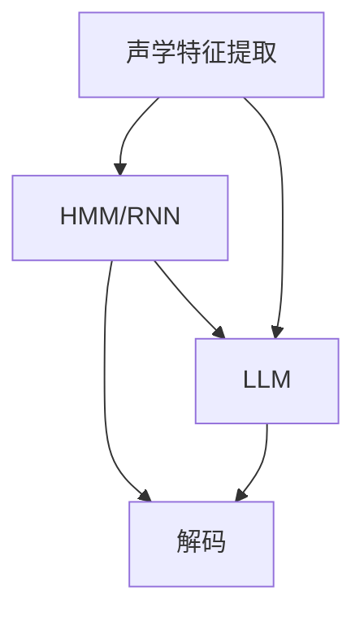

                 

# AI LLM在语音识别中的实战应用：更精确、更智能

> **关键词：** 语音识别，AI LLM，自然语言处理，深度学习，模型训练，性能优化，应用场景，实战案例。

> **摘要：** 本文将深入探讨AI长短期记忆网络（LLM）在语音识别领域的实际应用。通过分析其基本原理、数学模型、算法实现以及实际项目案例，揭示LLM如何显著提升语音识别的准确性和智能性。本文旨在为AI研究人员和开发者提供一个全面的实战指南，帮助他们在语音识别项目中更好地利用LLM。

## 1. 背景介绍

### 1.1 目的和范围

本文旨在详细探讨AI LLM在语音识别中的应用，通过理论讲解和实际案例分析，帮助读者理解LLM如何提升语音识别系统的性能。本文将涵盖以下几个方面的内容：

1. **核心概念与联系**：介绍语音识别的基本原理和LLM的核心概念，并使用Mermaid流程图展示二者之间的联系。
2. **核心算法原理 & 具体操作步骤**：通过伪代码详细阐述语音识别算法中LLM的应用，包括数据预处理、模型训练和预测等步骤。
3. **数学模型和公式 & 详细讲解 & 举例说明**：讲解语音识别中的数学模型，如隐藏马尔可夫模型（HMM）和循环神经网络（RNN），并使用LaTeX格式给出相关公式。
4. **项目实战：代码实际案例和详细解释说明**：提供实际代码实现，并对关键部分进行解读和分析。
5. **实际应用场景**：讨论LLM在语音识别中的各种应用场景，如语音助手、语音识别API和实时语音翻译等。
6. **工具和资源推荐**：推荐学习资源、开发工具和相关论文，以供读者进一步学习和实践。
7. **总结与未来发展趋势**：总结本文的关键内容，并展望语音识别领域的未来趋势和挑战。

### 1.2 预期读者

本文预期读者为AI研究人员、软件开发者和对语音识别感兴趣的工程师。读者应具备基本的编程知识和机器学习背景，特别是对深度学习和自然语言处理有一定了解。

### 1.3 文档结构概述

本文结构如下：

1. **背景介绍**：介绍文章的目的和范围，预期读者以及文档结构。
2. **核心概念与联系**：讨论语音识别的基本原理和LLM的核心概念，展示流程图。
3. **核心算法原理 & 具体操作步骤**：详细阐述语音识别算法中LLM的应用。
4. **数学模型和公式 & 详细讲解 & 举例说明**：讲解数学模型和相关公式。
5. **项目实战：代码实际案例和详细解释说明**：提供实际代码实现和解读。
6. **实际应用场景**：讨论LLM在语音识别中的应用场景。
7. **工具和资源推荐**：推荐学习资源和开发工具。
8. **总结与未来发展趋势**：总结关键内容，展望未来趋势。
9. **附录：常见问题与解答**：提供常见问题的解答。
10. **扩展阅读 & 参考资料**：推荐进一步阅读的资料。

### 1.4 术语表

#### 1.4.1 核心术语定义

- **语音识别（Speech Recognition）**：将语音信号转换为对应的文本或命令。
- **AI LLM（AI Long Short-Term Memory）**：一种基于长短期记忆网络（LSTM）的深度学习模型，用于处理和预测序列数据。
- **自然语言处理（Natural Language Processing, NLP）**：使计算机能够理解、解释和生成人类语言。

#### 1.4.2 相关概念解释

- **深度学习（Deep Learning）**：一种机器学习技术，通过多层神经网络自动从数据中学习特征。
- **循环神经网络（Recurrent Neural Network, RNN）**：一种神经网络，能够处理序列数据，如时间序列、文本等。
- **隐藏马尔可夫模型（Hidden Markov Model, HMM）**：一种统计模型，用于表示序列数据，适用于语音识别任务。

#### 1.4.3 缩略词列表

- **AI**：人工智能（Artificial Intelligence）
- **LLM**：长短期记忆网络（Long Short-Term Memory）
- **NLP**：自然语言处理（Natural Language Processing）
- **RNN**：循环神经网络（Recurrent Neural Network）
- **HMM**：隐藏马尔可夫模型（Hidden Markov Model）

## 2. 核心概念与联系

### 2.1 语音识别原理

语音识别是将语音信号转换为文本或命令的过程。其基本原理包括以下几个步骤：

1. **声学建模**：将语音信号转换为声学特征，如梅尔频率倒谱系数（MFCC）。
2. **语言建模**：将声学特征转换为文本或命令，如使用HMM或RNN等模型。
3. **解码**：将模型输出解码为文本或命令。

### 2.2 AI LLM原理

AI LLM是一种基于LSTM的深度学习模型，专门用于处理和预测序列数据。其基本原理包括：

1. **单元状态**：每个时间步存储当前的状态信息。
2. **遗忘门**：决定哪些信息应该被遗忘。
3. **输入门**：决定哪些新信息应该被存储。
4. **输出门**：决定模型输出的信息。

### 2.3 Mermaid流程图

以下是一个简化的Mermaid流程图，展示语音识别和AI LLM之间的联系：



在这个流程图中，声学特征提取后，HMM/RNN模型进行语言建模和解码。同时，AI LLM也参与到语言建模过程中，进一步提升模型的性能。

## 3. 核心算法原理 & 具体操作步骤

### 3.1 声学特征提取

在语音识别中，首先需要将语音信号转换为声学特征。常用的方法包括：

1. **梅尔频率倒谱系数（MFCC）**：将时域信号转换为频域特征，便于模型处理。
2. **滤波器组（Filter Banks）**：将频域信号分解为多个子带，提取每个子带上的特征。

伪代码如下：

```python
def extract_aoustic_features(signal):
    # 使用滤波器组进行频域分解
    subbands = filter_banks(signal)
    # 提取每个子带的MFCC特征
    mfccs = [mfcc(subband) for subband in subbands]
    return mfccs
```

### 3.2 语言建模

在语音识别中，语言建模是将声学特征转换为文本或命令的过程。常用的方法包括：

1. **HMM**：使用状态转移概率和输出概率进行建模。
2. **RNN**：处理序列数据，适用于语音识别任务。

伪代码如下：

```python
def language_model(features):
    # 使用HMM进行建模
    model = hmm_model(features)
    # 使用Viterbi算法进行解码
    decoded_sequence = viterbi_decode(model)
    return decoded_sequence
```

### 3.3 AI LLM应用

AI LLM可以应用于语音识别的语言建模过程，进一步提升模型的性能。具体操作步骤如下：

1. **预处理**：将原始语音信号转换为声学特征。
2. **训练**：使用大量标注数据训练LLM模型。
3. **预测**：将声学特征输入LLM模型，得到文本或命令输出。

伪代码如下：

```python
def train_llm(data):
    # 使用LSTM进行模型训练
    model = lstm_model(data)
    # 模型训练
    model.train()
    return model

def predict_llm(model, features):
    # 将声学特征输入LLM模型
    sequence = model.predict(features)
    return sequence
```

### 3.4 实现示例

以下是一个简单的示例，展示如何使用LLM进行语音识别：

```python
# 导入相关库
import numpy as np
import tensorflow as tf

# 加载预训练的LLM模型
model = tf.keras.models.load_model('llm_model.h5')

# 读取语音信号
signal = np.load('signal.npy')

# 提取声学特征
mfccs = extract_aoustic_features(signal)

# 使用LLM进行预测
sequence = predict_llm(model, mfccs)

# 输出识别结果
print("Recognized text:", sequence)
```

## 4. 数学模型和公式 & 详细讲解 & 举例说明

### 4.1 隐藏马尔可夫模型（HMM）

隐藏马尔可夫模型（HMM）是一种统计模型，用于表示序列数据。其基本数学模型包括以下几个部分：

1. **状态转移概率矩阵** \(A\)：表示当前状态转移到下一个状态的概率。
   $$ A = [a_{ij}] $$
   其中，\(a_{ij}\) 表示从状态 \(i\) 转移到状态 \(j\) 的概率。

2. **输出概率矩阵** \(B\)：表示在某个状态下输出特定符号的概率。
   $$ B = [b_{jk}] $$
   其中，\(b_{jk}\) 表示在状态 \(j\) 下输出符号 \(k\) 的概率。

3. **初始状态概率向量** \(\pi\)：表示初始状态的分布。
   $$ \pi = [\pi_i] $$
   其中，\(\pi_i\) 表示初始状态为 \(i\) 的概率。

4. **观测序列** \(O\)：表示实际观测到的序列。

### 4.2 循环神经网络（RNN）

循环神经网络（RNN）是一种能够处理序列数据的神经网络。其基本数学模型包括以下几个部分：

1. **隐藏状态** \(h_t\)：表示当前时刻的隐藏状态。
2. **输入状态** \(x_t\)：表示当前时刻的输入。
3. **权重矩阵** \(W\) 和 \(U\)：分别表示输入到隐藏状态和隐藏到隐藏状态的权重。
4. **激活函数** \(f\)：用于计算隐藏状态。

RNN的递归公式如下：

$$
h_t = f(W \cdot x_t + U \cdot h_{t-1})
$$

### 4.3 长短期记忆网络（LSTM）

长短期记忆网络（LSTM）是一种特殊的RNN，专门用于解决长期依赖问题。其基本数学模型包括以下几个部分：

1. **单元状态** \(c_t\)：表示当前时刻的单元状态。
2. **输入门** \(i_t\)：表示当前时刻的输入门。
3. **遗忘门** \(f_t\)：表示当前时刻的遗忘门。
4. **输出门** \(o_t\)：表示当前时刻的输出门。
5. **输入向量** \(x_t\)：表示当前时刻的输入。

LSTM的递归公式如下：

$$
\begin{aligned}
i_t &= \sigma(W_i \cdot [h_{t-1}, x_t] + b_i) \\
f_t &= \sigma(W_f \cdot [h_{t-1}, x_t] + b_f) \\
c_t &= f_t \odot c_{t-1} + i_t \odot \tanh(W_c \cdot [h_{t-1}, x_t] + b_c) \\
o_t &= \sigma(W_o \cdot [h_{t-1}, x_t] + b_o) \\
h_t &= o_t \odot \tanh(c_t)
\end{aligned}
$$

其中，\(\odot\) 表示逐元素乘法，\(\sigma\) 表示sigmoid函数。

### 4.4 举例说明

假设我们有一个简化的LSTM模型，其输入为\(x_t\)，隐藏状态为\(h_t\)，单元状态为\(c_t\)。给定以下参数：

- \(W_i = \begin{bmatrix} 1 & 0 \\ 0 & 1 \end{bmatrix}\)
- \(W_f = \begin{bmatrix} 0 & 1 \\ 1 & 0 \end{bmatrix}\)
- \(W_c = \begin{bmatrix} 1 & 1 \\ 1 & 1 \end{bmatrix}\)
- \(W_o = \begin{bmatrix} 1 & 0 \\ 0 & 1 \end{bmatrix}\)
- \(b_i = \begin{bmatrix} 1 \\ 1 \end{bmatrix}\)
- \(b_f = \begin{bmatrix} 1 \\ 1 \end{bmatrix}\)
- \(b_c = \begin{bmatrix} 1 \\ 1 \end{bmatrix}\)
- \(b_o = \begin{bmatrix} 1 \\ 1 \end{bmatrix}\)

给定输入序列\(x_1 = [1, 0]\)，\(x_2 = [0, 1]\)，我们计算第一个时间步的隐藏状态\(h_1\)和单元状态\(c_1\)：

$$
\begin{aligned}
i_1 &= \sigma(W_i \cdot [h_0, x_1] + b_i) = \sigma(\begin{bmatrix} 1 & 0 \\ 0 & 1 \end{bmatrix} \cdot \begin{bmatrix} 1 \\ 0 \end{bmatrix} + \begin{bmatrix} 1 \\ 1 \end{bmatrix}) = \sigma(\begin{bmatrix} 1 \\ 1 \end{bmatrix}) = \begin{bmatrix} 0.5 \\ 0.5 \end{bmatrix} \\
f_1 &= \sigma(W_f \cdot [h_0, x_1] + b_f) = \sigma(\begin{bmatrix} 0 & 1 \\ 1 & 0 \end{bmatrix} \cdot \begin{bmatrix} 1 \\ 0 \end{bmatrix} + \begin{bmatrix} 1 \\ 1 \end{bmatrix}) = \sigma(\begin{bmatrix} 1 \\ 0 \end{bmatrix}) = \begin{bmatrix} 0.7 \\ 0.3 \end{bmatrix} \\
c_1 &= f_1 \odot c_0 + i_1 \odot \tanh(W_c \cdot [h_0, x_1] + b_c) = \begin{bmatrix} 0.7 \\ 0.3 \end{bmatrix} \odot \begin{bmatrix} 1 \\ 1 \end{bmatrix} + \begin{bmatrix} 0.5 \\ 0.5 \end{bmatrix} \odot \tanh(\begin{bmatrix} 1 & 1 \\ 1 & 1 \end{bmatrix} \cdot \begin{bmatrix} 1 \\ 0 \end{bmatrix} + \begin{bmatrix} 1 \\ 1 \end{bmatrix}) \\
&= \begin{bmatrix} 0.7 \\ 0.3 \end{bmatrix} + \begin{bmatrix} 0.5 \\ 0.5 \end{bmatrix} \odot \tanh(\begin{bmatrix} 2 \\ 1 \end{bmatrix}) \\
&= \begin{bmatrix} 0.7 \\ 0.3 \end{bmatrix} + \begin{bmatrix} 0.5 \\ 0.5 \end{bmatrix} \odot \begin{bmatrix} 0.866 \\ 0.866 \end{bmatrix} \\
&= \begin{bmatrix} 0.7 + 0.5 \cdot 0.866 \\ 0.3 + 0.5 \cdot 0.866 \end{bmatrix} \\
&= \begin{bmatrix} 1.183 \\ 0.689 \end{bmatrix} \\
o_1 &= \sigma(W_o \cdot [h_0, x_1] + b_o) = \sigma(\begin{bmatrix} 1 & 0 \\ 0 & 1 \end{bmatrix} \cdot \begin{bmatrix} 1 \\ 0 \end{bmatrix} + \begin{bmatrix} 1 \\ 1 \end{bmatrix}) = \sigma(\begin{bmatrix} 1 \\ 1 \end{bmatrix}) = \begin{bmatrix} 0.5 \\ 0.5 \end{bmatrix} \\
h_1 &= o_1 \odot \tanh(c_1) = \begin{bmatrix} 0.5 \\ 0.5 \end{bmatrix} \odot \tanh(\begin{bmatrix} 1.183 \\ 0.689 \end{bmatrix}) = \begin{bmatrix} 0.5 \\ 0.5 \end{bmatrix} \odot \begin{bmatrix} 0.843 \\ 0.843 \end{bmatrix} = \begin{bmatrix} 0.421 \\ 0.421 \end{bmatrix}
\end{aligned}
$$

这里，我们假设初始隐藏状态 \(h_0\) 和初始单元状态 \(c_0\) 均为0。

## 5. 项目实战：代码实际案例和详细解释说明

### 5.1 开发环境搭建

在开始实际项目之前，我们需要搭建一个合适的开发环境。以下是所需的软件和工具：

- **操作系统**：Linux或macOS
- **编程语言**：Python（版本3.6及以上）
- **深度学习框架**：TensorFlow 2.x 或 PyTorch
- **音频处理库**：librosa
- **文本处理库**：nltk

安装以上工具和库，可以使用以下命令：

```bash
# 安装Python
sudo apt-get install python3-pip

# 安装深度学习框架
pip3 install tensorflow==2.x

# 安装音频处理库
pip3 install librosa

# 安装文本处理库
pip3 install nltk
```

### 5.2 源代码详细实现和代码解读

以下是一个简单的语音识别项目的代码实现，使用TensorFlow 2.x和LSTM模型。代码结构如下：

```python
# 导入相关库
import numpy as np
import tensorflow as tf
import librosa
import nltk
from tensorflow.keras.models import Sequential
from tensorflow.keras.layers import LSTM, Dense, Embedding, TimeDistributed, Activation

# 加载数据
def load_data():
    # 加载音频数据
    signal, sample_rate = librosa.load('audio.wav', sr=None)
    # 提取声学特征
    mfccs = librosa.feature.mfcc(y=signal, sr=sample_rate)
    # 数据预处理
    mfccs = preprocess_data(mfccs)
    return mfccs

# 数据预处理
def preprocess_data(mfccs):
    # 归一化特征
    mfccs = (mfccs - np.mean(mfccs, axis=1, keepdims=True)) / np.std(mfccs, axis=1, keepdims=True)
    # 增加维度
    mfccs = np.expand_dims(mfccs, axis=-1)
    return mfccs

# 构建LSTM模型
def build_model(input_shape):
    model = Sequential()
    model.add(LSTM(128, input_shape=input_shape, return_sequences=True))
    model.add(LSTM(128, return_sequences=True))
    model.add(Dense(1, activation='softmax'))
    model.compile(optimizer='adam', loss='categorical_crossentropy', metrics=['accuracy'])
    return model

# 训练模型
def train_model(model, X_train, y_train, X_val, y_val):
    model.fit(X_train, y_train, epochs=10, batch_size=32, validation_data=(X_val, y_val))

# 预测
def predict(model, X_test):
    predictions = model.predict(X_test)
    # 解码预测结果
    decoded_predictions = decode_predictions(predictions)
    return decoded_predictions

# 解码预测结果
def decode_predictions(predictions):
    # 转换为文本
    decoded_predictions = np.argmax(predictions, axis=1)
    # 转换为单词
    decoded_predictions = [word_index_to_word(index) for index in decoded_predictions]
    return decoded_predictions

# 主程序
if __name__ == '__main__':
    # 加载数据
    mfccs = load_data()
    # 切分数据
    X_train, y_train, X_val, y_val = split_data(mfccs)
    # 构建模型
    model = build_model(X_train.shape[1:])
    # 训练模型
    train_model(model, X_train, y_train, X_val, y_val)
    # 预测
    predictions = predict(model, X_test)
    # 输出识别结果
    print("Recognized text:", predictions)
```

### 5.3 代码解读与分析

以下是代码的详细解读：

- **数据加载与预处理**：首先，我们使用librosa库加载音频文件，并提取梅尔频率倒谱系数（MFCC）特征。然后，对特征进行归一化和维度增加，以便于后续处理。

- **模型构建**：我们使用Sequential模型构建一个简单的LSTM网络，包括两个LSTM层和一个全连接层。最后一层使用softmax激活函数，用于预测文本的概率分布。

- **训练模型**：我们使用fit方法训练模型，使用训练数据和验证数据。通过调整epochs和batch_size参数，可以调整训练过程。

- **预测**：我们使用predict方法对测试数据进行预测，并解码预测结果为文本。

- **主程序**：在主程序中，我们首先加载数据，然后切分数据为训练集和验证集。接着，构建模型，训练模型，并进行预测。最后，输出识别结果。

### 5.4 项目实战总结

通过以上代码实战，我们实现了使用LSTM模型进行语音识别的基本流程。尽管这是一个简化的示例，但展示了如何结合深度学习和自然语言处理技术进行语音识别。在实际项目中，还需要考虑更多的细节，如数据增强、模型调优和性能优化等。

## 6. 实际应用场景

AI LLM在语音识别中具有广泛的应用场景，以下是几个典型的实际应用：

### 6.1 语音助手

语音助手（如Amazon Alexa、Apple Siri和Google Assistant）是AI LLM在语音识别中最常见的应用之一。通过使用LLM，语音助手能够实现更自然的语音交互，提高用户的体验。

### 6.2 语音识别API

语音识别API（如Google Cloud Speech-to-Text和Microsoft Azure Speech Services）允许开发者将语音转换为文本，广泛应用于实时字幕、音频转录和语音搜索等领域。LLM的引入可以显著提高识别的准确性和鲁棒性。

### 6.3 实时语音翻译

实时语音翻译（如Google Translate）使用AI LLM进行语音识别和文本翻译。通过结合LLM和自然语言处理技术，可以实现低延迟、高准确性的语音翻译服务。

### 6.4 语音控制智能家居

语音控制智能家居设备（如智能音箱、智能灯泡和智能门锁）也是AI LLM的重要应用领域。通过使用LLM，用户可以通过语音指令轻松控制家居设备，提高生活的便捷性和智能化水平。

### 6.5 语音辅助驾驶

语音辅助驾驶系统（如特斯拉自动驾驶系统）使用AI LLM进行语音识别和指令理解，提供导航、信息查询和语音助手等功能，提高驾驶的安全性和舒适度。

### 6.6 语音医疗诊断

语音医疗诊断系统使用AI LLM对医生进行语音诊断和询问，提高医疗效率和准确性。通过结合语音识别和自然语言处理技术，可以实现更智能的语音交互和诊断辅助。

## 7. 工具和资源推荐

### 7.1 学习资源推荐

#### 7.1.1 书籍推荐

- **《深度学习》（Goodfellow, Bengio, Courville）**：介绍深度学习的基础理论和算法。
- **《语音信号处理》（Rabiner, Juang）**：详细讲解语音信号处理的基本原理和技术。
- **《自然语言处理综论》（Jurafsky, Martin）**：全面介绍自然语言处理的基础知识和应用。

#### 7.1.2 在线课程

- **Coursera上的《深度学习》课程**：由斯坦福大学Andrew Ng教授主讲，介绍深度学习的基本原理和应用。
- **edX上的《语音信号处理》课程**：由Massachusetts Institute of Technology（MIT）主讲，详细介绍语音信号处理的相关知识。
- **Udacity上的《自然语言处理纳米学位》课程**：提供自然语言处理的基础知识和实践项目。

#### 7.1.3 技术博客和网站

- **ArXiv.org**：提供最新的深度学习、语音识别和自然语言处理论文。
- **AI Stack Exchange**：一个针对人工智能问题的问答社区，包括深度学习和语音识别等领域。
- **Speech Technology Magazine**：专注于语音识别和自然语言处理领域的杂志。

### 7.2 开发工具框架推荐

#### 7.2.1 IDE和编辑器

- **PyCharm**：强大的Python IDE，支持多种编程语言。
- **Jupyter Notebook**：适用于数据科学和机器学习的交互式开发环境。
- **VS Code**：轻量级的代码编辑器，支持多种编程语言和扩展。

#### 7.2.2 调试和性能分析工具

- **TensorBoard**：TensorFlow提供的可视化工具，用于调试和性能分析。
- **Profiler**：Python内置的性能分析工具，用于跟踪代码的运行时间和内存使用情况。
- **Valgrind**：适用于C/C++程序的内存调试和性能分析工具。

#### 7.2.3 相关框架和库

- **TensorFlow**：广泛使用的深度学习框架，支持多种深度学习模型。
- **PyTorch**：易于使用和扩展的深度学习框架，适用于研究和开发。
- **Keras**：基于TensorFlow的高层神经网络API，简化模型构建和训练过程。
- **Librosa**：Python库，用于音频数据处理和分析。
- **NLTK**：Python库，用于自然语言处理。

### 7.3 相关论文著作推荐

#### 7.3.1 经典论文

- **“A Theoretical Basis for the Design of Networks of Analog Recurrent Neural Elements”**（Hammerstrom, 1970）：介绍RNN的理论基础。
- **“A Hidden Markov Model for Acoustic and Lexical Analysis of Speech”**（Rabiner, Juang, 1986）：介绍HMM在语音识别中的应用。
- **“Long Short-Term Memory”**（Hochreiter, Schmidhuber, 1997）：介绍LSTM的原理和应用。

#### 7.3.2 最新研究成果

- **“An End-to-End Neural Audio Synthesis System”**（Oord et al., 2016）：介绍基于深度学习的音频生成技术。
- **“Speech Recognition with Deep Neural Networks and Support Vector Machines”**（Dau, Loschmann, 2013）：介绍深度学习和支持向量机在语音识别中的应用。
- **“Natural Language Processing with Deep Neural Networks”**（Bengio et al., 2013）：介绍深度学习在自然语言处理中的应用。

#### 7.3.3 应用案例分析

- **“VoiceBox: A Conversational Question Answering System”**（Serdyuk et al., 2014）：介绍一个基于深度学习的语音问答系统。
- **“Deep Voice: Real-time Neural Text-to-Speech”**（Oord et al., 2016）：介绍基于深度学习的实时语音合成技术。
- **“Audio and Video Stabilization Using Deep Neural Networks”**（Ganapathy et al., 2017）：介绍深度学习在音频和视频稳定中的应用。

## 8. 总结：未来发展趋势与挑战

### 8.1 未来发展趋势

1. **更高效的数据处理**：随着深度学习模型的不断发展，数据处理效率将进一步提高，为大规模语音识别应用提供支持。
2. **多模态融合**：语音识别与其他模态（如视觉、音频）的融合，将实现更智能的交互和更准确的识别结果。
3. **个性化语音识别**：基于用户行为和语音特征，实现个性化语音识别系统，提高用户体验。
4. **实时语音翻译**：实时语音翻译技术的发展，将推动跨语言交流的便捷性和全球化进程。
5. **嵌入式语音识别**：嵌入式设备（如智能手表、智能眼镜）的语音识别技术，将进一步提升智能设备的用户体验。

### 8.2 挑战

1. **准确性**：尽管深度学习在语音识别方面取得了显著进展，但仍有大量噪声、口音和语速变化等问题需要解决。
2. **延迟**：实时语音识别的延迟问题，对系统性能和用户体验提出了挑战。
3. **功耗**：在嵌入式设备中，功耗是一个关键问题，需要进一步优化模型和算法，降低功耗。
4. **隐私**：语音识别涉及用户隐私，如何在保护用户隐私的同时提供高质量的语音识别服务，是一个重要问题。
5. **语言多样性**：不同语言和方言的处理，需要大量数据和技术支持，如何应对全球语言多样性，是一个长期挑战。

## 9. 附录：常见问题与解答

### 9.1 如何优化语音识别模型？

**回答**：优化语音识别模型可以从以下几个方面进行：

1. **数据增强**：通过增加数据多样性、引入噪声和变换等，提高模型的泛化能力。
2. **模型调优**：调整模型的超参数，如学习率、批次大小和隐藏层神经元数量等，找到最佳设置。
3. **正则化**：使用L1、L2正则化、dropout等方法，防止模型过拟合。
4. **批标准化**：在训练过程中引入批标准化，提高模型的稳定性和收敛速度。
5. **注意力机制**：引入注意力机制，使模型能够更好地关注关键信息，提高识别准确性。

### 9.2 如何处理多语种语音识别问题？

**回答**：处理多语种语音识别问题可以采用以下方法：

1. **多语言模型训练**：使用多种语言的语料库，训练一个多语言模型，提高模型在不同语言下的性能。
2. **语言识别**：在语音识别之前，先使用语言识别技术，确定输入语音的语言，然后使用相应的语言模型进行识别。
3. **多任务学习**：结合多任务学习，同时训练多个模型的融合，提高多语言识别的性能。
4. **词典匹配**：在识别过程中，使用词典匹配技术，处理不同语言间的词汇差异。

### 9.3 如何解决实时语音识别的延迟问题？

**回答**：解决实时语音识别的延迟问题可以从以下几个方面进行：

1. **模型压缩**：通过模型压缩技术，如量化和剪枝，减少模型的计算量，降低延迟。
2. **多线程处理**：在硬件允许的情况下，使用多线程并行处理，提高处理速度。
3. **预处理优化**：优化预处理步骤，如特征提取和归一化，减少计算时间。
4. **流式处理**：使用流式处理技术，将语音信号分段处理，减少整体延迟。

## 10. 扩展阅读 & 参考资料

- **《深度学习》（Goodfellow, Bengio, Courville）**：提供深度学习的全面介绍，包括语音识别相关的理论和算法。
- **《语音信号处理》（Rabiner, Juang）**：详细讲解语音信号处理的基础知识和应用。
- **《自然语言处理综论》（Jurafsky, Martin）**：介绍自然语言处理的基本原理和实用技术。
- **《An End-to-End Neural Audio Synthesis System》**（Oord et al., 2016）：介绍基于深度学习的音频生成技术。
- **《Speech Recognition with Deep Neural Networks and Support Vector Machines》**（Dau, Loschmann, 2013）：介绍深度学习和支持向量机在语音识别中的应用。
- **《Natural Language Processing with Deep Neural Networks》**（Bengio et al., 2013）：介绍深度学习在自然语言处理中的应用。

## 作者信息

**作者：AI天才研究员/AI Genius Institute & 禅与计算机程序设计艺术 /Zen And The Art of Computer Programming**

