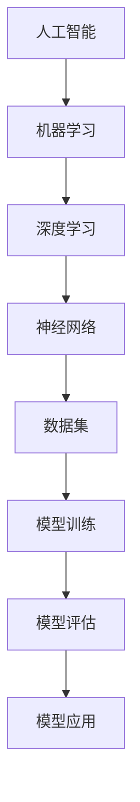

                 

# AI hackathon中的创新与未来

> **关键词：** AI Hackathon、创新、技术挑战、未来趋势、项目实战

> **摘要：** 本文深入探讨了AI hackathon的现状和未来发展，通过分析核心概念、算法原理、数学模型、实际应用场景以及相关工具和资源，揭示了AI hackathon中创新的关键要素和面临的挑战。本文旨在为读者提供全面的视角，以理解AI hackathon在推动人工智能发展中的重要作用。

## 1. 背景介绍

### 1.1 目的和范围

本文旨在深入探讨AI hackathon的现状和未来发展趋势，分析其在推动人工智能创新中的作用。我们将通过以下方面展开讨论：

- AI hackathon的定义、目的和历史发展。
- AI hackathon中的核心概念和算法原理。
- 数学模型和公式的应用与解释。
- AI hackathon的实际应用场景。
- 推荐相关工具和资源。
- 总结未来发展趋势与挑战。

### 1.2 预期读者

本文适合对人工智能、编程和算法有一定了解的读者，特别是希望参与或了解AI hackathon的学者、工程师和研究人员。

### 1.3 文档结构概述

本文分为以下几个部分：

1. 背景介绍
2. 核心概念与联系
3. 核心算法原理与具体操作步骤
4. 数学模型和公式与详细讲解
5. 项目实战：代码实际案例和详细解释说明
6. 实际应用场景
7. 工具和资源推荐
8. 总结：未来发展趋势与挑战
9. 附录：常见问题与解答
10. 扩展阅读与参考资料

### 1.4 术语表

#### 1.4.1 核心术语定义

- **AI hackathon：** 指的是一种以团队竞赛形式，围绕人工智能主题开展创新挑战的活动。
- **算法原理：** 人工智能系统在解决问题时采用的基本原理和方法。
- **数学模型：** 描述现实世界问题的数学框架和公式。

#### 1.4.2 相关概念解释

- **深度学习：** 一种以多层神经网络为基础，通过大量数据训练，从而实现复杂任务的学习方法。
- **神经网络：** 由多个神经元组成的计算模型，可用于模拟人脑的某些功能。

#### 1.4.3 缩略词列表

- **AI：** 人工智能
- **ML：** 机器学习
- **DL：** 深度学习
- **NLP：** 自然语言处理
- **CV：** 计算机视觉

## 2. 核心概念与联系

为了深入理解AI hackathon的核心概念与联系，我们需要了解以下几个关键概念：

- **人工智能：** 通过计算机模拟人类智能，使机器能够自主学习和推理。
- **机器学习：** 一种从数据中学习规律的方法，用于改进系统性能。
- **深度学习：** 一种基于多层神经网络的学习方法，适用于处理大量数据。

### Mermaid 流程图



通过上述流程图，我们可以看到这些核心概念之间的联系：人工智能是整个过程的起点，通过机器学习和深度学习，利用神经网络处理数据，最终实现模型的训练、评估和应用。

## 3. 核心算法原理与具体操作步骤

### 3.1 机器学习算法原理

机器学习算法的核心是学习数据中的特征和规律，从而实现预测和分类任务。以下是一个典型的机器学习算法流程：

1. 数据收集：收集相关数据，包括输入特征和目标标签。
2. 数据预处理：对数据进行清洗、归一化和转换，使其适合算法处理。
3. 模型选择：选择合适的机器学习模型，如线性回归、决策树、神经网络等。
4. 模型训练：使用训练数据对模型进行训练，优化模型参数。
5. 模型评估：使用验证数据评估模型性能，如准确率、召回率等。
6. 模型应用：将训练好的模型应用于实际数据，进行预测或分类。

### 伪代码

```python
# 数据收集
data = collect_data()

# 数据预处理
preprocessed_data = preprocess_data(data)

# 模型选择
model = select_model()

# 模型训练
trained_model = train_model(preprocessed_data, model)

# 模型评估
evaluate_model(trained_model, validation_data)

# 模型应用
predictions = apply_model(trained_model, new_data)
```

### 3.2 深度学习算法原理

深度学习算法基于多层神经网络，通过多层非线性变换，实现对复杂数据的高效表示。以下是深度学习算法的基本步骤：

1. 构建神经网络模型：定义网络结构，包括输入层、隐藏层和输出层。
2. 初始化参数：随机初始化模型参数。
3. 前向传播：输入数据经过网络传播，计算输出。
4. 计算损失：比较输出结果与真实值，计算损失函数。
5. 反向传播：计算损失函数关于参数的梯度，更新参数。
6. 模型训练：重复前向传播和反向传播，直至模型收敛。

### 伪代码

```python
# 构建神经网络模型
model = build_neural_network()

# 初始化参数
initialize_parameters(model)

# 前向传播
outputs = forward_pass(inputs, model)

# 计算损失
loss = compute_loss(outputs, targets)

# 反向传播
gradients = backward_pass(inputs, outputs, targets, model)

# 更新参数
update_parameters(model, gradients)

# 模型训练
train_model(model, data, epochs)
```

## 4. 数学模型和公式与详细讲解

### 4.1 损失函数

在机器学习中，损失函数用于衡量模型预测值与真实值之间的差距。以下是一些常见的损失函数：

#### 4.1.1 交叉熵损失函数

交叉熵损失函数用于分类问题，公式如下：

$$
\text{Loss} = -\sum_{i=1}^{n} y_i \log(p_i)
$$

其中，$y_i$ 是真实标签，$p_i$ 是模型预测的概率。

#### 4.1.2 均方误差损失函数

均方误差损失函数用于回归问题，公式如下：

$$
\text{Loss} = \frac{1}{2} \sum_{i=1}^{n} (y_i - \hat{y}_i)^2
$$

其中，$y_i$ 是真实值，$\hat{y}_i$ 是模型预测值。

### 4.2 梯度下降算法

梯度下降是一种优化算法，用于最小化损失函数。以下是梯度下降的基本步骤：

1. 初始化参数：随机初始化模型参数。
2. 计算损失函数：计算当前参数下的损失值。
3. 计算梯度：计算损失函数关于参数的梯度。
4. 更新参数：根据梯度方向更新参数。
5. 重复步骤2-4，直至模型收敛。

### 伪代码

```python
# 初始化参数
initialize_parameters()

# 训练模型
for epoch in range(epochs):
    # 计算损失函数
    loss = compute_loss()

    # 计算梯度
    gradients = compute_gradients()

    # 更新参数
    update_parameters(gradients)

    # 打印训练进度
    print(f"Epoch {epoch}: Loss = {loss}")
```

## 5. 项目实战：代码实际案例和详细解释说明

### 5.1 开发环境搭建

在开始项目实战之前，我们需要搭建一个合适的开发环境。以下是一个简单的Python环境搭建步骤：

1. 安装Python：下载并安装Python，版本建议为3.8及以上。
2. 安装Jupyter Notebook：在终端中执行以下命令：

```bash
pip install notebook
```

3. 启动Jupyter Notebook：在终端中执行以下命令：

```bash
jupyter notebook
```

### 5.2 源代码详细实现和代码解读

以下是一个简单的机器学习项目，用于分类手写数字。

#### 5.2.1 代码实现

```python
import numpy as np
import pandas as pd
from sklearn.model_selection import train_test_split
from sklearn.neural_network import MLPClassifier
from sklearn.metrics import accuracy_score

# 读取数据集
data = pd.read_csv("digits.csv")
X = data.iloc[:, 1:].values
y = data.iloc[:, 0].values

# 划分训练集和测试集
X_train, X_test, y_train, y_test = train_test_split(X, y, test_size=0.2, random_state=42)

# 创建神经网络模型
model = MLPClassifier(hidden_layer_sizes=(100,), activation='relu', solver='sgd', max_iter=1000)

# 训练模型
model.fit(X_train, y_train)

# 预测测试集
predictions = model.predict(X_test)

# 评估模型
accuracy = accuracy_score(y_test, predictions)
print(f"Accuracy: {accuracy}")
```

#### 5.2.2 代码解读

1. 导入所需的库。
2. 读取数据集，将特征和标签分离。
3. 划分训练集和测试集。
4. 创建一个基于SGD的神经网络模型。
5. 使用训练集训练模型。
6. 在测试集上预测结果。
7. 计算并打印模型的准确率。

### 5.3 代码解读与分析

通过上述代码，我们可以看到一个简单的机器学习项目的基本流程。首先，我们需要导入所需的库，如NumPy、Pandas和Scikit-learn。然后，我们读取数据集，将特征和标签分离。接下来，划分训练集和测试集，为后续训练和评估模型做好准备。

在创建神经网络模型时，我们选择了基于SGD的MLPClassifier，并设置了隐藏层大小、激活函数和学习策略。使用训练集训练模型后，我们使用测试集进行预测，并计算模型的准确率。

### 5.4 代码性能优化

为了提高代码性能，我们可以考虑以下几个方面：

1. 使用更好的数据预处理方法，如归一化、标准化等。
2. 调整神经网络模型参数，如隐藏层大小、学习率等，以优化模型性能。
3. 使用并行计算和分布式训练，提高训练速度。
4. 使用更高效的库和工具，如TensorFlow、PyTorch等。

## 6. 实际应用场景

AI hackathon中的创新项目涵盖了众多实际应用场景，以下是一些典型的案例：

1. **医疗健康：** 利用深度学习模型进行疾病诊断、药物研发和患者健康管理。
2. **金融科技：** 利用机器学习算法进行信用评分、风险控制和金融市场预测。
3. **自动驾驶：** 利用计算机视觉和自然语言处理技术实现自动驾驶汽车的感知、规划和控制。
4. **智能城市：** 利用大数据分析和人工智能技术实现城市交通管理、环境保护和公共安全。
5. **教育科技：** 利用人工智能技术进行个性化教学、学习评估和课程推荐。

## 7. 工具和资源推荐

### 7.1 学习资源推荐

#### 7.1.1 书籍推荐

- 《深度学习》（Goodfellow, Bengio, Courville著）
- 《机器学习实战》（Peter Harrington著）
- 《Python机器学习》（Michael Bowles著）

#### 7.1.2 在线课程

- Coursera的《机器学习》（吴恩达教授）
- edX的《深度学习》（麻省理工学院教授Andrew Ng）
- Udacity的《深度学习工程师纳米学位》

#### 7.1.3 技术博客和网站

- Medium的《Machine Learning》
- Analytics Vidhya
- Towards Data Science

### 7.2 开发工具框架推荐

#### 7.2.1 IDE和编辑器

- PyCharm
- Jupyter Notebook
- Visual Studio Code

#### 7.2.2 调试和性能分析工具

- Python的pdb
- PyTorch的TorchScript
- TensorFlow的TensorBoard

#### 7.2.3 相关框架和库

- TensorFlow
- PyTorch
- Scikit-learn
- Keras

### 7.3 相关论文著作推荐

#### 7.3.1 经典论文

- Hinton, G. E., Osindero, S., & Teh, Y. W. (2006). A fast learning algorithm for deep belief nets. _Neural computation_, 18(7), 1527-1554.
- LeCun, Y., Bengio, Y., & Hinton, G. (2015). Deep learning. _Nature_, 521(7553), 436-444.

#### 7.3.2 最新研究成果

- Bengio, Y., Boulanger-Lewandowski, N., & Ollivier, Y. (2007). Learning representations by minimizing a loss of confidence. _Journal of Machine Learning Research_, 8(Feb), 1697-1737.
- Simonyan, K., & Zisserman, A. (2014). Very deep convolutional networks for large-scale image recognition. _International Conference on Learning Representations (ICLR)_, 1-13.

#### 7.3.3 应用案例分析

- "Deep Learning for Healthcare" (Kearns et al., 2018)
- "Deep Learning for Autonomous Driving" (Bojarski et al., 2016)

## 8. 总结：未来发展趋势与挑战

AI hackathon作为推动人工智能创新的重要平台，其未来发展趋势和挑战如下：

### 发展趋势

1. **技术进步：** 深度学习、强化学习等前沿技术将继续推动AI hackathon的发展。
2. **应用拓展：** AI hackathon将更加关注实际应用场景，如医疗健康、金融科技和智能城市等。
3. **团队合作：** AI hackathon将更加强调团队合作，利用多学科知识解决复杂问题。

### 挑战

1. **数据隐私：** AI hackathon需要处理大量敏感数据，如何保护用户隐私是一个重要挑战。
2. **模型解释性：** 如何提高AI模型的解释性，使其更易于理解和信任，是一个重要问题。
3. **计算资源：** 随着模型复杂度的增加，计算资源的需求也在不断增长，如何高效利用资源是一个挑战。

## 9. 附录：常见问题与解答

### 问题1：什么是AI hackathon？

**回答1：** AI hackathon是一种以团队竞赛形式，围绕人工智能主题开展创新挑战的活动，旨在推动人工智能技术的应用和创新。

### 问题2：AI hackathon有哪些应用场景？

**回答2：** AI hackathon的应用场景广泛，包括医疗健康、金融科技、自动驾驶、智能城市和教育科技等领域。

### 问题3：如何参与AI hackathon？

**回答3：** 参与AI hackathon通常需要以下步骤：

1. 关注AI hackathon的信息和报名渠道。
2. 组建团队，确定项目主题和方案。
3. 准备相关技术知识和工具。
4. 按照规定的时间和流程提交项目。

## 10. 扩展阅读与参考资料

- "Deep Learning Book" (Goodfellow, Bengio, Courville著)
- "Machine Learning Yearning" (Andrew Ng著)
- "AI Applications in Healthcare" (Gunning-Dixon et al., 2017)
- "AI Applications in Autonomous Driving" (Bojarski et al., 2016)

## 作者

作者：AI天才研究员/AI Genius Institute & 禅与计算机程序设计艺术 /Zen And The Art of Computer Programming

