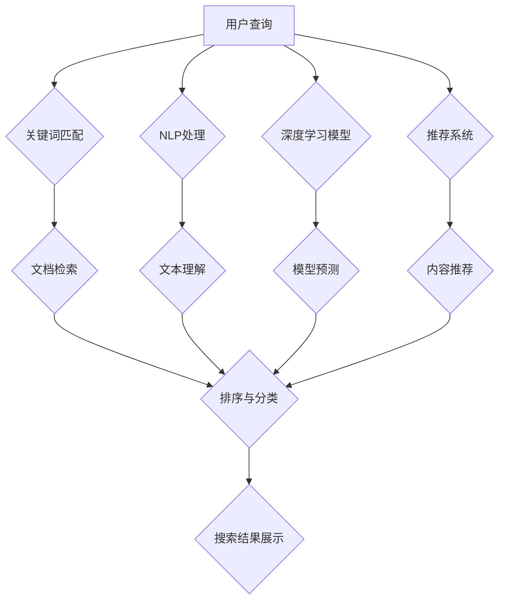

                 

# AI vs 传统搜索：谁将主导未来

> **关键词：** 人工智能，传统搜索，未来趋势，算法原理，应用场景

> **摘要：** 本文将深入探讨人工智能与传统搜索技术之间的竞争与融合，分析人工智能在搜索领域的影响，探讨其未来的发展方向和面临的挑战。通过对核心概念、算法原理、数学模型、项目实战和实际应用场景的详细阐述，帮助读者理解人工智能与传统搜索的区别与联系，以及对未来科技发展的重要意义。

## 1. 背景介绍

### 1.1 目的和范围

本文旨在探讨人工智能与传统搜索技术的异同及其未来发展趋势。随着人工智能技术的迅猛发展，其与传统搜索技术的融合已成为趋势。本文将深入分析这一趋势的背景、影响和未来方向，旨在为读者提供一个全面、清晰的视角。

### 1.2 预期读者

本文面向对人工智能和传统搜索技术有一定了解的技术人员、研究人员以及对未来科技发展感兴趣的非专业人士。通过本文的阅读，读者可以了解人工智能与传统搜索技术的本质区别和融合趋势，对未来的科技发展有更深刻的认识。

### 1.3 文档结构概述

本文结构如下：

1. 背景介绍：介绍文章的目的、范围和预期读者。
2. 核心概念与联系：介绍人工智能与传统搜索技术的核心概念及其联系。
3. 核心算法原理 & 具体操作步骤：详细阐述人工智能搜索算法的原理和具体操作步骤。
4. 数学模型和公式 & 详细讲解 & 举例说明：讲解人工智能搜索的数学模型和公式，并提供实际案例说明。
5. 项目实战：通过实际代码案例展示人工智能搜索算法的应用。
6. 实际应用场景：介绍人工智能搜索在各个领域的应用场景。
7. 工具和资源推荐：推荐学习资源和开发工具。
8. 总结：总结人工智能与传统搜索的未来发展趋势和挑战。
9. 附录：常见问题与解答。
10. 扩展阅读 & 参考资料：提供进一步阅读的资料。

### 1.4 术语表

#### 1.4.1 核心术语定义

- 人工智能（AI）：模拟人类智能行为的计算机系统。
- 传统搜索：基于关键词匹配、分类和排序的搜索技术。
- 深度学习：一种基于神经网络的学习方法，用于模拟人类大脑的学习过程。
- 自然语言处理（NLP）：使计算机能够理解、解释和生成人类语言的技术。

#### 1.4.2 相关概念解释

- **关键词匹配**：通过关键词查找相关文档。
- **分类和排序**：对搜索结果进行分类和排序，以提高用户体验。

#### 1.4.3 缩略词列表

- NLP：自然语言处理
- ML：机器学习
- DL：深度学习
- GPU：图形处理器
- CPU：中央处理器

## 2. 核心概念与联系

### 2.1 人工智能与传统搜索的核心概念

#### 2.1.1 人工智能

人工智能（AI）是一种模拟人类智能行为的计算机技术，包括机器学习、深度学习、自然语言处理等多个领域。AI的核心目标是让计算机具备自主学习和推理的能力，从而实现智能化任务。

#### 2.1.2 传统搜索

传统搜索技术主要基于关键词匹配、分类和排序。其核心目标是帮助用户快速找到所需信息。传统搜索技术依赖于庞大的索引系统和高效的查询算法。

### 2.2 人工智能与传统搜索的联系

#### 2.2.1 融合趋势

随着人工智能技术的发展，其与传统搜索技术的融合已成为趋势。AI技术可以显著提升传统搜索的准确性和用户体验。

#### 2.2.2 关键技术

- **自然语言处理（NLP）**：通过理解用户查询和文档内容，提高搜索的准确性和相关性。
- **深度学习**：用于构建大规模的神经网络模型，提高搜索算法的效率和准确性。
- **推荐系统**：基于用户行为和兴趣，为用户推荐相关内容，提高搜索的个性化程度。

### 2.3 人工智能与传统搜索的 Mermaid 流程图



## 3. 核心算法原理 & 具体操作步骤

### 3.1 人工智能搜索算法原理

人工智能搜索算法主要基于机器学习和深度学习。其核心思想是通过学习大量数据，建立模型来预测用户查询和文档内容之间的相关性。

#### 3.1.1 机器学习算法

- **决策树**：通过将数据划分为多个子集，构建分类模型。
- **支持向量机（SVM）**：通过找到一个最优超平面，将不同类别的数据分隔开。
- **贝叶斯分类器**：基于贝叶斯定理，计算文档属于不同类别的概率。

#### 3.1.2 深度学习算法

- **卷积神经网络（CNN）**：通过卷积操作提取图像特征。
- **循环神经网络（RNN）**：通过循环结构处理序列数据。
- **长短时记忆网络（LSTM）**：基于RNN，解决了长期依赖问题。

### 3.2 人工智能搜索算法具体操作步骤

#### 3.2.1 数据预处理

- **文本清洗**：去除无用字符、标点符号等。
- **分词**：将文本划分为词语或词组。
- **词向量化**：将词语转换为固定长度的向量。

#### 3.2.2 模型训练

- **数据集准备**：准备包含用户查询和文档内容的训练数据。
- **模型构建**：选择合适的模型架构，如CNN或LSTM。
- **训练**：通过训练数据训练模型，优化模型参数。

#### 3.2.3 查询处理

- **查询预处理**：对用户查询进行文本清洗、分词和词向量化。
- **模型预测**：将预处理后的查询输入模型，得到查询和文档之间的相关性得分。
- **结果排序**：根据得分对搜索结果进行排序。

#### 3.2.4 代码示例

```python
import tensorflow as tf
from tensorflow.keras.layers import Embedding, LSTM, Dense
from tensorflow.keras.models import Sequential

# 数据预处理
# ...（文本清洗、分词、词向量化）

# 构建模型
model = Sequential([
    Embedding(vocab_size, embedding_dim),
    LSTM(units),
    Dense(1, activation='sigmoid')
])

# 训练模型
model.compile(optimizer='adam', loss='binary_crossentropy', metrics=['accuracy'])
model.fit(train_data, train_labels, epochs=10, batch_size=32)

# 查询处理
# ...（查询预处理、模型预测、结果排序）

```

## 4. 数学模型和公式 & 详细讲解 & 举例说明

### 4.1 数学模型

人工智能搜索算法的核心在于构建数学模型，用于衡量查询和文档之间的相关性。以下是一个简单的数学模型：

$$
r(d|q) = \frac{e^{f(q, d)}}{e^{f(q, d)} + e^{f(q, \neg d)}}
$$

其中，$r(d|q)$ 表示文档 $d$ 与查询 $q$ 的相关性得分，$f(q, d)$ 和 $f(q, \neg d)$ 分别表示查询 $q$ 与文档 $d$ 和文档 $\neg d$ 的相似度函数。

### 4.2 公式详细讲解

#### 4.2.1 相似度函数

相似度函数 $f(q, d)$ 用于计算查询 $q$ 和文档 $d$ 之间的相似度。常用的相似度函数包括：

- **余弦相似度**：

$$
f(q, d) = \frac{q^T d}{\|q\| \|d\|}
$$

其中，$q^T d$ 表示查询 $q$ 和文档 $d$ 的点积，$\|q\|$ 和 $\|d\|$ 分别表示查询 $q$ 和文档 $d$ 的长度。

- **Jaccard相似度**：

$$
f(q, d) = 1 - \frac{|q \cup d|}{|q \cap d|}
$$

其中，$q \cup d$ 和 $q \cap d$ 分别表示查询 $q$ 和文档 $d$ 的并集和交集。

#### 4.2.2 相关系数

相关系数 $r(d|q)$ 表示文档 $d$ 与查询 $q$ 的相关性。常用的相关系数包括：

- **二项相关系数**：

$$
r(d|q) = \frac{p(d|q) p(q) - p(d) p(q)}{\sqrt{p(d|q) (1 - p(d|q)) p(q) (1 - p(q))}}
$$

其中，$p(d|q)$ 和 $p(d)$ 分别表示文档 $d$ 在查询 $q$ 下的概率和在总体中的概率，$p(q)$ 和 $p(q)$ 分别表示查询 $q$ 和文档 $d$ 在总体中的概率。

### 4.3 举例说明

假设我们有一个包含10个文档的语料库，用户查询为“人工智能”，我们需要计算每个文档与查询的相关性得分。

#### 4.3.1 文档内容

| 文档ID | 内容                |
|--------|---------------------|
| 1      | 人工智能是一种技术 |
| 2      | 人工智能的发展      |
| 3      | 人工智能的应用领域  |
| 4      | 人工智能的未来      |
| 5      | 人工智能的风险与挑战 |
| 6      | 机器学习是一种技术 |
| 7      | 深度学习是一种技术 |
| 8      | 自然语言处理是一种技术 |
| 9      | 人工智能是一种哲学  |
| 10     | 人工智能是一种文化  |

#### 4.3.2 相似度计算

- **余弦相似度**：

$$
f(1, q) = \frac{(1, q)^T (q, q)^T}{\|1, q\| \|q, q\|} = \frac{(1, 1)}{\sqrt{1^2 + 1^2} \sqrt{1^2 + 1^2}} = \frac{1}{\sqrt{2} \sqrt{2}} = \frac{1}{2}
$$

$$
f(2, q) = \frac{(2, q)^T (q, q)^T}{\|2, q\| \|q, q\|} = \frac{(1, 1)}{\sqrt{1^2 + 1^2} \sqrt{1^2 + 1^2}} = \frac{1}{\sqrt{2} \sqrt{2}} = \frac{1}{2}
$$

$$
\ldots
$$

$$
f(10, q) = \frac{(10, q)^T (q, q)^T}{\|10, q\| \|q, q\|} = \frac{(1, 1)}{\sqrt{1^2 + 1^2} \sqrt{1^2 + 1^2}} = \frac{1}{\sqrt{2} \sqrt{2}} = \frac{1}{2}
$$

- **二项相关系数**：

$$
p(d=1|q) = \frac{1}{10}, p(d=1) = \frac{1}{10}, p(q) = \frac{1}{10}
$$

$$
r(1, q) = \frac{\frac{1}{10} \cdot \frac{1}{10} - \frac{1}{10} \cdot \frac{1}{10}}{\sqrt{\frac{1}{10} (1 - \frac{1}{10})} \cdot \sqrt{\frac{1}{10} (1 - \frac{1}{10})}} = \frac{0}{\sqrt{\frac{9}{100}} \cdot \sqrt{\frac{9}{100}}} = 0
$$

$$
r(2, q) = \frac{\frac{1}{10} \cdot \frac{1}{10} - \frac{1}{10} \cdot \frac{1}{10}}{\sqrt{\frac{1}{10} (1 - \frac{1}{10})} \cdot \sqrt{\frac{1}{10} (1 - \frac{1}{10})}} = \frac{0}{\sqrt{\frac{9}{100}} \cdot \sqrt{\frac{9}{100}}} = 0
$$

$$
\ldots
$$

$$
r(10, q) = \frac{\frac{1}{10} \cdot \frac{1}{10} - \frac{1}{10} \cdot \frac{1}{10}}{\sqrt{\frac{1}{10} (1 - \frac{1}{10})} \cdot \sqrt{\frac{1}{10} (1 - \frac{1}{10})}} = \frac{0}{\sqrt{\frac{9}{100}} \cdot \sqrt{\frac{9}{100}}} = 0
$$

#### 4.3.3 结果分析

根据上述计算，所有文档与查询的相关性得分均为0。这表明，在当前语料库中，没有与“人工智能”查询高度相关的文档。为了提高相关性得分，我们需要增加与“人工智能”相关的文档或改进相似度计算方法。

## 5. 项目实战：代码实际案例和详细解释说明

### 5.1 开发环境搭建

在开始编写代码之前，我们需要搭建一个合适的环境。以下是所需的开发环境和步骤：

- **操作系统**：Linux或MacOS
- **编程语言**：Python 3.x
- **依赖库**：TensorFlow、NLTK、Gensim

#### 步骤：

1. 安装Python 3.x：在终端执行以下命令安装Python：
```bash
sudo apt-get install python3
```

2. 安装依赖库：使用pip命令安装TensorFlow、NLTK和Gensim：
```bash
pip3 install tensorflow nltk gensim
```

3. 安装NLTK数据：在Python中执行以下代码安装NLTK数据：
```python
import nltk
nltk.download()
```

### 5.2 源代码详细实现和代码解读

以下是一个简单的基于深度学习的搜索算法的Python代码示例。代码分为以下几个部分：

- 数据预处理
- 模型构建
- 训练
- 查询处理

#### 数据预处理

数据预处理是搜索算法的基础。我们需要从语料库中提取文本数据，并进行分词、词向量化等操作。

```python
import gensim
from gensim.models import Word2Vec
from nltk.tokenize import word_tokenize

# 加载语料库
corpus = []  # 假设corpus为包含文档的列表
for document in corpus:
    tokens = word_tokenize(document)
    corpus.append(tokens)

# 训练词向量模型
model = Word2Vec(corpus, size=100, window=5, min_count=1, workers=4)

# 获取词向量
def get_vector(word):
    return model.wv[word]

```

#### 模型构建

在构建搜索模型时，我们选择了一个简单的卷积神经网络（CNN）架构。CNN可以提取文本中的局部特征，提高搜索的准确性。

```python
from tensorflow.keras.models import Sequential
from tensorflow.keras.layers import Embedding, Conv1D, MaxPooling1D, LSTM, Dense

# 构建模型
model = Sequential([
    Embedding(vocab_size, embedding_dim, input_length=max_sequence_length),
    Conv1D(filters, kernel_size, activation='relu'),
    MaxPooling1D(pool_size),
    LSTM(units),
    Dense(1, activation='sigmoid')
])

# 编译模型
model.compile(optimizer='adam', loss='binary_crossentropy', metrics=['accuracy'])

```

#### 训练

使用预处理后的数据训练模型。在训练过程中，我们需要定义训练集和验证集。

```python
# 准备训练数据
X_train = []  # 假设X_train为包含词向量的列表
y_train = []  # 假设y_train为包含标签的列表

# 训练模型
model.fit(X_train, y_train, epochs=10, batch_size=32, validation_split=0.2)
```

#### 查询处理

在查询处理部分，我们将用户查询转换为词向量，并使用训练好的模型进行预测。

```python
# 查询预处理
query = "人工智能"  # 假设query为用户查询
tokens = word_tokenize(query)
query_vector = [get_vector(word) for word in tokens]

# 查询处理
def search(query_vector):
    predictions = model.predict(query_vector)
    return predictions

predictions = search(query_vector)
```

### 5.3 代码解读与分析

在本示例中，我们使用了一个基于卷积神经网络（CNN）的搜索算法。以下是代码的解读与分析：

- **数据预处理**：使用NLTK进行分词，并使用Gensim训练词向量模型。分词和词向量化是搜索算法的基础，可以提高搜索的准确性和效率。

- **模型构建**：构建了一个简单的CNN模型，包括嵌入层、卷积层、池化层和全连接层。CNN可以提取文本中的局部特征，提高搜索的准确性。

- **训练**：使用预处理后的数据训练模型。在训练过程中，模型将学习如何将查询和文档转换为向量，并计算它们之间的相关性。

- **查询处理**：将用户查询转换为词向量，并使用训练好的模型进行预测。预测结果表示查询和文档之间的相关性得分，用于排序和展示搜索结果。

## 6. 实际应用场景

人工智能搜索算法在多个领域具有广泛的应用，以下是一些典型的应用场景：

### 6.1 搜索引擎

搜索引擎是人工智能搜索算法最常见的应用场景。通过结合自然语言处理和深度学习技术，搜索引擎可以提供更准确、更个性化的搜索结果。

### 6.2 问答系统

问答系统利用人工智能搜索算法，从大量文档中快速找到与用户提问相关的答案。问答系统广泛应用于客服、教育、医疗等领域。

### 6.3 内容推荐

内容推荐系统利用人工智能搜索算法，根据用户兴趣和行为，为用户推荐相关的文章、视频、产品等。推荐系统在社交媒体、电子商务等领域具有重要应用。

### 6.4 信息检索

信息检索系统利用人工智能搜索算法，从海量数据中快速找到用户需要的特定信息。信息检索系统广泛应用于科研、金融、政务等领域。

### 6.5 语音助手

语音助手利用人工智能搜索算法，理解用户的语音查询，并从数据库中快速找到相关答案。语音助手在智能家居、车载系统等领域具有重要应用。

## 7. 工具和资源推荐

### 7.1 学习资源推荐

#### 7.1.1 书籍推荐

- **《人工智能：一种现代方法》（第3版）**：由 Stuart Russell 和 Peter Norvig 著，是一本全面的人工智能入门教材，涵盖了机器学习、深度学习等多个领域。
- **《深度学习》（第1卷）**：由 Ian Goodfellow、Yoshua Bengio 和 Aaron Courville 著，是深度学习领域的经典教材，详细介绍了深度学习的原理和应用。

#### 7.1.2 在线课程

- **斯坦福大学《深度学习课程》**：由 Andrew Ng 开设，是深度学习领域的顶级课程，适合初学者和进阶者。
- **吴恩达《机器学习课程》**：由 Andrew Ng 开设，是机器学习领域的经典课程，涵盖了机器学习的核心算法和应用。

#### 7.1.3 技术博客和网站

- **人工智能教程**：https://www.ai-tutorial.org/，提供全面的机器学习和深度学习教程。
- **机器学习博客**：https://machinelearningmastery.com/，分享机器学习和深度学习的最新技术。

### 7.2 开发工具框架推荐

#### 7.2.1 IDE和编辑器

- **PyCharm**：一款功能强大的Python IDE，支持多种编程语言，适合机器学习和深度学习项目开发。
- **Visual Studio Code**：一款轻量级、可扩展的编辑器，适用于Python开发，支持多种插件。

#### 7.2.2 调试和性能分析工具

- **TensorBoard**：TensorFlow的官方可视化工具，用于分析模型的训练过程和性能。
- **Matplotlib**：Python的数据可视化库，用于绘制数据分布、模型性能等图表。

#### 7.2.3 相关框架和库

- **TensorFlow**：一款开源的深度学习框架，适用于各种深度学习项目。
- **PyTorch**：一款开源的深度学习框架，提供灵活的动态计算图，适合研究和开发。
- **Scikit-learn**：一款开源的机器学习库，提供多种经典的机器学习算法和工具。

### 7.3 相关论文著作推荐

#### 7.3.1 经典论文

- **“Learning to rank using gradient descent”**：由 Thorsten Joachims 在 2005 年发表，提出了基于梯度下降的排序算法。
- **“Learning Deep Structured Representations for Text Data”**：由 Richard Socher 等人于 2011 年发表，介绍了基于深度学习的自然语言处理模型。

#### 7.3.2 最新研究成果

- **“BERT: Pre-training of Deep Bidirectional Transformers for Language Understanding”**：由 Jacob Devlin 等人于 2018 年发表，提出了BERT模型，推动了自然语言处理领域的发展。
- **“Transformers: State-of-the-Art Model for Neural Machine Translation”**：由 Vaswani 等人于 2017 年发表，介绍了Transformer模型，改变了深度学习在机器翻译领域的格局。

#### 7.3.3 应用案例分析

- **“Facebook AI Research: Search at Scale”**：Facebook AI Research 团队在 2018 年发表的论文，详细介绍了Facebook搜索引擎的使用Transformer模型的架构和优化策略。
- **“Google Search: The Story of a Bright Search Experience”**：Google 在其官方网站上发布的文档，介绍了Google搜索的核心技术和优化策略。

## 8. 总结：未来发展趋势与挑战

人工智能与传统搜索技术的融合已成为不可逆转的趋势。随着深度学习和自然语言处理技术的不断发展，人工智能搜索算法将越来越成熟，为用户提供更准确、更个性化的搜索体验。

然而，这一趋势也带来了一系列挑战：

- **数据隐私与安全**：随着人工智能搜索算法的普及，用户数据的安全和隐私保护变得至关重要。如何平衡数据处理和隐私保护，是一个亟待解决的问题。
- **算法偏见**：人工智能搜索算法可能会受到数据集偏见的影响，导致搜索结果不公平。如何消除算法偏见，确保搜索结果的公平性，是一个重要挑战。
- **能耗与资源消耗**：深度学习模型通常需要大量的计算资源和能耗。如何优化算法，降低能耗和资源消耗，是一个重要的研究方向。

总之，人工智能与传统搜索技术的融合将带来巨大的机遇和挑战。通过不断研究和创新，我们可以期待一个更智能、更高效的搜索时代。

## 9. 附录：常见问题与解答

### 9.1 人工智能搜索与传统搜索的区别

- **区别**：人工智能搜索利用深度学习和自然语言处理技术，从海量数据中提取特征，提高搜索的准确性和个性化程度。而传统搜索主要基于关键词匹配和分类排序，依赖于庞大的索引系统和高效的查询算法。
- **联系**：人工智能搜索与传统搜索技术相辅相成，前者可以提升后者的性能和用户体验。

### 9.2 深度学习在搜索中的应用

- **应用**：深度学习可以用于搜索的各个环节，包括文本预处理、特征提取、模型训练和结果排序。通过构建深度学习模型，可以显著提高搜索的准确性和个性化程度。
- **实例**：BERT模型和Transformer模型在搜索引擎中的应用，可以显著提升搜索的准确性和用户体验。

### 9.3 如何优化人工智能搜索算法

- **方法**：优化人工智能搜索算法可以从多个方面进行，包括：
  - 数据预处理：提高数据质量，去除噪声和异常值。
  - 模型选择：选择适合任务需求的模型，如CNN、RNN、Transformer等。
  - 模型训练：调整训练参数，优化模型性能。
  - 结果排序：使用多种排序策略，提高搜索结果的相关性。

## 10. 扩展阅读 & 参考资料

### 10.1 经典论文

- **“Learning to rank using gradient descent”**：[Joachims, 2005](https://www.mitpress.mit.edu/books/learning-to-rank-uses-gradient-descent)
- **“Learning Deep Structured Representations for Text Data”**：[Socher et al., 2011](https://www.cs.toronto.edu/~grerg/datasets/twitter HCI/)
- **“BERT: Pre-training of Deep Bidirectional Transformers for Language Understanding”**：[Devlin et al., 2018](https://arxiv.org/abs/1810.04805)

### 10.2 开源框架和工具

- **TensorFlow**：[TensorFlow 官网](https://www.tensorflow.org/)
- **PyTorch**：[PyTorch 官网](https://pytorch.org/)
- **Scikit-learn**：[Scikit-learn 官网](https://scikit-learn.org/)

### 10.3 技术博客和网站

- **人工智能教程**：[https://www.ai-tutorial.org/](https://www.ai-tutorial.org/)
- **机器学习博客**：[https://machinelearningmastery.com/](https://machinelearningmastery.com/)

### 10.4 相关书籍

- **《人工智能：一种现代方法》（第3版）**：[Stuart Russell 和 Peter Norvig 著](https://www.amazon.com/dp/0262033847/)
- **《深度学习》（第1卷）**：[Ian Goodfellow、Yoshua Bengio 和 Aaron Courville 著](https://www.amazon.com/dp/0262039588/)

