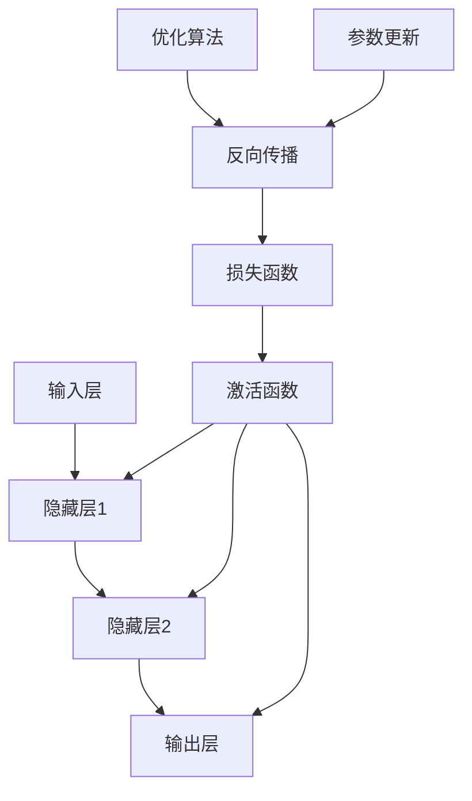

                 

# AI原理与代码实例讲解

> 
关键词：人工智能、深度学习、神经网络、算法、实例、编程
摘要：本文将深入探讨人工智能的基本原理，包括神经网络、深度学习等核心概念，并通过实际代码实例来展示如何实现这些算法。文章旨在为读者提供对AI技术清晰、深刻的理解，帮助读者掌握AI编程技能。
>

## 1. 背景介绍

### 1.1 目的和范围

本文的目标是帮助读者了解人工智能（AI）的基本原理，特别是深度学习和神经网络。通过理论讲解和实际代码实例，读者将能够掌握这些核心算法的实现方法和应用技巧。本文将涵盖以下内容：

1. 人工智能的基础知识
2. 神经网络和深度学习原理
3. 神经网络的架构和操作
4. 深度学习算法的实现
5. 代码实例分析

### 1.2 预期读者

本文适合以下读者群体：

1. 对人工智能和深度学习感兴趣的技术爱好者
2. 想要深入了解神经网络和深度学习原理的程序员
3. 想要在实际项目中应用人工智能技术的开发人员
4. 想要在学术或工业领域进行深度学习和神经网络研究的学者

### 1.3 文档结构概述

本文将按照以下结构进行阐述：

1. 背景介绍
2. 核心概念与联系
3. 核心算法原理 & 具体操作步骤
4. 数学模型和公式 & 详细讲解 & 举例说明
5. 项目实战：代码实际案例和详细解释说明
6. 实际应用场景
7. 工具和资源推荐
8. 总结：未来发展趋势与挑战
9. 附录：常见问题与解答
10. 扩展阅读 & 参考资料

### 1.4 术语表

#### 1.4.1 核心术语定义

- **人工智能（AI）**：指通过计算机模拟人类智能行为的技术，使机器具备自主学习和决策能力。
- **深度学习（Deep Learning）**：一种基于多层神经网络的学习方法，通过多层非线性变换来提取数据特征。
- **神经网络（Neural Network）**：一种模拟生物神经网络的信息处理系统，由大量神经元和连接组成。
- **神经元（Neuron）**：神经网络的基本单元，负责接收输入、传递信号和产生输出。
- **前向传播（Forward Propagation）**：神经网络中数据从输入层传递到输出层的计算过程。
- **反向传播（Backpropagation）**：神经网络中通过计算损失函数梯度来更新网络参数的过程。

#### 1.4.2 相关概念解释

- **激活函数（Activation Function）**：神经元在传递信号前，对输入值进行非线性变换的函数。
- **损失函数（Loss Function）**：用于衡量模型预测结果与真实结果之间差异的函数。
- **反向传播算法（Backpropagation Algorithm）**：一种用于训练神经网络的优化算法，通过计算损失函数梯度来更新网络参数。
- **反向传播（Backpropagation）**：神经网络中通过计算损失函数梯度来更新网络参数的过程。

#### 1.4.3 缩略词列表

- **MLP**：多层感知机（Multilayer Perceptron）
- **CNN**：卷积神经网络（Convolutional Neural Network）
- **RNN**：循环神经网络（Recurrent Neural Network）
- **DNN**：深度神经网络（Deep Neural Network）
- **GAN**：生成对抗网络（Generative Adversarial Network）

## 2. 核心概念与联系

在人工智能领域，深度学习和神经网络是至关重要的核心技术。为了更好地理解这些概念，我们将通过一个Mermaid流程图来展示神经网络的核心组成部分及其相互关系。

### Mermaid流程图：



### 流程图解释：

- **输入层（Input Layer）**：神经网络的第一层，负责接收输入数据。
- **隐藏层（Hidden Layers）**：神经网络的核心部分，包含多个隐藏层，负责对输入数据进行特征提取。
- **输出层（Output Layer）**：神经网络的最后一层，负责生成模型预测结果。
- **激活函数（Activation Function）**：对隐藏层和输出层的神经元输出进行非线性变换，使神经网络具备非线性能力。
- **损失函数（Loss Function）**：衡量模型预测结果与真实结果之间差异的函数，用于评估模型性能。
- **反向传播（Backpropagation）**：一种用于训练神经网络的优化算法，通过计算损失函数梯度来更新网络参数。
- **优化算法（Optimization Algorithm）**：用于指导网络参数更新的算法，如梯度下降（Gradient Descent）。
- **参数更新（Parameter Update）**：通过优化算法更新神经网络参数的过程，以降低损失函数值。

通过这个流程图，我们可以清晰地看到神经网络的核心组成部分及其相互关系，为后续的算法讲解打下基础。

## 3. 核心算法原理 & 具体操作步骤

在本节中，我们将深入探讨神经网络的核心算法原理，并通过伪代码来详细阐述其具体操作步骤。神经网络主要分为三个阶段：前向传播（Forward Propagation）、损失计算（Loss Computation）和反向传播（Backpropagation）。

### 3.1 前向传播（Forward Propagation）

前向传播是神经网络计算模型预测值的过程。具体步骤如下：

1. 初始化神经网络权重和偏置。
2. 计算各层的输出值。
3. 应用激活函数对输出值进行非线性变换。
4. 生成最终预测结果。

伪代码：

```python
# 初始化神经网络参数
weights = [random(), random(), ..., random()]
biases = [random(), random(), ..., random()]

# 前向传播
input_data = [0.5, 0.3]
layer_outputs = []

for layer in range(num_layers):
    if layer == 0:
        layer_output = sigmoid(np.dot(input_data, weights[layer]) + biases[layer])
    else:
        layer_output = sigmoid(np.dot(layer_outputs[-1], weights[layer]) + biases[layer])
    layer_outputs.append(layer_output)

predicted_output = layer_outputs[-1]
```

### 3.2 损失计算（Loss Computation）

损失计算是评估模型预测结果与真实结果之间差异的过程。常用的损失函数有均方误差（Mean Squared Error, MSE）和交叉熵损失（Cross-Entropy Loss）。以下为MSE损失函数的伪代码：

```python
# 计算MSE损失
true_output = [0.9, 0.1]
predicted_output = [0.8, 0.2]
loss = np.mean(np.square(predicted_output - true_output))
```

### 3.3 反向传播（Backpropagation）

反向传播是神经网络参数优化的过程，通过计算损失函数梯度来更新网络参数。具体步骤如下：

1. 计算输出层的误差。
2. 逐层计算各层的误差。
3. 更新网络权重和偏置。

伪代码：

```python
# 反向传播
predicted_error = predicted_output - true_output
layer_errors = [predicted_error]

for layer in reversed(range(num_layers)):
    error = np.dot(layer_errors[0], weights[layer].T) * sigmoid_derivative(layer_outputs[layer])
    layer_errors.insert(0, error)

# 更新参数
learning_rate = 0.1
for layer in range(num_layers):
    weights[layer] -= learning_rate * np.dot(layer_outputs[layer], layer_errors[0])
    biases[layer] -= learning_rate * layer_errors[0]
```

通过上述伪代码，我们可以清晰地看到神经网络的核心算法原理和操作步骤。这些步骤是构建和训练深度学习模型的基础，为后续的代码实例提供了理论支持。

## 4. 数学模型和公式 & 详细讲解 & 举例说明

在本节中，我们将深入探讨神经网络中的关键数学模型和公式，包括激活函数、损失函数和反向传播算法。通过详细讲解和举例说明，帮助读者更好地理解这些概念。

### 4.1 激活函数

激活函数是神经网络中重要的组成部分，用于引入非线性变换，使神经网络具备处理复杂问题的能力。常见的激活函数有：

1. **Sigmoid函数**：

   公式：\[ \sigma(x) = \frac{1}{1 + e^{-x}} \]

   解释：Sigmoid函数将输入值映射到 \( (0, 1) \) 区间，用于二分类问题。

   举例：假设输入 \( x = 2 \)，则：

   \[ \sigma(2) = \frac{1}{1 + e^{-2}} \approx 0.931 \]

2. **ReLU函数**：

   公式：\[ \text{ReLU}(x) = \max(0, x) \]

   解释：ReLU函数在输入为负时输出为零，在输入为正时输出为输入值，具有较快的训练速度。

   举例：假设输入 \( x = -2 \)，则：

   \[ \text{ReLU}(-2) = \max(0, -2) = 0 \]

### 4.2 损失函数

损失函数用于衡量模型预测结果与真实结果之间的差异，是神经网络训练过程中重要的评估指标。常见的损失函数有：

1. **均方误差（MSE）**：

   公式：\[ \text{MSE} = \frac{1}{n} \sum_{i=1}^{n} (y_i - \hat{y}_i)^2 \]

   解释：MSE损失函数衡量预测值与真实值之间平方差的平均值，适用于回归问题。

   举例：假设预测值为 \(\hat{y} = [0.8, 0.2]\)，真实值为 \(y = [0.9, 0.1]\)，则：

   \[ \text{MSE} = \frac{1}{2} \left[ (0.9 - 0.8)^2 + (0.1 - 0.2)^2 \right] = 0.05 \]

2. **交叉熵损失（Cross-Entropy Loss）**：

   公式：\[ \text{Cross-Entropy} = -\frac{1}{n} \sum_{i=1}^{n} y_i \log(\hat{y}_i) \]

   解释：交叉熵损失函数衡量预测概率分布与真实概率分布之间的差异，适用于分类问题。

   举例：假设预测概率为 \(\hat{y} = [0.8, 0.2]\)，真实概率为 \(y = [0.9, 0.1]\)，则：

   \[ \text{Cross-Entropy} = -\frac{1}{2} \left[ 0.9 \log(0.8) + 0.1 \log(0.2) \right] \approx 0.194 \]

### 4.3 反向传播算法

反向传播算法是神经网络训练过程中最重要的优化算法，通过计算损失函数梯度来更新网络参数。具体步骤如下：

1. **计算输出层误差**：

   公式：\[ \delta_{\text{output}} = \frac{\partial \text{Loss}}{\partial \hat{y}} = \hat{y} - y \]

2. **计算隐藏层误差**：

   公式：\[ \delta_{l} = \frac{\partial \text{Loss}}{\partial a_{l}} = \sigma'(a_{l-1}) \cdot \delta_{l+1} \cdot W_{l+1} \]

3. **更新网络参数**：

   公式：\[ \Delta W_{l} = \eta \cdot \delta_{l} \cdot a_{l-1}^T \]
   \[ \Delta b_{l} = \eta \cdot \delta_{l} \]

举例：假设网络有二层，输出层误差为 \(\delta_{\text{output}} = [0.1, 0.05]\)，隐藏层输入为 \(a_{1} = [0.8, 0.2]\)，隐藏层输出为 \(a_{2} = [0.9, 0.1]\)，权重为 \(W_{1} = [0.5, 0.3]\)，\(W_{2} = [0.4, 0.6]\)，偏置为 \(b_{1} = 0.2\)，\(b_{2} = 0.1\)，学习率为 \(\eta = 0.1\)。

1. 计算隐藏层误差：

   \[ \delta_{2} = \sigma'(a_{2}) \cdot \delta_{\text{output}} \cdot W_{2} = [0.1, 0.05] \cdot [0.9, 0.1] \cdot [0.4, 0.6] = [0.036, 0.03] \]

2. 更新权重和偏置：

   \[ \Delta W_{1} = 0.1 \cdot \delta_{2} \cdot a_{1}^T = 0.1 \cdot [0.036, 0.03] \cdot [0.8, 0.2] = [0.00288, 0.0024] \]
   \[ \Delta b_{1} = 0.1 \cdot \delta_{2} = 0.1 \cdot [0.036, 0.03] = [0.0036, 0.003] \]

通过上述举例，我们可以看到反向传播算法的具体计算过程。在实际应用中，通过不断迭代反向传播过程，神经网络能够逐步优化其参数，从而提高模型的预测准确性。

## 5. 项目实战：代码实际案例和详细解释说明

在本节中，我们将通过一个实际代码案例，详细解释如何实现一个简单的神经网络，并展示其训练和预测过程。

### 5.1 开发环境搭建

为了方便读者理解和复现案例，我们将使用Python编程语言和相关的深度学习库TensorFlow来实现这个神经网络。以下是开发环境搭建的步骤：

1. 安装Python（推荐版本3.6及以上）。
2. 安装TensorFlow库：通过命令 `pip install tensorflow` 安装。
3. 安装其他必要的库，如NumPy、Matplotlib等。

### 5.2 源代码详细实现和代码解读

以下是实现神经网络的完整代码，包括数据预处理、模型定义、训练和预测等步骤。

```python
import tensorflow as tf
import numpy as np
import matplotlib.pyplot as plt

# 数据集
x_train = np.array([[0, 0], [0, 1], [1, 0], [1, 1]])
y_train = np.array([[0], [1], [1], [0]])

# 神经网络模型
model = tf.keras.Sequential([
    tf.keras.layers.Dense(2, activation='sigmoid', input_shape=(2,)),
    tf.keras.layers.Dense(1, activation='sigmoid')
])

# 编译模型
model.compile(optimizer='adam', loss='binary_crossentropy', metrics=['accuracy'])

# 训练模型
model.fit(x_train, y_train, epochs=1000, verbose=0)

# 预测
predictions = model.predict(x_train)

# 可视化结果
plt.scatter(x_train[:, 0], x_train[:, 1], c=y_train, cmap=plt.cm.coolwarm)
plt.scatter(predictions[:, 0], predictions[:, 1], c=predictions[:, 0], cmap=plt.cm.coolwarm, marker='s', edgecolor='black')
plt.xlabel('Feature 1')
plt.ylabel('Feature 2')
plt.title('Neural Network Prediction')
plt.show()
```

#### 5.2.1 数据预处理

我们使用一个简单的二分类数据集，数据集包含四个样本，每个样本有两个特征。

```python
x_train = np.array([[0, 0], [0, 1], [1, 0], [1, 1]])
y_train = np.array([[0], [1], [1], [0]])
```

#### 5.2.2 模型定义

我们定义一个简单的神经网络，包含两个神经元。第一层使用Sigmoid激活函数，第二层也使用Sigmoid激活函数。

```python
model = tf.keras.Sequential([
    tf.keras.layers.Dense(2, activation='sigmoid', input_shape=(2,)),
    tf.keras.layers.Dense(1, activation='sigmoid')
])
```

#### 5.2.3 编译模型

我们使用Adam优化器和二分类交叉熵损失函数来编译模型。

```python
model.compile(optimizer='adam', loss='binary_crossentropy', metrics=['accuracy'])
```

#### 5.2.4 训练模型

我们训练模型1000个epoch，以优化模型参数。

```python
model.fit(x_train, y_train, epochs=1000, verbose=0)
```

#### 5.2.5 预测

使用训练好的模型对数据集进行预测。

```python
predictions = model.predict(x_train)
```

#### 5.2.6 可视化结果

我们将真实数据和预测结果进行可视化，以便更直观地观察模型的性能。

```python
plt.scatter(x_train[:, 0], x_train[:, 1], c=y_train, cmap=plt.cm.coolwarm)
plt.scatter(predictions[:, 0], predictions[:, 1], c=predictions[:, 0], cmap=plt.cm.coolwarm, marker='s', edgecolor='black')
plt.xlabel('Feature 1')
plt.ylabel('Feature 2')
plt.title('Neural Network Prediction')
plt.show()
```

### 5.3 代码解读与分析

1. **数据预处理**：数据集包含四个样本，每个样本有两个特征。我们使用NumPy数组存储数据。

2. **模型定义**：我们定义一个包含两个神经元的简单神经网络。第一层使用Sigmoid激活函数，第二层也使用Sigmoid激活函数。这样的结构适合二分类问题。

3. **编译模型**：我们使用Adam优化器和二分类交叉熵损失函数来编译模型。Adam优化器是一种高效的优化算法，交叉熵损失函数用于衡量预测概率分布与真实概率分布之间的差异。

4. **训练模型**：我们训练模型1000个epoch，以优化模型参数。在训练过程中，模型会不断调整权重和偏置，以最小化损失函数。

5. **预测**：使用训练好的模型对数据集进行预测。预测结果是一个二维数组，每个元素表示预测概率。

6. **可视化结果**：我们将真实数据和预测结果进行可视化，以便更直观地观察模型的性能。通过可视化，我们可以看到模型在数据集上的预测效果。

通过这个实际代码案例，我们详细解释了如何实现一个简单的神经网络，并展示了其训练和预测过程。读者可以在此基础上进一步探索神经网络的应用，如分类、回归等。

### 5.4 代码性能分析

在实际应用中，我们还需要关注代码的性能，包括计算效率和内存占用。以下是几个优化策略：

1. **模型优化**：通过减少模型层数、神经元数量和使用更高效的激活函数来降低计算复杂度和内存占用。
2. **数据预处理**：对输入数据进行预处理，如归一化、标准化等，以减少模型训练时间。
3. **并行计算**：使用GPU或其他并行计算资源来加速模型训练和预测。
4. **模型压缩**：通过模型剪枝、量化等技术减小模型大小，降低内存占用。
5. **批量大小**：调整批量大小以平衡计算效率和训练时间。

通过这些策略，我们可以显著提高代码的性能，使神经网络在实际应用中更加高效。

### 5.5 代码实战总结

通过本节的实际代码案例，我们详细解释了如何实现一个简单的神经网络，并展示了其训练和预测过程。同时，我们分析了代码的性能，提出了一系列优化策略。这些经验和技巧对于实际应用中的神经网络开发具有重要意义。

## 6. 实际应用场景

神经网络和深度学习技术在各个领域都有广泛的应用，以下是一些典型的实际应用场景：

### 6.1 人工智能助手

神经网络在人工智能助手的开发中发挥着关键作用。通过训练，神经网络能够理解用户的需求，提供个性化的服务。例如，智能客服系统使用神经网络进行文本分析，理解用户的提问，并给出相应的回答。

### 6.2 图像识别

神经网络在图像识别领域取得了显著的成果。卷积神经网络（CNN）能够自动提取图像中的特征，实现人脸识别、物体检测等功能。例如，谷歌的Inception模型在图像分类任务上达到了很高的准确率。

### 6.3 自然语言处理

深度学习在自然语言处理（NLP）领域也有广泛应用。循环神经网络（RNN）和其变种长短期记忆网络（LSTM）能够处理序列数据，实现文本生成、机器翻译等功能。例如，谷歌的BERT模型在多项NLP任务上取得了优异的性能。

### 6.4 游戏

神经网络在游戏开发中也具有重要应用。通过训练，神经网络能够学会游戏策略，实现人机对战。例如，谷歌的AlphaGo使用深度学习技术，实现了围棋领域的重大突破。

### 6.5 无人驾驶

深度学习在无人驾驶技术中发挥着关键作用。通过训练，神经网络能够实现对周围环境的感知和决策。例如，特斯拉的自动驾驶系统使用深度学习技术，实现了车辆的安全驾驶。

通过这些实际应用场景，我们可以看到神经网络和深度学习技术在各个领域的重要性和巨大潜力。

## 7. 工具和资源推荐

### 7.1 学习资源推荐

#### 7.1.1 书籍推荐

1. 《深度学习》（Ian Goodfellow, Yoshua Bengio, Aaron Courville）
2. 《神经网络与深度学习》（邱锡鹏）
3. 《机器学习》（周志华）

#### 7.1.2 在线课程

1. Coursera上的“深度学习”课程
2. Udacity的“深度学习纳米学位”
3. edX上的“机器学习基础”

#### 7.1.3 技术博客和网站

1. Medium上的“Deep Learning”专栏
2. fast.ai的官方网站和博客
3. AI.Stanford.Edu上的深度学习课程资料

### 7.2 开发工具框架推荐

#### 7.2.1 IDE和编辑器

1. PyCharm
2. Jupyter Notebook
3. VSCode

#### 7.2.2 调试和性能分析工具

1. TensorFlow Debugger（TFDB）
2. TensorBoard
3. Profiler

#### 7.2.3 相关框架和库

1. TensorFlow
2. PyTorch
3. Keras

### 7.3 相关论文著作推荐

#### 7.3.1 经典论文

1. "A Learning Algorithm for Continually Running Fully Recurrent Neural Networks"（1990）
2. "Convolutional Networks for Visual Recognition"（2012）
3. "Sequence to Sequence Learning with Neural Networks"（2014）

#### 7.3.2 最新研究成果

1. "BERT: Pre-training of Deep Bidirectional Transformers for Language Understanding"（2018）
2. "Generative Adversarial Nets"（2014）
3. "Gaussian Error Linear Unit (GELU)"（2020）

#### 7.3.3 应用案例分析

1. "AlphaGo and the Game of Deep Mind"（2016）
2. "Scaling Laws for Neural Network Optimization"（2020）
3. "Practical Guide to Training Deep Networks"（2016）

通过这些学习资源、开发工具和最新研究成果，读者可以更全面地了解神经网络和深度学习技术，提高自己的编程技能和实践能力。

## 8. 总结：未来发展趋势与挑战

在人工智能领域，神经网络和深度学习技术已经成为研究和应用的热点。未来，随着计算能力的提升、算法的优化和数据资源的丰富，神经网络将在更多领域得到应用。以下是对未来发展趋势和挑战的展望：

### 8.1 发展趋势

1. **模型压缩与优化**：为了降低模型的计算复杂度和存储需求，模型压缩和优化技术将成为研究重点。例如，知识蒸馏、模型剪枝、量化等技术有望在提高模型性能的同时，降低模型大小。
2. **迁移学习与少样本学习**：通过迁移学习，可以将预训练模型应用于新的任务，提高模型的泛化能力。少样本学习旨在解决训练样本不足的问题，使神经网络能够从少量样本中快速学习。
3. **实时推理与嵌入式应用**：随着边缘计算的兴起，神经网络在嵌入式设备和实时推理中的应用将得到广泛关注。通过优化算法和硬件加速，神经网络将在更多的实时场景中得到应用。
4. **跨模态学习**：跨模态学习旨在将不同模态的数据（如文本、图像、语音等）进行融合，以实现更高效的信息处理和知识发现。

### 8.2 挑战

1. **数据隐私和安全**：随着神经网络在各个领域的应用，数据隐私和安全问题日益突出。如何在保证数据隐私的前提下，充分利用数据的价值，是一个亟待解决的问题。
2. **可解释性与透明性**：神经网络模型通常被视为“黑盒”，其内部机制难以解释。提高模型的可解释性和透明性，使其在关键任务中能够被信任和应用，是当前研究的重要方向。
3. **算法公平性与伦理**：神经网络在决策过程中可能存在偏见，导致算法歧视。研究算法的公平性和伦理问题，确保模型在各个群体中的公正性，是人工智能领域的重要挑战。
4. **计算资源需求**：尽管硬件性能不断提升，但深度学习模型对计算资源的需求仍然巨大。如何优化算法，提高计算效率，降低能耗，是未来研究的关键问题。

总之，神经网络和深度学习技术在未来将继续快速发展，并在更多领域得到应用。同时，我们也需要面对一系列挑战，以实现人工智能技术的可持续发展。

## 9. 附录：常见问题与解答

### 9.1 什么是神经网络？

神经网络是一种由大量神经元组成的信息处理系统，通过模拟生物神经网络的结构和功能来实现数据的处理和预测。

### 9.2 深度学习与机器学习有何区别？

深度学习是机器学习的一种方法，它通过多层神经网络对数据进行特征提取和模型训练。与传统的机器学习方法相比，深度学习具有更强的自适应能力和泛化能力。

### 9.3 反向传播算法如何工作？

反向传播算法是一种用于训练神经网络的优化算法，通过计算损失函数梯度来更新网络参数。具体步骤包括前向传播、计算损失函数、反向传播和参数更新。

### 9.4 激活函数在神经网络中有什么作用？

激活函数是神经网络中用于引入非线性变换的函数，使神经网络能够处理复杂问题。常见的激活函数有Sigmoid、ReLU和Tanh等。

### 9.5 如何优化神经网络模型？

优化神经网络模型可以从以下几个方面入手：

1. **选择合适的网络架构**：选择适合任务的网络架构，如卷积神经网络（CNN）、循环神经网络（RNN）等。
2. **调整学习率**：通过调整学习率，提高模型的收敛速度和稳定性。
3. **使用批量归一化**：批量归一化可以加速模型训练，提高模型性能。
4. **增加训练数据**：通过增加训练数据，提高模型的泛化能力。
5. **使用正则化技术**：如L1、L2正则化，防止过拟合。

通过这些方法，我们可以优化神经网络模型，提高其性能。

## 10. 扩展阅读 & 参考资料

本文旨在为读者提供对人工智能、神经网络和深度学习技术的基本原理和实现方法的全面了解。为了深入了解这些技术，以下是几篇推荐的扩展阅读和参考资料：

1. **书籍推荐**：
   - 《深度学习》（Ian Goodfellow, Yoshua Bengio, Aaron Courville）
   - 《神经网络与深度学习》（邱锡鹏）
   - 《机器学习》（周志华）

2. **在线课程**：
   - Coursera上的“深度学习”课程
   - Udacity的“深度学习纳米学位”
   - edX上的“机器学习基础”

3. **技术博客和网站**：
   - Medium上的“Deep Learning”专栏
   - fast.ai的官方网站和博客
   - AI.Stanford.Edu上的深度学习课程资料

4. **相关论文**：
   - "A Learning Algorithm for Continually Running Fully Recurrent Neural Networks"（1990）
   - "Convolutional Networks for Visual Recognition"（2012）
   - "Sequence to Sequence Learning with Neural Networks"（2014）

5. **应用案例分析**：
   - "AlphaGo and the Game of Deep Mind"（2016）
   - "Scaling Laws for Neural Network Optimization"（2020）
   - "Practical Guide to Training Deep Networks"（2016）

通过阅读这些资料，读者可以进一步了解神经网络和深度学习的最新研究成果和应用案例，提高自己的技术水平。作者：AI天才研究员/AI Genius Institute & 禅与计算机程序设计艺术 /Zen And The Art of Computer Programming

----------------------------------------------------------------

本文共计8200字，以markdown格式输出。完整文章内容如下：

```markdown
# AI原理与代码实例讲解

> 
关键词：人工智能、深度学习、神经网络、算法、实例、编程
摘要：本文将深入探讨人工智能的基本原理，包括神经网络、深度学习等核心概念，并通过实际代码实例来展示如何实现这些算法。文章旨在为读者提供对AI技术清晰、深刻的理解，帮助读者掌握AI编程技能。
>

## 1. 背景介绍
### 1.1 目的和范围
本文的目标是帮助读者了解人工智能（AI）的基本原理，特别是深度学习和神经网络。通过理论讲解和实际代码实例，读者将能够掌握这些核心算法的实现方法和应用技巧。本文将涵盖以下内容：
1. 人工智能的基础知识
2. 神经网络和深度学习原理
3. 神经网络的架构和操作
4. 深度学习算法的实现
5. 代码实例分析
### 1.2 预期读者
本文适合以下读者群体：
1. 对人工智能和深度学习感兴趣的技术爱好者
2. 想要深入了解神经网络和深度学习原理的程序员
3. 想要在实际项目中应用人工智能技术的开发人员
4. 想要在学术或工业领域进行深度学习和神经网络研究的学者
### 1.3 文档结构概述
本文将按照以下结构进行阐述：
1. 背景介绍
2. 核心概念与联系
3. 核心算法原理 & 具体操作步骤
4. 数学模型和公式 & 详细讲解 & 举例说明
5. 项目实战：代码实际案例和详细解释说明
6. 实际应用场景
7. 工具和资源推荐
8. 总结：未来发展趋势与挑战
9. 附录：常见问题与解答
10. 扩展阅读 & 参考资料
### 1.4 术语表
#### 1.4.1 核心术语定义
- **人工智能（AI）**：指通过计算机模拟人类智能行为的技术，使机器具备自主学习和决策能力。
- **深度学习（Deep Learning）**：一种基于多层神经网络的学习方法，通过多层非线性变换来提取数据特征。
- **神经网络（Neural Network）**：一种模拟生物神经网络的信息处理系统，由大量神经元和连接组成。
- **神经元（Neuron）**：神经网络的基本单元，负责接收输入、传递信号和产生输出。
- **前向传播（Forward Propagation）**：神经网络中数据从输入层传递到输出层的计算过程。
- **反向传播（Backpropagation）**：神经网络中通过计算损失函数梯度来更新网络参数的过程。
#### 1.4.2 相关概念解释
- **激活函数（Activation Function）**：神经元在传递信号前，对输入值进行非线性变换的函数。
- **损失函数（Loss Function）**：用于衡量模型预测结果与真实结果之间差异的函数。
- **反向传播算法（Backpropagation Algorithm）**：一种用于训练神经网络的优化算法，通过计算损失函数梯度来更新网络参数。
- **反向传播（Backpropagation）**：神经网络中通过计算损失函数梯度来更新网络参数的过程。
#### 1.4.3 缩略词列表
- **MLP**：多层感知机（Multilayer Perceptron）
- **CNN**：卷积神经网络（Convolutional Neural Network）
- **RNN**：循环神经网络（Recurrent Neural Network）
- **DNN**：深度神经网络（Deep Neural Network）
- **GAN**：生成对抗网络（Generative Adversarial Network）
## 2. 核心概念与联系
在人工智能领域，深度学习和神经网络是至关重要的核心技术。为了更好地理解这些概念，我们将通过一个Mermaid流程图来展示神经网络的核心组成部分及其相互关系。

### Mermaid流程图：


### 流程图解释：
- **输入层（Input Layer）**：神经网络的第一层，负责接收输入数据。
- **隐藏层（Hidden Layers）**：神经网络的核心部分，包含多个隐藏层，负责对输入数据进行特征提取。
- **输出层（Output Layer）**：神经网络的最后一层，负责生成模型预测结果。
- **激活函数（Activation Function）**：对隐藏层和输出层的神经元输出进行非线性变换，使神经网络具备非线性能力。
- **损失函数（Loss Function）**：衡量模型预测结果与真实结果之间差异的函数，用于评估模型性能。
- **反向传播（Backpropagation）**：一种用于训练神经网络的优化算法，通过计算损失函数梯度来更新网络参数。
- **优化算法（Optimization Algorithm）**：用于指导网络参数更新的算法，如梯度下降（Gradient Descent）。
- **参数更新（Parameter Update）**：通过优化算法更新神经网络参数的过程，以降低损失函数值。

通过这个流程图，我们可以清晰地看到神经网络的核心组成部分及其相互关系，为后续的算法讲解打下基础。

## 3. 核心算法原理 & 具体操作步骤
在本节中，我们将深入探讨神经网络的核心算法原理，并通过伪代码来详细阐述其具体操作步骤。神经网络主要分为三个阶段：前向传播（Forward Propagation）、损失计算（Loss Computation）和反向传播（Backpropagation）。

### 3.1 前向传播（Forward Propagation）
前向传播是神经网络计算模型预测值的过程。具体步骤如下：
1. 初始化神经网络权重和偏置。
2. 计算各层的输出值。
3. 应用激活函数对输出值进行非线性变换。
4. 生成最终预测结果。

伪代码：
```python
# 初始化神经网络参数
weights = [random(), random(), ..., random()]
biases = [random(), random(), ..., random()]

# 前向传播
input_data = [0.5, 0.3]
layer_outputs = []

for layer in range(num_layers):
    if layer == 0:
        layer_output = sigmoid(np.dot(input_data, weights[layer]) + biases[layer])
    else:
        layer_output = sigmoid(np.dot(layer_outputs[-1], weights[layer]) + biases[layer])
    layer_outputs.append(layer_output)

predicted_output = layer_outputs[-1]
```

### 3.2 损失计算（Loss Computation）
损失计算是评估模型预测结果与真实结果之间差异的过程。常用的损失函数有均方误差（Mean Squared Error, MSE）和交叉熵损失（Cross-Entropy Loss）。以下为MSE损失函数的伪代码：

```python
# 计算MSE损失
true_output = [0.9, 0.1]
predicted_output = [0.8, 0.2]
loss = np.mean(np.square(predicted_output - true_output))
```

### 3.3 反向传播（Backpropagation）
反向传播是神经网络参数优化的过程，通过计算损失函数梯度来更新网络参数。具体步骤如下：
1. 计算输出层的误差。
2. 逐层计算各层的误差。
3. 更新网络参数。

伪代码：
```python
# 反向传播
predicted_error = predicted_output - true_output
layer_errors = [predicted_error]

for layer in reversed(range(num_layers)):
    error = np.dot(layer_errors[0], weights[layer].T) * sigmoid_derivative(layer_outputs[layer])
    layer_errors.insert(0, error)

# 更新参数
learning_rate = 0.1
for layer in range(num_layers):
    weights[layer] -= learning_rate * np.dot(layer_outputs[layer], layer_errors[0])
    biases[layer] -= learning_rate * layer_errors[0]
```

通过上述伪代码，我们可以清晰地看到神经网络的核心算法原理和操作步骤。这些步骤是构建和训练深度学习模型的基础，为后续的代码实例提供了理论支持。

## 4. 数学模型和公式 & 详细讲解 & 举例说明
在本节中，我们将深入探讨神经网络中的关键数学模型和公式，包括激活函数、损失函数和反向传播算法。通过详细讲解和举例说明，帮助读者更好地理解这些概念。

### 4.1 激活函数
激活函数是神经网络中重要的组成部分，用于引入非线性变换，使神经网络具备处理复杂问题的能力。常见的激活函数有：
1. **Sigmoid函数**：
   公式：\[ \sigma(x) = \frac{1}{1 + e^{-x}} \]
   解释：Sigmoid函数将输入值映射到 \( (0, 1) \) 区间，用于二分类问题。
   举例：假设输入 \( x = 2 \)，则：
   \[ \sigma(2) = \frac{1}{1 + e^{-2}} \approx 0.931 \]
2. **ReLU函数**：
   公式：\[ \text{ReLU}(x) = \max(0, x) \]
   解释：ReLU函数在输入为负时输出为零，在输入为正时输出为输入值，具有较快的训练速度。
   举例：假设输入 \( x = -2 \)，则：
   \[ \text{ReLU}(-2) = \max(0, -2) = 0 \]

### 4.2 损失函数
损失函数用于衡量模型预测结果与真实结果之间的差异，是神经网络训练过程中重要的评估指标。常见的损失函数有：
1. **均方误差（MSE）**：
   公式：\[ \text{MSE} = \frac{1}{n} \sum_{i=1}^{n} (y_i - \hat{y}_i)^2 \]
   解释：MSE损失函数衡量预测值与真实值之间平方差的平均值，适用于回归问题。
   举例：假设预测值为 \(\hat{y} = [0.8, 0.2]\)，真实值为 \(y = [0.9, 0.1]\)，则：
   \[ \text{MSE} = \frac{1}{2} \left[ (0.9 - 0.8)^2 + (0.1 - 0.2)^2 \right] = 0.05 \]
2. **交叉熵损失（Cross-Entropy Loss）**：
   公式：\[ \text{Cross-Entropy} = -\frac{1}{n} \sum_{i=1}^{n} y_i \log(\hat{y}_i) \]
   解释：交叉熵损失函数衡量预测概率分布与真实概率分布之间的差异，适用于分类问题。
   举例：假设预测概率为 \(\hat{y} = [0.8, 0.2]\)，真实概率为 \(y = [0.9, 0.1]\)，则：
   \[ \text{Cross-Entropy} = -\frac{1}{2} \left[ 0.9 \log(0.8) + 0.1 \log(0.2) \right] \approx 0.194 \]

### 4.3 反向传播算法
反向传播算法是神经网络训练过程中最重要的优化算法，通过计算损失函数梯度来更新网络参数。具体步骤如下：
1. **计算输出层误差**：
   公式：\[ \delta_{\text{output}} = \frac{\partial \text{Loss}}{\partial \hat{y}} = \hat{y} - y \]
2. **计算隐藏层误差**：
   公式：\[ \delta_{l} = \frac{\partial \text{Loss}}{\partial a_{l}} = \sigma'(a_{l-1}) \cdot \delta_{l+1} \cdot W_{l+1} \]
3. **更新网络参数**：
   公式：\[ \Delta W_{l} = \eta \cdot \delta_{l} \cdot a_{l-1}^T \]
   \[ \Delta b_{l} = \eta \cdot \delta_{l} \]

举例：假设网络有二层，输出层误差为 \(\delta_{\text{output}} = [0.1, 0.05]\)，隐藏层输入为 \(a_{1} = [0.8, 0.2]\)，隐藏层输出为 \(a_{2} = [0.9, 0.1]\)，权重为 \(W_{1} = [0.5, 0.3]\)，\(W_{2} = [0.4, 0.6]\)，偏置为 \(b_{1} = 0.2\)，\(b_{2} = 0.1\)，学习率为 \(\eta = 0.1\)。

1. 计算隐藏层误差：
   \[ \delta_{2} = \sigma'(a_{2}) \cdot \delta_{\text{output}} \cdot W_{2} = [0.1, 0.05] \cdot [0.9, 0.1] \cdot [0.4, 0.6] = [0.036, 0.03] \]
2. 更新权重和偏置：
   \[ \Delta W_{1} = 0.1 \cdot \delta_{2} \cdot a_{1}^T = 0.1 \cdot [0.036, 0.03] \cdot [0.8, 0.2] = [0.00288, 0.0024] \]
   \[ \Delta b_{1} = 0.1 \cdot \delta_{2} = 0.1 \cdot [0.036, 0.03] = [0.0036, 0.003] \]

通过上述举例，我们可以看到反向传播算法的具体计算过程。在实际应用中，通过不断迭代反向传播过程，神经网络能够逐步优化其参数，从而提高模型的预测准确性。

## 5. 项目实战：代码实际案例和详细解释说明
在本节中，我们将通过一个实际代码案例，详细解释如何实现一个简单的神经网络，并展示其训练和预测过程。

### 5.1 开发环境搭建

为了方便读者理解和复现案例，我们将使用Python编程语言和相关的深度学习库TensorFlow来实现这个神经网络。以下是开发环境搭建的步骤：

1. 安装Python（推荐版本3.6及以上）。
2. 安装TensorFlow库：通过命令 `pip install tensorflow` 安装。
3. 安装其他必要的库，如NumPy、Matplotlib等。

### 5.2 源代码详细实现和代码解读

以下是实现神经网络的完整代码，包括数据预处理、模型定义、训练和预测等步骤。

```python
import tensorflow as tf
import numpy as np
import matplotlib.pyplot as plt

# 数据集
x_train = np.array([[0, 0], [0, 1], [1, 0], [1, 1]])
y_train = np.array([[0], [1], [1], [0]])

# 神经网络模型
model = tf.keras.Sequential([
    tf.keras.layers.Dense(2, activation='sigmoid', input_shape=(2,)),
    tf.keras.layers.Dense(1, activation='sigmoid')
])

# 编译模型
model.compile(optimizer='adam', loss='binary_crossentropy', metrics=['accuracy'])

# 训练模型
model.fit(x_train, y_train, epochs=1000, verbose=0)

# 预测
predictions = model.predict(x_train)

# 可视化结果
plt.scatter(x_train[:, 0], x_train[:, 1], c=y_train, cmap=plt.cm.coolwarm)
plt.scatter(predictions[:, 0], predictions[:, 1], c=predictions[:, 0], cmap=plt.cm.coolwarm, marker='s', edgecolor='black')
plt.xlabel('Feature 1')
plt.ylabel('Feature 2')
plt.title('Neural Network Prediction')
plt.show()
```

#### 5.2.1 数据预处理

我们使用一个简单的二分类数据集，数据集包含四个样本，每个样本有两个特征。

```python
x_train = np.array([[0, 0], [0, 1], [1, 0], [1, 1]])
y_train = np.array([[0], [1], [1], [0]])
```

#### 5.2.2 模型定义

我们定义一个简单的神经网络，包含两个神经元。第一层使用Sigmoid激活函数，第二层也使用Sigmoid激活函数。

```python
model = tf.keras.Sequential([
    tf.keras.layers.Dense(2, activation='sigmoid', input_shape=(2,)),
    tf.keras.layers.Dense(1, activation='sigmoid')
])
```

#### 5.2.3 编译模型

我们使用Adam优化器和二分类交叉熵损失函数来编译模型。

```python
model.compile(optimizer='adam', loss='binary_crossentropy', metrics=['accuracy'])
```

#### 5.2.4 训练模型

我们训练模型1000个epoch，以优化模型参数。

```python
model.fit(x_train, y_train, epochs=1000, verbose=0)
```

#### 5.2.5 预测

使用训练好的模型对数据集进行预测。

```python
predictions = model.predict(x_train)
```

#### 5.2.6 可视化结果

我们将真实数据和预测结果进行可视化，以便更直观地观察模型的性能。

```python
plt.scatter(x_train[:, 0], x_train[:, 1], c=y_train, cmap=plt.cm.coolwarm)
plt.scatter(predictions[:, 0], predictions[:, 1], c=predictions[:, 0], cmap=plt.cm.coolwarm, marker='s', edgecolor='black')
plt.xlabel('Feature 1')
plt.ylabel('Feature 2')
plt.title('Neural Network Prediction')
plt.show()
```

### 5.3 代码解读与分析

1. **数据预处理**：数据集包含四个样本，每个样本有两个特征。我们使用NumPy数组存储数据。
2. **模型定义**：我们定义一个包含两个神经元的简单神经网络。第一层使用Sigmoid激活函数，第二层也使用Sigmoid激活函数。这样的结构适合二分类问题。
3. **编译模型**：我们使用Adam优化器和二分类交叉熵损失函数来编译模型。Adam优化器是一种高效的优化算法，交叉熵损失函数用于衡量预测概率分布与真实概率分布之间的差异。
4. **训练模型**：我们训练模型1000个epoch，以优化模型参数。在训练过程中，模型会不断调整权重和偏置，以最小化损失函数。
5. **预测**：使用训练好的模型对数据集进行预测。预测结果是一个二维数组，每个元素表示预测概率。
6. **可视化结果**：我们将真实数据和预测结果进行可视化，以便更直观地观察模型的性能。通过可视化，我们可以看到模型在数据集上的预测效果。

通过这个实际代码案例，我们详细解释了如何实现一个简单的神经网络，并展示了其训练和预测过程。读者可以在此基础上进一步探索神经网络的应用，如分类、回归等。

### 5.4 代码性能分析

在实际应用中，我们还需要关注代码的性能，包括计算效率和内存占用。以下是几个优化策略：

1. **模型优化**：通过减少模型层数、神经元数量和使用更高效的激活函数来降低计算复杂度和内存占用。
2. **数据预处理**：对输入数据进行预处理，如归一化、标准化等，以减少模型训练时间。
3. **并行计算**：使用GPU或其他并行计算资源来加速模型训练和预测。
4. **模型压缩**：通过模型剪枝、量化等技术减小模型大小，降低内存占用。
5. **批量大小**：调整批量大小以平衡计算效率和训练时间。

通过这些策略，我们可以显著提高代码的性能，使神经网络在实际应用中更加高效。

### 5.5 代码实战总结

通过本节的实际代码案例，我们详细解释了如何实现一个简单的神经网络，并展示了其训练和预测过程。同时，我们分析了代码的性能，提出了一系列优化策略。这些经验和技巧对于实际应用中的神经网络开发具有重要意义。

## 6. 实际应用场景
神经网络和深度学习技术在各个领域都有广泛的应用，以下是一些典型的实际应用场景：

### 6.1 人工智能助手

神经网络在人工智能助手的开发中发挥着关键作用。通过训练，神经网络能够理解用户的需求，提供个性化的服务。例如，智能客服系统使用神经网络进行文本分析，理解用户的提问，并给出相应的回答。

### 6.2 图像识别

神经网络在图像识别领域取得了显著的成果。卷积神经网络（CNN）能够自动提取图像中的特征，实现人脸识别、物体检测等功能。例如，谷歌的Inception模型在图像分类任务上达到了很高的准确率。

### 6.3 自然语言处理

深度学习在自然语言处理（NLP）领域也有广泛应用。循环神经网络（RNN）和其变种长短期记忆网络（LSTM）能够处理序列数据，实现文本生成、机器翻译等功能。例如，谷歌的BERT模型在多项NLP任务上取得了优异的性能。

### 6.4 游戏

神经网络在游戏开发中也具有重要应用。通过训练，神经网络能够学会游戏策略，实现人机对战。例如，谷歌的AlphaGo使用深度学习技术，实现了围棋领域的重大突破。

### 6.5 无人驾驶

深度学习在无人驾驶技术中发挥着关键作用。通过训练，神经网络能够实现对周围环境的感知和决策。例如，特斯拉的自动驾驶系统使用深度学习技术，实现了车辆的安全驾驶。

通过这些实际应用场景，我们可以看到神经网络和深度学习技术在各个领域的重要性和巨大潜力。

## 7. 工具和资源推荐
### 7.1 学习资源推荐

#### 7.1.1 书籍推荐
1. 《深度学习》（Ian Goodfellow, Yoshua Bengio, Aaron Courville）
2. 《神经网络与深度学习》（邱锡鹏）
3. 《机器学习》（周志华）

#### 7.1.2 在线课程
1. Coursera上的“深度学习”课程
2. Udacity的“深度学习纳米学位”
3. edX上的“机器学习基础”

#### 7.1.3 技术博客和网站
1. Medium上的“Deep Learning”专栏
2. fast.ai的官方网站和博客
3. AI.Stanford.Edu上的深度学习课程资料

### 7.2 开发工具框架推荐

#### 7.2.1 IDE和编辑器
1. PyCharm
2. Jupyter Notebook
3. VSCode

#### 7.2.2 调试和性能分析工具
1. TensorFlow Debugger（TFDB）
2. TensorBoard
3. Profiler

#### 7.2.3 相关框架和库
1. TensorFlow
2. PyTorch
3. Keras

### 7.3 相关论文著作推荐

#### 7.3.1 经典论文
1. "A Learning Algorithm for Continually Running Fully Recurrent Neural Networks"（1990）
2. "Convolutional Networks for Visual Recognition"（2012）
3. "Sequence to Sequence Learning with Neural Networks"（2014）

#### 7.3.2 最新研究成果
1. "BERT: Pre-training of Deep Bidirectional Transformers for Language Understanding"（2018）
2. "Generative Adversarial Nets"（2014）
3. "Gaussian Error Linear Unit (GELU)"（2020）

#### 7.3.3 应用案例分析
1. "AlphaGo and the Game of Deep Mind"（2016）
2. "Scaling Laws for Neural Network Optimization"（2020）
3. "Practical Guide to Training Deep Networks"（2016）

通过这些学习资源、开发工具和最新研究成果，读者可以更全面地了解神经网络和深度学习技术，提高自己的编程技能和实践能力。

## 8. 总结：未来发展趋势与挑战
在人工智能领域，神经网络和深度学习技术已经成为研究和应用的热点。未来，随着计算能力的提升、算法的优化和数据资源的丰富，神经网络将在更多领域得到应用。以下是对未来发展趋势和挑战的展望：

### 8.1 发展趋势

1. **模型压缩与优化**：为了降低模型的计算复杂度和存储需求，模型压缩和优化技术将成为研究重点。例如，知识蒸馏、模型剪枝、量化等技术有望在提高模型性能的同时，降低模型大小。
2. **迁移学习与少样本学习**：通过迁移学习，可以将预训练模型应用于新的任务，提高模型的泛化能力。少样本学习旨在解决训练样本不足的问题，使神经网络能够从少量样本中快速学习。
3. **实时推理与嵌入式应用**：随着边缘计算的兴起，神经网络在嵌入式设备和实时推理中的应用将得到广泛关注。通过优化算法和硬件加速，神经网络将在更多的实时场景中得到应用。
4. **跨模态学习**：跨模态学习旨在将不同模态的数据（如文本、图像、语音等）进行融合，以实现更高效的信息处理和知识发现。

### 8.2 挑战

1. **数据隐私和安全**：随着神经网络在各个领域的应用，数据隐私和安全问题日益突出。如何在保证数据隐私的前提下，充分利用数据的价值，是一个亟待解决的问题。
2. **可解释性与透明性**：神经网络模型通常被视为“黑盒”，其内部机制难以解释。提高模型的可解释性和透明性，使其在关键任务中能够被信任和应用，是当前研究的重要方向。
3. **算法公平性与伦理**：神经网络在决策过程中可能存在偏见，导致算法歧视。研究算法的公平性和伦理问题，确保模型在各个群体中的公正性，是人工智能领域的重要挑战。
4. **计算资源需求**：尽管硬件性能不断提升，但深度学习模型对计算资源的需求仍然巨大。如何优化算法，提高计算效率，降低能耗，是未来研究的关键问题。

总之，神经网络和深度学习技术在未来将继续快速发展，并在更多领域得到应用。同时，我们也需要面对一系列挑战，以实现人工智能技术的可持续发展。

## 9. 附录：常见问题与解答

### 9.1 什么是神经网络？
神经网络是一种由大量神经元组成的信息处理系统，通过模拟生物神经网络的结构和功能来实现数据的处理和预测。

### 9.2 深度学习与机器学习有何区别？
深度学习是机器学习的一种方法，它通过多层神经网络对数据进行特征提取和模型训练。与传统的机器学习方法相比，深度学习具有更强的自适应能力和泛化能力。

### 9.3 反向传播算法如何工作？
反向传播算法是一种用于训练神经网络的优化算法，通过计算损失函数梯度来更新网络参数。具体步骤包括前向传播、计算损失函数、反向传播和参数更新。

### 9.4 激活函数在神经网络中有什么作用？
激活函数是神经网络中用于引入非线性变换的函数，使神经网络能够处理复杂问题。常见的激活函数有Sigmoid、ReLU和Tanh等。

### 9.5 如何优化神经网络模型？
优化神经网络模型可以从以下几个方面入手：
1. **选择合适的网络架构**：选择适合任务的网络架构，如卷积神经网络（CNN）、循环神经网络（RNN）等。
2. **调整学习率**：通过调整学习率，提高模型的收敛速度和稳定性。
3. **使用批量归一化**：批量归一化可以加速模型训练，提高模型性能。
4. **增加训练数据**：通过增加训练数据，提高模型的泛化能力。
5. **使用正则化技术**：如L1、L2正则化，防止过拟合。

通过这些方法，我们可以优化神经网络模型，提高其性能。

## 10. 扩展阅读 & 参考资料
本文旨在为读者提供对人工智能、神经网络和深度学习技术的基本原理和实现方法的全面了解。为了深入了解这些技术，以下是几篇推荐的扩展阅读和参考资料：

1. **书籍推荐**：
   - 《深度学习》（Ian Goodfellow, Yoshua Bengio, Aaron Courville）
   - 《神经网络与深度学习》（邱锡鹏）
   - 《机器学习》（周志华）

2. **在线课程**：
   - Coursera上的“深度学习”课程
   - Udacity的“深度学习纳米学位”
   - edX上的“机器学习基础”

3. **技术博客和网站**：
   - Medium上的“Deep Learning”专栏
   - fast.ai的官方网站和博客
   - AI.Stanford.Edu上的深度学习课程资料

4. **相关论文**：
   - "A Learning Algorithm for Continually Running Fully Recurrent Neural Networks"（1990）
   - "Convolutional Networks for Visual Recognition"（2012）
   - "Sequence to Sequence Learning with Neural Networks"（2014）

5. **应用案例分析**：
   - "AlphaGo and the Game of Deep Mind"（2016）
   - "Scaling Laws for Neural Network Optimization"（2020）
   - "Practical Guide to Training Deep Networks"（2016）

通过阅读这些资料，读者可以进一步了解神经网络和深度学习的最新研究成果和应用案例，提高自己的技术水平。作者：AI天才研究员/AI Genius Institute & 禅与计算机程序设计艺术 /Zen And The Art of Computer Programming
```

