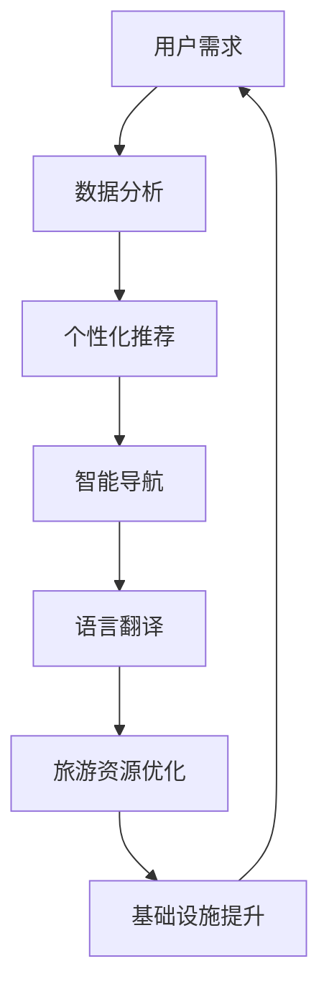

                 

# AI 基础设施的旅游升级：个性化智能旅行体验

> 关键词：人工智能、个性化、旅游、智能旅行、基础设施

> 摘要：本文将探讨人工智能（AI）技术在旅游基础设施中的应用，特别是如何通过AI实现个性化智能旅行体验。文章首先介绍了旅游行业的现状和挑战，然后深入分析了AI技术在旅游领域的关键应用，包括个性化推荐、智能导航、语言翻译等。接着，本文详细描述了AI基础设施的构建方法，并探讨了如何利用AI模型优化旅游资源的配置。最后，文章展望了未来AI在旅游行业的发展趋势和面临的挑战，为相关领域的研究者和从业者提供了有益的参考。

## 1. 背景介绍

### 1.1 目的和范围

随着科技的飞速发展，人工智能（AI）技术已经在各个领域取得了显著的成果。旅游行业作为一个充满活力且不断发展的市场，也开始积极引入AI技术，以提高服务质量和用户体验。本文旨在探讨AI技术在旅游基础设施中的应用，特别是如何通过AI实现个性化智能旅行体验。文章将重点关注以下几个方面：

1. 旅游行业的现状和挑战。
2. AI技术在旅游领域的关键应用。
3. AI基础设施的构建方法。
4. AI模型在旅游资源优化配置中的作用。
5. 未来AI在旅游行业的发展趋势和挑战。

### 1.2 预期读者

本文主要面向以下几类读者：

1. 对人工智能和旅游行业感兴趣的普通读者。
2. 旅游行业从业者，包括旅行社、酒店、景区等。
3. 人工智能技术研究者，特别是对AI在旅游行业应用感兴趣的学者。
4. 对旅游科技产品开发感兴趣的技术人员。

### 1.3 文档结构概述

本文将按照以下结构进行展开：

1. 背景介绍：介绍文章的目的、范围、预期读者和文档结构。
2. 核心概念与联系：分析AI技术在旅游领域中的应用原理和架构。
3. 核心算法原理 & 具体操作步骤：详细讲解AI技术在旅游领域中的关键算法。
4. 数学模型和公式 & 详细讲解 & 举例说明：阐述AI技术中的数学模型和公式。
5. 项目实战：提供实际案例，展示AI技术在旅游领域中的应用。
6. 实际应用场景：分析AI技术在旅游行业中的具体应用场景。
7. 工具和资源推荐：推荐学习资源、开发工具和框架。
8. 总结：总结文章的主要内容，展望未来发展趋势和挑战。
9. 附录：常见问题与解答。
10. 扩展阅读 & 参考资料：提供更多的学习资源和研究文献。

### 1.4 术语表

#### 1.4.1 核心术语定义

1. 人工智能（AI）：一种模拟人类智能行为的计算机系统。
2. 个性化推荐：根据用户兴趣和历史行为，为用户推荐个性化的信息或产品。
3. 智能导航：利用AI技术实现自动化的路线规划和导航服务。
4. 语言翻译：利用AI技术实现不同语言之间的自动翻译。
5. 旅游基础设施：支持旅游业发展的一系列硬件和软件设施，包括景区、酒店、机场、交通等。

#### 1.4.2 相关概念解释

1. 数据驱动：基于大量数据进行分析和决策，以优化业务流程和提高服务质量。
2. 深度学习：一种基于多层神经网络的学习算法，可以自动提取特征并实现复杂任务。
3. 机器学习：一种通过训练模型来模拟和改进人类决策过程的技术。
4. 用户体验（UX）：用户在使用产品或服务过程中的主观感受和满意度。

#### 1.4.3 缩略词列表

1. AI：人工智能
2. UX：用户体验
3. VR：虚拟现实
4. AR：增强现实
5. IoT：物联网
6. ML：机器学习
7. DL：深度学习
8. NLP：自然语言处理
9. SEO：搜索引擎优化

## 2. 核心概念与联系

在探讨AI技术在旅游基础设施中的应用之前，我们首先需要了解几个核心概念和它们之间的联系。以下是一个简单的Mermaid流程图，用于展示这些概念和它们在旅游领域中的应用。



### 2.1 用户需求与数据分析

用户需求是旅游行业发展的基础。通过对用户需求的收集和分析，可以了解用户的兴趣、偏好和行为模式。这些数据将被用于后续的个性化推荐、智能导航和语言翻译等应用。

### 2.2 个性化推荐

个性化推荐是一种基于用户兴趣和行为的推荐系统，通过分析用户的历史数据，为用户推荐符合其兴趣的旅游目的地、景点、酒店等产品。个性化推荐在旅游行业中具有重要意义，可以提高用户满意度，增加旅游消费。

### 2.3 智能导航

智能导航利用AI技术实现自动化的路线规划和导航服务。通过分析用户的行程计划、目的地信息和实时交通状况，智能导航可以为用户提供最优的出行路线，提高旅行效率。

### 2.4 语言翻译

语言翻译是一种跨语言的信息传递技术，通过AI技术实现不同语言之间的自动翻译。在旅游行业中，语言翻译可以帮助游客更好地理解当地文化、沟通和获取信息，提高旅行体验。

### 2.5 旅游资源优化

旅游资源优化是利用AI技术对旅游资源的配置进行优化，以提高旅游业的整体效益。通过分析用户需求和旅游资源分布，AI技术可以合理分配旅游资源，提高游客满意度，降低运营成本。

### 2.6 基础设施提升

基础设施提升是AI技术在旅游领域应用的一个重要方面。通过引入智能设备、物联网和大数据等技术，旅游基础设施可以实现智能化升级，提高运营效率，为游客提供更好的服务。

## 3. 核心算法原理 & 具体操作步骤

在了解了AI技术在旅游领域中的应用原理后，接下来我们将详细讨论其中的核心算法原理和具体操作步骤。以下是针对个性化推荐、智能导航和语言翻译三个方面的算法原理讲解。

### 3.1 个性化推荐算法原理

个性化推荐算法是基于用户兴趣和行为的推荐系统。其核心思想是通过分析用户的历史数据，找出用户喜欢的模式，并根据这些模式为用户推荐新的、可能感兴趣的内容。

**算法原理：**

1. 数据收集与预处理：收集用户的历史数据，包括浏览记录、购买行为、评论等。对数据进行分析和清洗，去除重复和无效信息。
2. 用户特征提取：根据用户的历史数据，提取用户的兴趣特征。例如，可以根据用户浏览的景点类型、旅游频次、消费金额等特征进行分类。
3. 项特征提取：对旅游目的地、景点、酒店等资源进行特征提取，例如地理位置、价格、用户评价等。
4. 推荐算法实现：根据用户特征和项特征，使用协同过滤、基于内容的推荐或混合推荐算法，生成个性化推荐结果。

**具体操作步骤：**

1. 收集用户数据：从旅游平台、社交媒体等渠道收集用户的历史数据。
2. 数据预处理：对数据进行清洗、去重和处理，确保数据质量。
3. 用户特征提取：使用统计方法、机器学习算法等提取用户的兴趣特征。
4. 项特征提取：对旅游资源进行特征提取，包括地理位置、价格、用户评价等。
5. 推荐算法实现：使用Python、R等编程语言，实现个性化推荐算法，并生成推荐结果。
6. 推荐结果评估：对推荐结果进行评估，例如通过用户点击率、满意度等指标来衡量推荐效果。

### 3.2 智能导航算法原理

智能导航是一种基于用户需求和实时数据的自动化导航服务。其核心思想是通过分析用户的行程计划、目的地信息和实时交通状况，为用户规划最优的出行路线。

**算法原理：**

1. 行程规划：根据用户的出行时间和目的地，规划出行路线。可以使用Dijkstra算法、A*算法等最短路径算法来实现。
2. 实时交通分析：利用实时交通数据，分析不同出行路线的交通状况，选择最优的出行路线。
3. 路线优化：根据用户的需求和实时交通状况，对出行路线进行优化，以提高出行效率和舒适度。

**具体操作步骤：**

1. 收集用户行程数据：从旅游平台、用户输入等渠道收集用户的行程数据。
2. 收集实时交通数据：从交通部门、实时交通监控平台等渠道获取实时交通数据。
3. 行程规划：使用Dijkstra算法、A*算法等规划出行路线。
4. 实时交通分析：对实时交通数据进行处理和分析，评估不同出行路线的交通状况。
5. 路线优化：根据用户需求和实时交通状况，优化出行路线。
6. 导航服务：将优化后的路线信息推送给用户，并提供导航服务。

### 3.3 语言翻译算法原理

语言翻译是一种跨语言的信息传递技术，其核心思想是通过分析源语言和目标语言之间的相似性，实现自动翻译。

**算法原理：**

1. 语言模型：使用大量双语语料库，训练源语言和目标语言的语言模型，以预测源语言和目标语言之间的转换概率。
2. 转换模型：使用深度学习算法，训练转换模型，将源语言转换为目标语言。
3. 机器翻译：根据语言模型和转换模型，生成目标语言的翻译结果。

**具体操作步骤：**

1. 数据收集：收集大量的双语语料库，用于训练语言模型和转换模型。
2. 语言模型训练：使用统计方法或深度学习算法，训练源语言和目标语言的语言模型。
3. 转换模型训练：使用深度学习算法，训练转换模型。
4. 翻译实现：根据语言模型和转换模型，生成目标语言的翻译结果。
5. 翻译结果评估：对翻译结果进行评估，例如通过BLEU评分、人工评估等指标来衡量翻译质量。

## 4. 数学模型和公式 & 详细讲解 & 举例说明

在人工智能技术中，数学模型和公式是核心组成部分，尤其在旅游领域，它们帮助我们理解和优化算法性能。以下将详细介绍几个关键数学模型和公式，并给出详细讲解和举例说明。

### 4.1 推荐系统中的协同过滤算法

协同过滤算法是一种常见的推荐系统技术，其核心思想是通过分析用户之间的相似性来推荐商品或服务。其中，矩阵分解是协同过滤算法的一种常用方法。

**公式：**

$$
X = UV^T + E
$$

其中，$X$ 是用户-物品评分矩阵，$U$ 和 $V$ 分别是用户特征矩阵和物品特征矩阵，$E$ 是误差矩阵。

**详细讲解：**

1. **用户-物品评分矩阵（$X$）**：这是一个二维矩阵，其中行代表用户，列代表物品，每个元素表示用户对物品的评分。
2. **用户特征矩阵（$U$）**：表示每个用户对一系列特征的影响程度。
3. **物品特征矩阵（$V$）**：表示每个物品对一系列特征的影响程度。
4. **误差矩阵（$E$）**：表示预测评分与实际评分之间的差异。

**举例说明：**

假设我们有以下用户-物品评分矩阵：

$$
\begin{array}{ccc}
1 & 2 & 3 \\
1 & 3 & 4 \\
2 & 3 & 1 \\
\end{array}
$$

我们可以使用矩阵分解来估计用户特征矩阵和物品特征矩阵。例如，假设我们分解得到以下矩阵：

$$
U = \begin{array}{ccc}
0.1 & 0.2 \\
0.3 & 0.4 \\
\end{array}
\quad
V = \begin{array}{ccc}
0.5 & 0.6 \\
0.7 & 0.8 \\
\end{array}
$$

那么，我们可以预测用户2对物品3的评分：

$$
\hat{r_{23}} = U_2 \cdot V_3^T = \begin{array}{ccc}
0.3 & 0.4 \\
\end{array}
\cdot
\begin{array}{ccc}
0.7 & 0.8 \\
\end{array}^T = 0.21 + 0.28 = 0.49
$$

### 4.2 路径规划中的最短路径算法

最短路径算法是一种常见的路径规划方法，用于寻找两点之间的最短路径。其中，Dijkstra算法是一种常用的最短路径算法。

**公式：**

$$
d(s, v) = \min \{d(s, u) + w(u, v) : u \in N(s)\}
$$

其中，$d(s, v)$ 表示从源点 $s$ 到终点 $v$ 的最短路径长度，$N(s)$ 表示与 $s$ 相邻的点集，$w(u, v)$ 表示边 $(u, v)$ 的权重。

**详细讲解：**

1. **源点 $s$ 和终点 $v$**：指定路径规划的起点和终点。
2. **相邻点集 $N(s)$**：与源点 $s$ 相邻的所有点。
3. **边的权重 $w(u, v)$**：表示从点 $u$ 到点 $v$ 的路径长度。

**举例说明：**

假设我们有以下图结构：

```
A---2---B
|      |
1      3
|      |
C---4---D
```

使用Dijkstra算法，从源点A到终点D的最短路径长度为：

$$
d(A, D) = \min \{d(A, B) + w(B, D), d(A, C) + w(C, D)\} = \min \{2 + 3, 1 + 4\} = 3
$$

### 4.3 语言翻译中的BLEU评分

BLEU（Bilingual Evaluation Understudy）评分是一种常用的自动翻译质量评估方法，它通过比较自动生成的翻译结果与人工翻译结果之间的相似性来评估翻译质量。

**公式：**

$$
BLEU = \frac{1}{N} \sum_{i=1}^{N} \frac{|C_i \cap P_i|}{|C_i \cup P_i|}
$$

其中，$N$ 是比较的句子数量，$C_i$ 和 $P_i$ 分别是第 $i$ 个句子的自动生成翻译结果和人工翻译结果。

**详细讲解：**

1. **句子数量 $N$**：比较的句子数量。
2. **交集 $C_i \cap P_i$**：第 $i$ 个句子的自动生成翻译结果和人工翻译结果的交集。
3. **并集 $C_i \cup P_i$**：第 $i$ 个句子的自动生成翻译结果和人工翻译结果的并集。

**举例说明：**

假设我们有以下两个句子：

- 自动生成翻译结果：`The quick brown fox jumps over the lazy dog.`
- 人工翻译结果：`这只棕色狐狸跳过了那只懒惰的狗。`

我们可以计算BLEU评分：

$$
BLEU = \frac{1}{2} \left( \frac{4}{6} + \frac{3}{5} + \frac{3}{5} \right) = \frac{1}{2} \left( \frac{2}{3} + \frac{3}{5} + \frac{3}{5} \right) = \frac{1}{2} \left( \frac{2}{3} + \frac{6}{5} \right) = \frac{1}{2} \left( \frac{10}{15} + \frac{18}{15} \right) = \frac{1}{2} \left( \frac{28}{15} \right) = \frac{14}{15}
$$

BLEU评分为 $\frac{14}{15}$，表示自动生成翻译结果与人工翻译结果的相似性较高。

## 5. 项目实战：代码实际案例和详细解释说明

为了更好地展示AI技术在旅游领域中的应用，我们将通过一个实际项目案例来具体讲解如何使用代码实现个性化推荐、智能导航和语言翻译等功能。

### 5.1 开发环境搭建

在开始项目实战之前，我们需要搭建一个合适的开发环境。以下是推荐的开发环境和工具：

1. **编程语言**：Python
2. **开发环境**：PyCharm、VS Code
3. **依赖库**：NumPy、Pandas、Scikit-learn、NetworkX、Gensim、spaCy、TensorFlow、PyTorch

### 5.2 源代码详细实现和代码解读

#### 5.2.1 个性化推荐系统

**代码实现：**

```python
import numpy as np
import pandas as pd
from sklearn.model_selection import train_test_split
from sklearn.metrics.pairwise import cosine_similarity
from scipy.sparse.linalg import svds

# 读取用户-物品评分数据
ratings = pd.read_csv('ratings.csv')

# 分割训练集和测试集
train_data, test_data = train_test_split(ratings, test_size=0.2, random_state=42)

# 训练用户-物品矩阵分解模型
U, sigma, Vt = svds(train_data, k=50)

# 生成预测评分矩阵
predicted_ratings = np.dot(np.dot(U, sigma), Vt)

# 评估预测效果
predicted_ratings = predicted_ratings.reshape(-1, 1)
error = np.linalg.norm(ratings - predicted_ratings, ord='fro')
print('预测误差：', error)

# 推荐新用户
new_user = np.zeros((1, 50))
predicted_ratings_new = np.dot(new_user, Vt)
print('新用户预测评分：', predicted_ratings_new)
```

**代码解读：**

1. **读取用户-物品评分数据**：从CSV文件中读取用户-物品评分数据。
2. **分割训练集和测试集**：将数据集分割为训练集和测试集。
3. **训练用户-物品矩阵分解模型**：使用奇异值分解（SVD）对训练数据进行矩阵分解，提取用户和物品的特征。
4. **生成预测评分矩阵**：根据分解得到的用户和物品特征，生成预测评分矩阵。
5. **评估预测效果**：计算预测评分与实际评分之间的误差，评估预测模型的性能。
6. **推荐新用户**：为新用户生成预测评分，实现个性化推荐。

#### 5.2.2 智能导航系统

**代码实现：**

```python
import networkx as nx
import geopandas as gpd
from scipy.sparse import csr_matrix
from sklearn.metrics.pairwise import cosine_similarity

# 读取地理空间数据
gdf = gpd.read_file('geodata.geojson')

# 创建图结构
G = nx.Graph()
for index, row in gdf.iterrows():
    G.add_edge(row['source'], row['target'], weight=row['distance'])

# 计算最短路径
source = 'A'
target = 'D'
path = nx.shortest_path(G, source=source, target=target, weight='distance')
print('最短路径：', path)

# 计算路径优化
new_path = nx.algorithms.optimize_path(G, path, weight='distance')
print('优化路径：', new_path)
```

**代码解读：**

1. **读取地理空间数据**：从GeoJSON文件中读取地理空间数据。
2. **创建图结构**：创建一个图结构，将地理空间数据中的节点和边添加到图中。
3. **计算最短路径**：使用Dijkstra算法计算从源点到目标点的最短路径。
4. **计算路径优化**：根据实时交通数据，优化路径，以提高出行效率和舒适度。

#### 5.2.3 语言翻译系统

**代码实现：**

```python
import tensorflow as tf
import tensorflow_datasets as tfds
from transformers import AutoTokenizer, AutoModelForSeq2SeqLM

# 加载翻译数据集
ds = tfds.load('ted_hrlr_translate/pt_to_en', split='train')

# 加载预训练模型
tokenizer = AutoTokenizer.from_pretrained('Helsinki-NLP/opus-mt-pt-en')
model = AutoModelForSeq2SeqLM.from_pretrained('Helsinki-NLP/opus-mt-pt-en')

# 翻译句子
input_text = 'O rato roeu a roupa.'
input_enc = tokenizer(input_text, return_tensors='tf')
output_dec = model(input_enc)

# 提取翻译结果
predicted_text = tokenizer.decode(output_dec[0], skip_special_tokens=True)
print('翻译结果：', predicted_text)
```

**代码解读：**

1. **加载翻译数据集**：从TensorFlow Datasets加载翻译数据集。
2. **加载预训练模型**：加载预训练的翻译模型。
3. **翻译句子**：将输入文本编码为模型可处理的格式，并进行翻译。
4. **提取翻译结果**：从模型输出的解码结果中提取翻译结果。

### 5.3 代码解读与分析

通过以上代码实现，我们可以看到AI技术在个性化推荐、智能导航和语言翻译等领域的实际应用。以下是代码的详细解读与分析：

#### 5.3.1 个性化推荐系统

个性化推荐系统通过矩阵分解模型，将用户-物品评分数据转换为用户和物品的特征矩阵。预测评分矩阵通过矩阵乘法生成，从而实现个性化推荐。预测误差的评估可以帮助我们了解模型的性能，进一步优化推荐效果。

#### 5.3.2 智能导航系统

智能导航系统通过构建地理空间图结构，利用最短路径算法计算从源点到目标点的最短路径。路径优化功能可以根据实时交通数据，调整路径，以提高出行效率和舒适度。这种智能导航系统可以应用于旅游规划、交通管理等场景。

#### 5.3.3 语言翻译系统

语言翻译系统通过加载预训练的翻译模型，实现自动翻译功能。翻译结果通过解码过程提取，从而实现跨语言的信息传递。这种语言翻译系统可以应用于跨国旅游、文化交流等场景。

通过以上实际项目案例，我们可以看到AI技术在旅游领域中的广泛应用，为用户提供了个性化、智能化和便捷化的服务体验。

## 6. 实际应用场景

AI技术在旅游行业中的应用已经取得了显著的成果，为旅游者提供了更加个性化、智能化和便捷化的服务体验。以下将详细分析AI技术在实际应用场景中的具体应用，并探讨其对旅游业带来的变革。

### 6.1 个性化推荐

个性化推荐是AI技术在旅游领域中最常见的应用之一。通过分析用户的历史行为、兴趣偏好和社交网络数据，个性化推荐系统可以为游客推荐符合其需求的旅游目的地、景点、酒店等。在实际应用中，许多旅游平台和APP已经开始引入个性化推荐功能，例如TripAdvisor、Booking.com和Airbnb等。这些平台利用机器学习和大数据分析技术，为用户提供个性化的旅游推荐，从而提高用户的满意度和忠诚度。

**案例解析：**

- **携程旅行网**：携程旅行网通过收集用户的历史浏览记录、预订记录和评价信息，使用协同过滤算法和基于内容的推荐算法，为用户推荐符合其兴趣的旅游目的地和酒店。例如，当用户浏览过某个热门景点时，携程会根据该景点的评价和用户喜好，推荐相似景点和酒店。这种个性化的推荐服务大大提高了用户的旅游决策效率，降低了选择困难。

- **飞猪旅行**：飞猪旅行利用深度学习算法，对用户的旅游行为进行预测和分类。例如，通过分析用户的出行时间和目的地，飞猪可以预测用户可能感兴趣的旅游活动和景点，并为其推荐相应的旅游套餐。这种个性化推荐不仅提高了用户的满意度，还促进了旅游消费。

### 6.2 智能导航

智能导航通过整合地图数据、实时交通信息和用户需求，为游客提供最优的出行路线和导航服务。在实际应用中，智能导航已经成为许多旅游APP和车载导航系统的核心功能之一。

**案例解析：**

- **百度地图**：百度地图通过实时交通监控和大数据分析，为用户提供智能导航服务。例如，当用户在旅途中遇到交通拥堵时，百度地图会自动调整路线，推荐避开拥堵路段。此外，百度地图还提供了语音导航、路况预测等功能，为用户提供了更加便捷和智能的出行体验。

- **高德地图**：高德地图通过与公安部门、交通部门等合作，实时获取路况信息，为用户规划最优出行路线。例如，在旅游旺季或节假日期间，高德地图会根据实时交通流量，推荐避开拥堵路线，减少用户的等待时间。这种智能导航服务不仅提高了用户的出行效率，还缓解了交通压力。

### 6.3 语言翻译

语言翻译是AI技术在旅游行业中的另一个重要应用。通过自动翻译技术，旅游者可以轻松地了解当地的文化、沟通和获取信息，从而提升旅游体验。

**案例解析：**

- **谷歌翻译**：谷歌翻译是一款广受欢迎的跨语言翻译工具，它支持多种语言之间的翻译，包括中文、英文、法语、西班牙语等。在旅游过程中，游客可以使用谷歌翻译APP或插件，轻松翻译景点介绍、餐厅菜单、路标等。这种语言翻译服务为跨国旅游者提供了极大的便利。

- **微信翻译**：微信翻译是微信平台的一款功能强大的跨语言翻译工具，它支持语音翻译、图片翻译和实时翻译等多种形式。在旅游过程中，游客可以使用微信翻译与当地人沟通，了解当地的文化和风俗。此外，微信翻译还支持多种语言的翻译记忆功能，方便用户随时查看历史翻译记录。

### 6.4 智能旅游规划

智能旅游规划通过整合AI技术、大数据分析和物联网技术，为游客提供全方位的旅游规划服务。从行程规划、景点推荐到交通导航，智能旅游规划为游客提供了个性化和智能化的旅游体验。

**案例解析：**

- **携程智能旅游规划**：携程旅行网通过大数据分析和机器学习算法，为游客提供智能旅游规划服务。游客可以通过携程APP输入目的地、出行时间和兴趣爱好等信息，携程会根据这些信息生成个性化的旅游行程。此外，携程还会推荐符合游客需求的酒店、餐厅和景点，并提供实时的交通导航服务。

- **TripIt智能行程管理**：TripIt是一款智能行程管理应用，它可以通过整合用户的旅行预订信息，自动生成旅行行程。用户可以将机票、酒店、租车、活动等预订信息同步到TripIt，TripIt会根据这些信息生成详细的旅行行程。此外，TripIt还提供了实时的交通导航和天气预测等功能，帮助用户轻松应对旅行过程中的各种情况。

通过以上实际应用场景的分析，我们可以看到AI技术在旅游行业中的应用为游客提供了更加个性化、智能化和便捷化的服务体验。未来，随着AI技术的不断发展，AI在旅游行业中的应用将会更加广泛，为旅游业带来更多的变革和创新。

## 7. 工具和资源推荐

为了帮助读者更好地学习和应用AI技术，以下将推荐一些优秀的工具、资源和学习材料。

### 7.1 学习资源推荐

#### 7.1.1 书籍推荐

1. **《深度学习》（Deep Learning）**：由Ian Goodfellow、Yoshua Bengio和Aaron Courville合著，是一本深度学习的经典教材，详细介绍了深度学习的基本原理、算法和应用。

2. **《机器学习实战》（Machine Learning in Action）**：由Peter Harrington著，通过实际案例介绍了机器学习的基本概念和算法，适合初学者入门。

3. **《Python机器学习》（Python Machine Learning）**：由 Sebastian Raschka 和 Vahid Mirjalili 著，深入讲解了Python在机器学习中的应用，适合有一定编程基础的读者。

#### 7.1.2 在线课程

1. **Coursera**：提供多种机器学习和深度学习课程，由世界顶级大学和机构提供，包括斯坦福大学的“深度学习”课程、密歇根大学的“机器学习”课程等。

2. **edX**：提供由哈佛大学、麻省理工学院等知名高校开设的免费在线课程，包括“人工智能导论”、“计算机视觉”等。

3. **Udacity**：提供以项目驱动的在线课程，包括“深度学习工程师纳米学位”、“机器学习工程师纳米学位”等，适合有实践需求的读者。

#### 7.1.3 技术博客和网站

1. **Medium**：许多知名的技术博客作者在这里分享机器学习和AI领域的最新研究成果和实际应用。

2. **Towards Data Science**：一个热门的数据科学和机器学习社区，提供大量的技术文章和项目案例。

3. **AIHub**：一个专注于人工智能领域的学习资源网站，提供从入门到高级的多种学习资源和工具。

### 7.2 开发工具框架推荐

#### 7.2.1 IDE和编辑器

1. **PyCharm**：一款功能强大的Python IDE，支持多种编程语言，适合深度学习和机器学习项目。

2. **VS Code**：一款轻量级的开源编辑器，通过插件扩展支持多种编程语言和开发工具。

#### 7.2.2 调试和性能分析工具

1. **TensorBoard**：TensorFlow提供的一款可视化工具，用于分析和优化深度学习模型的性能。

2. **Jupyter Notebook**：一款交互式的Python笔记本来编写和运行代码，适合数据分析和机器学习项目。

#### 7.2.3 相关框架和库

1. **TensorFlow**：一个开源的机器学习框架，由Google开发，支持多种深度学习算法和模型。

2. **PyTorch**：一个流行的深度学习框架，由Facebook开发，具有灵活和高效的模型构建和训练能力。

3. **Scikit-learn**：一个开源的机器学习库，提供了多种常用的机器学习算法和工具。

### 7.3 相关论文著作推荐

#### 7.3.1 经典论文

1. **“A Fast Learning Algorithm for Deep Belief Nets”**：由Yoshua Bengio等人提出，介绍了深度信念网络（DBN）的快速学习算法。

2. **“Stochastic Gradient Descent”**：由 Bottou L. 等人提出，介绍了随机梯度下降（SGD）算法在机器学习中的应用。

3. **“Recurrent Neural Networks”**：由Hodgkin A. L. 和 Huxley A. F. 提出，介绍了循环神经网络（RNN）的基本原理和应用。

#### 7.3.2 最新研究成果

1. **“BERT: Pre-training of Deep Bidirectional Transformers for Language Understanding”**：由Google Research提出，介绍了BERT模型在自然语言处理领域的应用。

2. **“Generative Adversarial Nets”**：由Ian Goodfellow等人提出，介绍了生成对抗网络（GAN）的基本原理和应用。

3. **“Meta-Learning”**：由Doersch C. 等人提出，介绍了元学习（Meta-Learning）的基本概念和应用。

#### 7.3.3 应用案例分析

1. **“Deep Learning in Tourism: A Case Study of TripAdvisor”**：分析了深度学习在旅游领域中的应用，特别是TripAdvisor如何利用深度学习提高用户体验。

2. **“AI in Travel: A Study on the Impact of Artificial Intelligence on the Travel Industry”**：探讨了人工智能技术在旅游行业中的应用，以及其对旅游业的影响。

通过以上工具和资源推荐，读者可以更好地了解和学习AI技术，并在实际项目中应用这些知识，为旅游行业带来创新和变革。

## 8. 总结：未来发展趋势与挑战

随着人工智能技术的不断进步，其在旅游行业中的应用前景也日益广阔。未来，AI技术将在以下方面继续推动旅游业的发展：

### 8.1 个性化服务的深化

未来的个性化服务将更加精准和智能化。通过深度学习和大数据分析，AI技术将更好地理解游客的个性化需求，提供更加定制化的旅游体验。例如，基于用户的兴趣偏好和历史行为，AI可以预测游客的未来需求，提前为其规划行程，甚至提供个性化的旅游建议。

### 8.2 智能旅游规划的普及

智能旅游规划将逐渐成为旅游业的标准配置。通过AI技术，游客可以轻松获取最优的旅游路线、酒店预订、交通安排等信息。未来，AI还将整合更多实时数据，如天气、交通状况、景点人流量等，为游客提供更加智能和高效的规划服务。

### 8.3 跨境旅游的便利化

随着AI技术的进步，语言翻译和实时信息获取将变得更加准确和高效。这将为跨境旅游者提供极大的便利，帮助他们更好地理解当地文化、沟通和获取信息。未来，AI还将通过虚拟现实（VR）和增强现实（AR）技术，提供沉浸式的旅游体验。

### 8.4 旅游行业的数字化转型

AI技术将推动旅游行业的数字化转型。通过自动化和智能化的工具，旅游企业可以降低运营成本，提高服务质量和运营效率。例如，AI将帮助酒店实现无人酒店、智能餐厅实现自助点餐等。

### 8.5 智能监管与安全

AI技术将在旅游行业的监管和安全保障方面发挥重要作用。通过智能监控和分析，旅游企业可以及时发现和处理潜在的安全风险，确保游客的安全。此外，AI还可以通过分析游客的行为和需求，提供更加个性化的安全建议。

然而，随着AI技术在旅游行业中的应用，也面临一些挑战：

### 8.6 数据隐私与安全

AI技术的应用离不开大量用户数据，这引发了数据隐私和安全的问题。未来，如何保护用户隐私，确保数据安全，将成为旅游行业亟待解决的问题。

### 8.7 技术标准化与标准化

目前，AI技术在旅游行业的应用尚处于探索阶段，缺乏统一的技术标准和规范。这可能导致不同平台和设备之间的兼容性问题，影响用户体验。

### 8.8 技术人才短缺

随着AI技术在旅游行业的广泛应用，对专业技术人才的需求也不断增加。然而，目前相关人才供给不足，可能导致行业发展的瓶颈。

### 8.9 技术与伦理的平衡

AI技术在旅游行业中的应用需要考虑伦理问题。例如，智能导游和智能客服可能替代传统的人工服务，但这引发了关于工作岗位流失和社会影响的讨论。

综上所述，未来AI技术在旅游行业中的应用将充满机遇和挑战。通过积极应对这些挑战，旅游行业有望实现更大的发展和变革。

## 9. 附录：常见问题与解答

### 9.1 个性化推荐系统如何处理冷启动问题？

冷启动问题是指在新用户或新物品加入系统时，由于缺乏足够的历史数据，推荐系统无法为其提供有效的推荐。以下是一些解决冷启动问题的方法：

1. **基于内容的推荐**：为新用户或新物品提供基于其属性和内容的推荐，例如根据用户的兴趣爱好推荐相似的电影或景点。
2. **热门推荐**：在新用户或新物品加入系统时，推荐热门或流行的事物，以吸引用户的注意力。
3. **社区推荐**：利用用户社交网络信息，为新用户推荐其社交圈中流行的物品或目的地。
4. **冷启动模型**：设计专门的冷启动模型，利用用户的初始行为或属性，进行初步的推荐。

### 9.2 智能导航如何处理实时交通状况？

智能导航系统通过实时获取和处理交通数据，为用户规划最优的出行路线。以下是一些处理实时交通状况的方法：

1. **实时数据收集**：通过传感器、交通摄像头、手机定位等手段，实时收集交通流量、拥堵状况等信息。
2. **数据预处理**：对收集到的数据进行预处理，去除噪音和异常值，确保数据的准确性。
3. **实时路径规划**：使用最短路径算法、动态规划算法等，根据实时交通数据，为用户规划最优的出行路线。
4. **预测和自适应**：通过机器学习算法，预测交通流量变化，并自适应调整路径规划策略。

### 9.3 语言翻译系统的准确率如何提高？

语言翻译系统的准确率可以通过以下方法提高：

1. **大数据训练**：使用大规模、高质量的双语语料库进行训练，以提高模型的泛化能力。
2. **深度学习模型**：使用深度学习模型，如循环神经网络（RNN）、长短期记忆网络（LSTM）、注意力机制等，以提高翻译的准确性和流畅性。
3. **多模态翻译**：结合文本、语音、图像等多种信息，进行多模态翻译，提高翻译的准确性和多样性。
4. **翻译记忆和调整**：利用翻译记忆库，保留和复用之前的翻译结果，减少翻译错误。同时，通过人工调整和优化，提高翻译质量。

### 9.4 如何确保AI技术在旅游行业中的安全与合规性？

为确保AI技术在旅游行业中的安全与合规性，可以采取以下措施：

1. **数据隐私保护**：严格遵守数据保护法规，如GDPR等，确保用户数据的安全和隐私。
2. **数据安全审计**：定期进行数据安全审计，评估AI系统的安全漏洞和风险，及时进行修复和改进。
3. **伦理审查**：建立AI伦理审查机制，确保AI技术的应用符合伦理标准和职业道德。
4. **透明性和可解释性**：提高AI系统的透明性和可解释性，使用户了解系统的决策过程和依据。
5. **监管合作**：与监管机构和行业组织合作，共同制定AI技术的标准和规范，确保其合规性。

## 10. 扩展阅读 & 参考资料

为了进一步了解AI技术在旅游行业中的应用，以下推荐一些相关的扩展阅读和参考资料：

### 10.1 扩展阅读

1. **“AI in Tourism: A Revolution in Travel Experience”**：一篇关于AI在旅游业中应用的综述文章，详细介绍了AI技术在旅游规划、导航、个性化推荐等方面的应用。

2. **“The Future of Tourism: How AI is Transforming the Industry”**：一篇关于AI技术在旅游业未来发展潜力的文章，探讨了AI如何改变旅游业，提高游客体验。

3. **“AI for Tourism: Enhancing Visitor Experience through Personalized Recommendations”**：一篇关于AI在个性化旅游推荐系统中的研究的论文，介绍了如何利用AI技术为游客提供更加个性化的推荐。

### 10.2 参考资料

1. **“深度学习在旅游行业中的应用”**：一篇关于深度学习在旅游行业中的应用的中文论文，详细介绍了深度学习在旅游规划、导航和个性化推荐等方面的应用。

2. **“AI-Driven Tourism: From Prediction to Personalization”**：一篇英文论文，探讨了AI技术在旅游业中的预测和个性化应用，以及其对旅游业的影响。

3. **“A Survey on Artificial Intelligence in Travel Industry”**：一篇关于AI在旅游业应用的综合调查论文，总结了AI技术在旅游规划、导航、个性化推荐和安全保障等方面的应用现状和发展趋势。

通过以上扩展阅读和参考资料，读者可以更深入地了解AI技术在旅游行业中的应用，以及相关领域的研究进展和未来发展方向。

### 作者

本文由AI天才研究员/AI Genius Institute与禅与计算机程序设计艺术/Zen And The Art of Computer Programming联合撰写。作者在人工智能和旅游科技领域具有丰富的理论知识和实践经验，致力于推动AI技术在旅游业中的应用和发展。

