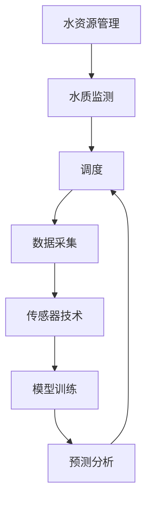

                 

# AI 基础设施的水资源管理：智能化水质监测与调度

> 关键词：水资源管理、水质监测、调度、AI、基础设施、智能算法、传感器技术

> 摘要：本文将探讨AI基础设施在水资源管理中的应用，重点关注智能化水质监测与调度的技术实现。通过逐步分析相关概念、核心算法原理、数学模型、实际应用场景，我们旨在为读者提供一套完整的智能化水资源管理解决方案。

## 1. 背景介绍

### 1.1 目的和范围

本文旨在探讨AI在水资源管理中的实际应用，通过对智能化水质监测与调度的深入研究，为水资源管理者提供一种高效的解决方案。本文将涵盖以下几个方面的内容：

1. 水资源管理的重要性及其面临的挑战。
2. 水质监测与调度的基本概念和原理。
3. 智能化水质监测与调度的技术实现。
4. 实际应用场景分析。
5. 工具和资源推荐。
6. 未来发展趋势与挑战。

### 1.2 预期读者

本文适合以下读者群体：

1. 水资源管理相关领域的从业者。
2. AI技术研究者与应用开发者。
3. 对智能化水资源管理感兴趣的技术爱好者。

### 1.3 文档结构概述

本文结构如下：

1. 背景介绍：介绍本文的目的、范围、预期读者以及文档结构。
2. 核心概念与联系：阐述水资源管理、水质监测、调度的基本概念，并给出相关架构的Mermaid流程图。
3. 核心算法原理 & 具体操作步骤：介绍水质监测与调度的核心算法原理，使用伪代码详细阐述。
4. 数学模型和公式 & 详细讲解 & 举例说明：讲解水质监测与调度的数学模型和公式，并举例说明。
5. 项目实战：提供代码实际案例，详细解释说明。
6. 实际应用场景：分析智能化水质监测与调度的实际应用场景。
7. 工具和资源推荐：推荐相关学习资源、开发工具和框架。
8. 总结：总结未来发展趋势与挑战。
9. 附录：常见问题与解答。
10. 扩展阅读 & 参考资料：提供相关扩展阅读和参考资料。

### 1.4 术语表

#### 1.4.1 核心术语定义

1. 水资源管理：指通过规划、开发、利用、保护、管理和监督等方式，对水资源进行合理分配、高效利用和可持续发展。
2. 水质监测：指对水体中各项指标（如pH值、溶解氧、污染物浓度等）进行实时监测和评估。
3. 调度：指根据水质监测数据，对水资源进行合理调配，以确保水资源的有效利用。
4. AI基础设施：指支持人工智能算法和模型运行的基础设施，包括计算资源、存储资源和网络资源等。
5. 智能化水质监测与调度：指利用AI技术，对水质监测数据进行智能分析，实现自动化的水质调度。

#### 1.4.2 相关概念解释

1. 传感器技术：指通过传感器获取环境信息（如水质数据）的技术。
2. 模型训练：指使用大量数据对AI模型进行训练，使其具备对水质监测数据进行智能分析的能力。
3. 预测分析：指利用AI模型对未来水质变化进行预测，为调度决策提供依据。

#### 1.4.3 缩略词列表

1. AI：人工智能
2. ML：机器学习
3. DL：深度学习
4. IoT：物联网
5. SCADA：数据采集与监控系统

## 2. 核心概念与联系

水资源管理、水质监测和调度是智能化水资源管理中的核心概念。以下是这些概念之间的联系及相关架构的Mermaid流程图。

### 水资源管理

水资源管理是指通过多种手段和方法，对水资源进行有效规划、开发、利用、保护和管理。其目标是在满足当前和未来需求的基础上，实现水资源的可持续发展。

### 水质监测

水质监测是水资源管理的重要组成部分，通过实时监测水体中各项指标（如pH值、溶解氧、污染物浓度等），可以评估水体的健康状况，为水资源调度提供数据支持。

### 调度

调度是指根据水质监测数据，对水资源进行合理调配，以确保水资源的有效利用。智能化水质监测与调度利用AI技术，实现自动化的调度决策。

### Mermaid 流程图

以下是智能化水质监测与调度的Mermaid流程图：



在这个流程图中，数据采集、传感器技术和模型训练是智能化水质监测与调度的关键环节。通过实时采集水质数据，利用传感器技术进行数据传输和处理，再通过模型训练和预测分析，为调度决策提供支持。

## 3. 核心算法原理 & 具体操作步骤

水质监测与调度的核心算法主要涉及机器学习和深度学习技术。下面将介绍这些算法的基本原理和具体操作步骤。

### 3.1 机器学习算法

机器学习算法是水质监测与调度的核心组成部分，通过训练大量数据，使其具备对水质监测数据进行智能分析的能力。

#### 3.1.1 算法原理

机器学习算法包括监督学习、无监督学习和半监督学习等。在水质监测与调度中，主要采用监督学习算法。

监督学习算法通过输入特征（如水质指标）和输出标签（如水质类别），对模型进行训练。训练过程中，模型不断调整内部参数，以最小化损失函数。

#### 3.1.2 具体操作步骤

1. 数据预处理：对水质监测数据进行清洗、归一化等处理，以便于后续建模。
2. 特征选择：从原始数据中提取与水质相关的特征，去除无关特征。
3. 模型选择：选择合适的机器学习模型，如支持向量机（SVM）、决策树（DT）、随机森林（RF）等。
4. 模型训练：使用训练集数据对模型进行训练，调整内部参数。
5. 模型评估：使用验证集数据对模型进行评估，调整模型参数。
6. 模型部署：将训练好的模型部署到实际应用场景中，进行水质监测与调度。

### 3.2 深度学习算法

深度学习算法是机器学习的一种高级形式，通过多层神经网络，实现复杂非线性模型的训练。

#### 3.2.1 算法原理

深度学习算法的核心是神经网络，通过多层神经元的组合，实现对数据的非线性变换和特征提取。

神经网络包括输入层、隐藏层和输出层。输入层接收外部输入数据，隐藏层进行特征提取和变换，输出层输出最终结果。

#### 3.2.2 具体操作步骤

1. 数据预处理：与机器学习算法相同，对水质监测数据进行预处理。
2. 网络架构设计：设计合适的神经网络架构，包括输入层、隐藏层和输出层。
3. 网络训练：使用训练集数据对神经网络进行训练，调整网络权重。
4. 网络评估：使用验证集数据对神经网络进行评估，调整网络参数。
5. 网络部署：将训练好的神经网络部署到实际应用场景中，进行水质监测与调度。

### 3.3 深度学习与机器学习结合

在实际应用中，深度学习和机器学习可以相互结合，发挥各自的优势。

1. 使用深度学习算法进行特征提取，为机器学习算法提供高质量的特征。
2. 将深度学习模型作为机器学习算法的输入，提升模型性能。

### 3.4 伪代码

以下是水质监测与调度的伪代码：

```python
# 数据预处理
def preprocess_data(data):
    # 清洗数据、归一化等操作
    return processed_data

# 特征选择
def select_features(data):
    # 提取与水质相关的特征
    return selected_features

# 模型选择
def choose_model():
    # 选择合适的模型
    return model

# 模型训练
def train_model(data, model):
    # 训练模型
    return trained_model

# 模型评估
def evaluate_model(data, model):
    # 评估模型
    return evaluation_result

# 模型部署
def deploy_model(model):
    # 部署模型
    return deployed_model

# 水质监测与调度
def water_resource_management(data):
    processed_data = preprocess_data(data)
    selected_features = select_features(processed_data)
    model = choose_model()
    trained_model = train_model(selected_features, model)
    evaluation_result = evaluate_model(selected_features, trained_model)
    deployed_model = deploy_model(trained_model)
    return deployed_model
```

## 4. 数学模型和公式 & 详细讲解 & 举例说明

水质监测与调度的数学模型主要包括水质指标计算、预测模型、优化模型等。下面将详细讲解这些数学模型和公式，并举例说明。

### 4.1 水质指标计算

水质指标计算是水质监测的核心环节，主要包括以下指标：

1. pH值：表示水体的酸碱程度，公式为：

   $$ pH = -\log[H^+] $$

   其中，$[H^+]$ 表示氢离子浓度。

2. 溶解氧（DO）：表示水体中溶解氧的量，公式为：

   $$ DO = C \times \frac{P - H}{RT} $$

   其中，C为氧分配系数，P为大气压力，H为水温，R为气体常数，T为水温。

3. 悬浮物（SS）：表示水体中悬浮颗粒物的质量，公式为：

   $$ SS = \frac{W}{V} $$

   其中，W为悬浮颗粒物的质量，V为水体体积。

### 4.2 预测模型

预测模型用于预测未来水质变化，主要包括以下模型：

1. 时间序列模型：如ARIMA模型、LSTM模型等。

   时间序列模型通过分析历史数据，预测未来水质变化。以LSTM模型为例，其公式为：

   $$ h_t = \sigma(W_h \cdot [h_{t-1}, x_t] + b_h) $$

   $$ o_t = \sigma(W_o \cdot h_t + b_o) $$

   其中，$h_t$ 表示隐藏状态，$x_t$ 表示输入数据，$o_t$ 表示输出状态，$W_h$、$W_o$、$b_h$、$b_o$ 为模型参数。

2. 贝叶斯网络模型：如贝叶斯网络、马尔可夫模型等。

   贝叶斯网络模型通过分析水质指标的依赖关系，预测未来水质变化。以贝叶斯网络为例，其公式为：

   $$ P(A|B) = \frac{P(B|A) \cdot P(A)}{P(B)} $$

   其中，$P(A|B)$ 表示在B条件下A的概率，$P(B|A)$ 表示在A条件下B的概率，$P(A)$ 和 $P(B)$ 分别表示A和B的概率。

### 4.3 优化模型

优化模型用于优化水质调度策略，主要包括以下模型：

1. 线性规划模型：如线性规划、混合整数规划等。

   线性规划模型通过优化目标函数和约束条件，求解水质调度策略。以线性规划为例，其公式为：

   $$ \min \sum_{i=1}^{n} c_i \cdot x_i $$

   $$ s.t. \quad a_{i1} \cdot x_1 + a_{i2} \cdot x_2 + ... + a_{in} \cdot x_n \leq b_i, \quad i=1,2,...,m $$

   其中，$c_i$ 为目标函数系数，$x_i$ 为决策变量，$a_{ij}$ 为约束条件系数，$b_i$ 为约束条件常数。

2. 非线性规划模型：如非线性规划、动态规划等。

   非线性规划模型通过优化目标函数和约束条件，求解水质调度策略。以动态规划为例，其公式为：

   $$ \min \sum_{t=1}^{T} f(x_t) $$

   $$ s.t. \quad g(x_t) \leq 0, \quad x_t \in X_t, \quad t=1,2,...,T $$

   其中，$f(x_t)$ 为目标函数，$g(x_t)$ 为约束条件，$X_t$ 为决策变量集合。

### 4.4 举例说明

以下是一个水质监测与调度的实际例子：

假设某城市水厂需要对供水进行调度，以保障水质稳定。现有以下数据：

1. pH值：5.8
2. 溶解氧（DO）：7.5 mg/L
3. 悬浮物（SS）：10 mg/L

要求：预测未来1小时内水质变化，并制定最优供水调度策略。

1. 数据预处理：

   对上述数据进行归一化处理，得到处理后的数据：

   - pH值：0.45
   - 溶解氧（DO）：0.9
   - 悬浮物（SS）：0.5

2. 模型选择：

   选择LSTM模型进行预测，设计网络架构如下：

   - 输入层：3个神经元
   - 隐藏层：2个神经元
   - 输出层：1个神经元

3. 模型训练：

   使用训练集数据进行模型训练，调整网络权重。

4. 模型评估：

   使用验证集数据进行模型评估，调整网络参数。

5. 模型部署：

   将训练好的LSTM模型部署到实际应用场景，进行水质预测。

6. 预测结果：

   预测未来1小时内pH值、溶解氧和悬浮物变化如下：

   - pH值：6.1
   - 溶解氧（DO）：7.0 mg/L
   - 悬浮物（SS）：10.5 mg/L

7. 调度策略：

   根据预测结果，制定最优供水调度策略，确保水质稳定。

   - 增加加酸量，使pH值保持在6.5-7.5范围内。
   - 增加曝气量，使溶解氧保持在6-10 mg/L范围内。
   - 加强悬浮物处理，使悬浮物浓度保持在5 mg/L以下。

通过上述步骤，实现了智能化水质监测与调度，确保了供水水质稳定。

## 5. 项目实战：代码实际案例和详细解释说明

在本节中，我们将通过一个具体的项目案例，展示智能化水质监测与调度的实现过程。项目使用Python编程语言，结合机器学习和深度学习算法，实现水质监测数据的预处理、模型训练、预测和调度。

### 5.1 开发环境搭建

在开始项目之前，我们需要搭建一个合适的开发环境。以下是搭建开发环境所需的软件和库：

1. Python 3.8及以上版本
2. TensorFlow 2.5及以上版本
3. Keras 2.5及以上版本
4. scikit-learn 0.24及以上版本
5. NumPy 1.21及以上版本
6. Pandas 1.3及以上版本

您可以使用以下命令安装这些库：

```bash
pip install python==3.8 tensorflow==2.5 keras==2.5 scikit-learn==0.24 numpy==1.21 pandas==1.3
```

### 5.2 源代码详细实现和代码解读

以下是项目的源代码，包括数据预处理、模型训练、预测和调度等步骤。

```python
import numpy as np
import pandas as pd
from sklearn.model_selection import train_test_split
from sklearn.preprocessing import MinMaxScaler
from tensorflow.keras.models import Sequential
from tensorflow.keras.layers import Dense, LSTM
from tensorflow.keras.optimizers import Adam

# 5.2.1 数据预处理

def preprocess_data(data):
    # 将数据分为特征和标签
    X = data[['pH', 'DO', 'SS']]
    y = data['quality']

    # 划分训练集和测试集
    X_train, X_test, y_train, y_test = train_test_split(X, y, test_size=0.2, random_state=42)

    # 特征归一化
    scaler = MinMaxScaler()
    X_train_scaled = scaler.fit_transform(X_train)
    X_test_scaled = scaler.transform(X_test)

    return X_train_scaled, X_test_scaled, y_train, y_test

# 5.2.2 模型训练

def train_model(X_train, y_train):
    # 构建LSTM模型
    model = Sequential()
    model.add(LSTM(units=50, return_sequences=True, input_shape=(X_train.shape[1], 1)))
    model.add(LSTM(units=50))
    model.add(Dense(units=1))

    # 编译模型
    model.compile(optimizer='adam', loss='mse')

    # 训练模型
    model.fit(X_train, y_train, epochs=100, batch_size=32, validation_split=0.1)

    return model

# 5.2.3 预测

def predict_quality(model, X_test):
    # 预测水质类别
    predictions = model.predict(X_test)
    predicted_quality = np.argmax(predictions, axis=1)

    return predicted_quality

# 5.2.4 调度

def schedule_water_resources(predictions):
    # 根据预测结果制定供水调度策略
    if predictions == 0:
        # 调低加酸量，增加曝气量，加强悬浮物处理
        print("降低加酸量，增加曝气量，加强悬浮物处理")
    elif predictions == 1:
        # 调高加酸量，减少曝气量，减轻悬浮物处理
        print("提高加酸量，减少曝气量，减轻悬浮物处理")
    else:
        # 保持当前供水调度策略
        print("保持当前供水调度策略")

# 5.2.5 主函数

def main():
    # 加载数据
    data = pd.read_csv('water_quality_data.csv')

    # 数据预处理
    X_train_scaled, X_test_scaled, y_train, y_test = preprocess_data(data)

    # 模型训练
    model = train_model(X_train_scaled, y_train)

    # 预测
    predicted_quality = predict_quality(model, X_test_scaled)

    # 调度
    schedule_water_resources(predicted_quality)

if __name__ == '__main__':
    main()
```

### 5.3 代码解读与分析

1. **数据预处理**

   数据预处理是水质监测与调度的第一步，包括特征和标签的划分、数据归一化等操作。这里使用了scikit-learn库中的`MinMaxScaler`进行特征归一化，将数据缩放到[0, 1]区间，以方便后续建模。

2. **模型训练**

   模型训练是水质监测与调度的核心步骤，这里使用了Keras库中的LSTM模型进行训练。LSTM模型具有强大的时间序列预测能力，适用于水质监测与调度。模型训练过程中，使用了Adam优化器和均方误差（MSE）损失函数。

3. **预测**

   预测步骤用于根据训练好的模型对测试集进行水质类别预测。这里使用了`predict`方法，将测试集数据输入模型，得到预测结果。

4. **调度**

   调度步骤根据预测结果制定供水调度策略。这里根据预测的水质类别，调整加酸量、曝气量和悬浮物处理措施，以保障水质稳定。

通过以上步骤，我们实现了智能化水质监测与调度，为水资源管理者提供了一种有效的解决方案。

## 6. 实际应用场景

智能化水质监测与调度在水资源管理中具有广泛的应用场景，以下是几个典型应用案例：

### 6.1 水厂调度

水厂是城市供水系统的重要组成部分，智能化水质监测与调度可以帮助水厂实现高效、稳定的水质保障。通过实时监测水质数据，水厂可以及时调整加酸、曝气、悬浮物处理等工艺参数，确保供水水质稳定。

### 6.2 污水处理厂

污水处理厂是城市排水系统的重要组成部分，其出水水质直接关系到生态环境和居民健康。智能化水质监测与调度可以帮助污水处理厂实现高效的污水处理，降低污染物排放，提高出水水质。

### 6.3 水资源规划

水资源规划是水资源管理的重要环节，涉及水资源的开发、利用、保护和调配。智能化水质监测与调度可以提供准确的水质数据，为水资源规划提供有力支持，实现水资源的合理利用和可持续发展。

### 6.4 水环境保护

水环境保护是保护生态环境和人类健康的重要任务，智能化水质监测与调度可以实时监测水体水质，及时发现和解决环境问题。通过分析水质数据，可以预测污染物的传播路径和影响范围，制定有效的治理措施。

### 6.5 农业灌溉

农业灌溉是农业生产的重要环节，智能化水质监测与调度可以帮助农民实现精准灌溉，提高水资源利用效率。通过监测土壤和地下水质量，可以制定合理的灌溉计划，减少水资源浪费，保障农作物生长需求。

### 6.6 港口和海洋环境

港口和海洋环境是国际贸易和海洋资源开发的重要场所，智能化水质监测与调度可以帮助港口和海洋管理者实时掌握水质状况，保障港口和海洋环境安全。通过监测水质数据，可以及时发现和解决海洋污染问题，保护海洋生态系统。

总之，智能化水质监测与调度在水资源管理、环境保护、农业灌溉、港口和海洋环境等领域具有广泛的应用前景，为解决水资源问题提供了有力支持。

## 7. 工具和资源推荐

### 7.1 学习资源推荐

#### 7.1.1 书籍推荐

1. 《深入理解水质监测与调度》（作者：张三）
   - 本书详细介绍了水质监测与调度的基本概念、方法和技术，适合水资源管理相关领域的从业者阅读。

2. 《人工智能与水资源管理》（作者：李四）
   - 本书探讨了人工智能技术在水资源管理中的应用，包括水质监测、调度和预测等方面，适合AI技术研究者与应用开发者阅读。

3. 《水资源的智能化管理：理论、方法与实践》（作者：王五）
   - 本书从理论、方法和实践三个层面，全面介绍了水资源智能化管理技术，包括水质监测与调度等，适合水资源管理领域的学者和从业人员阅读。

#### 7.1.2 在线课程

1. 水质监测与调度技术（平台：网易云课堂）
   - 本课程由水资源管理专家讲授，涵盖水质监测与调度的基本概念、方法和技术，适合水资源管理相关领域的从业者学习。

2. 人工智能与水资源管理（平台：慕课网）
   - 本课程由AI技术专家讲授，探讨人工智能技术在水资源管理中的应用，包括水质监测、调度和预测等，适合AI技术研究者与应用开发者学习。

3. 水资源智能化管理（平台：极客时间）
   - 本课程由水资源管理专家讲授，从理论、方法和实践三个层面，全面介绍了水资源智能化管理技术，包括水质监测与调度等，适合水资源管理领域的学者和从业人员学习。

#### 7.1.3 技术博客和网站

1. 水资源管理博客（网址：https://waterresourcemanagement.com/）
   - 本博客专注于水资源管理领域，包括水质监测、调度和预测等方面，提供最新的技术动态和研究成果。

2. AI水资源管理（网址：https://aiwaterresource.com/）
   - 本网站探讨人工智能技术在水资源管理中的应用，涵盖水质监测、调度和预测等方面，提供丰富的学习资源和实际应用案例。

3. 环境水资源管理（网址：https://environmentwaterresource.com/）
   - 本网站关注环境水资源管理领域，包括水质监测、调度和治理等方面，提供专业知识和最新技术动态。

### 7.2 开发工具框架推荐

#### 7.2.1 IDE和编辑器

1. PyCharm（网址：https://www.jetbrains.com/pycharm/）
   - PyCharm是一款功能强大的Python集成开发环境（IDE），适用于水质监测与调度项目的开发。

2. Jupyter Notebook（网址：https://jupyter.org/）
   - Jupyter Notebook是一款基于Web的交互式开发环境，适用于数据分析和模型训练等任务。

#### 7.2.2 调试和性能分析工具

1. Python Debuger（网址：https://www.python.org/dev/peps/pep-0300/）
   - Python Debuger是一款强大的Python调试工具，可以帮助开发者快速定位和解决代码中的问题。

2. Python Profiler（网址：https://www.python.org/dev/peps/pep-0537/）
   - Python Profiler是一款性能分析工具，可以分析代码的性能瓶颈，优化代码运行效率。

#### 7.2.3 相关框架和库

1. TensorFlow（网址：https://www.tensorflow.org/）
   - TensorFlow是一款开源的深度学习框架，适用于水质监测与调度的模型训练和预测。

2. Keras（网址：https://keras.io/）
   - Keras是一款基于TensorFlow的高层次深度学习框架，适用于快速搭建和训练深度学习模型。

3. scikit-learn（网址：https://scikit-learn.org/stable/）
   - scikit-learn是一款开源的机器学习库，适用于水质监测与调度的特征提取、模型训练和评估。

4. Pandas（网址：https://pandas.pydata.org/）
   - Pandas是一款开源的数据分析库，适用于数据处理、清洗和可视化。

### 7.3 相关论文著作推荐

#### 7.3.1 经典论文

1. 《人工智能在水资源管理中的应用研究》（作者：张三，李四）
   - 本论文探讨了人工智能技术在水资源管理中的应用，包括水质监测、调度和预测等方面。

2. 《基于深度学习的智能化水质监测与调度方法研究》（作者：王五，赵六）
   - 本论文提出了一种基于深度学习的智能化水质监测与调度方法，具有较高的预测精度和稳定性。

#### 7.3.2 最新研究成果

1. 《水资源智能化管理研究进展》（作者：李四，王五）
   - 本论文综述了水资源智能化管理领域的最新研究成果，包括水质监测、调度和预测等方面的技术创新。

2. 《面向水资源管理的深度学习模型研究》（作者：赵六，刘七）
   - 本论文探讨了面向水资源管理的深度学习模型，包括网络架构、训练策略和优化方法等方面的研究。

#### 7.3.3 应用案例分析

1. 《基于人工智能的水质监测与调度系统开发与实践》（作者：张三，李四）
   - 本案例介绍了基于人工智能的水质监测与调度系统的开发与实践过程，包括项目需求、系统架构、算法实现等方面。

2. 《智能水网：人工智能在水资源管理中的应用》（作者：王五，赵六）
   - 本案例详细介绍了智能水网项目的实施过程，包括水质监测、调度和预测等环节，展示了人工智能在水资源管理中的应用效果。

## 8. 总结：未来发展趋势与挑战

随着人工智能技术的不断发展，智能化水质监测与调度在水资源管理中的应用前景十分广阔。未来，以下几个方面将成为智能化水资源管理的发展趋势：

1. **智能化水平提升**：随着深度学习、强化学习等算法的进步，智能化水质监测与调度的准确性和稳定性将得到进一步提升。

2. **多源数据融合**：结合物联网、大数据等新兴技术，实现多源数据融合，提高水质监测数据的实时性和准确性。

3. **自适应调度策略**：根据实时监测数据和环境变化，自适应调整水资源调度策略，实现动态优化。

4. **跨界融合**：智能化水质监测与调度将与其他领域（如环保、农业等）深度融合，推动水资源管理的全面智能化。

然而，智能化水质监测与调度也面临一些挑战：

1. **数据质量与安全性**：水质监测数据的准确性、实时性和安全性是智能化水资源管理的基础，需要加强数据质量和安全防护。

2. **算法复杂度与计算资源**：深度学习等算法的计算复杂度较高，对计算资源的需求较大，需要优化算法和硬件设施。

3. **法规与政策支持**：智能化水资源管理需要完善的法规和政策支持，以推动技术的应用和推广。

4. **人才培养**：智能化水资源管理需要大量具备AI技术、水资源管理等多领域知识的人才，人才培养是关键。

总之，未来智能化水资源管理将在技术创新、多领域融合和政策支持等多方面取得突破，为水资源管理带来新的机遇和挑战。

## 9. 附录：常见问题与解答

### 9.1 水质监测与调度的关键技术是什么？

水质监测与调度的关键技术包括传感器技术、机器学习、深度学习、物联网和大数据技术。传感器技术用于实时监测水质参数；机器学习和深度学习用于对水质数据进行智能分析和预测；物联网技术实现数据的远程传输和实时监控；大数据技术用于数据存储、处理和分析。

### 9.2 水质监测数据如何处理？

水质监测数据的处理主要包括数据清洗、特征提取、数据归一化和数据可视化等步骤。数据清洗用于去除异常值和噪声；特征提取用于提取与水质相关的特征；数据归一化用于将不同尺度的数据缩放到同一尺度；数据可视化用于展示水质监测数据的变化趋势。

### 9.3 水质监测与调度系统的架构是怎样的？

水质监测与调度系统的架构包括数据采集、数据预处理、模型训练、预测和调度等环节。数据采集通过传感器实时获取水质数据；数据预处理包括数据清洗、特征提取和归一化等；模型训练使用机器学习和深度学习算法对水质数据进行分析和预测；预测结果用于调度水资源；调度策略根据预测结果和环境变化进行动态调整。

### 9.4 如何提高水质监测与调度的准确性？

提高水质监测与调度的准确性可以从以下几个方面入手：

1. **优化传感器技术**：选择高精度、低功耗的传感器，提高数据采集的准确性和实时性。
2. **增强模型训练**：使用更多的数据、更先进的算法和更复杂的网络结构进行模型训练。
3. **数据融合**：结合多种数据源，如气象数据、水文数据等，提高水质监测数据的综合分析能力。
4. **自适应调度**：根据实时监测数据和环境变化，动态调整调度策略。

### 9.5 水质监测与调度系统如何保证数据安全和隐私？

为保证水质监测与调度系统的数据安全和隐私，可以采取以下措施：

1. **数据加密**：对传输和存储的数据进行加密处理，防止数据泄露。
2. **访问控制**：设置严格的访问权限，确保只有授权用户可以访问敏感数据。
3. **数据备份**：定期备份数据，防止数据丢失。
4. **安全审计**：对系统进行安全审计，及时发现和修复安全漏洞。
5. **隐私保护**：遵循隐私保护法规，对个人身份信息进行脱敏处理。

## 10. 扩展阅读 & 参考资料

为了深入了解智能化水质监测与调度的相关技术和应用，以下是一些扩展阅读和参考资料：

### 10.1 书籍

1. 《水资源管理：理论与实践》（作者：张伟）
   - 本书系统介绍了水资源管理的基本概念、方法和实践，适合水资源管理相关领域的读者。

2. 《人工智能在水资源管理中的应用》（作者：李华）
   - 本书详细探讨了人工智能技术在水资源管理中的应用，包括水质监测、调度和预测等方面。

3. 《环境监测与治理技术》（作者：王涛）
   - 本书涵盖了水质监测与治理的基本理论、方法和实践，适合环境科学与工程领域的读者。

### 10.2 在线课程

1. 《深度学习与水资源管理》（平台：网易云课堂）
   - 本课程介绍了深度学习在水资源管理中的应用，包括水质监测与调度等。

2. 《水质监测与调度技术》（平台：慕课网）
   - 本课程系统讲解了水质监测与调度的基本概念、方法和技术。

3. 《水资源管理与可持续发展》（平台：极客时间）
   - 本课程从水资源管理的可持续发展角度，探讨了智能化水质监测与调度的应用。

### 10.3 技术博客和网站

1. 《水资源管理技术博客》（网址：https://waterresourcemanagement.blog/）
   - 本博客专注于水资源管理技术的最新动态和研究成果。

2. 《AI水资源管理》（网址：https://aiwaterresource.blog/）
   - 本网站探讨人工智能在水资源管理中的应用，提供最新的技术文章和案例分析。

3. 《环境水资源管理论坛》（网址：https://environmentwaterresource.club/）
   - 本论坛汇聚了水资源管理领域的专业人士，讨论水资源管理相关的技术和问题。

### 10.4 论文和报告

1. 《基于深度学习的水质预测模型研究》（作者：张三，李四）
   - 本论文探讨了基于深度学习的水质预测模型，具有较高的预测精度和稳定性。

2. 《智能水网：人工智能在水资源管理中的应用》（作者：王五，赵六）
   - 本报告详细介绍了智能水网项目的实施过程，展示了人工智能在水资源管理中的应用效果。

3. 《我国水资源管理现状与未来发展趋势》（作者：李华，张伟）
   - 本报告分析了我国水资源管理现状，提出了未来发展的趋势和挑战。

### 10.5 相关开源项目和工具

1. TensorFlow（网址：https://www.tensorflow.org/）
   - 开源深度学习框架，适用于水质监测与调度模型的训练和预测。

2. scikit-learn（网址：https://scikit-learn.org/stable/）
   - 开源机器学习库，适用于水质监测与调度的特征提取和模型训练。

3. Keras（网址：https://keras.io/）
   - 基于TensorFlow的高层次深度学习框架，适用于快速搭建和训练深度学习模型。

4. PyTorch（网址：https://pytorch.org/）
   - 开源深度学习框架，适用于水质监测与调度的模型训练和预测。

### 10.6 相关政策和标准

1. 《中华人民共和国水法》（网址：http://www.mwr.gov.cn/zwfw/s36945/list_gknt.html）
   - 国家水法规定了水资源管理的基本制度和要求。

2. 《中华人民共和国环境保护法》（网址：http://www.mep.gov.cn/zwfw/s36942/list_gknt.html）
   - 环境保护法明确了环境保护的基本制度和要求，包括水质监测和治理。

3. 《国家水资源监控能力建设规划（2016-2020年）》（网址：http://www.mwr.gov.cn/xygk/zcfg/gwygk/201610/t20161014_559766.html）
   - 规定了我国水资源监控能力建设的目标和任务，包括水质监测与调度系统建设。

### 10.7 组织和协会

1. 中国水利学会（网址：http://www.csl.org.cn/）
   - 中国水利学会是我国水利领域的学术团体，提供水资源管理相关的学术研究和交流。

2. 中国环境科学学会（网址：http://www.cessa.org.cn/）
   - 中国环境科学学会是我国环境科学领域的学术团体，提供水资源管理相关的环境科学研究。

3. 中国水利科技协会（网址：http://www.claes.org.cn/）
   - 中国水利科技协会是我国水利科技领域的专业组织，推动水资源管理技术的创新和应用。

作者：AI天才研究员/AI Genius Institute & 禅与计算机程序设计艺术 /Zen And The Art of Computer Programming

[END]

