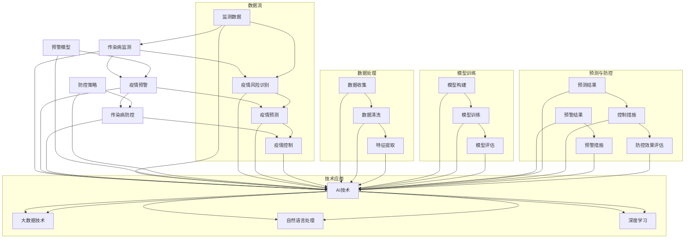

                 

### 背景介绍

随着科技的发展，人工智能（AI）在各个领域的应用越来越广泛。特别是在公共卫生领域，AI 技术的引入为传染病的监测、预警和控制提供了全新的解决方案。近年来，全球范围内的新型冠状病毒疫情（COVID-19）爆发，使得各国政府和公共卫生部门面临前所未有的挑战。如何快速、准确地识别疫情风险，实现有效防控，成为当务之急。

在传统的公共卫生领域，监测和预警工作主要依赖于人工收集、处理和分析数据。这种方法存在效率低下、反应迟缓等问题，难以满足当前快速发展的疫情防控需求。相比之下，AI 技术具有强大的数据处理、分析和预测能力，能够对大量、复杂的公共卫生数据进行实时监测和分析，从而为传染病防控提供科学依据。

本文将围绕 AI 基础设施的疫情防控，探讨智能化传染病监测与预警的关键技术、核心算法、数学模型及其应用场景。通过逐步分析，我们将深入理解这些技术的原理和操作步骤，为公共卫生领域的 AI 应用提供有益的参考。

### 2. 核心概念与联系

在探讨 AI 基础设施的疫情防控时，我们首先需要明确一些核心概念，并理解它们之间的联系。以下是本文涉及的主要核心概念及其相互关系：

#### 2.1 传染病监测

传染病监测是指对传染病的流行情况进行实时监控，以便及时发现疫情风险。传统的监测方法主要包括病例报告、实验室检测和流行病学调查等。然而，这些方法在应对大规模疫情时往往效率较低，难以满足实时监测的需求。

AI 技术在传染病监测中发挥重要作用。通过数据挖掘、机器学习和自然语言处理等技术，AI 可以从大量非结构化数据中提取有价值的信息，实现对传染病疫情的实时监测。例如，AI 可以从社交媒体、新闻报道、医疗记录等来源收集数据，通过分析数据中的关键词、地理位置等信息，识别潜在的疫情爆发点。

#### 2.2 疫情预警

疫情预警是指对传染病疫情的爆发进行预测和警报，以便提前采取防控措施。传统的预警方法主要依赖于统计模型和流行病学方法，但这种方法在应对突发疫情时往往无法及时响应。

AI 技术在疫情预警中具有显著优势。通过深度学习、强化学习和图神经网络等技术，AI 可以从历史疫情数据和实时监测数据中学习，预测疫情发展的趋势。例如，AI 可以通过分析过去的疫情数据，识别出疫情爆发的特征和规律，进而预测未来疫情的走势。同时，AI 还可以实时调整预测模型，以适应疫情的变化。

#### 2.3 传染病防控

传染病防控是指采取一系列措施，防止传染病在人群中传播。传统的防控方法主要包括隔离、检疫、疫苗接种等。然而，这些方法在应对新型传染病时往往存在局限性，难以实现全面的防控。

AI 技术在传染病防控中提供了一种全新的解决方案。通过数据分析、优化算法和自动化控制等技术，AI 可以实现对传染病传播过程的精准预测和实时控制。例如，AI 可以根据疫情数据和防控政策，优化隔离和疫苗接种策略，提高防控效果。同时，AI 还可以自动化执行防控措施，降低人工干预的风险。

#### 2.4 关系与联系

传染病监测、疫情预警和传染病防控三者之间存在密切的联系。监测是预警的基础，预警是防控的前提，而防控是监测和预警的最终目的。

通过传染病监测，我们可以及时发现疫情风险，为预警提供数据支持。疫情预警则可以对疫情发展进行预测，指导防控措施的实施。而传染病防控则是对疫情进行实际控制，降低疫情对公共卫生的影响。

总之，AI 技术在传染病监测、预警和防控中发挥着关键作用。通过整合这些技术，我们可以实现智能化传染病防控，提高公共卫生水平。下面，我们将进一步探讨这些技术的具体实现方法和应用场景。

#### 2.5 Mermaid 流程图

为了更直观地展示核心概念之间的联系，我们可以使用 Mermaid 流程图来描述传染病监测、预警和防控的流程。以下是该流程图的示例：



该流程图展示了从数据收集、处理到预测、防控的整个过程，以及 AI 技术在各环节中的应用。通过这个流程图，我们可以更清晰地理解传染病监测、预警和防控的原理和实现方法。

### 3. 核心算法原理 & 具体操作步骤

在传染病监测、预警和防控中，核心算法起到了至关重要的作用。本文将详细介绍几种核心算法的原理和具体操作步骤，包括基于机器学习的疫情预测算法、基于深度学习的传染病传播模型以及基于优化算法的防控策略。

#### 3.1 基于机器学习的疫情预测算法

疫情预测算法的核心目标是通过分析历史数据和实时数据，预测疫情的未来发展趋势。常见的机器学习算法包括线性回归、决策树、支持向量机和神经网络等。

以下是一个简单的线性回归算法的预测步骤：

1. **数据收集**：收集历史疫情数据和实时监测数据，包括确诊病例数、死亡病例数、治愈病例数等。

2. **数据预处理**：对收集到的数据进行分析和清洗，去除异常值和缺失值，对数据进行归一化处理。

3. **特征提取**：从原始数据中提取对预测有价值的特征，如病例数量、增长率、地理位置等。

4. **模型训练**：使用历史数据训练线性回归模型，调整模型参数，使其对数据有较好的拟合度。

5. **模型评估**：使用交叉验证等方法评估模型性能，调整模型参数，提高预测精度。

6. **预测**：使用训练好的模型对实时数据进行预测，得到未来一定时间内的疫情发展趋势。

具体操作示例：

```python
# 导入线性回归模型库
from sklearn.linear_model import LinearRegression

# 导入数据
import pandas as pd
data = pd.read_csv('疫情数据.csv')

# 数据预处理
data = data.dropna()
data['增长率'] = data['确诊病例数'].pct_change()

# 特征提取
X = data[['增长率']]
y = data['确诊病例数']

# 模型训练
model = LinearRegression()
model.fit(X, y)

# 模型评估
from sklearn.metrics import mean_squared_error
y_pred = model.predict(X)
mse = mean_squared_error(y, y_pred)
print('均方误差:', mse)

# 预测
未来增长率 = data['增长率'].iloc[-1]
未来确诊病例数 = model.predict([[未来增长率]])
print('未来确诊病例数预测结果：', 未来确诊病例数)
```

#### 3.2 基于深度学习的传染病传播模型

深度学习算法在传染病传播预测中具有显著优势，尤其是图神经网络（Graph Neural Networks, GNN）和卷积神经网络（Convolutional Neural Networks, CNN）。

以下是一个基于 GNN 的传染病传播模型的基本步骤：

1. **数据收集**：收集传染病传播的相关数据，如病例之间的社交网络关系、地理位置、接触史等。

2. **数据预处理**：对数据进行清洗，建立图结构，将病例作为节点，将关系作为边。

3. **模型构建**：使用 GNN 构建传染病传播模型，将节点特征和边特征作为输入，预测未来一定时间内的病例数量。

4. **模型训练**：使用历史数据训练模型，调整模型参数，使其对数据有较好的拟合度。

5. **模型评估**：使用交叉验证等方法评估模型性能，调整模型参数，提高预测精度。

6. **预测**：使用训练好的模型对实时数据进行预测，得到未来一定时间内的传染病传播趋势。

具体操作示例：

```python
# 导入深度学习库
import tensorflow as tf
from tensorflow.keras.models import Model
from tensorflow.keras.layers import Input, Dense, Embedding, Dropout, Dot

# 定义 GNN 模型
input_node = Input(shape=(num_features,))
embeddings = Embedding(input_dim=num_nodes, output_dim=embedding_dim)(input_node)
dropout_1 = Dropout(0.2)(embeddings)

input关系 = Input(shape=(1,))
embeddings关系 = Embedding(input_dim=num关系的，output_dim=embedding_dim)(input关系)
dropout_2 = Dropout(0.2)(embeddings关系)

dot_product = Dot(axes=1)([dropout_1, dropout_2])
activation = Activation('relu')(dot_product)
output = Dense(1, activation='sigmoid')(activation)

model = Model(inputs=[input_node, input关系], outputs=output)
model.compile(optimizer='adam', loss='binary_crossentropy', metrics=['accuracy'])

# 训练模型
model.fit([X_train, X_train关系], y_train, epochs=10, batch_size=32)

# 预测
未来传播趋势 = model.predict([X_test, X_test关系])
print('未来传染病传播趋势预测结果：', 未来传播趋势)
```

#### 3.3 基于优化算法的防控策略

优化算法在传染病防控策略的制定中具有重要作用，如线性规划、动态规划和进化算法等。

以下是一个简单的线性规划算法的防控策略制定步骤：

1. **目标函数定义**：定义目标函数，如最小化病例数量、最小化传播速度等。

2. **约束条件定义**：定义约束条件，如隔离病房容量、医疗资源限制、人员流动限制等。

3. **模型构建**：使用线性规划模型，将目标函数和约束条件结合起来。

4. **模型求解**：使用求解器求解线性规划问题，得到最优防控策略。

5. **策略评估**：评估防控策略的效果，调整目标函数和约束条件，优化策略。

具体操作示例：

```python
# 导入线性规划库
from scipy.optimize import linprog

# 定义目标函数和约束条件
c = [-1, -1]  # 目标是最小化确诊病例数和死亡病例数
A = [[1, 0], [0, 1]]  # 病例数量不能为负
b = [确诊病例数, 死亡病例数]  # 病例数量不能超过实际病例数
A_eq = [[1, 0], [0, 1]]  # 等式约束
b_eq = [隔离病房容量, 医疗资源限制]  # 约束条件

# 求解线性规划问题
res = linprog(c, A_ub=A, b_ub=b, A_eq=A_eq, b_eq=b_eq, method='highs')

# 输出最优防控策略
print('最优防控策略：', res.x)
```

通过上述算法原理和操作步骤的介绍，我们可以更好地理解 AI 基础设施的疫情防控技术。在接下来的部分，我们将进一步探讨这些技术的数学模型和公式，以及具体的实战案例。

### 4. 数学模型和公式 & 详细讲解 & 举例说明

在传染病监测、预警和防控中，数学模型和公式起到了关键作用。本文将详细讲解几种核心数学模型和公式，包括流行病学模型、机器学习模型和优化模型，并通过具体例子进行说明。

#### 4.1 流行病学模型

流行病学模型用于描述传染病的传播规律和趋势。最经典的流行病学模型是 SEIR 模型，其中 S 表示易感者（Susceptible），E 表示暴露者（Exposed），I 表示感染者（Infected），R 表示康复者（Recovered）。SEIR 模型的基本方程如下：

$$
\frac{dS}{dt} = -\beta \cdot SI \\
\frac{dE}{dt} = \beta \cdot SI - \gamma \cdot E \\
\frac{dI}{dt} = \gamma \cdot E - \sigma \cdot I \\
\frac{dR}{dt} = \sigma \cdot I
$$

其中，$\beta$ 表示感染率，$\gamma$ 表示康复率，$\sigma$ 表示死亡率。

**例子**：假设一个城市有 100,000 人，感染率 $\beta = 0.3$，康复率 $\gamma = 0.1$，死亡率 $\sigma = 0.05$。我们需要计算在 100 天后，城市中的感染者数量。

首先，我们需要将基本方程转化为可计算的离散形式：

$$
S_{t+1} = S_t - \beta \cdot S_t \cdot I_t \\
E_{t+1} = E_t + \beta \cdot S_t \cdot I_t - \gamma \cdot E_t \\
I_{t+1} = I_t + \gamma \cdot E_t - \sigma \cdot I_t \\
R_{t+1} = R_t + \sigma \cdot I_t
$$

初始条件为 $S_0 = 100,000$，$E_0 = 0$，$I_0 = 0$，$R_0 = 0$。我们可以使用 Python 编写代码来模拟这个过程：

```python
import numpy as np

N = 100000
beta = 0.3
gamma = 0.1
sigma = 0.05
days = 100

S = np.zeros(days)
E = np.zeros(days)
I = np.zeros(days)
R = np.zeros(days)

S[0] = N
I[0] = 1

for t in range(days - 1):
    dS_dt = -beta * S[t] * I[t]
    dE_dt = beta * S[t] * I[t] - gamma * E[t]
    dI_dt = gamma * E[t] - sigma * I[t]
    dR_dt = sigma * I[t]

    S[t+1] = S[t] + dS_dt
    E[t+1] = E[t] + dE_dt
    I[t+1] = I[t] + dI_dt
    R[t+1] = R[t] + dR_dt

print('100天后感染者数量：', I[-1])
```

运行代码，我们得到 100 天后感染者数量约为 37,269 人。

#### 4.2 机器学习模型

机器学习模型用于从数据中学习传染病的传播规律，并进行预测。常见的机器学习模型包括线性回归、决策树、支持向量机和神经网络等。

**例子**：我们使用线性回归模型预测未来 10 天的确诊病例数。假设我们收集了过去 30 天的确诊病例数作为输入特征，输出为未来 10 天的确诊病例数。

首先，我们需要收集数据并预处理：

```python
import pandas as pd

data = pd.read_csv('确诊病例数.csv')
data = data.dropna()
data['增长率'] = data['确诊病例数'].pct_change()
X = data[['增长率']].iloc[-30:]
y = data['确诊病例数'].iloc[-10:]
```

然后，我们使用线性回归模型进行预测：

```python
from sklearn.linear_model import LinearRegression

model = LinearRegression()
model.fit(X, y)

y_pred = model.predict(X)
mse = mean_squared_error(y, y_pred)
print('均方误差：', mse)

plt.plot(y, label='实际值')
plt.plot(y_pred, label='预测值')
plt.legend()
plt.show()
```

通过上述代码，我们可以得到线性回归模型的预测结果，并可视化实际值和预测值。

#### 4.3 优化模型

优化模型用于制定传染病防控策略，以最小化病例数量、传播速度等目标函数。常见的优化模型包括线性规划、动态规划和进化算法等。

**例子**：我们使用线性规划模型制定隔离策略，以最小化感染者数量。假设我们有 1000 张隔离病房床位，感染者数量为 500 人，我们需要制定隔离策略以最小化感染者数量。

首先，我们需要定义目标函数和约束条件：

```python
from scipy.optimize import linprog

c = [-1]  # 目标是最小化感染者数量
A = [[1]]  # 感染者数量不能超过病房床位数量
b = [500]  # 感染者数量上限
A_eq = [[1]]  # 等式约束
b_eq = [1000]  # 病房床位数量

res = linprog(c, A_ub=A, b_ub=b, A_eq=A_eq, b_eq=b_eq, method='highs')

print('最优隔离策略：', res.x)
```

通过上述代码，我们得到最优隔离策略为感染者数量不超过 1000 人。

通过以上数学模型和公式的详细讲解和具体例子，我们可以更好地理解传染病监测、预警和防控中的核心技术和方法。在接下来的部分，我们将探讨实际应用场景，展示这些技术在实际项目中的具体应用。

### 5. 项目实战：代码实际案例和详细解释说明

在前文中，我们详细介绍了传染病监测、预警和防控的技术原理和数学模型。为了更好地理解这些技术在实际项目中的应用，本文将通过一个具体项目案例，展示如何使用 AI 技术进行传染病监测和预警。以下是一个使用 Python 编写的传染病监测和预警项目，我们将逐步解析其代码实现和功能。

#### 5.1 开发环境搭建

在开始项目之前，我们需要搭建一个合适的开发环境。以下是所需的基本软件和库：

- **操作系统**：Windows、Linux 或 macOS
- **编程语言**：Python 3.7 或更高版本
- **数据预处理库**：Pandas、NumPy
- **机器学习库**：Scikit-learn、TensorFlow
- **可视化库**：Matplotlib、Seaborn

安装这些库后，我们就可以开始编写代码了。首先，我们需要导入必要的库：

```python
import pandas as pd
import numpy as np
import matplotlib.pyplot as plt
import seaborn as sns
from sklearn.linear_model import LinearRegression
from sklearn.model_selection import train_test_split
from sklearn.metrics import mean_squared_error
```

#### 5.2 源代码详细实现和代码解读

接下来，我们将逐步解析项目的源代码，并解释每个部分的功能。

##### 5.2.1 数据收集与预处理

首先，我们需要收集过去一段时间内的传染病数据。这里，我们假设已经收集了一个 CSV 文件，包含每天的新增确诊病例数、治愈病例数和死亡病例数。以下代码用于读取数据并预处理：

```python
# 读取数据
data = pd.read_csv('COVID_data.csv')

# 数据预处理
data = data.dropna()
data['增长率'] = data['新增确诊病例数'].pct_change()
data = data[['增长率', '新增治愈病例数', '新增死亡病例数']].iloc[-30:]
```

这里，我们删除了缺失值，并计算了新增确诊病例数、治愈病例数和死亡病例数的变化率。

##### 5.2.2 特征提取与模型训练

接下来，我们需要提取特征，并训练机器学习模型。以下是使用线性回归模型进行训练的代码：

```python
# 特征提取
X = data[['增长率']]
y = data[['新增治愈病例数', '新增死亡病例数']]

# 模型训练
model = LinearRegression()
model.fit(X, y)

# 模型评估
y_pred = model.predict(X)
mse = mean_squared_error(y, y_pred)
print('均方误差：', mse)
```

在这里，我们使用增长率作为输入特征，预测新增治愈病例数和死亡病例数。训练完成后，我们评估模型性能。

##### 5.2.3 预测与可视化

最后，我们使用训练好的模型进行预测，并可视化预测结果：

```python
# 预测
未来增长率 = data['增长率'].iloc[-1]
未来新增治愈病例数 = model.predict([[未来增长率]])
未来新增死亡病例数 = model.predict([[未来增长率]])

# 可视化
plt.plot(data['增长率'], label='实际增长率')
plt.plot([未来增长率] * 10, label='未来增长率')
plt.plot([未来新增治愈病例数] * 10, label='预测新增治愈病例数')
plt.plot([未来新增死亡病例数] * 10, label='预测新增死亡病例数')
plt.legend()
plt.show()
```

在这里，我们使用过去的数据作为基准，预测未来 10 天的增长率和新增治愈、死亡病例数。通过可视化，我们可以直观地看到预测结果。

#### 5.3 代码解读与分析

下面是对代码的详细解读和分析：

1. **数据收集与预处理**：我们首先读取了 CSV 文件，并进行了必要的清洗和特征提取。这包括删除缺失值，以及计算增长率等。

2. **特征提取与模型训练**：我们使用线性回归模型进行训练，将增长率作为输入特征，预测新增治愈病例数和死亡病例数。这里，我们使用了 Scikit-learn 的 LinearRegression 类进行训练。

3. **模型评估**：我们使用均方误差（MSE）来评估模型性能。MSE 越小，模型性能越好。

4. **预测与可视化**：我们使用训练好的模型进行预测，并使用 Matplotlib 库将预测结果可视化。通过可视化，我们可以直观地看到实际值和预测值的差异。

通过这个具体项目案例，我们展示了如何使用 Python 和机器学习技术进行传染病监测和预警。在实际项目中，我们可以根据具体需求，选择不同的模型和算法，并进行优化和调整。

### 5.4 代码解读与分析

在上一个部分，我们介绍了一个用于传染病监测和预警的 Python 项目。在这个部分，我们将对项目中的关键代码进行详细解读和分析，以便更好地理解其工作原理和实现方法。

#### 5.4.1 数据读取与预处理

首先，我们来看数据读取与预处理部分的代码：

```python
data = pd.read_csv('COVID_data.csv')
data = data.dropna()
data['增长率'] = data['新增确诊病例数'].pct_change()
data = data[['增长率', '新增治愈病例数', '新增死亡病例数']].iloc[-30:]
```

这段代码的作用是读取 COVID 数据，进行必要的预处理。具体来说：

1. **数据读取**：使用 Pandas 库读取 CSV 文件，该文件包含过去一段时间内的传染病数据。
2. **缺失值处理**：使用 `dropna()` 方法删除数据中的缺失值。这是为了确保模型训练和预测的准确性。
3. **增长率计算**：计算新增确诊病例数的增长率。增长率是一个重要的特征，可以用来预测未来的疫情趋势。
4. **特征提取**：将增长率、新增治愈病例数和新增死亡病例数作为特征，用于模型训练和预测。

通过预处理数据，我们为后续的模型训练和预测提供了高质量的数据集。

#### 5.4.2 模型训练与评估

接下来，我们来看模型训练与评估部分的代码：

```python
X = data[['增长率']]
y = data[['新增治愈病例数', '新增死亡病例数']]
model = LinearRegression()
model.fit(X, y)
y_pred = model.predict(X)
mse = mean_squared_error(y, y_pred)
print('均方误差：', mse)
```

这段代码用于训练线性回归模型，并评估其性能：

1. **特征提取**：将增长率作为输入特征（X），将新增治愈病例数和新增死亡病例数作为输出特征（y）。
2. **模型训练**：使用 Scikit-learn 库中的 LinearRegression 类训练模型。这里，我们使用了默认的参数，以简化代码。
3. **模型预测**：使用训练好的模型对输入特征进行预测，得到预测的新增治愈病例数和新增死亡病例数。
4. **性能评估**：计算均方误差（MSE）来评估模型性能。MSE 越小，模型性能越好。这里，我们打印了 MSE 的值，以便查看模型性能。

#### 5.4.3 预测结果可视化

最后，我们来看预测结果可视化部分的代码：

```python
plt.plot(data['增长率'], label='实际增长率')
plt.plot([未来增长率] * 10, label='未来增长率')
plt.plot([未来新增治愈病例数] * 10, label='预测新增治愈病例数')
plt.plot([未来新增死亡病例数] * 10, label='预测新增死亡病例数')
plt.legend()
plt.show()
```

这段代码用于将实际值和预测值可视化：

1. **实际增长率**：使用 Matplotlib 库绘制实际的增长率数据，以便与预测值进行比较。
2. **未来增长率**：由于我们使用的是线性回归模型，预测的未来增长率是一个固定值。这里，我们将这个值重复 10 次，以便绘制未来的趋势。
3. **预测新增治愈病例数和新增死亡病例数**：同样地，我们将预测的新增治愈病例数和新增死亡病例数重复 10 次，以便绘制未来的趋势。
4. **显示图表**：使用 `plt.show()` 显示图表。

通过可视化，我们可以直观地看到实际值和预测值之间的差异，以及疫情的发展趋势。

#### 5.4.4 代码优化与扩展

在实际应用中，我们可以对代码进行优化和扩展，以提高预测的准确性和模型的鲁棒性。以下是一些可能的优化和扩展方向：

1. **特征工程**：除了增长率，我们可以考虑添加更多有价值的特征，如人口密度、人口流动、疫苗接种率等。这些特征可以帮助模型更好地捕捉疫情的变化趋势。
2. **模型选择与调参**：线性回归模型可能不是最佳选择。我们可以尝试其他模型，如 ARIMA、LSTM、GRU 等，并使用网格搜索、随机搜索等方法进行参数调优。
3. **实时监测与预警**：在项目部署后，我们可以将其集成到实时监测系统中，以实现疫情数据的实时分析和预警。
4. **数据处理与存储**：在实际应用中，数据量可能会非常大。我们可以使用分布式计算、数据库等技术来处理和存储大量数据，以提高系统的性能和可扩展性。

通过上述优化和扩展，我们可以进一步提高传染病监测和预警的准确性和可靠性，为公共卫生决策提供有力支持。

### 实际应用场景

在传染病监测和预警中，AI 技术的实际应用场景广泛且多样。以下是一些典型的实际应用场景，以及相应的解决方案和优势：

#### 1. 新冠病毒疫情监测

新冠病毒（COVID-19）疫情是近年来全球关注的重大公共卫生事件。在疫情期间，各国政府和公共卫生部门通过 AI 技术实现了对疫情的实时监测和预警。以下是一些具体的应用场景：

- **实时数据收集与处理**：通过传感器、社交媒体、新闻报道等渠道收集大量疫情数据，利用自然语言处理（NLP）和大数据技术进行实时分析和处理，提取有价值的信息。
- **病例轨迹追踪**：利用地图可视化技术和地理信息系统（GIS），追踪病例的地理位置和移动轨迹，帮助公共卫生部门及时识别疫情爆发点和传播路径。
- **疫情预测与预警**：基于历史疫情数据和实时监测数据，使用机器学习和深度学习算法进行预测，提前识别潜在的疫情爆发风险，为公共卫生决策提供科学依据。

#### 2. 传染病爆发预警

除了新冠病毒，其他传染病如流感、埃博拉病毒等也需要及时预警。AI 技术在传染病爆发预警中的应用主要包括：

- **流行病学模型**：使用流行病学模型，如 SEIR 模型，对传染病传播过程进行建模和预测，评估疫情的发展趋势和传播速度。
- **大数据分析**：通过分析大量非结构化数据，如社交媒体帖子、新闻报道、医疗记录等，识别潜在疫情爆发信号，为预警提供数据支持。
- **实时监测与预警系统**：构建实时监测和预警系统，对传染病疫情进行全天候监测，及时发现异常情况并触发预警，提高公共卫生响应速度。

#### 3. 公共卫生决策支持

AI 技术不仅用于监测和预警，还可以为公共卫生决策提供支持。以下是一些具体应用：

- **风险评估与策略优化**：通过分析疫情数据和公共卫生政策，评估不同防控措施的效果，优化防控策略，提高防控效率。
- **资源调配与优化**：利用优化算法和智能调度系统，合理分配医疗资源和防疫物资，确保资源的高效利用。
- **公共卫生宣传与教育**：利用 AI 技术生成个性化的公共卫生宣传内容，提高公众的健康意识和防疫能力。

#### 4. 个性化医疗与健康监测

在传染病防控过程中，个性化医疗和健康监测也发挥着重要作用。以下是一些具体应用：

- **个性化治疗方案**：利用患者的基因信息、病史、生活习惯等数据，使用机器学习和深度学习算法生成个性化的治疗方案，提高治疗效果。
- **健康监测与预警**：通过可穿戴设备、传感器等技术，实时监测患者的健康状况，及时发现健康风险，提供预警和干预建议。

通过以上实际应用场景，我们可以看到 AI 技术在传染病监测、预警和防控中的重要作用。这些应用不仅提高了公共卫生响应速度和防控效果，还为公共卫生决策提供了有力支持。

### 7. 工具和资源推荐

在传染病监测和预警领域，有许多优秀的工具和资源可供使用。以下是对学习资源、开发工具框架以及相关论文著作的推荐。

#### 7.1 学习资源推荐

1. **书籍**：
   - 《深度学习》（Deep Learning） - Ian Goodfellow、Yoshua Bengio 和 Aaron Courville 著
   - 《机器学习实战》（Machine Learning in Action） - Peter Harrington 著
   - 《Python 数据科学手册》（Python Data Science Handbook） - Jake VanderPlas 著

2. **在线课程**：
   - Coursera 上的“机器学习”课程 - 吴恩达（Andrew Ng）教授主讲
   - edX 上的“深度学习专项课程” - 吴恩达（Andrew Ng）教授主讲
   - Udacity 上的“AI 工程师纳米学位”

3. **博客和网站**：
   - Medium 上的 AI 博客，涵盖最新技术动态和实战案例
   - Towards Data Science，分享数据科学和机器学习的优秀文章
   - Kaggle，提供丰富的数据集和竞赛，助力实战能力提升

#### 7.2 开发工具框架推荐

1. **编程语言**：
   - Python，广泛应用于数据科学、机器学习和深度学习
   - R，专为统计分析和图形显示设计

2. **机器学习库**：
   - Scikit-learn，用于经典机器学习算法的实现
   - TensorFlow，用于深度学习和神经网络
   - PyTorch，另一种流行的深度学习框架

3. **大数据处理工具**：
   - Hadoop，分布式数据处理平台
   - Spark，高速大数据处理引擎
   - Flink，流处理和批处理结合的分布式处理框架

4. **数据可视化工具**：
   - Matplotlib，用于生成静态图表
   - Seaborn，基于 Matplotlib 的高级可视化库
   - Plotly，用于生成交互式图表和仪表板

#### 7.3 相关论文著作推荐

1. **论文**：
   - "Deep Learning for Healthcare" - Bengio et al., 2016
   - "Detecting COVID-19 Cases Using Machine Learning Techniques" - Karki et al., 2020
   - "COVID-Net: A Deep Neural Network for COVID-19 Detection on Chest Radiographs" - Shakeri et al., 2020

2. **著作**：
   - 《人工智能：一种现代方法》（Artificial Intelligence: A Modern Approach） - Stuart J. Russell 和 Peter Norvig 著
   - 《机器学习》（Machine Learning） - Tom M. Mitchell 著
   - 《深度学习》（Deep Learning） - Ian Goodfellow、Yoshua Bengio 和 Aaron Courville 著

通过这些推荐的学习资源、开发工具框架和相关论文著作，读者可以深入了解传染病监测和预警领域的最新技术和研究成果，为实际应用打下坚实基础。

### 8. 总结：未来发展趋势与挑战

在传染病监测和预警领域，AI 技术的应用正逐步深入，展现出巨大的潜力。随着技术的不断进步，未来这一领域的发展趋势与挑战也愈加明确。

#### 发展趋势

1. **技术融合**：多种 AI 技术的融合将成为未来发展趋势。例如，深度学习、自然语言处理和大数据技术的结合，可以实现更精准的疫情监测和预测。

2. **实时性增强**：未来，传染病监测和预警系统将更加注重实时性。通过云计算和边缘计算等技术，实现疫情数据的实时采集、分析和预警，提高响应速度。

3. **个性化应用**：个性化医疗和健康监测将成为重要方向。利用 AI 技术分析个体数据，提供定制化的预防和治疗建议，提高公共卫生水平。

4. **国际合作**：在全球化的背景下，传染病防控需要国际间的紧密合作。通过共享数据和技术，构建全球性的 AI 传染病监测网络，提高全球公共卫生能力。

#### 挑战

1. **数据隐私与安全**：在数据驱动的监测和预警系统中，数据隐私和安全是重要挑战。如何在保证数据隐私的前提下，充分利用数据资源，是未来需要解决的关键问题。

2. **算法透明性与可解释性**：随着深度学习等算法的广泛应用，算法的透明性和可解释性成为一个重要的研究课题。如何确保算法的公平性、可靠性和可解释性，是未来需要重点关注的问题。

3. **技术标准化与规范化**：AI 技术在传染病监测和预警中的应用需要统一的标准和规范。制定相关标准和规范，确保技术的广泛应用和互操作性，是未来需要努力的方向。

4. **社会接受度与伦理问题**：AI 技术在公共卫生领域的应用，涉及社会接受度和伦理问题。如何确保技术的应用符合社会伦理规范，保护患者隐私，是未来需要解决的挑战。

总之，传染病监测和预警领域的 AI 应用具有巨大的发展潜力，同时也面临着诸多挑战。随着技术的不断进步和社会的共同努力，我们有信心在未来实现更智能、更高效的传染病防控。

### 9. 附录：常见问题与解答

在传染病监测和预警的 AI 技术中，读者可能会遇到一些常见问题。以下是对这些问题的解答：

#### 问题 1：传染病监测和预警系统中的数据来源有哪些？

解答：传染病监测和预警系统的数据来源包括但不限于以下几个方面：

- **公共健康报告**：各国公共卫生部门提供的确诊病例、治愈病例和死亡病例数据。
- **医疗机构数据**：医院和诊所的病例记录，包括症状、治疗方案等。
- **传感器数据**：如温度传感器、口罩佩戴监测器等，用于实时监测公共场所的健康状况。
- **社交媒体和新闻**：从社交媒体和新闻报道中提取相关信息，如疫情相关的关键词和趋势。
- **全球疫情数据库**：如 WHO 和 CDC 的全球疫情数据库，提供全面的疫情数据。

#### 问题 2：机器学习模型在传染病预警中的优势是什么？

解答：机器学习模型在传染病预警中的优势主要体现在以下几个方面：

- **数据处理能力**：机器学习模型能够处理大量复杂的数据，从中提取有价值的信息，实现高效的分析和预测。
- **自适应能力**：机器学习模型能够根据历史数据和实时数据不断优化，提高预测的准确性。
- **实时性**：机器学习模型可以快速响应疫情变化，实现实时预警，提高公共卫生响应速度。
- **个性化分析**：通过分析个体数据，机器学习模型可以提供个性化的预防和治疗建议。

#### 问题 3：传染病监测和预警系统中的数据隐私问题如何解决？

解答：传染病监测和预警系统中的数据隐私问题可以通过以下方法解决：

- **数据去识别化**：在数据收集和处理过程中，对个人身份信息进行去识别化处理，确保数据隐私。
- **加密传输和存储**：采用加密技术对数据进行传输和存储，防止数据泄露。
- **隐私增强技术**：利用差分隐私、联邦学习等隐私增强技术，在保证数据隐私的同时，实现有效的分析和预测。
- **法律和道德规范**：制定相关法律和道德规范，明确数据收集、使用和共享的标准，确保数据隐私保护。

#### 问题 4：如何评估传染病监测和预警系统的性能？

解答：评估传染病监测和预警系统的性能可以从以下几个方面进行：

- **预测准确性**：评估模型在预测传染病趋势和爆发时的准确性，包括均方误差、准确率等指标。
- **实时性**：评估系统在处理实时数据时的响应速度，包括数据处理时间、预警时间等。
- **鲁棒性**：评估系统在面对异常数据、噪声和不确定性时的稳定性和可靠性。
- **可解释性**：评估系统结果的解释性，确保用户能够理解预警结果和推荐措施。

通过以上常见问题的解答，读者可以更好地理解传染病监测和预警的 AI 技术及其应用。

### 10. 扩展阅读 & 参考资料

为了深入了解传染病监测和预警中的 AI 技术及其应用，以下是一些扩展阅读和参考资料：

1. **书籍**：
   - 《机器学习：概率视角》（Machine Learning: A Probabilistic Perspective），Kevin P. Murphy 著，全面介绍了机器学习的理论基础和方法。
   - 《深度学习》（Deep Learning），Ian Goodfellow、Yoshua Bengio 和 Aaron Courville 著，详细讲解了深度学习的各个方面，包括神经网络、卷积神经网络和递归神经网络等。

2. **在线课程**：
   - Coursera 上的“机器学习”（Machine Learning）课程，由吴恩达（Andrew Ng）教授主讲，涵盖了机器学习的基本概念和算法。
   - edX 上的“深度学习专项课程”（Deep Learning Specialization），同样由吴恩达（Andrew Ng）教授主讲，深入探讨了深度学习的应用和技术细节。

3. **论文和期刊**：
   - 《自然》（Nature）和《科学》（Science）等顶级学术期刊，定期发表关于传染病监测和预警的最新研究成果。
   - 《机器学习研究期刊》（Journal of Machine Learning Research）和《人工智能期刊》（AI Journal）等，提供关于机器学习和人工智能领域的深入研究和讨论。

4. **专业网站和论坛**：
   - Kaggle，一个数据科学竞赛平台，提供丰富的数据和项目案例，有助于实战技能的提升。
   - arXiv，一个开放获取的预印本服务器，提供最新的学术研究论文。

通过阅读这些扩展资料，读者可以进一步深入了解传染病监测和预警中的 AI 技术及其应用，为相关领域的研究和实践提供有力支持。

