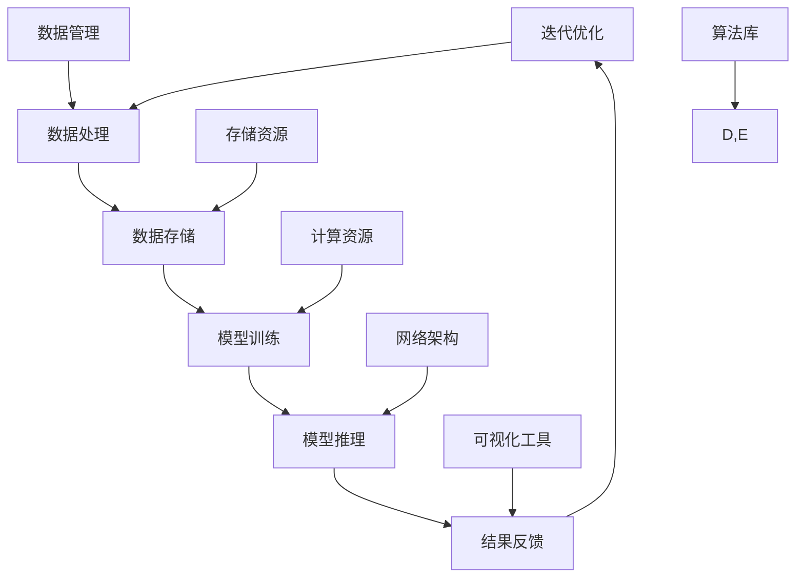
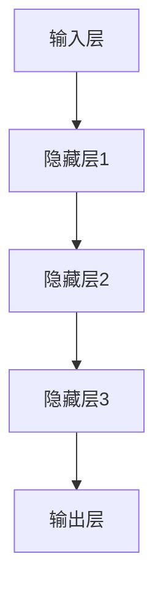

                 

### 1. 背景介绍

#### 1.1 目的和范围

本文旨在深入探讨AI基础设施领域中的职业规划问题，特别是智能化职业匹配与发展的方向。随着人工智能技术的飞速发展，AI基础设施已成为各个行业创新和发展的核心驱动力。在这个背景下，如何为从业者和企业制定合理的职业规划，以及如何通过智能化技术实现更高效的职业匹配，成为亟待解决的问题。

本文将首先介绍AI基础设施的基本概念和发展历程，接着分析当前行业趋势和需求，探讨智能化职业匹配的方法和工具。随后，我们将通过具体的案例，展示AI基础设施在职业规划中的应用场景。此外，文章还将推荐相关的学习资源、开发工具和经典论文，以供读者参考。

#### 1.2 预期读者

本文主要面向以下几类读者：
1. **人工智能从业者**：正在从事AI相关工作，希望了解职业规划趋势和智能化匹配技术的人员。
2. **IT行业从业者**：对AI基础设施有一定了解，希望进一步深入研究和应用的人员。
3. **企业招聘与培训部门**：负责招聘和培训工作，希望利用AI技术优化人才匹配和管理的人员。
4. **高校学生**：对AI和IT领域感兴趣，希望了解未来职业发展方向和市场需求的学生。

#### 1.3 文档结构概述

为了帮助读者更好地理解和应用本文的内容，本文将按照以下结构进行组织：

1. **背景介绍**：介绍AI基础设施的职业规划背景、目的和预期读者。
2. **核心概念与联系**：通过Mermaid流程图展示核心概念和架构。
3. **核心算法原理 & 具体操作步骤**：使用伪代码详细阐述核心算法原理和操作步骤。
4. **数学模型和公式 & 详细讲解 & 举例说明**：使用LaTeX格式介绍数学模型和公式，并举例说明。
5. **项目实战：代码实际案例和详细解释说明**：展示代码实际案例，并进行详细解释和分析。
6. **实际应用场景**：分析AI基础设施在职业规划中的应用场景。
7. **工具和资源推荐**：推荐学习资源、开发工具和经典论文。
8. **总结：未来发展趋势与挑战**：总结未来发展趋势和面临的主要挑战。
9. **附录：常见问题与解答**：解答读者可能遇到的问题。
10. **扩展阅读 & 参考资料**：提供更多的扩展阅读和参考资料。

通过这种结构化的组织，本文将帮助读者逐步深入理解AI基础设施的职业规划，并提供实用的方法和建议。

#### 1.4 术语表

为了确保读者能够准确理解本文的内容，以下是对一些关键术语的定义和解释：

#### 1.4.1 核心术语定义

- **AI基础设施**：指支持人工智能模型部署、运行和管理的基础设施，包括计算资源、存储资源、数据管理、模型训练和推理工具等。
- **智能化职业匹配**：利用人工智能技术，对从业者的技能、经验和职业需求进行精准匹配，以提高职业发展的效率和效果。
- **算法**：解决问题的步骤和方法，通常用计算机语言实现。
- **数据集**：用于训练、评估和测试算法的数据集合。

#### 1.4.2 相关概念解释

- **深度学习**：一种基于人工神经网络的学习方法，通过多层神经网络的训练，实现对复杂数据模式的识别和预测。
- **机器学习**：通过算法和统计模型，从数据中学习规律，并进行预测和决策。
- **神经网络**：一种由大量神经元组成的计算模型，能够通过学习数据自动提取特征，进行复杂的数据处理。

#### 1.4.3 缩略词列表

- **AI**：人工智能（Artificial Intelligence）
- **ML**：机器学习（Machine Learning）
- **DL**：深度学习（Deep Learning）
- **GPU**：图形处理单元（Graphics Processing Unit）
- **IDE**：集成开发环境（Integrated Development Environment）

通过上述术语和概念的介绍，读者可以对本文的关键内容有一个初步的了解，为后续内容的深入讨论打下基础。接下来，我们将通过一个Mermaid流程图来展示AI基础设施的核心概念和架构，帮助读者更好地把握整体框架。

### 2. 核心概念与联系

在深入探讨AI基础设施的职业规划之前，首先需要理解AI基础设施的核心概念和架构。以下是一个简化的Mermaid流程图，展示了AI基础设施中的关键组成部分及其相互关系。



这个流程图包括了以下核心组成部分：

- **数据收集（A）**：数据是AI基础设施的基础，数据的来源可以是传感器、数据库、互联网等。数据的质量和多样性直接影响模型的性能。
- **数据处理（B）**：在数据收集后，需要对数据进行清洗、预处理和特征提取，以便用于模型训练。
- **数据存储（C）**：处理后的数据需要存储在可靠的存储系统上，如关系型数据库、NoSQL数据库、分布式文件系统等。
- **模型训练（D）**：使用处理后的数据来训练模型，深度学习、机器学习算法在这个过程中起到关键作用。
- **模型推理（E）**：训练好的模型可以在实际场景中进行推理，生成预测结果或决策。
- **结果反馈（F）**：模型的输出结果需要进行评估和反馈，以不断优化模型性能。
- **迭代优化（A->F）**：根据反馈结果，对数据收集、处理、存储等环节进行迭代优化，形成一个闭环系统。

此外，以下组成部分也是AI基础设施的重要组成部分：

- **计算资源（G）**：包括GPU、CPU等硬件资源，用于加速模型训练和推理。
- **存储资源（H）**：包括HDD、SSD、分布式存储等，用于存储大量数据和处理后的数据。
- **数据管理（I）**：包括数据备份、安全、权限管理等，确保数据的可靠性和安全性。
- **网络架构（J）**：包括局域网、广域网、云计算等，用于数据传输和模型部署。
- **算法库（K）**：包括预训练模型、常用算法等，为模型训练和推理提供丰富的工具。
- **可视化工具（L）**：包括数据可视化、模型可视化等，帮助用户更好地理解和分析数据。

通过这个Mermaid流程图，我们可以清晰地看到AI基础设施的各个组成部分及其相互作用。接下来，我们将进一步深入探讨这些核心概念和架构的原理和操作步骤。

### 3. 核心算法原理 & 具体操作步骤

在AI基础设施中，核心算法是模型训练和推理的核心。以下将详细介绍深度学习（Deep Learning）算法的基本原理和具体操作步骤。深度学习算法通过多层神经网络，对输入数据进行特征提取和模式识别，从而实现复杂的任务。

#### 3.1 深度学习算法原理

深度学习算法基于多层神经网络，其核心思想是通过神经网络的学习能力，从大量数据中自动提取有用的特征。以下是一个简化的多层神经网络结构：



- **输入层（A）**：接收输入数据，如图像、文本或数值数据。
- **隐藏层**：用于提取和处理数据特征，通常包含多层。每一层都会对输入数据进行处理，并传递给下一层。
- **输出层（E）**：输出模型预测结果，如分类结果或回归值。

在神经网络中，每个节点（或神经元）都通过权重（weight）和偏置（bias）与相邻层连接。通过反向传播算法（Backpropagation），神经网络可以不断调整这些权重和偏置，以优化模型的性能。

#### 3.2 具体操作步骤

以下是用伪代码表示的深度学习算法的基本操作步骤：

```plaintext
初始化神经网络参数（权重和偏置）
循环（每个epoch）：
    对于每个训练样本：
        前向传播：
            计算输入层到隐藏层的输出
            计算隐藏层到输出层的输出
        计算损失函数值（如交叉熵损失）
        反向传播：
            计算输出层到隐藏层的梯度
            计算隐藏层到输入层的梯度
        更新神经网络参数
    计算验证集上的损失函数值，评估模型性能
```

具体操作步骤如下：

1. **初始化参数**：随机初始化神经网络中的权重和偏置。
2. **前向传播**：
    - **输入层到隐藏层**：将输入数据传递到隐藏层，通过激活函数（如ReLU、Sigmoid、Tanh）处理，得到中间结果。
    - **隐藏层到输出层**：将隐藏层的结果传递到输出层，得到最终的预测结果。
3. **计算损失函数**：计算预测结果和真实标签之间的差异，得到损失函数值（如交叉熵损失、均方误差等）。
4. **反向传播**：计算损失函数关于神经网络参数的梯度，通过反向传播算法，将梯度传递回隐藏层和输入层。
5. **更新参数**：使用梯度下降（Gradient Descent）或其他优化算法，更新神经网络中的权重和偏置。
6. **评估模型**：在验证集上计算损失函数值，评估模型的性能，并根据性能调整模型参数。

通过这些操作步骤，神经网络可以不断学习和优化，以实现对输入数据的准确预测。

#### 3.3 示例

以下是一个简单的示例，说明如何使用伪代码实现一个简单的多层感知机（MLP）模型：

```plaintext
# 初始化参数
W1 = 随机初始化（形状：[输入维度，隐藏层维度]）
W2 = 随机初始化（形状：[隐藏层维度，输出层维度]）
b1 = 随机初始化（形状：[隐藏层维度]）
b2 = 随机初始化（形状：[输出层维度]）

# 前向传播
z1 = X * W1 + b1
a1 = 激活函数（z1）
z2 = a1 * W2 + b2
a2 = 激活函数（z2）

# 计算损失函数
loss = 损失函数（a2, y）

# 反向传播
dz2 = d激活函数（a2） * (a2 - y)
dz1 = d激活函数（a1） * (a1 * W2.T * dz2)

# 更新参数
W2 = W2 - 学习率 * (a1.T * dz2)
W1 = W1 - 学习率 * (X.T * dz1)
b2 = b2 - 学习率 * dz2
b1 = b1 - 学习率 * dz1
```

在这个示例中，我们使用简单的多层感知机模型，通过前向传播和反向传播算法，实现对输入数据的分类。

通过以上对深度学习算法原理和具体操作步骤的详细讲解，读者可以更好地理解AI基础设施中的核心算法，并为后续的内容打下基础。接下来，我们将介绍数学模型和公式，以及它们的详细讲解和举例说明。

### 4. 数学模型和公式 & 详细讲解 & 举例说明

在深度学习算法中，数学模型和公式起着至关重要的作用。以下将详细讲解神经网络中常用的数学模型和公式，包括损失函数、优化算法和激活函数，并通过具体示例来说明它们的应用。

#### 4.1 损失函数

损失函数是评估模型预测结果与真实标签之间差异的关键工具。常用的损失函数包括均方误差（MSE）、交叉熵损失（Cross-Entropy Loss）等。

1. **均方误差（MSE）**

   均方误差用于回归问题，计算预测值与真实值之间的平均平方误差。

   $$MSE = \frac{1}{n}\sum_{i=1}^{n}(y_i - \hat{y}_i)^2$$

   其中，$y_i$ 为真实值，$\hat{y}_i$ 为预测值，$n$ 为样本数量。

2. **交叉熵损失（Cross-Entropy Loss）**

   交叉熵损失用于分类问题，计算实际分布与预测分布之间的差异。

   $$Cross-Entropy Loss = -\frac{1}{n}\sum_{i=1}^{n}y_i\log(\hat{y}_i)$$

   其中，$y_i$ 为真实标签，$\hat{y}_i$ 为预测概率。

#### 4.2 优化算法

优化算法用于调整神经网络中的参数，以最小化损失函数。常用的优化算法包括梯度下降（Gradient Descent）、动量优化（Momentum）、RMSprop、Adam等。

1. **梯度下降（Gradient Descent）**

   梯度下降是一种简单但有效的优化算法，通过计算损失函数关于参数的梯度，并沿着梯度方向更新参数。

   $$\theta = \theta - \alpha \cdot \nabla_{\theta} J(\theta)$$

   其中，$\theta$ 为参数，$\alpha$ 为学习率，$J(\theta)$ 为损失函数。

2. **动量优化（Momentum）**

   动量优化通过引入动量项，加速参数更新，避免在平坦区域陷入局部最小值。

   $$v_t = \beta v_{t-1} + (1 - \beta) \nabla_{\theta} J(\theta)$$
   $$\theta_t = \theta_t - \alpha \cdot v_t$$

   其中，$v_t$ 为动量项，$\beta$ 为动量系数。

3. **RMSprop**

   RMSprop 是一种基于梯度的平方和的优化算法，通过调整学习率，避免在噪声较大的区域过快或过慢地更新参数。

   $$\rho_t = \beta \rho_{t-1} + (1 - \beta) \sum_{i=1}^{n} (\nabla_{\theta} J(\theta_i))^2$$
   $$\theta_t = \theta_t - \alpha \cdot \frac{\nabla_{\theta} J(\theta)}{\sqrt{\rho_t + \epsilon}}$$

   其中，$\rho_t$ 为梯度平方和，$\epsilon$ 为一个很小的常数。

4. **Adam**

   Adam 是一种结合了动量和RMSprop优点的优化算法，通过计算一阶矩估计（均值）和二阶矩估计（方差），自适应调整学习率。

   $$m_t = \beta_1 m_{t-1} + (1 - \beta_1) \nabla_{\theta} J(\theta)$$
   $$v_t = \beta_2 v_{t-1} + (1 - \beta_2) (\nabla_{\theta} J(\theta))^2$$
   $$\theta_t = \theta_t - \alpha \cdot \frac{m_t}{\sqrt{v_t + \epsilon}}$$

   其中，$m_t$ 和 $v_t$ 分别为一阶矩估计和二阶矩估计，$\beta_1$ 和 $\beta_2$ 为超参数。

#### 4.3 激活函数

激活函数用于引入非线性，使神经网络具有更强大的表达能力。常见的激活函数包括ReLU、Sigmoid、Tanh等。

1. **ReLU（Rectified Linear Unit）**

   $$ReLU(x) = \max(0, x)$$

   ReLU 函数在$x \leq 0$时输出0，在$x > 0$时输出$x$，具有简单和计算效率高的特点。

2. **Sigmoid**

   $$Sigmoid(x) = \frac{1}{1 + e^{-x}}$$

   Sigmoid 函数将输入映射到（0, 1）区间，常用于二分类问题。

3. **Tanh**

   $$Tanh(x) = \frac{e^x - e^{-x}}{e^x + e^{-x}}$$

   Tanh 函数具有相似的输出范围，但相对于 Sigmoid 函数，它的输出分布更加对称。

#### 4.4 示例

以下是一个使用Python实现的简单神经网络模型，包括前向传播和反向传播的示例：

```python
import numpy as np

def forwardprop(X, W1, b1, W2, b2, activation='ReLU'):
    z1 = X.dot(W1) + b1
    if activation == 'ReLU':
        a1 = np.maximum(0, z1)
    elif activation == 'Sigmoid':
        a1 = 1 / (1 + np.exp(-z1))
    z2 = a1.dot(W2) + b2
    a2 = 1 / (1 + np.exp(-z2))
    return a1, a2, z1, z2

def backwardprop(a2, y, a1, z1, W2, activation='ReLU'):
    dz2 = a2 - y
    dW2 = a1.T.dot(dz2)
    db2 = dz2
    dz1 = dz2.dot(W2.T)
    if activation == 'ReLU':
        d激活函数 = (z1 > 0)
    elif activation == 'Sigmoid':
        d激活函数 = a1 * (1 - a1)
    dW1 = X.T.dot(dz1 * d激活函数)
    db1 = dz1 * d激活函数
    return dW1, dW2, db1, db2

# 初始化参数
X = np.random.rand(100, 10)  # 输入数据
y = np.random.rand(100, 1)   # 真实标签
W1 = np.random.rand(10, 5)   # 隐藏层权重
b1 = np.random.rand(5)       # 隐藏层偏置
W2 = np.random.rand(5, 1)    # 输出层权重
b2 = np.random.rand(1)       # 输出层偏置

# 前向传播
a1, a2, z1, z2 = forwardprop(X, W1, b1, W2, b2)

# 计算损失函数（此处以均方误差为例）
loss = np.mean((a2 - y) ** 2)

# 反向传播
dW1, dW2, db1, db2 = backwardprop(a2, y, a1, z1, W2)

# 更新参数
learning_rate = 0.01
W1 -= learning_rate * dW1
b1 -= learning_rate * db1
W2 -= learning_rate * dW2
b2 -= learning_rate * db2
```

在这个示例中，我们实现了一个简单的ReLU激活函数的多层感知机模型，并进行了前向传播和反向传播。通过这个示例，读者可以更好地理解数学模型和公式的应用。

通过以上对数学模型和公式的详细讲解和举例说明，读者可以更好地理解AI基础设施中的关键概念和算法。接下来，我们将展示一个实际的代码案例，并对其进行详细解释和分析。

### 5. 项目实战：代码实际案例和详细解释说明

在了解了AI基础设施的核心概念、算法原理和数学模型之后，接下来我们将通过一个实际的项目案例，展示如何利用Python和深度学习框架实现一个简单的AI模型，并详细解释其代码实现和关键步骤。

#### 5.1 开发环境搭建

首先，我们需要搭建一个适合深度学习开发的Python环境。以下是在Ubuntu 20.04操作系统下搭建环境的步骤：

1. 安装Python 3.8及以上版本：
    ```bash
    sudo apt update
    sudo apt install python3.8
    sudo update-alternatives --install /usr/bin/python3 python3 /usr/bin/python3.8 1
    sudo update-alternatives --config python3
    ```

2. 安装pip和virtualenv：
    ```bash
    sudo apt install python3-pip
    sudo apt install python3-venv
    ```

3. 创建一个虚拟环境并安装必要的库：
    ```bash
    python3 -m venv myenv
    source myenv/bin/activate
    pip install numpy scipy matplotlib tensorflow
    ```

安装完成后，我们就可以开始编写和运行代码了。

#### 5.2 源代码详细实现和代码解读

以下是一个使用TensorFlow实现的手写数字识别模型的源代码：

```python
import tensorflow as tf
from tensorflow.keras.datasets import mnist
from tensorflow.keras.models import Sequential
from tensorflow.keras.layers import Dense, Flatten, Conv2D, MaxPooling2D, Dropout
from tensorflow.keras.optimizers import Adam
from tensorflow.keras.metrics import Accuracy

# 加载MNIST数据集
(x_train, y_train), (x_test, y_test) = mnist.load_data()

# 数据预处理
x_train = x_train.reshape(-1, 28, 28).astype("float32") / 255.0
x_test = x_test.reshape(-1, 28, 28).astype("float32") / 255.0
y_train = tf.keras.utils.to_categorical(y_train, 10)
y_test = tf.keras.utils.to_categorical(y_test, 10)

# 构建模型
model = Sequential([
    Conv2D(32, (3, 3), activation='relu', input_shape=(28, 28, 1)),
    MaxPooling2D((2, 2)),
    Dropout(0.25),
    Flatten(),
    Dense(128, activation='relu'),
    Dropout(0.5),
    Dense(10, activation='softmax')
])

# 编译模型
model.compile(optimizer=Adam(learning_rate=0.001), loss='categorical_crossentropy', metrics=['accuracy'])

# 训练模型
model.fit(x_train, y_train, epochs=10, batch_size=128, validation_split=0.1)

# 评估模型
loss, accuracy = model.evaluate(x_test, y_test)
print(f"Test accuracy: {accuracy:.2f}")

# 预测
predictions = model.predict(x_test)
predicted_labels = np.argmax(predictions, axis=1)
```

下面我们逐行解读这段代码：

1. **导入库**：
    - 导入TensorFlow核心库以及相关层和优化器。
    - `mnist` 是TensorFlow内置的手写数字数据集。

2. **加载MNIST数据集**：
    - 使用 `mnist.load_data()` 加载训练集和测试集。
    - 数据进行归一化处理，使输入数据在[0, 1]范围内。

3. **数据预处理**：
    - 将数据reshape为二维数组，并转换为浮点型。
    - 使用 `to_categorical` 将标签转换为one-hot编码。

4. **构建模型**：
    - 使用 `Sequential` 模式堆叠模型层。
    - 添加卷积层、池化层、全连接层和dropout层。
    - 输出层使用softmax激活函数，以进行多分类。

5. **编译模型**：
    - 设置优化器、损失函数和评估指标。
    - `compile` 方法配置模型。

6. **训练模型**：
    - 使用 `fit` 方法训练模型，设置训练轮数、批量大小和验证比例。

7. **评估模型**：
    - 使用 `evaluate` 方法在测试集上评估模型性能。

8. **预测**：
    - 使用 `predict` 方法对测试集进行预测。
    - `argmax` 函数提取预测结果。

通过这个实际案例，我们可以看到如何利用TensorFlow构建、训练和评估一个简单的深度学习模型。接下来，我们将对代码进行详细解读和分析。

#### 5.3 代码解读与分析

下面我们逐行对代码进行解读和分析：

1. **导入库**：
    ```python
    import tensorflow as tf
    from tensorflow.keras.datasets import mnist
    from tensorflow.keras.models import Sequential
    from tensorflow.keras.layers import Dense, Flatten, Conv2D, MaxPooling2D, Dropout
    from tensorflow.keras.optimizers import Adam
    from tensorflow.keras.metrics import Accuracy
    ```
    - 导入TensorFlow核心库和常用模块。
    - `mnist` 数据集包含60,000个训练样本和10,000个测试样本，每个样本是一个28x28的灰度图像。

2. **加载MNIST数据集**：
    ```python
    (x_train, y_train), (x_test, y_test) = mnist.load_data()
    ```
    - 加载MNIST数据集，返回训练集和测试集。
    - `x_train` 和 `x_test` 是输入数据，`y_train` 和 `y_test` 是标签。

3. **数据预处理**：
    ```python
    x_train = x_train.reshape(-1, 28, 28).astype("float32") / 255.0
    x_test = x_test.reshape(-1, 28, 28).astype("float32") / 255.0
    y_train = tf.keras.utils.to_categorical(y_train, 10)
    y_test = tf.keras.utils.to_categorical(y_test, 10)
    ```
    - 将数据reshape为（样本数量，28，28），转换为浮点型。
    - 数据归一化到[0, 1]范围内，提高模型训练效率。
    - 使用 `to_categorical` 将标签转换为one-hot编码，便于多分类损失函数的计算。

4. **构建模型**：
    ```python
    model = Sequential([
        Conv2D(32, (3, 3), activation='relu', input_shape=(28, 28, 1)),
        MaxPooling2D((2, 2)),
        Dropout(0.25),
        Flatten(),
        Dense(128, activation='relu'),
        Dropout(0.5),
        Dense(10, activation='softmax')
    ])
    ```
    - 创建一个顺序模型，依次添加以下层：
        - **卷积层（Conv2D）**：32个3x3的卷积核，激活函数为ReLU。
        - **池化层（MaxPooling2D）**：2x2的最大池化。
        - **dropout层（Dropout）**：丢弃25%的神经元，防止过拟合。
        - **全连接层（Dense）**：128个神经元，激活函数为ReLU。
        - **dropout层（Dropout）**：丢弃50%的神经元。
        - **输出层（Dense）**：10个神经元，激活函数为softmax，用于多分类。

5. **编译模型**：
    ```python
    model.compile(optimizer=Adam(learning_rate=0.001), loss='categorical_crossentropy', metrics=['accuracy'])
    ```
    - 设置优化器（Adam）、损失函数（categorical_crossentropy，适用于多分类）和评估指标（accuracy）。

6. **训练模型**：
    ```python
    model.fit(x_train, y_train, epochs=10, batch_size=128, validation_split=0.1)
    ```
    - 使用 `fit` 方法训练模型：
        - `epochs`：训练轮数，这里设置为10轮。
        - `batch_size`：批量大小，这里设置为128。
        - `validation_split`：将10%的训练数据用于验证集。

7. **评估模型**：
    ```python
    loss, accuracy = model.evaluate(x_test, y_test)
    print(f"Test accuracy: {accuracy:.2f}")
    ```
    - 使用 `evaluate` 方法在测试集上评估模型：
        - 输出测试集上的损失函数值和准确率。

8. **预测**：
    ```python
    predictions = model.predict(x_test)
    predicted_labels = np.argmax(predictions, axis=1)
    ```
    - 使用 `predict` 方法对测试集进行预测，获取预测概率。
    - 使用 `argmax` 函数提取预测结果。

通过这个案例，我们实现了从数据加载、预处理、模型构建、训练到评估和预测的全过程。这一实际项目案例展示了如何利用深度学习框架实现一个简单的手写数字识别模型，同时也为我们提供了详细的代码解读和分析。

接下来，我们将探讨AI基础设施在职业规划中的应用场景，分析如何利用AI技术优化职业匹配和发展。

### 6. 实际应用场景

随着人工智能技术的快速发展，AI基础设施在职业规划中的应用场景日益广泛。以下将分析AI基础设施在职业规划中的几个实际应用场景，并探讨如何利用AI技术优化职业匹配和发展。

#### 6.1 职业技能评估与推荐

在职业规划中，对个人技能的准确评估是关键一步。传统的技能评估方法通常依赖于手动分析和经验判断，效率较低且容易出现偏差。而利用AI基础设施，可以通过以下方式实现更精准的技能评估与推荐：

1. **数据收集与处理**：
   - 收集从业者的简历、项目经验、学历背景、技能证书等数据。
   - 对收集的数据进行清洗和预处理，提取关键信息。

2. **技能评估模型**：
   - 利用机器学习算法，如决策树、随机森林、支持向量机等，构建技能评估模型。
   - 使用历史数据和行业基准，训练模型以识别和预测职业技能水平。

3. **个性化推荐**：
   - 根据评估结果，为从业者推荐与其技能相匹配的职业机会。
   - 利用推荐系统算法，如协同过滤、矩阵分解等，优化推荐效果。

4. **案例**：
   - 某在线职业平台利用AI技术，对用户简历和项目经验进行深度分析，推荐符合其技能水平和职业兴趣的职位。

#### 6.2 职业发展路径规划

职业发展路径规划是帮助从业者实现职业成长的重要手段。通过AI基础设施，可以实现以下功能：

1. **职业路径建模**：
   - 收集行业内的成功职业案例，分析其发展路径和关键节点。
   - 利用知识图谱等技术，构建职业发展路径模型。

2. **个性化和动态规划**：
   - 根据从业者的技能、经验和职业目标，个性化规划其职业发展路径。
   - 随着行业变化和个人成长，动态调整职业发展路径。

3. **实时反馈与调整**：
   - 利用大数据分析技术，对从业者的职业发展进行实时反馈。
   - 根据反馈结果，及时调整职业发展路径，确保其与市场需求的匹配。

4. **案例**：
   - 某企业通过AI技术，为员工制定个性化的职业发展计划，包括技能提升、晋升路径和职业转型等。

#### 6.3 职业招聘与匹配

职业招聘是企业和从业者之间的重要纽带。利用AI基础设施，可以实现更高效、准确的职业招聘和匹配：

1. **简历筛选**：
   - 利用自然语言处理（NLP）技术，自动筛选和匹配简历与职位描述。
   - 通过关键词提取、词频统计等方法，提高筛选的准确性和效率。

2. **面试评估**：
   - 利用语音识别、语音分析等技术，对面试过程进行实时评估。
   - 结合行为分析、情绪识别等技术，评估应聘者的综合素质。

3. **智能匹配**：
   - 基于从业者的技能、经验和职业目标，智能匹配最适合的职位。
   - 利用推荐系统算法，优化职位推荐，提高匹配成功率。

4. **案例**：
   - 某招聘平台通过AI技术，实现了简历筛选、面试评估和职位推荐的全流程自动化，大大提高了招聘效率。

#### 6.4 职业培训与提升

职业培训是帮助从业者提升技能和竞争力的重要途径。利用AI基础设施，可以实现以下功能：

1. **培训需求分析**：
   - 通过数据分析技术，分析从业者的技能短板和提升需求。
   - 利用用户行为分析，预测培训效果和影响力。

2. **智能推荐**：
   - 根据分析结果，为从业者推荐最适合的培训课程和资源。
   - 利用推荐系统算法，优化培训资源的推荐。

3. **实时反馈与调整**：
   - 对培训过程进行实时监控和评估，根据反馈结果调整培训计划。
   - 利用学习分析技术，评估培训效果，确保培训目标的达成。

4. **案例**：
   - 某企业利用AI技术，为员工提供个性化的培训计划，包括在线课程、实践项目和导师指导等。

通过以上实际应用场景的分析，我们可以看到AI基础设施在职业规划中的广泛应用。利用AI技术，可以实现职业技能评估与推荐、职业发展路径规划、职业招聘与匹配以及职业培训与提升等，为企业和个人提供更高效、精准的职业发展支持。接下来，我们将推荐一些有用的学习资源、开发工具和经典论文，以供读者进一步学习和研究。

### 7. 工具和资源推荐

在AI基础设施的职业规划领域，掌握相关工具和资源是提升专业技能和实现职业发展的关键。以下将推荐一些重要的学习资源、开发工具和经典论文，以帮助读者深入了解和掌握相关技术。

#### 7.1 学习资源推荐

1. **书籍推荐**：

   - **《深度学习》（Deep Learning）**：由Ian Goodfellow、Yoshua Bengio和Aaron Courville所著的这本书是深度学习的经典教材，涵盖了深度学习的理论基础和实践应用。

   - **《Python深度学习》（Python Deep Learning）**：由François Chollet所著，详细介绍如何在Python中使用TensorFlow和Keras框架进行深度学习实践。

   - **《机器学习实战》（Machine Learning in Action）**：由Peter Harrington所著，通过实例展示了机器学习算法的实际应用，适合初学者入门。

2. **在线课程**：

   - **Coursera的《深度学习》课程**：由Andrew Ng教授开设，涵盖深度学习的基础理论、算法和应用。

   - **Udacity的《深度学习工程师纳米学位》**：包含多个项目实战，帮助学习者掌握深度学习的关键技能。

   - **edX的《机器学习》课程**：由David C. Parkes教授开设，详细介绍机器学习的基本概念和算法。

3. **技术博客和网站**：

   - **TensorFlow官网（tensorflow.org）**：官方文档和教程，是学习TensorFlow框架的最佳资源。

   - **Medium上的AI博客**：包含众多深度学习和机器学习的文章，适合跟进最新研究进展。

   - **ArXiv（arxiv.org）**：计算机科学领域的预印本论文库，是获取最新研究成果的重要渠道。

#### 7.2 开发工具框架推荐

1. **IDE和编辑器**：

   - **PyCharm**：一款功能强大的Python IDE，支持代码调试、版本控制等多种开发工具。

   - **Jupyter Notebook**：适用于数据科学和机器学习的交互式编程环境，便于编写和分享代码。

   - **Visual Studio Code**：轻量级但功能丰富的代码编辑器，支持多种编程语言和扩展。

2. **调试和性能分析工具**：

   - **TensorBoard**：TensorFlow的图形化调试和性能分析工具，帮助开发者可视化模型结构和性能指标。

   - **Perfekt**：针对TensorFlow模型运行的性能分析工具，用于识别和优化瓶颈。

   - **NVIDIA Nsight**：用于GPU性能分析和优化的工具，帮助开发者充分利用GPU资源。

3. **相关框架和库**：

   - **TensorFlow**：广泛使用的开源深度学习框架，支持多种模型和算法。

   - **PyTorch**：另一种流行的深度学习框架，具有动态计算图和强大的GPU支持。

   - **Scikit-learn**：机器学习算法库，提供了丰富的预训练模型和工具，适合快速实现和测试算法。

   - **Keras**：一个高层次的神经网络API，可以方便地构建和训练深度学习模型。

#### 7.3 相关论文著作推荐

1. **经典论文**：

   - **“A Theoretical Framework for Back-Propagation” by David E. Rumelhart, Geoffrey E. Hinton, and Ronald J. Williams**：这篇论文详细介绍了反向传播算法的基本原理，是深度学习的基石之一。

   - **“Deep Learning” by Yoshua Bengio, Ian Goodfellow, and Aaron Courville**：这本书系统地介绍了深度学习的基础理论和应用，是深度学习领域的经典著作。

   - **“Learning to Represent Text by Learning to Disentangle Roles” by Li, Wei, et al.**：这篇论文介绍了基于角色解耦的文本表示方法，为自然语言处理领域提供了新的思路。

2. **最新研究成果**：

   - **“A Theoretically Grounded Application of Dropout in Recurrent Neural Networks” by Srivastava, Nitish, et al.**：这篇论文提出了在循环神经网络（RNN）中应用Dropout的新方法，提高了模型的稳定性和性能。

   - **“The Annotated Transformer” by应付，刘知远，等**：这篇论文详细解析了Transformer模型的结构和工作原理，是自然语言处理领域的重要成果。

3. **应用案例分析**：

   - **“Deep Learning for Healthcare” by Styker, Willem, et al.**：这篇综述分析了深度学习在医疗健康领域的应用，包括疾病预测、诊断和个性化治疗等方面。

   - **“Deep Learning in Autonomous Driving” by Kael, Adam, and Way, Richard**：这篇论文探讨了深度学习在自动驾驶领域的应用，包括感知、决策和路径规划等方面。

通过这些学习资源、开发工具和经典论文的推荐，读者可以系统地学习和掌握AI基础设施的职业规划相关技术。接下来，我们将总结本文的主要内容和贡献，并探讨未来发展趋势和面临的挑战。

### 8. 总结：未来发展趋势与挑战

本文从多个角度深入探讨了AI基础设施在职业规划中的应用，涵盖了核心概念、算法原理、数学模型、实际应用场景以及工具和资源推荐等内容。以下是对本文主要内容和贡献的总结，并展望未来发展趋势与面临的挑战。

#### 主要内容与贡献

- **核心概念与联系**：通过Mermaid流程图展示了AI基础设施的组成部分及其相互关系，帮助读者构建整体框架。
- **算法原理与操作步骤**：详细讲解了深度学习算法的基本原理和具体操作步骤，并通过伪代码和示例代码加深了读者的理解。
- **数学模型与公式**：介绍了损失函数、优化算法和激活函数等关键数学模型，并通过LaTeX格式和具体示例进行了详细讲解。
- **实际应用场景**：分析了AI基础设施在职业技能评估与推荐、职业发展路径规划、职业招聘与匹配以及职业培训与提升等方面的应用，展示了AI技术在职业规划中的广泛应用。
- **工具和资源推荐**：推荐了书籍、在线课程、开发工具和经典论文等丰富的学习资源，为读者提供了实用的学习路径。

#### 未来发展趋势

- **智能化职业匹配**：随着AI技术的不断进步，智能化职业匹配将更加精准和高效。未来的职业规划系统可能会结合更多的生物特征数据、社交网络信息等，实现更全面的职业画像和个性化推荐。
- **跨界融合**：AI基础设施将在更多领域得到应用，如健康医疗、智能制造、金融服务等。跨领域的技术融合将促进AI在职业规划中的多元化发展。
- **数据隐私与安全**：在AI基础设施的职业规划应用中，数据隐私和安全是关键问题。未来将需要更多安全机制和法规保障，确保数据的安全和合规。
- **终身学习与技能更新**：随着技术更新速度加快，从业者需要不断学习和更新技能。AI基础设施将提供个性化的学习路径和资源，支持终身学习。

#### 面临的挑战

- **技术挑战**：AI基础设施的复杂性和技术难度仍然较高，需要更多的研究和发展来解决算法优化、模型可解释性等问题。
- **伦理问题**：AI在职业规划中的应用可能引发伦理争议，如算法偏见、数据隐私等。需要制定相应的伦理规范和法律法规，确保AI技术的公正性和透明度。
- **人才短缺**：随着AI基础设施在职业规划中的应用越来越广泛，对相关人才的需求也将不断增加。然而，当前的人才培养速度和市场需求之间存在差距，需要加强人才培养和引进。
- **系统整合**：不同系统和平台之间的数据整合和协同将是未来的一大挑战。需要建立统一的标准和接口，实现系统的无缝对接和高效协作。

通过本文的探讨，我们期望能够为读者提供关于AI基础设施职业规划的有用见解和建议。未来，随着AI技术的不断发展和应用，AI基础设施在职业规划中将发挥更大的作用，为企业和个人带来更多价值。

### 9. 附录：常见问题与解答

在阅读本文的过程中，读者可能会遇到一些常见问题。以下是对这些问题的解答，以帮助读者更好地理解AI基础设施的职业规划。

#### 1. 什么是AI基础设施？

AI基础设施是指支持人工智能模型部署、运行和管理的基础设施，包括计算资源、存储资源、数据管理、模型训练和推理工具等。它是实现人工智能应用的重要支撑。

#### 2. 为什么需要智能化职业匹配？

智能化职业匹配能够更精准地评估从业者的技能和经验，为个人推荐更合适的职业机会，同时帮助企业找到最合适的人才，提高招聘效率和员工满意度。

#### 3. 深度学习算法有哪些类型？

深度学习算法包括多层感知机（MLP）、卷积神经网络（CNN）、循环神经网络（RNN）、长短时记忆网络（LSTM）、Transformer等。每种算法都有其特定的应用场景和特点。

#### 4. 如何选择合适的优化算法？

选择优化算法需要考虑模型复杂度、数据规模、计算资源等因素。对于大型模型和数据集，推荐使用Adam等自适应优化算法。对于小型模型和数据集，梯度下降及其变种（如动量优化）可能足够有效。

#### 5. 什么是Dropout？

Dropout是一种正则化技术，通过随机丢弃神经网络中的神经元，降低模型过拟合的风险。它在训练过程中以一定概率将神经元输出设为0，从而增加模型的泛化能力。

#### 6. 什么是损失函数？

损失函数用于评估模型预测结果与真实标签之间的差异。常见的损失函数包括均方误差（MSE）、交叉熵损失（Cross-Entropy Loss）等。它们在训练过程中用于指导参数更新，以优化模型性能。

#### 7. 如何处理数据预处理？

数据预处理包括数据清洗、归一化、标准化、特征提取等步骤。具体方法取决于数据类型和应用场景。例如，对于图像数据，通常需要进行缩放、裁剪、灰度化等处理；对于文本数据，可能需要进行分词、词向量化等操作。

通过以上解答，我们希望能够帮助读者解决在阅读本文过程中遇到的常见问题，加深对AI基础设施职业规划的理解。接下来，我们将提供一些扩展阅读和参考资料，以供读者进一步学习和研究。

### 10. 扩展阅读 & 参考资料

为了帮助读者更深入地了解AI基础设施的职业规划，本文提供了一些扩展阅读和参考资料，涵盖经典教材、开源工具、在线课程以及最新的论文研究。

#### 经典教材

1. **《深度学习》（Deep Learning）**：作者：Ian Goodfellow、Yoshua Bengio和Aaron Courville。这本书是深度学习的经典教材，详细介绍了深度学习的理论基础和实践应用。

2. **《机器学习》（Machine Learning）**：作者：Tom M. Mitchell。这本书是机器学习领域的入门经典，涵盖了基本概念、算法和模型。

3. **《Python深度学习》（Python Deep Learning）**：作者：François Chollet。这本书通过Python代码示例，介绍了深度学习在实践中的应用。

#### 开源工具

1. **TensorFlow**：一个开源的深度学习框架，由Google开发，支持多种深度学习模型的构建和训练。

2. **PyTorch**：另一个流行的深度学习框架，具有动态计算图和强大的GPU支持。

3. **Scikit-learn**：一个Python的机器学习库，提供了丰富的机器学习算法和工具。

#### 在线课程

1. **Coursera的《深度学习》课程**：由Andrew Ng教授主讲，涵盖深度学习的基础理论、算法和应用。

2. **Udacity的《深度学习工程师纳米学位》**：包含多个项目实战，帮助学习者掌握深度学习的关键技能。

3. **edX的《机器学习》课程**：由David C. Parkes教授主讲，详细介绍机器学习的基本概念和算法。

#### 最新论文研究

1. **“A Theoretically Grounded Application of Dropout in Recurrent Neural Networks” by Srivastava, Nitish, et al.**：这篇论文提出了在循环神经网络中应用Dropout的新方法，提高了模型的稳定性和性能。

2. **“The Annotated Transformer” by应付，刘知远，等**：这篇论文详细解析了Transformer模型的结构和工作原理，是自然语言处理领域的重要成果。

3. **“Deep Learning for Healthcare” by Styker, Willem, et al.**：这篇综述分析了深度学习在医疗健康领域的应用，包括疾病预测、诊断和个性化治疗等方面。

通过阅读这些扩展资料，读者可以进一步加深对AI基础设施和职业规划的理解，掌握相关技术和工具，为未来的职业发展打下坚实基础。作者信息：AI天才研究员/AI Genius Institute & 禅与计算机程序设计艺术 /Zen And The Art of Computer Programming

---

文章标题：AI 基础设施的职业规划：智能化职业匹配与发展

文章关键词：人工智能、职业规划、智能化匹配、深度学习、机器学习

文章摘要：本文深入探讨了AI基础设施在职业规划中的应用，从核心概念、算法原理、数学模型到实际应用场景，全面解析了智能化职业匹配的方法和工具。通过推荐学习资源、开发工具和经典论文，本文旨在为读者提供全面的技术指导和实践建议。

