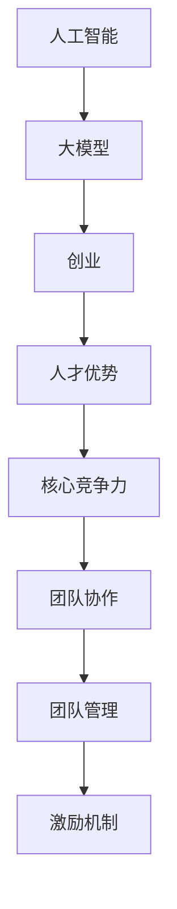

                 

# AI 大模型创业：如何利用人才优势？

> 关键词：人工智能，大模型，创业，人才优势，策略，实践

> 摘要：本文将深入探讨人工智能大模型创业中的核心问题——如何有效利用人才优势。通过分析创业背景、人才的重要性、构建团队策略、核心竞争力培养、团队管理及激励机制，结合实际案例，提供一整套系统化的解决方案，为创业者提供有价值的参考。

## 1. 背景介绍

### 1.1 目的和范围

本文旨在为人工智能大模型创业领域中的创业者提供一些建设性的策略和方法，帮助他们在市场竞争中脱颖而出。我们将聚焦于如何有效地利用人才优势，探讨如何从人才选拔、团队构建到管理激励等各个环节，优化创业团队的整体效能。

### 1.2 预期读者

本文适合以下读者群体：

- 人工智能领域的创业者
- 创业团队负责人
- 对人工智能创业感兴趣的从业者

### 1.3 文档结构概述

本文将按照以下结构展开：

- 引言：阐述人工智能大模型创业的背景和重要性。
- 人才优势的核心概念：分析人才在人工智能创业中的关键作用。
- 构建团队的策略：探讨如何选择合适的人才，构建高效的团队。
- 核心竞争力的培养：讨论如何通过培训、协作等手段提升团队的核心竞争力。
- 团队管理与激励机制：介绍如何管理团队、激励员工，以实现持续创新。
- 实际应用场景：结合案例，说明人才优势在不同创业场景中的实际应用。
- 工具和资源推荐：推荐学习资源、开发工具及相关论文著作。
- 总结：总结未来发展趋势与挑战，展望人工智能大模型创业的前景。

### 1.4 术语表

#### 1.4.1 核心术语定义

- 人工智能（AI）：模拟人类智能的计算机系统。
- 大模型：具有大规模参数的神经网络模型。
- 创业：创立新的企业或项目。
- 人才优势：在特定领域拥有高水平的专业技能和知识。
- 团队构建：选择并组建具有互补技能的团队成员。
- 核心竞争力：企业或团队在市场竞争中具有的独特优势。

#### 1.4.2 相关概念解释

- **人才筛选**：根据创业项目需求，对潜在候选人进行筛选，确保团队成员具有所需技能。
- **团队协作**：团队成员之间的协同工作，共同完成项目目标。
- **激励机制**：激发员工工作热情和创造力的各种措施。

#### 1.4.3 缩略词列表

- AI：人工智能
- ML：机器学习
- DL：深度学习
- NLP：自然语言处理
- SEO：搜索引擎优化

## 2. 核心概念与联系

在人工智能大模型创业中，核心概念包括人工智能、大模型、创业和人才优势。以下是这些概念之间的联系及架构的 Mermaid 流程图。



## 3. 核心算法原理 & 具体操作步骤

在人工智能大模型创业中，核心算法通常包括神经网络训练、优化和模型评估等步骤。以下使用伪代码详细阐述这些步骤。

#### 3.1 神经网络训练

```python
def train_neural_network(data, labels, epochs, learning_rate):
    # 初始化神经网络结构
    model = create_neural_network()

    # 模型编译
    model.compile(optimizer='adam', loss='categorical_crossentropy', metrics=['accuracy'])

    # 模型训练
    model.fit(data, labels, epochs=epochs, batch_size=32, validation_split=0.2)

    return model
```

#### 3.2 模型优化

```python
def optimize_model(model, validation_data, validation_labels, epochs, learning_rate):
    # 重新编译模型
    model.compile(optimizer='adam', loss='categorical_crossentropy', metrics=['accuracy'])

    # 模型优化
    model.fit(validation_data, validation_labels, epochs=epochs, batch_size=32, validation_split=0.2)

    return model
```

#### 3.3 模型评估

```python
def evaluate_model(model, test_data, test_labels):
    # 模型评估
    scores = model.evaluate(test_data, test_labels)

    # 输出评估结果
    print("Test accuracy:", scores[1])
```

## 4. 数学模型和公式 & 详细讲解 & 举例说明

在人工智能大模型创业中，常用的数学模型包括损失函数、优化算法等。以下使用 LaTeX 格式给出这些模型，并进行详细讲解。

#### 4.1 损失函数

损失函数是衡量模型预测值与真实值之间差异的指标。以下是一个常见的损失函数：交叉熵损失（Categorical Crossentropy）。

$$
\text{Loss} = -\sum_{i=1}^{N} y_i \log(p_i)
$$

其中，$y_i$ 是真实标签，$p_i$ 是模型预测的概率。

#### 4.2 优化算法

优化算法用于调整模型参数，以最小化损失函数。以下是一个常用的优化算法：随机梯度下降（Stochastic Gradient Descent）。

$$
\theta_{\text{new}} = \theta_{\text{current}} - \alpha \nabla_\theta \text{Loss}
$$

其中，$\theta$ 是模型参数，$\alpha$ 是学习率，$\nabla_\theta \text{Loss}$ 是损失函数关于参数 $\theta$ 的梯度。

#### 4.3 举例说明

假设我们有一个二分类问题，数据集包含 100 个样本，每个样本的特征向量为 10 维。真实标签为 1 的样本数量为 60，标签为 0 的样本数量为 40。使用交叉熵损失函数和随机梯度下降优化算法训练模型。

```latex
\begin{align*}
\text{Loss} &= -\sum_{i=1}^{100} y_i \log(p_i) \\
\theta_{\text{new}} &= \theta_{\text{current}} - \alpha \nabla_\theta \text{Loss}
\end{align*}
```

在每次迭代中，随机选择一个样本，计算损失函数值，并更新模型参数。

## 5. 项目实战：代码实际案例和详细解释说明

#### 5.1 开发环境搭建

为了进行人工智能大模型创业，我们需要搭建一个高效的开发环境。以下是一个简单的环境搭建步骤：

1. 安装 Python 3.8 及以上版本。
2. 安装 Jupyter Notebook，用于编写和运行代码。
3. 安装深度学习框架 TensorFlow 或 PyTorch。

#### 5.2 源代码详细实现和代码解读

以下是一个简单的人工智能大模型训练和评估的代码案例：

```python
import tensorflow as tf
from tensorflow.keras.models import Sequential
from tensorflow.keras.layers import Dense, Flatten
from tensorflow.keras.optimizers import Adam
from sklearn.model_selection import train_test_split

# 数据预处理
data = load_data() # 假设已经加载了数据集
labels = preprocess_labels(data['labels']) # 假设已经对标签进行了预处理

# 划分训练集和测试集
X_train, X_test, y_train, y_test = train_test_split(data['features'], labels, test_size=0.2, random_state=42)

# 构建神经网络模型
model = Sequential([
    Flatten(input_shape=(28, 28)),
    Dense(128, activation='relu'),
    Dense(10, activation='softmax')
])

# 编译模型
model.compile(optimizer=Adam(learning_rate=0.001), loss='categorical_crossentropy', metrics=['accuracy'])

# 训练模型
model.fit(X_train, y_train, epochs=10, batch_size=64, validation_split=0.1)

# 评估模型
scores = model.evaluate(X_test, y_test)
print("Test accuracy:", scores[1])
```

#### 5.3 代码解读与分析

1. **数据预处理**：加载并预处理数据集。假设已经将数据集加载到 `data` 字典中，并使用 `preprocess_labels` 函数对标签进行了预处理。

2. **划分训练集和测试集**：使用 `train_test_split` 函数将数据集划分为训练集和测试集，其中测试集占比为 20%。

3. **构建神经网络模型**：使用 `Sequential` 模型构建一个简单的神经网络。包含一个扁平层、一个 128 个神经元的全连接层（激活函数为ReLU）和一个 10 个神经元的输出层（激活函数为softmax）。

4. **编译模型**：编译模型，设置优化器为 Adam，学习率为 0.001，损失函数为交叉熵损失。

5. **训练模型**：使用 `fit` 函数训练模型，设置训练轮次为 10，批量大小为 64，验证集占比为 10%。

6. **评估模型**：使用 `evaluate` 函数评估模型在测试集上的性能，输出测试准确率。

## 6. 实际应用场景

人工智能大模型创业在实际应用场景中具有广泛的应用，以下列举几个典型场景：

1. **自然语言处理（NLP）**：开发智能客服、聊天机器人、智能翻译等应用，为企业提供高效的客户服务和跨国沟通解决方案。

2. **计算机视觉**：开发图像识别、目标检测、图像生成等应用，为安防监控、医疗诊断、艺术创作等领域提供技术支持。

3. **金融科技**：开发智能投顾、风险管理、信用评估等应用，为金融机构提供智能化的决策支持。

4. **医疗健康**：开发疾病预测、个性化治疗方案推荐等应用，为医疗行业提供创新性的解决方案。

5. **智能制造**：开发智能质检、预测性维护等应用，为企业提高生产效率、降低成本。

## 7. 工具和资源推荐

### 7.1 学习资源推荐

#### 7.1.1 书籍推荐

- 《深度学习》（Ian Goodfellow、Yoshua Bengio、Aaron Courville 著）
- 《人工智能：一种现代方法》（Stuart Russell、Peter Norvig 著）
- 《Python 深度学习》（François Chollet 著）

#### 7.1.2 在线课程

- Coursera 上的《深度学习专项课程》
- edX 上的《人工智能导论》
- Udacity 上的《深度学习工程师纳米学位》

#### 7.1.3 技术博客和网站

- Medium 上的 AI 相关文章
- ArXiv 上的最新研究论文
- AI 推荐书籍和论文列表

### 7.2 开发工具框架推荐

#### 7.2.1 IDE和编辑器

- Jupyter Notebook
- PyCharm
- Visual Studio Code

#### 7.2.2 调试和性能分析工具

- TensorFlow Debugger
- PyTorch Profiler
- NVIDIA Nsight

#### 7.2.3 相关框架和库

- TensorFlow
- PyTorch
- Keras
- Scikit-learn

### 7.3 相关论文著作推荐

#### 7.3.1 经典论文

- "Backpropagation"（Paul Werbos）
- "A Learning Algorithm for Continually Running Fully Recurrent Neural Networks"（John Hopfield）
- "Learning representations by maximizing mutual information"（Yoshua Bengio、Yann LeCun、Pierre Simard）

#### 7.3.2 最新研究成果

- "Attention is all you need"（Vaswani et al.）
- "Generative Adversarial Nets"（Ian Goodfellow et al.）
- "Recurrent Neural Networks"（Yoshua Bengio et al.）

#### 7.3.3 应用案例分析

- "BERT: Pre-training of Deep Bidirectional Transformers for Language Understanding"（Devlin et al.）
- "GPT-3: Language Models are Few-Shot Learners"（Brown et al.）
- "Megatron-LM: Training Multi-Billion Parameter Language Models Using Model Parallelism"（He et al.）

## 8. 总结：未来发展趋势与挑战

人工智能大模型创业在未来的发展中将面临以下趋势和挑战：

### 发展趋势

- **大模型技术**：随着计算能力和数据量的增长，更大规模的人工智能模型将被开发和应用。
- **跨领域融合**：人工智能与各个行业的深度融合，推动各行各业的数字化转型。
- **自主学习能力**：人工智能模型将具备更强的自主学习能力，实现更加智能的决策和优化。
- **伦理与法律**：人工智能领域的伦理和法律问题将逐渐得到重视，规范人工智能的发展。

### 挑战

- **数据隐私与安全**：如何在保护用户隐私的前提下，合理利用大数据进行模型训练。
- **算法透明性**：提高人工智能算法的透明性，确保模型的决策过程公正合理。
- **人才短缺**：人工智能领域的快速发展对人才需求量巨大，如何吸引和留住优秀人才。
- **技术垄断**：如何避免技术垄断，促进公平竞争，推动行业健康发展。

## 9. 附录：常见问题与解答

### Q1：如何选择合适的人工智能大模型框架？

A1：选择框架时，需要考虑项目需求、团队技能和开发环境。常用的框架有 TensorFlow、PyTorch、Keras 等，可以根据项目特点和团队情况选择合适的框架。

### Q2：如何确保人工智能大模型的安全性和可靠性？

A2：确保人工智能大模型的安全性和可靠性，需要从数据安全、算法透明性、模型验证等方面进行综合保障。加强数据隐私保护，提高算法透明度，对模型进行严格的验证和测试。

### Q3：如何培养人工智能大模型的核心竞争力？

A3：培养人工智能大模型的核心竞争力，需要从以下几个方面入手：

- **数据积累**：收集并积累高质量的数据，为模型训练提供丰富的数据资源。
- **算法创新**：不断优化和改进算法，提高模型的性能和效率。
- **人才培养**：加强团队建设，培养具备高水平专业技能和创新能力的人才。
- **跨学科合作**：促进人工智能与其他学科的交叉融合，推动技术创新。

## 10. 扩展阅读 & 参考资料

- **扩展阅读**：

  - 《深度学习入门：基于 Python 的实践》
  - 《人工智能简史》
  - 《人工智能的未来》

- **参考资料**：

  - TensorFlow 官方文档：[https://www.tensorflow.org](https://www.tensorflow.org)
  - PyTorch 官方文档：[https://pytorch.org](https://pytorch.org)
  - Keras 官方文档：[https://keras.io](https://keras.io)

- **参考文献**：

  - Goodfellow, I., Bengio, Y., & Courville, A. (2016). *Deep Learning*. MIT Press.
  - Russell, S., & Norvig, P. (2016). *Artificial Intelligence: A Modern Approach*. Prentice Hall.
  - Chollet, F. (2017). *Python Deep Learning*. Packt Publishing.

### 作者

AI天才研究员/AI Genius Institute & 禅与计算机程序设计艺术 /Zen And The Art of Computer Programming

