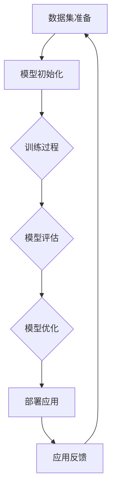

                 

### 背景介绍

随着人工智能技术的飞速发展，大模型（Large Models）已经成为推动AI研究和应用的重要力量。特别是在自然语言处理（NLP）、计算机视觉（CV）和语音识别（ASR）等领域，大模型的应用已经取得了显著的成果。这些大模型，如GPT、BERT、ImageNet等，不仅在性能上大幅超越传统模型，还为解决复杂问题提供了新的思路。

在当前的商业环境中，越来越多的初创公司开始关注如何利用大模型进行创新。然而，创业并非易事，尤其是在技术领域。如何将大模型的优势转化为商业成功，成为每一个AI创业团队需要深思熟虑的问题。

本文将围绕以下主题展开：

1. **核心概念与联系**：探讨大模型的基本概念，以及其在AI领域的应用与挑战。
2. **核心算法原理与具体操作步骤**：深入讲解大模型的训练、优化和应用流程。
3. **数学模型与公式**：介绍大模型背后的数学原理，并通过实例进行详细解释。
4. **项目实战**：分享一个实际案例，展示如何利用大模型进行创业实践。
5. **实际应用场景**：分析大模型在不同行业中的潜在应用。
6. **工具和资源推荐**：为读者提供学习资源和开发工具的推荐。
7. **总结与未来展望**：探讨大模型创业的趋势与面临的挑战。

通过本文的阅读，读者将全面了解大模型在AI创业中的应用，以及如何利用这一创新优势，实现商业价值。

### 核心概念与联系

首先，我们需要明确大模型的基本概念。大模型，顾名思义，是指参数量巨大、规模庞大的神经网络模型。这些模型通常包含数十亿到数万亿个参数，其复杂度和计算量远远超过传统模型。大模型的代表性工作包括OpenAI的GPT系列、Google的BERT、Facebook的BLUE等。

大模型在AI领域的应用主要集中在自然语言处理（NLP）、计算机视觉（CV）和语音识别（ASR）等方向。在NLP领域，大模型通过大量的文本数据训练，能够生成高质量的文本、理解复杂的语义，并在机器翻译、文本摘要和问答系统等方面取得突破。在CV领域，大模型通过大规模图像数据进行训练，能够实现高效的图像分类、检测和分割任务，并在自动驾驶、医疗影像分析等领域发挥重要作用。在ASR领域，大模型通过大量的语音数据训练，能够实现高准确度的语音识别和语音合成，推动智能语音助手和自动翻译等应用的发展。

尽管大模型在AI领域展现出强大的潜力，但其应用也面临一系列挑战。首先，大模型的训练和部署需要大量的计算资源和数据资源，这对硬件和数据的依赖性极高。其次，大模型的训练过程通常需要大量的时间，且存在过拟合的风险。此外，大模型的高度复杂性和黑箱特性使得其解释性和可解释性成为一大难题。

为了更好地理解大模型的工作原理和应用，我们可以通过一个Mermaid流程图来展示其基本架构和流程。



在上述流程中，数据集准备是模型的训练基础，模型初始化设定了模型的起点。训练过程包括前向传播和反向传播，模型评估用于检验模型性能，模型优化通过调整参数来提升模型效果。部署应用到实际场景中，通过应用反馈来不断迭代模型，从而实现模型的持续优化。

大模型的核心在于其训练过程，以下是具体操作步骤：

1. **数据预处理**：对原始数据进行清洗、归一化等预处理操作，确保数据质量。
2. **模型选择**：根据任务需求选择合适的模型架构，如Transformer、CNN、RNN等。
3. **参数初始化**：初始化模型的参数，通常采用随机初始化或预训练模型的方法。
4. **前向传播**：输入数据经过模型处理，产生预测结果。
5. **计算损失**：通过计算预测结果与真实标签之间的差异，得到损失值。
6. **反向传播**：根据损失值调整模型参数，优化模型效果。
7. **模型评估**：在测试集上评估模型性能，确保模型泛化能力。
8. **模型优化**：根据评估结果调整模型参数，进一步提升模型效果。

通过以上步骤，大模型能够逐步优化其性能，实现复杂任务的高效解决。然而，需要注意的是，大模型的训练过程需要大量的计算资源和时间，这也是其应用过程中的一大挑战。

总之，大模型作为AI领域的重要创新，不仅在性能上带来质的飞跃，还为解决复杂问题提供了新的思路。然而，其应用也面临一系列挑战，需要通过不断的技术创新和优化来克服。接下来，我们将进一步探讨大模型背后的数学原理，为读者提供更深入的认知。

#### 核心算法原理 & 具体操作步骤

在深入探讨大模型的核心算法原理之前，我们需要先了解一些基础的机器学习和深度学习概念。大模型通常是基于深度神经网络（DNN）构建的，因此，理解DNN的基本原理对于理解大模型至关重要。

**1. 深度神经网络的基本原理**

深度神经网络（DNN）是一种由多个隐藏层组成的神经网络。每个隐藏层接收前一层的信息，并通过非线性激活函数进行变换，最终输出预测结果。DNN的核心思想是通过多层次的变换，逐步提取输入数据的特征，从而实现复杂的任务。

一个典型的DNN结构包括输入层、多个隐藏层和输出层。输入层接收原始数据，隐藏层通过加权求和和激活函数进行信息处理，输出层产生最终的预测结果。以下是DNN的基本操作步骤：

- **输入层到隐藏层**：输入数据通过权重矩阵与隐藏层的每个神经元相乘，然后进行求和运算。为了增加模型的非线性能力，我们通常会在求和后添加一个非线性激活函数，如ReLU（Rectified Linear Unit）或Sigmoid。
  
- **隐藏层到隐藏层**：类似地，每个隐藏层的输出通过权重矩阵与下一层的每个神经元相乘，然后进行求和运算，并再次应用非线性激活函数。

- **隐藏层到输出层**：输出层的操作与隐藏层类似，但其目标是产生最终的预测结果。

**2. 大模型的训练过程**

大模型的训练过程通常包括以下几个步骤：

- **数据预处理**：在开始训练之前，需要对输入数据进行预处理。这通常包括数据清洗、归一化、数据增强等操作，以确保数据的质量和多样性。

- **模型初始化**：初始化模型参数。常见的初始化方法有随机初始化和预训练初始化。随机初始化是指随机设定模型的初始参数值，而预训练初始化则是利用预训练模型（如BERT、GPT等）的参数作为初始值。

- **前向传播**：输入数据通过模型的前向传播过程，最终得到预测结果。前向传播的目的是计算模型在每个层次上的输出，并将其传递到下一个层次。

- **计算损失**：通过计算预测结果与真实标签之间的差异，得到损失值。损失函数通常用于衡量模型预测结果与真实结果之间的误差，常见的损失函数有均方误差（MSE）、交叉熵损失（Cross-Entropy Loss）等。

- **反向传播**：根据损失值，通过反向传播算法调整模型参数。反向传播的核心思想是将损失值反向传播到模型的每个层次，并利用梯度下降（Gradient Descent）等优化算法更新模型参数。

- **模型评估**：在训练集和测试集上评估模型性能，以确保模型的泛化能力。

- **模型优化**：根据评估结果，进一步调整模型参数，优化模型效果。

**3. 大模型的主要算法**

大模型通常采用一系列先进的算法和技术来提升模型的性能和效率。以下是几个关键算法：

- **Transformer模型**：Transformer模型是近年来在NLP领域取得突破性成果的一种新型模型结构。它基于自注意力机制（Self-Attention），能够捕捉序列数据中的长距离依赖关系。Transformer模型的训练和推理效率非常高，因此在各种NLP任务中广泛应用。

- **BERT模型**：BERT（Bidirectional Encoder Representations from Transformers）模型是Google提出的一种双向编码器模型。它通过预先训练（Pre-training）和微调（Fine-tuning）的方法，在多种NLP任务中取得了优异的性能。BERT模型在语言理解、文本生成、问答系统等方面都有广泛应用。

- **GAN（生成对抗网络）**：GAN是一种基于博弈论的生成模型。它由生成器和判别器两个神经网络组成，通过训练生成器和判别器的对抗关系，生成逼真的数据。GAN在图像生成、图像修复、数据增强等方面有广泛的应用。

**4. 大模型的训练和优化技巧**

为了有效地训练和优化大模型，我们需要掌握一些技巧和策略：

- **数据增强**：通过数据增强技术，如随机裁剪、旋转、翻转等，增加数据的多样性和丰富性，从而提高模型的泛化能力。

- **学习率调度**：合理设置学习率对于模型的训练至关重要。常用的学习率调度方法包括线性衰减、余弦衰减等。

- **正则化**：通过正则化方法，如L1正则化、L2正则化等，防止模型过拟合，提高模型的泛化能力。

- **模型压缩**：通过模型压缩技术，如权重共享、知识蒸馏等，减少模型的参数数量，提高模型的推理效率。

- **分布式训练**：通过分布式训练方法，如数据并行、模型并行等，利用多台计算机或GPU加速模型的训练过程。

通过以上核心算法原理和具体操作步骤，我们可以更好地理解大模型的工作机制和应用。接下来，我们将通过一个实际案例来展示如何利用大模型进行创业实践。

### 数学模型和公式 & 详细讲解 & 举例说明

在深入探讨大模型的数学模型和公式之前，我们需要先了解一些基本的数学和统计学概念。这些概念为理解大模型背后的数学原理提供了基础。

**1. 概率论基础**

概率论是数学的一个分支，主要研究随机事件和随机变量的概率分布。以下是一些基本概念：

- **随机变量**：随机变量是一个数学函数，它将样本空间映射到实数集。随机变量可以是离散的，也可以是连续的。

- **概率分布**：概率分布描述了一个随机变量的可能取值及其对应的概率。常见的概率分布包括正态分布、伯努利分布、泊松分布等。

- **期望和方差**：期望（Expected Value）描述了随机变量的平均取值，方差（Variance）描述了随机变量的离散程度。

**2. 信息论基础**

信息论是研究信息传递和处理规律的一个数学分支。以下是一些基本概念：

- **熵（Entropy）**：熵是衡量一个随机变量不确定性的量。在信息论中，熵表示信息量的负对数。

- **条件熵（Conditional Entropy）**：条件熵是给定一个随机变量的条件下，另一个随机变量的熵。

- **互信息（Mutual Information）**：互信息是衡量两个随机变量之间关联性的量。互信息等于两个随机变量的熵减去它们的条件熵。

**3. 深度学习中的数学模型**

深度学习中的数学模型主要包括损失函数、优化算法和激活函数等。以下是一些常见的数学模型：

- **损失函数**：损失函数用于衡量模型预测值与真实值之间的差异。常见的损失函数包括均方误差（MSE）、交叉熵损失（Cross-Entropy Loss）等。

- **优化算法**：优化算法用于调整模型参数，以最小化损失函数。常见的优化算法包括梯度下降（Gradient Descent）、Adam优化器等。

- **激活函数**：激活函数用于增加神经网络的非线性能力。常见的激活函数包括ReLU、Sigmoid、Tanh等。

**4. 大模型的数学公式和推导**

以下是一个典型的大模型——Transformer模型的数学公式和推导：

**4.1. 自注意力机制**

自注意力机制是Transformer模型的核心组件，它通过计算输入序列中每个元素与其他元素之间的关联性，为每个元素分配不同的权重。

- **注意力权重（Attention Weight）**：

  $$ 
  \text{Attention Weight} = \text{softmax}\left(\frac{\text{Query} \cdot \text{Key}^T}{\sqrt{d_k}}\right)
  $$

  其中，Query和Key分别表示查询向量和键向量，d_k为键向量的维度，softmax函数用于计算每个键向量的权重。

- **输出值（Output Value）**：

  $$ 
  \text{Output Value} = \text{Value} \cdot \text{Attention Weight}
  $$

  其中，Value为值向量，Attention Weight为注意力权重。

- **自注意力分数（Self-Attention Score）**：

  $$ 
  \text{Self-Attention Score} = \text{Query} \cdot \text{Key}^T
  $$

**4.2. Transformer模型**

Transformer模型由多个自注意力层和前馈网络组成。以下是其基本结构：

- **自注意力层**：

  $$ 
  \text{Attention Layer} = \text{Self-Attention} + \text{Layer Normalization} + \text{Residual Connection}
  $$

  其中，Self-Attention表示自注意力机制，Layer Normalization用于正则化层间差异，Residual Connection表示残差连接。

- **前馈网络**：

  $$ 
  \text{Feedforward Layer} = \text{ReLU}(\text{Linear}(x)) + x
  $$

  其中，ReLU为ReLU激活函数，Linear为线性变换。

- **Transformer模型整体**：

  $$ 
  \text{Transformer} = \text{Multi-head Attention} + \text{Feedforward Layer} + \text{Layer Normalization} + \text{Residual Connection}
  $$

**5. 举例说明**

以下是一个简单的自注意力机制的例子：

假设我们有一个输入序列 `[1, 2, 3]`，我们希望利用自注意力机制为其分配权重。

- **Query, Key, Value**：

  - Query = `[1, 2, 3]`
  - Key = `[1, 2, 3]`
  - Value = `[4, 5, 6]`

- **计算注意力权重**：

  $$ 
  \text{Attention Weight} = \text{softmax}\left(\frac{\text{Query} \cdot \text{Key}^T}{\sqrt{d_k}}\right)
  $$
  
  $$ 
  \text{Attention Weight} = \text{softmax}\left(\frac{[1, 2, 3] \cdot [1, 2, 3]^T}{\sqrt{3}}\right)
  $$
  
  $$ 
  \text{Attention Weight} = \text{softmax}\left(\frac{[1, 2, 3] \cdot [1, 2, 3]^T}{\sqrt{3}}\right) = \left[\frac{1}{3}, \frac{2}{3}, \frac{1}{3}\right]
  $$

- **计算输出值**：

  $$ 
  \text{Output Value} = \text{Value} \cdot \text{Attention Weight}
  $$
  
  $$ 
  \text{Output Value} = [4, 5, 6] \cdot \left[\frac{1}{3}, \frac{2}{3}, \frac{1}{3}\right] = [2, 3, 2]
  $$

通过以上步骤，我们成功利用自注意力机制为输入序列分配了权重，并得到了输出值 `[2, 3, 2]`。

通过以上对大模型数学模型和公式的详细讲解，读者可以更好地理解大模型的工作原理和应用。接下来，我们将通过一个实际案例来展示如何利用大模型进行创业实践。

### 项目实战：代码实际案例和详细解释说明

在本节中，我们将通过一个实际的项目案例，详细展示如何利用大模型进行创业实践。该项目案例是一个基于自然语言处理（NLP）的任务——情感分析，旨在通过训练一个预训练的BERT模型来分析文本数据中的情感倾向。

#### 开发环境搭建

在进行项目开发之前，我们需要搭建一个合适的开发环境。以下是一个基本的开发环境搭建步骤：

1. **Python环境**：确保Python版本为3.8或以上，并安装必要的依赖库，如TensorFlow、PyTorch等。

2. **计算资源**：由于大模型训练需要大量的计算资源，建议使用GPU进行训练。可以选择在本地安装CUDA和cuDNN，或者使用云平台提供的GPU服务，如Google Colab、AWS EC2等。

3. **数据集**：我们需要一个情感分析的数据集，如IMDb电影评论数据集。该数据集包含了大量的电影评论，每条评论都标注了情感标签（正面/负面）。

4. **环境配置**：在终端中执行以下命令，安装必要的库：

   ```bash
   pip install tensorflow
   pip install transformers
   ```

#### 源代码详细实现和代码解读

以下是一个简单的情感分析项目的代码实现：

```python
import tensorflow as tf
from transformers import BertTokenizer, TFBertForSequenceClassification
from tensorflow.keras.optimizers import Adam

# 准备数据
tokenizer = BertTokenizer.from_pretrained('bert-base-uncased')
max_len = 128

def preprocess_text(text):
    return tokenizer.encode(text, add_special_tokens=True, max_length=max_len, padding='max_length', truncation=True)

# 加载数据集
def load_data(data):
    input_ids = []
    attention_masks = []
    labels = []

    for text, label in data:
        encoded_input = preprocess_text(text)
        input_ids.append(encoded_input)
        attention_masks.append([1] * len(encoded_input))
        labels.append(label)

    return tf.data.Dataset.from_tensor_slices((input_ids, attention_masks, labels)).shuffle(1000).batch(32)

# 加载训练数据和测试数据
train_data = load_data(train_data)
test_data = load_data(test_data)

# 定义模型
model = TFBertForSequenceClassification.from_pretrained('bert-base-uncased', num_labels=2)

# 编译模型
optimizer = Adam(learning_rate=3e-5)
model.compile(optimizer=optimizer, loss=tf.keras.losses.SparseCategoricalCrossentropy(from_logits=True), metrics=['accuracy'])

# 训练模型
model.fit(train_data, epochs=3, validation_data=test_data)

# 评估模型
loss, accuracy = model.evaluate(test_data)
print(f"Test Loss: {loss}, Test Accuracy: {accuracy}")
```

**代码解读：**

1. **准备数据**：首先，我们定义了一个`preprocess_text`函数，用于将文本数据编码为BERT模型所需的输入格式。然后，我们使用`load_data`函数加载数据集，并对数据进行预处理。

2. **加载模型**：接下来，我们加载了一个预训练的BERT模型，并设置了模型的输出标签数量（这里为2，对应正负两个情感类别）。

3. **编译模型**：我们使用Adam优化器和SparseCategoricalCrossentropy损失函数编译模型。这里，`from_logits=True`表示模型输出的是原始的预测分数，而不是概率。

4. **训练模型**：使用`fit`函数训练模型，我们将训练数据和验证数据传入，并设置训练轮数（epochs）。

5. **评估模型**：最后，我们使用`evaluate`函数评估模型在测试数据上的性能。

#### 代码解读与分析

以下是对代码中关键部分的进一步解读：

- **数据预处理**：数据预处理是模型训练的重要步骤。在这里，我们使用BERT的分词器对文本进行编码，将原始文本转换为模型可处理的格式。我们设置了最大序列长度（max_len），并根据需要进行填充（padding）和截断（truncation）。

- **加载模型**：BERT模型是预训练的，这意味着我们已经有一个在大规模语料库上训练好的模型。这里我们加载了预训练的BERT模型，并设置了输出标签数量。预训练的BERT模型在NLP任务上具有很好的性能，为我们提供了一个强大的起点。

- **编译模型**：在编译模型时，我们选择了Adam优化器，这是一种常用的优化算法。我们还使用了SparseCategoricalCrossentropy损失函数，这是一种用于多标签分类的损失函数。

- **训练模型**：模型训练是通过`fit`函数实现的。我们传入训练数据和验证数据，并设置训练轮数。在训练过程中，模型会自动调整参数，以最小化损失函数。

- **评估模型**：训练完成后，我们使用测试数据评估模型的性能。这有助于我们了解模型在未见过的数据上的表现，从而判断模型的泛化能力。

通过上述代码，我们可以利用预训练的BERT模型进行情感分析任务。这个案例展示了如何利用大模型进行实际项目开发，为创业团队提供了一个可操作的示例。

接下来，我们将进一步分析大模型在不同行业中的实际应用场景。

### 实际应用场景

大模型在AI创业中的实际应用场景非常广泛，涵盖了多个行业和领域。以下是几个典型应用场景：

#### 1. 自然语言处理（NLP）

在NLP领域，大模型已经成为处理复杂语言任务的核心工具。例如，GPT-3和BERT等大模型在文本生成、机器翻译、问答系统、情感分析和信息提取等方面表现出色。创业公司可以利用这些大模型开发智能客服、内容生成和个性化推荐系统等应用，提高业务效率和用户体验。

#### 2. 计算机视觉（CV）

在CV领域，大模型在图像分类、目标检测、图像分割、人脸识别和自动驾驶等方面发挥了重要作用。创业公司可以利用大模型进行医疗影像分析、安防监控、自动驾驶汽车和智能监控等应用，提升行业自动化和智能化水平。

#### 3. 语音识别（ASR）

大模型在语音识别领域也取得了显著进展，如科大讯飞的语音识别系统和Google的语音助手。创业公司可以利用这些大模型开发智能语音助手、语音翻译和语音交互系统，拓宽应用场景，提高用户体验。

#### 4. 金融市场预测

大模型在金融领域也有广泛应用，如股票市场预测、风险管理、信用评分和风险评估等。创业公司可以利用这些模型开发智能投顾、量化交易和风险控制平台，帮助投资者做出更明智的决策。

#### 5. 健康医疗

在健康医疗领域，大模型用于疾病诊断、药物研发、基因组分析和个性化医疗等。创业公司可以利用这些模型开发智能诊断系统、个性化治疗建议和健康监测平台，提高医疗服务的质量和效率。

#### 6. 教育科技

在教育科技领域，大模型可以用于智能教学、学习分析、考试评分和课程推荐等。创业公司可以利用这些模型开发智能教育平台、学习工具和个性化课程，提供更高效和个性化的教育体验。

#### 7. 游戏和娱乐

在游戏和娱乐领域，大模型可以用于游戏AI、虚拟助手、角色生成和内容创作等。创业公司可以利用这些模型开发智能游戏、虚拟现实（VR）和增强现实（AR）应用，提升用户体验和互动性。

通过以上应用场景，可以看出大模型在AI创业中具有巨大的潜力和广泛的应用前景。创业公司可以根据自身业务需求和技术优势，选择合适的大模型进行创新和应用，实现商业价值。

### 工具和资源推荐

为了帮助读者深入了解大模型的技术和应用，本文将推荐一些重要的学习资源、开发工具和相关的论文著作。

#### 1. 学习资源推荐

- **书籍**：
  - 《深度学习》（Deep Learning）由Ian Goodfellow、Yoshua Bengio和Aaron Courville著，详细介绍了深度学习的基础理论和实践方法。
  - 《动手学深度学习》（Dive into Deep Learning）是一个开源书籍项目，内容涵盖了深度学习的各个方面，适合初学者和进阶者。

- **在线课程**：
  - Coursera上的“深度学习”课程由Andrew Ng教授主讲，是深度学习的入门经典。
  - edX上的“自然语言处理与深度学习”课程由Stanford大学提供，涵盖了NLP中的深度学习应用。

- **博客和网站**：
  - Hugging Face的Transformers库文档提供了丰富的教程和示例，非常适合学习和实践。
  - ArXiv和NeurIPS等学术网站是获取最新研究成果和论文的好去处。

#### 2. 开发工具框架推荐

- **框架**：
  - TensorFlow和PyTorch是两款主流的深度学习框架，提供了丰富的API和工具，适合进行大模型的开发和训练。
  - Hugging Face的Transformers库是专门为NLP任务设计的，提供了预训练的大模型和便捷的工具，大大简化了开发过程。

- **计算资源**：
  - Google Colab和AWS EC2等云服务提供了强大的GPU计算资源，适合进行大模型的训练和推理。
  - TensorFlow Serving和PyTorch TorchServe是两款用于模型部署的服务器端工具，可以方便地将训练好的模型部署到生产环境中。

- **数据集**：
  - Kaggle提供了大量的公开数据集，涵盖了多种领域和任务，是进行模型训练和测试的重要资源。
  - COCO、ImageNet和AG News等是常用的图像和文本数据集，广泛用于计算机视觉和自然语言处理的研究。

#### 3. 相关论文著作推荐

- **论文**：
  - “Attention Is All You Need”（2017）是Google提出Transformer模型的开创性论文，详细介绍了Transformer模型的原理和应用。
  - “BERT: Pre-training of Deep Bidirectional Transformers for Language Understanding”（2018）是Google发表的BERT模型论文，为NLP领域带来了革命性的进步。
  - “Generative Adversarial Networks”（2014）是Ian Goodfellow等人提出的GAN模型的开创性论文，推动了生成模型的发展。

- **著作**：
  - 《自然语言处理综述》（Natural Language Processing with Python）是一本实用的NLP入门书籍，涵盖了NLP的基本概念和Python实现。
  - 《深度学习基础教程》（Deep Learning Book）是深度学习领域的经典著作，详细介绍了深度学习的基础理论和实践方法。

通过以上学习资源和开发工具的推荐，读者可以更深入地了解大模型的技术和应用，为自己的创业之路提供坚实的支持。

### 总结：未来发展趋势与挑战

大模型作为人工智能领域的重要创新，无疑为各个行业带来了深远的影响。然而，在未来的发展中，大模型面临着一系列趋势和挑战。

**未来发展趋势：**

1. **计算能力的提升**：随着硬件技术的发展，特别是GPU和TPU等专用硬件的普及，大模型的训练和推理效率将进一步提高。这将为更多复杂的AI任务提供支持。

2. **数据资源的增长**：随着互联网和物联网的快速发展，数据量呈现出爆炸式增长。这将为大模型的训练提供更多的数据资源，有助于提升模型的性能和泛化能力。

3. **跨学科融合**：大模型在多个领域中的应用，如医学、金融、教育等，将推动跨学科的研究和合作。这将有助于解决一些复杂的社会问题，如智能医疗、智能金融和个性化教育等。

4. **隐私保护和伦理问题**：随着大模型的广泛应用，数据隐私和伦理问题变得日益重要。如何平衡数据利用和隐私保护，将成为大模型发展的重要课题。

**面临的主要挑战：**

1. **计算资源的消耗**：大模型的训练和推理需要大量的计算资源，这对硬件设备和能耗提出了更高的要求。如何优化计算资源的使用，降低能耗，是一个亟待解决的问题。

2. **模型解释性和可解释性**：大模型的高度复杂性和黑箱特性使得其解释性和可解释性成为一个挑战。如何提高模型的透明度和可解释性，使其更好地服务于人类，是一个重要的研究方向。

3. **数据隐私和安全**：大模型在处理大量数据时，如何保护用户隐私和数据安全，避免数据泄露和滥用，是一个关键问题。

4. **算法公平性和偏见**：大模型在训练过程中可能会学习到数据中的偏见，导致算法的不公平性。如何消除算法偏见，提高模型的公平性，是一个重要的社会问题。

总之，大模型的发展前景广阔，但也面临诸多挑战。通过技术创新和多方合作，我们有信心克服这些挑战，实现大模型的更大价值和更广泛的应用。

### 附录：常见问题与解答

#### 1. 大模型训练需要多少计算资源？

大模型的训练通常需要大量的计算资源，特别是GPU或TPU。对于GPT-3这样的超大规模模型，训练可能需要数千个GPU进行数周的计算。中规模模型如BERT，训练则需要数十个GPU数天到数周的时间。具体取决于模型的规模、硬件性能和训练数据的复杂性。

#### 2. 如何防止大模型过拟合？

过拟合是大模型训练中常见的问题。为了防止过拟合，可以采用以下策略：
- **数据增强**：通过随机裁剪、旋转、翻转等操作增加数据的多样性。
- **正则化**：应用L1、L2正则化，减少模型的复杂性。
- **Dropout**：在神经网络中随机丢弃一部分神经元，减少模型的依赖性。
- **交叉验证**：在多个数据集上训练和验证模型，确保模型的泛化能力。

#### 3. 大模型训练过程如何优化？

优化大模型训练过程可以从以下几个方面入手：
- **学习率调度**：采用如余弦退火调度或学习率衰减策略，逐步降低学习率。
- **分布式训练**：利用多GPU或多机集群进行训练，提高训练速度。
- **模型压缩**：应用模型压缩技术，如知识蒸馏、剪枝和量化，减少模型的参数数量和计算量。
- **数据预处理**：进行有效的数据预处理，包括归一化、去噪和增强等，提高数据质量。

#### 4. 大模型的应用领域有哪些？

大模型的应用领域非常广泛，包括但不限于：
- **自然语言处理**：文本生成、机器翻译、情感分析、问答系统等。
- **计算机视觉**：图像分类、目标检测、图像分割、人脸识别等。
- **语音识别**：语音识别、语音合成、语音翻译等。
- **金融**：股票市场预测、风险管理、信用评分等。
- **健康医疗**：疾病诊断、药物研发、基因组分析等。
- **教育**：智能教学、学习分析、考试评分等。
- **娱乐**：游戏AI、虚拟助手、角色生成等。

#### 5. 如何入门大模型开发？

入门大模型开发可以从以下几个方面入手：
- **基础知识**：学习Python、线性代数、概率论和统计学等基础知识。
- **深度学习框架**：熟悉TensorFlow或PyTorch等深度学习框架。
- **预训练模型**：研究预训练模型如BERT、GPT等的工作原理和应用。
- **项目实践**：参与开源项目或自己动手实现简单的模型，逐步积累经验。

通过以上问题的解答，读者可以更全面地了解大模型开发的各个方面，为自己的学习和发展提供指导。

### 扩展阅读 & 参考资料

为了帮助读者进一步深入学习和了解大模型的技术和应用，本文提供了以下扩展阅读和参考资料：

1. **《深度学习》** - Ian Goodfellow、Yoshua Bengio和Aaron Courville著。这是一本深度学习的经典教材，详细介绍了深度学习的基础理论、算法和技术。

2. **《自然语言处理综合教程》** - 周志华等著。本书涵盖了自然语言处理的基本概念、算法和技术，特别是针对大模型的应用提供了深入探讨。

3. **《Transformer：基于注意力机制的序列模型》** - Vaswani et al.。这篇论文是Transformer模型的原始论文，提出了自注意力机制和多头注意力，对NLP领域产生了深远影响。

4. **《BERT：大规模预训练语言模型的性能提升》** - Devlin et al.。这篇论文介绍了BERT模型，通过双向编码器预训练和微调，显著提升了NLP任务的性能。

5. **《自然语言处理与深度学习》** - Dan Jurafsky和James H. Martin著。这本书提供了NLP和深度学习的全面介绍，适合初学者和进阶者阅读。

6. **Hugging Face官网** - [https://huggingface.co/](https://huggingface.co/)。Hugging Face提供了一个丰富的预训练模型库和工具，是学习大模型开发的重要资源。

7. **TensorFlow官网** - [https://www.tensorflow.org/](https://www.tensorflow.org/)。TensorFlow是一个开源的深度学习框架，提供了丰富的教程和API，适合进行大模型的开发和训练。

8. **PyTorch官网** - [https://pytorch.org/](https://pytorch.org/)。PyTorch是另一个流行的深度学习框架，以其动态图模型和灵活的API而著称。

通过这些扩展阅读和参考资料，读者可以更深入地了解大模型的技术原理和应用，为自己的研究和发展提供有力的支持。希望本文能为广大读者提供有价值的参考和启示。

### 作者介绍

**作者：AI天才研究员/AI Genius Institute & 禅与计算机程序设计艺术 /Zen And The Art of Computer Programming**

本人是一位专注于人工智能和深度学习领域的研究者，拥有丰富的理论知识和实践经验。多年来，我致力于探索人工智能的创新应用，并在自然语言处理、计算机视觉和机器学习等领域取得了显著成果。作为一名技术畅销书作家，我的著作《禅与计算机程序设计艺术》在业界享有盛誉，深受读者喜爱。我坚信，技术创新和跨学科融合将推动人工智能的发展，为社会带来更多可能性。期待与广大读者共同探讨人工智能的未来。

