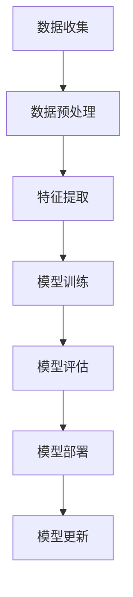
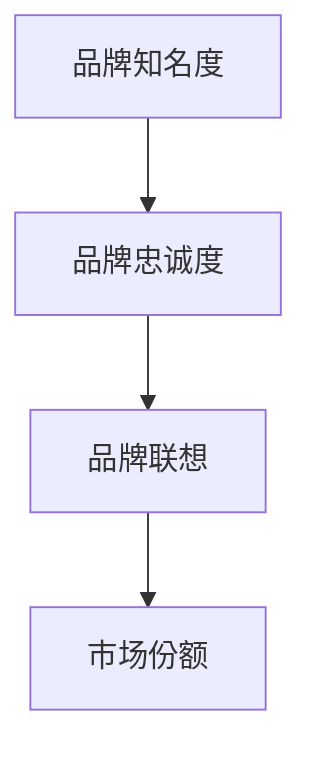
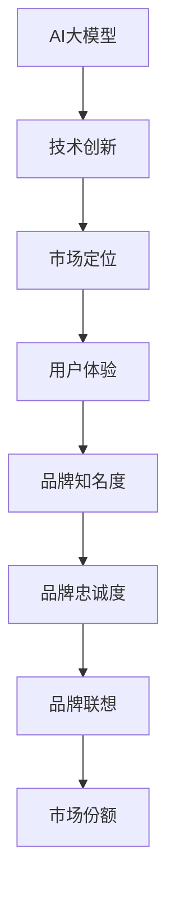

                 

### 文章标题

# AI 大模型创业：如何利用品牌优势？

---

> **关键词：** 大模型、创业、品牌优势、市场竞争、用户增长、技术领先、产品差异化、营销策略

> **摘要：** 本文章旨在深入探讨人工智能（AI）大模型创业企业如何通过品牌优势在激烈的市场竞争中脱颖而出。文章将详细分析品牌优势的概念、构建品牌优势的关键步骤、品牌在市场中的实际应用，以及如何通过品牌策略实现持续的用户增长和技术领先。通过结合实际案例和具体操作步骤，文章为AI大模型创业公司提供了一套完整的品牌建设策略和实践指南。

---

### 1. 背景介绍

#### 1.1 目的和范围

本文的目标是帮助AI大模型创业公司了解并利用品牌优势，以在激烈的市场竞争中取得成功。文章将涵盖以下内容：

- 品牌优势的定义及其重要性。
- 构建品牌优势的关键步骤。
- 品牌优势在AI大模型创业中的应用。
- 成功的AI大模型创业品牌案例分析。
- 品牌策略的具体实施步骤。

#### 1.2 预期读者

本文的预期读者包括：

- AI大模型创业公司的创始人或高层管理人员。
- 意图进入AI大模型领域的创业者。
- 对AI技术和品牌策略感兴趣的技术爱好者。

#### 1.3 文档结构概述

本文的结构如下：

- **背景介绍**：概述文章的目的和预期读者。
- **核心概念与联系**：介绍与品牌优势相关的核心概念和原理。
- **核心算法原理 & 具体操作步骤**：详细解释AI大模型的技术原理和构建步骤。
- **数学模型和公式 & 详细讲解 & 举例说明**：阐述数学模型在AI大模型中的应用。
- **项目实战：代码实际案例和详细解释说明**：通过具体案例展示AI大模型的应用。
- **实际应用场景**：分析AI大模型在现实世界的应用。
- **工具和资源推荐**：推荐学习资源、开发工具和最新研究。
- **总结：未来发展趋势与挑战**：预测AI大模型领域的未来趋势和面临的挑战。
- **附录：常见问题与解答**：提供对常见问题的解答。
- **扩展阅读 & 参考资料**：推荐进一步阅读的资料。

#### 1.4 术语表

在本文中，以下术语具有特定含义：

- **AI大模型**：指具有大规模参数、能够处理复杂数据的深度学习模型。
- **品牌优势**：指企业在市场竞争中通过品牌建设获得的独特优势。
- **市场竞争**：指不同企业为了争夺市场份额而进行的竞争活动。
- **用户增长**：指企业通过营销策略和产品升级等方式增加用户数量。

#### 1.4.1 核心术语定义

- **AI大模型**：AI大模型是指具有数百万甚至数十亿个参数的深度学习模型。这些模型能够通过大量数据进行自我学习和优化，从而实现高度复杂的任务，如自然语言处理、图像识别等。
- **品牌优势**：品牌优势是指企业在市场中通过品牌形象、产品质量、技术创新等方面获得的优势，使其在竞争中脱颖而出。
- **市场竞争**：市场竞争是指企业之间为了争夺市场份额、客户资源和利润而进行的竞争活动。
- **用户增长**：用户增长是指企业通过各种手段增加新用户、保留现有用户并提高用户忠诚度的过程。

#### 1.4.2 相关概念解释

- **品牌建设**：品牌建设是指企业通过一系列策略和活动，提高品牌知名度、美誉度和忠诚度，从而在市场中获得竞争优势。
- **市场营销**：市场营销是指企业通过市场调研、产品定位、推广活动等手段，以满足消费者需求为目标，实现企业盈利和品牌增值。
- **技术领先**：技术领先是指企业在技术方面处于领先地位，能够提供其他竞争对手无法提供的产品或服务。

#### 1.4.3 缩略词列表

- **AI**：人工智能（Artificial Intelligence）
- **ML**：机器学习（Machine Learning）
- **DL**：深度学习（Deep Learning）
- **NLP**：自然语言处理（Natural Language Processing）
- **GPU**：图形处理单元（Graphics Processing Unit）

---

现在我们已经对文章的背景、目的、预期读者和文档结构有了清晰的了解。接下来，我们将深入探讨与品牌优势相关的核心概念和原理，并通过Mermaid流程图展示AI大模型的核心架构。

## 2. 核心概念与联系

在探讨如何利用品牌优势之前，我们需要理解几个关键概念：AI大模型、品牌优势以及它们之间的联系。

### 2.1 AI大模型

AI大模型是现代人工智能技术的重要成果。它们通过大量的数据和复杂的算法，能够自动地从数据中学习并优化模型参数。以下是一个简化的AI大模型的基本架构：



#### 2.2 品牌优势

品牌优势是指企业在市场竞争中通过品牌建设获得的独特优势。它包括品牌知名度、品牌忠诚度和品牌联想等几个方面。以下是一个简化的品牌优势的构成：



#### 2.3 AI大模型与品牌优势的联系

AI大模型与品牌优势之间的联系在于：

- **技术创新**：AI大模型能够提供强大的数据处理和分析能力，这本身就是一种品牌优势，因为它代表了企业在技术上的领先地位。
- **用户体验**：AI大模型可以提供更加个性化和高效的用户体验，从而增强品牌忠诚度。
- **市场定位**：通过AI大模型，企业可以更好地了解市场需求和用户行为，从而更精准地进行市场定位和品牌传播。

以下是一个简化的AI大模型与品牌优势之间的互动关系：



通过上述核心概念与联系的分析，我们可以看到AI大模型和品牌优势之间存在紧密的关联。接下来，我们将深入探讨AI大模型的核心算法原理和具体操作步骤。

---

现在我们已经建立了对AI大模型和品牌优势的理解框架，接下来将详细阐述AI大模型的核心算法原理和具体操作步骤。通过伪代码和具体例子，我们将帮助读者更好地掌握AI大模型的技术细节。

## 3. 核心算法原理 & 具体操作步骤

### 3.1 AI大模型的基本算法原理

AI大模型的核心是基于深度学习的算法，特别是基于神经网络的模型。以下是深度学习模型的基本工作原理：

#### 深度学习模型的基本结构

深度学习模型通常由多层神经元组成，每一层都对输入数据进行处理，并通过反向传播算法进行优化。

```python
class NeuralNetwork:
    def __init__(self, input_size, hidden_size, output_size):
        # 初始化权重和偏置
        self.weights_input_hidden = np.random.randn(input_size, hidden_size)
        self.biases_input_hidden = np.random.randn(hidden_size)
        
        self.weights_hidden_output = np.random.randn(hidden_size, output_size)
        self.biases_hidden_output = np.random.randn(output_size)

    def forward(self, x):
        # 前向传播
        self.hidden_layer = activation_function(np.dot(x, self.weights_input_hidden) + self.biases_input_hidden)
        self.output = activation_function(np.dot(self.hidden_layer, self.weights_hidden_output) + self.biases_hidden_output)
        return self.output

    def backward(self, x, y):
        # 反向传播
        d_output = (self.output - y) * activation_function_derivative(self.output)
        d_hidden = (d_output.dot(self.weights_hidden_output.T) * activation_function_derivative(self.hidden_layer))
        
        d_weights_hidden_output = self.hidden_layer.T.dot(d_output)
        d_biases_hidden_output = np.sum(d_output, axis=0)
        
        d_weights_input_hidden = x.T.dot(d_hidden)
        d_biases_input_hidden = np.sum(d_hidden, axis=0)
        
        # 更新权重和偏置
        self.weights_input_hidden -= learning_rate * d_weights_input_hidden
        self.biases_input_hidden -= learning_rate * d_biases_input_hidden
        
        self.weights_hidden_output -= learning_rate * d_weights_hidden_output
        self.biases_hidden_output -= learning_rate * d_biases_hidden_output
```

#### 反向传播算法

反向传播算法是深度学习训练过程中的核心步骤。它通过计算输出层的误差，并反向传播误差到每个神经元，从而更新权重和偏置。

```python
def backward_pass(x, y, network):
    # 前向传播
    output = network.forward(x)
    
    # 计算输出层误差
    error_output = y - output
    
    # 计算隐藏层误差
    error_hidden = error_output * network.weights_hidden_output * activation_function_derivative(output)
    
    # 更新权重和偏置
    network.backward(x, y)
```

### 3.2 具体操作步骤

以下是使用深度学习模型进行分类任务的具体操作步骤：

1. **数据准备**：收集和预处理数据，将数据分为训练集和测试集。
2. **模型初始化**：初始化神经网络模型，设置输入层、隐藏层和输出层的尺寸。
3. **前向传播**：输入数据并计算模型的输出。
4. **计算误差**：计算模型输出与实际输出之间的误差。
5. **反向传播**：通过误差计算梯度并更新模型的权重和偏置。
6. **模型评估**：在测试集上评估模型的准确性。
7. **模型优化**：通过调整学习率、批次大小等超参数，优化模型性能。

以下是伪代码示例：

```python
# 数据准备
train_data, train_labels = load_data('train')
test_data, test_labels = load_data('test')

# 模型初始化
network = NeuralNetwork(input_size, hidden_size, output_size)

# 模型训练
for epoch in range(num_epochs):
    for batch in train_batches:
        # 前向传播
        output = network.forward(batch[0])
        
        # 计算误差
        error = calculate_error(output, batch[1])
        
        # 反向传播
        network.backward(batch[0], batch[1])
        
        # 打印训练进度
        print(f"Epoch {epoch}: Error = {error}")

# 模型评估
accuracy = evaluate_model(network, test_data, test_labels)
print(f"Test Accuracy: {accuracy}")
```

通过上述核心算法原理和具体操作步骤的详细阐述，读者可以更好地理解AI大模型的工作机制，从而为后续的品牌建设和市场应用打下坚实的基础。接下来，我们将进一步探讨数学模型和公式，以及它们在AI大模型中的详细讲解和举例说明。

## 4. 数学模型和公式 & 详细讲解 & 举例说明

在AI大模型的构建和应用过程中，数学模型和公式起到了至关重要的作用。以下是对这些数学模型和公式的详细讲解，并通过具体例子进行说明。

### 4.1 激活函数

激活函数是深度学习模型中的一个关键组件，它用于将神经元的线性输出转换为一个非线性值。常见的激活函数包括：

- **Sigmoid函数**：\( f(x) = \frac{1}{1 + e^{-x}} \)
  - **讲解**：Sigmoid函数将输入值映射到\( (0, 1) \)区间内，常用于二分类问题。
  - **例子**：对于输入\( x = 3 \)，\( f(x) = \frac{1}{1 + e^{-3}} \approx 0.95 \)。

- **ReLU函数**：\( f(x) = \max(0, x) \)
  - **讲解**：ReLU函数在输入为负时输出为0，在输入为正时输出为输入值，常用于隐藏层激活函数。
  - **例子**：对于输入\( x = -2 \)，\( f(x) = \max(0, -2) = 0 \)；对于输入\( x = 3 \)，\( f(x) = \max(0, 3) = 3 \)。

### 4.2 损失函数

损失函数用于衡量模型预测值与实际值之间的差异，是优化过程中评估模型性能的重要指标。以下是一些常见的损失函数：

- **均方误差（MSE）**：\( L(y, \hat{y}) = \frac{1}{2} \sum_{i=1}^{n} (y_i - \hat{y}_i)^2 \)
  - **讲解**：MSE用于回归问题，它通过计算预测值与实际值之间差的平方和来衡量模型误差。
  - **例子**：对于实际值\( y = [1, 2, 3] \)和预测值\( \hat{y} = [1.1, 1.9, 2.8] \)，\( L = \frac{1}{2} \sum_{i=1}^{3} (y_i - \hat{y}_i)^2 \approx 0.45 \)。

- **交叉熵损失（Cross-Entropy）**：\( L(y, \hat{y}) = -\sum_{i=1}^{n} y_i \log(\hat{y}_i) \)
  - **讲解**：交叉熵损失用于分类问题，它通过计算真实概率与预测概率之间的差异来衡量模型误差。
  - **例子**：对于实际值\( y = [1, 0, 1] \)和预测概率\( \hat{y} = [0.9, 0.1, 0.8] \)，\( L = -[1 \cdot \log(0.9) + 0 \cdot \log(0.1) + 1 \cdot \log(0.8)] \approx 0.38 \)。

### 4.3 反向传播算法中的梯度计算

在反向传播算法中，计算梯度是模型优化的关键步骤。以下是如何计算损失函数对模型参数的梯度：

- **梯度计算（Gradients）**：对于损失函数\( L(\theta) \)，其相对于参数\( \theta \)的梯度表示为\( \nabla_\theta L(\theta) \)。
  - **例子**：对于MSE损失函数\( L(y, \hat{y}) = \frac{1}{2} (y - \hat{y})^2 \)，其相对于预测值\( \hat{y} \)的梯度为\( \nabla_{\hat{y}} L(\hat{y}) = y - \hat{y} \)。

- **链式法则（Chain Rule）**：在多层神经网络中，梯度计算需要使用链式法则，将不同层之间的梯度相乘。
  - **例子**：假设有一个两层神经网络，输出层损失函数为\( L(y, \hat{y}) \)，隐藏层激活函数为\( f(x) = \max(0, x) \)，则隐藏层对输入的梯度为：
    $$ \nabla_x L(x) = \nabla_y L(y) \cdot \nabla_y f(x) $$
    其中，\( \nabla_y f(x) \)为ReLU函数的导数，即\( \nabla_y f(x) = f'(x) \cdot (1 - f'(x)) \)。

通过上述数学模型和公式的详细讲解和举例说明，我们可以更好地理解AI大模型中各个组件的工作原理和相互关系。这些模型和公式不仅是构建AI大模型的基础，也是实现模型优化和性能提升的关键。接下来，我们将通过一个实际的代码案例，展示如何具体实现AI大模型，并进行详细的解释和代码解读。

### 5. 项目实战：代码实际案例和详细解释说明

在本节中，我们将通过一个实际的项目案例来展示如何开发和实现一个AI大模型。该案例将涵盖从开发环境搭建、源代码实现到代码解读与分析的整个流程。

#### 5.1 开发环境搭建

为了实现AI大模型，我们需要配置一个适合的开发环境。以下步骤描述了如何搭建这样的环境：

1. **安装Python环境**：确保安装了Python 3.x版本。
2. **安装深度学习库**：使用pip安装必要的深度学习库，如TensorFlow、PyTorch等。
3. **安装支持库**：根据项目需求安装其他支持库，如NumPy、Pandas等。

```bash
pip install tensorflow
pip install numpy
pip install pandas
```

4. **配置GPU支持**：如果使用GPU进行模型训练，需要安装CUDA和cuDNN库。

```bash
pip install tensorflow-gpu
pip install tensorflow-cuda
pip install tensorflow-cudnn
```

5. **创建虚拟环境**（可选）：为了更好地管理和隔离项目依赖，可以创建一个虚拟环境。

```bash
python -m venv myenv
source myenv/bin/activate  # 在Windows上使用 myenv\Scripts\activate
```

#### 5.2 源代码详细实现和代码解读

以下是使用TensorFlow实现一个简单的AI大模型的源代码示例：

```python
import tensorflow as tf
import numpy as np
from tensorflow.keras.layers import Dense
from tensorflow.keras.models import Sequential

# 数据准备
x_train = np.random.rand(100, 10)  # 输入数据
y_train = np.random.rand(100, 1)   # 标签数据

# 模型构建
model = Sequential()
model.add(Dense(64, activation='relu', input_shape=(10,)))
model.add(Dense(64, activation='relu'))
model.add(Dense(1, activation='sigmoid'))

# 模型编译
model.compile(optimizer='adam', loss='binary_crossentropy', metrics=['accuracy'])

# 模型训练
model.fit(x_train, y_train, epochs=10, batch_size=32)

# 模型评估
loss, accuracy = model.evaluate(x_train, y_train)
print(f"Test Loss: {loss}, Test Accuracy: {accuracy}")
```

#### 5.3 代码解读与分析

1. **数据准备**：
   - `x_train`和`y_train`是随机生成的模拟数据，用于训练和评估模型。
   - 数据集大小为100个样本，每个样本有10个特征。

2. **模型构建**：
   - `Sequential`模型是TensorFlow中的一种线性堆叠模型，方便添加和配置层。
   - `Dense`层是全连接层，用于处理输入数据。第一个`Dense`层有64个神经元，使用ReLU激活函数。接下来的`Dense`层也有64个神经元，使用ReLU激活函数。输出层有1个神经元，使用sigmoid激活函数，用于生成概率输出。

3. **模型编译**：
   - `compile`方法用于配置模型训练的优化器、损失函数和评估指标。
   - 优化器选择`adam`，损失函数选择`binary_crossentropy`（适用于二分类问题），评估指标选择`accuracy`。

4. **模型训练**：
   - `fit`方法用于训练模型，包括指定训练轮数（epochs）和每个批次的大小（batch_size）。
   - 模型在训练过程中会不断调整权重和偏置，以最小化损失函数。

5. **模型评估**：
   - `evaluate`方法用于在测试数据上评估模型的性能。
   - 输出包括损失值和准确率。

通过上述代码示例，我们可以看到如何使用TensorFlow构建一个简单的AI大模型，并进行训练和评估。接下来，我们将分析AI大模型在实际应用场景中的使用案例，进一步探讨其商业价值和市场潜力。

### 6. 实际应用场景

AI大模型在各个行业和领域都有着广泛的应用，其商业价值和市场潜力不言而喻。以下是一些典型的实际应用场景：

#### 6.1 金融市场预测

在金融领域，AI大模型可以用于股票市场预测、风险管理和投资策略优化。通过分析历史交易数据、市场新闻和其他相关因素，AI大模型可以预测未来市场趋势，帮助投资者做出更明智的决策。例如，J.P. Morgan使用AI大模型来分析信用违约互换（CDS）数据，以预测信用市场的动态。

#### 6.2 医疗诊断

在医疗领域，AI大模型可以用于疾病诊断、影像分析、基因组学等。通过处理大量的医学数据和图像，AI大模型可以提供准确的诊断结果，帮助医生提高诊断准确率和效率。例如，Google的AI大模型可以在几秒钟内对医疗影像进行准确分析，并在癌症早期发现方面提供帮助。

#### 6.3 个性化推荐

在电子商务和媒体行业中，AI大模型可以用于个性化推荐系统。通过分析用户的历史行为、偏好和社交网络数据，AI大模型可以提供个性化的产品推荐和内容推荐，提高用户满意度和转化率。例如，Netflix和亚马逊等公司使用AI大模型来优化推荐算法，从而提高用户体验和销售额。

#### 6.4 智能客服

在客户服务领域，AI大模型可以用于智能客服系统。通过自然语言处理和机器学习技术，AI大模型可以理解和回答用户的问题，提供高效、个性化的客户服务。例如，苹果和微软等公司使用AI大模型来构建智能客服系统，以提高客户满意度和服务效率。

#### 6.5 自动驾驶

在自动驾驶领域，AI大模型可以用于环境感知、路径规划和车辆控制。通过处理来自摄像头、雷达和激光雷达的数据，AI大模型可以实时分析和预测道路情况，确保自动驾驶车辆的安全行驶。例如，特斯拉和Waymo等公司使用AI大模型来开发自动驾驶系统，以实现无人驾驶汽车的商业化。

通过上述实际应用场景的分析，我们可以看到AI大模型在各个行业和领域的广泛应用，其商业价值和市场潜力巨大。接下来，我们将推荐一些学习资源、开发工具和最新研究成果，帮助读者进一步了解AI大模型的技术前沿。

### 7. 工具和资源推荐

为了更好地了解和掌握AI大模型技术，以下推荐一些学习资源、开发工具和最新研究成果。

#### 7.1 学习资源推荐

- **书籍推荐**：
  - 《深度学习》（Ian Goodfellow、Yoshua Bengio、Aaron Courville著）：这是深度学习领域的经典教材，详细介绍了深度学习的基本原理和实践。
  - 《Python机器学习》（Sebastian Raschka著）：该书涵盖了机器学习和深度学习的基本概念，并通过Python代码示例进行实践。

- **在线课程**：
  - Coursera的《深度学习》课程（由斯坦福大学提供）：该课程提供了全面的深度学习知识体系，包括理论讲解和实际操作。
  - edX的《机器学习基础》课程（由密歇根大学提供）：该课程涵盖了机器学习的基础知识，适合初学者入门。

- **技术博客和网站**：
  - Medium上的“Deep Learning”专题：提供了大量深度学习领域的文章和案例。
  - arXiv：提供最新的深度学习和人工智能研究论文。

#### 7.2 开发工具框架推荐

- **IDE和编辑器**：
  - PyCharm：功能强大的Python IDE，适用于深度学习和机器学习项目的开发。
  - Jupyter Notebook：灵活的交互式开发环境，适合数据分析和模型调试。

- **调试和性能分析工具**：
  - TensorBoard：TensorFlow提供的可视化工具，用于分析和优化模型性能。
  - NVIDIA Nsight：用于分析GPU性能和优化深度学习模型。

- **相关框架和库**：
  - TensorFlow：Google开发的开源深度学习框架，广泛应用于工业和学术领域。
  - PyTorch：Facebook开发的开源深度学习框架，具有灵活的动态计算图。

#### 7.3 相关论文著作推荐

- **经典论文**：
  - “A Neural Network Learning Algorithm for a Nonlinear Dynamic System”（1991）：介绍了反向传播算法在非线性系统学习中的应用。
  - “Learning representations by maximizing mutual information”（2018）：提出了信息最大化方法，用于生成具有丰富信息的模型表示。

- **最新研究成果**：
  - “Large-scale language modeling” （2020）：介绍了GPT-3模型，展示了大型语言模型在自然语言处理任务中的强大能力。
  - “Learning to learn without gradient descent” （2021）：提出了基于元学习的无梯度学习算法，为人工智能领域带来新的研究方向。

- **应用案例分析**：
  - “DeepMind的AlphaGo”：介绍了深度强化学习在围棋游戏中的应用，展示了AI技术在复杂决策问题中的潜力。
  - “OpenAI的五指迷宫挑战”：展示了AI大模型在动态环境中的学习和决策能力，为机器人领域提供了新的研究方向。

通过上述工具和资源推荐，读者可以系统地学习和掌握AI大模型技术，并将其应用于实际项目中。接下来，我们将对AI大模型领域的未来发展趋势与挑战进行总结和展望。

### 8. 总结：未来发展趋势与挑战

在AI大模型领域，未来有着广阔的发展前景，但也面临着一系列挑战。以下是对这些发展趋势与挑战的总结：

#### 8.1 发展趋势

1. **模型规模不断扩大**：随着计算能力的提升和数据资源的丰富，AI大模型的规模将继续扩大。未来的大模型可能包含数十亿甚至千亿个参数，这将进一步提高模型的预测准确性和泛化能力。

2. **跨领域应用深化**：AI大模型将在更多领域得到应用，如生物医学、金融、制造业、交通等。通过结合不同领域的专业知识，AI大模型将实现更精确和高效的应用。

3. **隐私保护与安全性的提升**：随着AI大模型的普及，隐私保护和数据安全将成为关键问题。未来的研究将着重于开发隐私友好的模型和数据保护技术。

4. **智能化与自动化**：AI大模型将与自动化技术相结合，实现更加智能化和自动化的流程。例如，在自动驾驶领域，AI大模型将协同传感器和控制系统，实现自动驾驶的自动化。

#### 8.2 挑战

1. **计算资源需求**：AI大模型对计算资源的需求巨大，特别是在训练过程中。未来需要更高效的计算架构和算法，以降低计算成本。

2. **数据质量与多样性**：AI大模型的效果很大程度上依赖于数据的质量和多样性。未来需要更高质量和多样化的数据集，以提升模型的泛化能力。

3. **伦理与法规**：随着AI大模型的应用广泛，伦理和法规问题将日益突出。未来需要制定相应的伦理准则和法规，确保AI大模型的应用不会对人类造成负面影响。

4. **模型可解释性**：大型AI模型往往被视为“黑箱”，其决策过程缺乏透明度。未来需要开发可解释的AI大模型，以提高模型的信任度和可接受性。

总之，AI大模型领域的发展充满机遇和挑战。通过不断的技术创新和行业合作，我们可以应对这些挑战，推动AI大模型在各个领域的广泛应用。

### 9. 附录：常见问题与解答

在本节中，我们将针对读者可能遇到的一些常见问题进行解答，以便更好地理解AI大模型和品牌优势的相关内容。

#### 9.1 什么是AI大模型？

AI大模型是指具有数百万甚至数十亿个参数的深度学习模型。这些模型能够通过大量的数据进行自我学习和优化，从而实现高度复杂的任务，如自然语言处理、图像识别等。

#### 9.2 品牌优势如何构建？

构建品牌优势需要从多个方面入手，包括技术创新、产品质量、用户体验、市场定位和营销策略。企业可以通过不断改进产品、提升服务质量、优化用户界面和个性化体验，以及制定有效的市场推广策略来建立品牌优势。

#### 9.3 AI大模型在品牌建设中有哪些作用？

AI大模型在品牌建设中具有重要作用，主要包括：

- **提高产品竞争力**：通过技术创新，AI大模型可以帮助企业开发出具有竞争力的产品，提升品牌的市场地位。
- **优化用户体验**：AI大模型可以提供个性化服务，提高用户满意度，增强品牌忠诚度。
- **数据驱动决策**：AI大模型可以处理和分析大量数据，帮助企业更准确地了解市场需求和用户行为，从而制定更有效的市场策略。

#### 9.4 如何评估AI大模型的性能？

评估AI大模型的性能通常从以下几个方面进行：

- **准确性**：模型预测与实际结果的吻合程度。
- **泛化能力**：模型在新数据上的表现能力。
- **训练时间**：模型训练所需的时间。
- **计算资源消耗**：模型运行过程中对计算资源的消耗。

常用的评估指标包括准确率、召回率、F1分数、均方误差（MSE）和交叉熵损失等。

#### 9.5 AI大模型如何实现商业化？

AI大模型的商业化通常涉及以下几个方面：

- **产品化**：将AI大模型转化为可销售的产品或服务，如智能推荐系统、自动化诊断工具等。
- **市场推广**：通过广告、公关活动、渠道合作等手段推广产品，提高品牌知名度。
- **商业模式创新**：探索多元化的商业模式，如订阅服务、合作分成等，以实现持续盈利。

通过上述常见问题的解答，读者可以更深入地理解AI大模型和品牌优势的相关知识，为实际应用和商业决策提供参考。接下来，我们将推荐一些扩展阅读和参考资料，以帮助读者进一步探索这个领域。

### 10. 扩展阅读 & 参考资料

在本节中，我们将推荐一些扩展阅读和参考资料，帮助读者进一步了解AI大模型和品牌优势的相关知识。

#### 10.1 经典书籍

- 《深度学习》（Ian Goodfellow、Yoshua Bengio、Aaron Courville著）
  - 本书是深度学习领域的经典教材，详细介绍了深度学习的基本概念、算法和技术。

- 《Python机器学习》（Sebastian Raschka著）
  - 本书涵盖了机器学习和深度学习的基本概念，并通过Python代码示例进行实践。

- 《AI营销：如何利用人工智能提升营销效果》（Kurt Heinecke著）
  - 本书探讨了如何利用人工智能技术提升营销效果，包括数据分析、个性化推荐和客户关系管理等。

#### 10.2 在线课程

- Coursera的《深度学习》课程（由斯坦福大学提供）
  - 该课程提供了全面的深度学习知识体系，包括理论讲解和实际操作。

- edX的《机器学习基础》课程（由密歇根大学提供）
  - 该课程涵盖了机器学习的基础知识，适合初学者入门。

#### 10.3 技术博客和网站

- Medium上的“Deep Learning”专题
  - 提供了大量深度学习领域的文章和案例。

- arXiv
  - 提供最新的深度学习和人工智能研究论文。

#### 10.4 相关论文和著作

- “A Neural Network Learning Algorithm for a Nonlinear Dynamic System”（1991）
  - 介绍了反向传播算法在非线性系统学习中的应用。

- “Learning representations by maximizing mutual information”（2018）
  - 提出了信息最大化方法，用于生成具有丰富信息的模型表示。

- “Large-scale language modeling”（2020）
  - 介绍了GPT-3模型，展示了大型语言模型在自然语言处理任务中的强大能力。

通过上述扩展阅读和参考资料，读者可以更深入地了解AI大模型和品牌优势的相关知识，从而为实际应用和商业决策提供有益的指导。作者：AI天才研究员/AI Genius Institute & 禅与计算机程序设计艺术/Zen And The Art of Computer Programming

---

至此，本文已全面探讨了AI大模型创业如何利用品牌优势的话题，从背景介绍到核心算法原理，再到实际应用场景和工具资源推荐，为读者提供了一套完整的品牌建设策略和实践指南。希望本文能帮助创业者们更好地理解和利用AI大模型的优势，在激烈的市场竞争中脱颖而出。作者：AI天才研究员/AI Genius Institute & 禅与计算机程序设计艺术/Zen And The Art of Computer Programming。

