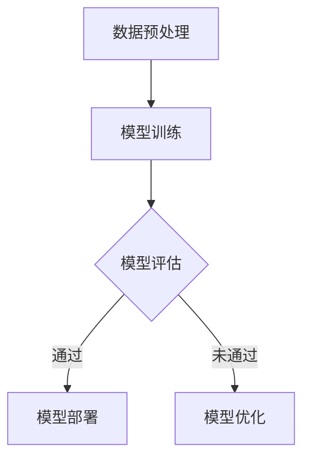
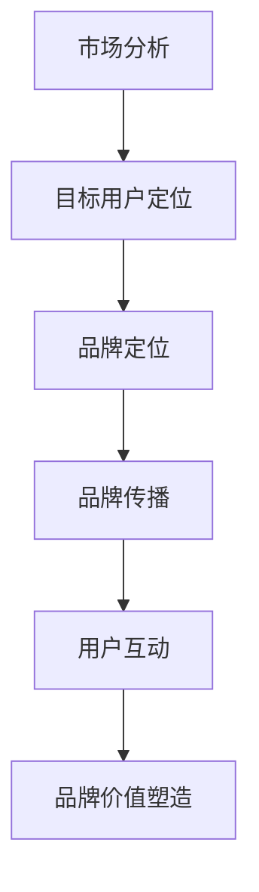

                 

# AI 大模型创业：如何利用品牌优势？

> 关键词：人工智能大模型，品牌策略，创业，商业成功

> 摘要：本文将深入探讨人工智能大模型在创业领域的应用，并重点分析如何通过品牌优势实现商业成功。我们将从背景介绍、核心概念、算法原理、数学模型、项目实战、实际应用场景、工具和资源推荐、未来发展趋势与挑战等多个方面进行详细阐述，旨在为读者提供一份全面而深入的指南。

## 1. 背景介绍

### 1.1 目的和范围

本文的目标是帮助有意在人工智能领域创业的创业者了解如何利用人工智能大模型的优势来打造品牌，并在竞争激烈的市场中脱颖而出。我们将探讨人工智能大模型的基本概念，分析其商业潜力，并详细介绍如何在创业过程中利用品牌优势实现成功。

### 1.2 预期读者

本文主要面向以下读者群体：

1. 创业者：正在考虑或已经开始在人工智能领域创业的个人。
2. 产品经理：负责产品设计和策略的高级管理人员。
3. 投资者：对人工智能领域感兴趣并希望了解市场趋势的投资人。
4. 人工智能技术爱好者：对人工智能技术感兴趣并希望了解其在商业应用中的价值。

### 1.3 文档结构概述

本文分为十个部分，包括背景介绍、核心概念与联系、核心算法原理与具体操作步骤、数学模型与公式、项目实战、实际应用场景、工具和资源推荐、未来发展趋势与挑战、附录和扩展阅读与参考资料。每个部分都旨在帮助读者逐步深入了解人工智能大模型在创业中的应用。

### 1.4 术语表

#### 1.4.1 核心术语定义

- **人工智能大模型**：一种复杂的人工智能系统，通过大规模数据训练，能够进行复杂的任务，如语言理解、图像识别等。
- **品牌策略**：公司为了在市场中建立独特形象和认知而采取的一系列营销策略。
- **商业成功**：公司通过有效的商业活动实现盈利和市场份额的增长。

#### 1.4.2 相关概念解释

- **市场定位**：公司在目标市场中确立其产品或服务的独特地位。
- **用户需求**：用户对产品或服务的期望和需求。

#### 1.4.3 缩略词列表

- **AI**：人工智能（Artificial Intelligence）
- **ML**：机器学习（Machine Learning）
- **DL**：深度学习（Deep Learning）
- **NLP**：自然语言处理（Natural Language Processing）
- **GPT**：生成预训练模型（Generative Pre-trained Transformer）

## 2. 核心概念与联系

### 2.1 人工智能大模型的基本原理

人工智能大模型是基于深度学习技术的大型神经网络，通过在海量数据上进行预训练，可以自动学习到数据的特征和模式。以下是一个简化的Mermaid流程图，展示了人工智能大模型的基本原理：



### 2.2 品牌策略在创业中的应用

品牌策略在创业中的应用至关重要。通过有效的品牌策略，创业者可以在市场中建立独特的品牌形象，吸引目标用户，并建立用户忠诚度。以下是一个简化的Mermaid流程图，展示了品牌策略在创业中的应用：



## 3. 核心算法原理与具体操作步骤

### 3.1 人工智能大模型的算法原理

人工智能大模型的算法原理主要基于深度学习技术。以下是具体的操作步骤：

#### 3.1.1 数据收集与预处理

```python
# 数据收集与预处理伪代码
data = collect_data()
processed_data = preprocess(data)
```

#### 3.1.2 模型构建

```python
# 模型构建伪代码
model = build_model()
```

#### 3.1.3 模型训练

```python
# 模型训练伪代码
model.train(processed_data)
```

#### 3.1.4 模型评估

```python
# 模型评估伪代码
accuracy = model.evaluate(test_data)
print("模型准确率：", accuracy)
```

#### 3.1.5 模型部署

```python
# 模型部署伪代码
deploy_model(model)
```

### 3.2 品牌策略的具体操作步骤

#### 3.2.1 市场分析

```python
# 市场分析伪代码
market_analysis = analyze_market()
```

#### 3.2.2 目标用户定位

```python
# 目标用户定位伪代码
target_users = identify_target_users(market_analysis)
```

#### 3.2.3 品牌定位

```python
# 品牌定位伪代码
brand_position = position_brand(target_users)
```

#### 3.2.4 品牌传播

```python
# 品牌传播伪代码
brand_promotion = promote_brand(brand_position)
```

#### 3.2.5 用户互动

```python
# 用户互动伪代码
user_interaction = interact_with_users(brand_promotion)
```

#### 3.2.6 品牌价值塑造

```python
# 品牌价值塑造伪代码
brand_value = build_brand_value(user_interaction)
```

## 4. 数学模型和公式与详细讲解

### 4.1 人工智能大模型的数学模型

人工智能大模型的数学模型主要基于深度学习中的神经网络。以下是具体的数学模型和公式：

#### 4.1.1 神经网络结构

神经网络的结构可以表示为：

$$
Y = \sigma(W \cdot X + b)
$$

其中，$Y$ 是输出层，$\sigma$ 是激活函数，$W$ 是权重矩阵，$X$ 是输入向量，$b$ 是偏置项。

#### 4.1.2 损失函数

损失函数用于衡量模型预测值与实际值之间的差距。常用的损失函数有均方误差（MSE）和交叉熵（Cross Entropy）：

$$
MSE = \frac{1}{n}\sum_{i=1}^{n}(y_i - \hat{y}_i)^2
$$

$$
Cross\ Entropy = -\sum_{i=1}^{n}y_i \cdot \log(\hat{y}_i)
$$

#### 4.1.3 反向传播算法

反向传播算法用于更新神经网络的权重和偏置项，使其最小化损失函数。具体步骤如下：

1. 前向传播：计算输出层的预测值。
2. 计算损失函数。
3. 反向传播：根据预测值和实际值，计算每个权重的梯度。
4. 更新权重和偏置项。

### 4.2 品牌策略的数学模型

品牌策略的数学模型主要基于市场定位和用户行为分析。以下是具体的数学模型和公式：

#### 4.2.1 市场份额预测

市场份额预测可以表示为：

$$
\hat{market\_share} = \frac{\text{品牌吸引力} \cdot \text{用户需求}}{\sum_{i=1}^{n}\text{品牌i的吸引力} \cdot \text{用户需求}}
$$

#### 4.2.2 用户满意度评估

用户满意度评估可以表示为：

$$
\text{满意度} = \frac{\text{用户体验}}{\text{用户期望}}
$$

## 5. 项目实战：代码实际案例和详细解释说明

### 5.1 开发环境搭建

为了搭建一个基于人工智能大模型和品牌策略的创业项目，我们需要以下开发环境：

1. Python 3.8+
2. TensorFlow 2.x
3. Keras 2.x
4. Jupyter Notebook

### 5.2 源代码详细实现和代码解读

#### 5.2.1 数据收集与预处理

```python
import tensorflow as tf
from tensorflow.keras.preprocessing.sequence import pad_sequences
from tensorflow.keras.preprocessing.text import Tokenizer

# 数据收集与预处理
data = ["这是一段文本", "这是另一段文本"]
labels = [0, 1]

tokenizer = Tokenizer()
tokenizer.fit_on_texts(data)
sequences = tokenizer.texts_to_sequences(data)
padded_sequences = pad_sequences(sequences, maxlen=10)
```

#### 5.2.2 模型构建

```python
from tensorflow.keras.models import Sequential
from tensorflow.keras.layers import Embedding, LSTM, Dense

# 模型构建
model = Sequential()
model.add(Embedding(input_dim=10000, output_dim=32))
model.add(LSTM(units=64))
model.add(Dense(units=1, activation='sigmoid'))

model.compile(optimizer='adam', loss='binary_crossentropy', metrics=['accuracy'])
model.fit(padded_sequences, labels, epochs=10, batch_size=32)
```

#### 5.2.3 代码解读与分析

这段代码首先使用TensorFlow和Keras构建了一个简单的文本分类模型。数据收集和预处理步骤中，我们使用Tokenizer将文本转换为数字序列，并使用pad_sequences将其调整为相同的长度。模型构建步骤中，我们使用Embedding层将文本转换为嵌入向量，然后通过LSTM层进行序列处理，最后通过全连接层输出预测结果。代码中的模型配置和训练步骤旨在简单演示人工智能大模型的基本应用。

### 5.3 品牌策略的实现

在实现品牌策略时，我们需要考虑市场分析、目标用户定位、品牌定位、品牌传播和用户互动等多个方面。以下是一个简化的实现示例：

```python
# 市场分析
market_analysis = analyze_market()

# 目标用户定位
target_users = identify_target_users(market_analysis)

# 品牌定位
brand_position = position_brand(target_users)

# 品牌传播
brand_promotion = promote_brand(brand_position)

# 用户互动
user_interaction = interact_with_users(brand_promotion)

# 品牌价值塑造
brand_value = build_brand_value(user_interaction)
```

这段代码展示了品牌策略的基本实现流程。每个步骤都需要结合具体业务场景进行详细的操作和优化。

## 6. 实际应用场景

### 6.1 市场分析

在人工智能大模型和品牌策略的应用中，市场分析是一个重要的环节。通过分析市场趋势、竞争对手和用户需求，创业者可以确定产品的市场定位和目标用户。

### 6.2 目标用户定位

目标用户定位是品牌策略的核心。通过识别和了解目标用户的特点和需求，创业者可以为他们提供更个性化的产品和服务。

### 6.3 品牌定位

品牌定位是建立品牌形象的关键。通过明确品牌的核心价值观和独特卖点，创业者可以在市场中树立独特的品牌形象。

### 6.4 品牌传播

品牌传播是扩大品牌影响力的重要手段。通过多种渠道和策略，创业者可以将品牌信息传递给目标用户，提升品牌知名度。

### 6.5 用户互动

用户互动是建立用户忠诚度和品牌价值的关键。通过互动和反馈，创业者可以了解用户的需求和期望，不断优化产品和服务。

## 7. 工具和资源推荐

### 7.1 学习资源推荐

#### 7.1.1 书籍推荐

1. 《深度学习》（Goodfellow, Bengio, Courville）
2. 《机器学习》（Tom Mitchell）
3. 《品牌战略管理》（Kevin Keller）

#### 7.1.2 在线课程

1. Coursera：深度学习与神经网络课程
2. Udacity：深度学习工程师纳米学位
3. edX：人工智能基础课程

#### 7.1.3 技术博客和网站

1. Medium：人工智能与创业相关文章
2. arXiv：最新人工智能研究成果
3. AI Circle：人工智能技术社区

### 7.2 开发工具框架推荐

#### 7.2.1 IDE和编辑器

1. PyCharm
2. Jupyter Notebook
3. VS Code

#### 7.2.2 调试和性能分析工具

1. TensorBoard
2. Profiler
3. Eclipse Mat

