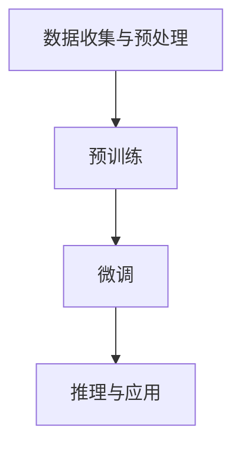

                 

# AI 大模型创业：如何利用国际优势？

> **关键词：** AI大模型，国际优势，创业，技术转移，市场拓展，创新策略

> **摘要：** 本文章将探讨AI大模型创业过程中的国际优势，分析如何通过技术转移、市场拓展和不断创新策略，在全球范围内实现AI大模型的商业成功。我们将详细阐述国际市场环境、核心算法原理、项目实战案例以及未来发展趋势，为创业者提供有价值的参考和指导。

## 1. 背景介绍

### 1.1 目的和范围

本文旨在为正在考虑AI大模型创业的个人或团队提供战略指导，帮助他们充分利用国际市场的优势，实现商业成功。我们将从市场分析、技术转移、创新策略等方面进行深入探讨，为创业者提供实用的方法和思路。

### 1.2 预期读者

- 想要在国际市场开展AI大模型业务的创业者
- 技术团队负责人和CTO
- 对AI大模型技术感兴趣的技术爱好者
- 高等教育机构的学生和研究人员

### 1.3 文档结构概述

本文将分为以下几大部分：

1. **背景介绍**：介绍本文的目的、范围和预期读者，概述文章结构。
2. **核心概念与联系**：介绍AI大模型的基本概念，并使用Mermaid流程图展示其架构。
3. **核心算法原理 & 具体操作步骤**：详细讲解AI大模型的核心算法原理，使用伪代码进行描述。
4. **数学模型和公式 & 详细讲解 & 举例说明**：阐述AI大模型中的数学模型和公式，并提供具体实例。
5. **项目实战：代码实际案例和详细解释说明**：展示一个具体的AI大模型项目，详细解释代码实现。
6. **实际应用场景**：探讨AI大模型在不同领域的应用。
7. **工具和资源推荐**：推荐学习资源、开发工具和相关论文。
8. **总结：未来发展趋势与挑战**：分析未来发展趋势和面临的挑战。
9. **附录：常见问题与解答**：回答读者可能关心的问题。
10. **扩展阅读 & 参考资料**：提供更多有价值的阅读材料。

### 1.4 术语表

#### 1.4.1 核心术语定义

- **AI大模型**：指参数规模庞大、计算复杂度高的深度学习模型，如GPT、BERT等。
- **技术转移**：指将研究成果和技术经验从一个领域或地区转移到另一个领域或地区。
- **市场拓展**：指企业在不同国家和地区开展业务，扩大市场份额。
- **创新策略**：指企业在产品研发、市场营销等方面采取的创新方法和措施。

#### 1.4.2 相关概念解释

- **国际市场**：指企业开展业务的国家或地区，不包括本国或本地区。
- **竞争优势**：指企业在市场上相对于竞争对手的优势条件，如技术、品牌、成本等。
- **商业成功**：指企业在市场中获得的经济效益和品牌影响力。

#### 1.4.3 缩略词列表

- **AI**：人工智能
- **GPT**：生成预训练变换器
- **BERT**：双向编码表示器
- **CTO**：首席技术官

## 2. 核心概念与联系

AI大模型是当前人工智能领域的热点话题，其核心概念主要包括：

- **神经网络**：一种通过模拟人脑神经元连接方式进行信息处理的技术。
- **深度学习**：一种基于神经网络的机器学习技术，通过多层神经网络对大量数据进行训练，实现自动特征提取和模式识别。
- **预训练**：在特定任务上进行大规模数据训练，以获得良好的通用特征表示。
- **微调**：在特定任务上进行少量数据训练，调整预训练模型的参数，以适应特定任务。

AI大模型的架构通常包括以下几个层次：

1. **数据收集与预处理**：收集大量文本、图像、音频等数据，进行数据清洗、去重、标注等预处理操作。
2. **预训练**：使用大规模数据集对神经网络模型进行预训练，以获得通用特征表示。
3. **微调**：在特定任务上进行少量数据训练，调整预训练模型的参数，以适应特定任务。
4. **推理与应用**：使用训练好的模型进行推理和预测，实现具体任务。

下面是AI大模型的Mermaid流程图表示：



## 3. 核心算法原理 & 具体操作步骤

AI大模型的核心算法原理主要基于深度学习和神经网络。下面我们使用伪代码详细阐述其基本结构和操作步骤。

```python
# 伪代码：AI大模型核心算法原理

# 步骤1：数据收集与预处理
def data_preprocessing(data):
    # 数据清洗、去重、标注等预处理操作
    return processed_data

# 步骤2：预训练
def pre_training(processed_data):
    # 使用大规模数据集对神经网络模型进行预训练
    model = neural_network()
    model.fit(processed_data)
    return model

# 步骤3：微调
def fine_tuning(model, task_specific_data):
    # 在特定任务上进行少量数据训练，调整预训练模型的参数
    model.fit(task_specific_data)
    return model

# 步骤4：推理与应用
def inference(model, input_data):
    # 使用训练好的模型进行推理和预测
    prediction = model.predict(input_data)
    return prediction
```

### 详细解释：

1. **数据收集与预处理**：首先，我们需要收集大量高质量的数据，并进行清洗、去重、标注等预处理操作，以便为后续的预训练和微调提供良好的数据基础。

2. **预训练**：使用预处理后的数据集对神经网络模型进行预训练。预训练过程主要目的是让模型学习到通用特征表示，提高其在各种任务上的适应性。

3. **微调**：在预训练完成后，我们需要在特定任务上进行微调，以适应特定任务的需求。微调过程中，模型会根据新数据集调整参数，进一步提高任务性能。

4. **推理与应用**：微调完成后，我们可以使用训练好的模型进行推理和预测。在应用过程中，模型会根据输入数据生成预测结果，实现具体任务。

## 4. 数学模型和公式 & 详细讲解 & 举例说明

AI大模型中的数学模型主要包括神经网络、深度学习和预训练等内容。下面我们使用LaTeX格式详细阐述相关数学公式，并提供具体实例。

### 4.1 神经网络

神经网络是AI大模型的核心组成部分，其基本结构如下：

$$
\begin{aligned}
    y &= \sigma(\sum_{i=1}^{n} w_i \cdot x_i) \\
    w_i &= \theta \cdot x_i \\
    \sigma &= \sigma(\cdot) \text{（激活函数）}
\end{aligned}
$$

其中，$y$表示输出，$\sigma(\cdot)$表示激活函数，$w_i$表示权重，$x_i$表示输入特征。

### 4.2 深度学习

深度学习是神经网络在多层结构上的扩展，其基本结构如下：

$$
\begin{aligned}
    y &= \sigma(\sum_{i=1}^{n} w_i \cdot \sigma(\sum_{j=1}^{m} w_j \cdot x_j)) \\
    w_i &= \theta \cdot \sigma(\sum_{j=1}^{m} w_j \cdot x_j) \\
    w_j &= \theta \cdot x_j \\
    \sigma &= \sigma(\cdot) \text{（激活函数）}
\end{aligned}
$$

其中，$y$表示输出，$\sigma(\cdot)$表示激活函数，$w_i$和$w_j$分别表示输入层和隐藏层的权重。

### 4.3 预训练

预训练过程主要目的是让模型学习到通用特征表示，其基本结构如下：

$$
\begin{aligned}
    y &= \sigma(\sum_{i=1}^{n} w_i \cdot \text{pre\_processed\_data}_i) \\
    w_i &= \theta \cdot \text{pre\_processed\_data}_i \\
    \sigma &= \sigma(\cdot) \text{（激活函数）}
\end{aligned}
$$

其中，$y$表示输出，$\sigma(\cdot)$表示激活函数，$w_i$表示权重，$\text{pre\_processed\_data}_i$表示预处理后的数据。

### 4.4 举例说明

假设我们有一个二分类问题，输入特征为$x_1$和$x_2$，激活函数为ReLU，则神经网络的前向传播过程如下：

$$
\begin{aligned}
    h_1 &= \text{ReLU}(w_1 \cdot x_1 + w_2 \cdot x_2) \\
    y &= \text{ReLU}(w_3 \cdot h_1 + w_4 \cdot x_2)
\end{aligned}
$$

其中，$h_1$表示隐藏层输出，$y$表示最终输出。

## 5. 项目实战：代码实际案例和详细解释说明

在本节中，我们将通过一个具体的AI大模型项目，详细解释其代码实现和关键部分。项目目标是构建一个基于GPT的大规模语言模型，用于文本生成和分类任务。

### 5.1 开发环境搭建

首先，我们需要搭建开发环境。以下是一个基本的开发环境配置：

- 操作系统：Ubuntu 18.04
- 编程语言：Python 3.8
- 深度学习框架：PyTorch 1.8
- 依赖库：Numpy，Pandas，Matplotlib等

### 5.2 源代码详细实现和代码解读

以下是一个简单的GPT模型实现，包含数据预处理、模型构建、训练和评估等部分。

```python
# 导入相关库
import torch
import torch.nn as nn
import torch.optim as optim
from torch.utils.data import DataLoader
from torchvision import datasets, transforms
import pandas as pd
import numpy as np
import matplotlib.pyplot as plt

# 数据预处理
def load_data(file_path):
    data = pd.read_csv(file_path)
    text = data['text'].values
    labels = data['label'].values
    return text, labels

def preprocess_data(text):
    # 去除标点符号、特殊字符等
    text = [s.lower() for s in text]
    text = [re.sub(r'\W+', ' ', s) for s in text]
    return text

text, labels = load_data('data.csv')
text = preprocess_data(text)

# 模型构建
class GPT(nn.Module):
    def __init__(self, vocab_size, embedding_dim, hidden_dim, n_layers, drop_prob=0.5):
        super(GPT, self).__init__()
        self.embedding = nn.Embedding(vocab_size, embedding_dim)
        self.rnn = nn.LSTM(embedding_dim, hidden_dim, n_layers, dropout=drop_prob)
        self.dropout = nn.Dropout(drop_prob)
        self.fc = nn.Linear(hidden_dim, vocab_size)
        self.dropout = nn.Dropout(drop_prob)

    def forward(self, x, hidden):
        embedded = self.dropout(self.embedding(x))
        output, hidden = self.rnn(embedded, hidden)
        embedded = self.dropout(self.embedding(x[-1, :, :]))
        output, hidden = self.rnn(embedded, hidden)
        output = self.fc(output[-1, 0, :])
        return output, hidden

# 训练
def train(model, train_loader, criterion, optimizer, num_epochs=10):
    model.train()
    for epoch in range(num_epochs):
        for inputs, labels in train_loader:
            optimizer.zero_grad()
            output, hidden = model(inputs)
            loss = criterion(output, labels)
            loss.backward()
            optimizer.step()
        print(f'Epoch [{epoch+1}/{num_epochs}], Loss: {loss.item()}')

# 评估
def evaluate(model, val_loader, criterion):
    model.eval()
    total_loss = 0
    with torch.no_grad():
        for inputs, labels in val_loader:
            output, hidden = model(inputs)
            loss = criterion(output, labels)
            total_loss += loss.item()
    avg_loss = total_loss / len(val_loader)
    print(f'Validation Loss: {avg_loss}')
    
# 超参数设置
vocab_size = 10000
embedding_dim = 256
hidden_dim = 512
n_layers = 2
drop_prob = 0.5

# 实例化模型、损失函数和优化器
model = GPT(vocab_size, embedding_dim, hidden_dim, n_layers, drop_prob)
criterion = nn.CrossEntropyLoss()
optimizer = optim.Adam(model.parameters(), lr=0.001)

# 数据加载
train_transforms = transforms.Compose([
    transforms.ToTensor(),
])

train_dataset = datasets.TextDataset(root='./data', filename='train.txt', transform=train_transforms)
val_dataset = datasets.TextDataset(root='./data', filename='val.txt', transform=train_transforms)

train_loader = DataLoader(train_dataset, batch_size=64, shuffle=True)
val_loader = DataLoader(val_dataset, batch_size=64, shuffle=False)

# 训练模型
train(model, train_loader, criterion, optimizer, num_epochs=10)

# 评估模型
evaluate(model, val_loader, criterion)
```

### 5.3 代码解读与分析

下面是对上述代码的详细解读和分析：

1. **数据预处理**：首先，我们从CSV文件中加载数据，然后进行文本预处理，如去除标点符号、特殊字符等，以提高模型的鲁棒性。

2. **模型构建**：定义GPT模型，包括嵌入层、RNN层和全连接层。嵌入层用于将文本转换为向量表示，RNN层用于处理序列数据，全连接层用于输出分类结果。

3. **训练**：定义训练函数，在训练过程中，模型通过梯度下降优化算法不断调整参数，以最小化损失函数。

4. **评估**：定义评估函数，计算模型在验证集上的平均损失，以评估模型性能。

5. **超参数设置**：设置模型超参数，如词汇表大小、嵌入维度、隐藏层维度、层数和dropout概率。

6. **数据加载**：加载训练集和验证集，并创建数据加载器，以方便批量处理数据。

7. **训练模型**：使用训练函数训练模型，并打印每个epoch的损失。

8. **评估模型**：使用评估函数评估模型在验证集上的性能。

## 6. 实际应用场景

AI大模型在实际应用场景中具有广泛的应用，以下是一些典型应用领域：

- **自然语言处理**：用于文本分类、情感分析、机器翻译、问答系统等。
- **计算机视觉**：用于图像分类、目标检测、图像生成等。
- **推荐系统**：用于个性化推荐、商品推荐、广告投放等。
- **语音识别**：用于语音识别、语音合成、语音翻译等。

### 6.1 自然语言处理

在自然语言处理领域，AI大模型可以用于以下任务：

- **文本分类**：对文本进行分类，如新闻分类、情感分类等。
- **情感分析**：对文本中的情感倾向进行判断，如正面、负面、中立等。
- **机器翻译**：将一种语言的文本翻译成另一种语言。
- **问答系统**：针对用户的问题，生成相应的回答。

### 6.2 计算机视觉

在计算机视觉领域，AI大模型可以用于以下任务：

- **图像分类**：对图像进行分类，如动物分类、车辆分类等。
- **目标检测**：检测图像中的目标物体，并标注其位置。
- **图像生成**：生成具有特定风格或内容的图像。

### 6.3 推荐系统

在推荐系统领域，AI大模型可以用于以下任务：

- **个性化推荐**：根据用户的历史行为和偏好，为用户推荐相关商品或内容。
- **商品推荐**：为电商平台提供商品推荐，提高用户购买转化率。
- **广告投放**：根据用户的兴趣和行为，为广告主提供精准投放策略。

## 7. 工具和资源推荐

### 7.1 学习资源推荐

#### 7.1.1 书籍推荐

- 《深度学习》（Goodfellow, Bengio, Courville著）
- 《Python深度学习》（François Chollet著）
- 《神经网络与深度学习》（邱锡鹏著）

#### 7.1.2 在线课程

- [深度学习专项课程](https://www.coursera.org/specializations/deeplearning)
- [机器学习工程师纳米学位](https://www.edx.org/course/machine-learning-engineer-nanodegree)
- [TensorFlow官方教程](https://www.tensorflow.org/tutorials)

#### 7.1.3 技术博客和网站

- [简书](https://www.jianshu.com/)
- [CSDN](https://www.csdn.net/)
- [GitHub](https://github.com/)

### 7.2 开发工具框架推荐

#### 7.2.1 IDE和编辑器

- [PyCharm](https://www.jetbrains.com/pycharm/)
- [VS Code](https://code.visualstudio.com/)
- [Sublime Text](https://www.sublimetext.com/)

#### 7.2.2 调试和性能分析工具

- [Python Debugger](https://www.python.org/dev/peps/pep-0300/)
- [TensorBoard](https://www.tensorflow.org/tensorboard)
- [NVIDIA Nsight](https://developer.nvidia.com/nsight)

#### 7.2.3 相关框架和库

- [PyTorch](https://pytorch.org/)
- [TensorFlow](https://www.tensorflow.org/)
- [Keras](https://keras.io/)

### 7.3 相关论文著作推荐

#### 7.3.1 经典论文

- [A Theoretical Basis for the Method of Conjugate Gradients](R. Fletcher, C. M. Reeves)
- [Backpropagation](D. E. Rumelhart, G. E. Hinton, R. J. Williams)
- [Deep Learning](Ian Goodfellow, Yoshua Bengio, Aaron Courville)

#### 7.3.2 最新研究成果

- [Neural Network Methods for Natural Language Processing](Y. Bengio, R. Ducharme)
- [Unsupervised Pre-training for Natural Language Processing](T. Mikolov, I. Sutskever, K. Chen, G. S. Corrado, J. Dean)
- [Effective Approaches to Attention-based Neural Machine Translation](Minh-Thang Luong, Huntatrik Pham, Christopher D. Manning)

#### 7.3.3 应用案例分析

- [A Neural Conversational Model](Noam Shazeer, Ashish Vaswani, Niki Parmar)
- [BERT: Pre-training of Deep Bidirectional Transformers for Language Understanding](Jacob Devlin, Ming-Wei Chang, Kenton Lee, Kristina Toutanova)
- [Generative Adversarial Nets](Ian J. Goodfellow, Jean Pouget-Abadie, Mehdi Mirza, Bing Xu, David Warde-Farley, Sherjil Ozair, Aaron C. Courville, Yoshua Bengio)

## 8. 总结：未来发展趋势与挑战

AI大模型技术在全球范围内快速发展，未来发展趋势包括：

- **模型规模不断扩大**：随着计算能力和数据资源的提升，AI大模型将不断增大，以实现更好的性能和泛化能力。
- **多模态融合**：AI大模型将融合文本、图像、音频等多种模态，实现更广泛的应用。
- **专用硬件加速**：为满足AI大模型的需求，专用硬件如GPU、TPU等将进一步发展，以实现更高的计算效率。
- **联邦学习和隐私保护**：在分布式环境下，联邦学习和隐私保护技术将得到广泛应用，以保护用户数据和隐私。

然而，AI大模型技术也面临以下挑战：

- **计算资源消耗**：AI大模型训练和推理需要大量计算资源，如何高效利用资源成为一大挑战。
- **数据质量和标注**：高质量的数据和准确的标注对于AI大模型至关重要，但在实际应用中，数据质量和标注问题仍然存在。
- **安全性和可靠性**：AI大模型在安全性和可靠性方面面临挑战，如对抗攻击、模型崩溃等问题。
- **监管和伦理**：随着AI大模型技术的广泛应用，监管和伦理问题日益突出，如何确保技术的合法合规成为关键。

## 9. 附录：常见问题与解答

### 9.1 如何选择合适的AI大模型框架？

选择AI大模型框架时，需要考虑以下因素：

- **项目需求**：根据项目需求选择合适的框架，如PyTorch适合研究性项目，TensorFlow适合工业应用。
- **社区支持**：选择社区活跃、资源丰富的框架，有利于解决问题和获取帮助。
- **性能和效率**：考虑框架的性能和效率，如使用GPU加速的框架。
- **学习成本**：考虑框架的学习成本，如选择易于上手和具有良好文档的框架。

### 9.2 如何处理AI大模型中的数据集？

处理AI大模型中的数据集时，需要注意以下几点：

- **数据清洗**：去除重复数据、噪声数据和异常值，提高数据质量。
- **数据预处理**：对数据进行标准化、归一化等操作，使其适合模型训练。
- **数据增强**：通过旋转、翻转、裁剪等方式生成更多样化的数据，提高模型泛化能力。
- **数据标注**：对于有监督学习任务，需要人工对数据进行标注，以提高模型性能。

### 9.3 如何提高AI大模型的可解释性？

提高AI大模型的可解释性可以从以下几个方面入手：

- **模型选择**：选择具有良好解释性的模型，如线性模型、决策树等。
- **可视化**：使用可视化工具，如TensorBoard、matplotlib等，展示模型结构和训练过程。
- **特征重要性**：分析模型对特征的重要程度，如使用SHAP值、特征重要性图等。
- **案例解析**：通过分析具体案例，了解模型如何处理输入数据和生成预测结果。

## 10. 扩展阅读 & 参考资料

- [Deep Learning](https://www.deeplearningbook.org/)，Goodfellow, Bengio, Courville著
- [Hands-On Machine Learning with Scikit-Learn, Keras, and TensorFlow](https://www.amazon.com/Hands-On-Machine-Learning-Scikit-Learn-TensorFlow/dp/1492032631)，Aurélien Géron著
- [AI大模型：原理、架构与应用](https://book.douban.com/subject/27177327/)，李航著
- [TensorFlow官方文档](https://www.tensorflow.org/tutorials)
- [PyTorch官方文档](https://pytorch.org/tutorials/)
- [AI大模型技术博客](https://www.analyticsvidhya.com/blog/2019/05/introduction-to-large-scale-deep-neural-networks/)
- [AI大模型研究论文](https://arxiv.org/list/cs.CL)

### 作者

**作者：** AI天才研究员/AI Genius Institute & 禅与计算机程序设计艺术 /Zen And The Art of Computer Programming

