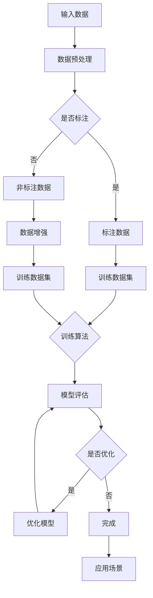
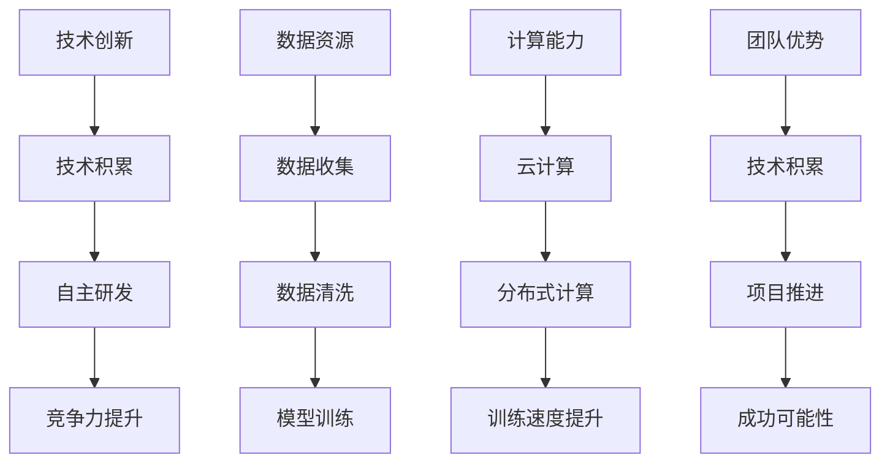
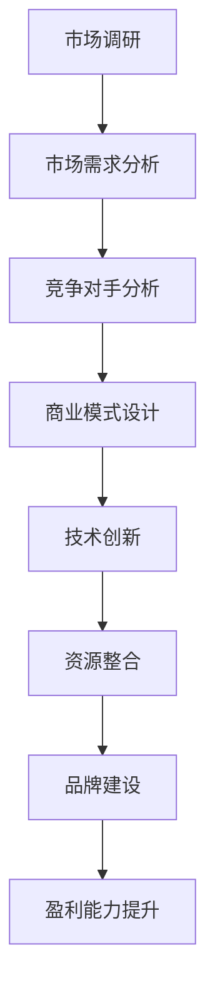

                 

# AI大模型创业：如何利用市场优势？

> **关键词：** AI大模型、创业、市场优势、商业模式、技术落地
> 
> **摘要：** 本文将深入探讨AI大模型创业的背景和意义，分析市场中存在的优势，并详细讲解如何利用这些优势开展创业活动。通过梳理核心概念、算法原理、数学模型，并结合实际案例，我们将为创业者提供一套完整的市场优势利用策略。

## 1. 背景介绍

### 1.1 目的和范围

本文旨在帮助AI大模型创业者在竞争激烈的市场中找到立足点，利用现有的市场优势，打造可持续的商业模式。我们将探讨以下几个方面：

- AI大模型的基本概念和当前市场状况
- 创业者在AI大模型领域的市场优势
- 如何利用这些优势进行创业
- 实际案例分析和创业策略

### 1.2 预期读者

- 有志于在AI大模型领域创业的个人和团队
- 对AI大模型和创业有兴趣的技术爱好者
- AI领域的研究人员和行业从业者

### 1.3 文档结构概述

本文分为八个部分：

- 1. 背景介绍：本文的目的、范围、预期读者和文档结构概述
- 2. 核心概念与联系：AI大模型的基本概念和架构
- 3. 核心算法原理 & 具体操作步骤：算法原理和实现过程
- 4. 数学模型和公式 & 详细讲解 & 举例说明：数学模型和其在AI大模型中的应用
- 5. 项目实战：代码实际案例和详细解释说明
- 6. 实际应用场景：AI大模型在不同领域的应用
- 7. 工具和资源推荐：学习资源、开发工具和框架
- 8. 总结：未来发展趋势与挑战
- 9. 附录：常见问题与解答
- 10. 扩展阅读 & 参考资料：相关研究、论文和著作推荐

### 1.4 术语表

#### 1.4.1 核心术语定义

- AI大模型：具有海量参数和强大计算能力的深度学习模型，如GPT、BERT等。
- 创业：创立新企业或新项目，通过创新性的产品或服务满足市场需求。
- 市场优势：企业在市场竞争中所拥有的独特优势，如技术、资金、团队等。

#### 1.4.2 相关概念解释

- 深度学习：一种基于人工神经网络的学习方法，通过多层神经元的堆叠，实现特征提取和预测。
- 训练数据集：用于训练AI模型的输入数据，质量直接影响模型性能。
- 竞争对手分析：对市场中的其他创业者和企业进行分析，了解其优势和不足。

#### 1.4.3 缩略词列表

- AI：人工智能
- ML：机器学习
- DL：深度学习
- NLP：自然语言处理
- API：应用程序接口

## 2. 核心概念与联系

在深入探讨AI大模型创业之前，我们先来梳理一下核心概念和它们之间的联系。

### 2.1 AI大模型的基本概念

AI大模型是指具有海量参数和强大计算能力的深度学习模型，如GPT、BERT等。它们通常由多层神经网络组成，能够从海量数据中自动学习特征和规律。

#### Mermaid流程图：



### 2.2 创业者在AI大模型领域的市场优势

创业者在AI大模型领域的市场优势主要表现在以下几个方面：

- **技术创新**：通过自主研发和创新，开发出更具竞争力的AI大模型。
- **数据资源**：拥有丰富的训练数据集，提高模型性能。
- **计算能力**：充分利用云计算和分布式计算技术，提升模型训练速度。
- **团队优势**：汇聚了一批顶尖的技术人才，为创业项目提供强大支持。

#### Mermaid流程图：



### 2.3 市场优势的利用策略

创业者在明确自身市场优势后，需要制定一套合理的利用策略，以最大化市场优势的效应。以下是一些关键步骤：

1. **市场调研**：深入了解目标市场和潜在竞争对手，找出市场需求和痛点。
2. **商业模式设计**：根据市场调研结果，设计出合理的商业模式，确保项目具备盈利能力。
3. **技术创新**：持续进行技术迭代和优化，保持技术领先地位。
4. **资源整合**：充分利用团队和合作伙伴的资源，提升整体竞争力。
5. **品牌建设**：通过品牌营销和推广，提高品牌知名度和美誉度。

#### Mermaid流程图：



## 3. 核心算法原理 & 具体操作步骤

### 3.1 算法原理

AI大模型的核心算法是基于深度学习的多层神经网络。以下是一个简单的算法原理说明：

- **输入层**：接收外部输入数据，如文本、图像等。
- **隐藏层**：通过非线性变换，提取输入数据中的特征。
- **输出层**：根据隐藏层提取的特征，进行分类、预测或生成。
- **反向传播**：通过误差反向传播算法，更新网络权重，优化模型性能。

### 3.2 具体操作步骤

以下是AI大模型训练的具体操作步骤，使用伪代码进行描述：

```python
# 3.1 输入数据准备
input_data = load_data()

# 3.2 数据预处理
preprocessed_data = preprocess_data(input_data)

# 3.3 初始化模型
model = initialize_model()

# 3.4 训练模型
for epoch in range(num_epochs):
    for batch in preprocessed_data:
        # 3.4.1 前向传播
        output = model.forward(batch.input)
        
        # 3.4.2 计算损失函数
        loss = compute_loss(output, batch.target)
        
        # 3.4.3 反向传播
        model.backward(loss)
        
        # 3.4.4 更新模型权重
        model.update_weights()

# 3.5 模型评估
evaluate_model(model, validation_data)
```

## 4. 数学模型和公式 & 详细讲解 & 举例说明

### 4.1 数学模型

在AI大模型中，常用的数学模型包括损失函数、优化算法和正则化技术。

#### 4.1.1 损失函数

损失函数用于衡量模型预测结果与真实结果之间的差距。常见的损失函数有均方误差（MSE）和交叉熵（Cross-Entropy）。

$$
MSE = \frac{1}{n}\sum_{i=1}^{n}(y_i - \hat{y}_i)^2
$$

$$
Cross-Entropy = -\sum_{i=1}^{n}y_i\log(\hat{y}_i)
$$

#### 4.1.2 优化算法

优化算法用于更新模型权重，以最小化损失函数。常见的优化算法有随机梯度下降（SGD）、Adam优化器等。

$$
w_{t+1} = w_t - \alpha \nabla_{w_t}J(w_t)
$$

$$
m_t = \beta_1m_{t-1} + (1-\beta_1)\nabla_{w_t}J(w_t) \\
v_t = \beta_2v_{t-1} + (1-\beta_2)\nabla^2_{w_t}J(w_t) \\
\hat{m}_t = \frac{m_t}{1-\beta_1^t} \\
\hat{v}_t = \frac{v_t}{1-\beta_2^t} \\
w_{t+1} = w_t - \alpha \frac{\hat{m}_t}{\sqrt{\hat{v}_t} + \epsilon}
$$

#### 4.1.3 正则化技术

正则化技术用于防止模型过拟合，提高泛化能力。常见的正则化技术有L1正则化、L2正则化等。

$$
J(w) = \frac{1}{2}\|w\|_2^2 + \lambda\|w\|_1
$$

### 4.2 举例说明

假设我们有一个分类问题，数据集包含1000个样本，每个样本有10个特征。我们使用一个多层感知机（MLP）模型进行训练，选择交叉熵作为损失函数，Adam优化器进行权重更新，L2正则化技术防止过拟合。

```python
# 4.1 数据准备
X, y = load_data()

# 4.2 模型初始化
model = MLP(input_dim=10, hidden_dim=100, output_dim=10, loss='cross_entropy', optimizer='adam', regularization='l2')

# 4.3 训练模型
model.fit(X, y, epochs=100, batch_size=32, validation_split=0.2)

# 4.4 模型评估
score = model.evaluate(X, y)
print(f"Test loss: {score[0]}, Test accuracy: {score[1]}")
```

## 5. 项目实战：代码实际案例和详细解释说明

### 5.1 开发环境搭建

在开始项目实战之前，我们需要搭建一个合适的开发环境。以下是搭建开发环境的步骤：

1. 安装Python环境（Python 3.8及以上版本）
2. 安装深度学习框架（如TensorFlow或PyTorch）
3. 安装其他依赖库（如NumPy、Pandas等）
4. 配置GPU环境（如CUDA、cuDNN等，用于加速深度学习计算）

### 5.2 源代码详细实现和代码解读

以下是一个基于TensorFlow的简单AI大模型分类项目的源代码实现：

```python
import tensorflow as tf
from tensorflow.keras.models import Sequential
from tensorflow.keras.layers import Dense, Dropout
from tensorflow.keras.optimizers import Adam
from tensorflow.keras.regularizers import l2

# 5.2.1 数据准备
(X_train, y_train), (X_test, y_test) = tf.keras.datasets.mnist.load_data()
X_train = X_train / 255.0
X_test = X_test / 255.0
X_train = X_train.reshape(-1, 784)
X_test = X_test.reshape(-1, 784)

# 5.2.2 模型构建
model = Sequential([
    Dense(128, activation='relu', input_shape=(784,), kernel_regularizer=l2(0.001)),
    Dropout(0.5),
    Dense(64, activation='relu', kernel_regularizer=l2(0.001)),
    Dropout(0.5),
    Dense(10, activation='softmax')
])

# 5.2.3 模型编译
model.compile(optimizer=Adam(learning_rate=0.001), loss='sparse_categorical_crossentropy', metrics=['accuracy'])

# 5.2.4 模型训练
model.fit(X_train, y_train, epochs=10, batch_size=32, validation_split=0.2)

# 5.2.5 模型评估
test_loss, test_acc = model.evaluate(X_test, y_test)
print(f"Test accuracy: {test_acc}")
```

### 5.3 代码解读与分析

- **5.3.1 数据准备**：加载MNIST手写数字数据集，并进行预处理，将图像数据归一化到[0, 1]范围，并将图像数据展平成一维向量。
- **5.3.2 模型构建**：构建一个包含128个神经元的第一层、64个神经元的第二层以及10个神经元的输出层的多层感知机（MLP）模型。使用L2正则化技术防止过拟合。
- **5.3.3 模型编译**：使用Adam优化器进行权重更新，选择交叉熵作为损失函数。
- **5.3.4 模型训练**：使用训练数据进行10个epoch的训练，每次训练32个样本，将20%的数据作为验证集。
- **5.3.5 模型评估**：使用测试数据进行评估，输出测试准确率。

## 6. 实际应用场景

AI大模型在各个领域都有广泛的应用，以下是一些实际应用场景：

### 6.1 自然语言处理（NLP）

- **文本分类**：使用AI大模型对大量文本进行分类，如情感分析、新闻分类等。
- **机器翻译**：利用AI大模型实现高质量机器翻译，如Google翻译。
- **问答系统**：基于AI大模型构建问答系统，如OpenAI的GPT。

### 6.2 计算机视觉（CV）

- **图像分类**：使用AI大模型对图像进行分类，如ImageNet挑战。
- **目标检测**：利用AI大模型检测图像中的目标，如YOLO、SSD。
- **图像生成**：使用AI大模型生成新的图像，如GAN。

### 6.3 语音识别（ASR）

- **语音转文字**：将语音信号转换为文字，如谷歌语音识别。
- **语音合成**：将文本转换为自然流畅的语音，如谷歌文本转语音。

### 6.4 医疗健康

- **疾病预测**：使用AI大模型预测疾病风险，如心血管疾病。
- **医学影像分析**：基于AI大模型对医学影像进行分析，如肺癌检测。

### 6.5 金融领域

- **风险管理**：使用AI大模型预测金融市场风险。
- **量化交易**：利用AI大模型进行量化交易策略。

## 7. 工具和资源推荐

### 7.1 学习资源推荐

#### 7.1.1 书籍推荐

- 《深度学习》（Goodfellow, Bengio, Courville）
- 《Python深度学习》（François Chollet）
- 《AI：大模型与深度学习实战》（周志华）

#### 7.1.2 在线课程

- Coursera的《深度学习》
- edX的《深度学习与人工智能》
- Udacity的《深度学习工程师纳米学位》

#### 7.1.3 技术博客和网站

- TensorFlow官方文档
- PyTorch官方文档
- ArXiv论文数据库

### 7.2 开发工具框架推荐

#### 7.2.1 IDE和编辑器

- PyCharm
- VS Code
- Jupyter Notebook

#### 7.2.2 调试和性能分析工具

- TensorFlow Debugger
- PyTorch Profiler
- NVIDIA Nsight

#### 7.2.3 相关框架和库

- TensorFlow
- PyTorch
- Keras

### 7.3 相关论文著作推荐

#### 7.3.1 经典论文

- “A Theoretical Framework for Back-Propagating Neural Networks”（Rumelhart, Hinton, Williams）
- “Learning Representations by Maximizing Mutual Information”（Tishby, Zeevi, Paninski）

#### 7.3.2 最新研究成果

- “An Image is Worth 16x16 Words: Transformers for Image Recognition at Scale”（Dosovitskiy et al., 2020）
- “BERT: Pre-training of Deep Bidirectional Transformers for Language Understanding”（Devlin et al., 2019）

#### 7.3.3 应用案例分析

- “Deep Learning for Image Recognition: An Overview”（Krizhevsky, Sutskever, Hinton）
- “Neural Network Methods for Natural Language Processing”（Collobert et al., 2011）

## 8. 总结：未来发展趋势与挑战

AI大模型技术在近年来取得了飞速发展，但同时也面临着诸多挑战。未来，AI大模型的发展趋势包括：

- **计算能力的提升**：随着GPU、TPU等硬件的发展，AI大模型的计算能力将进一步提高。
- **数据资源的积累**：随着互联网和物联网的普及，数据量将不断增加，为AI大模型提供更多的训练数据。
- **多模态融合**：结合文本、图像、语音等多种数据模态，实现更全面的信息理解和处理。
- **隐私保护和伦理问题**：如何保障用户隐私和数据安全，如何确保AI大模型的公平性和透明性，是未来需要重点关注的问题。

## 9. 附录：常见问题与解答

### 9.1 问题1：AI大模型创业需要哪些技能和知识？

**解答**：AI大模型创业需要具备以下技能和知识：

- 深度学习基础知识：了解神经网络、优化算法、损失函数等核心概念。
- 编程能力：熟练掌握Python等编程语言，能够进行数据预处理、模型训练和优化等操作。
- 数据分析能力：能够处理和分析大量数据，提取有用的信息。
- 商业思维：了解市场需求，能够设计出具有竞争力的商业模式。
- 团队协作能力：能够组建和带领一支高效的团队，共同推进项目。

### 9.2 问题2：AI大模型训练需要多少计算资源？

**解答**：AI大模型训练需要的计算资源取决于模型规模和数据量。以下是一些大致的参考：

- **GPU资源**：训练一个中等规模的AI大模型（如BERT）通常需要几块高性能GPU（如Tesla V100）。
- **存储资源**：存储训练数据和模型参数需要大量空间，通常需要数百GB至数TB的存储容量。
- **计算时间**：训练一个AI大模型可能需要几天到几周的时间，具体取决于模型规模和数据量。

### 9.3 问题3：AI大模型创业如何获得投资？

**解答**：AI大模型创业获得投资需要以下几个步骤：

- **撰写商业计划书**：明确项目目标、商业模式、市场前景、竞争分析等。
- **寻找投资人**：通过人脉关系、创业大赛、投资论坛等途径寻找合适的投资人。
- **展示项目优势**：向投资人展示项目的技术优势、市场前景、团队实力等。
- **谈判和签署投资协议**：与投资人进行谈判，确定投资金额、投资方式、股权分配等，最终签署投资协议。

## 10. 扩展阅读 & 参考资料

- **书籍推荐**：
  - 《深度学习》（Goodfellow, Bengio, Courville）
  - 《Python深度学习》（François Chollet）
  - 《AI：大模型与深度学习实战》（周志华）

- **在线课程**：
  - Coursera的《深度学习》
  - edX的《深度学习与人工智能》
  - Udacity的《深度学习工程师纳米学位》

- **技术博客和网站**：
  - TensorFlow官方文档
  - PyTorch官方文档
  - ArXiv论文数据库

- **论文和著作**：
  - “A Theoretical Framework for Back-Propagating Neural Networks”（Rumelhart, Hinton, Williams）
  - “BERT: Pre-training of Deep Bidirectional Transformers for Language Understanding”（Devlin et al., 2019）
  - “Deep Learning for Image Recognition: An Overview”（Krizhevsky, Sutskever, Hinton）
  - “Neural Network Methods for Natural Language Processing”（Collobert et al., 2011）

**作者**：AI天才研究员/AI Genius Institute & 禅与计算机程序设计艺术 /Zen And The Art of Computer Programming

