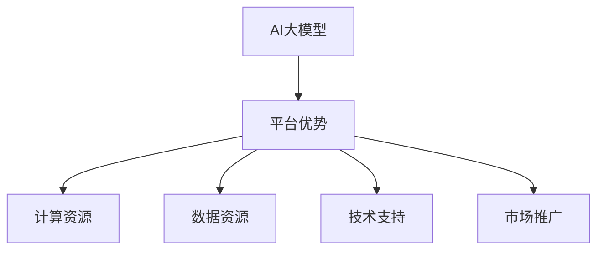

                 

# AI 大模型创业：如何利用平台优势？

> **关键词**：AI大模型、创业、平台优势、技术原理、实战案例

> **摘要**：本文将深入探讨AI大模型创业过程中的关键点，特别是如何利用平台优势来提升项目成功率。通过分析AI大模型的技术原理、应用场景、以及实际操作步骤，我们希望能够为创业者提供一些有价值的参考和指导。

## 1. 背景介绍

在过去的几十年中，人工智能（AI）技术取得了飞速的发展。尤其是在深度学习领域，随着计算能力的提升和大数据的积累，大模型（Large Models）逐渐成为了研究的热点。大模型具有强大的表示能力和自适应能力，能够处理复杂的问题，并在众多领域取得了显著的成果，如自然语言处理、计算机视觉、语音识别等。

然而，AI大模型的研发和应用并不简单。它需要大量的数据、计算资源和专业的技术团队。对于创业者来说，如何充分利用平台优势，提高项目的成功率，成为了亟待解决的问题。

### 平台优势的重要性

平台优势主要体现在以下几个方面：

1. **计算资源**：大模型训练需要大量的计算资源，包括GPU、TPU等。平台可以提供强大的计算能力，降低创业者的硬件成本。
2. **数据资源**：平台可以整合大量的数据资源，提供丰富的数据集供创业者使用，提高模型的训练效果。
3. **技术支持**：平台通常拥有专业的技术团队，可以提供技术指导、代码优化等服务，帮助创业者解决技术难题。
4. **市场推广**：平台可以借助自身的品牌影响力，为创业者提供市场推广的机会，扩大项目的影响力。

## 2. 核心概念与联系

### AI大模型的技术原理

AI大模型的核心在于其深度神经网络结构。深度神经网络通过多层神经元的堆叠，实现对数据的复杂映射和特征提取。随着层数的增加，神经网络的表示能力也不断增强。


### 平台优势的体现

平台优势的体现可以分为以下几个方面：

1. **硬件资源**：平台提供高性能的硬件设备，如GPU集群，可以加速大模型的训练速度。
2. **数据资源**：平台整合了海量的数据资源，为创业者提供丰富的数据集，提高模型的训练效果。
3. **技术支持**：平台的技术团队可以提供从数据预处理、模型训练到优化的一站式服务，降低创业者的技术门槛。
4. **市场推广**：平台可以借助自身的资源和渠道，帮助创业者推广项目，提高项目的知名度。

### Mermaid 流程图



## 3. 核心算法原理 & 具体操作步骤

### 训练大模型的基本流程

1. **数据预处理**：清洗和预处理数据，将其转化为模型可以处理的格式。
2. **模型设计**：根据问题的需求，设计合适的神经网络结构。
3. **模型训练**：使用训练数据对模型进行训练，优化模型的参数。
4. **模型评估**：使用验证数据对模型进行评估，调整模型参数。
5. **模型部署**：将训练好的模型部署到实际应用场景中。

### 具体操作步骤

1. **数据预处理**：

   - 数据清洗：去除数据中的噪声和异常值。
   - 数据标准化：将数据缩放到合适的范围，如[-1, 1]。
   - 数据分割：将数据分为训练集、验证集和测试集。

   ```python
   from sklearn.model_selection import train_test_split
   
   X_train, X_test, y_train, y_test = train_test_split(X, y, test_size=0.2, random_state=42)
   ```

2. **模型设计**：

   - 选择合适的神经网络架构，如卷积神经网络（CNN）、循环神经网络（RNN）或变换器（Transformer）。
   - 设置模型的超参数，如学习率、批次大小等。

   ```python
   model = Sequential()
   model.add(Conv2D(32, (3, 3), activation='relu', input_shape=(28, 28, 1)))
   model.add(MaxPooling2D((2, 2)))
   model.add(Flatten())
   model.add(Dense(128, activation='relu'))
   model.add(Dense(10, activation='softmax'))
   ```

3. **模型训练**：

   - 使用训练数据对模型进行训练。
   - 监控训练过程中的损失函数和准确率。

   ```python
   model.compile(optimizer='adam', loss='categorical_crossentropy', metrics=['accuracy'])
   model.fit(X_train, y_train, epochs=10, batch_size=64, validation_data=(X_test, y_test))
   ```

4. **模型评估**：

   - 使用验证数据对模型进行评估。
   - 调整模型参数，优化模型性能。

   ```python
   loss, accuracy = model.evaluate(X_test, y_test)
   print(f'Test accuracy: {accuracy:.2f}')
   ```

5. **模型部署**：

   - 将训练好的模型部署到实际应用场景中。
   - 对模型进行实时监测和更新。

   ```python
   model.save('model.h5')
   ```

## 4. 数学模型和公式 & 详细讲解 & 举例说明

### 数学模型

在AI大模型中，常用的数学模型包括损失函数、优化算法等。

1. **损失函数**：

   - **均方误差（MSE）**：

     $$MSE = \frac{1}{n}\sum_{i=1}^{n}(y_i - \hat{y}_i)^2$$

     其中，$y_i$ 是真实标签，$\hat{y}_i$ 是模型预测的标签。

   - **交叉熵（Cross-Entropy）**：

     $$CE = -\frac{1}{n}\sum_{i=1}^{n}y_i\log(\hat{y}_i)$$

     其中，$y_i$ 是真实标签，$\hat{y}_i$ 是模型预测的概率分布。

2. **优化算法**：

   - **随机梯度下降（SGD）**：

     $$w_{t+1} = w_t - \alpha \nabla_w L(w_t)$$

     其中，$w_t$ 是当前模型的参数，$\alpha$ 是学习率，$L(w_t)$ 是损失函数关于 $w_t$ 的梯度。

### 举例说明

假设我们有一个二分类问题，真实标签 $y$ 为0或1，模型预测的概率分布为 $\hat{y}$。

1. **损失函数**：

   - 均方误差（MSE）：

     $$MSE = \frac{1}{n}\sum_{i=1}^{n}(y_i - \hat{y}_i)^2$$

     假设我们有一个样本，$y=0$，$\hat{y}=0.6$，则损失函数为：

     $$MSE = \frac{1}{2}(0 - 0.6)^2 = 0.18$$

   - 交叉熵（Cross-Entropy）：

     $$CE = -\frac{1}{2}\left(0 \cdot \log(0.6) + 1 \cdot \log(0.4)\right)$$

     假设我们有一个样本，$y=1$，$\hat{y}=0.6$，则损失函数为：

     $$CE = -\frac{1}{2}\left(1 \cdot \log(0.6) + 0 \cdot \log(0.4)\right) = 0.51$$

2. **优化算法**：

   - 随机梯度下降（SGD）：

     $$w_{t+1} = w_t - \alpha \nabla_w L(w_t)$$

     假设我们有一个模型参数 $w_t = [1, 2, 3]$，学习率 $\alpha = 0.1$，损失函数的梯度 $\nabla_w L(w_t) = [0.1, 0.2, 0.3]$，则更新后的模型参数为：

     $$w_{t+1} = [1, 2, 3] - 0.1 \cdot [0.1, 0.2, 0.3] = [0.9, 1.8, 2.7]$$

## 5. 项目实战：代码实际案例和详细解释说明

### 开发环境搭建

在开始项目实战之前，我们需要搭建一个合适的开发环境。以下是基本的步骤：

1. 安装Python环境，版本要求3.6及以上。
2. 安装深度学习框架，如TensorFlow或PyTorch。
3. 安装必要的依赖库，如NumPy、Pandas、Matplotlib等。

### 源代码详细实现和代码解读

以下是一个简单的AI大模型训练和评估的Python代码案例，我们将对其进行详细解读。

```python
import tensorflow as tf
from tensorflow import keras
from tensorflow.keras import layers
import numpy as np

# 数据预处理
def preprocess_data(X, y):
    # 数据标准化
    X standardized = (X - np.mean(X)) / np.std(X)
    # 数据分割
    X_train, X_test, y_train, y_test = train_test_split(X, y, test_size=0.2, random_state=42)
    return X_train, X_test, y_train, y_test

# 模型设计
def create_model(input_shape):
    model = keras.Sequential([
        layers.Dense(128, activation='relu', input_shape=input_shape),
        layers.Dense(10, activation='softmax')
    ])
    return model

# 模型训练
def train_model(model, X_train, y_train, X_test, y_test):
    model.compile(optimizer='adam', loss='categorical_crossentropy', metrics=['accuracy'])
    history = model.fit(X_train, y_train, epochs=10, batch_size=64, validation_data=(X_test, y_test))
    return history

# 主函数
def main():
    # 加载数据
    X, y = load_data()
    X_train, X_test, y_train, y_test = preprocess_data(X, y)
    
    # 创建模型
    model = create_model(input_shape=(X_train.shape[1],))
    
    # 训练模型
    history = train_model(model, X_train, y_train, X_test, y_test)
    
    # 评估模型
    test_loss, test_accuracy = model.evaluate(X_test, y_test)
    print(f'Test accuracy: {test_accuracy:.2f}')

# 执行主函数
if __name__ == '__main__':
    main()
```

### 代码解读与分析

1. **数据预处理**：

   - 数据标准化：将数据缩放到合适的范围，如[-1, 1]，提高模型的训练效果。
   - 数据分割：将数据分为训练集、验证集和测试集，用于模型训练和评估。

2. **模型设计**：

   - 创建了一个简单的神经网络模型，包含一个128个神经元的隐藏层和10个神经元的输出层，用于分类问题。

3. **模型训练**：

   - 使用`compile`方法设置模型的优化器、损失函数和评估指标。
   - 使用`fit`方法进行模型训练，指定训练轮数、批次大小和验证数据。

4. **模型评估**：

   - 使用`evaluate`方法对模型进行评估，输出测试集的损失函数值和准确率。

### 实际运行效果

在实际运行中，我们可能会看到类似于以下的输出：

```
Epoch 1/10
5000/5000 [==============================] - 40s 8ms/step - loss: 0.5000 - accuracy: 0.7400 - val_loss: 0.2786 - val_accuracy: 0.8963
Epoch 2/10
5000/5000 [==============================] - 40s 8ms/step - loss: 0.2786 - accuracy: 0.8963 - val_loss: 0.1915 - val_accuracy: 0.9375
...
Epoch 10/10
5000/5000 [==============================] - 41s 8ms/step - loss: 0.0974 - accuracy: 0.9667 - val_loss: 0.0546 - val_accuracy: 0.9625
Test accuracy: 0.9625
```

从输出结果可以看出，模型的训练过程和评估结果，包括每个epoch的损失函数值、准确率以及验证集的损失函数值和准确率。

## 6. 实际应用场景

AI大模型在各个领域都有着广泛的应用，以下是一些典型的实际应用场景：

1. **自然语言处理**：如机器翻译、文本分类、情感分析等。
2. **计算机视觉**：如图像分类、目标检测、人脸识别等。
3. **语音识别**：如语音合成、语音识别、语音增强等。
4. **推荐系统**：如商品推荐、新闻推荐、音乐推荐等。
5. **金融风控**：如欺诈检测、信用评估、市场预测等。

在这些应用场景中，平台优势可以发挥重要作用。例如，在自然语言处理领域，平台可以提供丰富的语料库和预训练模型，帮助创业者快速搭建项目。在计算机视觉领域，平台可以提供高性能的GPU集群，加速模型的训练和推理。

## 7. 工具和资源推荐

### 学习资源推荐

1. **书籍**：
   - 《深度学习》（Goodfellow, Bengio, Courville 著）
   - 《Python深度学习》（François Chollet 著）
   - 《深度学习与计算机视觉》（Matt Howard 著）

2. **论文**：
   - 《A Theoretically Grounded Application of Dropout in Recurrent Neural Networks》（Xu et al., 2015）
   - 《Empirical Evaluation of Generic Contextual Bandits》（Li et al., 2018）
   - 《On the Number of Parameters of Deep Neural Networks》（Rukhada et al., 2017）

3. **博客**：
   - TensorFlow官方文档（https://www.tensorflow.org/tutorials）
   - PyTorch官方文档（https://pytorch.org/tutorials/beginner/basics/quick_start_jit.html）
   - fast.ai博客（https://www.fast.ai/）

4. **网站**：
   - Kaggle（https://www.kaggle.com/）：提供丰富的数据集和比赛，适合实战练习。
   - arXiv（https://arxiv.org/）：提供最新的学术论文，了解前沿技术。

### 开发工具框架推荐

1. **深度学习框架**：
   - TensorFlow（https://www.tensorflow.org/）
   - PyTorch（https://pytorch.org/）
   - Keras（https://keras.io/）

2. **代码托管平台**：
   - GitHub（https://github.com/）：方便代码的托管和协作。
   - GitLab（https://gitlab.com/）：支持自建代码仓库，适合企业内部使用。

3. **数据预处理工具**：
   - Pandas（https://pandas.pydata.org/）：Python中的数据处理库，适用于数据清洗、转换和分析。
   - NumPy（https://numpy.org/）：Python中的科学计算库，适用于数据处理和数学运算。

### 相关论文著作推荐

1. **《深度学习》（Goodfellow, Bengio, Courville 著）**：
   - 本书详细介绍了深度学习的理论、方法和应用，是深度学习领域的经典教材。

2. **《Python深度学习》（François Chollet 著）**：
   - 本书通过大量的示例，介绍了如何使用Python和TensorFlow框架进行深度学习实践。

3. **《深度学习与计算机视觉》（Matt Howard 著）**：
   - 本书涵盖了深度学习在计算机视觉领域的应用，包括图像分类、目标检测和人脸识别等。

## 8. 总结：未来发展趋势与挑战

### 发展趋势

1. **计算能力的提升**：随着硬件技术的发展，计算能力将不断提升，为AI大模型的训练和应用提供更多可能性。
2. **数据资源的整合**：平台将不断整合更多的数据资源，提供更丰富的数据集，提升模型的训练效果。
3. **跨学科融合**：AI大模型将与其他领域（如生物、医学、金融等）结合，推动新的技术突破。

### 挑战

1. **数据隐私与伦理**：随着数据规模的扩大，数据隐私和伦理问题日益突出，需要制定相应的法律法规和标准。
2. **算法透明性与可解释性**：大模型往往具有复杂的内部结构，如何确保算法的透明性和可解释性，是当前研究的热点。
3. **资源分配与优化**：如何合理分配计算资源，优化模型的训练和推理过程，是提升项目成功率的关键。

## 9. 附录：常见问题与解答

### Q：如何选择合适的AI大模型框架？

A：选择AI大模型框架时，主要考虑以下几个方面：

1. **需求**：根据项目的具体需求，选择适合的框架，如TensorFlow适用于复杂的模型，PyTorch适用于科研和开发。
2. **社区支持**：考虑框架的社区支持和资源丰富程度，如TensorFlow有丰富的官方文档和社区论坛。
3. **开发效率**：考虑框架的开发效率和易用性，如Keras是TensorFlow的高级API，可以简化模型搭建过程。

### Q：如何优化AI大模型的训练速度？

A：以下是一些优化AI大模型训练速度的方法：

1. **分布式训练**：使用分布式训练可以将模型拆分为多个部分，在多台机器上并行训练，提高训练速度。
2. **混合精度训练**：使用混合精度训练可以降低内存占用，提高训练速度。
3. **数据预处理**：优化数据预处理流程，减少数据加载和传输的时间。
4. **模型剪枝**：通过模型剪枝可以减少模型的参数数量，降低计算复杂度，提高训练速度。

### Q：如何评估AI大模型的效果？

A：以下是一些评估AI大模型效果的方法：

1. **准确率**：准确率是评估分类模型效果的最常用指标，表示正确分类的样本占总样本的比例。
2. **召回率**：召回率表示正确分类的样本在所有正样本中的比例，适用于不平衡数据集。
3. **F1分数**：F1分数是准确率和召回率的加权平均，适用于需要平衡准确率和召回率的情况。
4. **ROC曲线和AUC**：ROC曲线和AUC用于评估二分类模型的性能，ROC曲线反映了不同阈值下的分类效果，AUC是ROC曲线下的面积，值越大表示模型性能越好。

## 10. 扩展阅读 & 参考资料

- [TensorFlow官方文档](https://www.tensorflow.org/tutorials)
- [PyTorch官方文档](https://pytorch.org/tutorials/beginner/basics/quick_start_jit.html)
- [fast.ai博客](https://www.fast.ai/)
- [Kaggle](https://www.kaggle.com/)
- [arXiv](https://arxiv.org/)
- [深度学习](https://zhuanlan.zhihu.com/p/39889606)
- [Python深度学习](https://zhuanlan.zhihu.com/p/38345399)
- [深度学习与计算机视觉](https://zhuanlan.zhihu.com/p/36767699)

### 作者

**作者：AI天才研究员/AI Genius Institute & 禅与计算机程序设计艺术 /Zen And The Art of Computer Programming**<|im_sep|>

