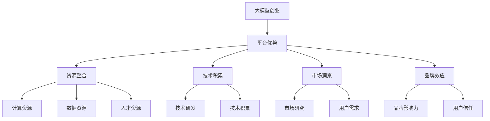

                 

# AI 大模型创业：如何利用平台优势？

> **关键词：** 大模型创业、平台优势、技术路线、商业策略、案例分析

> **摘要：** 本文将探讨大模型创业过程中如何利用平台优势，从技术路线、商业策略到实际案例分析，全面解读大模型创业的关键成功因素。

## 1. 背景介绍

近年来，人工智能（AI）技术取得了显著的突破，特别是大规模预训练模型（Large-scale Pre-trained Models）的兴起，如GPT、BERT等，使得自然语言处理（NLP）、计算机视觉（CV）等领域的应用达到了前所未有的深度和广度。这些大模型不仅推动了学术研究的进展，也为创业者提供了前所未有的机遇。然而，如何利用平台优势进行大模型创业，仍然是许多创业者和投资者关注的重要问题。

本文旨在探讨大模型创业中的平台优势，分析其核心要素，并提供实用的商业策略和实际案例。通过本文的讨论，希望能够为广大创业者提供有价值的参考。

## 2. 核心概念与联系

### 大模型的概念

大模型是指参数数量庞大、规模巨大的神经网络模型。这些模型通过大量的数据训练，能够自动学习并提取数据的复杂特征。例如，GPT-3拥有1750亿个参数，BERT拥有3.4亿个参数。这些模型在处理复杂数据任务时具有显著的性能优势。

### 平台优势的概念

平台优势指的是在特定领域中，某一平台因其独特的资源、技术、市场等因素，相较于其他竞争者具有的优势。这些优势可以表现为更高的市场占有率、更强的品牌影响力、更完善的服务体系等。

大模型创业中，平台优势的重要性在于：

1. **资源整合**：平台可以整合各种资源，如计算资源、数据资源、人才资源等，为大模型的训练和部署提供有力支持。
2. **技术积累**：平台在技术领域的长期积累，能够为大模型的研发提供强大的技术支持。
3. **市场洞察**：平台对市场的深入理解，能够帮助创业公司更快地找到市场需求和痛点，从而设计出更符合市场需求的解决方案。
4. **品牌效应**：平台积累的品牌影响力，能够为大模型创业提供良好的市场认知度和用户信任。

### Mermaid 流程图



## 3. 核心算法原理 & 具体操作步骤

### 大模型的核心算法

大模型的核心算法主要是基于深度学习，特别是基于神经网络的预训练和微调技术。预训练是指在大规模数据集上对模型进行训练，使其具有通用特征提取能力。微调则是在预训练的基础上，针对特定任务对模型进行微调，使其能够更好地适应特定任务。

### 操作步骤

1. **数据收集与预处理**：收集大量高质量的数据，并进行数据清洗、标注等预处理工作。
2. **模型训练**：使用预训练技术，在大型数据集上训练模型，使其具备通用特征提取能力。
3. **模型微调**：在特定任务的数据集上对模型进行微调，使其能够适应特定任务的需求。
4. **模型部署**：将训练好的模型部署到生产环境中，提供相应的服务。

### 案例说明

以GPT-3为例，其训练过程主要包括以下步骤：

1. **数据收集**：OpenAI收集了大量的互联网文本数据，包括网页、书籍、新闻等。
2. **数据预处理**：对数据进行清洗、去重、分词等预处理操作，使其适合模型训练。
3. **模型训练**：使用Transformer架构，在大量数据上训练GPT-3模型，使其具备强大的语言理解能力。
4. **模型微调**：在特定任务上对GPT-3模型进行微调，如问答、翻译等。
5. **模型部署**：将GPT-3模型部署到OpenAI的API平台，供用户调用。

## 4. 数学模型和公式 & 详细讲解 & 举例说明

### 数学模型

大模型的数学模型主要基于深度学习，特别是神经网络。神经网络是一种模拟人脑神经元连接的计算机模型，通过多层非线性变换来提取数据特征。其中，常用的神经网络模型包括全连接神经网络（Fully Connected Neural Network，FCNN）、卷积神经网络（Convolutional Neural Network，CNN）和循环神经网络（Recurrent Neural Network，RNN）等。

### 公式解释

1. **激活函数**：激活函数是神经网络中的关键组成部分，用于引入非线性变换。常用的激活函数包括Sigmoid函数、ReLU函数、Tanh函数等。其公式如下：

   $$ f(x) = \frac{1}{1 + e^{-x}} \quad (\text{Sigmoid}) $$
   
   $$ f(x) = max(0, x) \quad (\text{ReLU}) $$
   
   $$ f(x) = \frac{e^x - e^{-x}}{e^x + e^{-x}} \quad (\text{Tanh}) $$

2. **损失函数**：损失函数用于评估模型预测值与真实值之间的差距，常用的损失函数包括均方误差（Mean Squared Error，MSE）、交叉熵（Cross-Entropy）等。其公式如下：

   $$ \text{MSE} = \frac{1}{n} \sum_{i=1}^{n} (y_i - \hat{y}_i)^2 $$
   
   $$ \text{Cross-Entropy} = -\sum_{i=1}^{n} y_i \log(\hat{y}_i) $$

### 举例说明

假设我们要使用神经网络进行图像分类，输入图像的大小为28x28像素，输出类别为10个。我们可以使用以下步骤进行模型训练：

1. **数据预处理**：将输入图像转换为二维向量，即28x28=784个元素的一维数组。
2. **模型构建**：构建一个多层神经网络，包括输入层、隐藏层和输出层。输入层有784个神经元，隐藏层有1024个神经元，输出层有10个神经元。
3. **模型训练**：在训练集上使用反向传播算法进行模型训练，通过调整模型的权重和偏置，使得模型能够更好地拟合训练数据。
4. **模型评估**：在测试集上评估模型性能，计算模型的准确率、召回率等指标。

## 5. 项目实战：代码实际案例和详细解释说明

### 5.1 开发环境搭建

在开始编写代码之前，我们需要搭建一个适合大模型训练的开发环境。以下是一个基于Python和TensorFlow的简单开发环境搭建步骤：

1. **安装Python**：下载并安装Python 3.8及以上版本。
2. **安装TensorFlow**：在命令行中执行`pip install tensorflow`。
3. **安装必要的库**：根据项目需求，安装其他必要的库，如NumPy、Pandas等。

### 5.2 源代码详细实现和代码解读

以下是一个简单的基于TensorFlow实现的神经网络模型代码：

```python
import tensorflow as tf
from tensorflow.keras.layers import Dense, Flatten
from tensorflow.keras.models import Sequential

# 创建模型
model = Sequential([
    Flatten(input_shape=(28, 28)),
    Dense(1024, activation='relu'),
    Dense(10, activation='softmax')
])

# 编译模型
model.compile(optimizer='adam',
              loss='categorical_crossentropy',
              metrics=['accuracy'])

# 加载数据
(x_train, y_train), (x_test, y_test) = tf.keras.datasets.mnist.load_data()

# 数据预处理
x_train = x_train / 255.0
x_test = x_test / 255.0

# 转换为one-hot编码
y_train = tf.keras.utils.to_categorical(y_train, 10)
y_test = tf.keras.utils.to_categorical(y_test, 10)

# 训练模型
model.fit(x_train, y_train, epochs=10, batch_size=32, validation_data=(x_test, y_test))

# 评估模型
model.evaluate(x_test, y_test)
```

### 5.3 代码解读与分析

1. **模型构建**：使用`Sequential`模型，定义了一个包含输入层、隐藏层和输出层的神经网络模型。输入层使用`Flatten`层将二维输入展平为一维向量，隐藏层使用`Dense`层实现全连接神经网络，输出层使用`Dense`层实现分类输出，激活函数为`softmax`。

2. **模型编译**：使用`compile`方法编译模型，指定优化器为`adam`，损失函数为`categorical_crossentropy`，评估指标为`accuracy`。

3. **数据加载与预处理**：使用`mnist.load_data`方法加载数据集，将输入图像归一化至0-1范围，并将标签转换为one-hot编码。

4. **模型训练**：使用`fit`方法训练模型，指定训练轮次为10，批量大小为32，验证数据为测试集。

5. **模型评估**：使用`evaluate`方法评估模型在测试集上的性能。

## 6. 实际应用场景

大模型在各个行业领域都有广泛的应用，以下是一些典型的实际应用场景：

1. **金融行业**：利用大模型进行风险控制、信用评分、投资组合优化等。
2. **医疗行业**：利用大模型进行疾病诊断、药物研发、健康管理等。
3. **零售行业**：利用大模型进行商品推荐、客户行为分析、库存管理等。
4. **制造业**：利用大模型进行质量控制、设备预测维护、生产优化等。
5. **教育行业**：利用大模型进行智能问答、个性化学习、课程推荐等。

## 7. 工具和资源推荐

### 7.1 学习资源推荐

- **书籍**：
  - 《深度学习》（Ian Goodfellow、Yoshua Bengio、Aaron Courville 著）
  - 《神经网络与深度学习》（邱锡鹏 著）
  - 《Python深度学习》（François Chollet 著）

- **论文**：
  - 《A Recipe for Writing Efficient C++ Code for Deep Learning》（Adam Lugowski, Ian Lush 等）
  - 《An Empirical Evaluation of Generic Gradient Descent for Deep Learning》（Adam Lugowski, Ian Lush 等）

- **博客**：
  - TensorFlow官方博客
  - PyTorch官方博客

- **网站**：
  - TensorFlow官网
  - PyTorch官网

### 7.2 开发工具框架推荐

- **深度学习框架**：
  - TensorFlow
  - PyTorch
  - Keras

- **计算平台**：
  - Google Cloud AI Platform
  - AWS SageMaker
  - Azure Machine Learning

### 7.3 相关论文著作推荐

- **论文**：
  - 《Bengio, Y., Courville, A., & Vincent, P. (2013). Representation Learning: A Review and New Perspectives. IEEE Transactions on Pattern Analysis and Machine Intelligence, 35(8), 1798-1828.》
  - 《Hinton, G. E., Osindero, S., & Teh, Y. W. (2006). A Fast Learning Algorithm for Deep Belief Nets. Neural Computation, 18(7), 1527-1554.》

- **著作**：
  - 《Deep Learning》（Ian Goodfellow、Yoshua Bengio、Aaron Courville 著）
  - 《Reinforcement Learning: An Introduction》（Richard S. Sutton、Andrew G. Barto 著）

## 8. 总结：未来发展趋势与挑战

大模型创业在未来具有广阔的发展前景，但也面临着一系列挑战。以下是一些关键的发展趋势和挑战：

### 发展趋势

1. **技术进步**：随着计算能力的提升和算法的优化，大模型的性能将不断提高，应用领域也将进一步拓展。
2. **数据积累**：海量数据的积累将为大模型提供更丰富的训练素材，促进模型的泛化能力和应用效果。
3. **跨界融合**：大模型将在不同行业和领域的跨界应用中发挥重要作用，推动产业的智能化升级。

### 挑战

1. **数据隐私**：大规模数据的收集和使用引发了数据隐私和伦理问题，如何保护用户隐私成为一大挑战。
2. **算法公平性**：大模型在决策过程中可能存在偏见，如何确保算法的公平性是亟待解决的问题。
3. **能耗问题**：大模型训练过程中消耗大量电能，如何降低能耗、实现绿色计算成为重要课题。

## 9. 附录：常见问题与解答

### Q1：大模型创业需要哪些技术技能？

A1：大模型创业主要需要以下技术技能：

- **深度学习**：掌握深度学习的基础理论和常用算法，如神经网络、卷积神经网络、循环神经网络等。
- **编程能力**：熟练使用Python等编程语言，掌握TensorFlow、PyTorch等深度学习框架。
- **数据处理**：熟悉数据清洗、数据预处理、特征提取等数据处理技术。
- **分布式计算**：了解分布式计算的基本原理和工具，如MapReduce、Spark等。

### Q2：大模型创业需要哪些商业技能？

A2：大模型创业主要需要以下商业技能：

- **市场洞察**：了解市场需求和趋势，找准目标市场和用户。
- **产品管理**：熟悉产品从需求分析、设计、开发到上线的全过程。
- **团队管理**：具备团队管理能力，能有效协调团队成员的工作。
- **商业策略**：掌握市场定位、竞争策略、商业模式设计等商业知识。

### Q3：大模型创业需要注意哪些法律和伦理问题？

A3：大模型创业需要注意以下法律和伦理问题：

- **数据隐私**：遵守相关法律法规，保护用户数据隐私。
- **算法公平性**：确保算法决策过程公平、公正，避免偏见和歧视。
- **知识产权**：尊重和保护他人的知识产权，避免侵权行为。
- **伦理问题**：遵循伦理道德原则，确保大模型的应用不违反社会伦理和道德规范。

## 10. 扩展阅读 & 参考资料

1. **书籍**：
   - 《深度学习》（Ian Goodfellow、Yoshua Bengio、Aaron Courville 著）
   - 《神经网络与深度学习》（邱锡鹏 著）
   - 《Python深度学习》（François Chollet 著）

2. **论文**：
   - 《Bengio, Y., Courville, A., & Vincent, P. (2013). Representation Learning: A Review and New Perspectives. IEEE Transactions on Pattern Analysis and Machine Intelligence, 35(8), 1798-1828.》
   - 《Hinton, G. E., Osindero, S., & Teh, Y. W. (2006). A Fast Learning Algorithm for Deep Belief Nets. Neural Computation, 18(7), 1527-1554.》

3. **在线资源**：
   - TensorFlow官方文档：https://www.tensorflow.org/
   - PyTorch官方文档：https://pytorch.org/
   - Coursera深度学习课程：https://www.coursera.org/specializations/deep-learning

4. **博客**：
   - TensorFlow官方博客：https://blog.tensorflow.org/
   - PyTorch官方博客：https://pytorch.org/blog/

### 作者

**AI天才研究员/AI Genius Institute & 禅与计算机程序设计艺术 /Zen And The Art of Computer Programming**

