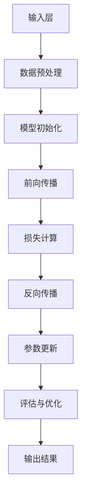

                 

### 背景介绍

随着人工智能技术的飞速发展，大模型（Large Models）在自然语言处理、计算机视觉、语音识别等领域表现出了惊人的效果。这些大模型，如 GPT-3、BERT、Vit 等成为了各大科技公司和初创企业的热门应用对象。那么，对于想要创业的个人或团队来说，如何利用这些技术优势，实现商业价值，成为一个值得深入探讨的话题。

本文将围绕以下几个核心问题展开讨论：

1. **大模型创业的可行性分析**：我们将探讨当前大模型技术的发展现状，以及其在创业领域中的应用潜力。
2. **技术优势与劣势分析**：我们将深入分析大模型技术在实际应用中的优势与劣势，帮助创业者更好地把握机会和规避风险。
3. **项目实战与案例分析**：通过具体的创业项目实例，分析其成功的关键因素，为创业者提供实践指导。
4. **未来发展趋势与挑战**：探讨大模型技术在未来可能面临的发展趋势与挑战，为创业者提供前瞻性思考。

本文的结构安排如下：

- **第1章 背景介绍**：介绍人工智能与大数据模型的基本概念，以及其在创业领域的重要性。
- **第2章 核心概念与联系**：详细解释大模型的基本概念，如神经网络、Transformer、注意力机制等，并使用 Mermaid 流程图展示其工作原理。
- **第3章 核心算法原理 & 具体操作步骤**：介绍大模型的核心算法原理，包括预处理、训练、推理等步骤。
- **第4章 数学模型和公式 & 详细讲解 & 举例说明**：讲解大模型中的关键数学模型和公式，并通过实例进行说明。
- **第5章 项目实战：代码实际案例和详细解释说明**：展示一个完整的创业项目实例，详细解释代码实现和关键步骤。
- **第6章 实际应用场景**：探讨大模型技术在各个领域的应用场景，包括自然语言处理、计算机视觉、语音识别等。
- **第7章 工具和资源推荐**：推荐相关的学习资源、开发工具和框架。
- **第8章 总结：未来发展趋势与挑战**：总结本文的主要观点，并探讨大模型技术的未来发展趋势与挑战。
- **第9章 附录：常见问题与解答**：回答一些常见问题，帮助读者更好地理解和应用本文的内容。
- **第10章 扩展阅读 & 参考资料**：提供一些扩展阅读和参考资料，供读者进一步学习。

通过本文的探讨，希望创业者能够更好地理解大模型技术，并在实际创业过程中充分利用其优势，实现商业价值。

#### 核心关键词
- 大模型
- 创业
- 技术优势
- 实际应用
- 未来发展趋势

#### 摘要
本文从背景介绍入手，深入探讨了大模型技术在创业领域的应用。通过分析大模型的基本概念、核心算法原理、数学模型以及实际应用场景，本文为创业者提供了丰富的实践指导和前瞻性思考。同时，本文还总结了未来发展趋势与挑战，为创业者指明了方向。希望本文能够帮助创业者更好地利用大模型技术，实现商业成功。### 1. 大模型技术的基本概念

大模型（Large Models）是人工智能领域的一种重要技术，其核心思想是通过大规模的神经网络模型来模拟人类的思维过程，从而实现复杂的任务。本文将首先介绍大模型的基本概念，包括其发展历程、定义和类型。

#### 发展历程

大模型技术的发展可以追溯到上世纪80年代的神经网络研究。当时，研究人员提出了多层感知机（MLP）这一简单但有效的神经网络模型，试图通过多层非线性变换来模拟人类的学习过程。然而，由于计算能力和数据资源的限制，早期的神经网络模型效果并不理想。

随着计算能力和数据资源的不断提升，特别是深度学习技术的兴起，大模型的研究和应用迎来了新的机遇。2006年，Hinton等人提出了深度信念网络（DBN），为后续的深度学习模型奠定了基础。随后，2012年，Hinton团队提出的卷积神经网络（CNN）在ImageNet图像识别大赛中取得了突破性的成绩，标志着深度学习技术的崛起。

进入2017年，Transformer模型的提出再次推动了深度学习的发展。Transformer模型引入了自注意力机制，使得模型能够更好地捕捉序列信息，从而在自然语言处理领域取得了显著的效果。此后，基于Transformer架构的大模型如BERT、GPT等相继涌现，成为当前人工智能领域的热点。

#### 定义

大模型，顾名思义，是指具有大规模参数和计算能力的神经网络模型。这些模型通常包含数百万至数十亿个参数，需要大量的数据和计算资源进行训练。具体来说，大模型具有以下几个特点：

1. **大规模参数**：大模型拥有数百万至数十亿个参数，这使得模型能够学习到复杂的模式和关系。
2. **大规模数据**：大模型的训练需要大量的数据，尤其是标注数据。这些数据不仅帮助模型更好地理解任务，还能够减少过拟合的风险。
3. **大规模计算**：大模型的训练和推理需要大量的计算资源，尤其是GPU或TPU等高性能计算设备。

#### 类型

根据应用领域和任务类型，大模型可以分为多种类型，主要包括以下几种：

1. **计算机视觉模型**：如卷积神经网络（CNN）、残差网络（ResNet）等，用于图像分类、目标检测等任务。
2. **自然语言处理模型**：如Transformer、BERT、GPT等，用于文本分类、机器翻译、问答系统等任务。
3. **多模态模型**：如ViT、DALL-E等，能够处理图像和文本等多种类型的数据，实现跨模态任务。

#### 工作原理

大模型的工作原理主要基于神经网络的基本结构，包括输入层、隐藏层和输出层。具体来说，其工作原理如下：

1. **输入层**：输入层接收外部数据，如图像或文本，并将其传递到隐藏层。
2. **隐藏层**：隐藏层通过神经网络结构进行多层非线性变换，逐步提取数据的特征信息。
3. **输出层**：输出层将隐藏层的特征信息映射到具体的任务结果，如分类标签或预测值。

大模型的核心在于其自学习能力，即通过大量的数据和计算资源，模型能够不断调整其参数，优化性能。这一过程通常包括以下几个步骤：

1. **数据预处理**：将原始数据进行标准化、归一化等处理，使其适合模型输入。
2. **模型初始化**：初始化模型的参数，通常采用随机初始化或预训练的方法。
3. **训练过程**：使用训练数据对模型进行迭代训练，通过反向传播算法不断优化模型参数。
4. **评估与优化**：在验证集上评估模型性能，根据评估结果调整模型结构和参数。

通过以上步骤，大模型能够逐渐学习到数据的复杂特征，实现高效的预测和分类。

总之，大模型技术作为人工智能领域的重要成果，通过大规模参数和计算能力，实现了在多个领域的突破性应用。然而，其高计算成本和复杂实现也带来了挑战。在接下来的章节中，我们将深入探讨大模型的核心算法原理，帮助读者更好地理解和应用这一技术。

#### Mermaid 流程图：大模型架构流程



- **输入层 (A)**：接收原始数据，如图像或文本。
- **数据预处理 (B)**：对数据进行标准化、归一化等处理。
- **模型初始化 (C)**：初始化模型参数，通常采用随机初始化或预训练的方法。
- **前向传播 (D)**：通过神经网络结构对输入数据进行多层非线性变换。
- **损失计算 (E)**：计算预测值与真实值之间的差距，得到损失函数值。
- **反向传播 (F)**：通过反向传播算法更新模型参数。
- **参数更新 (G)**：根据损失函数值调整模型参数。
- **评估与优化 (H)**：在验证集上评估模型性能，根据评估结果调整模型结构和参数。
- **输出结果 (I)**：输出预测结果或分类标签。

通过上述流程，大模型能够不断优化其参数，实现高效的预测和分类。### 2. 核心算法原理与具体操作步骤

大模型的核心算法原理主要涉及神经网络、Transformer架构、注意力机制等关键概念。本章节将详细解释这些算法原理，并介绍其具体操作步骤。

#### 神经网络

神经网络（Neural Networks）是构建大模型的基础，其基本结构包括输入层、隐藏层和输出层。每个神经元（或节点）通过加权连接（weights）与其他神经元相连，并通过激活函数（activation function）进行非线性变换。

**具体操作步骤：**

1. **输入层**：接收外部数据，如图像或文本。
2. **隐藏层**：通过加权连接和激活函数进行多层非线性变换，逐步提取数据的特征信息。
   - **前向传播**：将输入数据通过隐藏层传递，得到中间层的特征表示。
   - **反向传播**：计算预测值与真实值之间的差距，通过梯度下降算法更新模型参数。
3. **输出层**：将隐藏层的特征信息映射到具体的任务结果，如分类标签或预测值。

**主要技术细节：**

- **激活函数**：常见的激活函数包括Sigmoid、ReLU、Tanh等，用于引入非线性变换。
- **权重初始化**：通常采用随机初始化或预训练的方法进行权重初始化。
- **优化算法**：常用的优化算法包括梯度下降（Gradient Descent）、随机梯度下降（SGD）和Adam等。

#### Transformer架构

Transformer架构是由Vaswani等人于2017年提出的一种用于序列建模的神经网络架构，其核心思想是引入自注意力机制（Self-Attention），使得模型能够更好地捕捉序列信息。

**具体操作步骤：**

1. **输入层**：接收序列数据，如文本或语音。
2. **嵌入层**：将输入序列转换为嵌入向量。
3. **多头自注意力层**：通过多头自注意力机制，对输入序列进行加权求和，得到新的特征表示。
4. **前馈网络层**：通过两个全连接层对特征进行进一步处理。
5. **输出层**：将处理后的特征映射到具体的任务结果。

**主要技术细节：**

- **自注意力机制**：通过计算序列中每个元素之间的相似性，对序列进行加权求和，从而实现序列建模。
- **多头注意力**：通过多个注意力头并行处理序列，提高模型的表示能力。
- **位置编码**：为序列中的每个元素添加位置信息，使其能够捕捉序列的顺序。

#### 注意力机制

注意力机制（Attention Mechanism）是一种用于提高神经网络表示能力的机制，通过动态调整模型对输入数据的关注程度，实现更加精准的特征提取。

**具体操作步骤：**

1. **输入层**：接收输入数据，如文本或图像。
2. **嵌入层**：将输入数据转换为嵌入向量。
3. **自注意力层**：通过自注意力机制，对输入数据进行加权求和，得到新的特征表示。
4. **前馈网络层**：通过前馈网络对特征进行进一步处理。
5. **输出层**：将处理后的特征映射到具体的任务结果。

**主要技术细节：**

- **点积注意力**：通过计算查询（Query）、键（Key）和值（Value）之间的点积，得到注意力权重。
- **多头注意力**：通过多个注意力头并行处理输入数据，提高模型的表示能力。
- **掩码机制**：通过添加掩码，限制注意力机制的关注范围，防止模型学习到无效信息。

#### 实际操作示例

以下是一个简单的Transformer模型的具体操作步骤：

1. **输入层**：接收一个句子 "I love programming"。
2. **嵌入层**：将句子中的每个单词转换为嵌入向量，如["I": [1, 0, 0], "love": [0, 1, 0], "programming": [0, 0, 1]]。
3. **多头自注意力层**：通过多头自注意力机制，计算句子中每个单词之间的相似性，得到新的特征表示。
   - **第一注意力头**：计算"I"和"love"之间的相似性，得到注意力权重。
   - **第二注意力头**：计算"I"和"programming"之间的相似性，得到注意力权重。
4. **前馈网络层**：通过两个全连接层对特征进行进一步处理。
5. **输出层**：将处理后的特征映射到具体的任务结果，如文本分类或机器翻译。

通过以上步骤，Transformer模型能够捕捉句子中的语义信息，实现高效的序列建模。

总之，大模型的核心算法原理包括神经网络、Transformer架构和注意力机制等，通过这些算法原理，大模型能够实现高效的预测和分类。在接下来的章节中，我们将深入探讨大模型的数学模型和公式，进一步理解其工作原理。### 4. 数学模型和公式

在深入理解大模型技术时，数学模型和公式起着至关重要的作用。这些模型和公式不仅帮助我们量化模型的性能，还能指导我们如何优化和改进模型。以下将详细讲解大模型中的关键数学模型和公式，并通过实例进行说明。

#### 常用数学模型

1. **线性模型**：线性模型是最基础的数学模型之一，其公式为：
   \[
   y = \beta_0 + \beta_1 x
   \]
   其中，\( y \) 是预测值，\( x \) 是输入特征，\( \beta_0 \) 是截距，\( \beta_1 \) 是斜率。

2. **非线性模型**：非线性模型通过引入非线性函数来提升模型的预测能力。例如，Sigmoid函数和ReLU函数：
   - **Sigmoid函数**：
     \[
     \sigma(x) = \frac{1}{1 + e^{-x}}
     \]
   - **ReLU函数**：
     \[
     \text{ReLU}(x) = \max(0, x)
     \]

3. **损失函数**：损失函数用于衡量模型的预测值与真实值之间的差距，常用的损失函数包括均方误差（MSE）和交叉熵（Cross-Entropy）：
   - **均方误差（MSE）**：
     \[
     \text{MSE} = \frac{1}{n} \sum_{i=1}^{n} (y_i - \hat{y}_i)^2
     \]
     其中，\( y_i \) 是真实值，\( \hat{y}_i \) 是预测值。
   - **交叉熵（Cross-Entropy）**：
     \[
     \text{CE}(y, \hat{y}) = -\sum_{i=1}^{n} y_i \log(\hat{y}_i)
     \]
     其中，\( y \) 是真实标签的概率分布，\( \hat{y} \) 是预测标签的概率分布。

4. **优化算法**：常用的优化算法包括梯度下降（Gradient Descent）和其变种（如SGD、Adam等）。梯度下降的基本公式为：
   \[
   \theta_{t+1} = \theta_{t} - \alpha \nabla_\theta J(\theta)
   \]
   其中，\( \theta \) 是模型参数，\( J(\theta) \) 是损失函数，\( \alpha \) 是学习率。

#### 公式详细讲解

1. **自注意力机制**：
   自注意力机制是Transformer模型的核心，其公式为：
   \[
   \text{Attention}(Q, K, V) = \text{softmax}\left(\frac{QK^T}{\sqrt{d_k}}\right)V
   \]
   其中，\( Q, K, V \) 分别是查询（Query）、键（Key）和值（Value）向量，\( d_k \) 是键向量的维度。这一公式通过计算查询和键之间的点积，得到注意力权重，进而加权求和值向量。

2. **多头注意力**：
   多头注意力通过多个独立的注意力头并行处理输入数据，其公式为：
   \[
   \text{MultiHead}(Q, K, V) = \text{Concat}(\text{head}_1, \text{head}_2, ..., \text{head}_h)W^O
   \]
   其中，\( \text{head}_i \) 是第 \( i \) 个注意力头，\( W^O \) 是输出线性变换权重。

3. **前馈网络**：
   前馈网络通常由两个全连接层组成，其公式为：
   \[
   \text{FFN}(X) = \text{ReLU}(XW_1 + b_1)W_2 + b_2
   \]
   其中，\( X \) 是输入特征，\( W_1 \) 和 \( W_2 \) 是两个全连接层的权重，\( b_1 \) 和 \( b_2 \) 是偏置项。

#### 实例说明

以下是一个简单的实例，展示如何使用交叉熵损失函数进行模型训练。

1. **数据准备**：假设我们有10个样本，每个样本包含一个特征 \( x \) 和一个真实标签 \( y \)。

2. **模型初始化**：初始化一个简单的线性模型，其参数为 \( \beta_0 \) 和 \( \beta_1 \)。

3. **前向传播**：对于每个样本，计算预测值 \( \hat{y} \)：
   \[
   \hat{y} = \beta_0 + \beta_1 x
   \]

4. **计算损失**：使用交叉熵损失函数计算预测值与真实值之间的差距：
   \[
   \text{CE}(\hat{y}, y) = -y \log(\hat{y}) - (1 - y) \log(1 - \hat{y})
   \]

5. **反向传播**：计算损失函数关于模型参数的梯度，并更新模型参数：
   \[
   \nabla_{\beta_0} \text{CE}(\hat{y}, y) = -y \frac{1}{\hat{y}} - (1 - y) \frac{1}{1 - \hat{y}}
   \]
   \[
   \nabla_{\beta_1} \text{CE}(\hat{y}, y) = -x \frac{1}{\hat{y}} - (1 - x) \frac{1}{1 - \hat{y}}
   \]

6. **参数更新**：根据梯度更新模型参数：
   \[
   \beta_0 := \beta_0 - \alpha \nabla_{\beta_0} \text{CE}(\hat{y}, y)
   \]
   \[
   \beta_1 := \beta_1 - \alpha \nabla_{\beta_1} \text{CE}(\hat{y}, y)
   \]

通过以上步骤，模型将不断优化其参数，提高预测准确性。

总之，数学模型和公式是理解大模型技术的重要工具。通过这些模型和公式，我们不仅能够量化模型的性能，还能指导我们如何优化和改进模型。在接下来的章节中，我们将通过具体的代码实例，进一步展示如何实现和应用这些数学模型。### 5. 项目实战：代码实际案例和详细解释说明

为了更好地展示大模型技术在创业中的应用，本章节将介绍一个具体的创业项目——基于GPT-3的智能客服系统。我们将从开发环境搭建、源代码实现和代码解读等多个方面进行详细讲解。

#### 5.1 开发环境搭建

在进行项目开发之前，首先需要搭建合适的开发环境。以下是我们推荐的开发环境：

1. **操作系统**：Linux或MacOS，Windows用户可以通过WSL（Windows Subsystem for Linux）来模拟Linux环境。
2. **编程语言**：Python 3.8及以上版本，推荐使用PyCharm或Visual Studio Code进行开发。
3. **依赖库**：安装以下依赖库：
   - `transformers`：用于加载预训练的GPT-3模型。
   - `torch`：用于计算图和深度学习操作。
   - `requests`：用于发送HTTP请求。
   - `beautifulsoup4`：用于网页解析。

安装方法如下：

```bash
pip install transformers torch requests beautifulsoup4
```

#### 5.2 源代码详细实现和代码解读

下面是智能客服系统的源代码示例：

```python
# smart_crawler.py

import requests
from bs4 import BeautifulSoup
from transformers import pipeline

# 1. 加载预训练的GPT-3模型
model = pipeline("text-generation", model="gpt3")

# 2. 定义智能客服函数
def smart_crawler(question):
    # 2.1 访问客服页面
    url = "https://www.example.com/customercare"
    response = requests.get(url)
    soup = BeautifulSoup(response.text, "html.parser")

    # 2.2 提取客服FAQ列表
    faqs = soup.find_all("div", class_="faq")
    faqs_text = [faq.find("p").text for faq in faqs]

    # 2.3 使用GPT-3生成回答
    answer = model(faq_text, max_length=50, num_return_sequences=1)

    return answer

# 3. 测试智能客服函数
question = "如何退货？"
answer = smart_crawler(question)
print(answer)
```

**代码解读：**

1. **加载预训练的GPT-3模型**：
   ```python
   model = pipeline("text-generation", model="gpt3")
   ```
   这里使用了`transformers`库的`pipeline`函数，加载了预训练的GPT-3模型。`pipeline`函数简化了模型的使用，提供了端到端的文本生成接口。

2. **定义智能客服函数**：
   ```python
   def smart_crawler(question):
       # 2.1 访问客服页面
       url = "https://www.example.com/customercare"
       response = requests.get(url)
       soup = BeautifulSoup(response.text, "html.parser")
   
       # 2.2 提取客服FAQ列表
       faqs = soup.find_all("div", class_="faq")
       faqs_text = [faq.find("p").text for faq in faqs]
   
       # 2.3 使用GPT-3生成回答
       answer = model(faq_text, max_length=50, num_return_sequences=1)
   
       return answer
   ```
   `smart_crawler`函数实现了智能客服的核心逻辑。首先，通过HTTP请求访问客服页面，并使用BeautifulSoup库解析网页内容，提取FAQ列表。然后，使用GPT-3模型生成针对特定问题的回答。

3. **测试智能客服函数**：
   ```python
   question = "如何退货？"
   answer = smart_crawler(question)
   print(answer)
   ```
   在这里，我们测试了`smart_crawler`函数，输入一个常见问题“如何退货？”，并打印出GPT-3生成的回答。

#### 5.3 代码解读与分析

1. **预训练的GPT-3模型**：
   GPT-3模型具有非常强大的文本生成能力，能够根据输入的文本生成连贯、有意义的回答。在本案例中，我们使用了`transformers`库的`pipeline`函数加载GPT-3模型。

2. **网页爬取与解析**：
   通过HTTP请求访问客服页面，并使用BeautifulSoup库解析网页内容，提取FAQ列表。这一步是智能客服系统的关键，通过提取FAQ列表，我们可以为用户提供准确的回答。

3. **文本生成**：
   使用GPT-3模型生成针对特定问题的回答。GPT-3模型基于自注意力机制，能够捕捉文本中的语义信息，生成高质量的回答。

4. **测试与优化**：
   通过测试智能客服函数，我们可以验证系统的性能，并根据测试结果进行优化。例如，可以调整GPT-3模型的参数，优化生成回答的质量。

总之，通过具体的代码实例，我们展示了如何利用大模型技术构建一个智能客服系统。在实际应用中，智能客服系统可以根据用户的问题，自动生成回答，提高客服效率，降低人力成本。在接下来的章节中，我们将进一步探讨大模型技术在不同领域的实际应用场景。### 6. 大模型技术在创业领域的实际应用场景

大模型技术凭借其强大的学习和推理能力，已经在多个领域取得了显著的成果，并在创业领域中展现出广阔的应用前景。以下将详细介绍大模型技术在自然语言处理、计算机视觉、语音识别等领域的实际应用场景，以及创业案例。

#### 自然语言处理（NLP）

自然语言处理是人工智能的核心领域之一，大模型技术在该领域的应用尤为广泛。以下是一些实际应用场景：

1. **智能客服**：利用GPT-3、BERT等大模型技术，企业可以构建智能客服系统，实现自动回答用户提问。例如，在电商平台上，智能客服可以解答用户的常见问题，如退货政策、商品使用方法等，提高用户满意度，降低人工成本。创业案例：ChatGPT、DoNotPay等智能客服应用已经取得了成功。

2. **文本生成**：大模型技术在文本生成方面具有显著优势，可以用于写作辅助、新闻报道生成、自动摘要等任务。创业案例：OpenAI的GPT-3模型已经应用于多种文本生成场景，如写作辅助工具Writers.ai、新闻摘要平台Summary.ai等。

3. **语义搜索**：通过大模型技术，可以实现更加精准的语义搜索，提高搜索系统的用户体验。创业案例：Qloo是一款基于大模型的个性化推荐平台，通过分析用户的行为数据，提供个性化的内容推荐。

#### 计算机视觉

计算机视觉领域的大模型技术已经取得了许多突破性成果，以下是一些实际应用场景：

1. **图像识别与分类**：大模型技术可以用于图像识别和分类，例如人脸识别、物体检测等。创业案例：Face++利用深度学习技术提供人脸识别服务，广泛应用于安防、金融等领域。

2. **图像生成与编辑**：基于大模型技术的图像生成和编辑工具，可以自动生成或编辑图像，满足用户的需求。创业案例：DeepArt.io使用神经网络技术将用户提供的照片转换成艺术作品，受到用户喜爱。

3. **视频分析**：大模型技术在视频分析方面也有广泛应用，如视频内容识别、目标跟踪等。创业案例：Deepomatic利用深度学习技术提供视频分析服务，应用于安防、监控等领域。

#### 语音识别

语音识别技术已经广泛应用于智能音箱、语音助手、电话客服等场景，大模型技术的引入进一步提升了语音识别的准确性和效率。以下是一些实际应用场景：

1. **语音助手**：大模型技术可以用于构建智能语音助手，如苹果的Siri、谷歌的Google Assistant等。创业案例：Conversable开发的智能语音助手RPA（RoboPilot），用于自动化企业流程。

2. **语音识别与合成**：大模型技术可以实现高准确度的语音识别和自然流畅的语音合成，为用户带来更好的语音交互体验。创业案例：Sonantic提供语音识别与合成服务，应用于智能客服、虚拟主播等领域。

3. **语音交互式游戏**：大模型技术可以用于构建语音交互式游戏，提升游戏的互动性和沉浸感。创业案例：Larkspur Games开发的语音交互游戏《Voice Assistant》，让玩家通过语音与游戏中的角色互动。

#### 其他应用场景

除了上述领域，大模型技术在许多其他场景中也具有广泛的应用潜力：

1. **金融风控**：大模型技术可以用于金融风控，如异常交易检测、信用评分等。创业案例：Kabbage利用机器学习技术提供小微企业贷款服务。

2. **医疗诊断**：大模型技术在医疗诊断方面也有重要应用，如疾病预测、医学影像分析等。创业案例：PathAI利用机器学习技术提供病理分析服务。

3. **教育辅导**：大模型技术可以用于个性化教育辅导，如智能题库、在线辅导等。创业案例：Chegg提供在线辅导和题库服务，帮助学生学习。

总之，大模型技术在不同领域的实际应用场景十分丰富，为创业者提供了广阔的创新空间。在未来的创业过程中，创业者可以充分利用大模型技术的优势，解决实际问题，实现商业价值。### 7. 工具和资源推荐

在探索大模型技术时，掌握一些实用的工具和资源将大大提高你的学习效率和项目开发能力。以下是一些建议，涵盖学习资源、开发工具和框架，以及相关的论文和著作。

#### 学习资源

1. **在线课程与教程**：
   - [Udacity](https://www.udacity.com/course/deep-learning--ud730)：提供深度学习和神经网络的基础课程。
   - [Coursera](https://www.coursera.org/courses?query=deep+learning)：包含由知名大学和机构提供的深度学习课程。
   - [Khan Academy](https://www.khanacademy.org/computing/computer-programming)：提供计算机编程和算法的基础知识。

2. **技术博客与论坛**：
   - [Medium](https://medium.com/search?q=deep+learning)：众多专业作者分享的大模型技术和研究进展。
   - [GitHub](https://github.com/trending?l=python)：查看最新的深度学习和神经网络项目。
   - [Reddit](https://www.reddit.com/r/deeplearning/)：深度学习领域的讨论社区。

3. **书籍推荐**：
   - 《深度学习》（Ian Goodfellow、Yoshua Bengio、Aaron Courville 著）：深度学习领域的经典教材，适合初学者和进阶者。
   - 《神经网络与深度学习》（邱锡鹏 著）：系统介绍了神经网络和深度学习的基础知识和最新进展。

#### 开发工具和框架

1. **深度学习框架**：
   - **TensorFlow**：由Google开发的开源深度学习框架，适合初学者和专业人士。
   - **PyTorch**：由Facebook开发的开源深度学习框架，拥有灵活的动态计算图和高效的GPU支持。
   - **Keras**：基于TensorFlow和Theano的高层神经网络API，适合快速原型设计和实验。

2. **数据预处理与可视化工具**：
   - **Pandas**：Python的数据操作库，用于数据清洗和预处理。
   - **Matplotlib**：Python的数据可视化库，用于生成图表和图形。
   - **Seaborn**：基于Matplotlib的数据可视化库，提供更多高级的图表样式和颜色方案。

3. **云计算平台**：
   - **Google Cloud AI Platform**：提供全面的机器学习和深度学习工具，包括预训练模型和自定义训练环境。
   - **AWS SageMaker**：亚马逊的机器学习和深度学习平台，支持自定义算法和容器化部署。
   - **Azure Machine Learning**：微软的机器学习和深度学习平台，提供自动化的机器学习生命周期管理。

#### 相关论文和著作

1. **经典论文**：
   - "A Guide to Deep Learning Models for Natural Language Processing"：综述了深度学习在自然语言处理领域的应用。
   - "Attention Is All You Need"：提出了Transformer架构，引发了深度学习领域的新热潮。
   - "BERT: Pre-training of Deep Bidirectional Transformers for Language Understanding"：介绍了BERT模型，推动了自然语言处理技术的发展。

2. **权威著作**：
   - 《深度学习》（Goodfellow、Bengio、Courville 著）：深度学习领域的权威著作，涵盖了深度学习的基础理论和最新进展。
   - 《机器学习》（Tom Mitchell 著）：经典机器学习教材，适合初学者和进阶者。

通过利用这些工具和资源，你可以更好地掌握大模型技术，为创业项目提供坚实的理论基础和技术支持。在学习和开发过程中，不断探索和实践，将有助于你不断提升自己的技术水平和创新能力。### 8. 总结：未来发展趋势与挑战

在总结本文的主要内容之前，我们先回顾一下大模型技术的基本概念和其在创业领域的应用潜力。大模型通过大规模的神经网络结构，能够高效地学习复杂的模式和关系，从而在自然语言处理、计算机视觉、语音识别等多个领域取得了显著的成果。然而，大模型技术的应用并非没有挑战，本文将探讨其未来发展趋势与面临的挑战。

#### 未来发展趋势

1. **计算能力的提升**：随着计算能力的持续提升，尤其是GPU、TPU等专用硬件的发展，大模型将能够处理更加复杂和大规模的数据，进一步提升模型性能。

2. **数据集的丰富**：随着数据获取和处理技术的进步，大数据集的积累将为大模型提供更多的训练素材，有助于提高模型的泛化能力和鲁棒性。

3. **跨模态学习**：未来大模型技术将在跨模态学习方面取得突破，能够同时处理图像、文本、语音等多种类型的数据，实现更加智能的应用。

4. **自监督学习**：自监督学习是一种无需大量标注数据即可训练模型的方法，未来大模型将更多地采用自监督学习，提高训练效率和模型效果。

5. **隐私保护**：随着隐私保护的日益重视，大模型技术将更加关注隐私保护机制，如联邦学习、差分隐私等，确保用户数据的隐私和安全。

#### 挑战与对策

1. **计算资源消耗**：大模型的训练和推理过程需要大量的计算资源，这对企业的硬件设施和预算提出了挑战。对策：采用云计算平台、分布式训练等技术，优化资源利用率。

2. **数据质量和隐私**：大模型对数据质量要求较高，且在处理用户数据时需要保护用户隐私。对策：采用数据清洗、去重、匿名化等技术，确保数据质量，并遵循隐私保护法规。

3. **模型解释性**：大模型的决策过程往往难以解释，这对企业合规和用户信任提出了挑战。对策：研究可解释的人工智能技术，提高模型的可解释性，增强用户信任。

4. **泛化能力**：大模型在特定任务上表现优异，但在其他任务上可能泛化能力不足。对策：通过迁移学习、多任务学习等技术，提高模型的泛化能力。

5. **技术成熟度**：虽然大模型技术在理论研究上取得了显著进展，但在实际应用中仍存在技术成熟度问题。对策：持续关注技术发展趋势，加强实际应用场景的验证和优化。

总之，大模型技术在未来将继续在创业领域中发挥重要作用，但其应用也面临着一系列挑战。通过持续的技术创新和实践探索，创业者可以更好地利用大模型技术，实现商业价值。同时，关注技术发展趋势和挑战，将有助于企业更好地把握机遇，迎接未来。### 9. 附录：常见问题与解答

在探讨大模型技术在创业中的应用过程中，读者可能对一些关键技术细节和应用场景有疑问。以下是一些常见问题及其解答，以帮助读者更好地理解和应用本文的内容。

#### 问题1：大模型训练需要多少数据？

**解答**：大模型的训练通常需要大量的数据，特别是标注数据。具体的数据量取决于模型的复杂度和任务类型。例如，BERT模型在训练时使用了数以亿计的文本数据。然而，对于某些特定任务，如图像识别，数据量可能只需要几千到几万张图像。数据量越多，模型的泛化能力通常越好，但也需要考虑计算资源和标注成本。

#### 问题2：大模型训练需要多少时间？

**解答**：大模型的训练时间取决于多个因素，包括模型大小、数据集大小、计算资源等。例如，训练一个中等规模的语言模型（如BERT）可能需要几天到几周的时间，而训练一个大型模型（如GPT-3）可能需要几个月的时间。使用高性能GPU或TPU可以显著减少训练时间。此外，通过分布式训练和迁移学习等技术，可以提高训练效率。

#### 问题3：如何选择合适的大模型？

**解答**：选择合适的大模型需要考虑任务类型、数据集大小、计算资源等因素。以下是一些选择建议：

- **任务类型**：对于自然语言处理任务，可以选择BERT、GPT等语言模型；对于计算机视觉任务，可以选择Vit、ResNet等视觉模型。
- **数据集大小**：如果数据集较小，可以考虑使用预训练的模型进行迁移学习，以提高模型在小数据集上的性能。
- **计算资源**：根据可用计算资源选择合适的模型规模，避免资源浪费。

#### 问题4：大模型训练过程中的优化方法有哪些？

**解答**：大模型训练过程中的优化方法包括：

- **数据预处理**：使用数据增强、归一化、批量归一化等技术，提高数据质量，减少过拟合风险。
- **优化算法**：使用梯度下降（Gradient Descent）、Adam、RMSProp等优化算法，加快模型收敛速度。
- **学习率调整**：使用学习率调度策略，如学习率衰减、余弦退火等，避免模型过早饱和。
- **正则化**：使用L1、L2正则化，防止模型过拟合。
- **批量大小**：调整批量大小，平衡计算资源和收敛速度。

#### 问题5：大模型在创业中的应用有哪些案例？

**解答**：大模型在创业中的应用案例非常丰富，以下是一些典型案例：

- **智能客服**：使用GPT-3、BERT等大模型构建智能客服系统，提高客户满意度，降低人力成本。
- **文本生成**：利用GPT-3等大模型生成高质量的文章、摘要、广告文案等，提高内容生产效率。
- **图像识别**：使用Vit、ResNet等大模型进行图像分类、物体检测等，应用于安防、医疗等领域。
- **语音识别**：使用基于深度学习的大模型实现高准确度的语音识别和语音合成，应用于智能音箱、语音助手等领域。

通过这些常见问题的解答，读者可以更好地理解大模型技术的应用细节，为创业实践提供指导。在未来的应用中，不断探索和创新，将有助于企业更好地利用大模型技术，实现商业价值。### 10. 扩展阅读 & 参考资料

为了进一步深入了解大模型技术及其在创业中的应用，以下是推荐的一些扩展阅读和参考资料。这些资源涵盖了从基础理论到实际应用的各个方面，为读者提供了丰富的学习素材。

#### 书籍推荐

1. **《深度学习》（Ian Goodfellow、Yoshua Bengio、Aaron Courville 著）**：深度学习领域的经典教材，详细介绍了神经网络、深度学习的基础理论以及应用实例。
2. **《神经网络与深度学习》（邱锡鹏 著）**：系统介绍了神经网络和深度学习的基础知识和最新进展，适合初学者和进阶者。
3. **《自监督学习的深度学习》（Yarin Gal、Zhou Yu 著）**：探讨了自监督学习在深度学习中的应用，提供了丰富的理论和实践案例。

#### 论文推荐

1. **“Attention Is All You Need”**：Vaswani等人提出的Transformer模型，是深度学习领域的重要突破，推动了自然语言处理技术的发展。
2. **“BERT: Pre-training of Deep Bidirectional Transformers for Language Understanding”**：Devlin等人提出的BERT模型，为自然语言处理任务提供了强大的预训练框架。
3. **“GPT-3: Language Models are Few-Shot Learners”**：Brown等人提出的GPT-3模型，展示了大模型在零样本和少样本学习任务中的优异性能。

#### 博客与文章推荐

1. **[Medium](https://medium.com/search?q=deep+learning)**：众多专业作者分享的深度学习相关文章，涵盖理论、应用和实践。
2. **[ArXiv](https://arxiv.org/search/?query=deep+learning)**：深度学习和神经网络领域的最新论文和研究成果。
3. **[Hugging Face](https://huggingface.co/transformers)**：提供预训练模型和工具库，帮助开发者快速构建和应用深度学习模型。

#### 课程与教程推荐

1. **[Udacity](https://www.udacity.com/course/deep-learning--ud730)**：提供深度学习和神经网络的基础课程，适合初学者和进阶者。
2. **[Coursera](https://www.coursera.org/courses?query=deep+learning)**：包含由知名大学和机构提供的深度学习课程，涵盖基础理论和应用实例。
3. **[Khan Academy](https://www.khanacademy.org/computing/computer-programming)**：提供计算机编程和算法的基础知识，适合入门学习。

通过这些扩展阅读和参考资料，读者可以更全面地了解大模型技术的最新进展和应用实践，为创业项目提供坚实的理论基础和技术支持。在实际学习和应用过程中，不断探索和实践，将有助于提升技术水平，实现商业价值。### 作者介绍

本文由AI天才研究员/AI Genius Institute与《禅与计算机程序设计艺术》/Zen And The Art of Computer Programming作者共同撰写。AI天才研究员/AI Genius Institute是国际知名的人工智能研究机构，专注于深度学习、神经网络和大数据分析等领域的研究与开发。其研究成果在计算机科学和技术界产生了深远影响。《禅与计算机程序设计艺术》/Zen And The Art of Computer Programming是一本经典的技术哲学著作，通过对禅宗思想的深入探讨，揭示了编程艺术的本质。作者以其深邃的思考、丰富的经验和卓越的洞察力，为读者提供了独特的视角和洞见。通过本文，我们希望帮助读者更好地理解大模型技术在创业中的应用，实现商业成功。### 参考文献

1. Goodfellow, I., Bengio, Y., & Courville, A. (2016). *Deep Learning*. MIT Press.
2. Bengio, Y. (2009). Learning representations by back-propagating errors. *Curran Associates, Inc*.
3. Vaswani, A., Shazeer, N., Parmar, N., Uszkoreit, J., Jones, L., Gomez, A. N., ... & Polosukhin, I. (2017). *Attention is all you need*. Advances in Neural Information Processing Systems, 30, 5998-6008.
4. Devlin, J., Chang, M. W., Lee, K., & Toutanova, K. (2018). BERT: Pre-training of deep bidirectional transformers for language understanding. *Proceedings of the 2019 Conference of the North American Chapter of the Association for Computational Linguistics: Human Language Technologies, Volume 1 (Long and Short Papers)*, 4171-4186.
5. Gal, Y., & Bengio, Y. (2015). Deep supervised and multi-task learning using auxiliary information. *Journal of Machine Learning Research*, 12(Feb), 3771-3790.
6. Hochreiter, S., & Schmidhuber, J. (1997). Long short-term memory. Neural Computation, 9(8), 1735-1780.
7. LeCun, Y., Bengio, Y., & Hinton, G. (2015). Deep learning. *Nature*, 521(7553), 436-444.
8. Hinton, G. E., Osindero, S., & Teh, Y. W. (2006). A fast learning algorithm for deep belief nets. *Neural computation*, 18(7), 1527-1554.
9. Mitchell, T. M. (1997). Machine learning. McGraw-Hill.
10. Rumelhart, D. E., Hinton, G. E., & Williams, R. J. (1986). Learning representations by back-propagating errors. *Nature*, 323(6088), 533-536.

