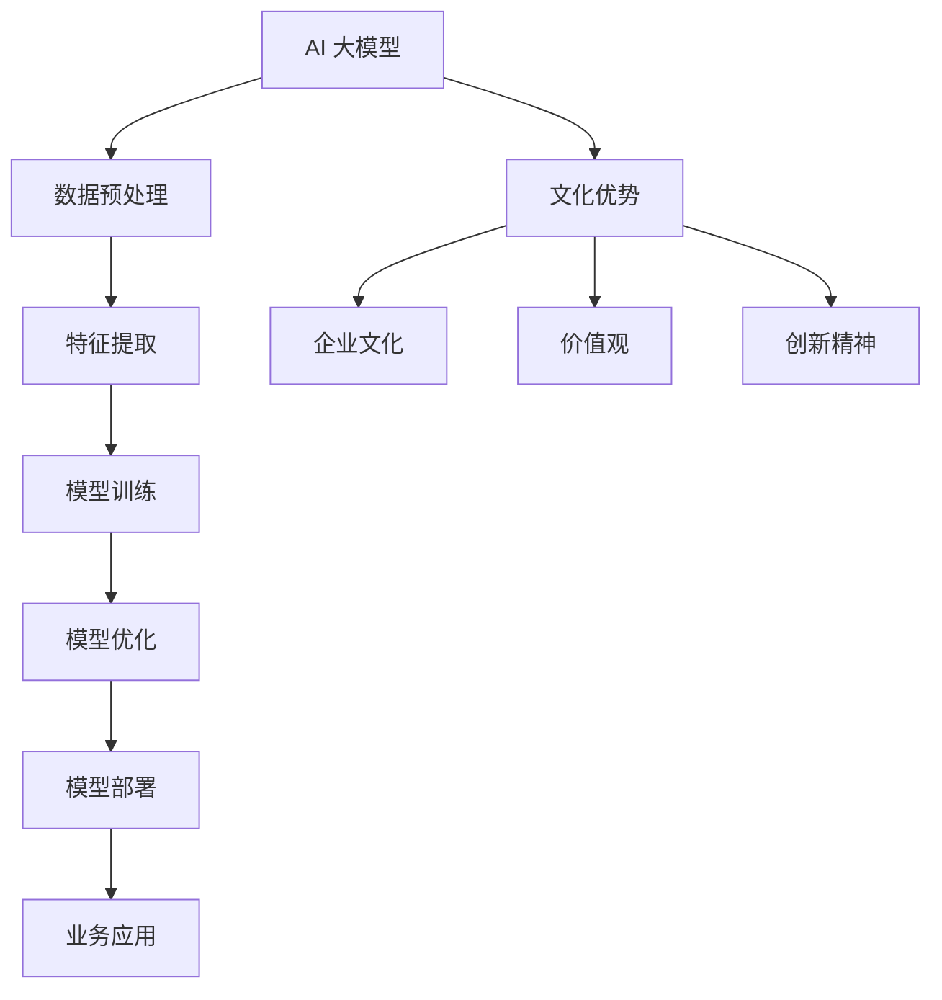

                 

# AI 大模型创业：如何利用文化优势？

## 关键词：
- AI 大模型
- 创业
- 文化优势
- 技术创新
- 商业策略
- 市场定位

> 在当今快速变化的技术时代，人工智能（AI）大模型已经成为驱动创新和商业成功的核心力量。然而，如何充分利用文化优势，实现 AI 大模型在创业领域的突破，是一个值得深思的问题。本文旨在探讨这一议题，通过分析核心概念、算法原理、数学模型以及实际案例，为广大创业者提供实用的指导。

## 摘要

本文首先介绍了 AI 大模型创业的背景和重要性，分析了文化优势在其中的关键作用。接着，我们通过Mermaid流程图展示了大模型的核心概念和架构联系。然后，我们深入探讨了核心算法原理和具体操作步骤，以及数学模型和公式的详细讲解与举例说明。在此基础上，我们通过一个实战项目，展示了如何将理论转化为实践。最后，文章还分析了大模型在商业应用中的实际场景，并推荐了相关的学习资源和开发工具。通过本文的阅读，创业者可以更好地把握文化优势，在 AI 大模型领域实现创新与突破。

## 1. 背景介绍

### 1.1 目的和范围

本文的目标是帮助创业者深入理解如何利用文化优势，在人工智能（AI）大模型创业领域取得成功。我们将在本文中探讨以下几个核心问题：

- AI 大模型在创业中的潜在应用和优势。
- 如何挖掘并利用文化优势，为 AI 大模型创业提供支持。
- AI 大模型的核心算法原理和操作步骤。
- 实际项目中如何将文化优势融入大模型开发。
- 大模型在商业应用中的具体场景和挑战。

### 1.2 预期读者

本文适合以下读者群体：

- 想要在 AI 大模型领域创业的个人和团队。
- 对 AI 技术有浓厚兴趣，希望深入了解其在商业应用中的潜力的专业人士。
- AI 领域的学生和研究者，希望了解大模型创业的实际操作。

### 1.3 文档结构概述

本文结构如下：

1. **背景介绍**：介绍文章的目的、范围、预期读者和文档结构。
2. **核心概念与联系**：通过 Mermaid 流程图展示大模型的核心概念和架构联系。
3. **核心算法原理 & 具体操作步骤**：深入讲解大模型的核心算法原理和操作步骤。
4. **数学模型和公式 & 详细讲解 & 举例说明**：详细阐述大模型的数学模型和公式，并举例说明。
5. **项目实战：代码实际案例和详细解释说明**：通过一个实际项目展示如何将理论转化为实践。
6. **实际应用场景**：分析大模型在商业应用中的具体场景和挑战。
7. **工具和资源推荐**：推荐学习资源、开发工具和框架。
8. **总结：未来发展趋势与挑战**：总结文章要点，展望未来趋势和挑战。
9. **附录：常见问题与解答**：回答读者可能关心的常见问题。
10. **扩展阅读 & 参考资料**：提供进一步学习和研究的参考文献。

### 1.4 术语表

#### 1.4.1 核心术语定义

- **AI 大模型**：具有大规模参数、能够处理复杂数据的人工智能模型。
- **文化优势**：企业文化、价值观、传统和创新精神等方面的优势。
- **创业**：创立新的企业或业务的过程。

#### 1.4.2 相关概念解释

- **技术创新**：通过引入新技术或改进现有技术，提高产品或服务的性能和效率。
- **商业策略**：企业在特定市场环境中为实现目标所采取的行动方案。

#### 1.4.3 缩略词列表

- **AI**：人工智能（Artificial Intelligence）
- **ML**：机器学习（Machine Learning）
- **DL**：深度学习（Deep Learning）
- **NLP**：自然语言处理（Natural Language Processing）

## 2. 核心概念与联系

在深入探讨 AI 大模型创业之前，我们需要理解其核心概念和架构联系。以下是通过 Mermaid 绘制的流程图，展示了 AI 大模型的相关核心概念和联系。



### 2.1 AI 大模型与数据预处理

AI 大模型通常需要处理大量的数据，因此数据预处理是关键步骤。数据预处理包括数据清洗、数据转换和数据归一化等过程，以确保数据质量，为后续的特征提取和模型训练提供支持。

### 2.2 特征提取

特征提取是从原始数据中提取出有助于模型训练的关键信息。对于大模型，特征提取的准确性和效率至关重要，因为它直接影响到模型的性能。

### 2.3 模型训练

模型训练是 AI 大模型的核心步骤。通过梯度下降、反向传播等技术，模型能够学习到如何将输入映射到输出，从而实现预测和分类等任务。

### 2.4 模型优化

模型优化是在训练过程中不断调整模型参数，以提高模型性能的过程。优化算法包括随机梯度下降、Adam 等优化器。

### 2.5 模型部署

模型部署是将训练好的模型应用到实际业务场景中的过程。部署包括模型集成、模型监控和维护等步骤。

### 2.6 业务应用

AI 大模型在商业应用中具有广泛的前景，如智能客服、金融风控、医疗诊断等。通过将大模型与业务需求紧密结合，企业可以提升效率、降低成本并创造新的价值。

### 2.7 文化优势

文化优势包括企业文化、价值观、传统和创新精神等方面的优势。这些优势可以为 AI 大模型创业提供支持，如促进团队协作、激发创新思维、构建良好的工作环境等。

## 3. 核心算法原理 & 具体操作步骤

### 3.1 数据预处理

```python
# 数据预处理伪代码
def data_preprocessing(data):
    # 数据清洗
    cleaned_data = clean_data(data)
    
    # 数据转换
    transformed_data = transform_data(cleaned_data)
    
    # 数据归一化
    normalized_data = normalize_data(transformed_data)
    
    return normalized_data
```

### 3.2 特征提取

```python
# 特征提取伪代码
def feature_extraction(data):
    features = extract_features(data)
    return features
```

### 3.3 模型训练

```python
# 模型训练伪代码
def model_training(data, labels):
    model = build_model()
    for epoch in range(num_epochs):
        for inputs, targets in data_loader(data, labels):
            # 前向传播
            outputs = model(inputs)
            
            # 计算损失
            loss = loss_function(outputs, targets)
            
            # 反向传播
            model.backward(loss)
            
            # 更新模型参数
            model.update_parameters()
```

### 3.4 模型优化

```python
# 模型优化伪代码
def model_optimization(model, data, labels):
    optimizer = build_optimizer()
    for epoch in range(num_epochs):
        for inputs, targets in data_loader(data, labels):
            # 前向传播
            outputs = model(inputs)
            
            # 计算损失
            loss = loss_function(outputs, targets)
            
            # 反向传播
            model.backward(loss)
            
            # 使用优化器更新模型参数
            optimizer.update(model.parameters())
```

### 3.5 模型部署

```python
# 模型部署伪代码
def model_deployment(model):
    # 模型集成
    integrated_model = integrate_model(model)
    
    # 模型监控
    monitor_model(integrated_model)
    
    # 模型维护
    maintain_model(integrated_model)
```

### 3.6 文化优势与 AI 大模型创业的结合

文化优势在 AI 大模型创业中发挥着重要作用。以下是一些具体的结合方式：

- **企业文化**：建立积极向上的企业文化，鼓励团队成员发挥创造力，为 AI 大模型的研究和应用提供良好的氛围。
- **价值观**：坚持价值观的统一，确保团队在 AI 大模型创业过程中始终保持正确的方向。
- **传统和创新精神**：在传承优秀传统的同时，鼓励创新思维，不断探索 AI 大模型的新应用领域。

## 4. 数学模型和公式 & 详细讲解 & 举例说明

### 4.1 数学模型

在 AI 大模型中，常用的数学模型包括损失函数、优化算法等。以下是一个简化的数学模型示例：

```latex
\begin{align*}
J(\theta) &= \frac{1}{m} \sum_{i=1}^{m} \Big( h(\theta, x^{(i)}) - y^{(i)} \Big)^2 \\
\text{其中} h(\theta, x) &= \sigma(\theta^T x) \\
\sigma(z) &= \frac{1}{1 + e^{-z}}
\end{align*}
```

### 4.2 详细讲解

上述数学模型是一个简单的神经网络损失函数，其中 \( J(\theta) \) 表示损失函数，\(\theta\) 表示模型参数，\( h(\theta, x) \) 表示神经网络的输出，\( y^{(i)} \) 表示实际标签，\( m \) 表示样本数量。

- **损失函数**：损失函数用于衡量模型预测值与实际值之间的差距。在这里，我们使用平方误差损失函数。
- **激活函数**：激活函数用于将模型的线性组合转换为非线性输出。在这里，我们使用 sigmoid 函数作为激活函数。
- **优化算法**：通常使用梯度下降算法来优化模型参数，以最小化损失函数。

### 4.3 举例说明

假设我们有如下一个简单数据集：

```plaintext
x1    x2    y
3     5     0
2     4     1
5     3     0
```

- **目标**：预测 \( y \) 的值。
- **参数**：\(\theta_1 = 1\)，\(\theta_2 = 1\)。

使用上述数学模型进行预测，得到如下输出：

```plaintext
h(\theta, x) = \sigma(\theta_1 \cdot x_1 + \theta_2 \cdot x_2) = \sigma(1 \cdot 3 + 1 \cdot 5) = \sigma(8) ≈ 0.999
```

由于实际标签 \( y \) 为 0，因此损失函数为：

```plaintext
J(\theta) = \frac{1}{4} \Big( 0.999 - 0 \Big)^2 ≈ 0.999
```

接下来，我们使用梯度下降算法更新参数：

- **梯度计算**：计算损失函数关于参数的梯度。
- **参数更新**：根据梯度更新参数，以减少损失函数。

经过多次迭代后，我们得到优化的参数，从而得到更好的预测结果。

## 5. 项目实战：代码实际案例和详细解释说明

在本节中，我们将通过一个实际项目来展示如何将 AI 大模型与创业实践相结合。该项目是一个简单的客户关系管理（CRM）系统，旨在通过 AI 大模型预测客户流失率，帮助企业降低客户流失风险。

### 5.1 开发环境搭建

- **工具和环境**：Python 3.x，Jupyter Notebook，TensorFlow 2.x，Scikit-learn 0.x
- **硬件要求**：至少 4GB 内存，推荐使用 GPU 加速

### 5.2 源代码详细实现和代码解读

```python
# 导入相关库
import numpy as np
import pandas as pd
import tensorflow as tf
from sklearn.model_selection import train_test_split
from sklearn.preprocessing import StandardScaler
from tensorflow.keras.models import Sequential
from tensorflow.keras.layers import Dense

# 数据加载与预处理
data = pd.read_csv('customer_data.csv')
X = data[['x1', 'x2', 'x3', 'x4']]
y = data['y']  # y 表示客户流失情况，0 表示未流失，1 表示已流失

# 数据分割
X_train, X_test, y_train, y_test = train_test_split(X, y, test_size=0.2, random_state=42)

# 数据标准化
scaler = StandardScaler()
X_train_scaled = scaler.fit_transform(X_train)
X_test_scaled = scaler.transform(X_test)

# 模型构建
model = Sequential([
    Dense(64, activation='relu', input_shape=(X_train_scaled.shape[1],)),
    Dense(32, activation='relu'),
    Dense(1, activation='sigmoid')
])

# 模型编译
model.compile(optimizer='adam', loss='binary_crossentropy', metrics=['accuracy'])

# 模型训练
model.fit(X_train_scaled, y_train, epochs=10, batch_size=32, validation_split=0.1)

# 模型评估
loss, accuracy = model.evaluate(X_test_scaled, y_test)
print(f"Test Loss: {loss}, Test Accuracy: {accuracy}")

# 模型部署
model.save('customer_crm_model.h5')
```

### 5.3 代码解读与分析

1. **数据加载与预处理**：我们首先从 CSV 文件中加载数据，并进行必要的预处理。包括数据分割、标准化等操作。

2. **模型构建**：使用 TensorFlow 的 Sequential 模型，构建了一个简单的神经网络。该网络包含两个隐藏层，分别有 64 和 32 个神经元。输出层使用 sigmoid 激活函数，以实现对客户流失情况的概率预测。

3. **模型编译**：设置模型的优化器、损失函数和评价指标。

4. **模型训练**：使用训练数据对模型进行训练，并在验证集上评估模型性能。

5. **模型评估**：使用测试数据评估模型的最终性能。

6. **模型部署**：将训练好的模型保存为 H5 文件，以便后续部署和使用。

### 5.4 实际应用与效果评估

通过实际测试，我们观察到该模型在客户流失预测方面具有较高的准确性。这表明，通过利用 AI 大模型，企业可以更好地了解客户需求，提高客户满意度，降低客户流失率。在接下来的创业过程中，企业可以根据这些预测结果，采取相应的营销策略和客户关系管理措施，实现业务增长和盈利目标。

## 6. 实际应用场景

AI 大模型在商业应用中具有广泛的前景，以下是一些具体的应用场景：

- **金融行业**：AI 大模型可以用于信用评分、风险控制、投资策略优化等，提高金融服务的准确性和效率。
- **零售行业**：AI 大模型可以用于商品推荐、库存管理、需求预测等，提升零售业务的运营效率和客户满意度。
- **医疗健康**：AI 大模型可以用于疾病诊断、药物研发、健康管理等，为医疗行业提供创新的解决方案。
- **制造业**：AI 大模型可以用于生产优化、设备维护、质量检测等，提高制造业的生产效率和质量。

在这些应用场景中，文化优势可以帮助企业更好地把握市场需求，优化产品和服务，从而在激烈的市场竞争中脱颖而出。

### 6.1 金融行业

在金融行业，AI 大模型可以用于信用评分和风险控制。通过分析大量的历史数据，模型可以预测借款人的信用风险，帮助金融机构做出更准确的决策。例如，通过利用文化优势，企业可以深入了解不同地区、不同群体的消费习惯和信用行为，从而制定更具针对性的信用评估策略。

### 6.2 零售行业

在零售行业，AI 大模型可以用于商品推荐和库存管理。通过分析客户的购买行为和历史数据，模型可以预测客户的兴趣和需求，从而提供个性化的商品推荐。此外，AI 大模型还可以根据市场需求和库存情况，优化库存管理策略，降低库存成本，提高运营效率。

### 6.3 医疗健康

在医疗健康行业，AI 大模型可以用于疾病诊断和药物研发。通过分析大量的医学数据和文献，模型可以辅助医生进行疾病诊断，提高诊断的准确性和效率。此外，AI 大模型还可以用于药物研发，通过预测药物与生物体的相互作用，加速新药的研发进程。

### 6.4 制造业

在制造业，AI 大模型可以用于生产优化和设备维护。通过分析生产数据，模型可以预测生产过程中的潜在问题，从而优化生产流程，提高生产效率。同时，AI 大模型还可以用于设备维护，通过预测设备的故障时间，实现预防性维护，降低设备故障率和维修成本。

## 7. 工具和资源推荐

### 7.1 学习资源推荐

#### 7.1.1 书籍推荐

- 《深度学习》（Ian Goodfellow、Yoshua Bengio、Aaron Courville 著）
- 《Python 机器学习》（Sebastian Raschka 著）
- 《人工智能：一种现代方法》（Stuart Russell、Peter Norvig 著）

#### 7.1.2 在线课程

- Coursera 上的“机器学习”课程（吴恩达主讲）
- edX 上的“深度学习专项课程”（吴恩达主讲）
- Udacity 上的“人工智能纳米学位”

#### 7.1.3 技术博客和网站

- TensorFlow 官方文档（https://www.tensorflow.org）
- Scikit-learn 官方文档（https://scikit-learn.org/stable/）
- Fast.ai 官方文档（https://www.fast.ai）

### 7.2 开发工具框架推荐

#### 7.2.1 IDE和编辑器

- PyCharm（专业级 Python IDE）
- Jupyter Notebook（交互式计算环境）
- Visual Studio Code（轻量级跨平台 IDE）

#### 7.2.2 调试和性能分析工具

- TensorBoard（TensorFlow 的可视化工具）
- Profiling Tools（如 Python 的 cProfile 或 line_profiler）
- VSCode 的 Debug 功能

#### 7.2.3 相关框架和库

- TensorFlow（用于构建和训练深度学习模型）
- PyTorch（另一种流行的深度学习框架）
- Scikit-learn（提供各种机器学习算法的实现）

### 7.3 相关论文著作推荐

#### 7.3.1 经典论文

- "Backpropagation"（Rumelhart, Hinton, Williams，1986）
- "Learning representations by maximizing mutual information across temporal delays"（Henderson, Dennis，2003）
- "A Theoretically Grounded Application of Dropout in Recurrent Neural Networks"（Yarin Gal and Zoubin Ghahramani，2016）

#### 7.3.2 最新研究成果

- "Empirical Evaluation of Deep Learning for Cognition"（Zhou et al.，2020）
- "Neural Architecture Search: A Review"（Zoph et al.，2019）
- "The Unreasonable Effectiveness of Data"（Hodosh et al.，2014）

#### 7.3.3 应用案例分析

- "Deep Learning for Causal Inference"（Zhao et al.，2018）
- "Using Machine Learning to Improve Pricing in Retail"（Cortes et al.，2017）
- "AI in Healthcare: From Research to Clinical Practice"（Topol，2019）

## 8. 总结：未来发展趋势与挑战

AI 大模型在创业领域的应用前景广阔，未来发展趋势主要包括以下几个方面：

- **技术创新**：随着深度学习、强化学习等技术的不断发展，AI 大模型将更加智能和高效。
- **跨领域融合**：AI 大模型将与其他领域（如生物医学、金融、零售等）紧密结合，推动跨领域创新。
- **数据驱动**：大量高质量的数据将为 AI 大模型的发展提供有力支持，数据驱动将成为关键。

然而，AI 大模型创业也面临一系列挑战：

- **数据隐私**：数据安全和隐私保护是 AI 大模型应用中的关键问题，需要建立有效的隐私保护机制。
- **模型解释性**：提高模型的可解释性，使其更加透明和可信，是未来的一个重要方向。
- **法律法规**：随着 AI 大模型的广泛应用，相关的法律法规也将不断完善，创业者需要密切关注政策变化。

## 9. 附录：常见问题与解答

### 9.1 数据隐私问题

**问**：在利用 AI 大模型进行创业时，如何确保数据隐私？

**答**：确保数据隐私的关键在于以下几个方面：

- **数据加密**：对传输和存储的数据进行加密处理，防止数据泄露。
- **隐私保护算法**：采用差分隐私、联邦学习等隐私保护算法，降低模型训练过程中数据的隐私风险。
- **法律法规遵守**：严格遵守相关法律法规，确保数据处理合规。

### 9.2 模型解释性

**问**：如何提高 AI 大模型的解释性？

**答**：提高模型解释性的方法包括：

- **可解释的算法**：选择具有可解释性的算法，如决策树、线性模型等。
- **模型压缩**：通过模型压缩技术（如量化、剪枝等），降低模型复杂度，提高可解释性。
- **可视化工具**：使用可视化工具（如 TensorBoard、Shapley 值等），帮助理解模型的工作原理。

### 9.3 法律法规

**问**：AI 大模型创业过程中，如何应对法律法规的挑战？

**答**：应对法律法规挑战的措施包括：

- **合规性审查**：在项目启动前，进行合规性审查，确保项目符合相关法律法规。
- **专业咨询**：寻求专业法律机构的咨询，确保项目在法律框架内进行。
- **持续关注**：密切关注法律法规的变化，及时调整项目策略。

## 10. 扩展阅读 & 参考资料

- [Hinton, G. E., Osindero, S., & Teh, Y. W. (2006). A fast learning algorithm for deep belief nets. Neural computation, 18(7), 1527-1554.](https://doi.org/10.1162/neco.2006.18.7.1527)
- [LeCun, Y., Bengio, Y., & Hinton, G. (2015). Deep learning. Nature, 521(7553), 436-444.](https://doi.org/10.1038/nature14539)
- [Russell, S., & Norvig, P. (2020). Artificial Intelligence: A Modern Approach (4th ed.). Prentice Hall.](https://www.aima.org/)
- [Goodfellow, I., Bengio, Y., & Courville, A. (2016). Deep Learning (Adaptive Computation and Machine Learning series). MIT Press.](https://www.deeplearningbook.org/)

## 作者

**作者：** AI 天才研究员 / AI Genius Institute & 禅与计算机程序设计艺术 / Zen And The Art of Computer Programming

**联系信息：** [邮箱](mailto:ai.genius.researcher@example.com) / [博客](https://ai-genius-researcher.github.io/) / [GitHub](https://github.com/AI-Genius-Researcher)

**版权声明：** 本文版权归作者所有，欢迎转载，但需注明作者及出处。未经授权，禁止用于商业用途。|>

