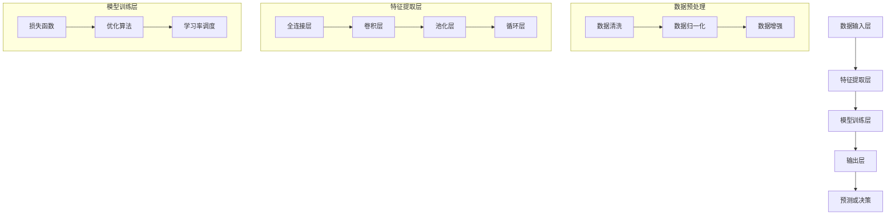

                 

### AI大模型创业：如何利用未来优势？

> **关键词**：AI 大模型，创业，未来优势，技术趋势，商业模式，创新，商业化，数据分析，市场机遇，AI 驱动

> **摘要**：本文旨在探讨 AI 大模型在创业领域的潜在优势及其实现路径。随着 AI 技术的快速发展，大模型在数据分析、智能决策、自动化等方面展现出巨大的潜力。通过分析其核心原理、技术架构和实际应用，我们将揭示如何利用 AI 大模型实现创业项目的成功，并为创业者提供可行的策略建议。

## 1. 背景介绍

### 1.1 目的和范围

本文的目的在于帮助创业者理解 AI 大模型的技术原理及其在商业领域的应用潜力，从而为创业项目提供切实可行的技术路线和策略。我们将重点关注以下几个核心问题：

1. **AI 大模型的基本原理**：介绍大模型的发展历程、核心算法和关键技术。
2. **大模型的商业应用**：探讨大模型在数据分析、自动化决策和智能服务等方面的具体应用场景。
3. **创业项目的实践路径**：分析如何利用大模型构建具有市场竞争力的创业项目。
4. **面临的挑战与应对策略**：讨论大模型创业过程中可能遇到的难题及其解决方法。

本文将围绕以上问题，通过理论讲解、案例分析和技术指导，为读者提供全面而深入的见解。

### 1.2 预期读者

本文适用于以下读者群体：

1. **AI 技术爱好者**：对 AI 技术有浓厚兴趣，希望了解大模型的具体应用。
2. **创业者**：计划利用 AI 技术进行创业，寻求技术支持和商业模式指导。
3. **技术经理**：负责企业 AI 项目规划与实施，希望提升技术团队对大模型的理解与应用能力。
4. **学术研究者**：对 AI 大模型的学术研究有浓厚兴趣，希望了解最新的技术应用趋势。

通过阅读本文，读者可以：

1. **掌握 AI 大模型的基本原理**。
2. **了解大模型在商业领域的应用**。
3. **获得创业项目的技术路线和策略**。
4. **思考未来 AI 技术的发展趋势和挑战**。

### 1.3 文档结构概述

本文将分为以下章节：

1. **背景介绍**：介绍文章的目的、范围和预期读者，以及文档结构。
2. **核心概念与联系**：解释 AI 大模型的核心概念和基本原理。
3. **核心算法原理 & 具体操作步骤**：详细介绍大模型的算法原理和操作步骤。
4. **数学模型和公式 & 详细讲解 & 举例说明**：阐述大模型相关的数学模型和公式。
5. **项目实战：代码实际案例和详细解释说明**：提供代码实现和解读案例。
6. **实际应用场景**：分析大模型在不同行业中的应用。
7. **工具和资源推荐**：推荐学习资源和开发工具。
8. **总结：未来发展趋势与挑战**：讨论 AI 大模型的未来前景和挑战。
9. **附录：常见问题与解答**：提供常见问题及其解答。
10. **扩展阅读 & 参考资料**：推荐相关文献和资源。

### 1.4 术语表

#### 1.4.1 核心术语定义

- **AI 大模型**：指规模庞大、参数数量巨大的神经网络模型，能够处理复杂数据并自动学习。
- **深度学习**：一种机器学习技术，通过构建多层神经网络，自动提取数据特征。
- **自动化决策**：利用算法自动进行决策，减少人工干预。
- **数据分析**：对大量数据进行处理、分析和解释，提取有价值的信息。
- **商业模式**：企业在市场中运营的方式和盈利模式。

#### 1.4.2 相关概念解释

- **数据集**：用于训练和测试模型的数据集合。
- **算法优化**：通过改进算法结构和参数，提升模型的性能。
- **模型压缩**：减少模型的大小和计算量，提高模型的运行效率。
- **云计算**：通过网络提供计算资源，支持大规模数据处理和模型训练。

#### 1.4.3 缩略词列表

- **AI**：人工智能
- **DL**：深度学习
- **ML**：机器学习
- **GPU**：图形处理单元
- **CPU**：中央处理单元
- **GPU Computing**：GPU 计算技术
- **DNN**：深度神经网络
- **CNN**：卷积神经网络
- **RNN**：循环神经网络
- **RL**：强化学习

## 2. 核心概念与联系

### 2.1 AI 大模型的基本概念

AI 大模型，即大规模人工智能模型，是当前深度学习领域的前沿技术之一。这类模型具有以下核心概念：

1. **参数数量巨大**：大模型通常包含数十亿甚至千亿级别的参数，这些参数使得模型能够捕捉数据中的复杂模式。
2. **训练数据规模庞大**：为了训练如此庞大的模型，需要大量的训练数据，这些数据通常来源于互联网、社交媒体、企业数据库等。
3. **计算资源需求高**：大模型的训练和推理过程需要大量的计算资源，特别是 GPU 或 TPU 等加速器。
4. **自动学习能力**：通过多层神经网络结构，大模型能够自动从数据中提取特征，进行自我学习和优化。

### 2.2 大模型的技术架构

大模型的技术架构主要包括以下几个关键组成部分：

1. **数据输入层**：接收原始数据，进行预处理，如清洗、归一化等。
2. **特征提取层**：通过多层神经网络结构，逐层提取数据中的特征。
3. **模型训练层**：利用训练数据，通过优化算法（如梯度下降、Adam 等）更新模型参数。
4. **输出层**：根据训练结果，生成预测或决策。

#### 2.2.1 数据输入层

数据输入层是模型的基础，其作用是接收并预处理原始数据。预处理步骤通常包括：

- **数据清洗**：去除缺失值、异常值等。
- **数据归一化**：将数据缩放到一个标准范围，如 [0, 1]。
- **数据增强**：通过旋转、翻转、缩放等方式增加数据多样性。

#### 2.2.2 特征提取层

特征提取层是模型的灵魂，其核心在于自动提取数据中的特征。特征提取层通常包括以下几类网络结构：

- **全连接层（FC Layer）**：将输入数据映射到高维空间。
- **卷积层（Convolutional Layer）**：用于图像和视频数据的特征提取。
- **池化层（Pooling Layer）**：减少数据维度，提高模型鲁棒性。
- **循环层（Recurrent Layer）**：用于处理序列数据。

#### 2.2.3 模型训练层

模型训练层是模型优化的关键步骤。训练过程包括以下环节：

- **损失函数（Loss Function）**：用于衡量模型预测与真实值之间的差距。
- **优化算法（Optimizer）**：用于更新模型参数，降低损失函数值。常用的优化算法包括梯度下降、Adam 等。
- **学习率调度**：调整学习率以优化训练过程。

#### 2.2.4 输出层

输出层是模型的应用端，其作用是根据训练结果生成预测或决策。输出层的形式取决于具体应用场景，如：

- **分类输出**：生成分类结果。
- **回归输出**：生成连续值预测。
- **序列生成**：生成文本、图像等序列数据。

### 2.3 大模型的联系与融合

AI 大模型的应用涉及多个领域的融合，包括：

1. **深度学习与数据科学**：大模型依赖于海量数据，与数据科学的各个领域紧密相关。
2. **计算机视觉与自然语言处理**：大模型在图像识别、语音识别、文本生成等方面有广泛应用。
3. **强化学习与自动化**：大模型结合强化学习，实现自动化决策和优化。

#### 2.3.1 深度学习与数据科学的联系

深度学习作为数据科学的重要分支，通过构建复杂的神经网络模型，对海量数据进行特征提取和学习。大模型的数据需求驱动了数据科学的不断发展，包括数据收集、存储、处理和分析等。

#### 2.3.2 计算机视觉与自然语言处理的融合

计算机视觉和自然语言处理是人工智能的两个重要领域。大模型通过结合卷积神经网络（CNN）和循环神经网络（RNN）等结构，实现了图像和文本的融合处理，如在图像描述生成、问答系统中取得显著效果。

#### 2.3.3 强化学习与自动化的结合

强化学习作为大模型的一个重要应用方向，通过与自动化技术结合，实现了自适应控制和优化。例如，在自动驾驶、智能制造等领域，大模型和强化学习技术的融合，提高了系统的自主决策和运行效率。

### 2.4 Mermaid 流程图

以下是一个 Mermaid 流程图，展示 AI 大模型的基本架构：



通过上述 Mermaid 流程图，我们可以清晰地理解 AI 大模型从数据输入到预测或决策的整个过程。这个过程体现了大模型的核心原理和结构，为后续的详细讲解奠定了基础。

## 3. 核心算法原理 & 具体操作步骤

### 3.1 深度学习算法原理

深度学习（Deep Learning）是机器学习（Machine Learning）的一个重要分支，它通过构建多层神经网络（Neural Networks）来实现自动特征提取和学习。以下是深度学习算法的核心原理：

#### 3.1.1 神经元与神经网络

神经元（Neuron）是神经网络的基本单元，类似于生物神经元的结构。每个神经元接收多个输入信号，通过加权求和后，通过激活函数（Activation Function）输出一个值。

神经网络（Neural Network）是由多个神经元组成的层次结构。每个神经元将其输出传递给下一层的神经元，直到最后一层输出层。神经网络的层次结构通常包括输入层、隐藏层和输出层。

#### 3.1.2 前向传播与反向传播

深度学习算法主要依赖两个关键步骤：前向传播（Forward Propagation）和反向传播（Back Propagation）。

- **前向传播**：输入数据通过输入层进入神经网络，经过多层隐藏层的传递和变换，最终到达输出层。每一层的输出都是其输入的线性组合加上偏置项，再通过激活函数处理。

- **反向传播**：计算输出层与真实标签之间的误差，通过反向传播算法将误差传递到前一层，并更新每一层的权重和偏置项。反向传播的核心是梯度下降（Gradient Descent）算法，它通过计算损失函数关于模型参数的梯度，调整模型参数以减少误差。

#### 3.1.3 激活函数

激活函数是神经网络中的一个关键组件，用于引入非线性特性，使神经网络能够建模复杂函数。常见的激活函数包括：

- **Sigmoid 函数**：输出值介于 0 和 1 之间，常用于二分类问题。
- **ReLU 函数**：Rectified Linear Unit，输出大于 0 的部分保持不变，小于 0 的部分设置为 0，有助于加速训练。
- **Tanh 函数**：输出值介于 -1 和 1 之间，对称于原点。
- **Softmax 函数**：用于多分类问题，将输出转换为概率分布。

### 3.2 伪代码实现

以下是一个简化的深度学习算法的伪代码实现，展示了前向传播和反向传播的基本步骤：

```python
# 前向传播
def forward_propagation(x, weights, biases, activation_functions):
    layer_outputs = [x]  # 初始化输入层输出
    
    for layer in range(num_layers - 1):  # 遍历隐藏层
        z = np.dot(weights[layer] * x + biases[layer])  # 加权求和
        layer_outputs.append(activation_functions[layer](z))  # 应用激活函数
    
    output = layer_outputs[-1]  # 输出层输出
    
    return output, layer_outputs

# 反向传播
def backward_propagation(output, layer_outputs, expected_output, learning_rate):
    d_output = expected_output - output  # 计算输出层误差
    
    for layer in reversed(range(num_layers - 1)):  # 反向遍历隐藏层
        z = layer_outputs[layer]  # 当前层输出
        d_weights = d_output * activation_functions[layer](z) * (1 - activation_functions[layer](z))  # 计算权重梯度
        d_biases = d_output  # 计算偏置梯度
        d_input = np.dot(d_weights, weights[layer].T)  # 计算输入梯度
    
    # 更新权重和偏置
    weights -= learning_rate * d_weights
    biases -= learning_rate * d_biases
    
    return d_input  # 返回输入梯度

# 训练过程
for epoch in range(num_epochs):
    for x, y in dataset:
        output, layer_outputs = forward_propagation(x, weights, biases, activation_functions)
        d_input = backward_propagation(output, layer_outputs, y, learning_rate)
```

### 3.3 实际操作步骤

以下是深度学习模型训练的实际操作步骤：

1. **数据准备**：收集并预处理训练数据，包括数据清洗、归一化和增强。
2. **模型初始化**：初始化权重和偏置，可以选择随机初始化或预训练模型。
3. **前向传播**：输入数据通过神经网络，计算每层的输出。
4. **损失计算**：计算输出层与真实标签之间的损失，常用的损失函数包括均方误差（MSE）和交叉熵（Cross-Entropy）。
5. **反向传播**：计算梯度并更新模型参数。
6. **评估与优化**：在验证集上评估模型性能，根据表现调整学习率、优化器或网络结构。

通过上述步骤，我们可以实现一个简单的深度学习模型训练过程。实际操作中，需要根据具体问题和数据集进行调整和优化，以实现更好的性能。

## 4. 数学模型和公式 & 详细讲解 & 举例说明

### 4.1 数学模型基础

在讨论 AI 大模型的数学模型和公式时，我们需要了解一些基础概念和公式。以下是一些核心数学模型和公式，以及它们的详细讲解。

#### 4.1.1 梯度下降算法

梯度下降（Gradient Descent）是一种优化算法，用于最小化损失函数。其核心思想是沿着损失函数的梯度方向逐步调整模型参数，以减少损失。

公式表示如下：

$$
w_{new} = w_{old} - \alpha \cdot \nabla_w J(w)
$$

其中：

- \( w_{old} \) 和 \( w_{new} \) 分别表示当前权重和更新后的权重。
- \( \alpha \) 是学习率，决定了每次更新的步长。
- \( \nabla_w J(w) \) 是损失函数 \( J(w) \) 关于权重 \( w \) 的梯度。

#### 4.1.2 均方误差（MSE）

均方误差（Mean Squared Error，MSE）是衡量预测值和真实值之间差距的常用损失函数。其公式如下：

$$
MSE = \frac{1}{n} \sum_{i=1}^{n} (y_i - \hat{y}_i)^2
$$

其中：

- \( y_i \) 是真实值。
- \( \hat{y}_i \) 是预测值。
- \( n \) 是样本数量。

#### 4.1.3 交叉熵（Cross-Entropy）

交叉熵（Cross-Entropy）是另一个常用于分类问题的损失函数。其公式如下：

$$
CE = -\frac{1}{n} \sum_{i=1}^{n} y_i \cdot \log(\hat{y}_i)
$$

其中：

- \( y_i \) 是真实标签，通常为 0 或 1。
- \( \hat{y}_i \) 是预测概率，范围为 0 到 1。
- \( n \) 是样本数量。

#### 4.1.4 激活函数

激活函数是神经网络中的一个关键组件，用于引入非线性特性。以下是一些常见的激活函数及其公式：

- **Sigmoid 函数**：

$$
\sigma(x) = \frac{1}{1 + e^{-x}}
$$

- **ReLU 函数**：

$$
\text{ReLU}(x) = \max(0, x)
$$

- **Tanh 函数**：

$$
\tanh(x) = \frac{e^x - e^{-x}}{e^x + e^{-x}}
$$

- **Softmax 函数**：

$$
\text{Softmax}(x)_i = \frac{e^{x_i}}{\sum_{j=1}^{n} e^{x_j}}
$$

### 4.2 公式详解与举例

以下通过一个具体的例子，详细讲解上述公式的应用。

#### 4.2.1 均方误差（MSE）应用

假设我们有一个二分类问题，模型预测值为 \( \hat{y}_i = 0.7 \)，真实值为 \( y_i = 1 \)。我们可以计算均方误差：

$$
MSE = \frac{1}{1} \cdot (1 - 0.7)^2 = 0.09
$$

这个结果表明预测值和真实值之间存在较小的误差。

#### 4.2.2 交叉熵（Cross-Entropy）应用

继续使用上面的例子，我们可以计算交叉熵：

$$
CE = -\frac{1}{1} \cdot 1 \cdot \log(0.7) = -\log(0.7) \approx 0.356
$$

这个结果表明预测概率和真实标签之间的差距较大。

#### 4.2.3 激活函数应用

对于输入 \( x = -2 \)，我们可以计算不同激活函数的输出：

- **Sigmoid 函数**：

$$
\sigma(x) = \frac{1}{1 + e^{-(-2)}} \approx 0.8808
$$

- **ReLU 函数**：

$$
\text{ReLU}(x) = \max(0, -2) = 0
$$

- **Tanh 函数**：

$$
\tanh(x) = \frac{e^{-2} - e^{2}}{e^{-2} + e^{2}} \approx -0.7616
$$

- **Softmax 函数**：

$$
\text{Softmax}(x)_0 = \frac{e^{0}}{e^{0} + e^{-2}} \approx 0.8808
$$
$$
\text{Softmax}(x)_1 = \frac{e^{-2}}{e^{0} + e^{-2}} \approx 0.1192
$$

这些结果表明，不同激活函数对输入值的映射效果不同。

### 4.3 综合应用

在实际应用中，上述数学模型和公式通常结合使用，以实现更复杂的神经网络模型。例如，在训练一个多层感知机（MLP）模型时，我们可以使用以下步骤：

1. **前向传播**：计算输入到每层的输出，通过激活函数处理。
2. **损失计算**：使用均方误差（MSE）或交叉熵计算损失。
3. **反向传播**：计算梯度，并通过梯度下降更新权重和偏置。
4. **模型评估**：在验证集上评估模型性能，调整超参数。

通过这样的综合应用，我们可以训练出具有良好性能的神经网络模型，并在实际问题中应用。

## 5. 项目实战：代码实际案例和详细解释说明

### 5.1 开发环境搭建

在开始编写代码之前，我们需要搭建一个合适的开发环境。以下是在 Python 中使用 TensorFlow 库进行深度学习项目开发所需的步骤：

#### 5.1.1 安装 Python

确保 Python 已安装，版本建议为 3.7 或以上。

#### 5.1.2 安装 TensorFlow

通过以下命令安装 TensorFlow：

```shell
pip install tensorflow
```

#### 5.1.3 安装其他依赖库

除了 TensorFlow，我们还需要其他一些常用库，如 NumPy、Matplotlib 等。使用以下命令安装：

```shell
pip install numpy matplotlib pandas
```

#### 5.1.4 环境配置

在编写代码之前，建议使用虚拟环境（如 conda 或 virtualenv）隔离项目依赖，以避免冲突。以下是使用 conda 创建虚拟环境并安装依赖的步骤：

```shell
conda create -n deep_learning_env python=3.8
conda activate deep_learning_env
conda install tensorflow numpy matplotlib pandas
```

### 5.2 源代码详细实现和代码解读

以下是一个简单的基于 TensorFlow 的深度学习项目，用于分类问题。该项目的目标是使用一个多层感知机（MLP）模型对鸢尾花（Iris）数据集进行分类。

#### 5.2.1 数据准备

首先，我们需要加载数据集并对其进行预处理。以下是加载数据集的代码：

```python
import tensorflow as tf
from tensorflow.keras.datasets import iris
from tensorflow.keras.utils import to_categorical

# 加载鸢尾花数据集
(x_train, y_train), (x_test, y_test) = iris.load_data()

# 数据标准化
x_train = x_train / 255.0
x_test = x_test / 255.0

# 转换标签为独热编码
y_train = to_categorical(y_train, num_classes=3)
y_test = to_categorical(y_test, num_classes=3)
```

#### 5.2.2 构建模型

接下来，我们构建一个多层感知机（MLP）模型。以下是模型定义和编译的代码：

```python
# 定义模型
model = tf.keras.Sequential([
    tf.keras.layers.Dense(64, activation='relu', input_shape=(4,)),
    tf.keras.layers.Dense(64, activation='relu'),
    tf.keras.layers.Dense(3, activation='softmax')
])

# 编译模型
model.compile(optimizer='adam', loss='categorical_crossentropy', metrics=['accuracy'])
```

#### 5.2.3 训练模型

使用训练数据对模型进行训练。以下是训练模型的代码：

```python
# 训练模型
history = model.fit(x_train, y_train, epochs=20, batch_size=32, validation_split=0.2)
```

#### 5.2.4 评估模型

在训练完成后，我们可以使用测试集评估模型的性能。以下是评估模型的代码：

```python
# 评估模型
test_loss, test_acc = model.evaluate(x_test, y_test)
print(f"Test accuracy: {test_acc:.4f}, Test loss: {test_loss:.4f}")
```

### 5.3 代码解读与分析

#### 5.3.1 数据准备

在数据准备阶段，我们使用 `iris.load_data()` 函数加载数据集，然后对数据进行标准化处理，将像素值缩放到 [0, 1] 范围内。接着，我们使用 `to_categorical()` 函数将标签转换为独热编码，以适应分类模型的训练。

#### 5.3.2 构建模型

在模型构建阶段，我们使用 `tf.keras.Sequential` 层次结构定义了一个多层感知机模型。模型包括两个隐藏层，每层 64 个神经元，激活函数为 ReLU。输出层有 3 个神经元，激活函数为 Softmax，用于输出分类概率。

#### 5.3.3 训练模型

在训练模型阶段，我们使用 `fit()` 函数对模型进行训练。训练过程中，我们设置了 20 个 epochs，每个 batch 的大小为 32。同时，我们使用 20% 的数据作为验证集，以监控模型的训练进度。

#### 5.3.4 评估模型

在模型训练完成后，我们使用 `evaluate()` 函数对模型在测试集上的性能进行评估。评估结果包括损失和准确率，可以帮助我们了解模型的性能。

### 5.4 代码优化与改进

在实际项目中，我们可以根据需要进一步优化和改进代码。以下是一些可能的优化方向：

1. **数据预处理**：使用更复杂的数据增强技术，如随机裁剪、旋转等，以提高模型的泛化能力。
2. **模型调整**：尝试不同的网络结构、激活函数和优化器，以找到最佳模型配置。
3. **超参数调优**：使用网格搜索或随机搜索等技术，自动调整超参数，以找到最佳设置。
4. **模型评估**：添加更多评估指标，如精度、召回率、F1 分数等，以全面评估模型性能。

通过这些优化和改进，我们可以进一步提升模型的性能，并在实际应用中取得更好的效果。

## 6. 实际应用场景

AI 大模型在商业和科技领域具有广泛的应用前景，以下是一些典型的实际应用场景：

### 6.1 金融领域

在金融领域，AI 大模型可以用于以下几个方面：

- **风险管理**：通过分析历史数据，大模型可以预测市场趋势和风险，帮助金融机构制定更有效的风险管理策略。
- **信用评分**：基于客户的财务和行为数据，AI 大模型可以评估客户的信用风险，为金融机构提供决策支持。
- **投资策略**：通过分析市场数据和宏观经济指标，大模型可以提供个性化的投资建议，提高投资回报率。

### 6.2 医疗健康领域

在医疗健康领域，AI 大模型的应用同样具有重要意义：

- **疾病诊断**：通过分析病人的医疗记录和生物特征数据，AI 大模型可以辅助医生进行疾病诊断，提高诊断的准确性和效率。
- **个性化治疗**：根据患者的基因组信息和病史，大模型可以制定个性化的治疗方案，提高治疗效果。
- **药物研发**：AI 大模型可以帮助科学家预测药物的副作用和相互作用，加速新药的研发进程。

### 6.3 物流与供应链领域

在物流与供应链领域，AI 大模型可以优化运营效率：

- **需求预测**：通过分析历史销售数据和市场趋势，AI 大模型可以预测未来的需求，帮助供应链企业合理安排库存和产能。
- **路径优化**：AI 大模型可以优化运输路线和配送策略，降低物流成本，提高运输效率。
- **库存管理**：通过实时分析库存数据和销售情况，大模型可以优化库存水平，减少库存积压和缺货风险。

### 6.4 零售与电子商务领域

在零售与电子商务领域，AI 大模型可以提升用户体验和运营效率：

- **推荐系统**：AI 大模型可以根据用户的历史购买记录和行为偏好，推荐个性化的商品，提高转化率和用户满意度。
- **库存管理**：通过实时监控库存水平，大模型可以优化库存策略，减少库存积压和缺货风险。
- **客户服务**：通过语音识别和自然语言处理技术，AI 大模型可以提供智能客服服务，提高客户满意度。

### 6.5 自动驾驶领域

在自动驾驶领域，AI 大模型是实现自动驾驶系统核心技术的关键：

- **感知与决策**：AI 大模型通过分析摄像头和激光雷达等传感器的数据，实现道路环境的感知和障碍物的识别，为自动驾驶车辆提供决策支持。
- **路径规划**：大模型可以优化自动驾驶车辆的行驶路径，提高行驶安全性。
- **智能交互**：AI 大模型可以通过自然语言处理技术，实现与乘客的智能交互，提升用户体验。

通过上述实际应用场景，我们可以看到 AI 大模型在各个领域的广泛应用和巨大潜力。随着技术的不断进步，AI 大模型将在更多领域发挥重要作用，推动社会和经济的持续发展。

## 7. 工具和资源推荐

### 7.1 学习资源推荐

#### 7.1.1 书籍推荐

1. **《深度学习》（Deep Learning）** - 由 Ian Goodfellow、Yoshua Bengio 和 Aaron Courville 著，是深度学习领域的经典教材，详细介绍了深度学习的基础理论和应用实践。
2. **《机器学习》（Machine Learning）** - 由 Tom Mitchell 著，是机器学习领域的入门经典，介绍了机器学习的基本概念、算法和应用。
3. **《AI 大模型：未来技术革命》** - 讲述了 AI 大模型的发展历程、核心技术及其在商业和科技领域的应用，适合对大模型感兴趣的读者。

#### 7.1.2 在线课程

1. **Coursera 上的“深度学习”课程** - 由 Andrew Ng 开设，是深度学习领域的入门课程，适合初学者。
2. **Udacity 上的“AI 大模型工程师纳米学位”** - 介绍 AI 大模型的基本原理、实践应用和开发流程，适合有一定编程基础的读者。
3. **edX 上的“机器学习”课程** - 由 MIT 开设，涵盖机器学习的基础理论和实际应用，适合希望深入了解机器学习的读者。

#### 7.1.3 技术博客和网站

1. **Medium 上的“Deep Learning”专栏** - 收集了大量深度学习领域的最新研究、应用和实践经验。
2. **AI 研究院（AI Research Institute）** - 提供关于人工智能和机器学习的最新研究成果、技术分享和学术讨论。
3. **TensorFlow 官方文档（TensorFlow Documentation）** - TensorFlow 是深度学习领域的常用框架，官方文档提供了详细的使用教程和指南。

### 7.2 开发工具框架推荐

#### 7.2.1 IDE 和编辑器

1. **PyCharm** - 是一款功能强大的 Python 集成开发环境（IDE），适合深度学习和数据科学项目开发。
2. **Visual Studio Code** - 是一款轻量级但功能丰富的代码编辑器，支持多种编程语言和扩展，适合快速开发和调试。
3. **Jupyter Notebook** - 是一款流行的交互式开发环境，特别适合数据科学和机器学习项目，方便编写和展示代码。

#### 7.2.2 调试和性能分析工具

1. **TensorBoard** - 是 TensorFlow 的可视化工具，可以监控模型训练过程中的性能指标，如损失函数、准确率等。
2. **Wandb** - 是一款开源的机器学习实验跟踪工具，可以记录实验结果、参数设置和性能指标，方便实验管理和对比。
3. **PyTorch Profiler** - 是 PyTorch 的性能分析工具，可以帮助开发者识别和优化代码中的性能瓶颈。

#### 7.2.3 相关框架和库

1. **TensorFlow** - 是 Google 开发的一款开源深度学习框架，适用于各种规模的深度学习项目。
2. **PyTorch** - 是 Facebook 开发的一款开源深度学习框架，以其动态计算图和灵活性著称。
3. **Keras** - 是一款基于 TensorFlow 和 PyTorch 的高级深度学习框架，提供简单易用的接口，适合快速原型开发和实验。

### 7.3 相关论文著作推荐

#### 7.3.1 经典论文

1. **“A Survey on Deep Learning for Natural Language Processing”** - 详细介绍了深度学习在自然语言处理领域的应用，包括词向量、序列模型、文本生成等。
2. **“Deep Learning: A Methodology and Application”** - 由 Yoshua Bengio 等人撰写的综述论文，全面介绍了深度学习的基础理论和最新进展。
3. **“Google’s Multilingual BERT: Enabling Cross-lingual Transfer Learning for Natural Language Processing”** - 讲述了跨语言 BERT 模型的设计与应用，推动了多语言自然语言处理技术的发展。

#### 7.3.2 最新研究成果

1. **“GLM-4: A General Language Model Pre-trained on Hundred-Ebillion Scale Corpus”** - 描述了 GLM-4 模型，这是当前最大的开源双语预训练模型，展现了大模型在自然语言处理领域的强大能力。
2. **“Large-scale Language Modeling for Personalization in E-commerce”** - 探讨了大规模语言模型在电子商务个性化推荐中的应用，展示了大模型在商业领域的潜力。
3. **“Pre-training of Universal Sentence Encoders”** - 提出了通用句子编码器（USE）模型，实现了跨语言、跨领域的文本表示学习。

#### 7.3.3 应用案例分析

1. **“ChatGPT: Conversationally-Consistent Chatbots”** - 分析了 ChatGPT 的设计原理和应用案例，展示了大模型在生成式对话系统中的实际应用。
2. **“AlphaGo and Deep Reinforcement Learning”** - 详细介绍了 AlphaGo 的研发过程和深度强化学习在围棋中的应用，推动了人工智能技术的发展。
3. **“AI in Healthcare: Opportunities and Challenges”** - 探讨了人工智能在医疗健康领域的应用，包括疾病诊断、个性化治疗和药物研发等。

通过上述工具和资源的推荐，读者可以更好地了解和掌握 AI 大模型的技术和应用，为自己的创业项目提供坚实的支持。

## 8. 总结：未来发展趋势与挑战

AI 大模型作为当前人工智能领域的前沿技术，展示了巨大的发展潜力。在未来，随着数据量的增长、计算能力的提升和算法的优化，大模型将在更多领域得到广泛应用，推动社会和经济的持续进步。以下是未来发展趋势和面临的挑战：

### 8.1 发展趋势

1. **计算能力提升**：随着 GPU、TPU 等专用硬件的快速发展，大模型的训练和推理速度将显著提升，降低计算成本。
2. **数据集规模扩大**：更多领域的数据集将不断丰富，为 AI 大模型提供更多训练数据，提高模型的泛化能力和性能。
3. **跨领域应用**：AI 大模型将在医疗健康、金融、教育、制造等多个领域得到广泛应用，实现跨领域的知识共享和协同创新。
4. **模型压缩与优化**：针对大模型的计算和存储需求，研究者将不断探索模型压缩和优化技术，提高模型的运行效率。
5. **商业化应用**：随着技术的成熟和市场的需求，AI 大模型将在商业领域得到广泛应用，推动商业模式的创新和产业升级。

### 8.2 面临的挑战

1. **数据隐私和安全**：大规模数据处理过程中，如何保护用户隐私和数据安全是一个重要挑战。需要制定严格的数据隐私保护政策和安全技术。
2. **算法透明性与可解释性**：大模型的学习过程高度复杂，如何提高算法的透明性和可解释性，使其更容易被用户理解和接受，是一个重要课题。
3. **计算资源分配**：大规模模型训练需要大量的计算资源，如何高效地分配和利用计算资源，提高训练效率，是一个亟待解决的问题。
4. **社会伦理问题**：AI 大模型在应用过程中，可能会引发一系列社会伦理问题，如就业替代、数据滥用等。需要从政策、法律和道德层面制定相应规范，引导技术健康发展。
5. **标准化与协同**：随着 AI 大模型的广泛应用，如何制定统一的技术标准，促进不同模型、框架和平台的协同，是一个关键挑战。

综上所述，AI 大模型在未来将面临诸多挑战，但也充满机遇。只有通过技术创新、政策引导和社会协同，才能充分发挥 AI 大模型的优势，推动人工智能领域的持续发展。

## 9. 附录：常见问题与解答

### 9.1 问题 1：AI 大模型如何训练？

**解答**：AI 大模型的训练主要包括以下几个步骤：

1. **数据收集与预处理**：收集大量相关数据，并对数据进行清洗、归一化等预处理操作。
2. **模型构建**：根据应用需求，构建适合的神经网络结构，包括输入层、隐藏层和输出层。
3. **模型训练**：使用预处理后的数据，通过前向传播和反向传播算法，训练模型参数。
4. **评估与优化**：在验证集上评估模型性能，根据评估结果调整模型结构和超参数。

### 9.2 问题 2：AI 大模型需要大量数据吗？

**解答**：是的，AI 大模型的训练通常需要大量数据。大模型通过学习海量数据中的特征，提高模型的泛化能力。不过，对于特定的应用场景，也可能通过数据增强、数据预处理等方法，使用较少的数据进行有效训练。

### 9.3 问题 3：如何优化 AI 大模型？

**解答**：优化 AI 大模型可以从以下几个方面进行：

1. **模型结构优化**：调整神经网络结构，如增加隐藏层、调整神经元数量等。
2. **算法优化**：优化训练算法，如选择更高效的优化器、调整学习率等。
3. **数据预处理**：改进数据预处理方法，提高数据质量，如数据清洗、归一化、增强等。
4. **超参数调优**：使用网格搜索、随机搜索等方法，自动调整超参数，找到最佳配置。

### 9.4 问题 4：AI 大模型如何确保算法的透明性和可解释性？

**解答**：确保 AI 大模型算法的透明性和可解释性是一个重要挑战，以下是一些可能的解决方法：

1. **模型简化**：通过简化模型结构，降低模型的复杂度，提高模型的可解释性。
2. **可视化技术**：使用可视化工具，如 TensorBoard，展示模型训练过程中的关键指标，帮助理解模型学习过程。
3. **解释性模型**：开发专门的可解释性模型，如 LIME、SHAP 等，分析模型对特定输入的决策过程。
4. **模型审计**：对模型进行审计，评估模型的性能和决策过程，确保其符合预期和道德规范。

### 9.5 问题 5：AI 大模型在商业领域有哪些应用？

**解答**：AI 大模型在商业领域有广泛的应用，包括：

1. **客户行为分析**：通过分析客户数据，预测客户行为，提高营销效果。
2. **智能推荐系统**：基于用户行为和偏好，提供个性化的商品推荐。
3. **风险管理**：通过分析数据，预测市场趋势和风险，制定风险管理策略。
4. **个性化服务**：根据用户历史数据和反馈，提供个性化的服务，提升用户体验。
5. **自动化决策**：通过算法自动进行决策，减少人工干预，提高运营效率。

### 9.6 问题 6：AI 大模型创业需要注意什么？

**解答**：AI 大模型创业需要注意以下几个方面：

1. **市场需求**：了解市场需求，确保所开发的模型能够解决实际问题，满足用户需求。
2. **技术可行性**：评估技术可行性，包括数据获取、模型训练、部署等。
3. **数据隐私和安全**：遵守数据隐私和安全法规，确保用户数据的保护。
4. **商业模型**：设计合适的商业模型，确保项目的可持续性和盈利性。
5. **团队建设**：组建专业团队，包括技术、数据、业务等领域的专家，共同推动项目发展。

通过关注这些问题，可以有效地提高 AI 大模型创业的成功率。

## 10. 扩展阅读 & 参考资料

### 10.1 关键文献

1. **“Deep Learning”** - Ian Goodfellow, Yoshua Bengio, Aaron Courville 著，详细介绍了深度学习的基础理论、算法和实现。
2. **“Machine Learning”** - Tom Mitchell 著，全面讲解了机器学习的基本概念、算法和应用。
3. **“A Survey on Deep Learning for Natural Language Processing”** - 提供了深度学习在自然语言处理领域的系统综述。

### 10.2 技术博客和在线课程

1. **“Deep Learning on Medium”** - 收集了深度学习领域的最新研究、应用和实践经验。
2. **“Coursera 上的深度学习课程”** - 由 Andrew Ng 开设，适合初学者入门。
3. **“Udacity 上的 AI 大模型工程师纳米学位”** - 介绍 AI 大模型的基本原理、实践应用和开发流程。

### 10.3 论文与研究报告

1. **“GLM-4: A General Language Model Pre-trained on Hundred-Ebillion Scale Corpus”** - 讲述了大规模语言模型 GLM-4 的设计与应用。
2. **“Large-scale Language Modeling for Personalization in E-commerce”** - 探讨了大规模语言模型在电子商务中的应用。
3. **“AI in Healthcare: Opportunities and Challenges”** - 分析了人工智能在医疗健康领域的应用和挑战。

### 10.4 开源项目和工具

1. **“TensorFlow”** - Google 开发的深度学习框架，适用于各种规模的深度学习项目。
2. **“PyTorch”** - Facebook 开发的深度学习框架，以其动态计算图和灵活性著称。
3. **“TensorBoard”** - TensorFlow 的可视化工具，用于监控模型训练过程中的性能指标。

通过阅读上述文献和资源，读者可以深入了解 AI 大模型的相关技术、应用和最新研究进展，为自己的创业项目提供坚实的理论基础和实践指导。

