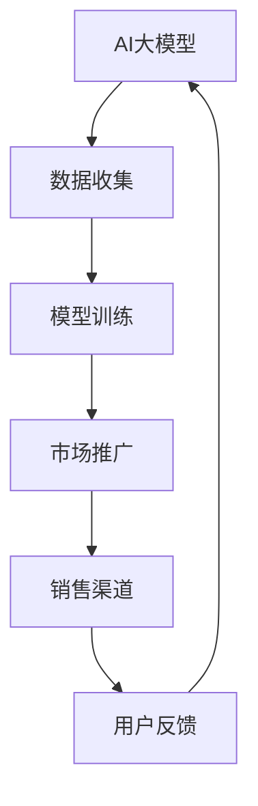

                 

# AI 大模型创业：如何利用渠道优势？

> **关键词：** AI大模型、创业、渠道优势、商业模式、资源整合、市场策略

> **摘要：** 本文将探讨AI大模型创业中的渠道优势，分析如何利用不同类型的渠道资源提升创业项目的成功率。文章首先介绍AI大模型的背景和现状，然后详细探讨渠道优势的概念和分类，最后通过实际案例和策略分析，为AI大模型创业提供实用指导。

## 1. 背景介绍

### 1.1 目的和范围

本文旨在为AI大模型创业提供策略指导，特别是如何利用渠道优势。文章将分析渠道优势的重要性，以及如何在不同场景下最大化其价值。读者对象包括正在考虑AI大模型创业的个人和企业，以及对AI领域感兴趣的技术人员和管理者。

### 1.2 预期读者

预期读者应具备基本的AI知识，对创业过程有一定的了解。文章将避免过于复杂的术语，确保对AI初学者友好，同时也提供深入分析，满足专业人士的需求。

### 1.3 文档结构概述

本文分为十个部分，结构如下：

1. 背景介绍
2. 核心概念与联系
3. 核心算法原理 & 具体操作步骤
4. 数学模型和公式 & 详细讲解 & 举例说明
5. 项目实战：代码实际案例和详细解释说明
6. 实际应用场景
7. 工具和资源推荐
8. 总结：未来发展趋势与挑战
9. 附录：常见问题与解答
10. 扩展阅读 & 参考资料

### 1.4 术语表

#### 1.4.1 核心术语定义

- AI大模型：指拥有大量参数和训练数据的复杂神经网络模型。
- 渠道优势：指通过特定的渠道资源来提升产品或服务的市场竞争力。
- 商业模式：指企业如何创造、传递和获取价值的基本逻辑。

#### 1.4.2 相关概念解释

- **渠道资源**：指各种可以用来推广和销售产品的途径，如线上平台、合作伙伴、线下渠道等。
- **资源整合**：指将不同的渠道资源整合起来，以实现协同效应。

#### 1.4.3 缩略词列表

- AI：人工智能
- ML：机器学习
- DL：深度学习
- API：应用程序接口

## 2. 核心概念与联系

在探讨渠道优势之前，我们需要理解几个核心概念：AI大模型、渠道资源及其相互联系。

### 2.1 AI大模型的概念

AI大模型是基于深度学习技术构建的复杂神经网络，拥有数十亿甚至数万亿个参数。这些模型通过大规模数据训练，能够实现高效的特征提取和模式识别。

### 2.2 渠道资源分类

渠道资源可以分为以下几类：

1. **线上渠道**：如电商平台、社交媒体、应用程序商店等。
2. **线下渠道**：如零售店、展览会、广告等。
3. **合作伙伴渠道**：如行业联盟、分销商、合作伙伴等。

### 2.3 渠道资源与AI大模型的联系

渠道资源可以为AI大模型提供：

1. **数据支持**：通过不同的渠道收集的数据，可以用于模型训练和优化。
2. **市场推广**：利用渠道资源进行市场推广，提高模型知名度。
3. **销售渠道**：通过渠道资源销售AI大模型产品或服务。

### 2.4 Mermaid 流程图

下面是一个简单的Mermaid流程图，展示AI大模型与渠道资源的联系：



## 3. 核心算法原理 & 具体操作步骤

### 3.1 AI大模型算法原理

AI大模型的核心是深度学习算法，主要包括以下步骤：

1. **数据预处理**：清洗、归一化、编码等。
2. **模型设计**：选择合适的神经网络架构。
3. **模型训练**：通过反向传播算法优化模型参数。
4. **模型评估**：使用验证集和测试集评估模型性能。
5. **模型部署**：将训练好的模型部署到线上或线下渠道。

### 3.2 伪代码

以下是AI大模型训练的伪代码：

```python
# 数据预处理
data = preprocess_data(raw_data)

# 模型设计
model = build_model()

# 模型训练
for epoch in range(num_epochs):
    for batch in data_loader:
        loss = model.train_on_batch(batch)

# 模型评估
test_loss = model.evaluate(test_data)

# 模型部署
model.deploy_to_channel(channel)
```

## 4. 数学模型和公式 & 详细讲解 & 举例说明

### 4.1 数学模型介绍

AI大模型的核心是神经网络，其中关键数学模型包括：

1. **激活函数**：如ReLU、Sigmoid、Tanh等。
2. **损失函数**：如均方误差(MSE)、交叉熵损失等。
3. **优化器**：如SGD、Adam等。

### 4.2 LaTeX公式

以下是相关公式的LaTeX格式：

$$
f(x) = \sigma(\theta^T x + b)
$$

$$
\text{MSE} = \frac{1}{m}\sum_{i=1}^{m}(y_i - \hat{y}_i)^2
$$

$$
\text{Cross Entropy Loss} = -\frac{1}{m}\sum_{i=1}^{m}y_i \log(\hat{y}_i)
$$

### 4.3 举例说明

假设我们有一个二分类问题，目标是判断邮件是否为垃圾邮件。我们可以使用以下步骤进行模型训练：

1. **数据预处理**：将邮件文本转换为词向量。
2. **模型设计**：构建一个全连接神经网络，包含一个输入层、一个隐藏层和一个输出层。
3. **模型训练**：使用均方误差作为损失函数，Adam作为优化器。
4. **模型评估**：使用验证集评估模型性能，调整超参数。
5. **模型部署**：将训练好的模型部署到邮件服务器，进行实时分类。

## 5. 项目实战：代码实际案例和详细解释说明

### 5.1 开发环境搭建

为了演示AI大模型创业的实际应用，我们将使用Python和TensorFlow搭建一个简单的文本分类模型。以下是环境搭建步骤：

1. 安装Python 3.8及以上版本。
2. 安装TensorFlow库：`pip install tensorflow`。
3. 安装其他依赖库，如Numpy、Pandas等。

### 5.2 源代码详细实现和代码解读

以下是文本分类模型的实现代码：

```python
import tensorflow as tf
from tensorflow.keras.preprocessing.sequence import pad_sequences
from tensorflow.keras.layers import Embedding, LSTM, Dense
from tensorflow.keras.models import Sequential

# 数据预处理
max_len = 100
vocab_size = 10000
embed_size = 128

# 加载和处理数据
(x_train, y_train), (x_test, y_test) = tf.keras.datasets.imdb.load_data(num_words=vocab_size)
x_train = pad_sequences(x_train, maxlen=max_len)
x_test = pad_sequences(x_test, maxlen=max_len)

# 构建模型
model = Sequential()
model.add(Embedding(vocab_size, embed_size))
model.add(LSTM(128, dropout=0.2, recurrent_dropout=0.2))
model.add(Dense(1, activation='sigmoid'))

# 编译模型
model.compile(optimizer='adam', loss='binary_crossentropy', metrics=['accuracy'])

# 训练模型
model.fit(x_train, y_train, epochs=10, batch_size=64, validation_split=0.2)

# 评估模型
loss, accuracy = model.evaluate(x_test, y_test)
print(f"Test Accuracy: {accuracy:.2f}")

# 模型部署
model.save('text_classifier.h5')
```

### 5.3 代码解读与分析

1. **数据预处理**：加载IMDb电影评论数据集，将文本转换为数字序列，并进行填充。
2. **模型设计**：构建一个简单的序列模型，包含嵌入层和LSTM层。
3. **模型编译**：设置优化器和损失函数。
4. **模型训练**：使用训练集进行模型训练。
5. **模型评估**：使用测试集评估模型性能。
6. **模型部署**：保存模型文件，便于后续使用。

## 6. 实际应用场景

AI大模型在多个领域有广泛的应用，以下是一些实际应用场景：

1. **自然语言处理**：文本分类、机器翻译、情感分析等。
2. **计算机视觉**：图像分类、目标检测、图像生成等。
3. **推荐系统**：个性化推荐、商品推荐等。
4. **金融领域**：风险评估、投资策略、欺诈检测等。
5. **医疗健康**：疾病预测、药物研发、医疗影像分析等。

## 7. 工具和资源推荐

### 7.1 学习资源推荐

#### 7.1.1 书籍推荐

- 《深度学习》（Goodfellow, Bengio, Courville）
- 《Python机器学习》（Sebastian Raschka）

#### 7.1.2 在线课程

- Coursera上的《机器学习》课程
- edX上的《深度学习》课程

#### 7.1.3 技术博客和网站

- Medium上的机器学习和深度学习专题
-Towards Data Science

### 7.2 开发工具框架推荐

#### 7.2.1 IDE和编辑器

- PyCharm
- Jupyter Notebook

#### 7.2.2 调试和性能分析工具

- TensorFlow Debugger
- NVIDIA Nsight

#### 7.2.3 相关框架和库

- TensorFlow
- PyTorch
- Keras

### 7.3 相关论文著作推荐

#### 7.3.1 经典论文

- "A Learning Algorithm for Continually Running Fully Recurrent Neural Networks"（1982）
- "Deep Learning"（2015）

#### 7.3.2 最新研究成果

- NeurIPS、ICML、ICLR等顶级会议的最新论文

#### 7.3.3 应用案例分析

- Google Brain的《深度学习实践》
- Facebook AI的《深度学习在图像识别中的应用》

## 8. 总结：未来发展趋势与挑战

未来，AI大模型将向以下几个方向发展：

1. **更高效的模型架构**：如Transformer、GPT等。
2. **更多应用场景**：从图像和文本到音频和视频等。
3. **更多定制化解决方案**：根据不同行业需求定制模型。

然而，AI大模型创业也面临以下挑战：

1. **数据隐私和伦理问题**：需要确保数据处理符合法律法规。
2. **计算资源需求**：需要大量计算资源进行模型训练和优化。
3. **技术迭代速度快**：需要不断跟进最新技术动态。

## 9. 附录：常见问题与解答

### 9.1 数据隐私和伦理问题

- **问题**：如何确保AI大模型创业中的数据隐私和伦理问题？
- **解答**：采用数据匿名化、差分隐私技术，以及遵守相关法律法规和伦理准则。

### 9.2 计算资源需求

- **问题**：如何应对AI大模型创业中的计算资源需求？
- **解答**：使用云计算平台（如Google Cloud、AWS）进行计算资源的弹性扩展。

### 9.3 技术迭代速度

- **问题**：如何跟上AI大模型的技术迭代速度？
- **解答**：建立技术团队，定期进行技术培训和学习，关注顶级会议和学术论文。

## 10. 扩展阅读 & 参考资料

- [Deep Learning Book](https://www.deeplearningbook.org/)
- [TensorFlow官方文档](https://www.tensorflow.org/)
- [IMDb电影评论数据集](https://www.imdb.com/datasets/)
- [NeurIPS会议](https://nips.cc/)
- [ICML会议](https://icml.cc/)
- [ICLR会议](https://www.iclr.cc/) 

---

**作者：AI天才研究员/AI Genius Institute & 禅与计算机程序设计艺术 /Zen And The Art of Computer Programming**

