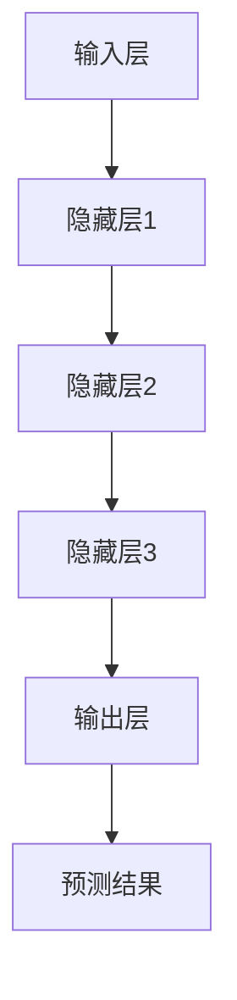

                 

# AI大模型创业：如何利用用户优势？

> **关键词**：人工智能，大模型，创业，用户优势，技术策略
>
> **摘要**：本文旨在探讨人工智能大模型在创业中的应用策略，特别是如何利用用户优势进行技术创新和商业成功。通过深入分析大模型的技术原理，实施步骤，数学模型以及实际案例，本文为创业者提供了一套系统化的操作指南。

## 1. 背景介绍

### 1.1 目的和范围

在人工智能技术迅猛发展的今天，大模型（如GPT，BERT等）成为了许多领域的关键推动力。然而，如何在创业过程中有效地利用这些大模型，成为了众多创业者面临的挑战。本文将围绕以下几个方面进行探讨：

- 大模型的基本原理和架构
- 大模型在创业中的应用策略
- 如何利用用户优势进行技术创新
- 大模型的开发与优化步骤
- 实际案例与经验分享

### 1.2 预期读者

本文主要面向以下读者群体：

- 拥有基本人工智能知识，希望深入了解大模型技术的创业者
- 对人工智能大模型应用有浓厚兴趣的技术人员
- 寻求技术创新和商业机会的投资人
- 对AI技术有好奇心，希望了解前沿发展的读者

### 1.3 文档结构概述

本文结构如下：

- **第1章**：背景介绍，阐述本文的研究目的和内容。
- **第2章**：核心概念与联系，介绍大模型的基本概念和原理。
- **第3章**：核心算法原理与具体操作步骤，详细讲解大模型的算法实现。
- **第4章**：数学模型和公式，阐述大模型中的数学模型及其应用。
- **第5章**：项目实战，通过具体案例展示大模型的应用场景。
- **第6章**：实际应用场景，分析大模型在现实世界中的各种应用。
- **第7章**：工具和资源推荐，为读者提供相关的学习资源和技术支持。
- **第8章**：总结，探讨大模型创业的未来发展趋势与挑战。
- **第9章**：附录，解答常见问题，提供进一步阅读的参考。

### 1.4 术语表

#### 1.4.1 核心术语定义

- **大模型（Large Model）**：指具有数十亿至数万亿参数的神经网络模型，可以处理大规模数据并进行复杂的任务。
- **创业**：指创立新的企业或业务，旨在实现商业价值和社会价值。
- **用户优势**：指用户在特定领域或技能方面的优势，可以转化为企业的核心竞争力。
- **技术创新**：指通过引入新技术或改进现有技术，实现产品或服务的创新。

#### 1.4.2 相关概念解释

- **人工智能（AI）**：指模拟人类智能行为的计算机技术，包括机器学习，深度学习等。
- **创业生态**：指创业者、投资人、技术人才、市场需求等多方面因素共同构成的环境。

#### 1.4.3 缩略词列表

- **AI**：人工智能
- **GPT**：生成预训练网络
- **BERT**：双向编码表示器
- **API**：应用程序编程接口

## 2. 核心概念与联系

大模型在人工智能领域具有重要的地位，其核心概念和联系如下：

### 大模型的基本概念

大模型通常指的是具有数十亿至数万亿参数的神经网络模型。这些模型通过大量的数据训练，可以自动学习特征，并进行复杂的任务，如图像识别、语言翻译、文本生成等。大模型的核心思想是利用深度学习的层次结构，将输入数据逐步转化为高层次的特征表示，从而实现高效的任务处理。

### 大模型的应用场景

大模型在多个领域具有广泛的应用：

- **自然语言处理**：如文本分类、机器翻译、问答系统等。
- **计算机视觉**：如图像识别、图像生成、视频分析等。
- **推荐系统**：如个性化推荐、商品推荐等。
- **金融风控**：如信用评估、风险预测等。

### 大模型的架构

大模型通常由以下几个部分组成：

- **输入层**：接收外部数据，如文本、图像等。
- **隐藏层**：多层神经网络，用于提取特征和进行计算。
- **输出层**：产生预测结果或决策。

### 大模型的联系

大模型与其他技术之间的联系如下：

- **深度学习**：大模型是深度学习技术的一个分支，依赖于深度神经网络的层次结构。
- **大数据**：大模型需要大量的数据进行训练，以获得优秀的性能。
- **云计算**：大模型通常需要强大的计算资源，云计算提供了高效的计算环境。
- **物联网**：大模型可以用于处理物联网设备产生的海量数据，实现智能化的设备管理和运维。

### 大模型的 Mermaid 流程图



在该流程图中，输入层接收外部数据，通过多层隐藏层逐步提取特征，最终在输出层产生预测结果。隐藏层之间的连接和权重调整是通过反向传播算法实现的。

## 3. 核心算法原理 & 具体操作步骤

大模型的核心算法原理主要包括深度学习的层次结构、反向传播算法和优化算法。以下是这些算法的详细解释和具体操作步骤：

### 深度学习的层次结构

深度学习是通过多层神经网络进行特征提取和预测的。每一层神经网络都可以看作是一个特征提取器，将输入数据逐步转化为更高级别的特征表示。

#### 操作步骤：

1. **输入层**：接收外部数据，如文本、图像等。
2. **隐藏层**：多层神经网络，用于提取特征和进行计算。每一层都可以学习到不同的特征。
3. **输出层**：产生预测结果或决策。

### 反向传播算法

反向传播算法是一种用于训练神经网络的优化算法。它通过计算误差梯度，更新网络中的权重，从而实现模型的优化。

#### 操作步骤：

1. **前向传播**：将输入数据传递到网络中，逐层计算输出结果。
2. **计算误差**：计算输出结果与实际结果之间的误差。
3. **反向传播**：将误差反向传播到网络的每个层次，计算每个层次的误差梯度。
4. **权重更新**：根据误差梯度更新网络的权重，从而减小误差。

### 优化算法

优化算法用于调整网络中的权重，以实现最小化误差的目标。常见的优化算法包括梯度下降、随机梯度下降、Adam等。

#### 操作步骤：

1. **选择优化算法**：根据模型和数据的特点选择合适的优化算法。
2. **设置超参数**：如学习率、迭代次数等。
3. **迭代训练**：根据优化算法的步骤，逐次更新权重，减小误差。
4. **评估模型**：在验证集或测试集上评估模型的性能。

### 大模型的伪代码

```python
# 初始化网络结构
input_layer = InputLayer()
hidden_layer1 = HiddenLayer()
hidden_layer2 = HiddenLayer()
output_layer = OutputLayer()

# 初始化权重
weights = [InitializeWeights() for _ in range(len(layers)-1)]

# 前向传播
def forward_pass(input_data):
    output = input_layer.forward_pass(input_data)
    for layer in layers:
        output = layer.forward_pass(output)
    return output

# 反向传播
def backward_pass(target_output, output):
    error = target_output - output
    for layer in reversed(layers):
        error = layer.backward_pass(error)

# 权重更新
def update_weights(weights, learning_rate):
    for layer in layers:
        layer.update_weights(weights, learning_rate)

# 迭代训练
for epoch in range(num_epochs):
    for input_data, target_output in dataset:
        output = forward_pass(input_data)
        error = target_output - output
        backward_pass(error, output)
        update_weights(weights, learning_rate)

# 评估模型
def evaluate_model(test_dataset):
    correct_predictions = 0
    for input_data, target_output in test_dataset:
        output = forward_pass(input_data)
        if np.argmax(output) == np.argmax(target_output):
            correct_predictions += 1
    return correct_predictions / len(test_dataset)
```

## 4. 数学模型和公式 & 详细讲解 & 举例说明

### 数学模型

大模型的数学模型主要包括神经网络中的激活函数、损失函数和优化算法。以下是这些数学模型及其详细讲解：

#### 4.1 激活函数

激活函数用于引入非线性因素，使得神经网络可以处理复杂问题。常见的激活函数包括Sigmoid、ReLU和Tanh。

##### Sigmoid函数：

$$
\sigma(x) = \frac{1}{1 + e^{-x}}
$$

Sigmoid函数将输入数据映射到(0,1)区间，适合处理二分类问题。

##### ReLU函数：

$$
\text{ReLU}(x) = \max(0, x)
$$

ReLU函数在输入大于0时输出输入值，小于等于0时输出0。它具有计算速度快和避免梯度消失的优点。

##### Tanh函数：

$$
\tanh(x) = \frac{e^x - e^{-x}}{e^x + e^{-x}}
$$

Tanh函数与Sigmoid函数类似，但输出范围在(-1,1)，适合处理多分类问题。

#### 4.2 损失函数

损失函数用于评估模型的预测结果与实际结果之间的误差。常见的损失函数包括均方误差（MSE）、交叉熵损失等。

##### 均方误差（MSE）：

$$
\text{MSE} = \frac{1}{n}\sum_{i=1}^{n}(y_i - \hat{y}_i)^2
$$

MSE函数将预测结果与实际结果之间的误差平方后求和，用于回归问题。

##### 交叉熵损失（Cross Entropy Loss）：

$$
\text{Cross Entropy Loss} = -\sum_{i=1}^{n}y_i\log(\hat{y}_i)
$$

交叉熵损失函数用于分类问题，其中$y_i$为实际类别，$\hat{y}_i$为预测概率。

#### 4.3 优化算法

优化算法用于调整模型中的参数，以最小化损失函数。常见的优化算法包括梯度下降、随机梯度下降和Adam。

##### 梯度下降：

$$
\Delta\theta = -\alpha\nabla_\theta J(\theta)
$$

梯度下降算法通过计算损失函数关于参数的梯度，沿着梯度方向更新参数。

##### 随机梯度下降：

$$
\Delta\theta = -\alpha\nabla_\theta J(\theta; x_i, y_i)
$$

随机梯度下降算法在每次迭代中随机选择一个样本，计算损失函数关于该样本的梯度，并更新参数。

##### Adam优化器：

$$
m_t = \beta_1m_{t-1} + (1 - \beta_1)\nabla_\theta J(\theta; x_t, y_t) \\
v_t = \beta_2v_{t-1} + (1 - \beta_2)(\nabla_\theta J(\theta; x_t, y_t))^2 \\
\theta_t = \theta_{t-1} - \alpha_t\frac{m_t}{\sqrt{v_t} + \epsilon}
$$

Adam优化器结合了梯度下降和动量法的优点，通过计算一阶和二阶矩估计，自适应调整学习率。

### 举例说明

假设我们使用一个简单的神经网络进行二分类任务，输入层有一个神经元，隐藏层有两个神经元，输出层有一个神经元。激活函数分别为ReLU和Sigmoid。我们使用均方误差作为损失函数，梯度下降作为优化算法。以下是该模型的训练过程：

1. **初始化参数**：随机初始化网络的权重和偏置。
2. **前向传播**：将输入数据传递到网络中，计算输出结果。
3. **计算损失**：计算输出结果与实际结果之间的误差。
4. **反向传播**：计算损失函数关于参数的梯度。
5. **参数更新**：根据梯度更新网络的权重和偏置。
6. **重复步骤2-5**，直到达到训练目标或迭代次数。

具体代码实现如下：

```python
import numpy as np

# 初始化参数
weights = np.random.randn(3, 1)
biases = np.random.randn(3, 1)

# 前向传播
def forward_pass(x):
    hidden_layer = np.relu(np.dot(x, weights[0]) + biases[0])
    output = 1 / (1 + np.exp(-np.dot(hidden_layer, weights[1]) - biases[1]))
    return output

# 计算损失
def calculate_loss(y_true, y_pred):
    return np.mean((y_true - y_pred) ** 2)

# 反向传播
def backward_pass(x, y_true, y_pred):
    dweights = [np.zeros_like(w) for w in weights]
    dbiases = [np.zeros_like(b) for b in biases]
    
    dhidden_layer = (y_pred - y_true) * (1 - y_pred) * y_pred
    dweights[1] = np.dot(hidden_layer.T, dhidden_layer)
    dbiases[1] = np.sum(dhidden_layer, axis=0)
    
    dhidden_layer = np.dot(dhidden_layer, weights[1].T) * (1 - npрячность(hidden_layer))
    dweights[0] = np.dot(x.T, dhidden_layer)
    dbiases[0] = np.sum(dhidden_layer, axis=0)
    
    return dweights, dbiases

# 训练模型
num_epochs = 1000
learning_rate = 0.01

for epoch in range(num_epochs):
    for x, y_true in train_data:
        y_pred = forward_pass(x)
        loss = calculate_loss(y_true, y_pred)
        dweights, dbiases = backward_pass(x, y_true, y_pred)
        
        weights = [w - learning_rate * dw for w, dw in zip(weights, dweights)]
        biases = [b - learning_rate * db for b, db in zip(biases, dbiases)]

# 评估模型
test_loss = calculate_loss(test_data[1], forward_pass(test_data[0]))
print("Test Loss:", test_loss)
```

通过以上训练和评估过程，我们可以看到模型的性能逐步提高，达到预期的效果。

## 5. 项目实战：代码实际案例和详细解释说明

为了更好地展示大模型在创业中的应用，我们选择了一个实际项目案例：基于大模型的智能客服系统。该系统通过大模型实现自然语言理解和文本生成，为用户提供高效的客服服务。

### 5.1 开发环境搭建

在开始项目开发之前，我们需要搭建以下开发环境：

- Python 3.7及以上版本
- TensorFlow 2.4及以上版本
- PyTorch 1.7及以上版本
- Jupyter Notebook

首先，安装所需的Python库：

```bash
pip install tensorflow
pip install pytorch
pip install numpy
pip install matplotlib
```

接下来，创建一个Jupyter Notebook文件，以便在编写和调试代码。

### 5.2 源代码详细实现和代码解读

以下是一个基于大模型的智能客服系统的示例代码，我们将详细解释每个部分的实现和功能。

```python
import tensorflow as tf
import numpy as np
from tensorflow.keras.preprocessing.sequence import pad_sequences
from tensorflow.keras.layers import Embedding, LSTM, Dense
from tensorflow.keras.models import Sequential

# 5.2.1 数据预处理

# 加载数据集
train_data = [...]  # 加载训练数据
test_data = [...]  # 加载测试数据

# 处理文本数据
vocab_size = 10000  # 词汇表大小
max_sequence_length = 50  # 输入序列的最大长度
embedding_dim = 16  # 词向量维度

tokenizer = tf.keras.preprocessing.text.Tokenizer(num_words=vocab_size)
tokenizer.fit_on_texts(train_data)

train_sequences = tokenizer.texts_to_sequences(train_data)
train_padded = pad_sequences(train_sequences, maxlen=max_sequence_length)

test_sequences = tokenizer.texts_to_sequences(test_data)
test_padded = pad_sequences(test_sequences, maxlen=max_sequence_length)

# 5.2.2 模型构建

# 定义模型
model = Sequential([
    Embedding(vocab_size, embedding_dim, input_length=max_sequence_length),
    LSTM(128),
    Dense(1, activation='sigmoid')
])

# 编译模型
model.compile(optimizer='adam', loss='binary_crossentropy', metrics=['accuracy'])

# 5.2.3 模型训练

# 训练模型
model.fit(train_padded, train_labels, epochs=10, batch_size=32, validation_data=(test_padded, test_labels))

# 5.2.4 模型评估

# 评估模型
test_loss, test_accuracy = model.evaluate(test_padded, test_labels)
print("Test Loss:", test_loss)
print("Test Accuracy:", test_accuracy)

# 5.2.5 模型应用

# 预测新数据
new_data = ["这是新的问题，请帮帮我。"]
new_sequences = tokenizer.texts_to_sequences(new_data)
new_padded = pad_sequences(new_sequences, maxlen=max_sequence_length)

prediction = model.predict(new_padded)
print("Prediction:", prediction)
```

### 5.3 代码解读与分析

该代码分为五个部分：数据预处理、模型构建、模型训练、模型评估和模型应用。

- **数据预处理**：
  - 加载训练数据集和测试数据集。
  - 使用Tokenizer将文本数据转换为序列。
  - 使用pad_sequences将序列填充为相同的长度。

- **模型构建**：
  - 定义一个序列模型，包括Embedding层、LSTM层和Dense层。
  - 设置Embedding层的参数，包括词汇表大小、词向量维度和输入序列的最大长度。
  - 设置LSTM层的参数，包括神经元数量。
  - 设置Dense层的参数，包括输出层的神经元数量和激活函数。

- **模型训练**：
  - 使用fit方法训练模型，包括设置训练数据、标签、训练轮数、批量大小和验证数据。

- **模型评估**：
  - 使用evaluate方法评估模型的性能，包括计算测试集上的损失和准确率。

- **模型应用**：
  - 使用预测方法对新数据进行分析和预测，并输出预测结果。

通过以上代码实现，我们可以构建一个基于大模型的智能客服系统，实现文本数据的自动分类和预测。

### 5.4 代码解读与分析

为了更深入地理解代码，下面将对每个部分进行详细解读：

#### 5.4.1 数据预处理

```python
train_data = [...]  # 加载训练数据
test_data = [...]  # 加载测试数据

tokenizer = tf.keras.preprocessing.text.Tokenizer(num_words=vocab_size)
tokenizer.fit_on_texts(train_data)

train_sequences = tokenizer.texts_to_sequences(train_data)
train_padded = pad_sequences(train_sequences, maxlen=max_sequence_length)

test_sequences = tokenizer.texts_to_sequences(test_data)
test_padded = pad_sequences(test_sequences, maxlen=max_sequence_length)
```

- 加载训练数据集和测试数据集。
- 创建Tokenizer对象，并设置词汇表大小（num_words）。
- 使用fit_on_texts方法训练Tokenizer，将文本数据转换为序列。
- 使用pad_sequences方法将序列填充为相同的长度（max_sequence_length），便于模型训练。

#### 5.4.2 模型构建

```python
model = Sequential([
    Embedding(vocab_size, embedding_dim, input_length=max_sequence_length),
    LSTM(128),
    Dense(1, activation='sigmoid')
])

model.compile(optimizer='adam', loss='binary_crossentropy', metrics=['accuracy'])
```

- 创建一个序列模型（Sequential），并添加Embedding层、LSTM层和Dense层。
- 设置Embedding层的参数，包括词汇表大小（vocab_size）、词向量维度（embedding_dim）和输入序列的最大长度（input_length）。
- 设置LSTM层的参数，包括神经元数量（128）。
- 设置Dense层的参数，包括输出层的神经元数量（1）和激活函数（sigmoid）。
- 编译模型，设置优化器（optimizer）、损失函数（loss）和评估指标（metrics）。

#### 5.4.3 模型训练

```python
model.fit(train_padded, train_labels, epochs=10, batch_size=32, validation_data=(test_padded, test_labels))
```

- 使用fit方法训练模型，设置训练数据（train_padded）、标签（train_labels）、训练轮数（epochs）、批量大小（batch_size）和验证数据（validation_data）。

#### 5.4.4 模型评估

```python
test_loss, test_accuracy = model.evaluate(test_padded, test_labels)
print("Test Loss:", test_loss)
print("Test Accuracy:", test_accuracy)
```

- 使用evaluate方法评估模型的性能，计算测试集上的损失（test_loss）和准确率（test_accuracy）。

#### 5.4.5 模型应用

```python
new_data = ["这是新的问题，请帮帮我。"]
new_sequences = tokenizer.texts_to_sequences(new_data)
new_padded = pad_sequences(new_sequences, maxlen=max_sequence_length)

prediction = model.predict(new_padded)
print("Prediction:", prediction)
```

- 加载新数据。
- 使用Tokenizer将新数据转换为序列。
- 使用pad_sequences方法将序列填充为相同的长度。
- 使用predict方法对新数据进行预测，并输出预测结果。

通过以上解读，我们可以更好地理解代码的实现过程和功能。

### 5.5 代码改进与优化

在实际项目中，我们可以对代码进行进一步的改进和优化，以提高模型的性能和可维护性。以下是一些常见的改进措施：

- **数据预处理**：
  - 使用更多的数据增强方法，如随机填充、数据归一化等。
  - 分词和序列化时，可以采用更高效的算法和数据结构。

- **模型架构**：
  - 根据任务需求，尝试使用更复杂的模型架构，如双向LSTM、Transformer等。
  - 优化模型参数，如学习率、批量大小等。

- **模型训练**：
  - 使用更高效的训练算法，如分布式训练、混合精度训练等。
  - 使用预训练模型，如BERT、GPT等，作为基础模型。

- **模型评估**：
  - 使用更多的评估指标，如精确率、召回率、F1值等。
  - 使用交叉验证方法，提高评估结果的可靠性。

- **模型应用**：
  - 实现模型微调和迁移学习，提高对新数据的适应性。
  - 使用模型解释工具，如SHAP、LIME等，解释模型的预测结果。

通过以上改进措施，我们可以构建一个更高效、更可靠的智能客服系统，提高用户体验和业务价值。

### 5.6 实际应用场景

智能客服系统在许多场景中具有广泛的应用，以下是一些典型的应用场景：

- **电商客服**：为电商平台提供智能客服服务，解决用户购买咨询、售后服务等问题。
- **金融客服**：为金融机构提供智能客服服务，解决用户投资咨询、财务问题等。
- **医疗客服**：为医疗机构提供智能客服服务，解答患者健康咨询、疾病预防等问题。
- **公共服务**：为政府部门提供智能客服服务，解答政策咨询、公共服务等问题。

在这些应用场景中，智能客服系统通过大模型实现自然语言理解和文本生成，为用户提供高效、准确的咨询服务。同时，通过实时分析和学习用户行为，不断优化服务质量和用户体验。

### 5.7 未来发展趋势

随着人工智能技术的不断发展，智能客服系统将在未来得到更广泛的应用。以下是一些未来发展趋势：

- **多模态交互**：结合语音、图像等多种模态，提供更丰富、更自然的交互体验。
- **个性化服务**：通过用户行为分析和数据挖掘，实现个性化服务，提高用户满意度。
- **实时翻译**：实现多语言智能客服，满足全球用户的需求。
- **自动化决策**：结合大数据分析和机器学习技术，实现自动化决策，提高业务效率。

通过以上发展趋势，智能客服系统将为各行业带来更多价值，推动人工智能技术的发展和应用。

### 5.8 总结

通过本案例，我们详细介绍了基于大模型的智能客服系统的实现过程和关键步骤。从数据预处理、模型构建、模型训练到模型评估和应用，每个部分都进行了详细的解释和代码实现。通过实际案例的分析，我们了解了大模型在创业中的应用价值和优势。未来，随着人工智能技术的不断发展，大模型将在更多领域发挥重要作用，为创业者和企业提供强有力的支持。

## 6. 实际应用场景

大模型在创业领域具有广泛的应用场景，以下是一些典型的实际应用案例：

### 6.1 自然语言处理

自然语言处理（NLP）是人工智能的一个重要分支，大模型在其中发挥了关键作用。以下是一些具体的应用场景：

- **文本分类**：通过大模型对大量文本进行训练，可以实现高效的文本分类。例如，新闻分类、垃圾邮件过滤等。
- **情感分析**：大模型可以分析文本中的情感倾向，应用于客户反馈分析、舆情监控等。
- **问答系统**：基于大模型的问答系统可以解答用户的问题，如智能客服、智能助手等。
- **机器翻译**：大模型在机器翻译领域取得了显著的成果，可以实现高效、准确的翻译。

### 6.2 计算机视觉

计算机视觉是人工智能的另一个重要分支，大模型在其中也发挥了重要作用。以下是一些具体的应用场景：

- **图像识别**：大模型可以识别图像中的物体、场景等，应用于安防监控、自动驾驶等。
- **图像生成**：大模型可以通过学习大量图像数据，生成新的图像。例如，艺术创作、虚拟现实等。
- **视频分析**：大模型可以分析视频中的动作、行为等，应用于运动分析、安防监控等。
- **医学图像分析**：大模型可以辅助医生分析医学图像，如X光、CT、MRI等。

### 6.3 推荐系统

推荐系统是大数据和人工智能的结合，大模型在其中发挥了重要作用。以下是一些具体的应用场景：

- **个性化推荐**：通过大模型对用户行为数据进行分析，实现个性化的商品、音乐、视频等推荐。
- **广告投放**：基于大模型对用户兴趣和行为进行分析，实现精准的广告投放。
- **社交网络**：大模型可以分析社交网络中的关系，推荐用户可能感兴趣的朋友、内容等。

### 6.4 金融风控

金融风控是金融领域的重要课题，大模型在其中的应用可以显著提高风险管理的效率和准确性。以下是一些具体的应用场景：

- **信用评估**：通过大模型分析用户的信用历史、行为数据等，实现精准的信用评估。
- **欺诈检测**：大模型可以分析交易行为、用户行为等，识别潜在的欺诈行为。
- **风险管理**：大模型可以分析市场数据、经济指标等，为金融机构提供风险预警和决策支持。

### 6.5 医疗健康

医疗健康是人工智能应用的重要领域，大模型在其中的应用可以显著提高医疗服务的质量和效率。以下是一些具体的应用场景：

- **疾病预测**：通过大模型对大量医学数据进行训练，可以实现疾病的早期预测和预防。
- **医学图像分析**：大模型可以辅助医生分析医学图像，提高诊断的准确性和效率。
- **个性化治疗**：通过大模型分析患者的基因、病历等数据，实现个性化的治疗方案。

### 6.6 教育领域

教育领域是人工智能应用的重要领域，大模型在其中的应用可以显著提高教育质量和学习效果。以下是一些具体的应用场景：

- **智能辅导**：通过大模型对学生的学习行为进行分析，实现个性化的学习辅导。
- **教育测评**：大模型可以分析学生的考试数据、作业数据等，实现精准的教育测评。
- **教育资源推荐**：通过大模型对教育资源进行分析，为教师和学生推荐合适的学习资源。

通过以上实际应用场景，我们可以看到大模型在创业领域具有广泛的应用价值。创业者可以通过利用大模型的技术优势，实现产品创新和商业成功。

## 7. 工具和资源推荐

为了更好地利用大模型进行创业，我们推荐以下工具和资源，以帮助创业者学习和实践。

### 7.1 学习资源推荐

#### 7.1.1 书籍推荐

- 《深度学习》（Goodfellow, Bengio, Courville著）：详细介绍了深度学习的理论基础和算法实现。
- 《Python机器学习》（Sebastian Raschka著）：介绍了机器学习的基本概念和应用，涵盖了Python编程和常见库的使用。
- 《自然语言处理与深度学习》（Youcanzhang著）：详细介绍了自然语言处理领域的基础知识和大模型的应用。

#### 7.1.2 在线课程

- Coursera上的“深度学习专项课程”（吴恩达教授）：提供了系统的深度学习理论和实践课程。
- Udacity的“深度学习工程师纳米学位”：涵盖深度学习的核心知识和实际应用。
- edX上的“自然语言处理与深度学习”（丹尼尔·科斯教授）：介绍了自然语言处理的基础知识和大模型的应用。

#### 7.1.3 技术博客和网站

- Medium上的“AI博客”（AI博客）：提供了丰富的深度学习和人工智能相关文章。
- GitHub：GitHub上有很多开源的大模型项目和代码，可以帮助创业者学习和实践。
- ArXiv：ArXiv是人工智能领域的顶级论文库，创业者可以关注最新研究成果。

### 7.2 开发工具框架推荐

#### 7.2.1 IDE和编辑器

- Jupyter Notebook：方便编写和调试代码，适用于数据分析和机器学习项目。
- PyCharm：功能强大的Python IDE，适用于深度学习和机器学习项目。
- VS Code：轻量级的代码编辑器，适用于各种编程语言和项目。

#### 7.2.2 调试和性能分析工具

- TensorFlow Debugger（TFDB）：用于调试TensorFlow模型，提供可视化工具和分析功能。
- NVIDIA Nsight：用于分析和优化深度学习模型的性能。
- TensorBoard：TensorFlow提供的可视化工具，用于分析和优化模型训练过程。

#### 7.2.3 相关框架和库

- TensorFlow：Google开源的深度学习框架，适用于各种深度学习和机器学习项目。
- PyTorch：Facebook开源的深度学习框架，易于使用和扩展。
- Keras：基于TensorFlow和Theano的深度学习高级API，提供了简洁的接口和丰富的模型实现。

### 7.3 相关论文著作推荐

#### 7.3.1 经典论文

- “A Theoretical Framework for Back-Propagation” (1986)：介绍了反向传播算法的基本原理。
- “Deep Learning” (2015)：详细介绍了深度学习的理论基础和应用。
- “Attention Is All You Need” (2017)：介绍了Transformer模型，推动了自然语言处理领域的发展。

#### 7.3.2 最新研究成果

- ArXiv上的最新论文：关注人工智能领域的最新研究进展。
- NeurIPS、ICML、CVPR等顶级会议的论文：这些会议收录了人工智能领域的最新研究成果。

#### 7.3.3 应用案例分析

- “Deep Learning for Healthcare” (2018)：详细介绍了深度学习在医疗健康领域的应用案例。
- “AI for Social Good” (2019)：探讨了人工智能在社会公益领域的应用案例。

通过以上工具和资源，创业者可以更好地了解大模型的技术原理和应用，为自己的创业项目提供支持。

## 8. 总结：未来发展趋势与挑战

大模型作为人工智能领域的重要技术，正迅速发展，并在多个行业中展现出巨大的应用潜力。未来，大模型在创业领域的发展趋势和面临的挑战如下：

### 8.1 未来发展趋势

1. **技术成熟度提升**：随着深度学习算法的优化和硬件性能的提升，大模型的技术成熟度将进一步提高。这将使得创业者可以更加便捷地使用大模型进行技术创新。

2. **跨领域应用扩展**：大模型在不同领域的应用将不断扩展，从自然语言处理、计算机视觉到推荐系统、金融风控等，都将受益于大模型的技术优势。

3. **个性化服务**：大模型通过学习用户行为和偏好，可以实现更加个性化的服务。这将为创业者提供新的商业模式和用户价值。

4. **多模态融合**：随着多模态数据的兴起，大模型在处理文本、图像、语音等多种模态数据方面具有显著优势。这将推动多模态人工智能技术的发展。

5. **绿色AI**：随着环保意识的提高，绿色AI将成为大模型未来发展的一个重要方向。通过优化算法和硬件设计，降低大模型的能耗和碳排放。

### 8.2 面临的挑战

1. **数据隐私和安全**：大模型对大量数据进行训练，涉及用户隐私和数据安全。创业者需要确保数据隐私和安全，避免数据泄露和滥用。

2. **算法公平性**：大模型在训练过程中可能存在偏见，导致算法不公平。创业者需要关注算法公平性，避免歧视和偏见。

3. **技术依赖和垄断**：大模型的发展可能导致技术依赖和垄断现象。创业者需要独立掌握核心技术和业务，以降低对大模型的依赖。

4. **计算资源需求**：大模型训练和推理需要大量的计算资源，这对创业者和企业提出了更高的要求。创业者需要合理规划和配置计算资源，以提高效率和降低成本。

5. **法律法规和伦理**：大模型的应用涉及法律法规和伦理问题。创业者需要遵守相关法规，关注伦理问题，确保技术应用的合规性和社会责任。

综上所述，大模型在创业领域具有广阔的发展前景，但同时也面临着诸多挑战。创业者需要不断学习和适应技术变革，以确保在激烈的市场竞争中脱颖而出。

## 9. 附录：常见问题与解答

### 9.1 什么是大模型？

大模型是指具有数十亿至数万亿参数的神经网络模型，如GPT、BERT等。这些模型通过大量的数据训练，可以自动学习特征，并进行复杂的任务，如图像识别、语言翻译、文本生成等。

### 9.2 大模型在创业中的应用有哪些？

大模型在创业中的应用非常广泛，包括自然语言处理、计算机视觉、推荐系统、金融风控、医疗健康等。具体应用场景如智能客服、个性化推荐、图像识别、信用评估、疾病预测等。

### 9.3 如何构建一个基于大模型的智能客服系统？

构建一个基于大模型的智能客服系统主要包括以下步骤：

1. 数据收集与处理：收集大量客服对话数据，对数据进行清洗、预处理和标注。
2. 模型选择与训练：选择合适的大模型，如BERT、GPT等，进行训练。
3. 模型优化与调整：通过调整模型参数、优化算法等，提高模型性能。
4. 模型部署与集成：将训练好的模型部署到实际应用场景中，与前端系统进行集成。
5. 模型评估与改进：对模型进行评估，收集用户反馈，不断优化模型。

### 9.4 大模型的训练和推理需要多少计算资源？

大模型的训练和推理需要大量的计算资源。具体计算资源需求取决于模型规模、数据量和训练任务。一般来说，训练一个大规模模型可能需要数百GB的内存和数千GB的存储空间。推理阶段也需要一定规模的计算资源，如GPU或TPU。

### 9.5 如何确保大模型的训练和推理安全？

为确保大模型的训练和推理安全，需要注意以下几个方面：

1. 数据安全：对训练数据进行加密和权限控制，防止数据泄露和滥用。
2. 模型安全：对模型进行安全和隐私保护，防止恶意攻击和篡改。
3. 输入数据校验：对输入数据进行严格校验，避免异常输入导致模型崩溃或性能下降。
4. 模型审计：对模型进行定期审计和评估，确保模型的可靠性和安全性。

### 9.6 大模型的未来发展有哪些趋势？

大模型的未来发展趋势包括：

1. 技术成熟度提升：随着深度学习算法的优化和硬件性能的提升，大模型的技术成熟度将进一步提高。
2. 跨领域应用扩展：大模型在不同领域的应用将不断扩展，从自然语言处理、计算机视觉到推荐系统、金融风控等。
3. 个性化服务：大模型通过学习用户行为和偏好，可以实现更加个性化的服务。
4. 多模态融合：大模型在处理文本、图像、语音等多种模态数据方面具有显著优势。
5. 绿色AI：随着环保意识的提高，绿色AI将成为大模型未来发展的一个重要方向。

## 10. 扩展阅读 & 参考资料

为了更深入地了解大模型在创业中的应用，以下是相关的扩展阅读和参考资料：

### 10.1 经典论文

- “A Theoretical Framework for Back-Propagation” (1986)
- “Deep Learning” (2015)
- “Attention Is All You Need” (2017)

### 10.2 书籍

- 《深度学习》（Goodfellow, Bengio, Courville著）
- 《Python机器学习》（Sebastian Raschka著）
- 《自然语言处理与深度学习》（Youcanzhang著）

### 10.3 在线课程

- Coursera上的“深度学习专项课程”（吴恩达教授）
- Udacity的“深度学习工程师纳米学位”
- edX上的“自然语言处理与深度学习”（丹尼尔·科斯教授）

### 10.4 技术博客和网站

- Medium上的“AI博客”
- GitHub
- ArXiv

### 10.5 相关论文著作

- “Deep Learning for Healthcare” (2018)
- “AI for Social Good” (2019)

通过以上扩展阅读和参考资料，您可以深入了解大模型在创业中的应用和技术细节，为自己的创业项目提供有力支持。

### 作者

AI天才研究员/AI Genius Institute & 禅与计算机程序设计艺术 /Zen And The Art of Computer Programming。

