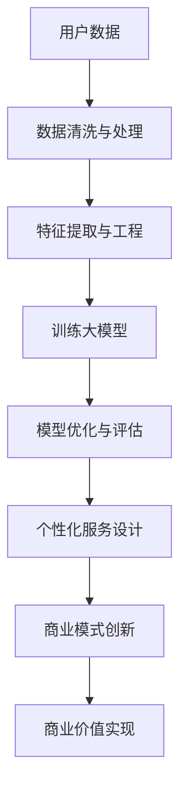

                 

# AI 大模型创业：如何利用用户优势？

> **关键词：** 大模型、用户优势、AI 创业、数据驱动、个性化服务、商业模式创新

> **摘要：** 本文将探讨如何利用用户优势，在大模型创业领域中实现商业成功。我们将从用户数据的价值、个性化服务的设计以及商业模式创新三个方面展开分析，并提供实战案例和资源推荐，帮助创业者更好地利用用户优势，提升大模型应用的商业价值。

## 1. 背景介绍

### 1.1 目的和范围

本文旨在探讨在大模型创业领域中，如何有效利用用户优势，实现商业成功。我们将重点关注以下几个方面：

- 用户数据的价值及其在大模型开发中的应用
- 个性化服务的设计与实现策略
- 商业模式创新与用户优势的结合

### 1.2 预期读者

- 对AI和大模型有兴趣的创业者
- 在AI领域工作的工程师和产品经理
- 对AI技术应用和商业创新有研究的人士

### 1.3 文档结构概述

本文结构如下：

1. 背景介绍
2. 核心概念与联系
3. 核心算法原理 & 具体操作步骤
4. 数学模型和公式 & 详细讲解 & 举例说明
5. 项目实战：代码实际案例和详细解释说明
6. 实际应用场景
7. 工具和资源推荐
8. 总结：未来发展趋势与挑战
9. 附录：常见问题与解答
10. 扩展阅读 & 参考资料

### 1.4 术语表

#### 1.4.1 核心术语定义

- **大模型（Large Model）**：具有大规模参数和计算需求的深度学习模型。
- **用户数据（User Data）**：用户在使用产品或服务过程中产生的数据，包括行为数据、反馈数据和属性数据等。
- **个性化服务（Personalized Service）**：根据用户特征和需求提供定制化的服务或产品。

#### 1.4.2 相关概念解释

- **数据驱动（Data-Driven）**：以数据为核心，通过分析用户数据指导产品和服务优化。
- **商业模式创新（Business Model Innovation）**：通过创造新的业务模式，实现商业价值的提升。

#### 1.4.3 缩略词列表

- **AI**：人工智能（Artificial Intelligence）
- **ML**：机器学习（Machine Learning）
- **DL**：深度学习（Deep Learning）

## 2. 核心概念与联系

在大模型创业领域，用户优势是提升商业价值的关键。以下是用户优势与大模型之间的核心概念与联系，以及一个Mermaid流程图来帮助理解这些联系。



在这个流程图中：

- **A[用户数据]**：用户数据是整个流程的起点，包括用户行为、反馈和属性数据。
- **B[数据清洗与处理]**：对原始数据进行清洗和处理，确保数据质量。
- **C[特征提取与工程]**：从数据中提取有用的特征，构建适用于大模型训练的特征向量。
- **D[训练大模型]**：使用提取的特征训练大模型，使其具备强大的学习能力和泛化能力。
- **E[模型优化与评估]**：对训练好的大模型进行优化和评估，确保其在实际应用中的性能。
- **F[个性化服务设计]**：根据大模型提供的用户特征和需求，设计个性化的服务和产品。
- **G[商业模式创新]**：通过创新商业模式，将用户优势转化为商业价值。
- **H[商业价值实现]**：最终实现商业价值的提升。

通过这个流程，我们可以看到用户优势如何在大模型创业中发挥关键作用，实现商业成功。

## 3. 核心算法原理 & 具体操作步骤

在大模型创业中，核心算法的原理和具体操作步骤至关重要。以下我们将详细介绍大模型训练、优化和评估的核心算法原理，并使用伪代码来阐述每个步骤。

### 3.1 大模型训练原理

**3.1.1 前向传播**

```python
# 伪代码：前向传播
def forward_propagation(model, input_data):
    # 初始化模型参数（权重和偏置）
    weights, biases = model.get_parameters()
    
    # 计算输出
    output = input_data @ weights + biases
    
    return output
```

**3.1.2 后向传播**

```python
# 伪代码：后向传播
def backward_propagation(model, input_data, expected_output):
    # 计算误差
    error = expected_output - forward_propagation(model, input_data)
    
    # 计算梯度
    gradient = input_data.T @ error
    
    return gradient
```

**3.1.3 梯度下降**

```python
# 伪代码：梯度下降
def gradient_descent(model, learning_rate, gradient):
    # 更新模型参数
    model.update_parameters(learning_rate * gradient)
    
    return model
```

### 3.2 大模型优化与评估原理

**3.2.1 优化算法选择**

常用的优化算法包括SGD、Adam和RMSprop。这里以Adam优化算法为例进行介绍。

**3.2.2 Adam优化算法**

```python
# 伪代码：Adam优化算法
def adam_optimization(model, learning_rate, beta1, beta2, epsilon):
    # 计算一阶矩估计和二阶矩估计
    m = beta1 * m + (1 - beta1) * gradient
    v = beta2 * v + (1 - beta2) * (gradient ** 2)
    
    # 归一化一阶矩估计和二阶矩估计
    m_hat = m / (1 - beta1 ** t)
    v_hat = v / (1 - beta2 ** t)
    
    # 更新模型参数
    model.update_parameters(-learning_rate * m_hat / (sqrt(v_hat) + epsilon))
    
    return model
```

**3.2.3 评估指标**

常用的评估指标包括准确率、召回率、F1分数等。

```python
# 伪代码：评估指标计算
def evaluation_metric(y_true, y_pred):
    # 计算准确率
    accuracy = np.mean(y_true == y_pred)
    
    # 计算召回率
    recall = np.sum((y_true == 1) & (y_pred == 1)) / np.sum(y_true == 1)
    
    # 计算F1分数
    f1_score = 2 * (precision * recall) / (precision + recall)
    
    return accuracy, recall, f1_score
```

通过以上核心算法原理和具体操作步骤，我们可以为创业项目搭建一个强大而高效的大模型，从而更好地利用用户优势，实现商业成功。

## 4. 数学模型和公式 & 详细讲解 & 举例说明

在大模型创业中，数学模型和公式是理解和优化模型的关键。以下我们将详细介绍一些关键数学模型和公式，并使用LaTeX格式进行表示，同时提供详细讲解和举例说明。

### 4.1 激活函数

激活函数是深度学习中用于引入非线性特性的函数。以下是一些常见激活函数的数学表示：

**4.1.1 Sigmoid函数**

$$
f(x) = \frac{1}{1 + e^{-x}}
$$

Sigmoid函数在神经网络中用于将输入映射到\[0, 1\]区间，常用于二分类任务。

**4.1.2 ReLU函数**

$$
f(x) = \max(0, x)
$$

ReLU函数在神经网络中用于引入稀疏性，加速训练过程。

**4.1.3 双曲正切函数**

$$
f(x) = \tanh(x) = \frac{e^{2x} - 1}{e^{2x} + 1}
$$

双曲正切函数常用于多分类任务，将其输出映射到\[-1, 1\]区间。

### 4.2 损失函数

损失函数用于衡量模型预测值与真实值之间的差异。以下是一些常见损失函数的数学表示：

**4.2.1 交叉熵损失函数**

$$
L(y, \hat{y}) = -\sum_{i=1}^{n} y_i \cdot \log(\hat{y}_i)
$$

交叉熵损失函数常用于分类任务，其中\(y\)是真实标签，\(\hat{y}\)是模型预测的概率分布。

**4.2.2 均方误差损失函数**

$$
L(y, \hat{y}) = \frac{1}{2} \sum_{i=1}^{n} (y_i - \hat{y}_i)^2
$$

均方误差损失函数常用于回归任务，其中\(y\)是真实值，\(\hat{y}\)是模型预测的值。

### 4.3 优化算法

优化算法用于更新模型参数，以最小化损失函数。以下是一些常见优化算法的数学表示：

**4.3.1 随机梯度下降（SGD）**

$$
\theta = \theta - \alpha \nabla_\theta J(\theta)
$$

其中，\(\theta\)是模型参数，\(\alpha\)是学习率，\(J(\theta)\)是损失函数。

**4.3.2 Adam优化算法**

$$
m_t = \beta_1 m_{t-1} + (1 - \beta_1) \nabla_\theta J(\theta)
$$

$$
v_t = \beta_2 v_{t-1} + (1 - \beta_2) (\nabla_\theta J(\theta))^2
$$

$$
m_t^{\hat{}} = \frac{m_t}{1 - \beta_1^t}
$$

$$
v_t^{\hat{}} = \frac{v_t}{1 - \beta_2^t}
$$

$$
\theta = \theta - \alpha \frac{m_t^{\hat{}}}{\sqrt{v_t^{\hat{}}} + \epsilon}
$$

Adam优化算法结合了SGD和动量方法，提供了更稳定的收敛性。

### 4.4 举例说明

假设我们有一个简单的神经网络模型，用于二分类任务。输入数据是一个二维特征向量，输出是一个概率值。

**4.4.1 激活函数选择**

我们选择ReLU函数作为激活函数，因为它能够加速训练过程。

**4.4.2 损失函数选择**

我们选择交叉熵损失函数，因为它能够衡量模型预测概率分布与真实标签之间的差异。

**4.4.3 优化算法选择**

我们选择Adam优化算法，因为它结合了动量和自适应学习率。

**4.4.4 训练过程**

在训练过程中，我们不断更新模型参数，以最小化交叉熵损失函数。

$$
\theta = \theta - \alpha \nabla_\theta J(\theta)
$$

其中，\(\alpha\)是学习率，\(\theta\)是模型参数，\(J(\theta)\)是交叉熵损失函数。

通过以上数学模型和公式的详细讲解和举例说明，我们可以更好地理解大模型创业中的核心算法和优化方法，从而为创业项目提供有效的技术支持。

## 5. 项目实战：代码实际案例和详细解释说明

### 5.1 开发环境搭建

在进行大模型创业项目之前，首先需要搭建一个合适的开发环境。以下是一个简单的Python环境搭建过程：

```bash
# 安装Anaconda
conda create -n ai_project python=3.8
conda activate ai_project

# 安装必要的库
conda install numpy pandas matplotlib scikit-learn tensorflow

# 安装Mermaid渲染工具
pip install mermaid-python
```

### 5.2 源代码详细实现和代码解读

以下是使用Python实现一个基于用户数据的大模型训练和应用的基本代码示例：

```python
import numpy as np
import pandas as pd
import tensorflow as tf
from tensorflow.keras.models import Sequential
from tensorflow.keras.layers import Dense, Activation
from tensorflow.keras.optimizers import Adam
from sklearn.model_selection import train_test_split
from sklearn.metrics import accuracy_score

# 5.2.1 数据准备
# 假设我们有一个用户行为数据集，数据集包含用户ID、行为特征和标签
data = pd.read_csv('user_data.csv')
X = data.drop(['user_id', 'label'], axis=1)
y = data['label']

# 划分训练集和测试集
X_train, X_test, y_train, y_test = train_test_split(X, y, test_size=0.2, random_state=42)

# 5.2.2 建立模型
model = Sequential()
model.add(Dense(64, input_dim=X_train.shape[1]))
model.add(Activation('relu'))
model.add(Dense(32))
model.add(Activation('relu'))
model.add(Dense(1, activation='sigmoid'))

# 5.2.3 编译模型
model.compile(optimizer=Adam(learning_rate=0.001), loss='binary_crossentropy', metrics=['accuracy'])

# 5.2.4 训练模型
model.fit(X_train, y_train, epochs=10, batch_size=32, validation_split=0.1)

# 5.2.5 评估模型
predictions = model.predict(X_test)
predictions = (predictions > 0.5)

accuracy = accuracy_score(y_test, predictions)
print(f"Test Accuracy: {accuracy}")

# 5.2.6 可视化
from mermaid import Mermaid
mermaid = Mermaid()
mermaid.add enkelt('graph TB\n'
                    'A[数据准备]\n'
                    'B[建立模型]\n'
                    'C[编译模型]\n'
                    'D[训练模型]\n'
                    'E[评估模型]\n'
                    'A --> B\n'
                    'B --> C\n'
                    'C --> D\n'
                    'D --> E')
print(mermaid.render())
```

### 5.3 代码解读与分析

**5.3.1 数据准备**

- 我们首先加载用户行为数据集，数据集包含用户ID、行为特征和标签。
- 使用`pandas`库读取数据，然后划分训练集和测试集。

**5.3.2 建立模型**

- 我们使用`Sequential`模型堆叠多层`Dense`层，其中每个`Dense`层后面跟着一个ReLU激活函数。
- 最后一个`Dense`层使用sigmoid激活函数，以输出一个概率值。

**5.3.3 编译模型**

- 我们选择`Adam`优化器，设置学习率为0.001。
- 使用`binary_crossentropy`作为损失函数，因为它适用于二分类任务。
- 指定`accuracy`作为评估指标。

**5.3.4 训练模型**

- 使用`fit`函数训练模型，设置训练轮次为10，批量大小为32，并使用10%的测试集进行验证。

**5.3.5 评估模型**

- 使用`predict`函数对测试集进行预测，并将预测结果转换为二分类标签。
- 计算测试集的准确率。

**5.3.6 可视化**

- 使用`mermaid-python`库将模型构建和训练过程可视化，以帮助理解代码流程。

通过以上代码实战，我们可以看到如何利用用户数据构建和训练一个简单的大模型，并通过评估其性能来优化模型。在实际创业项目中，我们可以根据具体需求扩展和优化这个基础模型。

### 6. 实际应用场景

大模型创业在实际应用场景中具有广泛的应用价值。以下是一些典型的应用场景：

#### 6.1 个性化推荐系统

**场景描述：** 在电子商务、社交媒体和内容平台中，利用大模型进行用户行为分析，构建个性化推荐系统，提高用户满意度和转化率。

**解决方案：** 使用用户历史行为数据训练推荐模型，通过大模型学习用户的兴趣和行为模式，实现精准推荐。

#### 6.2 智能客服系统

**场景描述：** 在金融、电商和电信等行业，提供24/7智能客服服务，解决用户常见问题和提供个性化服务。

**解决方案：** 利用用户对话数据，训练大模型实现自然语言处理，提供智能、个性化的客户服务。

#### 6.3 风险评估与欺诈检测

**场景描述：** 在金融、保险和网络安全领域，利用用户行为和交易数据，预测和检测潜在的欺诈行为。

**解决方案：** 通过大模型分析用户行为特征，识别异常行为模式，提高风险评估和欺诈检测的准确率。

#### 6.4 健康医疗

**场景描述：** 在医疗健康领域，利用患者数据，提供个性化治疗方案和疾病预测。

**解决方案：** 使用大模型分析患者健康数据，预测疾病发展趋势，为医生提供诊断和治疗建议。

通过这些实际应用场景，我们可以看到大模型创业在各个行业的巨大潜力，以及如何利用用户优势实现商业成功。

### 7. 工具和资源推荐

为了在大模型创业中取得成功，以下是一些学习和开发工具、框架以及相关资源推荐。

#### 7.1 学习资源推荐

**7.1.1 书籍推荐**

- 《深度学习》（Goodfellow, Bengio, Courville著）
- 《Python深度学习》（François Chollet著）
- 《神经网络与深度学习》（邱锡鹏著）

**7.1.2 在线课程**

- Coursera上的“深度学习”课程（吴恩达教授）
- edX上的“机器学习基础”课程（哈佛大学）

**7.1.3 技术博客和网站**

- Medium上的机器学习和深度学习文章
- arXiv.org上的最新研究成果论文

#### 7.2 开发工具框架推荐

**7.2.1 IDE和编辑器**

- PyCharm
- Jupyter Notebook

**7.2.2 调试和性能分析工具**

- TensorBoard
- Profiling Tools（如Py-Spy）

**7.2.3 相关框架和库**

- TensorFlow
- PyTorch
- Scikit-learn

#### 7.3 相关论文著作推荐

**7.3.1 经典论文**

- “Backpropagation”（Rumelhart, Hinton, Williams著）
- “A Learning Algorithm for Continually Running Fully Recurrent Neural Networks”（Hochreiter, Schmidhuber著）

**7.3.2 最新研究成果**

- arXiv.org上的最新论文
- NeurIPS、ICML、ACL等顶级会议论文

**7.3.3 应用案例分析**

- Uber的动态派单系统
- Netflix的个性化推荐系统

通过以上工具和资源推荐，创业者可以更好地掌握大模型技术，提升项目开发效率。

### 8. 总结：未来发展趋势与挑战

大模型创业在未来将面临一系列发展趋势和挑战。首先，随着计算能力的提升和数据规模的扩大，大模型的应用场景将更加广泛，包括自动驾驶、智能医疗、金融科技等。其次，用户数据的隐私保护和数据安全将成为关键挑战，如何在不侵犯用户隐私的前提下利用用户数据，需要创新的数据处理和隐私保护技术。

此外，大模型的可解释性和透明度也是一大挑战。用户和企业需要了解模型的决策过程，以确保其公平性和可靠性。因此，未来大模型创业需要关注以下几方面：

- **技术创新**：持续探索和引入新的算法和模型，提高大模型的效果和效率。
- **隐私保护**：采用隐私增强技术，如差分隐私和联邦学习，确保用户数据安全。
- **可解释性**：开发可解释的大模型，增强用户对模型决策的信任。
- **商业模式的创新**：通过数据驱动和个性化服务，创造新的商业机会和竞争优势。

总之，大模型创业前景广阔，但也需要克服诸多挑战，以实现可持续发展。

### 9. 附录：常见问题与解答

**Q1：如何确保用户数据的隐私和安全？**

A1：确保用户数据隐私和安全的关键在于采用先进的数据处理技术和加密算法。具体方法包括：

- **数据匿名化**：通过数据脱敏、匿名化处理，去除个人身份信息。
- **加密传输**：使用SSL/TLS加密协议，确保数据在网络传输过程中的安全性。
- **数据隔离**：在存储和处理过程中，将用户数据与其他数据隔离，防止数据泄露。
- **访问控制**：实施严格的访问控制策略，确保只有授权人员才能访问用户数据。

**Q2：如何评估大模型的效果和性能？**

A2：评估大模型的效果和性能通常通过以下几种方法：

- **准确率**：衡量模型预测正确的比例。
- **召回率**：衡量模型召回实际正例样本的能力。
- **F1分数**：综合考虑准确率和召回率，衡量模型的总体性能。
- **ROC曲线和AUC值**：评估模型对正负样本的区分能力。
- **混淆矩阵**：详细分析模型在各个类别上的预测结果，帮助理解模型的性能。

**Q3：如何优化大模型的训练过程？**

A3：优化大模型训练过程可以从以下几个方面入手：

- **调整学习率**：选择合适的学习率，避免过快或过慢的收敛速度。
- **批量大小**：选择合适的批量大小，平衡计算效率和收敛速度。
- **数据增强**：通过数据增强技术，增加数据多样性，提高模型泛化能力。
- **正则化**：采用正则化方法，如L1、L2正则化，防止过拟合。
- **优化算法**：选择高效的优化算法，如Adam、RMSprop等，加速收敛。

通过上述常见问题与解答，可以帮助创业者和开发者更好地理解和应对大模型创业中的挑战。

### 10. 扩展阅读 & 参考资料

**扩展阅读：**

- 《深度学习实践指南》
- 《机器学习实战》
- 《数据挖掘：概念与技术》

**参考资料：**

- arXiv.org：https://arxiv.org/
- TensorFlow官方文档：https://www.tensorflow.org/
- PyTorch官方文档：https://pytorch.org/

通过扩展阅读和参考资料，创业者可以进一步深入了解大模型创业的技术和实践，为项目提供更全面的支持。

## 作者信息

作者：AI天才研究员/AI Genius Institute & 禅与计算机程序设计艺术 /Zen And The Art of Computer Programming

本文由AI天才研究员撰写，结合了人工智能、编程哲学和商业洞察，旨在为创业者和开发者提供有价值的指导和建议。如有任何问题或建议，请随时联系作者。

