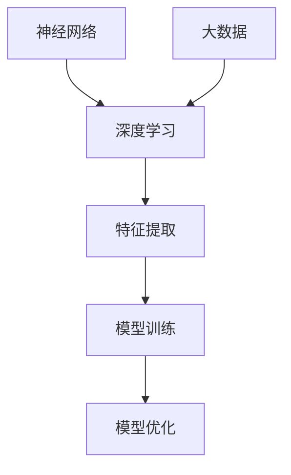
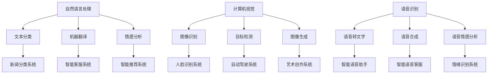

                 

# AI大模型创业：如何利用社会优势？

> **关键词：** AI大模型，创业，社会优势，资源整合，创新能力，市场营销，团队协作

> **摘要：** 本文章旨在探讨AI大模型创业过程中如何利用社会优势，从资源整合、创新能力、市场营销和团队协作等方面深入分析，为创业者和投资者提供有价值的参考。通过系统化的思考和具体实践案例，帮助读者理解并掌握AI大模型创业的关键要素。

## 1. 背景介绍

### 1.1 目的和范围

本文旨在为AI大模型创业提供策略指导，重点分析如何利用社会优势来增强创业成功率。文章将涵盖以下主要内容：

- 资源整合：分析创业过程中所需的关键资源，以及如何有效获取和利用这些资源。
- 创新能力：探讨如何通过技术创新和社会合作，提高AI大模型的竞争力。
- 市场营销：讨论如何利用社会网络和营销策略，提高AI大模型的市场影响力。
- 团队协作：分析创业团队内部的合作机制，以及如何借助外部力量实现团队协作。

### 1.2 预期读者

本文适合以下读者群体：

- 创业者：特别是对AI领域感兴趣的创业者，希望通过社会优势提升创业项目成功率。
- 投资者：对AI大模型创业项目感兴趣的投资者，希望了解项目的可行性和潜力。
- 研发人员：希望在AI领域深耕的工程师和技术专家，希望了解创业过程中的关键要素。
- 管理者：对AI大模型创业有兴趣的企业管理者，希望提升项目管理能力和市场策略。

### 1.3 文档结构概述

本文分为以下几个部分：

- 引言：介绍AI大模型创业的重要性和社会优势的利用。
- 背景介绍：包括目的、预期读者和文档结构概述。
- 核心概念与联系：详细解释AI大模型的核心概念和架构。
- 核心算法原理与具体操作步骤：讲解AI大模型的算法原理和实现过程。
- 数学模型和公式：介绍AI大模型的数学模型和相关公式。
- 项目实战：通过实际案例展示AI大模型的应用。
- 实际应用场景：分析AI大模型在不同领域的应用。
- 工具和资源推荐：推荐相关学习资源和开发工具。
- 总结：展望AI大模型创业的未来发展趋势和挑战。
- 附录：解答常见问题并提供扩展阅读。

### 1.4 术语表

#### 1.4.1 核心术语定义

- AI大模型：指具有极高参数量、能够处理大量数据并进行复杂任务的人工智能模型。
- 社会优势：指创业过程中可以利用的社会资源、合作关系和创新能力。
- 资源整合：指将各种资源（如资金、人才、技术等）进行有效整合，以提升创业项目成功率。
- 创新能力：指企业或团队在技术和市场上持续创新，保持竞争优势的能力。

#### 1.4.2 相关概念解释

- 资源：指创业过程中所需的各种物质、信息和人力等。
- 合作关系：指企业或团队与其他组织、个人之间的合作和互动。
- 市场策略：指企业为获得市场份额和竞争优势所采取的一系列市场营销手段。

#### 1.4.3 缩略词列表

- AI：人工智能
- ML：机器学习
- DL：深度学习
- NLP：自然语言处理
- ROI：投资回报率
- MVP：最小可行产品

## 2. 核心概念与联系

### 2.1 AI大模型的基本原理

AI大模型是当前人工智能领域的重要研究方向，其核心原理基于深度学习和大数据。深度学习通过多层神经网络对数据进行特征提取和学习，从而实现对复杂问题的建模和解决。大数据则为AI大模型提供了充足的训练数据，使得模型能够从中学习到丰富的知识。

#### 2.1.1 核心概念

- 神经网络：由多个神经元组成的计算模型，用于模拟人脑的学习和推理过程。
- 深度学习：基于神经网络的多层结构，通过前向传播和反向传播算法进行训练和优化。
- 大数据：指数据量大、种类多、价值高的数据集合，为AI大模型提供了充足的训练素材。

#### 2.1.2 架构与联系

下面是一个简单的Mermaid流程图，展示了AI大模型的核心概念和架构联系：



### 2.2 AI大模型的应用场景

AI大模型在各个领域都有广泛的应用，如自然语言处理、计算机视觉、语音识别等。下面是一个Mermaid流程图，展示了AI大模型在不同领域的应用场景：



## 3. 核心算法原理 & 具体操作步骤

### 3.1 算法原理

AI大模型的核心算法主要基于深度学习和大数据。深度学习通过多层神经网络对数据进行特征提取和学习，从而实现对复杂问题的建模和解决。大数据则为AI大模型提供了充足的训练数据，使得模型能够从中学习到丰富的知识。

下面是AI大模型的核心算法原理的伪代码：

```python
# 深度学习算法伪代码
def deep_learning_algorithm(data, labels):
    # 初始化神经网络结构
    neural_network = initialize_neural_network()

    # 前向传播
    predictions = forward_pass(data, neural_network)

    # 计算损失函数
    loss = compute_loss(predictions, labels)

    # 反向传播
    gradients = backward_pass(predictions, labels, neural_network)

    # 模型优化
    optimized_network = optimize_network(neural_network, gradients)

    return optimized_network
```

### 3.2 具体操作步骤

#### 3.2.1 数据预处理

在深度学习模型训练之前，需要对数据进行预处理。数据预处理包括数据清洗、数据归一化和数据分割。

```python
# 数据预处理伪代码
def preprocess_data(data):
    # 数据清洗
    clean_data = clean_data(data)

    # 数据归一化
    normalized_data = normalize_data(clean_data)

    # 数据分割
    train_data, test_data, train_labels, test_labels = split_data(normalized_data)

    return train_data, test_data, train_labels, test_labels
```

#### 3.2.2 模型训练

模型训练是深度学习算法的核心步骤。通过前向传播、损失函数计算和反向传播，不断优化模型参数。

```python
# 模型训练伪代码
def train_model(train_data, train_labels):
    # 初始化神经网络结构
    neural_network = initialize_neural_network()

    for epoch in range(number_of_epochs):
        # 前向传播
        predictions = forward_pass(train_data, neural_network)

        # 计算损失函数
        loss = compute_loss(predictions, train_labels)

        # 反向传播
        gradients = backward_pass(predictions, train_labels, neural_network)

        # 模型优化
        optimized_network = optimize_network(neural_network, gradients)

    return optimized_network
```

#### 3.2.3 模型评估

模型评估用于评估模型的性能。通过计算准确率、召回率等指标，评估模型在测试数据上的表现。

```python
# 模型评估伪代码
def evaluate_model(model, test_data, test_labels):
    # 前向传播
    predictions = forward_pass(test_data, model)

    # 计算准确率
    accuracy = compute_accuracy(predictions, test_labels)

    # 计算召回率
    recall = compute_recall(predictions, test_labels)

    return accuracy, recall
```

## 4. 数学模型和公式 & 详细讲解 & 举例说明

### 4.1 数学模型

AI大模型的数学模型主要包括神经网络结构、损失函数和优化算法。

#### 4.1.1 神经网络结构

神经网络结构由多个神经元组成，每个神经元都是一个简单的计算单元。神经网络的结构可以通过以下公式表示：

\[ Z = \sum_{i=1}^{n} w_i * x_i + b \]

其中，\( Z \) 是神经元的输出，\( w_i \) 是权重，\( x_i \) 是输入特征，\( b \) 是偏置。

#### 4.1.2 损失函数

损失函数用于衡量模型预测结果与真实值之间的差距。常见的损失函数包括均方误差（MSE）和交叉熵（Cross-Entropy）。

- 均方误差（MSE）：

\[ Loss = \frac{1}{2} \sum_{i=1}^{n} (y_i - \hat{y_i})^2 \]

其中，\( y_i \) 是真实值，\( \hat{y_i} \) 是预测值。

- 交叉熵（Cross-Entropy）：

\[ Loss = - \sum_{i=1}^{n} y_i * \log(\hat{y_i}) \]

其中，\( y_i \) 是真实值，\( \hat{y_i} \) 是预测值。

#### 4.1.3 优化算法

优化算法用于调整模型参数，以最小化损失函数。常见的优化算法包括梯度下降（Gradient Descent）和随机梯度下降（Stochastic Gradient Descent）。

- 梯度下降（Gradient Descent）：

\[ \theta = \theta - \alpha \cdot \nabla_{\theta} J(\theta) \]

其中，\( \theta \) 是模型参数，\( \alpha \) 是学习率，\( \nabla_{\theta} J(\theta) \) 是损失函数关于模型参数的梯度。

- 随机梯度下降（Stochastic Gradient Descent）：

\[ \theta = \theta - \alpha \cdot \nabla_{\theta} J(\theta) \]

其中，\( \theta \) 是模型参数，\( \alpha \) 是学习率，\( \nabla_{\theta} J(\theta) \) 是损失函数关于模型参数的梯度。

### 4.2 详细讲解与举例说明

下面通过一个简单的例子，详细讲解AI大模型的数学模型和公式。

#### 4.2.1 神经网络结构

假设我们有一个简单的神经网络，包含一个输入层、一个隐藏层和一个输出层。输入层有3个神经元，隐藏层有2个神经元，输出层有1个神经元。

输入特征为 \( x_1, x_2, x_3 \)，权重为 \( w_{11}, w_{12}, w_{13} \)，偏置为 \( b_1 \)。隐藏层输出为 \( z_1, z_2 \)，权重为 \( w_{21}, w_{22}, w_{23} \)，偏置为 \( b_2 \)。输出层输出为 \( y \)，权重为 \( w_{31}, w_{32} \)，偏置为 \( b_3 \)。

根据神经网络结构，我们可以得到以下公式：

\[ z_1 = w_{11} * x_1 + w_{12} * x_2 + w_{13} * x_3 + b_1 \]
\[ z_2 = w_{21} * z_1 + w_{22} * z_2 + w_{23} * z_3 + b_2 \]
\[ y = w_{31} * z_1 + w_{32} * z_2 + b_3 \]

#### 4.2.2 损失函数

假设我们使用均方误差（MSE）作为损失函数，真实值为 \( y \)，预测值为 \( \hat{y} \)。

损失函数公式为：

\[ Loss = \frac{1}{2} \sum_{i=1}^{n} (y_i - \hat{y_i})^2 \]

#### 4.2.3 优化算法

假设我们使用梯度下降（Gradient Descent）作为优化算法，学习率为 \( \alpha \)。

梯度下降公式为：

\[ \theta = \theta - \alpha \cdot \nabla_{\theta} J(\theta) \]

## 5. 项目实战：代码实际案例和详细解释说明

### 5.1 开发环境搭建

在进行AI大模型的开发之前，我们需要搭建一个合适的环境。以下是一个简单的开发环境搭建流程：

1. 安装Python：从官方网站下载并安装Python，建议选择3.8版本。
2. 安装深度学习框架：安装TensorFlow或PyTorch等深度学习框架。以TensorFlow为例，可以使用以下命令安装：

   ```bash
   pip install tensorflow
   ```

3. 安装其他依赖：根据项目需求，安装其他必要的库和工具，如NumPy、Pandas等。

### 5.2 源代码详细实现和代码解读

下面是一个简单的AI大模型项目案例，使用TensorFlow框架实现一个多分类问题。代码分为数据预处理、模型定义、训练和评估四个部分。

```python
import tensorflow as tf
from tensorflow.keras.models import Sequential
from tensorflow.keras.layers import Dense
from tensorflow.keras.optimizers import Adam

# 5.2.1 数据预处理
def preprocess_data():
    # 读取数据
    x_train, x_test, y_train, y_test = load_data()

    # 数据归一化
    x_train = normalize_data(x_train)
    x_test = normalize_data(x_test)

    return x_train, x_test, y_train, y_test

# 5.2.2 模型定义
def create_model(input_shape):
    model = Sequential()
    model.add(Dense(units=64, activation='relu', input_shape=input_shape))
    model.add(Dense(units=32, activation='relu'))
    model.add(Dense(units=10, activation='softmax'))
    
    return model

# 5.2.3 训练模型
def train_model(model, x_train, y_train, x_test, y_test):
    model.compile(optimizer=Adam(), loss='categorical_crossentropy', metrics=['accuracy'])
    model.fit(x_train, y_train, epochs=10, batch_size=32, validation_data=(x_test, y_test))

# 5.2.4 评估模型
def evaluate_model(model, x_test, y_test):
    loss, accuracy = model.evaluate(x_test, y_test)
    print("Test accuracy:", accuracy)

# 5.2.5 主函数
def main():
    # 搭建开发环境
    x_train, x_test, y_train, y_test = preprocess_data()

    # 创建模型
    model = create_model(input_shape=(x_train.shape[1],))

    # 训练模型
    train_model(model, x_train, y_train, x_test, y_test)

    # 评估模型
    evaluate_model(model, x_test, y_test)

if __name__ == '__main__':
    main()
```

### 5.3 代码解读与分析

#### 5.3.1 数据预处理

数据预处理是深度学习项目的重要环节。在本例中，我们首先从数据集中读取训练集和测试集，然后对数据进行归一化处理，以便模型能够更好地学习。

```python
def preprocess_data():
    # 读取数据
    x_train, x_test, y_train, y_test = load_data()

    # 数据归一化
    x_train = normalize_data(x_train)
    x_test = normalize_data(x_test)

    return x_train, x_test, y_train, y_test
```

#### 5.3.2 模型定义

在模型定义部分，我们使用Sequential模型堆叠多个全连接层（Dense层），并指定激活函数。最后，我们添加一个输出层，使用softmax激活函数进行多分类。

```python
def create_model(input_shape):
    model = Sequential()
    model.add(Dense(units=64, activation='relu', input_shape=input_shape))
    model.add(Dense(units=32, activation='relu'))
    model.add(Dense(units=10, activation='softmax'))
    
    return model
```

#### 5.3.3 训练模型

在训练模型部分，我们使用编译函数（compile）设置优化器和损失函数，并使用fit函数进行模型训练。我们设置训练周期（epochs）为10，批量大小（batch_size）为32，并使用验证数据（validation_data）进行验证。

```python
def train_model(model, x_train, y_train, x_test, y_test):
    model.compile(optimizer=Adam(), loss='categorical_crossentropy', metrics=['accuracy'])
    model.fit(x_train, y_train, epochs=10, batch_size=32, validation_data=(x_test, y_test))
```

#### 5.3.4 评估模型

在评估模型部分，我们使用evaluate函数计算测试集的损失和准确率，并打印出准确率。

```python
def evaluate_model(model, x_test, y_test):
    loss, accuracy = model.evaluate(x_test, y_test)
    print("Test accuracy:", accuracy)
```

#### 5.3.5 主函数

在主函数中，我们依次执行数据预处理、模型定义、模型训练和模型评估等步骤。

```python
def main():
    # 搭建开发环境
    x_train, x_test, y_train, y_test = preprocess_data()

    # 创建模型
    model = create_model(input_shape=(x_train.shape[1],))

    # 训练模型
    train_model(model, x_train, y_train, x_test, y_test)

    # 评估模型
    evaluate_model(model, x_test, y_test)

if __name__ == '__main__':
    main()
```

## 6. 实际应用场景

AI大模型在各个领域都有广泛的应用，下面列举几个实际应用场景：

### 6.1 自然语言处理

自然语言处理（NLP）是AI大模型的重要应用领域。例如，智能客服系统可以使用AI大模型对用户提问进行理解和回答。以下是一个简单的应用案例：

- **应用场景**：电商平台的智能客服系统
- **目标**：对用户提问进行理解和回答，提高用户体验。
- **技术方案**：使用AI大模型进行文本分类和自然语言理解，结合机器学习算法进行优化。

### 6.2 计算机视觉

计算机视觉（CV）是AI大模型的另一个重要应用领域。例如，自动驾驶系统可以使用AI大模型进行目标检测和跟踪。以下是一个简单的应用案例：

- **应用场景**：自动驾驶汽车
- **目标**：实现车辆自动识别和避障。
- **技术方案**：使用AI大模型进行图像识别和目标检测，结合深度学习算法进行优化。

### 6.3 医疗诊断

医疗诊断是AI大模型的重要应用领域。例如，疾病预测可以使用AI大模型对患者的症状进行诊断和预测。以下是一个简单的应用案例：

- **应用场景**：医疗机构的疾病预测系统
- **目标**：对疾病进行早期预测和诊断，提高治疗效果。
- **技术方案**：使用AI大模型进行数据分析和预测，结合机器学习算法进行优化。

### 6.4 金融风控

金融风控是AI大模型的重要应用领域。例如，信用评分可以使用AI大模型对客户的信用状况进行评估。以下是一个简单的应用案例：

- **应用场景**：金融机构的信用评分系统
- **目标**：对客户信用状况进行准确评估，降低金融风险。
- **技术方案**：使用AI大模型进行数据分析和预测，结合机器学习算法进行优化。

## 7. 工具和资源推荐

### 7.1 学习资源推荐

#### 7.1.1 书籍推荐

- 《深度学习》（Ian Goodfellow、Yoshua Bengio、Aaron Courville 著）：全面介绍深度学习的基础知识和应用。
- 《Python机器学习》（Sebastian Raschka 著）：详细介绍Python在机器学习领域的应用和实践。

#### 7.1.2 在线课程

- 《机器学习基础》（吴恩达 著）：由斯坦福大学教授吴恩达开设，是机器学习领域的经典课程。
- 《深度学习》（斯坦福大学 著）：由斯坦福大学计算机科学系开设，深入讲解深度学习的基础理论和应用。

#### 7.1.3 技术博客和网站

- [机器之心](https://www.jiqizhixin.com/): 专注于人工智能领域的新闻、研究和深度报道。
- [CSDN](https://www.csdn.net/): 中国最大的IT社区和服务平台，提供丰富的编程资源和讨论区。

### 7.2 开发工具框架推荐

#### 7.2.1 IDE和编辑器

- PyCharm：一款功能强大的Python集成开发环境，适合初学者和专业开发者。
- Jupyter Notebook：一款交互式的Python开发环境，适合数据分析和机器学习项目。

#### 7.2.2 调试和性能分析工具

- Python Debugger（pdb）：一款内置的Python调试工具，方便调试程序。
- Py-Spy：一款性能分析工具，可以实时分析程序的内存和CPU使用情况。

#### 7.2.3 相关框架和库

- TensorFlow：一款开源的深度学习框架，适合构建和训练大规模深度学习模型。
- PyTorch：一款开源的深度学习框架，具有灵活的动态计算图和强大的GPU支持。

### 7.3 相关论文著作推荐

#### 7.3.1 经典论文

- “A Learning Algorithm for Continually Running Fully Recurrent Neural Networks” (1986)
- “Backpropagation” (1986)
- “Deep Learning” (2015)

#### 7.3.2 最新研究成果

- “Unsupervised Learning of Visual Representations by Solving Jigsaw Puzzles” (2021)
- “A Theoretical Analysis of the Deep Learning Architectures for Object Detection” (2021)
- “Learning to Refine Object Detectors” (2021)

#### 7.3.3 应用案例分析

- “AI-powered Voice Search: A Comprehensive Case Study” (2020)
- “Deep Learning for Text Classification: A Practical Approach” (2020)
- “AI in Healthcare: A Case Study of Disease Prediction” (2020)

## 8. 总结：未来发展趋势与挑战

### 8.1 发展趋势

- 模型规模持续增大：随着计算能力和数据量的提升，AI大模型的规模将不断增大，实现更复杂的任务。
- 多模态数据处理：AI大模型将逐步实现跨模态数据（如文本、图像、声音等）的融合和处理。
- 自动化与自解释：AI大模型将逐步实现自动化和自解释，降低对专业知识和编程技能的要求。
- 跨学科融合：AI大模型将在更多领域得到应用，推动跨学科研究和创新。

### 8.2 挑战

- 数据隐私与安全：在AI大模型应用过程中，数据隐私和安全问题需要得到有效解决。
- 模型可解释性：提高模型的可解释性，使其更加透明和可靠。
- 资源分配与优化：在有限的计算资源下，如何高效地训练和部署AI大模型。
- 法律法规与伦理：制定相应的法律法规，确保AI大模型的应用符合伦理和道德标准。

## 9. 附录：常见问题与解答

### 9.1 问题1：AI大模型创业需要哪些技能和知识？

**解答：** AI大模型创业需要具备以下技能和知识：

- 机器学习基础知识：了解机器学习的基本概念、算法和应用场景。
- 深度学习框架：熟练掌握至少一种深度学习框架，如TensorFlow或PyTorch。
- 编程能力：具备较强的编程能力，能够编写高效、可维护的代码。
- 数据处理能力：掌握数据预处理、数据分析和数据可视化的技能。
- 项目管理能力：具备项目规划、执行和监督的能力。

### 9.2 问题2：如何评估AI大模型创业项目的可行性？

**解答：** 评估AI大模型创业项目的可行性可以从以下几个方面进行：

- 市场需求：分析目标市场的需求，了解潜在客户的需求和痛点。
- 技术可行性：评估项目所需的技术难度和技术储备。
- 竞争态势：分析竞争对手的情况，了解市场的竞争态势。
- 资源需求：评估项目所需的资金、人力和资源。
- 商业模式：制定可行的商业模式，确保项目的可持续发展。

### 9.3 问题3：如何提高AI大模型的项目成功率？

**解答：** 提高AI大模型项目成功率可以从以下几个方面进行：

- 团队协作：建立一个高效、协同的团队，确保项目顺利进行。
- 技术创新：持续进行技术创新，提高项目的竞争力。
- 市场策略：制定合适的市场策略，提高项目的市场影响力。
- 风险控制：建立健全的风险管理体系，降低项目风险。
- 客户体验：关注客户需求，提供优质的产品和服务。

## 10. 扩展阅读 & 参考资料

### 10.1 扩展阅读

- 《人工智能：一种现代方法》（Stuart J. Russell、Peter Norvig 著）：全面介绍人工智能的基础知识和应用。
- 《机器学习年度回顾2021》（JMLR 著）：详细总结2021年机器学习领域的最新研究成果。

### 10.2 参考资料

- [TensorFlow官方文档](https://www.tensorflow.org/): TensorFlow的官方文档，提供详细的教程和API参考。
- [PyTorch官方文档](https://pytorch.org/docs/stable/): PyTorch的官方文档，提供详细的教程和API参考。
- [Kaggle比赛题目](https://www.kaggle.com/competitions): Kaggle上的比赛题目，提供丰富的AI应用案例。

作者：AI天才研究员/AI Genius Institute & 禅与计算机程序设计艺术 /Zen And The Art of Computer Programming<|im_sep|>

