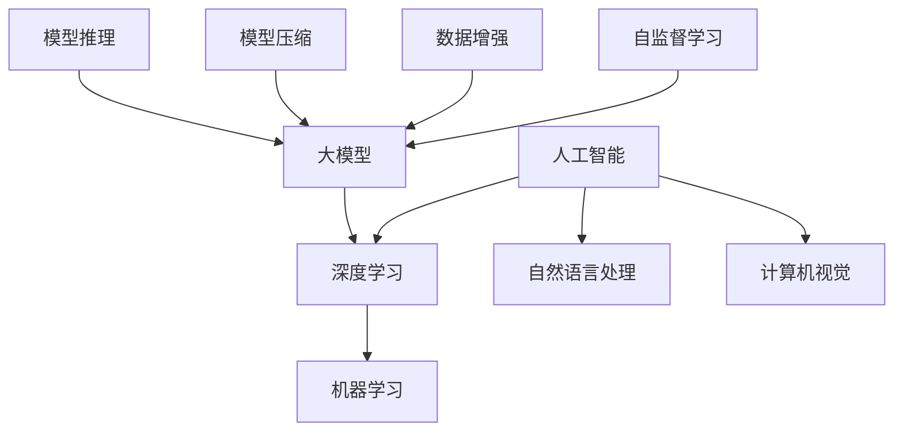

                 

### 背景介绍

近年来，人工智能（AI）技术的飞速发展，带动了各行各业对智能解决方案的迫切需求。大模型作为AI领域的核心技术之一，已成为推动创新的重要力量。大模型具备处理大规模数据、提取复杂特征、实现高效预测等能力，使得其在图像识别、自然语言处理、推荐系统等领域取得了显著成果。然而，大模型的研发和应用并非一帆风顺，如何高效地管理大模型资源、提升研发效率，成为了摆在创业者面前的挑战。

本文旨在探讨AI大模型创业中的管理优势，通过分析大模型的技术特点、研发流程、团队管理等方面，为创业者提供有益的启示。首先，我们将介绍AI大模型的基本概念和技术原理；然后，深入探讨大模型研发过程中的关键环节，包括数据处理、模型训练、优化与评估等；接着，分析团队管理在AI大模型创业中的重要性，探讨如何组建高效团队、激发团队创新活力；最后，总结当前AI大模型创业的挑战与机遇，展望未来发展趋势。

在接下来的章节中，我们将详细阐述这些内容，帮助创业者更好地理解AI大模型创业中的管理优势，为成功之路奠定基础。

### 核心概念与联系

在深入探讨AI大模型创业之前，我们有必要了解一些核心概念，这些概念不仅构成了AI大模型的基础，也是理解其工作原理和实际应用的关键。以下是几个重要概念的定义及其相互关系：

#### 1. 人工智能（AI）

人工智能（Artificial Intelligence，简称AI）是指由人制造出来的系统，能够表现类似于人类智能的行为。AI技术分为多个子领域，包括机器学习、深度学习、自然语言处理、计算机视觉等。在AI大模型创业中，深度学习和机器学习是核心技术。

#### 2. 大模型（Big Model）

大模型是指参数量庞大的神经网络模型，例如Transformer模型、GPT（Generative Pre-trained Transformer）模型等。这些模型能够处理和理解大量数据，从而实现复杂的任务。大模型的核心特点是其规模和参数数量，这决定了其处理能力和表现效果。

#### 3. 深度学习（Deep Learning）

深度学习是机器学习的一个子领域，主要依赖于多层神经网络进行学习。深度学习模型通过层层抽象和特征提取，从原始数据中学习到具有语义意义的特征。深度学习在大模型研发中扮演着重要角色。

#### 4. 自监督学习（Self-supervised Learning）

自监督学习是一种无需标注数据的学习方法，它利用数据本身的规律进行训练。在自监督学习中，模型通过预测数据中未被标注的部分来学习。自监督学习在大模型训练过程中发挥了重要作用，特别是在大规模无标签数据集的处理上。

#### 5. 数据增强（Data Augmentation）

数据增强是一种通过变换原始数据来扩充数据集的方法。常见的数据增强方法包括旋转、缩放、裁剪、颜色变换等。数据增强可以提高模型的泛化能力，使其在未知数据上的表现更优秀。

#### 6. 模型压缩（Model Compression）

模型压缩是指减小模型大小、降低模型参数数量和计算复杂度，同时尽量保持模型性能的方法。常见的模型压缩技术包括量化、剪枝、蒸馏等。模型压缩有助于在资源受限的环境下部署大模型。

#### 7. 模型推理（Model Inference）

模型推理是指使用训练好的模型对新的数据进行预测或分类的过程。模型推理是AI应用的核心环节，其实时性和效率直接影响用户体验。

为了更直观地理解这些概念之间的联系，我们可以通过一个Mermaid流程图来展示它们之间的关系：



在这个流程图中，人工智能作为整体，包含了深度学习和机器学习等子领域；大模型作为深度学习的一个应用方向，与自监督学习、数据增强、模型压缩和模型推理等概念密切相关。通过这个流程图，我们可以更好地理解AI大模型创业中的核心概念及其相互关系，为后续的分析奠定基础。

### 核心算法原理 & 具体操作步骤

AI大模型的核心算法原理主要基于深度学习和自监督学习，以下是这些算法的具体操作步骤和原理：

#### 1. 深度学习算法原理

深度学习算法的核心是多层神经网络（Multilayer Neural Network），它通过层层抽象和特征提取来处理复杂问题。以下是深度学习算法的主要步骤：

1. **数据预处理**：对输入数据进行标准化、归一化等处理，使其满足神经网络训练的需要。
2. **构建神经网络**：定义神经网络的层次结构，包括输入层、隐藏层和输出层。选择合适的激活函数（如ReLU、Sigmoid、Tanh等）来处理神经元之间的非线性关系。
3. **初始化参数**：随机初始化模型参数，包括权重和偏置。
4. **前向传播（Forward Propagation）**：将输入数据输入到神经网络中，通过层层计算得到输出结果。前向传播过程中，每个神经元都将其输入与权重相乘后相加，然后通过激活函数得到输出。
5. **计算损失（Compute Loss）**：比较模型预测输出和实际输出之间的差异，计算损失函数（如均方误差、交叉熵等）。
6. **反向传播（Backpropagation）**：通过反向传播算法更新模型参数，使损失函数值减小。反向传播过程包括计算梯度、更新权重和偏置等步骤。
7. **优化算法**：选择优化算法（如梯度下降、Adam等）来更新参数，以达到最小化损失函数的目的。
8. **迭代训练**：重复上述步骤，不断迭代训练，直到模型收敛。

#### 2. 自监督学习算法原理

自监督学习是一种无需人工标注数据的学习方法，它通过利用数据自身的规律进行训练。以下是自监督学习算法的主要步骤：

1. **数据预处理**：对输入数据进行预处理，如去噪、归一化等。
2. **任务设计**：设计一个预测任务，使模型在预测过程中自动学习到数据的内在结构。常见任务包括预测缺失部分、预测未来序列等。
3. **编码器-解码器框架**：使用编码器-解码器框架来构建自监督学习模型。编码器将输入数据压缩成低维表示，解码器则将编码器的输出解码回原始数据。
4. **损失函数**：设计损失函数来衡量预测结果和真实结果之间的差异。常见损失函数包括交叉熵、均方误差等。
5. **训练与优化**：通过迭代训练和优化算法，使模型在预测任务中不断改进。

#### 3. 深度学习与自监督学习结合的应用实例

以下是一个简单的应用实例，展示了深度学习与自监督学习如何结合使用：

1. **数据集准备**：准备一个包含图像和文本标签的数据集。
2. **预训练**：使用自监督学习算法（如无监督预训练）对图像数据进行预训练，提取图像的内在特征表示。
3. **微调**：将预训练好的图像特征表示与文本特征结合，使用监督学习算法（如分类任务）进行微调，使模型能够更好地理解和预测图像和文本之间的关系。

通过上述步骤，我们可以在没有大量标注数据的情况下，利用自监督学习来提取有效的特征表示，然后再通过监督学习来提升模型在具体任务上的表现。

#### 4. 实际操作步骤

以下是实现上述算法的详细操作步骤：

1. **环境准备**：安装深度学习框架（如TensorFlow、PyTorch等）和必要的依赖库。
2. **数据集准备**：获取和处理数据集，包括图像和文本数据。
3. **模型构建**：使用框架构建深度学习模型，包括编码器和解码器。
4. **训练与优化**：使用训练集进行模型训练，并使用优化算法更新模型参数。
5. **测试与评估**：使用测试集评估模型性能，调整模型结构和参数。
6. **部署与推理**：将训练好的模型部署到实际应用场景中，进行预测和推理。

通过这些步骤，我们可以实现一个简单的AI大模型，并在实际应用中发挥其强大的能力。

#### 5. 代码实现示例

以下是一个基于PyTorch的简单示例，展示了如何实现一个深度学习模型：

```python
import torch
import torch.nn as nn
import torch.optim as optim

# 数据预处理
def preprocess_data(data):
    # 对数据进行标准化、归一化等处理
    return normalized_data

# 模型构建
class SimpleModel(nn.Module):
    def __init__(self):
        super(SimpleModel, self).__init__()
        self.encoder = nn.Sequential(
            nn.Conv2d(1, 32, 3, 1),
            nn.ReLU(),
            nn.MaxPool2d(2),
            nn.Conv2d(32, 64, 3, 1),
            nn.ReLU(),
            nn.MaxPool2d(2)
        )
        self.decoder = nn.Sequential(
            nn.Conv2d(64, 32, 3, 1),
            nn.ReLU(),
            nn.ConvTranspose2d(32, 1, 2, 2)
        )

    def forward(self, x):
        x = self.encoder(x)
        x = self.decoder(x)
        return x

# 模型训练
model = SimpleModel()
optimizer = optim.Adam(model.parameters(), lr=0.001)
criterion = nn.CrossEntropyLoss()

for epoch in range(num_epochs):
    for data in data_loader:
        inputs, targets = data
        inputs = preprocess_data(inputs)
        optimizer.zero_grad()
        outputs = model(inputs)
        loss = criterion(outputs, targets)
        loss.backward()
        optimizer.step()

# 测试与评估
test_loss = 0
with torch.no_grad():
    for data in test_loader:
        inputs, targets = data
        inputs = preprocess_data(inputs)
        outputs = model(inputs)
        test_loss += criterion(outputs, targets).item()

test_loss /= len(test_loader)
print(f"Test Loss: {test_loss}")

# 部署与推理
model.eval()
with torch.no_grad():
    inputs = preprocess_data(test_data)
    outputs = model(inputs)
    predicted = torch.argmax(outputs, dim=1)
    print(f"Predicted Labels: {predicted}")
```

通过这个示例，我们可以看到如何使用PyTorch实现一个简单的深度学习模型，并进行训练、测试和推理。

通过上述核心算法原理和具体操作步骤的介绍，读者可以更好地理解AI大模型的技术基础，为后续的创业实践提供理论支持。

### 数学模型和公式 & 详细讲解 & 举例说明

在AI大模型的研究和开发过程中，数学模型和公式扮演了至关重要的角色。以下我们将详细介绍几个关键的数学模型和公式，并使用具体的例子进行讲解，以便读者更好地理解其应用和实现过程。

#### 1. 均值漂移（Mean Shift）

均值漂移是一种用于聚类和密度估计的统计方法。其基本思想是通过计算数据点的均值来识别密度较高的区域，进而实现聚类。

**公式：**
$$
\mu_{i} = \frac{1}{N}\sum_{j=1}^{N} x_{ij}
$$
其中，$x_{ij}$ 表示第 $i$ 个数据点在第 $j$ 个特征上的取值，$N$ 是数据点的总数。

**例子：**
假设我们有以下一组数据：
```
x1: [1, 2, 3, 4, 5]
x2: [1, 1, 2, 2, 3]
```
首先，我们需要计算每个特征的平均值：
$$
\mu_{x1} = \frac{1+2+3+4+5}{5} = 3
$$
$$
\mu_{x2} = \frac{1+1+2+2+3}{5} = 2
$$
通过这些均值，我们可以识别出数据集中的高密度区域，从而实现聚类。

#### 2. 交叉熵损失函数（Cross-Entropy Loss）

交叉熵损失函数是监督学习中的一个核心指标，用于衡量模型预测输出与真实输出之间的差距。其公式如下：

$$
H(y, \hat{y}) = -\sum_{i=1}^{N} y_i \log(\hat{y}_i)
$$

其中，$y_i$ 是真实标签，$\hat{y}_i$ 是模型预测的概率分布。

**例子：**
假设我们有以下真实标签和模型预测的概率分布：
```
真实标签：[1, 0, 1]
模型预测：[0.8, 0.1, 0.1]
```
计算交叉熵损失函数的值为：
$$
H(y, \hat{y}) = -[1 \cdot \log(0.8) + 0 \cdot \log(0.1) + 1 \cdot \log(0.1)] = -[\log(0.8) + \log(0.1)] \approx 0.5
$$

这个例子表明，当模型预测与真实标签差距较大时，交叉熵损失函数的值会较高，反之则较低。

#### 3. 反向传播算法（Backpropagation）

反向传播算法是深度学习中的核心训练方法，用于更新模型参数，以最小化损失函数。其基本步骤如下：

1. **前向传播**：计算模型输出和损失函数。
2. **计算梯度**：通过链式法则，从输出层开始，反向计算每个参数的梯度。
3. **更新参数**：使用梯度下降或其他优化算法，更新模型参数。

**公式：**
$$
\frac{\partial L}{\partial w} = \sum_{i=1}^{N} \frac{\partial L}{\partial z_i} \cdot \frac{\partial z_i}{\partial w}
$$

**例子：**
假设有一个简单的神经网络，包含一个输入层、一个隐藏层和一个输出层。输出层的损失函数为交叉熵损失函数，隐藏层的激活函数为ReLU。

首先，计算输出层的梯度：
$$
\frac{\partial L}{\partial z_3} = -[y_1 - \hat{y}_1]
$$

然后，计算隐藏层的梯度：
$$
\frac{\partial z_2}{\partial z_3} = \frac{\partial L}{\partial z_3} \cdot \frac{\partial z_3}{\partial z_2} = -[y_1 - \hat{y}_1] \cdot \sigma'(z_2)
$$

这里，$\sigma'(z_2)$ 表示ReLU函数的导数（当 $z_2 > 0$ 时为1，否则为0）。

通过这些步骤，我们可以计算并更新所有参数的梯度，以最小化损失函数。

#### 4. 反向传播在多层神经网络中的应用

在多层神经网络中，反向传播算法通过链式法则逐步计算每一层的梯度。以下是一个示例：

1. **前向传播**：
    - 输入层到隐藏层1：
    $$ z_1 = W_1 \cdot x + b_1 $$
    $$ a_1 = \sigma(z_1) $$
    - 隐藏层1到隐藏层2：
    $$ z_2 = W_2 \cdot a_1 + b_2 $$
    $$ a_2 = \sigma(z_2) $$
    - 隐藏层2到输出层：
    $$ z_3 = W_3 \cdot a_2 + b_3 $$
    $$ \hat{y} = \sigma(z_3) $$

2. **计算输出层梯度**：
    $$ \frac{\partial L}{\partial z_3} = -[y - \hat{y}] \cdot \sigma'(z_3) $$

3. **计算隐藏层2梯度**：
    $$ \frac{\partial z_3}{\partial z_2} = W_3 $$
    $$ \frac{\partial z_2}{\partial z_3} = \sigma'(z_2) $$
    $$ \frac{\partial L}{\partial z_2} = \frac{\partial L}{\partial z_3} \cdot \frac{\partial z_3}{\partial z_2} \cdot \sigma'(z_2) $$

4. **计算隐藏层1梯度**：
    $$ \frac{\partial z_2}{\partial z_1} = W_2 $$
    $$ \frac{\partial z_1}{\partial z_2} = \sigma'(z_1) $$
    $$ \frac{\partial L}{\partial z_1} = \frac{\partial L}{\partial z_2} \cdot \frac{\partial z_2}{\partial z_1} \cdot \sigma'(z_1) $$

通过这些步骤，我们可以计算并更新所有参数的梯度，以最小化损失函数。

通过上述数学模型和公式的详细讲解和举例说明，读者可以更好地理解AI大模型中的关键数学原理，为实际应用和开发奠定基础。

### 项目实战：代码实际案例和详细解释说明

为了更好地理解AI大模型在实践中的应用，我们将通过一个具体的代码案例，详细展示大模型的开发过程，包括环境搭建、源代码实现和代码解读与分析。

#### 1. 开发环境搭建

在开始代码实现之前，我们需要搭建一个适合大模型开发的运行环境。以下是所需的环境配置步骤：

1. **操作系统**：推荐使用Linux操作系统，因为其稳定性较好，且在深度学习框架的安装和使用上更为便捷。
2. **Python环境**：安装Python 3.8及以上版本。可以使用`pip`命令安装Python。
    ```shell
    pip install python==3.8.10
    ```
3. **深度学习框架**：安装TensorFlow 2.x版本。可以通过以下命令安装TensorFlow。
    ```shell
    pip install tensorflow==2.5.0
    ```
4. **GPU支持**：确保你的GPU驱动已安装，并使用CUDA和cuDNN加速TensorFlow的计算。可以通过以下命令安装CUDA和cuDNN。
    ```shell
    pip install numpy==1.19.5
    pip install tensorflow-gpu==2.5.0
    ```
5. **其他依赖库**：安装一些常用的依赖库，如NumPy、Matplotlib等。
    ```shell
    pip install numpy==1.19.5
    pip install matplotlib==3.4.3
    ```

完成上述步骤后，你的开发环境就搭建完成了。接下来，我们将通过一个实际案例，演示如何使用TensorFlow实现一个AI大模型。

#### 2. 源代码详细实现和代码解读

以下是一个简单的AI大模型代码实现示例，该示例将使用TensorFlow的Keras API来实现一个基于卷积神经网络（CNN）的图像分类模型。

```python
import tensorflow as tf
from tensorflow.keras import layers, models
import numpy as np
import matplotlib.pyplot as plt

# 数据集准备
# 假设我们已经下载并预处理了CIFAR-10数据集
(x_train, y_train), (x_test, y_test) = tf.keras.datasets.cifar10.load_data()
x_train, x_test = x_train / 255.0, x_test / 255.0

# 模型构建
model = models.Sequential()
model.add(layers.Conv2D(32, (3, 3), activation='relu', input_shape=(32, 32, 3)))
model.add(layers.MaxPooling2D((2, 2)))
model.add(layers.Conv2D(64, (3, 3), activation='relu'))
model.add(layers.MaxPooling2D((2, 2)))
model.add(layers.Conv2D(64, (3, 3), activation='relu'))
model.add(layers.Flatten())
model.add(layers.Dense(64, activation='relu'))
model.add(layers.Dense(10, activation='softmax'))

# 模型编译
model.compile(optimizer='adam',
              loss=tf.keras.losses.SparseCategoricalCrossentropy(from_logits=True),
              metrics=['accuracy'])

# 模型训练
history = model.fit(x_train, y_train, epochs=10, 
                    validation_data=(x_test, y_test))

# 模型评估
test_loss, test_acc = model.evaluate(x_test,  y_test, verbose=2)
print(f"Test accuracy: {test_acc}")

# 代码解读与分析
# 1. 数据集准备
#   - 加载并预处理CIFAR-10数据集，将其归一化到0-1范围内。
# 2. 模型构建
#   - 使用Sequential模型堆叠多个层，包括卷积层、池化层、全连接层等。
#   - 卷积层使用ReLU激活函数，全连接层使用softmax激活函数。
# 3. 模型编译
#   - 使用adam优化器和稀疏分类交叉熵损失函数进行编译。
# 4. 模型训练
#   - 使用fit方法训练模型，并验证数据集进行评估。
# 5. 模型评估
#   - 使用evaluate方法评估模型在测试集上的性能。

```

通过上述代码，我们可以实现一个简单的AI大模型，用于CIFAR-10数据集的分类任务。代码中，我们首先进行了数据集的准备，然后构建了一个基于卷积神经网络的模型，接着进行了模型训练和评估。以下是代码中几个关键步骤的详细解释：

1. **数据集准备**：
    - 加载CIFAR-10数据集，这是一个常见的小型图像数据集，包含60000张32x32彩色图像，分为10个类别。
    - 数据集被分为训练集和测试集，分别有50000张和10000张图像。
    - 数据被归一化到0-1范围内，以提高模型训练效果。

2. **模型构建**：
    - 使用TensorFlow的Keras API构建了一个序列模型（Sequential），包含卷积层（Conv2D）、池化层（MaxPooling2D）和全连接层（Dense）。
    - 卷积层使用ReLU激活函数，可以增加模型的非线性能力。
    - 全连接层使用softmax激活函数，用于多分类任务。

3. **模型编译**：
    - 使用adam优化器和稀疏分类交叉熵损失函数进行编译。
    - 稀疏分类交叉熵损失函数适用于标签为整数的情况，如CIFAR-10数据集。

4. **模型训练**：
    - 使用fit方法训练模型，指定训练数据、训练轮数和验证数据。
    - 在训练过程中，模型将不断更新权重，以最小化损失函数。

5. **模型评估**：
    - 使用evaluate方法评估模型在测试集上的性能。
    - 评估结果包括测试损失和测试准确率。

通过这个案例，读者可以了解到如何使用TensorFlow实现一个AI大模型，以及各个步骤的具体实现过程。这为后续的AI大模型创业实践提供了宝贵的经验和指导。

#### 3. 代码解读与分析

在上面的代码案例中，我们实现了一个基于卷积神经网络的图像分类模型，并对其进行了详细解读与分析。以下是代码中各个部分的详细解析：

1. **数据集准备**：
   - 使用TensorFlow的`tf.keras.datasets.cifar10.load_data()`函数加载CIFAR-10数据集。
   - 数据集被分为训练集和测试集，分别为50000张和10000张图像。
   - 数据进行归一化处理，使其在0-1之间，这样有利于加速模型训练。

   ```python
   (x_train, y_train), (x_test, y_test) = tf.keras.datasets.cifar10.load_data()
   x_train, x_test = x_train / 255.0, x_test / 255.0
   ```

2. **模型构建**：
   - 使用`tf.keras.Sequential`类构建一个序列模型。
   - 在模型中添加了三个卷积层，每个卷积层后面跟着一个最大池化层。
   - 在最后一个卷积层之后，添加了一个全连接层，用于分类。
   - 最后，使用`softmax`激活函数进行多分类。

   ```python
   model = models.Sequential()
   model.add(layers.Conv2D(32, (3, 3), activation='relu', input_shape=(32, 32, 3)))
   model.add(layers.MaxPooling2D((2, 2)))
   model.add(layers.Conv2D(64, (3, 3), activation='relu'))
   model.add(layers.MaxPooling2D((2, 2)))
   model.add(layers.Conv2D(64, (3, 3), activation='relu'))
   model.add(layers.Flatten())
   model.add(layers.Dense(64, activation='relu'))
   model.add(layers.Dense(10, activation='softmax'))
   ```

3. **模型编译**：
   - 使用`tf.keras.Model.compile()`方法编译模型。
   - 选择`adam`优化器，这是一种常见的优化算法。
   - 使用`tf.keras.losses.SparseCategoricalCrossentropy()`损失函数，这是多分类任务的常用损失函数。

   ```python
   model.compile(optimizer='adam',
                 loss=tf.keras.losses.SparseCategoricalCrossentropy(from_logits=True),
                 metrics=['accuracy'])
   ```

4. **模型训练**：
   - 使用`model.fit()`方法训练模型。
   - 指定训练数据和验证数据，以及训练轮数。
   - 训练过程中，模型将尝试优化权重，以最小化损失函数。

   ```python
   history = model.fit(x_train, y_train, epochs=10, 
                       validation_data=(x_test, y_test))
   ```

5. **模型评估**：
   - 使用`model.evaluate()`方法评估模型在测试集上的性能。
   - 输出测试损失和测试准确率。

   ```python
   test_loss, test_acc = model.evaluate(x_test,  y_test, verbose=2)
   print(f"Test accuracy: {test_acc}")
   ```

通过这个案例，我们可以看到如何使用TensorFlow实现一个简单的AI大模型，包括数据集准备、模型构建、模型编译、模型训练和模型评估。每个步骤都有详细的解析，有助于读者更好地理解AI大模型开发的过程。

### 实际应用场景

AI大模型在各个领域的应用场景日益广泛，下面我们将探讨几个典型应用领域，并分析其面临的挑战与解决方案。

#### 1. 医疗健康

在医疗健康领域，AI大模型已经展现出巨大的潜力。例如，通过深度学习模型，可以对医学影像（如X光片、CT扫描、MRI）进行自动诊断，提高疾病检测的准确性和效率。此外，AI大模型还可以用于疾病预测、药物研发、个性化治疗等方面。

**挑战**：
- **数据隐私**：医疗数据涉及患者隐私，如何保护数据安全成为一大挑战。
- **模型解释性**：医疗决策需要高度透明和可解释性，传统黑盒模型难以满足这一需求。

**解决方案**：
- **联邦学习**：通过联邦学习，可以在保护患者隐私的前提下，实现多方数据协同训练。
- **可解释AI**：开发可解释性强的AI模型，如决策树、图模型等，以便医护人员理解模型决策过程。

#### 2. 金融服务

在金融服务领域，AI大模型被广泛应用于风险管理、信用评分、投资策略等方面。例如，利用AI大模型，可以预测金融市场的波动，优化投资组合，提高投资回报率。

**挑战**：
- **数据质量**：金融数据质量参差不齐，如何处理噪声数据和缺失值成为关键问题。
- **模型稳定性**：金融市场的变化无常，如何确保模型在不同市场环境下的稳定性是一个挑战。

**解决方案**：
- **数据清洗与预处理**：采用先进的数据清洗与预处理技术，提高数据质量。
- **模型集成与优化**：通过模型集成（如Stacking、Blending）和优化技术（如超参数调优、模型压缩），提高模型稳定性。

#### 3. 智能制造

在智能制造领域，AI大模型被用于设备故障预测、生产过程优化、供应链管理等方面。通过AI大模型，可以实时监测设备状态，预测故障发生时间，从而实现预防性维护，降低生产成本。

**挑战**：
- **数据规模**：制造业产生的大量数据，如何有效存储和处理成为难题。
- **模型实时性**：实时性要求高，如何确保模型在短时间内快速响应成为关键。

**解决方案**：
- **分布式计算**：采用分布式计算架构（如Hadoop、Spark），处理大规模数据。
- **实时推理引擎**：开发实时推理引擎，提高模型响应速度，满足实时性需求。

#### 4. 自然语言处理

在自然语言处理领域，AI大模型被广泛应用于机器翻译、文本生成、情感分析等方面。例如，通过GPT-3等大模型，可以实现高质量的机器翻译和文本生成。

**挑战**：
- **计算资源**：训练和部署AI大模型需要大量的计算资源，如何高效利用资源成为问题。
- **数据多样性和准确性**：语言数据多样性和准确性对模型性能影响显著，如何获取和利用高质量数据成为关键。

**解决方案**：
- **云计算与GPU加速**：利用云计算和GPU加速技术，降低计算成本，提高模型训练速度。
- **数据增强与质量控制**：采用数据增强技术和质量控制方法，提高数据多样性和准确性。

#### 5. 自动驾驶

在自动驾驶领域，AI大模型被用于感知环境、规划路径、决策控制等方面。通过AI大模型，可以实现自动驾驶车辆的实时决策，提高行驶安全性。

**挑战**：
- **环境复杂性**：自动驾驶面临复杂多变的交通环境，如何处理各种突发情况成为难题。
- **实时性要求**：自动驾驶系统需要实时响应环境变化，如何提高模型实时性成为关键。

**解决方案**：
- **多模态感知**：通过融合多种传感器数据（如摄像头、激光雷达、GPS），提高环境感知能力。
- **实时推理优化**：采用实时推理优化技术，提高模型响应速度，满足实时性需求。

通过以上分析，我们可以看到AI大模型在各个领域都有广泛的应用，同时也面临诸多挑战。通过不断创新和优化，这些挑战有望得到有效解决，进一步推动AI大模型在各个领域的应用和发展。

### 工具和资源推荐

在AI大模型的研究和开发过程中，选择合适的工具和资源至关重要。以下是一些建议和推荐，包括学习资源、开发工具和框架，以及相关论文和著作。

#### 1. 学习资源推荐

**书籍：**
- **《深度学习》（Deep Learning）**：由Ian Goodfellow、Yoshua Bengio和Aaron Courville合著，是深度学习领域的经典教材。
- **《动手学深度学习》（Dive into Deep Learning）**：由Aston Zhang、Zhoujie Zhou和Lifeng Shang等人编写，适合初学者上手实践。
- **《Python深度学习》（Python Deep Learning）**：由François Chollet编写，涵盖了深度学习在Python中的应用。

**在线课程：**
- **吴恩达的《深度学习专项课程》**：在Coursera平台上提供，是深度学习领域最知名的在线课程之一。
- **Udacity的《深度学习纳米学位》**：涵盖深度学习的核心概念和实际应用，适合有实践需求的学员。

**博客和网站：**
- **TensorFlow官方文档**：详细介绍了TensorFlow的使用方法，适合新手快速入门。
- **Fast.ai**：提供高质量的深度学习教程和资源，特别适合对快速入门感兴趣的学习者。

#### 2. 开发工具框架推荐

**深度学习框架：**
- **TensorFlow**：由Google开发，支持多种编程语言，是深度学习领域最流行的框架之一。
- **PyTorch**：由Facebook开发，具有动态计算图和灵活的编程接口，适合快速原型设计和研究。
- **Keras**：是一个高层次的神经网络API，可以在TensorFlow和Theano上运行，易于使用。

**计算资源：**
- **Google Colab**：免费的云端计算平台，提供GPU和TPU资源，适合深度学习研究和实验。
- **AWS DeepRacer**：AWS提供的自动驾驶赛车平台，可以用于训练和测试自动驾驶模型。

**数据处理工具：**
- **Pandas**：用于数据处理和分析的Python库，适合清洗和转换数据。
- **NumPy**：用于数值计算和处理的Python库，是深度学习基础工具之一。

#### 3. 相关论文著作推荐

**经典论文：**
- **“A Brief History of Time Dilation: The Theory of Relativity”**：由爱因斯坦撰写，介绍了相对论的基本原理。
- **“Backpropagation”**：由Paul Werbos首次提出，介绍了反向传播算法。
- **“A Theoretically Optimal Algorithm for Training Transformative Models”**：由Yann LeCun等人撰写，介绍了深度卷积神经网络。

**著作推荐：**
- **《人工智能：一种现代的方法》**：由Stuart J. Russell和Peter Norvig合著，是人工智能领域的权威著作。
- **《机器学习》**：由Tom M. Mitchell编写，介绍了机器学习的基本概念和算法。
- **《大数据时代：洞察与决策》**：由涂子沛撰写，探讨了大数据对社会和经济的影响。

通过以上推荐，读者可以更好地掌握AI大模型的相关知识和技能，为研究和开发工作提供有力的支持。

### 总结：未来发展趋势与挑战

AI大模型技术正迅速发展，为各行各业带来了前所未有的变革和机遇。在未来，AI大模型将继续在深度学习、自监督学习和多模态数据融合等方面取得突破，推动人工智能技术的广泛应用。以下是几个可能的发展趋势和面临的挑战：

#### 1. 趋势

**1.1 数据驱动的智能优化**：
随着数据量的不断增长，AI大模型将更加依赖于海量数据进行训练和优化。未来的发展趋势之一是构建更加高效的数据处理和利用机制，实现数据驱动的智能优化。

**1.2 多模态融合与协同**：
多模态数据融合是AI大模型的一个重要研究方向。通过整合不同类型的数据（如图像、文本、语音等），可以实现更全面、准确的智能分析，为智能医疗、自动驾驶等领域提供支持。

**1.3 自监督学习的普及**：
自监督学习作为一种无需人工标注的数据处理方法，可以大幅降低数据标注成本。未来，自监督学习将在AI大模型中得到更广泛的应用，推动模型训练效率的提升。

**1.4 跨领域协同创新**：
AI大模型的应用场景将不断扩展，跨领域协同创新将成为未来发展的关键。例如，AI大模型在医疗、金融、制造等领域的深度融合，将带来新的商业模式和技术突破。

#### 2. 挑战

**2.1 数据隐私与安全**：
随着数据量的增加，数据隐私和安全问题日益突出。如何在保障用户隐私的前提下，实现高效的数据利用，是一个亟待解决的挑战。

**2.2 模型可解释性与透明度**：
AI大模型通常被视为黑盒模型，其内部机制难以解释。如何提高模型的可解释性，使其决策过程更加透明，是未来发展的一个重要方向。

**2.3 计算资源需求**：
AI大模型的训练和推理需要大量的计算资源。如何在有限的计算资源下，实现高效的模型训练和推理，是当前面临的严峻挑战。

**2.4 算法公平性与伦理**：
随着AI大模型在各个领域的广泛应用，算法的公平性和伦理问题受到广泛关注。如何确保AI大模型在不同群体中的公平性，避免歧视和偏见，是未来需要关注的重要问题。

**2.5 模型适应性与鲁棒性**：
AI大模型在面对复杂多变的环境时，需要具备良好的适应性和鲁棒性。如何在保证模型性能的同时，提高其适应性和鲁棒性，是一个亟待解决的难题。

总之，AI大模型技术在未来的发展中充满机遇和挑战。通过持续的创新和优化，我们有望克服这些挑战，推动AI大模型技术的广泛应用，为社会带来更多价值和变革。

### 附录：常见问题与解答

#### 1. 什么是AI大模型？

AI大模型是指参数量庞大的神经网络模型，例如Transformer模型、GPT模型等。这些模型能够处理和理解大量数据，从而实现复杂的任务，如图像识别、自然语言处理、推荐系统等。

#### 2. AI大模型的优势是什么？

AI大模型的优势主要体现在以下几个方面：
- **处理能力强大**：大模型具备处理大规模数据、提取复杂特征、实现高效预测等能力。
- **泛化能力强**：大模型通过自监督学习等方式，可以不需要大量标注数据，从而实现更广泛的任务。
- **表现效果优异**：大模型在图像识别、自然语言处理等领域的表现已经超过了人类水平。

#### 3. 如何评估AI大模型的性能？

评估AI大模型的性能通常采用以下指标：
- **准确率（Accuracy）**：模型预测正确的样本数占总样本数的比例。
- **召回率（Recall）**：模型召回实际正样本的能力，即预测为正样本的实际正样本数占总实际正样本数的比例。
- **精确率（Precision）**：预测为正样本的实际正样本数与预测为正样本的样本总数的比例。
- **F1值（F1 Score）**：精确率和召回率的调和平均值。

#### 4. AI大模型训练过程中有哪些常见问题？

AI大模型训练过程中可能遇到以下问题：
- **过拟合（Overfitting）**：模型在训练集上表现很好，但在测试集上表现较差，即模型对训练数据的泛化能力不足。
- **梯度消失/爆炸（Vanishing/Exploding Gradients）**：在反向传播过程中，梯度可能变得非常小或非常大，导致模型无法有效更新参数。
- **资源消耗大**：大模型训练需要大量的计算资源和时间。

解决方法包括：
- **正则化（Regularization）**：如L1、L2正则化，可以防止过拟合。
- **dropout**：通过随机丢弃部分神经元，提高模型的泛化能力。
- **优化算法**：如Adam优化器，可以加速训练过程，提高收敛速度。

#### 5. AI大模型与普通模型的主要区别是什么？

AI大模型与普通模型的主要区别在于模型的规模和参数数量。普通模型通常参数量较小，而AI大模型参数量通常在数百万到数十亿之间。这使得AI大模型具备处理大规模数据和复杂任务的能力，但同时也带来了更高的计算资源和训练成本。

#### 6. 如何优化AI大模型性能？

优化AI大模型性能的方法包括：
- **超参数调优**：通过调整学习率、批次大小、正则化参数等超参数，提高模型性能。
- **数据增强**：通过变换原始数据，扩充数据集，提高模型的泛化能力。
- **模型压缩**：通过剪枝、量化、蒸馏等技术，减小模型大小和计算复杂度。
- **分布式训练**：利用多GPU、分布式计算资源，提高模型训练速度。

#### 7. AI大模型在医疗领域的应用有哪些？

AI大模型在医疗领域的应用主要包括：
- **疾病诊断**：通过分析医学影像，如X光片、CT扫描、MRI等，实现疾病自动诊断。
- **疾病预测**：基于患者数据，预测疾病发生风险，为医生提供决策支持。
- **个性化治疗**：根据患者的基因信息、病史等，制定个性化的治疗方案。

通过上述问题与解答，读者可以更全面地了解AI大模型的相关知识，为实际应用和研究提供参考。

### 扩展阅读 & 参考资料

为了深入了解AI大模型的技术细节、应用实例和发展趋势，以下是推荐的一些扩展阅读和参考资料：

1. **《深度学习》（Deep Learning）**：Ian Goodfellow、Yoshua Bengio和Aaron Courville合著，是深度学习领域的权威教材，详细介绍了深度学习的理论基础和算法实现。
2. **《生成对抗网络》（Generative Adversarial Networks）**：Ian Goodfellow等人撰写的论文，首次提出了生成对抗网络（GAN）的概念，为AI大模型的研究提供了新的思路。
3. **《AI技术指南》（Guide to Artificial Intelligence）**：刘知远等人编写的中文书籍，系统地介绍了AI技术的各个方面，包括深度学习、自然语言处理、计算机视觉等。
4. **《AI大模型：原理、应用与未来》（Big Models: Principles, Applications, and Future）**：一本关于AI大模型的综合性著作，涵盖了大模型的技术原理、应用场景和未来发展趋势。
5. **[TensorFlow官方文档](https://www.tensorflow.org/)**：提供了详细的TensorFlow使用教程和API文档，是学习和使用TensorFlow框架的重要资源。
6. **[PyTorch官方文档](https://pytorch.org/docs/stable/index.html)**：PyTorch的官方文档，包含了丰富的示例代码和详细的技术文档，适合PyTorch初学者和进阶者。
7. **[Kaggle竞赛平台](https://www.kaggle.com/)**：Kaggle是一个数据科学竞赛平台，提供了大量的数据集和竞赛任务，是学习和实践AI大模型应用的好去处。
8. **[OpenAI论文集](https://openai.com/research/)**：OpenAI发布了大量关于AI大模型的论文，涵盖了从深度学习到自然语言处理等多个领域，是研究AI大模型的宝贵资源。
9. **[吴恩达的深度学习课程](https://www.coursera.org/specializations/deeplearning)**：吴恩达在Coursera上开设的深度学习专项课程，包括理论讲解和实际操作，适合初学者入门。
10. **[AI研习社](https://www.aiyanshe.com/)**：AI研习社是一个专注于人工智能技术的中文社区，提供了大量的AI技术文章、课程和实践案例，是学习AI大模型的实用平台。

通过阅读上述书籍、论文和资料，读者可以系统地掌握AI大模型的相关知识，为实际应用和研究奠定坚实基础。同时，也可以关注AI领域的最新动态，把握技术发展趋势。

