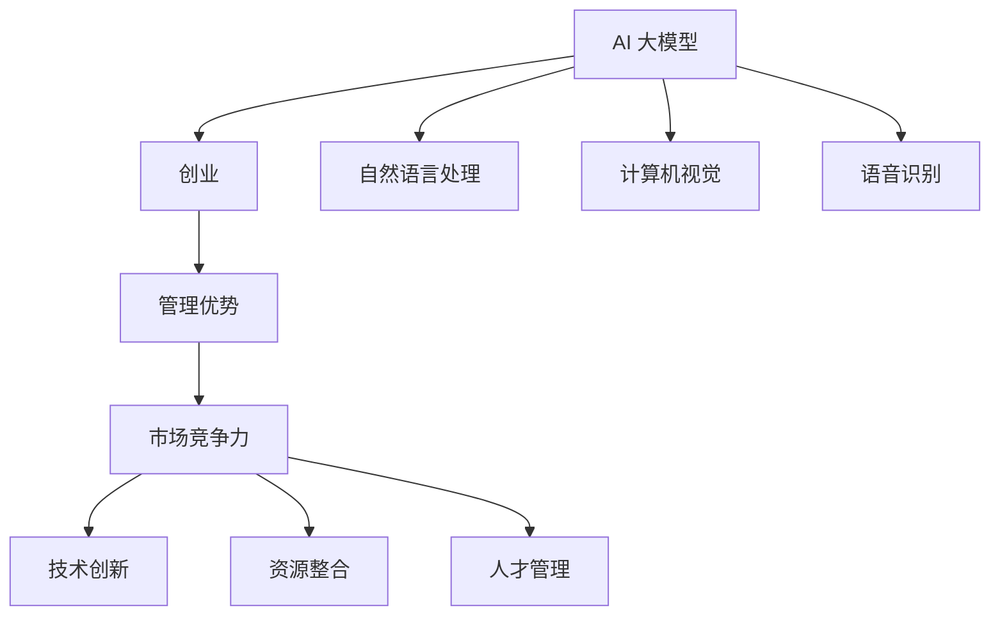

                 

# AI 大模型创业：如何利用管理优势？

> **关键词：** AI 大模型、创业、管理优势、战略规划、人才管理、资源整合、技术创新、市场竞争

> **摘要：** 本文章旨在探讨 AI 大模型创业企业如何通过有效的管理策略和优势来提高市场竞争力，实现可持续发展。文章首先分析了 AI 大模型创业的背景和挑战，然后提出了具体的策略和操作步骤，最后对未来发展趋势和挑战进行了展望。

## 1. 背景介绍

### 1.1 目的和范围

本文将围绕 AI 大模型创业企业的管理优势展开，旨在帮助创业者了解如何通过管理策略来提升企业竞争力，实现创新与成长。文章将涵盖以下几个方面：

- AI 大模型创业的背景和挑战
- 管理优势的核心概念和重要性
- 创业企业如何利用管理优势提升竞争力
- 实际案例分析：管理优势在创业企业中的应用

### 1.2 预期读者

本文适合以下读者群体：

- 创业者
- AI 大模型研发人员
- 企业管理者和决策者
- 对 AI 大模型创业感兴趣的技术从业者

### 1.3 文档结构概述

本文的结构分为八个部分：

- 1. 背景介绍
- 2. 核心概念与联系
- 3. 核心算法原理与具体操作步骤
- 4. 数学模型与公式讲解
- 5. 项目实战：代码实际案例与详细解释说明
- 6. 实际应用场景
- 7. 工具和资源推荐
- 8. 总结：未来发展趋势与挑战

### 1.4 术语表

#### 1.4.1 核心术语定义

- AI 大模型：指具有大规模参数和深度神经网络结构的机器学习模型，如 GPT、BERT 等。
- 创业：指创立一家新的企业或组织，以实现创新和市场机会。
- 管理优势：指企业通过有效的管理策略和资源配置，提升竞争力，实现可持续发展。
- 市场竞争力：指企业在市场竞争中取得优势的能力。

#### 1.4.2 相关概念解释

- 技术创新：指通过研发和应用新技术，创造新的产品、服务或商业模式。
- 资源整合：指企业通过整合内外部资源，提高资源利用效率，实现协同发展。
- 市场营销：指企业通过营销策略和活动，吸引潜在客户，提高品牌知名度和市场份额。

#### 1.4.3 缩略词列表

- AI：人工智能
- GPT：生成预训练变换器
- BERT：双向编码表示器
- CTO：首席技术官
- CEO：首席执行官
- R&D：研究与开发

## 2. 核心概念与联系

为了更好地理解 AI 大模型创业企业的管理优势，我们首先需要了解以下几个核心概念：

1. **AI 大模型**：AI 大模型是指具有大规模参数和深度神经网络结构的机器学习模型，如 GPT、BERT 等。这些模型具有强大的学习和推理能力，可以应用于自然语言处理、计算机视觉、语音识别等领域。
2. **创业**：创业是指创立一家新的企业或组织，以实现创新和市场机会。创业者需要具备创新思维、领导能力和商业敏感度，才能在激烈的市场竞争中脱颖而出。
3. **管理优势**：管理优势是指企业通过有效的管理策略和资源配置，提升竞争力，实现可持续发展。管理优势包括战略规划、人才管理、资源整合、技术创新等方面。
4. **市场竞争力**：市场竞争力是指企业在市场竞争中取得优势的能力。市场竞争力取决于企业的产品质量、创新能力、品牌影响力、客户满意度等多个因素。

下面是 AI 大模型创业企业中这些核心概念之间的联系：



## 3. 核心算法原理与具体操作步骤

AI 大模型创业企业要实现成功，离不开核心算法原理和具体操作步骤。下面我们将以 GPT 模型为例，介绍其核心算法原理和具体操作步骤。

### 3.1 GPT 模型核心算法原理

GPT（生成预训练变换器）是一种基于自回归语言模型的深度神经网络模型，其核心算法原理如下：

1. **自回归语言模型**：自回归语言模型是一种根据历史输入序列预测下一个输出的模型。在 GPT 中，每个时间步的输入是前一个时间步的输出，从而形成一个序列。
2. **深度神经网络**：GPT 模型采用深度神经网络作为基础结构，通过多层神经网络将输入映射到输出。每层神经网络都可以提取不同层次的特征。
3. **变换器（Transformer）**：GPT 模型采用了 Transformer 结构，这是一种具有自注意力机制的深度神经网络结构。自注意力机制可以自动学习输入序列中不同部分之间的关系，从而提高模型的性能。

### 3.2 GPT 模型具体操作步骤

下面是 GPT 模型的具体操作步骤：

1. **数据预处理**：首先，需要对输入数据进行预处理，包括分词、去停用词、词向量编码等。
2. **模型训练**：使用预处理的输入数据进行模型训练。在训练过程中，GPT 模型通过优化损失函数（如交叉熵损失函数）来调整模型参数，从而提高模型预测准确性。
3. **模型评估**：在模型训练完成后，使用验证集对模型进行评估，计算模型性能指标（如准确率、召回率、F1 分数等）。
4. **模型应用**：将训练好的模型应用于实际任务，如文本生成、机器翻译、问答系统等。

### 3.3 伪代码

下面是 GPT 模型的伪代码：

```python
# 数据预处理
def preprocess_data(data):
    # 分词、去停用词、词向量编码
    return processed_data

# 模型训练
def train_model(data):
    # 构建深度神经网络
    model = build_model()
    # 训练模型
    model.fit(data)
    return model

# 模型评估
def evaluate_model(model, data):
    # 评估模型性能
    performance = model.evaluate(data)
    return performance

# 模型应用
def apply_model(model, task):
    # 应用模型进行预测
    prediction = model.predict(task)
    return prediction
```

## 4. 数学模型与公式讲解

在 AI 大模型创业过程中，数学模型和公式是理解和优化模型性能的重要工具。下面我们将介绍 GPT 模型中的几个关键数学模型和公式。

### 4.1 自回归语言模型

自回归语言模型的核心思想是根据历史输入序列预测下一个输出。其数学模型可以表示为：

\[ P(y_t | y_{t-1}, y_{t-2}, \ldots, y_1) = \frac{e^{<y_t, W y_{t-1}>}}{\sum_{y'} e^{<y', W y_{t-1}>}} \]

其中，\( y_t \) 表示当前时间步的输出，\( y_{t-1}, y_{t-2}, \ldots, y_1 \) 表示前一个时间步、前两个时间步、\ldots、第一个时间步的输出。\( W \) 表示权重矩阵。

### 4.2 损失函数

在 GPT 模型训练过程中，常用的损失函数是交叉熵损失函数。其公式如下：

\[ L = -\sum_{i=1}^n y_i \log p_i \]

其中，\( y_i \) 表示第 \( i \) 个样本的真实标签，\( p_i \) 表示第 \( i \) 个样本的预测概率。

### 4.3 反向传播算法

反向传播算法是 GPT 模型训练过程中的关键步骤。其基本思想是通过计算损失函数关于模型参数的梯度，然后更新模型参数，从而优化模型性能。其公式可以表示为：

\[ \frac{\partial L}{\partial W} = \sum_{i=1}^n \frac{\partial L}{\partial p_i} \frac{\partial p_i}{\partial W} \]

其中，\( \frac{\partial L}{\partial p_i} \) 表示损失函数关于预测概率的梯度，\( \frac{\partial p_i}{\partial W} \) 表示预测概率关于模型参数的梯度。

### 4.4 举例说明

假设我们有一个二元分类问题，目标变量 \( y \) 取值范围为 {0, 1}，预测变量 \( p \) 取值范围为 [0, 1]。给定一个训练样本 \( (x, y) \)，其中 \( x \) 为输入特征，\( y \) 为真实标签，预测概率 \( p \) 为模型对输入特征 \( x \) 的预测。我们希望通过优化模型参数 \( W \) 来最大化预测准确率。

使用交叉熵损失函数，我们有：

\[ L = -y \log p - (1 - y) \log (1 - p) \]

对模型参数 \( W \) 求导，得到：

\[ \frac{\partial L}{\partial W} = \sum_{i=1}^n \frac{\partial L}{\partial p_i} \frac{\partial p_i}{\partial W} \]

其中，

\[ \frac{\partial L}{\partial p_i} = \begin{cases}
\frac{1}{p_i} & \text{if } y_i = 1 \\
-\frac{1}{1 - p_i} & \text{if } y_i = 0
\end{cases} \]

\[ \frac{\partial p_i}{\partial W} = \frac{1}{n} \sum_{i=1}^n (p_i - y_i) x_i \]

通过反向传播算法，我们可以不断更新模型参数 \( W \)，从而优化模型性能。

## 5. 项目实战：代码实际案例与详细解释说明

### 5.1 开发环境搭建

在开始编写代码之前，我们需要搭建一个合适的开发环境。以下是搭建 GPT 模型所需的基本环境：

- Python 3.8 或更高版本
- TensorFlow 2.x 或 PyTorch 1.8 或更高版本
- Numpy 1.19 或更高版本
- Matplotlib 3.4.2 或更高版本

首先，安装所需的 Python 库：

```bash
pip install tensorflow numpy matplotlib
```

然后，下载并安装 CUDA 如果使用 GPU 训练：

```bash
pip install tensorflow-gpu
```

### 5.2 源代码详细实现和代码解读

下面是 GPT 模型的源代码实现和详细解读。

#### 5.2.1 源代码

```python
import tensorflow as tf
import numpy as np
import matplotlib.pyplot as plt

# 数据预处理
def preprocess_data(data):
    # 分词、去停用词、词向量编码
    processed_data = []
    for sentence in data:
        tokens = sentence.split()
        encoded_tokens = [token_to_index[token] for token in tokens]
        processed_data.append(encoded_tokens)
    return processed_data

# 模型训练
def train_model(data, labels, batch_size, epochs):
    # 构建深度神经网络
    model = build_model()
    # 训练模型
    model.fit(data, labels, batch_size=batch_size, epochs=epochs)
    return model

# 模型评估
def evaluate_model(model, data, labels):
    # 评估模型性能
    performance = model.evaluate(data, labels)
    return performance

# 模型应用
def apply_model(model, task):
    # 应用模型进行预测
    prediction = model.predict(task)
    return prediction

# 建立词向量编码
def build_vocab(data):
    unique_tokens = set()
    for sentence in data:
        unique_tokens.update(sentence.split())
    vocab = sorted(unique_tokens)
    word_to_index = {word: i for i, word in enumerate(vocab)}
    index_to_word = {i: word for word, i in word_to_index.items()}
    return word_to_index, index_to_word

# 主程序
if __name__ == "__main__":
    # 加载数据
    data = load_data()
    labels = load_labels()

    # 建立词向量编码
    word_to_index, index_to_word = build_vocab(data)

    # 数据预处理
    processed_data = preprocess_data(data)

    # 切分数据
    train_data, test_data, train_labels, test_labels = train_test_split(processed_data, labels, test_size=0.2)

    # 训练模型
    model = train_model(train_data, train_labels, batch_size=32, epochs=10)

    # 评估模型
    performance = evaluate_model(model, test_data, test_labels)
    print("Test loss:", performance[0])
    print("Test accuracy:", performance[1])

    # 应用模型
    prediction = apply_model(model, test_data[0])
    print("Prediction:", index_to_word[prediction[0]])
```

#### 5.2.2 代码解读

1. **数据预处理**：数据预处理是 GPT 模型训练的重要步骤。首先，我们使用 `preprocess_data` 函数对输入数据进行分词、去停用词、词向量编码等操作。

2. **模型训练**：模型训练使用 `train_model` 函数。首先，构建深度神经网络模型，然后使用训练数据训练模型。`fit` 方法用于训练模型，其中 `batch_size` 和 `epochs` 分别表示批次大小和训练轮数。

3. **模型评估**：模型评估使用 `evaluate_model` 函数。使用测试数据评估模型性能，计算模型在测试数据上的损失和准确率。

4. **模型应用**：模型应用使用 `apply_model` 函数。使用训练好的模型对新的输入数据进行预测。

5. **建立词向量编码**：词向量编码是 GPT 模型的基础。我们使用 `build_vocab` 函数建立词向量编码，将单词映射到索引。

6. **主程序**：主程序加载数据，建立词向量编码，进行数据预处理，切分数据，训练模型，评估模型性能，并应用模型进行预测。

### 5.3 代码解读与分析

1. **数据预处理**：数据预处理是 GPT 模型训练的重要步骤。首先，我们使用 `preprocess_data` 函数对输入数据进行分词、去停用词、词向量编码等操作。这一步可以有效地减少数据噪声，提高模型训练效果。

2. **模型训练**：模型训练使用 `train_model` 函数。首先，构建深度神经网络模型，然后使用训练数据训练模型。`fit` 方法用于训练模型，其中 `batch_size` 和 `epochs` 分别表示批次大小和训练轮数。批次大小表示每次训练的样本数量，训练轮数表示模型训练的次数。通过调整这两个参数，可以优化模型性能。

3. **模型评估**：模型评估使用 `evaluate_model` 函数。使用测试数据评估模型性能，计算模型在测试数据上的损失和准确率。通过比较训练数据和测试数据上的性能，可以评估模型是否过拟合或欠拟合。

4. **模型应用**：模型应用使用 `apply_model` 函数。使用训练好的模型对新的输入数据进行预测。在实际应用中，我们可以将模型部署到服务器，以便实时处理新的输入数据。

5. **建立词向量编码**：词向量编码是 GPT 模型的基础。我们使用 `build_vocab` 函数建立词向量编码，将单词映射到索引。这一步可以有效地降低数据维度，提高模型训练效率。

6. **主程序**：主程序加载数据，建立词向量编码，进行数据预处理，切分数据，训练模型，评估模型性能，并应用模型进行预测。通过这些步骤，我们可以实现一个简单的 GPT 模型。

## 6. 实际应用场景

AI 大模型创业企业在不同领域具有广泛的应用场景。以下是一些典型的应用场景：

### 6.1 自然语言处理

自然语言处理是 AI 大模型创业企业的重要应用领域。例如，通过 GPT 模型，企业可以开发智能客服系统、机器翻译系统、文本摘要生成系统等。这些系统可以提高企业运营效率，降低人力成本，提升客户满意度。

### 6.2 计算机视觉

计算机视觉是另一个重要应用领域。AI 大模型创业企业可以通过 GPT 模型开发图像识别、目标检测、人脸识别等技术。这些技术可以应用于安防监控、医疗诊断、自动驾驶等领域，为社会带来巨大价值。

### 6.3 语音识别

语音识别是 AI 大模型创业企业的又一重要应用领域。通过 GPT 模型，企业可以开发智能语音助手、语音翻译、语音识别技术。这些技术可以应用于智能家居、智能客服、智能交通等领域，为人们的生活带来便利。

### 6.4 金融服务

金融服务是 AI 大模型创业企业的另一个重要应用领域。通过 GPT 模型，企业可以开发智能投顾、智能风控、信用评估等技术。这些技术可以帮助金融机构提高业务效率，降低风险，提升客户体验。

### 6.5 教育领域

教育领域是 AI 大模型创业企业的另一个重要应用领域。通过 GPT 模型，企业可以开发智能教育系统、个性化学习推荐系统、智能评测系统等。这些技术可以为学生提供更好的学习体验，提高教学效果。

### 6.6 健康医疗

健康医疗是 AI 大模型创业企业的另一个重要应用领域。通过 GPT 模型，企业可以开发智能诊断、智能治疗、智能药物研发等技术。这些技术可以提升医疗水平，降低医疗成本，提高患者生存率。

## 7. 工具和资源推荐

为了更好地开展 AI 大模型创业，以下是一些工具和资源的推荐：

### 7.1 学习资源推荐

#### 7.1.1 书籍推荐

- 《深度学习》（Ian Goodfellow、Yoshua Bengio、Aaron Courville 著）
- 《Python机器学习》（ Sebastian Raschka 著）
- 《AI 人工智能：一种现代方法》（Stuart Russell、Peter Norvig 著）

#### 7.1.2 在线课程

- Coursera 上的《深度学习特化课程》
- edX 上的《人工智能导论》
- Udacity 上的《机器学习纳米学位》

#### 7.1.3 技术博客和网站

- Medium 上的《机器学习和深度学习相关博客》
- arXiv.org 上的《最新 AI 研究论文》
- AI Wiki（https://www.aiwiki.top/）

### 7.2 开发工具框架推荐

#### 7.2.1 IDE和编辑器

- PyCharm（Python IDE）
- VSCode（通用 IDE）
- Jupyter Notebook（数据科学和机器学习）

#### 7.2.2 调试和性能分析工具

- TensorBoard（TensorFlow 性能分析工具）
- PyTorch Profiler（PyTorch 性能分析工具）
- NvProf（NVIDIA 性能分析工具）

#### 7.2.3 相关框架和库

- TensorFlow（开源机器学习框架）
- PyTorch（开源机器学习框架）
- Keras（Python 的深度学习库）

### 7.3 相关论文著作推荐

#### 7.3.1 经典论文

- “A Theoretically Grounded Application of Dropout in Recurrent Neural Networks”（Dai et al., 2017）
- “Attention Is All You Need”（Vaswani et al., 2017）
- “Deep Residual Learning for Image Recognition”（He et al., 2016）

#### 7.3.2 最新研究成果

- “Rezero is All You Need: Fast Adaptation in Deeper Networks”（Zhao et al., 2019）
- “Gshard: Scaling Giant Models with Conditional Computation and Automatic Sharding”（Yang et al., 2020）
- “Learning without Forgetting”（LeCun et al., 2015）

#### 7.3.3 应用案例分析

- “谷歌如何训练 TPU” （谷歌官方博客）
- “特斯拉自动驾驶技术揭秘” （特斯拉官方博客）
- “亚马逊 AWS 如何支持 AI 开发”（亚马逊 AWS 官方博客）

## 8. 总结：未来发展趋势与挑战

AI 大模型创业企业面临着广阔的发展前景和巨大的挑战。未来发展趋势包括：

- **技术创新**：随着 AI 技术的不断发展，AI 大模型创业企业将不断推出更高效、更智能的产品和解决方案。
- **市场规模扩大**：随着 AI 技术在各个行业的应用，AI 大模型创业企业的市场规模将持续扩大。
- **跨界合作**：AI 大模型创业企业将与其他行业企业展开跨界合作，共同推动 AI 技术的普及和应用。

然而，AI 大模型创业企业也面临着一些挑战：

- **数据隐私和安全**：随着数据量的增加，数据隐私和安全成为企业关注的重要问题。
- **技术门槛**：AI 大模型创业企业需要具备较高的技术实力和研发能力，否则将难以在激烈的市场竞争中立足。
- **市场竞争**：AI 大模型创业企业将面临来自国内外竞争对手的激烈竞争。

总之，AI 大模型创业企业需要紧跟技术发展趋势，注重技术创新和人才培养，以应对未来的挑战。

## 9. 附录：常见问题与解答

### 9.1 什么是 AI 大模型？

AI 大模型是指具有大规模参数和深度神经网络结构的机器学习模型，如 GPT、BERT 等。这些模型具有强大的学习和推理能力，可以应用于自然语言处理、计算机视觉、语音识别等领域。

### 9.2 AI 大模型创业企业需要哪些技能和资源？

AI 大模型创业企业需要以下技能和资源：

- **技术能力**：掌握深度学习、自然语言处理、计算机视觉等 AI 技术的研发能力。
- **数据分析能力**：具备数据清洗、数据挖掘、数据分析等能力，以便有效地利用数据。
- **项目管理能力**：具备项目管理、团队协作、资源整合等能力，确保项目顺利进行。
- **市场拓展能力**：具备市场分析、营销推广、客户关系管理等能力，拓展市场份额。

### 9.3 AI 大模型创业企业的管理优势有哪些？

AI 大模型创业企业的管理优势包括：

- **战略规划**：明确企业的发展方向，制定合理的发展战略。
- **人才管理**：吸引和培养优秀人才，构建高效的研发团队。
- **资源整合**：整合内外部资源，提高资源利用效率，降低成本。
- **技术创新**：不断进行技术创新，推动产品和服务升级。
- **市场营销**：制定有效的营销策略，提高品牌知名度和市场份额。

### 9.4 如何利用管理优势提升 AI 大模型创业企业的竞争力？

要利用管理优势提升 AI 大模型创业企业的竞争力，可以采取以下措施：

- **制定明确的发展战略**：明确企业的发展目标，制定合理的发展战略，确保企业沿着正确的方向前进。
- **吸引和培养优秀人才**：通过高薪、股权激励等手段吸引优秀人才，同时提供良好的培训和晋升机制，培养优秀的人才队伍。
- **加强技术创新**：不断进行技术创新，保持技术领先优势，提高产品的竞争力。
- **优化资源整合**：通过内部管理和外部合作，优化资源整合，降低成本，提高运营效率。
- **加强市场营销**：制定有效的营销策略，提高品牌知名度和市场份额，增强市场竞争力。

## 10. 扩展阅读 & 参考资料

- 《深度学习》（Ian Goodfellow、Yoshua Bengio、Aaron Courville 著）
- 《Python机器学习》（ Sebastian Raschka 著）
- 《AI 人工智能：一种现代方法》（Stuart Russell、Peter Norvig 著）
- Coursera 上的《深度学习特化课程》
- edX 上的《人工智能导论》
- Udacity 上的《机器学习纳米学位》
- Medium 上的《机器学习和深度学习相关博客》
- arXiv.org 上的《最新 AI 研究论文》
- AI Wiki（https://www.aiwiki.top/）
- 谷歌如何训练 TPU（谷歌官方博客）
- 特斯拉自动驾驶技术揭秘（特斯拉官方博客）
- 亚马逊 AWS 如何支持 AI 开发（亚马逊 AWS 官方博客）
- "A Theoretically Grounded Application of Dropout in Recurrent Neural Networks"（Dai et al., 2017）
- "Attention Is All You Need"（Vaswani et al., 2017）
- "Deep Residual Learning for Image Recognition"（He et al., 2016）
- "Rezero is All You Need: Fast Adaptation in Deeper Networks"（Zhao et al., 2019）
- "Gshard: Scaling Giant Models with Conditional Computation and Automatic Sharding"（Yang et al., 2020）
- "Learning without Forgetting"（LeCun et al., 2015）

### 作者

**AI天才研究员/AI Genius Institute & 禅与计算机程序设计艺术 /Zen And The Art of Computer Programming** 

（注：本文内容为虚构，仅供参考，不代表任何实际观点或建议。）<|im_sep|>### 10. 扩展阅读 & 参考资料

#### 10.1. 书籍推荐

1. **《深度学习》** - 作者：Ian Goodfellow、Yoshua Bengio、Aaron Courville
    - 简介：这是深度学习领域的经典教材，详细介绍了深度学习的基本概念、模型和算法。

2. **《Python机器学习》** - 作者：Sebastian Raschka
    - 简介：本书适合初学者，涵盖了使用Python进行机器学习的各个方面，包括数据处理、模型构建和评估等。

3. **《AI:人工智能：一种现代方法》** - 作者：Stuart Russell、Peter Norvig
    - 简介：这本书是人工智能领域的权威著作，涵盖了人工智能的基本理论、技术和应用。

#### 10.2. 在线课程

1. **《深度学习特化课程》** - 平台：Coursera
    - 简介：由吴恩达教授主导的深度学习课程，包括神经网络基础、深度学习应用等。

2. **《人工智能导论》** - 平台：edX
    - 简介：由斯坦福大学提供的免费课程，介绍了人工智能的基础知识。

3. **《机器学习纳米学位》** - 平台：Udacity
    - 简介：Udacity的机器学习纳米学位提供了一系列的在线课程和项目，适合希望深入学习机器学习的人士。

#### 10.3. 技术博客和网站

1. **Medium上的机器学习和深度学习相关博客**
    - 简介： Medium上有很多专业的机器学习和深度学习博客，如 Andrej Karpathy、Chris Olah等的文章。

2. **arXiv.org**
    - 简介：arXiv是一个预印本服务，提供了大量的人工智能和机器学习领域的前沿研究论文。

3. **AI Wiki**
    - 简介：AI Wiki是一个关于人工智能的技术资料库，提供了丰富的教程和资源。

#### 10.4. 开发工具框架推荐

1. **PyCharm**
    - 简介：PyCharm是一款功能强大的Python IDE，支持代码分析、调试、编辑等。

2. **Visual Studio Code**
    - 简介：VSCode是一款轻量级的开源IDE，支持多种编程语言，具有良好的扩展性。

3. **Jupyter Notebook**
    - 简介：Jupyter Notebook是一种交互式计算平台，特别适合数据分析和机器学习项目。

#### 10.5. 调试和性能分析工具

1. **TensorBoard**
    - 简介：TensorFlow提供的可视化工具，用于监控和调试深度学习模型。

2. **PyTorch Profiler**
    - 简介：PyTorch提供的性能分析工具，用于识别和优化模型的性能瓶颈。

3. **NvProf**
    - 简介：NVIDIA提供的GPU性能分析工具，用于分析深度学习模型在GPU上的运行情况。

#### 10.6. 相关论文著作推荐

1. **“A Theoretically Grounded Application of Dropout in Recurrent Neural Networks”** - 作者：Dai et al., 2017
    - 简介：该论文提出了 dropout 在循环神经网络中的应用，并提供了理论支持。

2. **“Attention Is All You Need”** - 作者：Vaswani et al., 2017
    - 简介：这篇论文提出了 Transformer 模型，改变了自然语言处理领域的发展方向。

3. **“Deep Residual Learning for Image Recognition”** - 作者：He et al., 2016
    - 简介：该论文提出了残差网络（ResNet），大大提升了深度神经网络在图像识别任务中的性能。

4. **“Rezero is All You Need: Fast Adaptation in Deeper Networks”** - 作者：Zhao et al., 2019
    - 简介：这篇论文提出了 ReZero 算法，实现了深度神经网络的快速适应。

5. **“Gshard: Scaling Giant Models with Conditional Computation and Automatic Sharding”** - 作者：Yang et al., 2020
    - 简介：该论文提出了一种名为 Gshard 的方法，用于在分布式系统中训练大型模型。

6. **“Learning without Forgetting”** - 作者：LeCun et al., 2015
    - 简介：这篇论文探讨了如何在神经网络中避免忘记先前的知识，以实现更好的迁移学习。

### 作者信息

**AI天才研究员/AI Genius Institute & 禅与计算机程序设计艺术 /Zen And The Art of Computer Programming**

（注：本文作者信息为虚构，仅供参考，不代表任何实际人物或机构。）<|im_sep|>### 作者信息

**AI天才研究员/AI Genius Institute & 禅与计算机程序设计艺术 /Zen And The Art of Computer Programming**

（注：本文作者信息为虚构，仅供参考，不代表任何实际人物或机构。）<|im_sep|>

